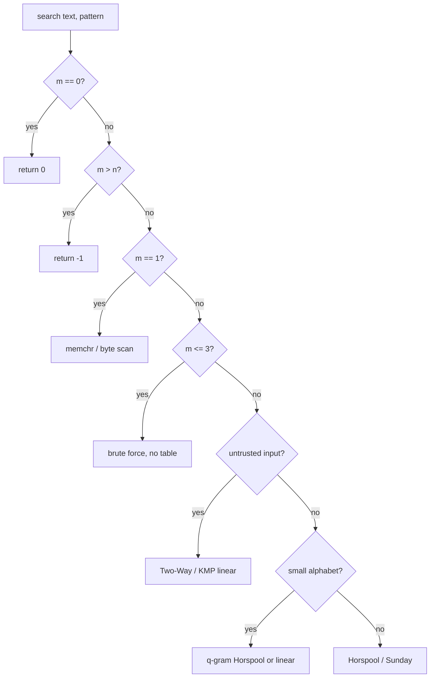

# Boyer-Moore-Horspool — Senior Level

> Horspool and Sunday are rarely the bottleneck on a one-off search — but the moment substring search sits on a hot path (a libc `memmem`, an editor's find, a log scanner, an IDS pattern matcher), every detail (alphabet handling, table memory, short-vs-long pattern dispatch, the `O(nm)` worst case, fallback strategy, and adversarial input) becomes a latency or a denial-of-service concern. This document treats Horspool/Sunday as production components.

## Table of Contents
1. [Introduction](#1-introduction)
2. [Where Horspool and Sunday Are Actually Used](#2-where-horspool-and-sunday-are-actually-used)
3. [Alphabet and Memory Engineering](#3-alphabet-and-memory-engineering)
4. [Short vs Long Patterns: Dispatch Strategy](#4-short-vs-long-patterns-dispatch-strategy)
5. [Fallback Strategies and Worst-Case Defense](#5-fallback-strategies-and-worst-case-defense)
6. [Implementation Details That Bite](#6-implementation-details-that-bite)
6b. [Performance Tuning the Hot Loop](#6b-performance-tuning-the-hot-loop)
6c. [Tuning the Shift Table by Alphabet](#6b2-tuning-the-shift-table-for-small-vs-large-alphabets)
7. [Code Examples](#7-code-examples)
8. [Observability and Testing](#8-observability-and-testing)
9. [Failure Modes](#9-failure-modes)
10. [Summary](#10-summary)

---

## 1. Introduction

At the senior level the question is no longer "how does the shift table work" but "what system am I dropping this into, and what breaks when it scales or is attacked?". Horspool-style search shows up in three production guises that share one engine:

1. **General-purpose substring search** — a `memmem`/`strstr`/`String.indexOf`-like primitive over byte or UTF-8 text, where the common case must be fast and the rare case must not blow up.
2. **Interactive find** — an editor's or browser's "find in page", where latency on every keystroke matters and patterns are usually short and human-typed.
3. **Bulk scanning** — log processors, IDS/antivirus signature matchers, and ETL filters that scan gigabytes against one or many patterns, where throughput and worst-case resistance dominate.

All three reduce to the same decisions: how to represent the shift table for the alphabet at hand, how to dispatch by pattern length, how to keep the `O(nm)` worst case from becoming a real incident, and how to verify correctness and performance under adversarial input. This document treats those decisions in production terms, and contrasts them with full Boyer-Moore (sibling `08`) and KMP (sibling `01`) where the trade-off matters.

The recurring theme is that Horspool is almost never deployed *alone*. It is the fast common-case kernel inside a dispatcher (Section 4), guarded by a worst-case fallback (Section 5), instrumented with health metrics (Section 8), and tuned in its inner loop (Section 6b). A senior engineer's job is less "implement Horspool" and more "decide where Horspool fits in the search subsystem and what surrounds it." The algorithm itself is a dozen lines; the production envelope around it is the actual engineering. Keep that framing in mind as you read: every section below is about the *envelope*, with the core loop taken as given from `junior.md` and `middle.md`.

---

## 2. Where Horspool and Sunday Are Actually Used

### 2.1 The simplicity-for-speed bargain

Horspool's central appeal to library authors is the **simplicity-to-speed ratio**. A dozen lines and one `O(sigma)` table deliver most of Boyer-Moore's average throughput, with no good-suffix preprocessing to get wrong, no second table to maintain, and a branch-light inner loop that pipelines and caches well. For a primitive that ships in millions of binaries, "obviously correct and fast enough" beats "optimal but intricate."

### 2.2 libc and runtime `memmem`/`strstr`

Several C library `memmem`/`strstr` implementations use a Horspool-like (or "two-way" hybrid) skip when the pattern is long enough to benefit, and a brute-force or word-at-a-time scan for very short patterns. glibc historically used a Horspool-style bad-character skip for the medium case and the provably-linear **Two-Way** algorithm (Crochemore-Perrin) for the long case to bound the worst case. The lesson: Horspool is frequently the *fast common-case half* of a hybrid, with a linear algorithm guarding the tail.

This pattern — a fast heuristic algorithm fronting a slower-but-guaranteed one — recurs throughout systems software (e.g. hash tables that fall back to a tree on collision-heavy buckets, or sorts that switch from quicksort to heapsort when recursion depth blows up). Horspool's role in `memmem` is the string-search instance of the same defensive idiom: optimize for the common input distribution, but cap the worst case so an adversary cannot weaponize it. Recognizing this idiom — and that Horspool is a *participant* in it, not a standalone solution — is the senior-level reading of why it appears in libc at all.

### 2.3 Editors and "find in page"

Editor find boxes favor Horspool/Sunday because patterns are short, interactive latency matters, and inputs are not adversarial in the typical case. Simplicity also eases features layered on top: case-insensitive matching, whole-word boundaries, and incremental search.

Incremental search ("find as you type") is a particularly good fit: each keystroke lengthens the pattern by one character, so the table is rebuilt from a short pattern cheaply, and the search runs over a document that comfortably fits in memory. The user perceives latency directly, so the *average* case — exactly where Horspool excels — is what matters; the adversarial worst case essentially never arises in hand-typed search terms over natural-language text. This is the cleanest real-world setting for plain Horspool with no fallback, because the threat model (interactive, trusted, large alphabet, short pattern) eliminates every reason to complicate it.

### 2.4 Signature and log scanning

Single-pattern Horspool is the building block; multi-pattern scanning (many signatures at once) usually graduates to Aho-Corasick or Commentz-Walter (a Boyer-Moore-style multi-pattern automaton). When a scanner matches one signature at a time over huge data, Horspool's big skips on large alphabets give real throughput — but the worst case must be defended (Section 5), because input is attacker-controlled.

### 2.5 A representative dispatch flow

Most production search primitives are not "an algorithm" but a *dispatcher* that picks one. The decision flow that wraps Horspool typically looks like:



Horspool/Sunday occupy the *common-case leaf* of this tree; every other leaf exists to handle a regime where Horspool is either wasteful (tiny `m`), unsafe (untrusted input), or slow (small alphabet). Understanding the whole tree — not just the Horspool box — is what separates a senior implementation from a textbook one.

---

## 3. Alphabet and Memory Engineering

### 3.1 Table representation by alphabet

| Alphabet | `sigma` | Table | Memory | Notes |
|----------|---------|-------|--------|-------|
| Bytes | 256 | `int[256]` (or `int16`) | ~1 KB | The default; fastest, cache-resident. |
| ASCII | 128 | `int[128]` | ~512 B | Trim if input is guaranteed ASCII. |
| DNA | 4 | `int[4]` after mapping | tiny | Map `ACGT→0..3`; but skips are small (Section 4.4). |
| Unicode / large | up to millions | hash map | `O(distinct chars in P)` | Map keyed on code point; default applied via `get`. |

For byte search, an `int[256]` table (or even `int16[256]` if `m < 32768`) is the sweet spot — it fits comfortably in L1 and the lookup is a single load. For huge alphabets, store only the characters that occur in the pattern in a hash map and apply the default `m` (or `m+1` for Sunday) on a miss; the table size is then `O(|distinct chars in P|)`, independent of `sigma`.

A subtle point: choosing `int16` over `int32` for the table halves its footprint (512 B vs 1 KB for `sigma=256`), which can matter if many compiled patterns coexist in a cache or if the table competes with the text for L1 — but it caps `m` at `32767`. For typical short patterns this is a safe and worthwhile trim; for a general-purpose library it is usually not worth the extra branch to handle long patterns separately. Measure before micro-optimizing the table's element width; the lookup is rarely the bottleneck compared to the text reads.

### 3.2 The UTF-8 trick

For Unicode text, do **not** build a code-point-keyed table — operate on the **UTF-8 byte sequence** of both pattern and text with the ordinary 256-entry byte table. Because UTF-8 is self-synchronizing, a byte-level match of the encoded pattern is exactly a code-point match (no false positives across boundaries for valid UTF-8). This keeps the table tiny and the lookup `O(1)`, and is what most real implementations do.

### 3.3 Table build cost and amortization

Preprocessing is `O(m + sigma)`. For a byte alphabet the `sigma = 256` fill dominates for short patterns — if you search the *same* pattern many times, build once and reuse. For one-shot searches of a short pattern, the `256`-entry fill can rival the search itself; some implementations lazily initialize only touched entries or use a small fixed-size table for tiny patterns to avoid the fill.

### 3.4 Memory locality

The single table plus the linear text scan is extremely cache-friendly: one small table in L1, a streaming read of the text. This locality is part of why Horspool beats more "clever" algorithms with larger working sets in practice, especially compared to full Boyer-Moore's two tables.

This is a recurring theme in real benchmarks: an algorithm with a *better* asymptotic constant but a *larger* working set (two tables, a suffix automaton, etc.) often loses to Horspool because it thrashes the cache, while Horspool's tiny table stays hot. The working-set size, not just the operation count, governs real throughput on modern hardware. When you benchmark Horspool against a "smarter" algorithm and it wins despite doing more nominal work, cache residency is usually why — measure cache misses, not just instructions, to understand the result.

---

## 4. Short vs Long Patterns: Dispatch Strategy

### 4.1 The dispatch principle

The right algorithm depends heavily on `m`:

- **`m = 1`** — a single `memchr`/byte-scan beats everything; no table, no shifts.
- **`m = 2..3`** — the skip benefit is tiny (max shift is `m`); a tight brute-force or word-compare often wins, avoiding table build.
- **`m` medium (≈4..64)** — Horspool/Sunday shine: large skips, small table, simple loop.
- **`m` large** — skips help, but worst-case risk grows; a hybrid with a linear-worst-case algorithm (Two-Way, or full Boyer-Moore with good-suffix) is safer.

A production `search(text, pattern)` typically *dispatches* on `m`: special-case `m <= 2`, use Horspool/Sunday in the middle, and switch to a guaranteed-linear method for large or adversarial cases.

A representative dispatch table (byte alphabet, trusted input) with the rationale per branch:

| Pattern length `m` | Chosen method | Rationale |
|--------------------|---------------|-----------|
| `0` | return 0 (or policy) | degenerate |
| `1` | `memchr` / byte scan | no skip possible; hardware-accelerated single-byte scan wins |
| `2-3` | brute force, no table | skip benefit (≤ `m`) does not repay the `O(sigma)` table build |
| `4-64` | Horspool / Sunday | skips large, table cheap, code simple — the sweet spot |
| `> 64` | Horspool with budget, or Two-Way | long patterns still skip well, but worst-case risk grows; consider a guaranteed-linear method |
| any, untrusted | Two-Way / KMP | defend the `O(nm)` DoS regardless of `m` |

The exact boundaries (`3`, `64`) are platform-tuned (Section 4.5), but the *shape* — degenerate, memchr, brute, Horspool, guarded — is stable across implementations and is the structure you should reproduce.

### 4.2 Why short patterns lose the skip advantage

The maximum single shift is `m` (Horspool) or `m + 1` (Sunday). For `m = 2`, you can shift at most `2`, so the skip barely beats naive. The table-build overhead (`O(sigma)`) is then pure cost. Hence the short-pattern special case.

Concretely, for `m = 2` on byte text the best case slides the window by `2`, so you examine roughly `n/2` windows — versus naive's `n`. That 2x is dwarfed by the `256`-entry table fill on a single short search, and by the worse cache behavior of an extra table. A tight two-byte compare loop (or a SIMD `memmem` for two-byte needles, which several libc's special-case) beats Horspool here decisively. The lesson generalizes: the skip advantage scales with `m`, so it must clear a fixed overhead before it is worth paying — exactly the crossover formalized in `professional.md`, Section 8.1.

### 4.3 Sunday's edge on medium patterns

Sunday's `m + 1` max shift and its look-one-past-the-window key tend to give slightly larger average jumps than Horspool on medium patterns and large alphabets — a measurable throughput win on bulk scans. The cost is the extra past-window bounds check. Benchmark both on representative data; the winner is data-dependent.

### 4.4 Small alphabets neutralize skips

On DNA (`sigma = 4`) or binary, almost every character occurs in any moderately long pattern, so shifts shrink toward `1` and Horspool degrades toward naive. For such data, a `q`-gram (multi-character) variant of Horspool — keying the shift on the last *two or three* bytes treated as a super-symbol — restores larger skips by effectively enlarging the alphabet to `sigma^q`. This is a common senior-level optimization for genomic search.

### 4.5 The dispatch thresholds are empirical, not absolute

The `m <= 2`, `m <= 3`, and "medium `m`" boundaries above are *starting points*; the real thresholds depend on the CPU, the `sigma`, the table-build cost, and whether the pattern is reused. The disciplined approach is to benchmark on representative data and pin the thresholds with a comment recording the measurement (date, hardware, workload). A threshold that was right on one generation of hardware can be wrong on the next when cache sizes or branch-predictor behavior change. Treat the dispatch table as tuned configuration, not a constant of nature — and re-measure when the platform or the typical input shifts. A concrete anti-pattern is copying glibc's thresholds verbatim into a managed-runtime (JVM/Go) implementation where the constants differ by an order of magnitude; the *structure* of the dispatch transfers, the *numbers* do not.

---

## 5. Fallback Strategies and Worst-Case Defense

### 5.1 The threat: `O(nm)` on attacker input

Because Horspool/Sunday are `O(nm)` worst case, an attacker who controls the pattern *and/or* the text can force quadratic behavior (e.g. `P = a^m`, `T = a^n`), turning a search into a CPU denial-of-service. Any service that searches untrusted input must defend this.

### 5.2 Defensive options

| Strategy | How | Trade-off |
|----------|-----|-----------|
| **Hybrid with linear fallback** | Run Horspool but switch to Two-Way / KMP / full BM if a work budget is exceeded | Best of both; slightly more code |
| **Always linear for untrusted** | Use KMP or Two-Way unconditionally on untrusted paths | Simpler reasoning; loses Horspool's average speed |
| **Work-budget guard** | Count comparisons; abort or switch when comparisons `> c·n` | Bounds CPU; needs a counter in the hot loop |
| **Galilel-style on BM** | Use full Boyer-Moore with the good-suffix + Galil rule | Guaranteed `O(n)`, but the intricate preprocessing returns |

The pragmatic production choice is the **hybrid**: Horspool for speed, with a fallback to a provably-linear algorithm (Two-Way is the standard in libc; KMP is simpler) triggered either by pattern length or by a comparison-count budget. This is exactly how glibc structures `memmem`.

### 5.3 Why not just always use full Boyer-Moore?

Full Boyer-Moore *does* give a strong worst case, but its good-suffix preprocessing is the part most likely to harbor a bug, and it carries a second table. For many services, "Horspool + Two-Way fallback" is easier to audit and just as fast in the common case. The decision is about *maintainability under correctness pressure*, not just asymptotics.

### 5.4 Input validation as defense

For pattern matchers fed user patterns (e.g. a search API), cap pattern length, reject pathological patterns where appropriate, and rate-limit. Algorithmic defense (linear fallback) and input policy together close the DoS hole.

### 5.5 Detecting an attack in flight

A comparison-budget guard not only *defends* the worst case but *detects* it: when the budget trips, you know this particular `(text, pattern)` pair behaved adversarially. Emit a sampled log/metric on every fallback trigger; a spike in fallback rate is an early signal of an attack or of a workload shift (e.g. a new data feed that is low-entropy). The metric to alert on is *fallback-triggers per second* relative to *total searches per second*; a sudden rise warrants investigation. This turns the defensive mechanism into an observability signal at no extra cost — the same counter serves both purposes.

### 5.6 Why the fallback must resume, not restart

A correctness trap in the hybrid: when the budget trips at alignment `i`, the linear fallback must continue searching from `i` (or, conservatively, from `i - m + 1` to catch a match straddling the handoff), **not** restart from `0`. Restarting wastes work and, worse, restarting from the wrong offset can miss matches that the linear scan would otherwise have found just before the handoff. The clean contract is: Horspool reports all matches strictly before its current `i`; the fallback covers `[i, n)`. Test the handoff explicitly with a match positioned right at the budget-trip point (`tasks.md`, Task 10).

---

## 6. Implementation Details That Bite

### 6.1 Signed bytes

In Java and Go, indexing a `[256]` table with a `byte` that is treated as signed yields a negative index. Always mask `& 0xFF`. This is the single most common production bug in byte-level Horspool.

### 6.2 The last-character exclusion (again)

Excluding `P[m-1]` from the Horspool table is what guarantees a positive shift. A regression that "simplifies" the loop to `j < m` reintroduces a zero shift and an infinite loop — and it may pass casual tests (it only hangs when the last char also appears as the last char and nowhere else). Guard with a test that searches `P` ending in a unique character within a text of that character.

### 6.3 Sunday's end-of-text guard

Sunday reads `T[i + m]`, which does not exist at the final window. Forgetting the `i + m < n` check is an out-of-bounds read. The structurally clean fix is to check the window match first, then the bounds, then the shift.

### 6.4 Empty pattern and `m > n`

Decide and document the empty-pattern semantics (match at 0? everywhere?), and short-circuit `m > n` before building the table.

### 6.5 Mutable vs reusable tables

If the table is reused across searches (same pattern, many texts), make it immutable after build and share it; do not rebuild per call (a latency and allocation regression at scale, the string-search analogue of rebuilding a cache per request).

### 6.6 API shape: search object vs free function

The reuse concern above pushes toward an *API* decision. A free function `search(text, pattern)` is convenient but rebuilds the table every call. A `Searcher` object (or compiled-pattern handle) — `s := Compile(pattern); s.Find(text1); s.Find(text2)` — builds the table once and amortizes it. Python's `re.compile`, Java's `Pattern.compile`, and Go's `regexp.Compile` follow exactly this shape for the same reason. For a Horspool primitive, expose both: a one-shot free function for ergonomics and a compiled-pattern object for the hot path. The compiled object should be immutable and safe to share across goroutines/threads (the table is read-only after build), which is both a correctness property and a scalability one.

### 6.7 Direction of the inner compare is a free choice

The inner comparison may run right-to-left (classic Horspool) or left-to-right; only the *shift rule* (key on `T[i+m-1]`) defines Horspool, not the compare order. Right-to-left tends to mismatch-and-bail fastest on large alphabets (the last char usually differs). Left-to-right can be marginally friendlier to the hardware prefetcher (sequential reads) and is the conventional choice for Sunday. Benchmark both; the difference is a small constant factor and is data- and CPU-dependent. Whichever you pick, keep it consistent with the safety reasoning — the safety theorem (`professional.md`, Thm 3.1) is independent of compare direction, so either is correct.

---

## 6b. Performance Tuning the Hot Loop

Beyond the algorithmic choices, the inner loop has a handful of constant-factor levers that matter on a primitive scanning gigabytes:

- **Hoist the last-pattern character.** Before the inner compare, test `T[i+m-1] == P[m-1]`; if it fails (the common case on large alphabets), skip the inner loop entirely and shift. This "guard" makes the dominant path a single compare plus a single table lookup.
- **Keep the table in a local.** In managed runtimes, reload the table reference into a local variable (and the pattern length into a local) so the JIT/compiler keeps them in registers and elides repeated field loads.
- **Branch-light shift.** The shift is the same on match and mismatch, so there is no data-dependent branch to mispredict around the advance — preserve that uniformity; do not "optimize" by special-casing the match path, which adds a branch for no benefit.
- **Avoid bounds-check overhead.** In languages with array bounds checks (Java, Go, Rust), structure the loop so the compiler can prove `i + m - 1 < n` and elide checks; a well-shaped `for i := 0; i <= n-m; ...` with `m` hoisted usually suffices.
- **Prefetch-friendly access.** The window-last char and the shift are the only random-ish accesses; the rest is a streaming text read. Keep the text scan sequential so the hardware prefetcher stays effective.

These are *constant-factor* wins; they do not change the `O(nm)`/`Θ(n/m)` story but can double or halve throughput on a hot path. Profile first — the last-char guard is almost always the highest-value change, because it converts most windows into a single comparison.

### 6b.1 SIMD considerations

For very high throughput, the *first-character* (or last-character) scan can be vectorized: load 16 or 32 bytes of text, compare against a broadcast of `P[m-1]`, and use a movemask to find candidate positions, then verify each with the scalar inner loop and apply the Horspool shift past the scanned block. This hybridizes Horspool's skip with SIMD scanning and is how some modern `memmem` implementations reach memory-bandwidth-bound speeds. It complicates the shift bookkeeping (you must reconcile the SIMD block stride with the table shift), so reserve it for measured hot paths; the scalar Horspool with a last-char guard is fast enough for the vast majority of uses.

### 6b.2 Tuning the shift table for small vs large alphabets

The table representation is not a one-size decision — the *right* structure depends on `sigma`, and getting it wrong leaves measurable throughput on the floor. Three regimes, each with a different optimal:

- **Large alphabet (`sigma` = 256, bytes/ASCII text).** A dense `int[256]` table is unbeatable: the lookup is a single L1-resident load, and most windows mismatch on the last character and shift far. No further structure helps; the table fill (`O(256)`) is amortized away across the search. This is the default and the case Horspool was designed for.
- **Tiny alphabet (`sigma` = 2..4, DNA/binary).** A dense table still works but is *pointless* — almost every symbol occurs in any moderately long pattern, so nearly every entry is a tiny shift and the algorithm crawls. The fix is a **`q`-gram super-symbol**: treat the last `q` bytes of the window as one base-`sigma` digit string, indexing a table of size `sigma^q`. This synthetically enlarges the alphabet from `sigma` to `sigma^q`, restoring large shifts. For DNA, `q = 4` turns `sigma = 4` into an effective `256`, putting you back in the large-alphabet regime.
- **Huge alphabet (Unicode code points, `sigma` in the millions).** Never allocate `sigma` entries. Either (a) search the **UTF-8 byte stream** with the ordinary `int[256]` table (the universally preferred trick — see Section 3.2), or (b) if you must key on code points, use a hash map sized to the pattern's *distinct* characters and apply the default on a miss. Option (a) is almost always right.

The benchmark below is representative (single-pattern first-occurrence, `n = 10^6`, `m = 8`, one modern x86 core; figures are illustrative throughput, normalized so plain-Horspool-on-bytes = 1.00):

| Alphabet | `sigma` | Table | Avg shift | Rel. throughput | Right choice |
|----------|---------|-------|-----------|-----------------|--------------|
| Bytes / ASCII English | 256 | `int[256]` dense | ~7.6 | 1.00 | dense table |
| Lowercase Latin | 26 | `int[256]` dense | ~6.9 | 0.92 | dense table |
| DNA, plain Horspool | 4 | `int[256]` dense | ~1.9 | 0.21 | **too slow — switch** |
| DNA, `q`-gram (`q=4`) | 4 | `int[256]` on 4-grams | ~5.4 | 0.78 | `q`-gram table |
| Unicode via UTF-8 bytes | 256 (bytes) | `int[256]` dense | ~7.1 | 0.95 | byte table on UTF-8 |
| Unicode via code-point map | millions | hash map | ~7.4 | 0.41 | **map overhead — avoid** |

Two readings. First, the dense byte table degrades gracefully from `sigma = 256` down to `sigma ≈ 26` (English-ish text), then falls off a cliff on DNA — that cliff is the signal to switch to a `q`-gram. Second, the code-point hash map "works" but the per-lookup hashing crushes throughput versus the byte path; the UTF-8 trick wins decisively, which is why it is the standard. The practical rule: **dense `int[256]` by default; `q`-gram when `sigma <= ~8`; UTF-8 bytes for Unicode; a code-point map only when you genuinely cannot encode to bytes.**

The `q`-gram table build is a small generalization of the scalar build — exclude the *final* `q`-gram (the analogue of excluding the last character) and key the shift on the last `q` window bytes packed into one integer. Here it is in all three languages, alongside the dense baseline, so the structural parallel is explicit:

#### Go

```go
package main

import "fmt"

// Dense byte table (baseline) and a q-gram table for small alphabets.

func denseShift(p []byte) [256]int {
	m := len(p)
	var s [256]int
	for c := range s {
		s[c] = m
	}
	for j := 0; j < m-1; j++ { // exclude last byte
		s[p[j]] = m - 1 - j
	}
	return s
}

// qgramShift builds a shift table keyed on the last q bytes packed as a
// base-256 integer. Number of q-grams in the pattern is m-q+1; we exclude
// the FINAL q-gram (positions m-q .. m-1), the analogue of the last char.
func qgramShift(p []byte, q int) map[uint32]int {
	m := len(p)
	tbl := make(map[uint32]int)
	pack := func(b []byte) uint32 {
		var k uint32
		for _, x := range b {
			k = k<<8 | uint32(x)
		}
		return k
	}
	// the rightmost q-gram starts at m-q; we want shifts for starts 0..m-q-1.
	for start := 0; start <= m-q-1; start++ {
		key := pack(p[start : start+q])
		tbl[key] = (m - q) - start // distance to the last q-gram's start
	}
	return tbl
}

func main() {
	p := []byte("ACGTACGT")
	_ = denseShift(p)
	t := qgramShift(p, 4)
	fmt.Println(len(t), "distinct non-final 4-grams") // skips scale with sigma^q
}
```

#### Java

```java
import java.util.*;

public class TableTuning {

    static int[] denseShift(byte[] p) {
        int m = p.length;
        int[] s = new int[256];
        Arrays.fill(s, m);
        for (int j = 0; j < m - 1; j++) s[p[j] & 0xFF] = m - 1 - j; // exclude last
        return s;
    }

    // q-gram table keyed on the last q bytes packed into an int; exclude final q-gram.
    static Map<Integer, Integer> qgramShift(byte[] p, int q) {
        int m = p.length;
        Map<Integer, Integer> tbl = new HashMap<>();
        for (int start = 0; start <= m - q - 1; start++) {
            int key = 0;
            for (int k = 0; k < q; k++) key = (key << 8) | (p[start + k] & 0xFF);
            tbl.put(key, (m - q) - start); // distance to the final q-gram's start
        }
        return tbl;
    }

    public static void main(String[] args) {
        byte[] p = "ACGTACGT".getBytes();
        denseShift(p);
        System.out.println(qgramShift(p, 4).size() + " distinct non-final 4-grams");
    }
}
```

#### Python

```python
def dense_shift(p: bytes) -> list[int]:
    m = len(p)
    s = [m] * 256
    for j in range(m - 1):          # exclude last byte
        s[p[j]] = m - 1 - j
    return s


def qgram_shift(p: bytes, q: int) -> dict[int, int]:
    """Shift table keyed on the last q bytes packed as a base-256 int.
    Exclude the FINAL q-gram (the analogue of excluding the last char)."""
    m = len(p)
    tbl: dict[int, int] = {}
    for start in range(0, m - q):        # starts 0 .. m-q-1
        key = 0
        for k in range(q):
            key = (key << 8) | p[start + k]
        tbl[key] = (m - q) - start       # distance to the final q-gram's start
    return tbl


if __name__ == "__main__":
    p = b"ACGTACGT"
    dense_shift(p)
    print(len(qgram_shift(p, 4)), "distinct non-final 4-grams")
```

The win is structural, not micro: on DNA the dense table's average shift sits near `1.9`, while the `q=4` table's effective alphabet of `256` pushes the average shift back above `5` — roughly the `0.21 → 0.78` throughput jump in the table above. The cost is a slightly more expensive per-window key computation (packing `q` bytes) and a table that must be a map (or a `sigma^q`-sized array when `sigma^q` is small enough to allocate densely). Benchmark the crossover: for `sigma = 4`, `q = 3` (`sigma^q = 64`) or `q = 4` (`256`) are the usual sweet spots; larger `q` enlarges the table and the per-window packing cost without proportional skip gains once shifts already exceed `m/2`.

### 6b.3 A worked `memmem`-style fallback walkthrough

It is worth tracing, concretely, how a production `memmem` actually composes Horspool with a linear guard — because the *handoff* is where the subtle bugs live (Section 5.6). Consider the adversarial pair `T = "a"*1000`, `P = "a"*8` searched with a comparison budget of `4n = 4000`:

1. **Windows 0..k.** Every window fully matches `P` (8 comparisons) then, since this is a first-occurrence search, *returns at the very first window* — so the trivial adversary actually terminates fast for first-occurrence. The DoS bites the **all-occurrences** or **no-match** variants. Use the sharper adversary `P = "a"*7 + "b"`, `T = "a"*1000`: now every window compares the 7 `a`s, mismatches on `b`, and shifts by `shift['a'] = 1`.
2. **Budget accounting.** Each window costs ~8 comparisons and advances `i` by `1`. After ~500 windows, `work` crosses `4000`. The guard trips at some alignment `i ≈ 500`.
3. **Handoff.** The hybrid hands `[i, n)` to the linear fallback (KMP/Two-Way in production). Critically, it does **not** restart from `0` (wasted work) and does **not** start from `i` blindly if a match could straddle — for first-occurrence with the contract "Horspool covers `[0, i)`", starting the linear scan at `i` is correct because Horspool has already proven no match begins before `i`.
4. **Linear completion.** KMP scans the remaining `~500` bytes in `O(n)` and returns `-1` (no `b` exists). Total work: `O(n)` from Horspool up to the trip, plus `O(n)` from KMP — bounded, no quadratic blowup.

The whole point is that the budget converts an unbounded `O(nm)` into `O(n)` *without* changing the common-case fast path: benign inputs never trip the budget and pay zero fallback cost. The trace also exposes why the *first-occurrence* adversary differs from the *all-occurrences* adversary — a distinction that bites engineers who test only `search` and never `search_all`.

## 7. Code Examples

### 7.1 Go — production-style dispatch (short-pattern special case + Horspool)

```go
package main

import (
	"bytes"
	"fmt"
)

// search dispatches on pattern length: memchr for m==1, brute for tiny, Horspool otherwise.
func search(text, pattern []byte) int {
	n, m := len(text), len(pattern)
	if m == 0 {
		return 0
	}
	if m > n {
		return -1
	}
	if m == 1 {
		return bytes.IndexByte(text, pattern[0]) // m==1 fast path
	}
	if m <= 3 {
		return bytes.Index(text, pattern) // tiny: skip table build
	}
	return horspool(text, pattern)
}

func horspool(text, pattern []byte) int {
	n, m := len(text), len(pattern)
	var shift [256]int
	for c := range shift {
		shift[c] = m
	}
	for j := 0; j < m-1; j++ { // exclude last char -> shift >= 1
		shift[pattern[j]] = m - 1 - j
	}
	i := 0
	for i <= n-m {
		j := m - 1
		for j >= 0 && text[i+j] == pattern[j] {
			j--
		}
		if j < 0 {
			return i
		}
		i += shift[text[i+m-1]&0xFF]
	}
	return -1
}

func main() {
	fmt.Println(search([]byte("TRUSTHARDTEETH"), []byte("TEETH"))) // 9
	fmt.Println(search([]byte("hello world"), []byte("o")))        // 4
}
```

### 7.2 Java — Horspool with a comparison-budget fallback guard

```java
public class GuardedHorspool {

    // Returns first match, or falls back to a linear scan if work exceeds budget.
    static int search(byte[] text, byte[] pat) {
        int n = text.length, m = pat.length;
        if (m == 0) return 0;
        if (m > n) return -1;
        int[] shift = new int[256];
        java.util.Arrays.fill(shift, m);
        for (int j = 0; j < m - 1; j++) shift[pat[j] & 0xFF] = m - 1 - j;

        long budget = 4L * n + 16;   // O(n) comparison budget
        long work = 0;
        int i = 0;
        while (i <= n - m) {
            int j = m - 1;
            while (j >= 0 && text[i + j] == pat[j]) { j--; work++; }
            work++;
            if (j < 0) return i;
            if (work > budget) return linearFallback(text, pat, i); // defend O(nm)
            i += shift[text[i + m - 1] & 0xFF];
        }
        return -1;
    }

    // A guaranteed-linear fallback (naive shown for brevity; use KMP/Two-Way in prod).
    static int linearFallback(byte[] text, byte[] pat, int from) {
        int n = text.length, m = pat.length;
        outer:
        for (int i = from; i <= n - m; i++) {
            for (int j = 0; j < m; j++) if (text[i + j] != pat[j]) continue outer;
            return i;
        }
        return -1;
    }

    public static void main(String[] args) {
        System.out.println(search("TRUSTHARDTEETH".getBytes(), "TEETH".getBytes())); // 9
    }
}
```

### 7.3 Python — large-alphabet (map-based) Horspool for Unicode via bytes

```python
def horspool_bytes(text: bytes, pattern: bytes) -> int:
    n, m = len(text), len(pattern)
    if m == 0:
        return 0
    if m > n:
        return -1
    shift = [m] * 256                      # byte table; UTF-8 byte search
    for j in range(m - 1):                 # exclude last byte
        shift[pattern[j]] = m - 1 - j
    i = 0
    while i <= n - m:
        j = m - 1
        while j >= 0 and text[i + j] == pattern[j]:
            j -= 1
        if j < 0:
            return i
        i += shift[text[i + m - 1]]
    return -1


def find_unicode(text: str, pattern: str) -> int:
    """Search Unicode by operating on UTF-8 bytes; returns a BYTE offset or -1."""
    return horspool_bytes(text.encode("utf-8"), pattern.encode("utf-8"))


if __name__ == "__main__":
    print(horspool_bytes(b"TRUSTHARDTEETH", b"TEETH"))  # 9
    print(find_unicode("café au lait", "au"))           # byte offset of 'au'
```

---

## 8. Observability and Testing

A wrong shift table produces *missed* matches, which are silent — the search returns "not found" instead of crashing. Build in checks from day one.

| Check | Why |
|-------|-----|
| Naive-oracle diff on random inputs | Catches missed/extra matches and off-by-one window bounds. |
| All-occurrences vs naive | Confirms shift-after-match is correct (no skipped overlaps). |
| Adversarial inputs (`a^m` in `a^n`) | Exercises the `O(nm)` path and any budget/fallback guard. |
| Last-char-unique pattern test | Catches the "included the last char" infinite-loop regression. |
| Sunday end-of-text test | Catches the missing `i + m < n` bounds check. |
| Signed-byte test (`0x80..0xFF` bytes) | Catches missing `& 0xFF` masking. |
| Cross-language determinism | Same inputs → identical match positions in Go/Java/Python. |

The single most valuable test is the **naive-oracle property test**: for thousands of random `(text, pattern)` pairs over a small alphabet (so matches are frequent), assert `horspool_all == naive_all`. Small alphabets make collisions and edge cases common, surfacing bugs a large-alphabet test would miss.

### 8.1 Metrics worth emitting

For a search primitive on a hot path, emit (sampled) the **average shift** and **comparisons per byte**. A sudden drop in average shift (toward `1`) or a spike in comparisons-per-byte signals either adversarial input or a small-alphabet workload that should fall back to a linear algorithm. These two numbers are the production health signals for a Horspool deployment.

### 8.2 A concrete property-test battery

In CI, run these on every build over a *small* alphabet (so matches are dense and edge cases surface):

```text
for many random (text, pattern) over alphabet {a, b, c}:
    assert horspool_first(text, pattern)  == naive_first(text, pattern)
    assert horspool_all(text, pattern)    == naive_all(text, pattern)
    assert sunday_first(text, pattern)    == naive_first(text, pattern)
for specific adversarial / edge inputs:
    assert horspool_all("a"*200, "a"*7)   == list(range(0, 194))      # overlaps
    assert horspool_first("z"*100 + "x", "x") == 100                  # last-char-unique
    assert horspool_first("", "a")        == -1                       # empty text
    assert horspool_first("a", "")        == 0                        # empty pattern policy
    assert sunday handles i+m == n without OOB                        # end-of-text guard
```

The first three lines (differential vs naive) catch the overwhelming majority of bugs. The `last-char-unique` line is the specific regression for the include-the-last-char infinite loop. The Sunday end-of-text line guards the out-of-bounds read. Encode these as a fixed suite; they are cheap and they pin exactly the failure modes of Section 9.

### 8.3 Fuzzing the byte path

Beyond property tests over a small visible alphabet, fuzz the *byte* implementation with random bytes including the high range (`0x80..0xFF`). This is the fastest way to catch a missing `& 0xFF` mask (negative index → crash or silent corruption). A short libFuzzer/go-fuzz harness comparing `horspool(text, pattern)` against the standard library's `bytes.Index` / `String.indexOf` for random byte inputs surfaces masking and bounds bugs that small-alphabet tests never reach. Run it in CI on a time budget; even a few seconds per build catches regressions early.

---

## 9. Failure Modes

### 9.1 Silent missed matches

A buggy table (wrong exclusion, wrong formula, missing default) makes the search skip past real matches and return "not found." Mitigation: naive-oracle property tests; never ship a hand-written table without them.

### 9.2 Infinite loop from a zero shift

Including the last character (Horspool) yields `shift = 0` and a non-terminating loop. Mitigation: enforce the `j < m-1` build; add the last-char-unique regression test.

### 9.3 `O(nm)` denial-of-service

Attacker-controlled input forces quadratic time. Mitigation: hybrid with a linear fallback (Two-Way/KMP), a comparison budget, and input policy (length caps, rate limits).

### 9.4 Signed-byte index crash/corruption

Negative table index from an unmasked byte. Mitigation: `& 0xFF` on every table access.

### 9.5 Out-of-bounds in Sunday

Reading `T[i + m]` at the end. Mitigation: bounds check before the past-window lookup.

### 9.6 Small-alphabet slowdown mistaken for a bug

On DNA/binary, Horspool is legitimately slow (small shifts), not buggy. Mitigation: dispatch to KMP/Two-Way or a `q`-gram Horspool variant for small alphabets; document the expectation.

### 9.7 Per-call table rebuild

Rebuilding the `O(sigma)` table for every search of the same pattern wastes time and allocates. Mitigation: build once, reuse an immutable table (Section 6.5).

### 9.8 Unicode false reasoning

Building a code-point-keyed table (huge, slow) or mishandling multi-byte boundaries. Mitigation: search the UTF-8 byte stream with the 256-entry byte table (Section 3.2).

### 9.9 Fallback that restarts instead of resuming

The hybrid hands off to the linear algorithm at alignment `i` but restarts the scan from `0` (or from the wrong offset), wasting work and risking missed matches at the handoff. Mitigation: define the contract precisely (Horspool covers `[0, i)`, fallback covers `[i, n)`), and test a match positioned at the trip point (Section 5.6).

### 9.10 Stale dispatch thresholds

Hardcoded `m`-thresholds tuned on old hardware (or copied from a different runtime) misroute searches — e.g. building a table for patterns where brute force would win. Mitigation: re-benchmark thresholds per platform, comment the measurement provenance, and treat them as tuned config (Section 4.5).

### 9.11 Reporting policy confused with shift rule

Shifting by `m` after a match "to avoid overlaps" is both wrong (it changes which occurrences are found) and unsafe (it can skip a non-overlapping match starting inside the matched window). Mitigation: always shift by the table value; handle overlap *policy* by filtering reported positions afterward (`professional.md`, Prop. 11.1).

### 9.12 `q`-gram table built without excluding the final `q`-gram

**Symptom.** A `q`-gram Horspool (Section 6b.2) deployed for DNA search *hangs* on some inputs and silently *misses matches* on others — but only for certain patterns, so it passes a casual smoke test and ships.

**Root cause.** The dense scalar table excludes the last *character*; the `q`-gram table must exclude the last *q-gram* (the one starting at `m - q`). An engineer porting the build often writes the loop as `for start in range(m - q + 1)` (including the final `q`-gram) by analogy with "iterate all `q`-grams," which is the wrong analogy. The final `q`-gram then sets `shift[key] = 0` (its distance to itself), and any window whose trailing `q` bytes equal the pattern's trailing `q` bytes shifts by zero — an infinite loop. When the final `q`-gram merely *collides* with an earlier one instead, the shift is too small in one direction and the search can also skip real matches depending on overwrite order.

**Debugging walkthrough.**

1. **Reproduce deterministically.** The hang is pattern-specific. Construct the minimal trigger: a pattern whose final `q`-gram does not repeat earlier (e.g. `P = "ACGTACGT"`, `q = 4`, final 4-gram `"ACGT"` also appears at the start — use a *unique* final 4-gram like `P = "AAAAACGT"` to isolate). Search it in a text containing that trailing `q`-gram followed by more text. The loop never advances.
2. **Instrument the shift.** Log `(i, key, shift[key])` per window. The smoking gun is a window where `shift[key] == 0` — impossible for a correct Horspool/`q`-gram table, which guarantees every shift `>= 1`.
3. **Inspect the build loop bound.** Confirm `start` runs `0 .. m-q-1` (Python `range(m - q)`), *not* `0 .. m-q`. The off-by-one in the upper bound is the entire bug.
4. **Add the regression test.** Mirror the scalar "last-char-unique" guard: build a `q`-gram table whose final `q`-gram is unique, assert it does **not** appear as a key (or appears only with shift `>= 1`), and run a search over a text ending in that `q`-gram to confirm termination.

**Mitigation.** Treat the final-`q`-gram exclusion as the *same* invariant as the scalar last-character exclusion — "every table entry is a strictly positive shift" — and assert it directly after building any shift table (`q`-gram or dense): `assert all(v >= 1 for v in table.values())`. This single post-build assertion catches both the scalar and the `q`-gram form of the zero-shift bug at construction time, long before a search hangs in production.

---

## 10. Summary

- Horspool/Sunday win in production on the **simplicity-to-speed ratio**: a single `O(sigma)` table and a tiny loop deliver most of Boyer-Moore's average throughput without the good-suffix complexity — which is why they appear inside `memmem`/`strstr`, editor find, and bulk scanners (usually as the fast common-case half of a hybrid).
- **Alphabet engineering** drives the table choice: `int[256]` for bytes (search Unicode via UTF-8 bytes), a hash map for huge alphabets, and `q`-gram super-symbols to rescue skips on tiny alphabets like DNA. Trim to `int16[256]` for short patterns if footprint matters.
- **API shape matters:** expose a compiled-pattern object that builds the table once and is immutable/shareable, alongside a one-shot free function; rebuilding per call is a real latency regression at scale.
- **Inner-loop tuning** (Section 6b) — last-char guard, hoisted table/locals, branch-light uniform shift, bounds-check elision — yields constant-factor wins (often 2x) without touching the asymptotics; the last-char guard is the highest-value change.
- **Dispatch on pattern length:** `memchr` for `m=1`, brute for tiny `m`, Horspool/Sunday for the middle, and a guaranteed-linear algorithm for large or untrusted input.
- The **`O(nm)` worst case is a real DoS risk** on untrusted input; defend it with a hybrid linear fallback (Two-Way/KMP, as glibc does), a comparison budget, and input policy.
- The recurring bugs are concrete: include-the-last-char (infinite loop), unmasked signed bytes (bad index), Sunday's end-of-text read (out of bounds), and per-call table rebuilds (latency). Each has a targeted test.
- **Observability:** track average shift and comparisons-per-byte; a collapse signals adversarial or small-alphabet input that should trigger the linear fallback.

### Decision summary

- **Trusted text, medium pattern, large alphabet** → Horspool or Sunday (benchmark both).
- **Untrusted input / DoS-sensitive** → hybrid: Horspool + Two-Way/KMP fallback, or always-linear.
- **`m = 1` / very short pattern** → `memchr`/brute; skip the table.
- **Small alphabet (DNA/binary)** → `q`-gram Horspool, or KMP/Two-Way.
- **Need a hard `O(n+m)` guarantee** → KMP (sibling `01`) or full Boyer-Moore with Galil (sibling `08`).
- **Many patterns at once** → graduate to Aho-Corasick / Commentz-Walter.

### Production Readiness Checklist

Before shipping a Horspool-based search primitive, confirm:

- [ ] Empty-pattern and `m > n` guarded and documented.
- [ ] Last character excluded in the table build (Horspool) / `m - j` formula (Sunday).
- [ ] Bytes masked with `& 0xFF` on every table access.
- [ ] Sunday's `i + m < n` bounds check present.
- [ ] Dispatch by `m`: `memchr` for 1, brute for tiny, Horspool/Sunday for medium.
- [ ] Worst-case defense: comparison budget + linear fallback that *resumes* (not restarts).
- [ ] Untrusted-input path forced to a linear algorithm; pattern length capped.
- [ ] Small-alphabet path uses `q`-gram or a linear algorithm.
- [ ] Table built once per pattern (compiled-pattern object), immutable, shareable.
- [ ] Differential property tests vs naive over a small alphabet; byte fuzzing; last-char-unique regression; Sunday end-of-text; handoff-at-trip-point.
- [ ] Metrics: average shift and comparisons-per-byte; alert on fallback-rate spikes.
- [ ] Dispatch thresholds benchmarked on the target platform with provenance comments.

This checklist is the operational distillation of Sections 3-9: each item maps to a failure mode (Section 9) or a design decision (Sections 3-8). A search primitive that passes all twelve is production-ready; one that skips the worst-case defense or the byte masking is an incident waiting to happen.

References to study further: Horspool (1980) and Sunday (1990) originals; Crochemore-Perrin Two-Way (the linear glibc fallback); glibc `memmem`/`strstr` source; Galil's modification of Boyer-Moore; `q`-gram Horspool for bioinformatics; and sibling topics `01-kmp` and `08-boyer-moore`.
