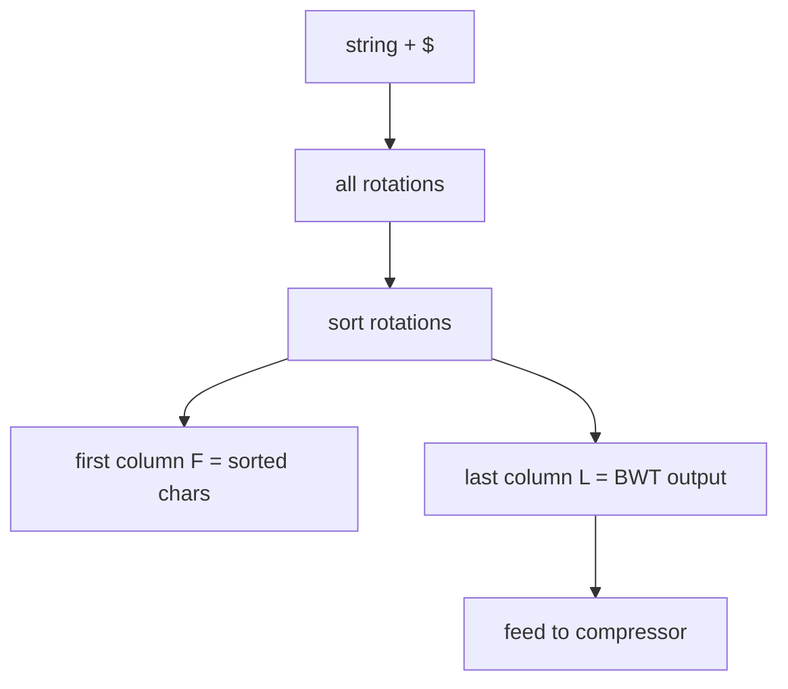

# Burrows-Wheeler Transform (BWT) — Junior Level

> **One-line summary:** The Burrows-Wheeler Transform rearranges the characters of a string (with a special end marker `$`) into a new string of the **same characters in a different order** that groups similar contexts together — making it far easier to compress — and the rearrangement is perfectly **reversible**, so you lose nothing.

---

## Table of Contents

1. [Introduction](#introduction)
2. [Prerequisites](#prerequisites)
3. [Glossary](#glossary)
4. [Core Concepts](#core-concepts)
5. [Big-O Summary](#big-o-summary)
6. [Real-World Analogies](#real-world-analogies)
7. [Pros & Cons](#pros--cons)
8. [Step-by-Step Walkthrough](#step-by-step-walkthrough)
9. [Code Examples](#code-examples)
10. [Coding Patterns](#coding-patterns)
11. [Error Handling](#error-handling)
12. [Performance Tips](#performance-tips)
13. [Best Practices](#best-practices)
14. [Edge Cases & Pitfalls](#edge-cases--pitfalls)
15. [Common Mistakes](#common-mistakes)
16. [Cheat Sheet](#cheat-sheet)
17. [Visual Animation](#visual-animation)
18. [Summary](#summary)
19. [Further Reading](#further-reading)

---

## Introduction

Imagine you are handed the word `banana` and asked to make it easier to compress. At first glance there is nothing to do — every letter is already there exactly once except `a` and `n`. But suppose you could *reorder* the letters into `annb` plus a couple of `a`s in a way that (a) puts identical letters next to each other and (b) lets you perfectly undo the reordering later. That is precisely what the **Burrows-Wheeler Transform (BWT)** does.

The BWT was published in 1994 by Michael Burrows and David Wheeler. Its genius is that it is a **reversible permutation** of the input. It does not compress anything by itself — the output is the same length as the input — but it shuffles the characters into an order that tends to have long runs of the same letter (`aaaa`, `nnn`, `tttt`). Those runs are trivially easy for a follow-up compressor (like run-length encoding plus an entropy coder) to squeeze. This is the engine inside the popular `bzip2` compressor.

The recipe is short enough to state in one breath:

> **Append a unique end marker `$` to the string, write down every rotation of the result, sort the rotations alphabetically, and read off the last column.** That last column is the BWT.

The two surprising facts you will learn here are:

- **Why it helps compression:** sorting the rotations groups together all the characters that are *followed by the same context*, and in real text the same context tends to be preceded by the same few characters, so the last column clusters into runs.
- **Why it is reversible:** even though the last column looks scrambled, a beautiful trick called the **LF-mapping** (covered in depth in [`middle.md`](./middle.md)) lets you rebuild the original string one character at a time.

This junior file focuses on the **forward** transform — turning a string into its BWT — using `banana$` as a running example. The inverse, the FM-index for searching, and the genomics applications are the subject of the higher levels.

---

## Prerequisites

Before reading this file you should be comfortable with:

- **Strings and characters** — indexing, slicing, and comparing strings lexicographically (alphabetical order).
- **Sorting** — what it means to sort a list of strings, and that `$` is treated as the smallest character.
- **Rotations of a string** — a *rotation* moves some prefix to the back: rotations of `abc` are `abc`, `bca`, `cab`.
- **Arrays / lists** — building and reading 2D grids (the rotation matrix).
- **Big-O notation** — `O(n)`, `O(n log n)`, `O(n²)`.

Optional but helpful:

- A glance at the idea of **suffixes** of a string (covered in sibling `04-suffix-array`), since the BWT is closely tied to the suffix array.
- Familiarity with any **compressor** you have used (zip, gzip, bzip2) so the motivation lands.

You do **not** need to know how to compress data, build a suffix array, or read DNA. Those connections come later; here we only sort rotations and read a column.

---

## Glossary

| Term | Meaning |
|------|---------|
| **BWT** | Burrows-Wheeler Transform; a reversible reordering of a string's characters. |
| **Sentinel `$`** | A special character appended to the end of the string, smaller than every real character and appearing exactly once. |
| **Rotation** | A cyclic shift of the string; rotation `i` starts at index `i` and wraps around. |
| **Rotation matrix** | The `n × n` grid of all `n` rotations, one per row. |
| **Sorted rotation matrix** | The rotation matrix with its rows sorted lexicographically. |
| **Last column (`L`)** | The rightmost column of the sorted rotation matrix; **this is the BWT output**. |
| **First column (`F`)** | The leftmost column of the sorted rotation matrix; it is just the sorted characters of the string. |
| **LF-mapping** | The last-to-first mapping used to invert the BWT (see `middle.md`). |
| **Run** | A maximal stretch of identical consecutive characters, e.g. `aaaa`. |
| **Permutation** | A rearrangement of the same multiset of characters; the BWT is a permutation of the input. |

---

## Core Concepts

### 1. The Sentinel `$`

Before transforming, we append a single special character `$` that:

- Appears **exactly once** in the whole string, and
- Is considered **smaller** than every real character (it sorts first).

So `banana` becomes `banana$`. The sentinel does two crucial jobs. First, it makes every rotation **unique** (no two rotations are equal), so sorting is unambiguous. Second, it acts as an anchor that marks "the end of the original string," which the inverse transform relies on to know where to stop. Without `$`, two different strings could produce the same BWT and you could not invert reliably.

### 2. All Rotations

A rotation of a length-`n` string is the string you get by taking the first `i` characters and moving them to the end. For `banana$` (length 7) the seven rotations are:

```
0: banana$
1: anana$b
2: nana$ba
3: ana$ban
4: na$bana
5: a$banan
6: $banana
```

Each rotation uses the same characters; they just start at a different point and wrap around.

### 3. Sort the Rotations

Now sort all rotations alphabetically, remembering that `$` is the smallest character:

```
$banana
a$banan
ana$ban
anana$b
banana$
na$bana
nana$ba
```

This sorted grid is the heart of the transform. Its **first column** (reading top to bottom) is `$aaabnn` — exactly the sorted characters of the string. Its **last column** is what we want.

### 4. Read the Last Column

Reading the rightmost character of each sorted row, top to bottom:

```
$banana  -> a
a$banan  -> n
ana$ban  -> n
anana$b  -> b
banana$  -> $
na$bana  -> a
nana$ba  -> a
```

So the **BWT of `banana$` is `annb$aa`**. Notice the two `n`s landed next to each other and the two trailing `a`s clustered — that grouping is the whole point.

### 5. Why It Groups Similar Characters

When we sort the rotations, we are effectively sorting by the text that *follows* each character. Characters that are followed by the same context end up in adjacent rows. In real text the same context is usually preceded by the same handful of letters (think how often `he` is preceded by `t` to make `the`). So the last column — which holds those preceding characters — fills up with repeats. Repeats are exactly what compressors love.

### 6. It Is a Permutation, Not Compression

The BWT output `annb$aa` has the same length and the same multiset of characters as `banana$` (`a×3, n×2, b×1, $×1`). It is **not smaller**. The win is purely in the *arrangement*: the reordered string is more compressible. Compression happens in a later stage (run-length encoding + entropy coding), described in [`senior.md`](./senior.md).

### 7. The First Column Comes Free

A small but useful fact: because the first column `F` is just the sorted characters, you can always regenerate it from the BWT by sorting. So the pair `(F, L)` is fully determined by `L` alone. This is why the inverse transform (next level) needs to store *only* the last column `L` — it rebuilds `F` and the mapping between them on the fly. You will see this exploited heavily in the FM-index, where storing the original text is unnecessary because `L` plus a couple of small tables encodes everything.

### 8. Why It Is Reversible (Preview)

The reordering looks like it scrambles the string beyond recovery, yet it is perfectly reversible. The reason, spelled out in [`middle.md`](./middle.md), is the **LF-mapping**: the `i`-th occurrence of a character in the last column corresponds to the `i`-th occurrence of that character in the first column. Following this correspondence repeatedly walks the original string backward, one character per step. The unique `$` guarantees this walk visits every position exactly once, so nothing is ever lost. For now, just hold the intuition: *the sort imposes a hidden structure that lets us undo it.*

---

## Big-O Summary

| Operation | Time | Space | Notes |
|-----------|------|-------|-------|
| Build all rotations explicitly | O(n²) | O(n²) | The naive teaching method. |
| Sort rotations (string compares) | O(n² log n) | O(n²) | Each compare is up to `O(n)`. |
| Read the last column | O(n) | O(n) | After sorting. |
| **Naive forward BWT total** | **O(n² log n)** | **O(n²)** | Fine for small strings; too slow for large ones. |
| Forward BWT via suffix array | **O(n)** | O(n) | The production method (see `middle.md`). |
| Inverse BWT via LF-mapping | O(n) | O(n) | Reconstruct the original (see `middle.md`). |

The naive method shown in this file is `O(n² log n)` time and `O(n²)` space because it materializes the whole rotation matrix. That is perfect for understanding and for small inputs, but real systems build the BWT from a **suffix array** in linear time — covered at the next level.

---

## Real-World Analogies

| Concept | Analogy |
|---------|---------|
| Appending `$` | Putting a unique "END" sticker on the last page of a book so you always know where it finishes. |
| All rotations | Photocopying a circular bracelet of beads starting from each bead in turn. |
| Sorting rotations | Alphabetizing those photocopies by the sequence of beads reading clockwise. |
| Last column | Reading just the bead that sits *just before* each starting point, in sorted order. |
| Grouping similar characters | Like seating party guests by the language they speak — people who say similar next words cluster, and the person *before* them tends to be the same too. |
| Reversibility | A reversible jigsaw: the pieces are shuffled, but there is a unique way to put them back. |

Where the analogy breaks: a real bracelet has no fixed "end," which is exactly why we add `$` — to break the symmetry and pin down a unique starting point.

---

## Pros & Cons

| Pros | Cons |
|------|------|
| Reversible: no information is lost, you can rebuild the exact original. | The naive build is `O(n²)` time and space — needs the suffix array to scale. |
| Clusters identical characters into runs, boosting downstream compression. | Does not compress on its own; needs a follow-up stage (RLE + entropy coder). |
| Enables fast substring search via the FM-index (see `middle.md`). | The transform itself is conceptually trickier than simple compressors. |
| Works on any alphabet (text, DNA, bytes). | Requires the whole input in memory (block-based; bzip2 uses ~900 KB blocks). |
| Forms the basis of `bzip2` and DNA read aligners (BWA, bowtie). | Inverse requires care with the LF-mapping and rank queries. |

**When to use:** general-purpose text/file compression (`bzip2`), full-text search over a fixed large text, indexing a genome for read alignment.

**When NOT to use:** streaming data you cannot block, tiny inputs where overhead dominates, or when a simpler compressor (gzip) already meets your needs.

---

## Step-by-Step Walkthrough

Let us compute the BWT of `banana$` slowly and verify every step.

**Step 1 — Append the sentinel.** Start from `banana`, append `$`: the working string is `banana$` (length `n = 7`).

**Step 2 — List all 7 rotations.** Rotation `i` starts at index `i` and wraps:

```
i=0: b a n a n a $
i=1: a n a n a $ b
i=2: n a n a $ b a
i=3: a n a $ b a n
i=4: n a $ b a n a
i=5: a $ b a n a n
i=6: $ b a n a n a
```

**Step 3 — Sort the rotations** (with `$` smallest). Compare character by character:

```
row 0: $ b a n a n a      (starts with $, smallest)
row 1: a $ b a n a n
row 2: a n a $ b a n
row 3: a n a n a $ b
row 4: b a n a n a $
row 5: n a $ b a n a
row 6: n a n a $ b a
```

**Step 4 — Identify F and L.** The **first column** `F` (leftmost) reads `$ a a a b n n`. The **last column** `L` (rightmost) reads:

```
row 0: $banana  -> last char = a
row 1: a$banan  -> last char = n
row 2: ana$ban  -> last char = n
row 3: anana$b  -> last char = b
row 4: banana$  -> last char = $
row 5: na$bana  -> last char = a
row 6: nana$ba  -> last char = a
```

**Step 5 — The answer.** Reading `L` top to bottom: **`annb$aa`**. That is `BWT("banana$")`.

**Sanity check.** Count characters: input `banana$` has `a×3, n×2, b×1, $×1`; output `annb$aa` has `a×3, n×2, b×1, $×1`. They match — the BWT is a permutation. Also note `nn` and `aa` formed runs: mission accomplished for compressibility.

The row where the original string sits (row 4, `banana$`) is special — its index, `4`, is the **primary index**. Some implementations return `(L, primaryIndex)` instead of using a `$`; with a `$` we do not need to store it separately because `$` itself marks the spot. The inverse transform in `middle.md` uses this.

---

## A Second Worked Example — `abracadabra$`

One example is never enough; let us transform a longer, less regular word so the run-clustering is more visible. Take `abracadabra`, append `$`, and work with `abracadabra$` (length `n = 12`).

**Step 1 — List all 12 rotations.** Rotation `i` starts at index `i` and wraps around:

```
 0: abracadabra$
 1: bracadabra$a
 2: racadabra$ab
 3: acadabra$abr
 4: cadabra$abra
 5: adabra$abrac
 6: dabra$abraca
 7: abra$abracad
 8: bra$abracada
 9: ra$abracadab
10: a$abracadabr
11: $abracadabra
```

**Step 2 — Sort the rotations** (with `$` smallest, then `a < b < c < d < r`):

```
row  0: $abracadabra      F=$  L=a
row  1: a$abracadabr      F=a  L=r
row  2: abra$abracad      F=a  L=d
row  3: abracadabra$      F=a  L=$
row  4: acadabra$abr      F=a  L=r
row  5: adabra$abrac      F=a  L=c
row  6: bra$abracada      F=b  L=a
row  7: bracadabra$a      F=b  L=a
row  8: cadabra$abra      F=c  L=a
row  9: dabra$abraca      F=d  L=a
row 10: ra$abracadab      F=r  L=b
row 11: racadabra$ab      F=r  L=b
```

**Step 3 — Read the last column.** Top to bottom the rightmost characters are:

```
a r d $ r c a a a a b b
```

So **`BWT("abracadabra$") = "ard$rcaaaabb"`**. Notice the cluster `aaaa` in the middle and the pair `bb` at the end — far more run structure than the original `abracadabra`, where no two identical letters were adjacent. That is exactly the reordering that downstream compressors exploit.

**Sanity check.** Input multiset: `a×5, b×2, r×2, c×1, d×1, $×1` (12 chars). Output `ard$rcaaaabb`: `a×5, b×2, r×2, c×1, d×1, $×1`. They match, confirming the BWT is a permutation. The primary index — the row holding `abracadabra$` — is row `3`, marked by the `$` that lands in `L` at that row.

**Where do the `aaaa` and `bb` come from?** Every row whose **first** character is `b` or `c` or `d` is a rotation that begins with the chunk that, in the original text, was preceded by `a` (because in `abracadabra` the letters `b`, `c`, `d` are each immediately preceded by `a`). Sorting brings all those rows together, and their **last** column — the character sitting just before that chunk — is therefore a long stretch of `a`s. The sort discovered, automatically, that `a` is the dominant left-context in this word.

---

## The LF-Mapping Inverse — Rebuilding `banana$` Step by Step

The forward transform threw away the matrix and kept only `L = annb$aa`. Can we really get `banana$` back from just those seven characters? Yes — using the **LF-mapping**. This subsection walks the inverse by hand so the reversibility stops feeling like magic. (The full theory is in `middle.md`; here we just *do* it.)

**Setup.** We have `L = annb$aa`. We need two cheap tables.

- The **first column** `F` is the sorted characters of `L`: `$ a a a b n n` (i.e. `$aaabnn`).
- The **`C` array**: `C[c]` = how many characters in the whole string are strictly smaller than `c`. From the counts `$×1, a×3, b×1, n×2`: `C[$]=0`, `C[a]=1`, `C[b]=4`, `C[n]=5`.

**The key fact (LF-mapping).** The `k`-th occurrence of character `c` in the **last** column `L` corresponds to the `k`-th occurrence of `c` in the **first** column `F`. Formally, if `L[i]` is the `r`-th `c` seen so far while scanning `L` from the top, then it maps to row `C[c] + r`. We write `LF(i) = C[L[i]] + Occ(L[i], i)`, where `Occ(c, i)` counts `c` in `L[0..i-1]`.

**Precompute `LF` for every row** (scanning `L = a n n b $ a a` top to bottom, tracking how many of each character we have already seen):

| `i` | `L[i]` | occ before `i` | `C[L[i]]` | `LF(i) = C + occ` |
|----:|:------:|---------------:|----------:|------------------:|
| 0 | `a` | 0 | 1 | 1 |
| 1 | `n` | 0 | 5 | 5 |
| 2 | `n` | 1 | 5 | 6 |
| 3 | `b` | 0 | 4 | 4 |
| 4 | `$` | 0 | 0 | 0 |
| 5 | `a` | 1 | 1 | 2 |
| 6 | `a` | 2 | 1 | 3 |

**Walk the cycle.** Start at the row whose `L` is `$` — that is row `4`. At each step we emit `L[row]` (these come out in **reverse** order, so we prepend), then jump to `LF(row)`:

```
row=4  emit L[4]='$'   -> output so far: $          next = LF(4)=0
row=0  emit L[0]='a'   -> output so far: a$         next = LF(0)=1
row=1  emit L[1]='n'   -> output so far: na$        next = LF(1)=5
row=5  emit L[5]='a'   -> output so far: ana$       next = LF(5)=2
row=2  emit L[2]='n'   -> output so far: nana$      next = LF(2)=6
row=6  emit L[6]='a'   -> output so far: anana$     next = LF(6)=3
row=3  emit L[3]='b'   -> output so far: banana$    next = LF(3)=4  (back to $)
```

After `n = 7` emissions we are back at row `4` (the `$` row), and the reconstructed string reads **`banana$`**. Drop the trailing `$` and we have recovered `banana` exactly — from nothing but the seven scrambled characters `annb$aa`.

**Why the walk never gets lost.** Because `$` occurs exactly once, the `LF` mapping is a single permutation cycle that visits all `n` rows precisely once before returning to the start. There is no shorter sub-cycle to fall into and no row visited twice, so the inverse is deterministic and total — every original is reproduced uniquely. This is the formal reason the BWT is reversible.

---

## Why It Compresses — The Intuition

Beginners often stumble on one point: the BWT output is the **same length** as the input, so *how* does it help compression at all? The answer is that compression is a two-stage relay, and the BWT only runs the first leg.

- **Stage 1 — BWT (reorder).** Same characters, new order. The output tends to contain long **runs** of one character (`aaaa`, `bb`, `nnn`).
- **Stage 2 — squeeze the runs.** A follow-up coder — run-length encoding plus an entropy coder, or Move-To-Front plus Huffman as in `bzip2` — turns those runs into a few bytes.

The reason runs appear is the sort. Sorting the rotations groups together every position that is *followed by the same upcoming text* (the same right-context). In natural language, a given context is usually preceded by only a handful of letters: the context `he ` is overwhelmingly preceded by `t` (`the`), `ing` is often preceded by the same verb stems, and so on. The last column collects exactly those preceding letters, so it fills with repeats. A random string has no such regularity and barely compresses — which correctly tells you the BWT helps *structured* data, not noise.

A quick mental yardstick: feed the transform a highly repetitive input like `aaaaaaaa` (append `$` → `aaaaaaaa$`) and the BWT is essentially one giant run of `a`s with the `$` tucked in — about as compressible as a string can get. Feed it random bytes and the output is still random — no free lunch. Real text sits between these extremes, and the BWT reliably pushes it toward the compressible end. That single reordering, costing no information, is why `bzip2` routinely beats `gzip` on text.

---

## Code Examples

### Example: Naive Forward BWT (rotations + sort)

This builds every rotation, sorts them, and reads the last column. It is the direct translation of the walkthrough — clear, correct, and `O(n²)`.

#### Go

```go
package main

import (
	"fmt"
	"sort"
)

// bwt returns the Burrows-Wheeler Transform of s after appending '$'.
// Assumes '$' does not already appear in s.
func bwt(s string) string {
	s = s + "$"
	n := len(s)
	// Build all rotations.
	rotations := make([]string, n)
	for i := 0; i < n; i++ {
		rotations[i] = s[i:] + s[:i] // rotation starting at index i
	}
	// Sort lexicographically; in Go, '$' (0x24) is already < letters.
	sort.Strings(rotations)
	// Read the last character of each sorted rotation.
	last := make([]byte, n)
	for i, r := range rotations {
		last[i] = r[n-1]
	}
	return string(last)
}

func main() {
	fmt.Println(bwt("banana")) // annb$aa
	fmt.Println(bwt("mississippi"))
}
```

#### Java

```java
import java.util.Arrays;

public class BWT {
    // Returns the BWT of s after appending '$'.
    static String bwt(String s) {
        s = s + "$";
        int n = s.length();
        String[] rotations = new String[n];
        for (int i = 0; i < n; i++) {
            rotations[i] = s.substring(i) + s.substring(0, i);
        }
        Arrays.sort(rotations); // '$' < letters in ASCII, so this is correct
        StringBuilder last = new StringBuilder(n);
        for (String r : rotations) {
            last.append(r.charAt(n - 1));
        }
        return last.toString();
    }

    public static void main(String[] args) {
        System.out.println(bwt("banana"));      // annb$aa
        System.out.println(bwt("mississippi"));
    }
}
```

#### Python

```python
def bwt(s: str) -> str:
    """Return the Burrows-Wheeler Transform of s after appending '$'."""
    s = s + "$"
    n = len(s)
    # All rotations: rotation i starts at index i and wraps around.
    rotations = [s[i:] + s[:i] for i in range(n)]
    rotations.sort()  # '$' (0x24) sorts before letters in normal ASCII order
    # The BWT is the last column.
    return "".join(rot[-1] for rot in rotations)


if __name__ == "__main__":
    print(bwt("banana"))       # annb$aa
    print(bwt("mississippi"))
```

**What it does:** appends `$`, builds the rotation matrix, sorts it, and concatenates the last column.
**Run:** `go run main.go` | `javac BWT.java && java BWT` | `python bwt.py`

> Note: in ASCII, `$` is `0x24`, which is smaller than every letter, so the default string sort already treats `$` as smallest. If your alphabet includes characters smaller than `$`, pick a different sentinel (often `\x00` or `chr(0)`).

---

## Coding Patterns

### Pattern 1: BWT from sorted rotation indices (memory-lighter)

**Intent:** Instead of storing full rotation strings, store only their starting indices and define the order with a comparator. The last column character of the rotation starting at `i` is `s[(i - 1 + n) % n]`.

```python
def bwt_indices(s: str) -> str:
    s = s + "$"
    n = len(s)
    # Sort starting indices by the rotation they represent.
    order = sorted(range(n), key=lambda i: s[i:] + s[:i])
    # Last column char of rotation i is the char just before index i.
    return "".join(s[(i - 1) % n] for i in order)
```

This still pays `O(n)` per comparison key but avoids holding all `n` full strings at once when you compute keys lazily — a stepping stone toward the suffix-array method.

### Pattern 2: The F/L relationship

**Intent:** Remember that the first column `F` is always the **sorted characters** of the string. You never need to store `F`; you can regenerate it by sorting the BWT. This fact powers the inverse transform (see `middle.md`).



### Pattern 3: Round-trip self-test

**Intent:** Always pair a forward BWT with the inverse and assert they round-trip, so a bug in either surfaces immediately. (Inverse code lives in `middle.md`; here, at least assert the multiset of characters is preserved.)

---

## Error Handling

| Error | Cause | Fix |
|-------|-------|-----|
| Wrong BWT for strings with small characters | Input already contains a character `<= '$'`. | Use a sentinel guaranteed smaller than all input chars (e.g. `\x00`), and reject inputs containing it. |
| `$` appears more than once | Input already had a `$`. | Validate input has no `$` before appending, or choose an unused byte. |
| Off-by-one in the last column | Read column `n` instead of `n-1`. | The last column index is `n-1` (0-based). |
| Sort order wrong | Custom comparator does not treat `$` as smallest. | Map `$` to value `-1` (or `0`) in the comparator. |
| Empty input | Length-0 string. | Decide a convention: `BWT("") = "$"` after appending the sentinel. |
| Output not a permutation of input | Bug in rotation construction. | Assert `sorted(output) == sorted(input + "$")`. |

---

## Performance Tips

- **Do not materialize full rotations for large inputs.** The `O(n²)` memory of the rotation matrix is the first thing that breaks. Use index-based sorting (Pattern 1) as a stepping stone, then the suffix-array method (`middle.md`).
- **Use the suffix array.** `BWT[i] = s[(SA[i] - 1 + n) % n]` gives the whole BWT in `O(n)` once you have a linear-time suffix array. This is the only scalable forward method.
- **Pick the smallest sentinel carefully.** A `$` that is not truly smallest silently corrupts the sort.
- **Process in blocks.** `bzip2` does not BWT a whole file; it splits it into blocks (up to ~900 KB) so memory stays bounded.
- **Avoid repeated string concatenation** in hot loops; build the last column into a preallocated buffer.

---

## Best Practices

- Always append a unique, smallest sentinel `$` and validate it does not already occur in the input.
- Keep `BWT` and `inverseBWT` (from `middle.md`) as a tested pair; round-trip every test case.
- For anything beyond toy sizes, build the BWT from a suffix array, not from explicit rotations.
- Document your sentinel choice and your alphabet assumptions at the top of the module.
- Treat the BWT output as opaque bytes for the next compression stage; do not assume it is printable.
- Store the primary index (or rely on `$`) so the inverse knows where the original began.

---

## Edge Cases & Pitfalls

- **Empty string** — after appending `$`, the only rotation is `$`, so `BWT("") = "$"`.
- **Single character** — `BWT("a") `: string `a$`, rotations `a$`, `$a`; sorted `$a`, `a$`; last column `a$` → wait, read carefully: sorted rows are `$a` (last char `a`) and `a$` (last char `$`), so output is `a$`.
- **All identical characters** — `BWT("aaaa")` produces a long run plus the `$`, the ideal compressible case.
- **No `$` semantics** — forgetting the sentinel makes rotations possibly non-unique and the transform non-invertible.
- **Characters smaller than `$`** — break the "smallest" assumption; choose `\x00` or remap.
- **Unicode** — sort by code point consistently; mixing byte and code-point order corrupts results.
- **Very long strings** — `O(n²)` memory is fatal; switch to the suffix-array build.

---

## Common Mistakes

1. **Forgetting the sentinel `$`** — the transform becomes ambiguous and may not invert.
2. **Reading the first column instead of the last** — the first column is just the sorted characters, not the BWT.
3. **Using a sentinel that is not the smallest character** — corrupts the sort order and the output.
4. **Materializing all rotations for large inputs** — `O(n²)` memory crashes; use the suffix array.
5. **Off-by-one on the last column index** — it is `n-1`, not `n`.
6. **Assuming the BWT is shorter** — it is the same length; compression is a separate later step.
7. **Letting `$` appear twice** — only one sentinel is allowed; validate the input first.

---

## Cheat Sheet

| Question | Answer |
|----------|--------|
| What is the BWT? | A reversible reordering of a string's characters that clusters similar ones. |
| How do I compute it? | Append `$`, sort all rotations, read the **last column**. |
| What is `$`? | A unique end marker, smaller than every real character. |
| Is the output smaller? | No — same length; it is a permutation that *aids* compression. |
| What is the first column? | The sorted characters of the string (you never need to store it). |
| What is the last column? | The BWT output. |
| Naive cost? | `O(n² log n)` time, `O(n²)` space. |
| Scalable cost? | `O(n)` via the suffix array (`middle.md`). |
| `BWT("banana$")`? | `annb$aa`. |

Core recipe:

```
BWT(s):
    s = s + "$"               # unique smallest sentinel
    rotations = all n cyclic rotations of s
    sort(rotations)           # '$' sorts first
    return last char of each sorted rotation, top to bottom
```

---

## Visual Animation

> See [`animation.html`](./animation.html) for an interactive visualization.
>
> The animation demonstrates:
> - Building the rotation matrix for an editable string (with `$`)
> - Sorting the rotations row by row
> - Extracting the last column to form the BWT (forward direction)
> - Then running the **LF-mapping inverse** to rebuild the original string one character at a time
> - Play / Pause / Step controls so you can watch each stage form

---

## Summary

The Burrows-Wheeler Transform takes a string, appends a unique smallest sentinel `$`, sorts all cyclic rotations, and reads off the **last column**. The result is a permutation of the original characters — same length, not compressed — but reordered so that identical characters cluster into runs, which a downstream compressor squeezes easily. The worked example `BWT("banana$") = annb$aa` shows the two `n`s and trailing `a`s grouping together. The naive build is `O(n²)`; production systems build it from a suffix array in `O(n)`. Crucially the transform is **reversible**: the LF-mapping (next level) reconstructs the original, and the same machinery powers fast substring search (the FM-index) used in `bzip2` and DNA read aligners. Master "append `$`, sort rotations, take the last column" and you have the forward half of one of the most elegant ideas in string processing.

---

## Further Reading

- Burrows, M. & Wheeler, D. (1994) — *A Block-Sorting Lossless Data Compression Algorithm* (the original technical report).
- Sibling topic `04-suffix-array` — the structure that builds the BWT in linear time.
- [`middle.md`](./middle.md) — the LF-mapping inverse, the FM-index, and backward search.
- [`senior.md`](./senior.md) — the `bzip2` pipeline and genomics aligners (BWA, bowtie).
- `bzip2` documentation — a real BWT-based compressor.
- *Genome-Scale Algorithm Design* (Mäkinen et al.) — BWT/FM-index in bioinformatics.
