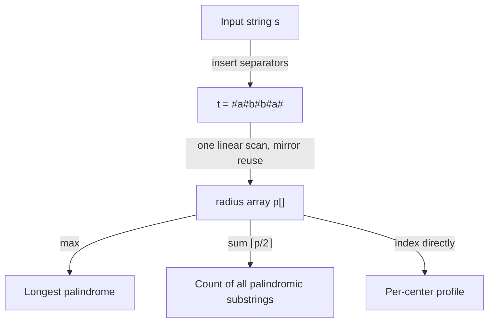

# Manacher's Algorithm (All Palindromic Substrings in O(n)) — Junior Level

> **One-line summary:** Manacher's algorithm finds, for **every** center of a string, the radius of the longest palindrome centered there — in **linear `O(n)` time** — by reusing palindromes it has already discovered through a mirror trick inside the current rightmost palindrome. A `#`-separator transform makes odd and even palindromes uniform so one pass handles both.

---

## Table of Contents

1. [Introduction](#introduction)
2. [Prerequisites](#prerequisites)
3. [Glossary](#glossary)
4. [Core Concepts](#core-concepts)
5. [Big-O Summary](#big-o-summary)
6. [Real-World Analogies](#real-world-analogies)
7. [Pros & Cons](#pros--cons)
8. [Step-by-Step Walkthrough](#step-by-step-walkthrough)
9. [Code Examples](#code-examples)
10. [Coding Patterns](#coding-patterns)
11. [Error Handling](#error-handling)
12. [Performance Tips](#performance-tips)
13. [Best Practices](#best-practices)
14. [Edge Cases & Pitfalls](#edge-cases--pitfalls)
15. [Common Mistakes](#common-mistakes)
16. [Cheat Sheet](#cheat-sheet)
17. [Visual Animation](#visual-animation)
18. [Summary](#summary)
19. [Further Reading](#further-reading)

---

## Introduction

A **palindrome** is a string that reads the same forwards and backwards: `racecar`, `level`, `abba`, `noon`. A classic and surprisingly deep problem is: *"Given a string, what is the longest substring that is a palindrome?"* For `babad` the answer is `bab` (or `aba`); for `cbbd` it is `bb`. A related family of questions asks *"How many substrings of this string are palindromes?"* and *"For each position, how long is the palindrome centered there?"*

The obvious approach is to try every center and grow outward as long as the two sides match. This **center-expansion** method is intuitive and correct, but it costs `O(n²)` in the worst case (think of `aaaaaa…`, where every expansion runs the full length of the string). For a long string — say a million characters — `O(n²)` is a trillion operations, far too slow.

**Manacher's algorithm** computes the same per-center palindrome information in **linear `O(n)` time**. It does so with one beautiful idea:

> **If we are currently inside a big palindrome that stretches from position `l` to position `r`, then the string near a center `i` looks just like the string near its mirror image `i' = l + (r - i)` on the other side of the big palindrome's center. So we can *copy* the answer from the mirror as a starting guess, and only expand beyond what we already know.**

This "mirror reuse inside the current box `[l, r]`" is the entire trick. Each character is involved in only a constant amount of *new* expansion work across the whole run, which is why the total time is linear rather than quadratic.

There is one nuisance: palindromes come in two flavors. **Odd-length** palindromes like `aba` have a single character at the center; **even-length** palindromes like `abba` have their center *between* two characters. Handling two cases everywhere is error-prone. The standard fix is a tiny **transform**: insert a separator character (commonly `#`) between every pair of characters and at the ends. Then `abba` becomes `#a#b#b#a#`, and *every* palindrome — odd or even in the original — becomes **odd-length** in the transformed string. One uniform pass handles both.

This topic sits next to a sibling, the **palindromic tree (eertree)** in `14`, which is a different data structure that also handles all palindromic substrings; we contrast the two near the end. Manacher is the right tool when you want the longest palindrome or a per-center palindrome profile in one fast linear scan with almost no extra memory.

---

## Prerequisites

Before reading this file you should be comfortable with:

- **Strings and indexing** — accessing `s[i]`, substrings `s[a:b]`, and string length `n`.
- **Two-pointer expansion** — growing two indices outward from a center while characters match. See sibling `sliding-window-technique`.
- **Big-O notation** — what `O(n)` and `O(n²)` mean and why the difference matters at scale.
- **Arrays** — storing one integer per position (the radius array).
- **What a palindrome is** — a string equal to its reverse.

Optional but helpful:

- A glance at **prefix-function / KMP-style "reuse what you computed"** thinking (sibling `02-kmp` style), since Manacher shares the spirit of reusing earlier work to avoid recomputation.
- Familiarity with **off-by-one care** around centers and radii — this is where most bugs live.

---

## Glossary

| Term | Meaning |
|------|---------|
| **Palindrome** | A string equal to its own reverse, e.g. `level`, `abba`. |
| **Substring** | A contiguous slice of the string. Manacher is about *substrings*, not subsequences. |
| **Center** | The middle of a palindrome. An odd palindrome has a character center; an even one has a "between two characters" center. |
| **Radius** | How far a palindrome extends from its center. The transformed-string radius array `p[i]` is the key output. |
| **Center expansion** | The `O(n²)` baseline: for each center, expand outward while sides match. |
| **`#`-transform** | Inserting separators so `s = abc` becomes `t = #a#b#c#`; makes every palindrome odd-length. |
| **Box / current palindrome `[l, r]`** | The palindrome with the **rightmost** right edge `r` seen so far; the engine of the mirror reuse. |
| **Mirror `i'`** | The reflection of position `i` across the center of the current box: `i' = l + r - i`. |
| **`p[]` (radius array)** | `p[i]` = radius of the longest palindrome centered at `i` in the transformed string. |
| **Eertree (palindromic tree)** | A different data structure (sibling `14`) storing all distinct palindromic substrings; contrasted later. |

---

## Core Concepts

### 1. The Longest Palindromic Substring Problem

Given `s`, find the longest contiguous substring that is a palindrome. There may be ties (`babad` → `bab` or `aba`); any longest one is acceptable. The same machinery answers two cousins: *count all palindromic substrings* and *report the palindrome length at every center*.

### 2. The O(n²) Center-Expansion Baseline

Every palindrome has a center. In a string of length `n` there are `2n - 1` possible centers: `n` single-character centers (for odd palindromes) and `n - 1` between-character centers (for even palindromes). For each center, expand two pointers outward while the characters match:

```
expand(left, right):
    while left >= 0 and right < n and s[left] == s[right]:
        left  -= 1
        right += 1
    return (right - left - 1)   # length of the palindrome found
```

Trying all `2n - 1` centers and expanding each gives `O(n²)` total in the worst case. Correct, simple, and the perfect baseline to test Manacher against — but too slow for very long strings.

### 3. The `#`-Separator Transform

To avoid handling odd and even palindromes separately, build a transformed string `t` by inserting a separator (we use `#`) between every character and at both ends:

```
s = "abba"
t = "#a#b#b#a#"      (often wrapped with sentinels ^ ... $ to avoid bounds checks)
```

Two key facts:

- `t` always has **odd length** (`2n + 1`), and **every** palindrome in `t` is odd-length (it is centered either on a real character or on a `#`).
- A palindrome in `t` of radius `p[i]` corresponds to a palindrome in the original `s` of length exactly `p[i]`. (The separators cancel out neatly — proven in `professional.md`.)

So we only ever solve the odd case, on `t`, and translate back. The center `i` in `t` maps to original positions by `(i - p[i]) / 2` for the start.

### 4. The Mirror Property Inside the Current Box `[l, r]`

This is the heart of Manacher. As we scan `t` left to right computing `p[i]`, we keep track of the palindrome whose **right edge `r` is the farthest right** we have seen, with center `c` and left edge `l`. We call `[l, r]` the **current box**.

When we reach a new center `i` that lies **inside** the box (`i < r`), its mirror across `c` is `i' = 2*c - i = l + r - i`. Because everything inside `[l, r]` is a palindrome around `c`, the string around `i` matches the string around `i'`. So we can **initialize** `p[i]` cheaply:

```
mirror = 2*c - i
p[i] = min(r - i, p[mirror])     # copy from the mirror, but don't exceed the box
```

We take the `min` because the mirror's palindrome might stretch *past* the left edge of the box, where we have no guarantee — beyond `r` is unexplored territory. After this free initialization, we only **expand** `p[i]` further if it currently reaches the box edge `r`; otherwise the mirror already gave the exact answer.

### 5. Expanding Past the Box and Updating It

After the mirror initialization, attempt to grow:

```
while t[i + p[i] + 1] == t[i - p[i] - 1]:
    p[i] += 1
```

If this pushes the right edge `i + p[i]` beyond the old `r`, update the box: `c = i`, `r = i + p[i]`, `l = i - p[i]`. The crucial efficiency fact: `r` **only ever moves forward**, never backward. Across the whole scan, the total amount of forward expansion is bounded by `n`, so the algorithm is `O(n)` overall. (The amortized argument is made rigorous in `professional.md`.)

### 6. Recovering Substrings, Lengths, and Counts

The radius array `p[]` is a complete summary of the palindromic structure:

- **Longest palindrome:** find `i` maximizing `p[i]`; its length is `p[i]`, and its start in `s` is `(i - p[i]) / 2`.
- **Count all palindromic substrings:** each center `i` contributes `⌈p[i] / 2⌉` palindromes (a center of radius `p[i]` contains nested palindromes). Summing over all `i` gives the total count.
- **Per-center profile:** `p[i]` itself *is* the longest-palindrome length at that center.

---

## Big-O Summary

| Operation | Time | Space | Notes |
|-----------|------|-------|-------|
| Center expansion (baseline) | **O(n²)** | O(1) | Try all `2n−1` centers, expand each. |
| `#`-transform construction | O(n) | O(n) | Build `t` of length `2n+1`. |
| Manacher main scan | **O(n)** | O(n) | One pass; `r` only moves forward. |
| Longest palindrome from `p[]` | O(n) | O(1) | One max over the radius array. |
| Count all palindromic substrings | O(n) | O(1) | Sum `⌈p[i]/2⌉` over centers. |
| Substring recovery (one) | O(len) | O(len) | Slice out the actual characters. |
| All-pairs "is `s[a..b]` a palindrome?" | O(n²) precompute | O(n²) | A different DP; Manacher gives per-center, not per-range. |

The headline number is **`O(n)`** for the full palindromic profile — a strict improvement over the `O(n²)` baseline, achieved with the mirror reuse.

---

## Real-World Analogies

| Concept | Analogy |
|---------|---------|
| Palindrome | A symmetric pattern, like a butterfly's wings — the left half mirrors the right half. |
| Center expansion | Standing at a mirror and stepping back one pace at a time, checking the reflection still matches. |
| The `#`-transform | Putting a thin spacer between every domino so a row of dominoes always has a clear single "middle", whether the count is odd or even. |
| The box `[l, r]` | A "known symmetric region" you have already verified — a mirror hall you have walked through. |
| Mirror reuse | Inside that hall, you already know the room at position `i'` (the reflection), so the room at `i` must look the same — no need to re-inspect it from scratch. |
| `r` only moves forward | You only ever push the frontier of explored territory rightward; you never re-walk ground you have already mapped. |

Where the analogy breaks: the algorithm does occasionally still expand a little past the box, so it is not *pure* copying — but the expansion is bounded overall, which keeps it linear.

---

## Pros & Cons

| Pros | Cons |
|------|------|
| Linear `O(n)` time — optimal for the longest-palindrome and full-profile problems. | The index arithmetic (centers, mirrors, the `#`-transform mapping) is fiddly and bug-prone. |
| Tiny memory: one integer array of length `2n+1`. | Only handles **contiguous substrings**, never subsequences. |
| One pass also yields the count of all palindromic substrings for free. | Does not directly give *distinct* palindrome counts (the eertree does — sibling `14`). |
| The `#`-transform unifies odd/even into a single clean case. | The transform doubles the working string length (constant factor). |
| Conceptually elegant: mirror reuse with an only-forward pointer. | Less intuitive than hashing-based palindrome checks for one-off range queries. |

**When to use:** longest palindromic substring, count of all palindromic substrings, per-center palindrome lengths, anywhere you need the complete palindromic profile in linear time and memory is tight.

**When NOT to use:** when you need *distinct* palindromic substrings and their counts (use the eertree, sibling `14`), when you only need a few isolated "is this range a palindrome?" queries (a hash or DP table is simpler), or when palindromic *subsequences* (non-contiguous) are wanted (that is a different DP problem entirely).

---

## Step-by-Step Walkthrough

Take `s = "abba"`. First build the transform with separators:

```
t = # a # b # b # a #
i = 0 1 2 3 4 5 6 7 8
```

We compute `p[i]` = radius (number of matched characters on each side) of the longest palindrome in `t` centered at `i`. Track the box `(c, l, r)`, initially "empty" (`c = 0, r = 0`).

```
i=0  t='#': no expansion possible at the left end → p[0]=0
i=1  t='a': expand: t[0]='#', t[2]='#' match → p[1]=1; t[-1] out → stop. box: c=1,l=0,r=2
i=2  t='#': mirror i'=2c-i=0, p[0]=0, min(r-i, p[0])=min(0,0)=0; expand t[1]='a',t[3]='b' differ → p[2]=0
i=3  t='b': i>=r so start p[3]=0; expand t[2]='#',t[4]='#' match (p=1); t[1]='a',t[5]='b' differ → p[3]=1. box: c=3,l=2,r=4
i=4  t='#': mirror i'=2*3-4=2, p[2]=0, min(r-i,p[2])=min(0,0)=0; expand t[3]='b',t[5]='b' match (p=1); t[2]='#',t[6]='#' match (p=2); t[1]='a',t[7]='a' match (p=3); t[0]='#',t[8]='#' match (p=4); out of bounds → p[4]=4. box: c=4,l=0,r=8
i=5  t='#': mirror i'=2*4-5=3, p[3]=1, min(r-i,p[3])=min(3,1)=1; expand t[3]='b',t[7]='a' differ → p[5]=1
i=6  t='#': mirror i'=2*4-6=2, p[2]=0, min(r-i,p[2])=min(2,0)=0; expand t[5]='#',t[7]='a' differ → p[6]=0
i=7  t='a': mirror i'=2*4-7=1, p[1]=1, min(r-i,p[1])=min(1,1)=1; expand t[5]='#',t[9] out → p[7]=1
i=8  t='#': mirror i'=2*4-8=0, p[0]=0, min(r-i,p[0])=min(0,0)=0 → p[8]=0
```

Result:

```
i   0 1 2 3 4 5 6 7 8
t   # a # b # b # a #
p   0 1 0 1 4 1 0 1 0
```

The maximum is `p[4] = 4`, centered on the middle `#`. Length `= 4`, start in `s` is `(4 - 4)/2 = 0`, so the longest palindrome is `s[0:4] = "abba"`. **Notice the mirror reuse:** at `i=5,6,7` we copied initial radii from `i=3,2,1` and barely expanded — that is the linear-time savings in action.

---

## Code Examples

### Example: Manacher's Algorithm (radius array, longest palindrome)

This builds `t`, computes `p[]`, and returns the longest palindromic substring of `s`.

#### Go

```go
package main

import (
	"fmt"
	"strings"
)

// manacher returns the radius array p over the transformed string t,
// plus t itself, where t = #s[0]#s[1]#...#.
func manacher(s string) ([]int, string) {
	var b strings.Builder
	b.WriteByte('#')
	for i := 0; i < len(s); i++ {
		b.WriteByte(s[i])
		b.WriteByte('#')
	}
	t := b.String()
	n := len(t)
	p := make([]int, n)
	c, r := 0, 0 // center and right edge of the current box
	for i := 0; i < n; i++ {
		if i < r {
			mirror := 2*c - i
			if r-i < p[mirror] {
				p[i] = r - i
			} else {
				p[i] = p[mirror]
			}
		}
		// expand past the box
		for i-p[i]-1 >= 0 && i+p[i]+1 < n && t[i-p[i]-1] == t[i+p[i]+1] {
			p[i]++
		}
		if i+p[i] > r {
			c, r = i, i+p[i]
		}
	}
	return p, t
}

func longestPalindrome(s string) string {
	if len(s) == 0 {
		return ""
	}
	p, _ := manacher(s)
	bestLen, bestCenter := 0, 0
	for i := range p {
		if p[i] > bestLen {
			bestLen = p[i]
			bestCenter = i
		}
	}
	start := (bestCenter - bestLen) / 2
	return s[start : start+bestLen]
}

func main() {
	fmt.Println(longestPalindrome("babad")) // bab (or aba)
	fmt.Println(longestPalindrome("cbbd"))  // bb
	fmt.Println(longestPalindrome("abba"))  // abba
}
```

#### Java

```java
public class Manacher {
    static int[] manacher(String s, StringBuilder outT) {
        StringBuilder b = new StringBuilder("#");
        for (int i = 0; i < s.length(); i++) {
            b.append(s.charAt(i)).append('#');
        }
        String t = b.toString();
        outT.append(t);
        int n = t.length();
        int[] p = new int[n];
        int c = 0, r = 0; // center and right edge of the current box
        for (int i = 0; i < n; i++) {
            if (i < r) {
                int mirror = 2 * c - i;
                p[i] = Math.min(r - i, p[mirror]);
            }
            while (i - p[i] - 1 >= 0 && i + p[i] + 1 < n
                    && t.charAt(i - p[i] - 1) == t.charAt(i + p[i] + 1)) {
                p[i]++;
            }
            if (i + p[i] > r) {
                c = i;
                r = i + p[i];
            }
        }
        return p;
    }

    static String longestPalindrome(String s) {
        if (s.isEmpty()) return "";
        int[] p = manacher(s, new StringBuilder());
        int bestLen = 0, bestCenter = 0;
        for (int i = 0; i < p.length; i++) {
            if (p[i] > bestLen) { bestLen = p[i]; bestCenter = i; }
        }
        int start = (bestCenter - bestLen) / 2;
        return s.substring(start, start + bestLen);
    }

    public static void main(String[] args) {
        System.out.println(longestPalindrome("babad")); // bab
        System.out.println(longestPalindrome("cbbd"));  // bb
        System.out.println(longestPalindrome("abba"));  // abba
    }
}
```

#### Python

```python
def manacher(s):
    """Return (p, t): radius array p over the transformed string t = #s0#s1#...#."""
    t = "#" + "#".join(s) + "#"
    n = len(t)
    p = [0] * n
    c = r = 0  # center and right edge of the current box
    for i in range(n):
        if i < r:
            mirror = 2 * c - i
            p[i] = min(r - i, p[mirror])
        # expand past the box
        while (i - p[i] - 1 >= 0 and i + p[i] + 1 < n
               and t[i - p[i] - 1] == t[i + p[i] + 1]):
            p[i] += 1
        if i + p[i] > r:
            c, r = i, i + p[i]
    return p, t


def longest_palindrome(s):
    if not s:
        return ""
    p, _ = manacher(s)
    best_len = max(p)
    best_center = p.index(best_len)
    start = (best_center - best_len) // 2
    return s[start:start + best_len]


if __name__ == "__main__":
    print(longest_palindrome("babad"))  # bab (or aba)
    print(longest_palindrome("cbbd"))   # bb
    print(longest_palindrome("abba"))   # abba
```

**What it does:** transforms `s`, computes the radius array in one linear pass with mirror reuse, then reads off the longest palindrome.
**Run:** `go run main.go` | `javac Manacher.java && java Manacher` | `python manacher.py`

---

## Coding Patterns

### Pattern 1: Brute-Force Center Expansion (the oracle you test against)

**Intent:** Before trusting Manacher, compute the same answers the slow, obvious way and verify they agree on small inputs.

```python
def longest_palindrome_bruteforce(s):
    def expand(left, right):
        while left >= 0 and right < len(s) and s[left] == s[right]:
            left -= 1
            right += 1
        return s[left + 1:right]

    best = ""
    for center in range(len(s)):
        odd = expand(center, center)      # odd-length, single-char center
        even = expand(center, center + 1) # even-length, between-char center
        for cand in (odd, even):
            if len(cand) > len(best):
                best = cand
    return best
```

This is `O(n²)` but a perfect correctness oracle. Manacher must return a palindrome of the same *length* on every input.

### Pattern 2: Count All Palindromic Substrings

**Intent:** Sum the per-center contributions. A center with transformed radius `p[i]` contributes `⌈p[i] / 2⌉` original palindromic substrings (`(p[i] + 1) // 2`).

```python
def count_palindromic_substrings(s):
    p, _ = manacher(s)
    return sum((x + 1) // 2 for x in p)
```

### Pattern 3: Per-Center Palindrome Profile

**Intent:** Report, for every position, the longest palindrome length centered there — directly the `p[]` array, indexed by transformed center.



---

## Error Handling

| Error | Cause | Fix |
|-------|-------|-----|
| `IndexError` / out-of-bounds in expansion | Forgot the `i-p[i]-1 >= 0` and `i+p[i]+1 < n` guards. | Always bounds-check both sides, or use `^`/`$` sentinels so the ends never match. |
| Wrong answer for empty string | Did not handle `s == ""`. | Return `""` early; the transform of `""` is `"#"` with all-zero `p`. |
| Off-by-one in substring recovery | Used the wrong start formula. | Original start `= (center - radius) / 2`; length `= radius`. |
| Mirror reads garbage | Used `p[mirror]` without the `min(r - i, …)` cap. | Always cap: `p[i] = min(r - i, p[mirror])` before expanding. |
| Separator collides with input | Used `#` but the input contains `#`. | Use a separator guaranteed absent from the alphabet, or a sentinel pair. |
| Counts too large to fit | For long strings the palindrome count can exceed 32-bit. | Use 64-bit integers for the count. |

---

## Performance Tips

- **Use sentinels `^ … $`** at the two ends of `t` so the expansion loop never needs bounds checks — a measurable constant-factor win and fewer off-by-one bugs.
- **Work on a byte/char array**, not repeated string indexing in languages where `s[i]` is `O(1)` only on arrays (e.g. convert to `[]byte` in Go, `char[]` in Java).
- **Avoid rebuilding `t` repeatedly** if you call Manacher in a loop; build it once.
- **Read `p[]` directly** for counts and profiles instead of re-scanning the string.
- **Skip the transform** if your input is guaranteed odd-palindrome-only by problem structure — but the transform is almost always worth its small overhead for correctness.

---

## Best Practices

- Always test Manacher against the brute-force center-expansion oracle (Pattern 1) on random small strings before trusting it.
- Build the transformed string once and keep the mapping formula (`start = (center - radius) / 2`) in a comment right next to the recovery code.
- Cap the mirror copy with `min(r - i, p[mirror])` every time; this single line is the correctness keystone.
- Use 64-bit integers when counting all palindromic substrings; the count is `O(n²)` in magnitude.
- Document whether you want *all* palindromic substrings (Manacher) or *distinct* ones (eertree, sibling `14`) — they answer different questions.

---

## Edge Cases & Pitfalls

- **Empty string** — return `""`; `p[]` is all zeros.
- **Single character** — every single character is a palindrome of length 1; the longest is that character.
- **All identical characters** (`aaaa`) — the *whole string* is the longest palindrome; this is exactly the case that kills naive expansion but Manacher still handles in `O(n)`.
- **No palindrome longer than 1** (`abcde`) — the answer is any single character.
- **Even vs odd** — the `#`-transform removes the need to special-case these; never branch on parity in the main loop.
- **Unicode / multibyte** — `s[i]` over raw bytes can split a multibyte character; operate on runes/code points if the input is Unicode (see `senior.md`).
- **Separator in the alphabet** — if `#` can appear in the input, palindromes around a real `#` and a separator `#` can blur; pick a separator outside the alphabet.

---

## Common Mistakes

1. **Dropping the `min(r - i, …)` cap** — copying `p[mirror]` blindly can claim a palindrome that extends past the box edge into unverified territory, producing wrong (too-large) radii.
2. **Forgetting the bounds checks** in the expansion `while` (or forgetting sentinels) — crashes with index-out-of-range.
3. **Wrong recovery formula** — mixing up `(center - radius) / 2` with `(center - radius + 1) / 2`; verify on `abba`.
4. **Updating the box only sometimes** — you must set `c, r = i, i + p[i]` whenever `i + p[i] > r`, or later mirror reuse breaks.
5. **Counting distinct palindromes with Manacher** — Manacher counts *occurrences/all* palindromic substrings, not distinct ones; use the eertree for distinct.
6. **Off-by-one in the transform length** — `t` has length `2n + 1`, not `2n`; an early `#` and a trailing `#` are both required.
7. **Returning the radius as the length without the transform mapping** — in the transformed string the radius *equals* the original length, which is convenient but must be applied consistently.

---

## Cheat Sheet

| Question | Tool | Formula |
|----------|------|---------|
| Longest palindromic substring | Manacher `p[]` | length `= max p[i]`; start `= (argmax - max) / 2` |
| Count all palindromic substrings | Manacher `p[]` | `Σ ⌈p[i] / 2⌉` over all centers |
| Palindrome length at center `i` (transformed) | Manacher `p[]` | `p[i]` |
| Is `s` itself a palindrome? | Manacher or direct check | `p[center of t] == len(s)` |
| Odd vs even unified | `#`-transform | `t = "#" + "#".join(s) + "#"` |
| Mirror of `i` in box | reflection | `i' = 2*c - i = l + r - i` |
| Initialize `p[i]` inside box | mirror copy, capped | `p[i] = min(r - i, p[i'])` |

Core algorithm:

```
manacher(s):
    t = "#" + "#".join(s) + "#"
    p = [0]*len(t);  c = r = 0
    for i in range(len(t)):
        if i < r: p[i] = min(r - i, p[2*c - i])     # mirror reuse, capped
        while sides match: p[i] += 1                 # expand past box
        if i + p[i] > r: c, r = i, i + p[i]          # r only moves forward
    return p
# cost: O(n); each character expands a bounded amount total.
```

---

## Visual Animation

> See [`animation.html`](./animation.html) for an interactive visualization.
>
> The animation demonstrates:
> - The `#`-transform turning `s` into the odd-length string `t`
> - The current center `i`, the box `[l, r]`, and the mirror `i'`
> - The mirror initialization `p[i] = min(r - i, p[i'])` lighting up
> - The expansion step pushing past the box and `r` advancing
> - The radius array `p[]` filling cell by cell, with the longest palindrome highlighted
> - Step / Run / Reset controls and an editable input string

---

## Summary

Manacher's algorithm computes the longest palindrome centered at *every* position in **linear `O(n)` time**, a strict win over the `O(n²)` center-expansion baseline. Two ideas make it work. First, the **`#`-separator transform** turns `s` into an odd-length string `t` in which *every* palindrome is odd, so a single uniform case handles both odd and even palindromes. Second, the **mirror property inside the current box `[l, r]`**: when a new center `i` lies inside an already-discovered palindrome, its radius can be copied (capped) from its mirror `i' = l + r - i`, and only the part beyond the box edge `r` ever needs real expansion. Because `r` only moves forward, the total expansion work is bounded by `n`. From the resulting radius array `p[]` you read off the longest palindrome (`max p[i]`), the count of all palindromic substrings (`Σ ⌈p[i]/2⌉`), and the per-center profile — all in one pass. For *distinct* palindromes and richer palindromic structure, see the sibling eertree (`14`).

---

## Further Reading

- Glenn Manacher (1975), the original linear-time online palindrome paper.
- cp-algorithms.com — "Manacher's Algorithm — Finding all sub-palindromes in O(n)".
- Sibling topic `14-palindromic-tree` (eertree) — distinct palindromic substrings.
- Sibling topic `sliding-window-technique` — the two-pointer expansion idea.
- LeetCode 5 (Longest Palindromic Substring) and 647 (Palindromic Substrings) — canonical practice problems.
- *Competitive Programmer's Handbook* (Laaksonen) — string algorithms chapter.
