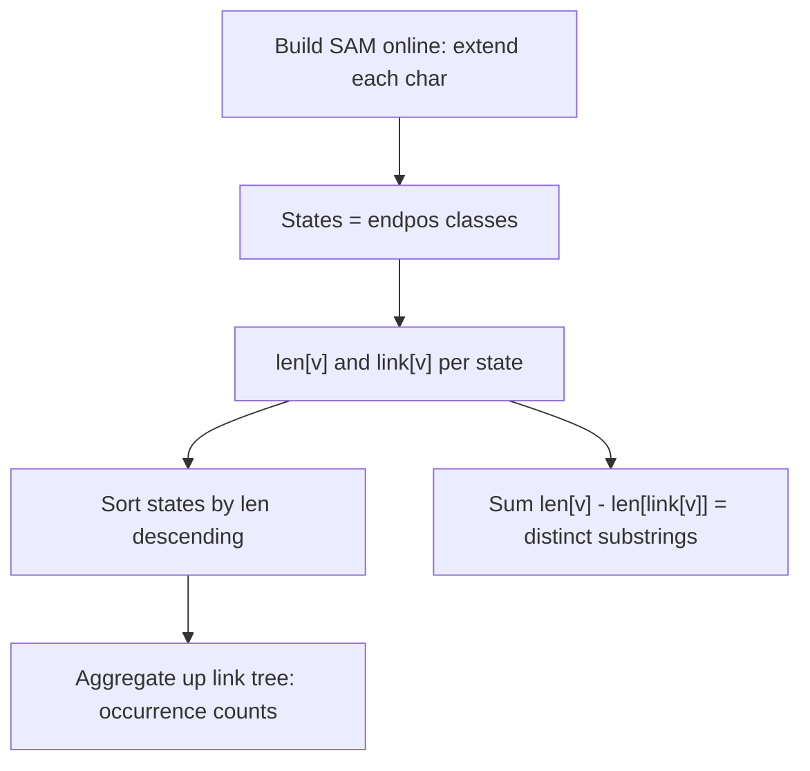

# Suffix Automaton (SAM) — Junior Level

> **One-line summary:** A **suffix automaton** of a string `s` is the smallest deterministic finite automaton (DFA) that accepts exactly the suffixes of `s`. Because every substring of `s` is a prefix of some suffix, walking the automaton from the start state also recognizes **every substring** of `s`. It is built **online in `O(n)`** by adding one character at a time, and it has at most `2n-1` states and `3n-4` transitions.

---

## Table of Contents

1. [Introduction](#introduction)
2. [Prerequisites](#prerequisites)
3. [Glossary](#glossary)
4. [Core Concepts](#core-concepts)
5. [Big-O Summary](#big-o-summary)
6. [Real-World Analogies](#real-world-analogies)
7. [Pros & Cons](#pros--cons)
8. [Step-by-Step Walkthrough](#step-by-step-walkthrough)
9. [Code Examples](#code-examples)
10. [Coding Patterns](#coding-patterns)
11. [Error Handling](#error-handling)
12. [Performance Tips](#performance-tips)
13. [Best Practices](#best-practices)
14. [Edge Cases & Pitfalls](#edge-cases--pitfalls)
15. [Common Mistakes](#common-mistakes)
16. [Cheat Sheet](#cheat-sheet)
17. [Visual Animation](#visual-animation)
18. [Summary](#summary)
19. [Further Reading](#further-reading)

---

## Introduction

Imagine someone hands you a long string `s` and then keeps asking: *"Is `p` a substring of `s`?"* for many different `p`. The naive answer scans `s` for each query in `O(|s|)` time. The suffix automaton turns this into a tiny `O(|p|)` walk: you follow one transition per character of `p`, and if you never fall off the automaton, `p` is a substring. That is the headline use, but it is only the beginning.

A **suffix automaton (SAM)** is a remarkable little machine. Formally it is the **minimal deterministic finite automaton that recognizes the set of all suffixes** of `s`. Two facts make it powerful:

> 1. Every **substring** of `s` is a prefix of some **suffix** of `s`. So the same automaton that accepts suffixes also lets you *recognize* every substring by simply walking transitions from the start.
> 2. It is astonishingly small — **at most `2n-1` states and `3n-4` transitions** for a string of length `n` — and it is built **online in linear time `O(n)`** (for a fixed alphabet), adding the characters of `s` one by one.

That combination — recognizes all substrings, linear size, linear online construction — is what makes the suffix automaton one of the most useful structures in all of string processing. With it you can, in time proportional to the structure (not re-scanning `s` each query):

- Check whether a pattern `p` is a substring of `s` in `O(|p|)`.
- Count the number of **distinct substrings** of `s` with a single formula.
- Count **how many times** each substring occurs.
- Find the **longest common substring** of two strings.
- Find the **k-th smallest** distinct substring, total length of distinct substrings, and more.

The two structures it relies on internally are the **suffix link** tree and the **`len`** value of each state. The whole document keeps circling back to one central idea — the **endpos equivalence** — which explains *why* states are what they are. We will build intuition for that gently and leave the full proofs to [`professional.md`](./professional.md).

The suffix automaton is a sibling of the **suffix array** (topic `04-suffix-array`) and the **suffix tree** (topic `13-suffix-tree`). All three index every substring of `s`; they trade off differently in size, build difficulty, and which queries are natural. We contrast them throughout.

---

## Prerequisites

Before reading this file you should be comfortable with:

- **Strings and substrings** — a substring is a contiguous slice `s[l..r]`; a suffix is a substring ending at the last position.
- **Deterministic finite automata (DFA)** — states, transitions on characters, a start state, accepting states. Walking a DFA means following one transition per input character.
- **Graphs and trees** — the suffix links form a tree; basic tree traversal (DFS/BFS) is used to aggregate values.
- **Hash maps / arrays as maps** — transitions are stored as `state × character → state`, often a small array or a hash map.
- **Big-O notation** — `O(n)`, `O(|p|)`, `O(n · alphabet)`.

Optional but helpful:

- A glance at **tries** (topic `11-trie`) — a SAM is a much smaller cousin that shares prefixes *and* suffixes.
- Familiarity with **amortized analysis** — the linear-time build relies on an amortized argument (each step does `O(1)` work on average).

---

## Glossary

| Term | Meaning |
|------|---------|
| **Substring** | A contiguous slice of `s`. `"ab"` is a substring of `"cab"`; `"cb"` is not. |
| **Suffix** | A substring that ends at the last character of `s`. Suffixes of `"aba"` are `"aba", "ba", "a", ""`. |
| **DFA** | Deterministic finite automaton: states + per-character transitions; at most one transition per (state, char). |
| **State** | A node of the automaton. Each state corresponds to an **endpos equivalence class** of substrings. |
| **`len[v]`** | The length of the **longest** substring in state `v`'s equivalence class. |
| **endpos(t)** | The set of ending positions of all occurrences of substring `t` in `s`. |
| **Suffix link `link[v]`** | A pointer to the state holding the longest *proper suffix* of `v`'s strings that lies in a different endpos class. Forms a tree. |
| **Clone** | A copied state created during `extend` to split an endpos class (the "split" case). |
| **`extend(c)`** | The online step that adds one character `c` to the automaton. |
| **Initial state (`t0`)** | The start state; represents the empty substring; `len = 0`, `link = -1`. |
| **Terminal / accepting state** | A state whose class contains a suffix of `s`; marked after the build by walking suffix links from the last state. |

---

## Core Concepts

### 1. Each State Is a Set of Substrings (the endpos idea)

The single most important idea: a SAM state does **not** represent one substring — it represents a whole **group** of substrings that all occur in exactly the same places.

Define `endpos(t)` = the set of positions where occurrences of substring `t` *end* in `s`. For `s = "abcbc"`:

```
endpos("bc")  = {3, 5}     // "bc" ends at index 3 and index 5
endpos("c")   = {3, 5}     // "c"  ends at index 3 and index 5
endpos("cbc") = {5}        // only once, ending at 5
```

Two substrings are **endpos-equivalent** if they have the *same* endpos set. `"bc"` and `"c"` above share `{3,5}`, so they live in the **same state**. The set of distinct endpos classes is exactly the set of states. This is why the automaton is small: many substrings collapse into one state.

### 2. `len` and the Span of a State

Inside one state, the substrings form a contiguous range of lengths. The state stores `len[v]` = the length of the **longest** substring it holds. The shortest length it holds is `len[link[v]] + 1`. So state `v` represents substrings of lengths in the range:

```
[ len[link[v]] + 1 , len[v] ]
```

That range — `len[v] - len[link[v]]` distinct substrings per state — is the key to **counting distinct substrings** (Concept 6).

### 3. Suffix Links Form a Tree

The **suffix link** `link[v]` points to the state whose longest string is the longest *proper suffix* of `v`'s longest string that belongs to a *different* endpos class. Following links repeatedly always reaches the initial state. These links form a **tree rooted at the initial state** — the **suffix-link tree**. It is the backbone for counting occurrences and answering "how many times does this substring appear".

### 4. The Automaton Recognizes All Substrings

Start at the initial state and feed the characters of a query string `p` one at a time, following transitions. If at any point there is no transition for the next character, `p` is **not** a substring of `s`. If you consume all of `p`, then `p` **is** a substring. This is an `O(|p|)` walk — independent of `|s|`.

### 5. Online Construction: `extend` One Character at a Time

You build the SAM by starting with just the initial state and calling `extend(c)` for each character `c` of `s` left to right. Each `extend`:

1. Creates a new state `cur` for the whole prefix just formed (`len[cur] = len[last] + 1`).
2. Walks suffix links from `last`, adding transitions on `c` to `cur` for every state that lacks one.
3. Handles three cases when it finds a state `p` that *already* has a `c`-transition to some state `q`:
   - **No such `p`** (reached the root): `link[cur] = t0`.
   - **`q` is "solid"** (`len[q] == len[p] + 1`): `link[cur] = q` directly.
   - **Otherwise: clone/split** — make a copy `clone` of `q`, fix lengths and links, and redirect transitions.

The clone/split is the only subtle part; we trace it concretely in the [walkthrough](#step-by-step-walkthrough). The whole build is **amortized `O(n)`**.

### 6. Counting Distinct Substrings (one formula)

Every distinct substring of `s` lives in exactly one state, and each state `v` contributes exactly `len[v] - len[link[v]]` distinct substrings (its length range). So:

```
number of distinct substrings of s = Σ over all states v (except the root) of ( len[v] - len[link[v]] )
```

No extra traversal — just sum that over the states you already built. (Proof in [`professional.md`](./professional.md).)

### 7. Counting Occurrences (endpos sizes via the link tree)

The number of times a substring (in state `v`) occurs equals `|endpos(v)|`. You compute these sizes by setting `cnt = 1` on every non-clone state created as a prefix-end, then **summing `cnt` up the suffix-link tree** (children push their counts to parents). After that, `cnt[v]` is the occurrence count for every substring in state `v`.

---

## Big-O Summary

| Operation | Time | Space | Notes |
|-----------|------|-------|-------|
| Build SAM (online, fixed alphabet) | **O(n)** | O(n · σ) array / O(n) map | `σ` = alphabet size; array transitions are `O(σ)` per state. |
| One `extend(c)` | Amortized O(1) (×σ for array init) | — | Worst single step can be longer; amortizes to O(n) total. |
| Substring check `p ∈ s`? | **O(\|p\|)** | O(1) | Walk transitions; map lookup per char. |
| Count distinct substrings | O(n) | O(1) extra | One pass: `Σ len[v] - len[link[v]]`. |
| Occurrence count of every state | O(n) | O(n) | Counting-sort the link tree by `len`, accumulate `cnt`. |
| Longest common substring of `s`, `t` | O(\|s\| + \|t\|) | O(\|s\|) | Build SAM of `s`, run `t` through it. |
| k-th distinct substring | O(answer length · σ) | O(n) | DFS guided by per-state path counts. |
| #states / #transitions | ≤ 2n−1 / ≤ 3n−4 | — | Tight bounds (for `n ≥ 2`/`n ≥ 3`). |

The headline numbers: **`O(n)` to build, `O(|p|)` to query** — both independent of how many queries you ask.

---

## Real-World Analogies

| Concept | Analogy |
|---------|---------|
| The automaton accepting all substrings | A switchboard: dial the characters of `p` one at a time; if every digit connects, `p` is a valid "number" (substring) in the directory. |
| endpos equivalence class | A mailing list: substrings that always show up at the same set of locations get grouped into one "subscriber group" (state). |
| `len[v]` range | A shelf labeled with a span of lengths — the longest item is `len[v]`, the shortest is `len[link[v]] + 1`; everything in between lives there. |
| Suffix link tree | A "drop the front letter" hierarchy: from any group, the link points to where the longest suffix lives once the group changes. |
| The clone/split during build | Reorganizing a folder when a new file arrives that only *some* of the old folder's items now share a property — you split off a sub-folder. |
| Counting occurrences via link tree | Tallying votes up an org chart: leaves report their single vote, managers sum the votes of their reports. |

Where the analogy breaks: real switchboards have no "suffix link"; the link tree is a structural artifact that exists purely to keep the machine minimal and to aggregate counts.

---

## Pros & Cons

| Pros | Cons |
|------|------|
| Linear `O(n)` online construction — add characters as they stream in. | The clone/split logic in `extend` is genuinely subtle and easy to get wrong. |
| Tiny: ≤ `2n-1` states, ≤ `3n-4` transitions. | Array transitions cost `O(n·σ)` memory; large alphabets hurt. |
| `O(|p|)` substring queries, independent of `|s|`. | Reasoning about *why* it works (endpos) takes effort to internalize. |
| Distinct-substring count is a one-line sum. | Not as directly suited to some suffix-array tasks (e.g., sorted suffix ranks). |
| Occurrence counts fall out of the suffix-link tree. | Generalizing to many strings (generalized SAM) needs extra care. |
| Longest common substring of two strings in linear time. | Persisting / serializing the structure is fiddlier than a flat array. |

**When to use:** many substring membership queries, counting distinct substrings, occurrence counting, longest common substring of two (or few) strings, online indexing of a streaming text.

**When NOT to use:** you need sorted suffix order or LCP arrays (prefer suffix array, `04`), the alphabet is huge and memory is tight (prefer a map-based or hashing approach), or a single substring check on a short text where a plain scan is simpler.

---

## Step-by-Step Walkthrough

Let us build the SAM of `s = "aba"` character by character. Each state stores `len` and `link`; the initial state is `t0` with `len=0, link=-1`.

**Start.** One state `t0` (`len=0, link=-1`). `last = t0`.

**extend('a').** Create `cur=1` with `len=1`. Walk links from `last=t0`: `t0` has no `'a'` transition, so add `t0 --a--> 1`. We reach the root (`link=-1`), so `link[1] = t0`. Now `last = 1`.

```
states: t0(len0), 1(len1, link t0)
trans:  t0 --a--> 1
```

**extend('b').** Create `cur=2` with `len=2`. Walk from `last=1`: `1` has no `'b'`, add `1 --b--> 2`; go to `link[1]=t0`; `t0` has no `'b'`, add `t0 --b--> 2`; reach root, so `link[2]=t0`. Now `last=2`.

```
states: t0, 1(len1), 2(len2, link t0)
trans:  t0 --a--> 1 ; 1 --b--> 2 ; t0 --b--> 2
```

**extend('a').** Create `cur=3` with `len=3`. Walk from `last=2`: `2` has no `'a'`, add `2 --a--> 3`; go to `link[2]=t0`; `t0` **does** have `'a'` → it goes to state `1` (call it `q=1`, found at `p=t0`).

Now the case analysis: is `q` "solid", i.e. `len[q] == len[p] + 1`? Here `len[1]=1` and `len[t0]+1 = 1`. Yes, solid. So `link[3] = q = 1`. No clone needed. Now `last=3`.

```
states: t0, 1(len1, link t0), 2(len2, link t0), 3(len3, link 1)
trans:  t0 --a--> 1 ; 1 --b--> 2 ; t0 --b--> 2 ; 2 --a--> 3
```

**The automaton is built.** Let us *use* it.

- **Substring check `"ba"`:** from `t0`, `'b'` → `2`, `'a'` → `3`. Consumed all of `"ba"`, so yes, it is a substring (`s = "aba"`, and `"ba"` occurs).
- **Substring check `"bb"`:** from `t0`, `'b'` → `2`, then `'b'` from `2`? No transition. So `"bb"` is **not** a substring.

**Distinct substrings:** sum `len[v] - len[link[v]]` over states `1,2,3`:

```
state 1: 1 - 0 = 1   ("a")
state 2: 2 - 0 = 2   ("b", "ab"? -> actually "b" and "ab")  -> wait, recount below
state 3: 3 - 1 = 2
total = 1 + 2 + 2 = 5
```

The distinct substrings of `"aba"` are: `"a", "b", "ab", "ba", "aba"` — exactly **5**. The formula matches. (State 2 holds `"ab"` and `"b"`; state 3 holds `"aba"` and `"ba"`; state 1 holds `"a"`.) Each multiply of length range tallies its own distinct strings, and the sum is the total.

Now consider a case that *forces a clone*: `s = "abab"`, last step `extend('b')` after `"aba"`. When you reach a state `p` with a `'b'`-transition to `q` where `len[q] != len[p]+1`, the long string `"abab"` and the shorter occurrences of `"ab"`/`"b"` no longer share the same endpos set, so the old state `q` must be **split** into a `clone` (the shared shorter part) and the original `q` (the longer part). The clone copies `q`'s transitions and link, takes `len[clone] = len[p]+1`, and both `q` and `cur` link to it. We trace this in full in [`middle.md`](./middle.md) and prove it in [`professional.md`](./professional.md).

---

## Code Examples

### Example: Build a SAM and Count Distinct Substrings

This builds the automaton with map-based transitions (works for any alphabet) and prints the number of distinct substrings.

#### Go

```go
package main

import "fmt"

type State struct {
	next map[byte]int
	link int
	length int
}

type SAM struct {
	st   []State
	last int
}

func NewSAM() *SAM {
	s := &SAM{}
	s.st = append(s.st, State{next: map[byte]int{}, link: -1, length: 0})
	s.last = 0
	return s
}

func (s *SAM) Extend(c byte) {
	cur := len(s.st)
	s.st = append(s.st, State{next: map[byte]int{}, link: -1, length: s.st[s.last].length + 1})
	p := s.last
	for p != -1 {
		if _, ok := s.st[p].next[c]; ok {
			break
		}
		s.st[p].next[c] = cur
		p = s.st[p].link
	}
	if p == -1 {
		s.st[cur].link = 0
	} else {
		q := s.st[p].next[c]
		if s.st[p].length+1 == s.st[q].length {
			s.st[cur].link = q
		} else {
			clone := len(s.st)
			nq := State{next: map[byte]int{}, link: s.st[q].link, length: s.st[p].length + 1}
			for k, v := range s.st[q].next {
				nq.next[k] = v
			}
			s.st = append(s.st, nq)
			for p != -1 {
				if s.st[p].next[c] == q {
					s.st[p].next[c] = clone
					p = s.st[p].link
				} else {
					break
				}
			}
			s.st[q].link = clone
			s.st[cur].link = clone
		}
	}
	s.last = cur
}

func (s *SAM) DistinctSubstrings() int64 {
	var total int64
	for v := 1; v < len(s.st); v++ {
		total += int64(s.st[v].length - s.st[s.st[v].link].length)
	}
	return total
}

func main() {
	sam := NewSAM()
	for i := 0; i < len("aba"); i++ {
		sam.Extend("aba"[i])
	}
	fmt.Println("distinct substrings of aba =", sam.DistinctSubstrings()) // 5
}
```

#### Java

```java
import java.util.*;

public class SuffixAutomaton {
    static class State {
        Map<Character, Integer> next = new HashMap<>();
        int link = -1;
        int length = 0;
    }

    List<State> st = new ArrayList<>();
    int last;

    SuffixAutomaton() {
        st.add(new State());
        last = 0;
    }

    void extend(char c) {
        int cur = st.size();
        State s = new State();
        s.length = st.get(last).length + 1;
        st.add(s);
        int p = last;
        while (p != -1 && !st.get(p).next.containsKey(c)) {
            st.get(p).next.put(c, cur);
            p = st.get(p).link;
        }
        if (p == -1) {
            st.get(cur).link = 0;
        } else {
            int q = st.get(p).next.get(c);
            if (st.get(p).length + 1 == st.get(q).length) {
                st.get(cur).link = q;
            } else {
                int clone = st.size();
                State nq = new State();
                nq.length = st.get(p).length + 1;
                nq.link = st.get(q).link;
                nq.next.putAll(st.get(q).next);
                st.add(nq);
                while (p != -1 && st.get(p).next.getOrDefault(c, -1) == q) {
                    st.get(p).next.put(c, clone);
                    p = st.get(p).link;
                }
                st.get(q).link = clone;
                st.get(cur).link = clone;
            }
        }
        last = cur;
    }

    long distinctSubstrings() {
        long total = 0;
        for (int v = 1; v < st.size(); v++) {
            total += st.get(v).length - st.get(st.get(v).link).length;
        }
        return total;
    }

    public static void main(String[] args) {
        SuffixAutomaton sam = new SuffixAutomaton();
        for (char c : "aba".toCharArray()) sam.extend(c);
        System.out.println("distinct substrings of aba = " + sam.distinctSubstrings()); // 5
    }
}
```

#### Python

```python
class SuffixAutomaton:
    def __init__(self):
        self.nxt = [{}]      # transitions
        self.link = [-1]     # suffix links
        self.length = [0]    # len of each state
        self.last = 0

    def extend(self, c):
        cur = len(self.nxt)
        self.nxt.append({})
        self.link.append(-1)
        self.length.append(self.length[self.last] + 1)
        p = self.last
        while p != -1 and c not in self.nxt[p]:
            self.nxt[p][c] = cur
            p = self.link[p]
        if p == -1:
            self.link[cur] = 0
        else:
            q = self.nxt[p][c]
            if self.length[p] + 1 == self.length[q]:
                self.link[cur] = q
            else:
                clone = len(self.nxt)
                self.nxt.append(dict(self.nxt[q]))
                self.link.append(self.link[q])
                self.length.append(self.length[p] + 1)
                while p != -1 and self.nxt[p].get(c) == q:
                    self.nxt[p][c] = clone
                    p = self.link[p]
                self.link[q] = clone
                self.link[cur] = clone
        self.last = cur

    def distinct_substrings(self):
        return sum(self.length[v] - self.length[self.link[v]]
                   for v in range(1, len(self.nxt)))


if __name__ == "__main__":
    sam = SuffixAutomaton()
    for ch in "aba":
        sam.extend(ch)
    print("distinct substrings of aba =", sam.distinct_substrings())  # 5
```

**What it does:** builds the SAM of `"aba"` online and prints `5`, the number of distinct substrings.
**Run:** `go run main.go` | `javac SuffixAutomaton.java && java SuffixAutomaton` | `python sam.py`

---

## Coding Patterns

### Pattern 1: Substring Membership Walk

**Intent:** Check whether `p` occurs in `s` by walking transitions from the start state.

```python
def contains(sam, p):
    v = 0  # initial state
    for ch in p:
        if ch not in sam.nxt[v]:
            return False
        v = sam.nxt[v][ch]
    return True
```

This is the canonical use of a SAM: `O(|p|)` per query after an `O(n)` build.

### Pattern 2: Distinct-Substring Sum

**Intent:** Count all distinct substrings without enumerating them.

```python
def distinct(sam):
    return sum(sam.length[v] - sam.length[sam.link[v]]
               for v in range(1, len(sam.nxt)))
```

Each state contributes its `len`-range; summing gives the total.

### Pattern 3: Order States by `len` (topological order of the link tree)

**Intent:** Many aggregations (occurrence counts, total lengths) need states processed from longest to shortest. Because `len[link[v]] < len[v]`, sorting by `len` is a valid topological order of the suffix-link tree.



---

## Error Handling

| Error | Cause | Fix |
|-------|-------|-----|
| Wrong distinct-substring count | Included the root state in the sum, or used `link` of the root (`-1`). | Sum over states `1..` only; root contributes nothing. |
| `IndexError` / nil map on transition | Forgot to initialize the per-state transition map/array. | Always allocate `next` when creating a state (including clones). |
| Build never terminates / wrong links | Forgot to advance `p = link[p]` in a loop, or mishandled `p == -1`. | Mirror the reference `extend` exactly; the two `while` loops differ. |
| Clone missing transitions | Did not copy `q`'s `next` map into the clone. | Clone copies `q.next`, `q.link`, and sets `len = len[p]+1`. |
| Occurrence counts all 1 | Forgot to propagate `cnt` up the suffix-link tree. | After build, accumulate `cnt[link[v]] += cnt[v]` in `len`-descending order. |
| Counting clones as occurrences | Gave clones `cnt = 1`. | Only original prefix-end states get `cnt = 1`; clones start at `0`. |

---

## Performance Tips

- **Choose transition storage by alphabet.** Small fixed alphabet (e.g. lowercase letters) → fixed-size array per state for `O(1)` lookups; large/unknown alphabet → hash map to save memory.
- **Reserve capacity.** You will create at most `2n-1` states; preallocate arrays of that size to avoid reallocation during the build.
- **Sort by `len` with counting sort.** `len` values are in `[0, n]`, so a counting sort gives the topological order in `O(n)` instead of `O(n log n)`.
- **Avoid recursion for link-tree aggregation.** Use the `len`-ordered array and iterate; deep recursion can blow the stack on long strings.
- **Reuse the structure across queries.** Build once; answer every substring query by walking — never rebuild per query.

---

## Best Practices

- Keep `extend` byte-for-byte faithful to a reference implementation; it is the part everyone gets wrong. Test it against a brute-force distinct-substring counter on random short strings.
- Mark **terminal states** after the build (walk suffix links from `last`) if you need to distinguish "is a suffix" from "is a substring".
- Store `len` and `link` in parallel arrays indexed by state id; it is cache-friendlier than an array of structs with maps.
- Separate the **build** from the **queries**; do not interleave mutation and querying.
- Validate the size invariants (`states ≤ 2n-1`, `transitions ≤ 3n-4`) in tests as a cheap correctness check.

---

## Edge Cases & Pitfalls

- **Empty string** — the SAM is just the initial state; zero distinct substrings. Handle `n = 0` without crashing.
- **Single character** (`s = "a"`) — one extend, two states, one distinct substring.
- **All-equal string** (`s = "aaaa"`) — many clones; a good stress test for the split logic. Distinct substrings = `n` (`"a", "aa", "aaa", "aaaa"`).
- **Highly repetitive strings** — exercise the clone path heavily; the bounds `2n-1` / `3n-4` still hold.
- **Querying the empty pattern** — it is a substring of everything; the walk consumes nothing and returns true.
- **Substrings vs suffixes** — the automaton accepts suffixes; *substring recognition* is just "did the walk survive", not "did it end in an accepting state".

---

## Common Mistakes

1. **Summing distinct substrings over all states including the root** — the root has `link = -1` and must be excluded.
2. **Forgetting to copy the clone's transitions** — the clone must inherit `q`'s `next` map and link, only changing `len`.
3. **Giving clones an occurrence count of 1** — clones represent shorter shared substrings; they accumulate counts from below, starting at 0.
4. **Stopping the redirect loop too early or too late** — redirect `p --c--> q` to `clone` only while `next[p][c] == q`, walking up links.
5. **Confusing "is a substring" with "ends in an accepting state"** — substring membership is purely whether the transition walk survives.
6. **Rebuilding the SAM per query** — build once, query many; the whole point is amortizing the `O(n)` build.
7. **Treating one state as one substring** — a state holds a *range* of substrings (an endpos class), not a single one.

---

## Cheat Sheet

| Question | Tool | Formula / step |
|----------|------|----------------|
| Is `p` a substring? | walk transitions | survive all `|p|` steps from `t0` |
| Distinct substrings | per-state ranges | `Σ (len[v] - len[link[v]])` |
| Occurrences of a substring | endpos size | `cnt[v]` after link-tree accumulation |
| Longest substring length in `v` | stored | `len[v]` |
| Shortest substring length in `v` | from link | `len[link[v]] + 1` |
| #states / #transitions | bounds | `≤ 2n-1` / `≤ 3n-4` |
| Longest common substring of `s,t` | run `t` through SAM(`s`) | track current match length |

Core build skeleton:

```
extend(c):
    cur = new state, len[cur] = len[last] + 1
    p = last
    while p != -1 and no c-transition at p:
        next[p][c] = cur; p = link[p]
    if p == -1: link[cur] = root
    else:
        q = next[p][c]
        if len[q] == len[p] + 1: link[cur] = q
        else: clone q -> clone (len = len[p]+1, copy next & link),
              redirect c-edges p..->q to clone,
              link[q] = link[cur] = clone
    last = cur
# whole build: amortized O(n)
```

---

## Visual Animation

> See [`animation.html`](./animation.html) for an interactive visualization.
>
> The animation demonstrates:
> - Adding characters one at a time via `extend`, with each new state showing its `len`.
> - The new transitions created as we walk suffix links from `last`.
> - The suffix links drawn as a tree growing alongside the automaton.
> - The **clone/split** event highlighted when it happens, showing how one state divides into two.
> - Play / Pause / Step controls and an editable string so you can build the SAM of any input.

---

## Summary

A suffix automaton is the minimal DFA accepting all suffixes — and therefore *recognizing* all substrings — of a string `s`. Its states are the **endpos equivalence classes** of substrings; each state stores `len` (the longest string it holds) and a **suffix link** to the class of its longest differing proper suffix. The suffix links form a tree. The automaton is tiny (`≤ 2n-1` states, `≤ 3n-4` transitions) and is built **online in `O(n)`** by `extend`-ing one character at a time, with the only subtlety being the clone/split case. Once built, you check substrings in `O(|p|)`, count **distinct substrings** by the one-line sum `Σ (len[v] - len[link[v]])`, count **occurrences** via endpos sizes aggregated up the link tree, and find the **longest common substring** of two strings by running one through the other's SAM. Master `extend` and the endpos idea, and a whole family of substring problems becomes linear-time.

---

## Further Reading

- cp-algorithms.com — "Suffix Automaton" (the canonical reference implementation and proofs).
- Blumer et al. (1985) — the original DAWG / suffix automaton construction.
- Crochemore & Hancart — *Automata for Matching Patterns*, on factor and suffix automata.
- Sibling topic `04-suffix-array` — the array view of all suffixes (sorted order, LCP).
- Sibling topic `13-suffix-tree` — the tree view; SAM is its automaton-minimization cousin.
- Sibling topic `11-trie` — the simpler prefix-sharing structure the SAM generalizes.
- [`middle.md`](./middle.md), [`senior.md`](./senior.md), [`professional.md`](./professional.md) — endpos classes, production concerns, and full proofs.