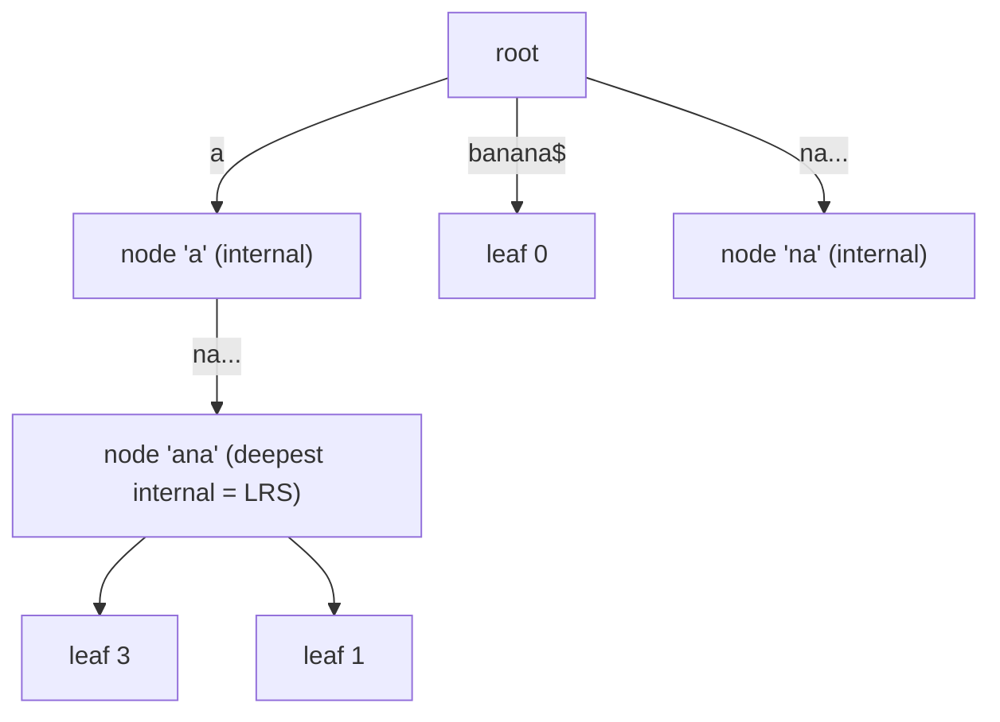

# Suffix Tree & Ukkonen's Algorithm — Junior Level

> **One-line summary:** A **suffix tree** of a string `S` (with a sentinel `$` appended) is a compressed trie containing every suffix of `S$`. Edges are labeled by substrings stored compactly as `[start, end]` index pairs, the tree has only `O(n)` nodes, and **Ukkonen's algorithm** builds it online in `O(n)` time using a global end pointer, suffix links, and an active point.

---

## Table of Contents

1. [Introduction](#introduction)
2. [Prerequisites](#prerequisites)
3. [Glossary](#glossary)
4. [Core Concepts](#core-concepts)
5. [Big-O Summary](#big-o-summary)
6. [Real-World Analogies](#real-world-analogies)
7. [Pros & Cons](#pros--cons)
8. [Step-by-Step Walkthrough](#step-by-step-walkthrough)
9. [Code Examples](#code-examples)
10. [Coding Patterns](#coding-patterns)
11. [Error Handling](#error-handling)
12. [Performance Tips](#performance-tips)
13. [Best Practices](#best-practices)
14. [Edge Cases & Pitfalls](#edge-cases--pitfalls)
15. [Common Mistakes](#common-mistakes)
16. [Cheat Sheet](#cheat-sheet)
17. [Visual Animation](#visual-animation)
18. [Summary](#summary)
19. [Further Reading](#further-reading)

---

## Introduction

Imagine someone hands you a long string `S` — a DNA strand, a book, a log file — and then fires off a stream of questions: *"Does the pattern `GATTACA` occur anywhere?"*, *"What is the longest substring that appears at least twice?"*, *"How many **distinct** substrings does `S` contain?"* A naive scan re-reads `S` for every query, costing `O(n·m)` per pattern. We would love a data structure built **once** that answers each of these in time proportional to the *answer*, not to `n`.

The **suffix tree** is exactly that structure. The key realization is this: **every substring of `S` is a prefix of some suffix of `S`.** So if we store *all suffixes* of `S` in a single trie, then searching for any substring becomes "walk down from the root following the pattern's characters." A plain trie of all suffixes would have `O(n²)` nodes (the suffixes together have `n + (n-1) + … + 1 ≈ n²/2` characters). The suffix tree fixes this by **compressing** every chain of single-child nodes into one edge labeled by a whole substring — and storing that label not as a copy of the text but as a pair of indices `[start, end]` into `S`. After compression the tree has at most `2n - 1` nodes and `2n - 2` edges, i.e. **`O(n)` total**.

There is one more trick that makes everything clean: we append a unique sentinel character `$` (one that never appears in `S`) to the end. Why? Without it, a suffix that is a prefix of another suffix (e.g. in `"banana"`, the suffix `"a"` is a prefix of `"ana"`) would end in the *middle* of an edge and have no node of its own. Adding `$` makes every suffix end at a **distinct leaf**, so the tree is "explicit" and the leaves number exactly `n+1`.

The hard part — and the reason this topic earns a whole file — is *building* the tree fast. The obvious build is `O(n²)` or even `O(n³)`. In 1995 Esko **Ukkonen** published an elegant algorithm that constructs the suffix tree **online** (one character at a time, left to right) in **`O(n)`** time. It hinges on three tricks: a **global end pointer** that extends all leaves for free, **suffix links** that let us jump between related nodes in `O(1)`, and an **active point** (with skip/count) that remembers where we are so we never re-walk the tree. This file builds intuition from the naive approach upward and prepares you for the full Ukkonen mechanics in `middle.md` and the correctness proofs in `professional.md`.

This topic has three close siblings you will hear compared constantly: **suffix arrays** (sibling `04`, a sorted array of suffix start indices that uses far less memory), **suffix automata** (sibling `12`, the minimal DFA recognizing all substrings), and the suffix tree here (`13`). They are deeply related — a suffix tree plus an LCP array is essentially a suffix array, and a suffix tree of the *reversed* string is the suffix automaton's dual. Keep all three in mind.

---

## Prerequisites

Before reading this file you should be comfortable with:

- **Strings, prefixes, suffixes, substrings.** A *suffix* of `S` starting at index `i` is `S[i..n-1]`. A *prefix* is `S[0..j]`. Every substring is a prefix of some suffix.
- **Tries (prefix trees).** A tree where each edge is labeled by a single character and a root-to-node path spells a string. See sibling `01-trie` / `tree-traversals`.
- **Recursion & tree traversal** — DFS over a tree, computing things bottom-up.
- **Big-O notation** — `O(n)`, `O(n²)`, `O(m)` where `m` is a pattern length.
- **Arrays and hash maps** — children of a node are stored in a `map[char]→node` or a fixed-size array indexed by alphabet.
- **Half-open vs closed intervals** — edge labels use index ranges; be precise about whether the end index is inclusive.

Optional but helpful:

- A glance at **suffix arrays** (sibling `04`) so the comparisons land.
- Familiarity with the idea of a **sentinel / terminator** character in string algorithms.

---

## Glossary

| Term | Meaning |
|------|---------|
| **Suffix** | `S[i..n-1]`, the tail of `S` starting at position `i`. `S$` has `n+1` suffixes. |
| **Sentinel `$`** | A unique character appended to `S`, lexicographically distinct, occurring nowhere else. Forces every suffix to end at a leaf. |
| **Trie** | A tree where each edge carries one character; a path from root spells a string. |
| **Suffix tree** | A *compressed* trie of all suffixes of `S$`. Each internal node (except root) has ≥ 2 children. |
| **Edge label `[start, end]`** | An edge stores a substring of `S` as a pair of indices, not a copy — `O(1)` space per edge. |
| **Leaf** | A node with no children; corresponds to exactly one suffix. There are `n+1` leaves. |
| **Internal node** | A node with ≥ 2 children. Represents a *branching* point — a repeated substring. |
| **Implicit suffix tree** | The (possibly non-explicit) tree for a prefix `S[0..i]` *without* a sentinel; some suffixes may end mid-edge. |
| **Global end (`#`)** | A single shared variable holding the current end index of all leaf edges. Incrementing it extends every leaf at once. |
| **Suffix link** | A pointer from internal node representing string `xα` to the node representing `α` (drop the first char). |
| **Active point** | The triple `(active_node, active_edge, active_length)` marking where the next insertion starts. |
| **Skip/count** | The trick of walking down an edge by index arithmetic instead of char-by-char, keeping descent `O(1)` amortized. |
| **Extension rule** | One of three cases (rules 1/2/3) describing what happens when we add the next character. |

---

## Core Concepts

### 1. From "all suffixes" to a tree

List the suffixes of `S = "banana$"` (indices `0..6`):

```
0: banana$
1: anana$
2: nana$
3: ana$
4: na$
5: a$
6: $
```

A plain trie inserts all seven strings. But notice the heavy sharing: `anana$` and `ana$` share the prefix `ana`, and `nana$`/`na$` share `na`. A trie would create a long single-child chain `a → n → a → n → a → $` for the first; the suffix tree **collapses** that chain into one edge labeled `"anana$"` (stored as `[1,6]`). Only where suffixes *diverge* do we keep an internal (branching) node.

### 2. Edges store `[start, end]`, not text

If an edge's label were a literal substring, the labels alone could total `O(n²)` characters. Instead each edge stores two integers `start` and `end` into the original `S`, so the label is `S[start..end]`. This is the single idea that turns `O(n²)` space into `O(n)`. Reading the label is just slicing `S`.

### 3. Why only `O(n)` nodes

There are exactly `n+1` leaves (one per suffix of `S$`). Every internal node has **at least two children** (otherwise it would have been compressed away). A tree where every internal node is at least binary and that has `L` leaves can have at most `L - 1` internal nodes. So total nodes `≤ (n+1) + n = 2n + 1 = O(n)`, and edges `≤ 2n = O(n)`. This bound is the foundation of every suffix-tree complexity claim.

### 4. The sentinel `$` makes the tree explicit

In `"banana"` (no `$`), the suffix `"a"` is a prefix of `"ana"`, so `"a"` would end in the middle of an edge with no node to mark it — the tree is *implicit*. Appending `$` (which appears nowhere else) guarantees no suffix is a prefix of another, so every suffix gets its own leaf. The resulting tree is **explicit**: every suffix corresponds to a real leaf.

### 5. The naive `O(n²)` / `O(n³)` build (our starting point)

The simplest correct build inserts each suffix one at a time:

```
for i in 0..n:
    insert suffix S[i..n] into the tree (walk/split as in a trie)
```

Walking and splitting for suffix `i` costs up to `O(n - i)`, so the total is `O(n²)`. If you also *copy* edge labels as strings instead of using indices, comparisons add another factor and you drift toward `O(n³)`. This is correct and easy to reason about — and it is the oracle we test Ukkonen against. But it is too slow for large `n`, which is exactly what motivates Ukkonen.

### 6. Ukkonen in one paragraph (preview)

Ukkonen builds the tree **online**, processing `S[0], S[1], …` left to right, maintaining the suffix tree of every prefix. At step `i+1` it must add character `S[i]` to the end of *all* suffixes seen so far. Three tricks make each step amortized `O(1)`:

- **Global end** — leaf edges all end at a shared variable `#`; one increment extends them all (Rule 1, "leaf extension is free").
- **Suffix links** — after creating an internal node, a pointer lets us hop to the next suffix's insertion point in `O(1)` instead of re-descending from the root.
- **Active point + skip/count** — `(active_node, active_edge, active_length)` remembers where the last insertion left off, and skip/count walks down long edges by arithmetic.

The full mechanics live in `middle.md`; here we just need to know *why* the naive build is slow and *what* Ukkonen fixes.

---

## Big-O Summary

| Operation | Time | Space | Notes |
|-----------|------|-------|-------|
| Naive suffix-tree build | **O(n²)** (or O(n³) if copying labels) | O(n²) worst | Insert each suffix into a trie. |
| **Ukkonen's build** | **O(n)** | O(n) | Online, three tricks. Constant hides alphabet factor. |
| Substring search "is `P` in `S`?" | **O(m)** | — | `m = |P|`; walk down following `P`. |
| Count occurrences of `P` | O(m + occ) | — | Walk to `P`, count leaves in subtree (`occ` = matches). |
| Longest repeated substring | **O(n)** | O(n) | Deepest internal node (by string-depth). |
| Longest common substring (k strings) | O(total length) | O(total) | Generalized suffix tree. |
| Number of distinct substrings | **O(n)** | O(n) | Sum of edge-label lengths over all edges. |
| Number of nodes / edges | O(n) | O(n) | `≤ 2n+1` nodes. |

The headline numbers: **`O(n)` to build (Ukkonen)** and **`O(m)` per substring query** — independent of `n` once built. That is the whole appeal.

---

## Real-World Analogies

| Concept | Analogy |
|---------|---------|
| Suffix tree | A book's index that lists *every possible* phrase starting point, merged so shared beginnings are written once. Look up any phrase by following letters down the index. |
| Edge as `[start, end]` | The index entry says "see page X, characters 10–25" instead of reprinting the text — a pointer, not a copy. |
| Sentinel `$` | A unique "end of file" marker so two phrases that look identical up to the end are still told apart by where they stop. |
| Internal node | A fork in the road that exists only because two different continuations share a common beginning — i.e. a repeated substring. |
| Global end pointer | A single ruler that, when you slide it one notch, lengthens *every* dangling thread at once — you do not re-measure each thread. |
| Suffix link | A secret shortcut tunnel: from the room "xANANA" you can instantly teleport to the room "ANANA" without walking back to the entrance. |
| Active point | A bookmark that remembers exactly where you stopped reading, so you resume instantly instead of starting from page one. |

Where the analogy breaks: a book index is static, but Ukkonen builds the index *while still reading the book*, never going back to revise earlier pages thanks to the global end and suffix links.

---

## Pros & Cons

| Pros | Cons |
|------|------|
| Substring queries in `O(m)`, independent of `n`. | Memory-heavy: `O(n)` nodes but a large constant (pointers, children maps) — often 20–40 bytes/char. |
| Linear-time construction (Ukkonen) once you implement it. | Ukkonen is genuinely tricky to implement correctly; off-by-ones abound. |
| Solves repeated/common substrings, distinct counts, and more in `O(n)`. | Suffix **arrays** give similar power with far less memory and simpler code. |
| Online: can extend with new trailing characters cheaply. | Cache-unfriendly pointer chasing; poor locality vs an array. |
| Exposes structure (branching = repeats) visually and algorithmically. | Alphabet handling (array vs map children) trades space for time. |

**When to use:** you need many fast substring queries, longest-repeated/common-substring, or distinct-substring counts; the string fits in memory; you can afford the implementation effort or use a library.

**When NOT to use:** memory is tight (prefer **suffix array** sibling `04`), you only need a handful of pattern searches (KMP/Z is simpler), or you need the minimal substring automaton (prefer **suffix automaton** sibling `12`).

---

## Step-by-Step Walkthrough

Let us build the suffix tree of `S = "banana$"` conceptually (naive insertion, to see the *shape*; Ukkonen produces the same final tree). Indices: `b=0 a=1 n=2 a=3 n=4 a=5 $=6`.

**Insert `banana$` (suffix 0).** The empty tree gains one leaf with edge `[0,6]` = `"banana$"`.

**Insert `anana$` (suffix 1).** No shared prefix with `banana$` (different first char), so add a second leaf edge `[1,6]`.

**Insert `nana$` (suffix 2).** First char `n` is new at the root → leaf edge `[2,6]`.

**Insert `ana$` (suffix 3).** It shares prefix `ana` with the existing `anana$` edge. We **split**: the edge `[1,6]` becomes `[1,3]` = `"ana"` up to a new internal node, which then has two children: the old tail `[4,6]` = `"na$"` and the new leaf `[6,6]` = `"$"`... — the divergence point is where `anana$` and `ana$` differ (`n` vs `$`). This split *creates an internal node* representing the repeated substring `"ana"`.

**Insert `na$` (suffix 4).** Shares `na` with `nana$`; split that edge similarly, creating an internal node for `"na"`.

**Insert `a$` (suffix 5).** Shares `a` with the `"ana"` branch; split near the root to create an internal node for `"a"`.

**Insert `$` (suffix 6).** A new leaf edge `[6,6]` = `"$"` straight off the root.

The final tree has `7` leaves (one per suffix) and a handful of internal nodes at the branch points `"a"`, `"ana"`, `"na"`. **Read the structure:** every internal node marks a substring that occurs more than once. The deepest internal node by string-depth is `"ana"` (depth 3) — and indeed `"ana"` is the **longest repeated substring** of `"banana"`. The tree literally *is* the answer.

Each split appended a divergence; each leaf is one suffix. That is the entire mechanism. Ukkonen reaches this same tree but processes characters left-to-right and reuses work via the active point and suffix links — turning the `O(n²)` of "re-walk for each suffix" into `O(n)`.

---

## Code Examples

Because a full Ukkonen implementation is long (it lives in `interview.md` and `middle.md`), the junior-level code here is the **naive `O(n²)` builder** plus a substring search — correct, readable, and the perfect oracle to test Ukkonen against.

### Naive Suffix Tree + Substring Search

#### Go

```go
package main

import "fmt"

type Node struct {
	start    int
	end      int // inclusive; -1 for root (no incoming edge)
	children map[byte]*Node
}

func newNode(start, end int) *Node {
	return &Node{start: start, end: end, children: make(map[byte]*Node)}
}

// build inserts every suffix of s (which should end with a sentinel) — O(n^2).
func build(s string) *Node {
	root := newNode(-1, -1)
	for i := 0; i < len(s); i++ {
		insert(root, s, i)
	}
	return root
}

func insert(root *Node, s string, suffixStart int) {
	node := root
	i := suffixStart
	for i < len(s) {
		c := s[i]
		child, ok := node.children[c]
		if !ok { // no edge starts with c → add a leaf for the rest
			node.children[c] = newNode(i, len(s)-1)
			return
		}
		// walk the edge, comparing characters
		j := child.start
		for j <= child.end && i < len(s) && s[i] == s[j] {
			i++
			j++
		}
		if j > child.end { // consumed whole edge → descend
			node = child
			continue
		}
		// mismatch in the middle → split the edge at j
		mid := newNode(child.start, j-1)
		node.children[c] = mid
		child.start = j
		mid.children[s[j]] = child
		mid.children[s[i]] = newNode(i, len(s)-1)
		return
	}
}

// contains returns true if pattern p occurs in s (the tree's string).
func contains(root *Node, s, p string) bool {
	node := root
	i := 0
	for i < len(p) {
		child, ok := node.children[p[i]]
		if !ok {
			return false
		}
		j := child.start
		for j <= child.end && i < len(p) {
			if s[j] != p[i] {
				return false
			}
			i++
			j++
		}
		node = child
	}
	return true
}

func main() {
	s := "banana$"
	root := build(s)
	fmt.Println(contains(root, s, "ana")) // true
	fmt.Println(contains(root, s, "nan")) // true
	fmt.Println(contains(root, s, "xyz")) // false
}
```

#### Java

```java
import java.util.*;

public class NaiveSuffixTree {
    static class Node {
        int start, end; // end inclusive; -1,-1 for root
        Map<Character, Node> children = new HashMap<>();
        Node(int s, int e) { start = s; end = e; }
    }

    static Node build(String s) {
        Node root = new Node(-1, -1);
        for (int i = 0; i < s.length(); i++) insert(root, s, i);
        return root;
    }

    static void insert(Node root, String s, int suffixStart) {
        Node node = root;
        int i = suffixStart;
        while (i < s.length()) {
            char c = s.charAt(i);
            Node child = node.children.get(c);
            if (child == null) {
                node.children.put(c, new Node(i, s.length() - 1));
                return;
            }
            int j = child.start;
            while (j <= child.end && i < s.length() && s.charAt(i) == s.charAt(j)) {
                i++; j++;
            }
            if (j > child.end) { node = child; continue; }
            Node mid = new Node(child.start, j - 1);
            node.children.put(c, mid);
            child.start = j;
            mid.children.put(s.charAt(j), child);
            mid.children.put(s.charAt(i), new Node(i, s.length() - 1));
            return;
        }
    }

    static boolean contains(Node root, String s, String p) {
        Node node = root;
        int i = 0;
        while (i < p.length()) {
            Node child = node.children.get(p.charAt(i));
            if (child == null) return false;
            int j = child.start;
            while (j <= child.end && i < p.length()) {
                if (s.charAt(j) != p.charAt(i)) return false;
                i++; j++;
            }
            node = child;
        }
        return true;
    }

    public static void main(String[] args) {
        String s = "banana$";
        Node root = build(s);
        System.out.println(contains(root, s, "ana")); // true
        System.out.println(contains(root, s, "nan")); // true
        System.out.println(contains(root, s, "xyz")); // false
    }
}
```

#### Python

```python
class Node:
    __slots__ = ("start", "end", "children")

    def __init__(self, start, end):
        self.start = start          # inclusive; -1 for root
        self.end = end
        self.children = {}


def build(s):
    """Naive O(n^2) suffix tree of s (s should end with a sentinel)."""
    root = Node(-1, -1)
    for i in range(len(s)):
        insert(root, s, i)
    return root


def insert(root, s, suffix_start):
    node, i = root, suffix_start
    while i < len(s):
        c = s[i]
        child = node.children.get(c)
        if child is None:                       # add a leaf for the rest
            node.children[c] = Node(i, len(s) - 1)
            return
        j = child.start
        while j <= child.end and i < len(s) and s[i] == s[j]:
            i += 1
            j += 1
        if j > child.end:                       # whole edge matched → descend
            node = child
            continue
        mid = Node(child.start, j - 1)          # split
        node.children[c] = mid
        child.start = j
        mid.children[s[j]] = child
        mid.children[s[i]] = Node(i, len(s) - 1)
        return


def contains(root, s, p):
    node, i = root, 0
    while i < len(p):
        child = node.children.get(p[i])
        if child is None:
            return False
        j = child.start
        while j <= child.end and i < len(p):
            if s[j] != p[i]:
                return False
            i += 1
            j += 1
        node = child
    return True


if __name__ == "__main__":
    s = "banana$"
    root = build(s)
    print(contains(root, s, "ana"))  # True
    print(contains(root, s, "nan"))  # True
    print(contains(root, s, "xyz"))  # False
```

**What it does:** builds the suffix tree of `"banana$"` the naive way and answers substring queries in `O(m)`.
**Run:** `go run main.go` | `javac NaiveSuffixTree.java && java NaiveSuffixTree` | `python tree.py`

---

## Coding Patterns

### Pattern 1: Substring membership = walk down

**Intent:** answer "is `P` a substring of `S`?" in `O(|P|)`. Start at the root and follow `P`'s characters, descending into the matching child and matching along the edge label. If you ever cannot match a character, `P` is absent; if you consume all of `P`, it is present.

### Pattern 2: Count occurrences = count leaves below

**Intent:** the number of times `P` occurs equals the number of **leaves** in the subtree below the point where `P` ends. Precompute, for each node, the count of leaves under it (one DFS). Then count = leaf-count at `P`'s endpoint.

### Pattern 3: Longest repeated substring = deepest internal node

**Intent:** an internal node exists only where two suffixes diverge, i.e. a substring that occurs ≥ 2 times. The internal node with the greatest **string-depth** (sum of edge-label lengths from the root) spells the longest repeated substring.



### Pattern 4: Distinct substrings = sum of edge lengths

**Intent:** every distinct substring corresponds to a *position along some edge* (a prefix of a root-to-node path). So the number of distinct non-empty substrings equals the **total number of characters on all edges** (excluding the `$` contributions you decide to drop). One DFS summing `(end - start + 1)` over every edge gives it in `O(n)`.

---

## Error Handling

| Error | Cause | Fix |
|-------|-------|-----|
| Tree has missing leaves | Forgot to append the sentinel `$`; some suffix is a prefix of another and ends mid-edge. | Always append a unique `$` (or `\0`) before building. |
| Off-by-one in edge label | Mixed inclusive `[start,end]` with half-open `[start,end)` conventions. | Pick one convention, document it, and stick to it everywhere. |
| Infinite loop on descent | Edge length computed wrong, so the walk never advances. | Use `length = end - start + 1` (inclusive) consistently. |
| Wrong substring count | Counted the sentinel `$` edge or double-counted root. | Decide whether `$`-only substrings count; subtract them explicitly. |
| `nil`/`null` child access | Assumed a child exists without checking the map. | Always check `children[c]` before dereferencing. |
| Search false negatives | Compared pattern against the *node*, not along the *edge label*. | Match character-by-character along `S[start..end]`. |

---

## Performance Tips

- **Use index pairs, never string copies** for edge labels. Copying makes it `O(n²)` space and slow.
- **Store the global end as a shared pointer/variable** in Ukkonen so all leaf edges extend with a single update.
- **Children as a fixed array** (size = alphabet) gives `O(1)` child lookup vs a hash map's overhead — great for DNA (`{A,C,G,T,$}`) but wasteful for Unicode.
- **One DFS for aggregates** — compute leaf-counts, string-depths, and distinct-substring sums in a single post-order pass.
- **Reserve capacity** for node arrays up front (`≤ 2n+1`) to avoid reallocation churn during the build.
- **Prefer a suffix array** when memory matters; it is often 4–8× lighter and cache-friendly for the same queries.

---

## Best Practices

- **Always append a sentinel** `$` that is strictly smaller (or just unique) and never appears in `S`. This single habit eliminates a whole class of "implicit tree" bugs.
- **Test against the naive builder.** Build both the naive tree and Ukkonen's tree on random strings and compare the set of substrings / the answers to queries.
- **Document your interval convention** (inclusive end vs global `#`) at the top of the file.
- **Separate construction from queries.** Build once; expose `contains`, `countOccurrences`, `longestRepeated`, etc., as independent read-only traversals.
- **Use a library if you can.** A correct Ukkonen implementation is subtle; for production, a vetted suffix-array library is often the pragmatic choice.

---

## Edge Cases & Pitfalls

- **Empty string** — the tree is just the root (plus the `$` leaf if you append the sentinel). Handle `n = 0` explicitly.
- **All identical characters** (`"aaaa$"`) — produces a deep, skinny tree; a classic stress test that exposes off-by-one and active-length bugs in Ukkonen.
- **Missing sentinel** — the tree becomes *implicit*; some suffixes vanish into edge interiors. Almost every subtle bug traces back to this.
- **Sentinel that also appears in `S`** — defeats the purpose; the "unique" requirement is real. Use `\0` or a char outside your alphabet.
- **Multibyte / Unicode** — index `[start,end]` must index the same unit you compare on (bytes vs runes). Be consistent.
- **Generalized tree** — when combining strings `S1#S2$`, use **two distinct** separators so leaves of different strings stay distinguishable.
- **Pattern longer than `S`** — search must bail out (return false) when it runs off a leaf before consuming `P`.

---

## Common Mistakes

1. **Forgetting the sentinel `$`** — the most common and most confusing bug; produces a missing-leaf, implicit tree.
2. **Copying edge labels as strings** — blows space up to `O(n²)` and defeats the entire point of index pairs.
3. **Inclusive/half-open confusion** — mixing `[start,end]` (inclusive) with `[start,end)` somewhere; leads to off-by-one walks.
4. **Matching against the node instead of the edge** — you must compare along the *edge label*, not assume a single character per step.
5. **Counting the sentinel in distinct-substring answers** — decide and document whether `$`-containing substrings count.
6. **Re-walking from the root for each suffix in Ukkonen** — that throws away the active point and reverts you to `O(n²)`.
7. **One shared separator for a generalized tree** — two strings can then masquerade as one; use distinct separators `#`, `$`.

---

## Cheat Sheet

| Question | Where in the tree | Cost |
|----------|-------------------|------|
| Is `P` a substring? | Walk from root following `P` | `O(m)` |
| How many times does `P` occur? | Leaves under `P`'s endpoint | `O(m + occ)` |
| Longest repeated substring | Deepest **internal** node (string-depth) | `O(n)` build + `O(n)` DFS |
| Longest common substring (2+ strings) | Deepest node whose subtree has leaves from all strings | `O(total)` |
| Number of distinct substrings | Sum of all edge-label lengths | `O(n)` DFS |
| Number of suffixes / leaves | `n + 1` (with sentinel) | — |
| Max number of nodes | `≤ 2n + 1` | — |

Core facts:

```
suffix tree of S$  =  compressed trie of all suffixes of S$
edges labeled by [start, end] index pairs        → O(1) space/edge
n+1 leaves, ≤ n internal nodes, ≤ 2n edges        → O(n) total
naive build: O(n^2)        Ukkonen: O(n) online
query "is P in S?": O(|P|)
Ukkonen's 3 tricks: global end • suffix links • active point (+skip/count)
```

---

## Visual Animation

> See [`animation.html`](./animation.html) for an interactive visualization.
>
> The animation demonstrates:
> - Adding characters of `S$` one at a time (Ukkonen's online build)
> - The **active point** `(active_node, active_edge, active_length)` highlighted as it moves
> - The **global end** sliding to extend all leaves at once (Rule 1)
> - **Rule 2** splits creating new internal nodes, and **suffix links** drawn as dashed arrows
> - Play / Pause / Step controls and an **editable string** so you can build your own tree

---

## Summary

A suffix tree is a compressed trie of all suffixes of `S$`, with edges stored as `[start, end]` index pairs so the whole structure fits in `O(n)` nodes and space. Appending a unique sentinel `$` makes every suffix end at its own leaf, giving an explicit tree with `n+1` leaves and at most `n` internal nodes. Once built, it answers substring queries in `O(m)`, finds the longest repeated substring as its deepest internal node, counts distinct substrings as the sum of edge lengths, and (in generalized form) finds the longest common substring of several strings. The naive build is `O(n²)`; **Ukkonen's algorithm** builds it online in `O(n)` using a global end pointer (free leaf extension), suffix links (`O(1)` hops), and an active point with skip/count. Master the shape and the queries here; the active-point mechanics and the three extension rules are the subject of `middle.md` and `professional.md`.

---

## Further Reading

- Esko Ukkonen, *"On-line construction of suffix trees"* (Algorithmica, 1995) — the original paper.
- Dan Gusfield, *Algorithms on Strings, Trees, and Sequences* — the canonical textbook treatment of suffix trees and Ukkonen.
- Sibling topic `04-suffix-array` — the lighter-weight array alternative (suffix tree + LCP ≈ suffix array).
- Sibling topic `12-suffix-automaton` — the minimal substring DFA, deeply related to the suffix tree of the reversed string.
- cp-algorithms.com — "Suffix Tree. Ukkonen's Algorithm" and "Suffix Automaton".
- Stanford CS166 lecture notes — suffix trees, suffix arrays, and their equivalence.
