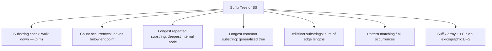

# Suffix Tree & Ukkonen's Algorithm — Middle Level

> **Focus:** Ukkonen's three tricks — the **global end pointer** ("leaf extension is free"), **suffix links**, and the **active point** `(active_node, active_edge, active_length)` with skip/count — plus the **three extension rules**, the implicit-to-explicit transition, the classic applications, and how the suffix tree compares to suffix arrays (sibling `04`) and suffix automata (sibling `12`).

---

## Table of Contents

1. [Introduction](#introduction)
2. [Deeper Concepts](#deeper-concepts)
3. [The Three Tricks](#the-three-tricks)
4. [The Three Extension Rules](#the-three-extension-rules)
5. [Implicit to Explicit](#implicit-to-explicit)
6. [Comparison with Alternatives](#comparison-with-alternatives)
7. [Applications](#applications)
8. [Code Examples](#code-examples)
9. [Error Handling](#error-handling)
10. [Performance Analysis](#performance-analysis)
11. [Best Practices](#best-practices)
12. [Visual Animation](#visual-animation)
13. [Summary](#summary)

---

## Introduction

At junior level the message was: a suffix tree is a compressed trie of all suffixes of `S$`, it has `O(n)` nodes, and the naive build is `O(n²)`. Now we earn the linear-time build. The core challenge of Ukkonen's algorithm is this:

> Process `S` **left to right**. After reading the prefix `S[0..i]`, maintain the suffix tree of that prefix. To go from `i` to `i+1`, you must append `S[i+1]` to the end of **every** suffix currently in the tree — that is `i+2` suffixes — and the naive way to do this is `O(n)` work per character, hence `O(n²)`.

Ukkonen's genius is to make almost all of that work **disappear** or become **amortized `O(1)`**, through three interlocking tricks. Once you internalize the three tricks and the three extension rules, the algorithm collapses from "impossible to follow" to "a tight loop with a handful of cases." That transition is exactly what this file delivers.

The mental model: each "phase" `i` adds one character `S[i]`. Within a phase, we perform a sequence of "extensions," one per suffix that still needs updating. We track where we are with the **active point**. Two of the three extensions rules are essentially free (Rules 1 and 3); only Rule 2 does real structural work (splitting an edge and creating an internal node), and a clever counting argument bounds the total number of Rule-2 operations to `O(n)`.

---

## Deeper Concepts

### Phases and extensions

Ukkonen runs `n` **phases**. Phase `i` (0-indexed) extends the tree from the suffix tree of `S[0..i-1]` to that of `S[0..i]` by adding character `c = S[i]`. Inside phase `i`, conceptually we must update suffixes `S[0..i], S[1..i], …, S[i..i]` — that is, append `c` to each. Each such update is an **extension** governed by one of three rules.

The naive view does `O(i)` extensions per phase → `O(n²)`. Ukkonen's tricks reduce the *real* work per phase to amortized `O(1)`:

- Many extensions are **Rule 1** (extend a leaf) — handled for *free* by the global end.
- The remaining ones start where the previous phase's "non-leaf" work left off — tracked by the **active point** — so we never redo extensions we already finished.
- The **first extension that does real work** in a phase, and the hop to the next suffix, use **suffix links** to avoid re-descending from the root.

### The active point: where are we?

The **active point** is a triple:

- `active_node` — the node from which the current insertion proceeds (starts at root).
- `active_edge` — *which* outgoing edge we are on, identified by a character (or its index in `S`).
- `active_length` — how many characters **into** that edge we currently are.

When `active_length == 0`, we are sitting *at* `active_node`. When `active_length > 0`, we are somewhere in the middle of the edge `active_node → (child along active_edge)`. The active point marks the location of the **end of the longest suffix not yet explicitly represented** — the place where the next character will be added.

### remaining (suffixes still to insert)

We also keep `remaining` — a counter of how many suffixes still need to be explicitly inserted in the current phase. Each phase increments `remaining` by 1 (a new suffix appeared). Each time we *do* insert a suffix (a Rule-2 split or a fresh leaf), we decrement `remaining`. When Rule 3 fires (the character is already there), we stop the phase early, leaving `remaining > 0` to be carried into the next phase — this is the **"implicit" backlog**.

---

## The Three Tricks

### Trick 1 — The global end pointer ("leaf extension is free")

Every **leaf** edge ends at the current end of the string. Instead of storing a concrete `end` index in each leaf, store a **single shared variable** `leafEnd` (often written `#` or `END`). All leaf edges' `end` field *points to* this shared variable. When we begin phase `i`, we do **one** assignment:

```
leafEnd = i        // every leaf edge instantly grows to include S[i]
```

This single update performs **all the Rule-1 extensions** of the phase at once, in `O(1)` total. This is the observation Ukkonen calls "once a leaf, always a leaf": a leaf created in some phase stays a leaf forever, and its edge keeps extending to the right automatically. Without this trick you would touch every leaf every phase — `O(n²)`. With it, leaf growth costs nothing per phase.

### Trick 2 — Suffix links

A **suffix link** is a pointer from an internal node representing the string `xα` (some first char `x` followed by string `α`) to the internal node representing `α` (drop the first character). Formally, if an internal node `v` has path-label `xα`, its suffix link `slink(v)` points to the node with path-label `α` (which is guaranteed to exist, a fact proved in `professional.md`).

Why we need them: within a phase, after we insert the suffix starting at position `j`, the *next* extension concerns the suffix starting at `j+1` — which is exactly the current string with its first character dropped. Suffix links let us jump from "where we just were" to "where the next suffix's insertion point is" in `O(1)`, instead of walking back up to the root and descending again (`O(depth)`). New internal nodes created by Rule 2 get their suffix links set during the *same* phase, typically one extension later.

### Trick 3 — The active point with skip/count

The active point (above) remembers the exact location where the next phase's work resumes, so consecutive phases share a moving cursor rather than restarting. But there is a subtlety: after following a suffix link to `active_node = slink(prev)`, we may need to **re-descend** by `active_length` characters to reach the right spot — and `active_length` can be large.

**Skip/count** makes that descent `O(1)` amortized: instead of comparing characters one at a time, we look at the first character to pick the edge, then **compare the remaining `active_length` against the edge length**. If the edge is shorter, subtract its length and jump straight to its child (no per-character comparison — we *know* the characters match because this substring already exists in the tree). Repeat until the remaining length fits within an edge. Each "skip" advances us by a whole edge in `O(1)`, and a classic amortized argument (node-depth can decrease by at most 1 per suffix-link hop and increases bounded overall) bounds the *total* skip work across the whole algorithm to `O(n)`.

---

## The Three Extension Rules

Within a phase, when we try to add character `c = S[i]` at the active point, exactly one of three rules applies:

### Rule 1 — Extend a leaf

If the active point is at the end of a path that terminates at a **leaf edge**, just extend that leaf by one character. With the global-end trick this is *automatic* — we did it already by setting `leafEnd = i`. No explicit work.

### Rule 2 — Create a new leaf (and possibly split)

If the active point is at a place where `c` does **not** already continue the path, we must add a new branch for `c`:

- If the active point is **inside an edge** (`active_length > 0`), **split** that edge at the active point: create a new **internal node**, attach the existing continuation as one child and a **new leaf** (edge `[i, leafEnd]`) for `c` as another child.
- If the active point is **at a node** (`active_length == 0`), simply add a new leaf child for `c`.

Rule 2 is the only rule that **creates internal nodes and new leaves** — the real structural work. After a Rule-2 split, we set a **suffix link** from the newly created internal node (it is set on the *next* Rule-2 internal node we create within the phase, forming a chain; the last one links to the active node or root). We then **decrement `remaining`** and follow a suffix link (or, if at root, decrement `active_length` and advance `active_edge`) to process the next shorter suffix.

### Rule 3 — Character already there (do nothing, stop the phase)

If the next character `c` is **already present** at the active point (the edge continues with `c`, or the node already has a child starting with `c`), then every shorter suffix is *also* already present (they are suffixes of this one). So we:

- **Increment `active_length`** (we moved one character deeper along the edge), and
- **Stop the phase immediately** — this is the **"show-stopper"** rule. The remaining suffixes stay *implicit* and `remaining` carries into the next phase.

Rule 3 is what keeps the tree **implicit** between phases and is the reason a phase can be `O(1)`.

### The active-point update conventions

After **Rule 2** when `active_node` is the **root** and `active_length > 0`:
- decrement `active_length` by 1,
- set `active_edge = i - remaining + 1` (the start index of the next suffix to insert).

After **Rule 2** when `active_node` is **not** the root:
- follow the suffix link: `active_node = slink(active_node)` (or root if none).

These two conventions, plus skip/count for re-descending, are the trickiest part to get right. They are the canonical source of off-by-one bugs.

---

## Implicit to Explicit

During construction (no sentinel yet), the tree after phase `i` is the **implicit suffix tree** of `S[0..i]`: some suffixes may end in the *middle* of an edge (because they are prefixes of longer suffixes) and have no leaf. That is fine and intended — Rule 3 deliberately leaves them implicit.

To get the final **explicit** suffix tree where *every* suffix is a leaf, append a **unique sentinel** `$` (a character not in `S`) and run one more phase for it. Because `$` matches nothing already in the tree, every pending implicit suffix triggers Rule 2 and becomes an explicit leaf. After the `$` phase, `remaining` returns to 0 and the tree is explicit. **This is why we always build on `S$`, not `S`.**

Equivalently: the implicit suffix tree of `S$` *is* the explicit suffix tree of `S$`, because no suffix of `S$` is a prefix of another (the `$` is unique). So "append `$` then run Ukkonen" yields the explicit tree directly.

---

## Comparison with Alternatives

### Suffix tree vs suffix array (sibling `04`) vs suffix automaton (sibling `12`)

| Structure | Build time | Space (typical) | Strengths | Weaknesses |
|-----------|-----------|------------------|-----------|------------|
| **Suffix tree** | `O(n)` (Ukkonen) | `~20–40 n` bytes | `O(m)` queries, LRS/LCS/distinct in `O(n)`, online | heavy memory, tricky to code, poor cache locality |
| **Suffix array + LCP** | `O(n)` or `O(n log n)` | `~8 n` bytes | compact, cache-friendly, simple, same query power with binary search | searches `O(m log n)` (or `O(m + log n)` with LCP), not online |
| **Suffix automaton** | `O(n)` | `~O(n)` states/transitions | minimal substring DFA, distinct substrings, online, smallest for many tasks | less intuitive, edge labels are single chars |

The practical headline: **a suffix tree and a (suffix array + LCP array) carry the same information.** A DFS over the suffix tree in lexicographic order of edges visits leaves in suffix-array order, and the string-depths of the lowest common ancestors are the LCP values. So many engineers build a **suffix array** instead (less memory, simpler) and recover tree-like queries from it. Choose the suffix tree when you specifically need `O(m)` walking, online extension, or the explicit branching structure; choose the suffix array when memory and simplicity dominate; choose the suffix automaton when you want the minimal automaton or count distinct substrings incrementally.

### Suffix tree vs single-pattern matchers (KMP / Z)

If you only search for **one** pattern in one text, KMP or Z-algorithm (`O(n + m)`, tiny memory) beats building a suffix tree. The suffix tree pays off when you issue **many** queries against the **same** text, or need substring-structure questions (repeats, distinct counts, common substrings).

---

## Applications



### 1. Substring check — `O(m)`

Walk from the root following the pattern's characters along edge labels. If you consume the whole pattern, it occurs; otherwise it does not. Independent of `n`.

### 2. Longest repeated substring (LRS)

An internal node exists **iff** its path-label occurs at least twice (two suffixes diverge there). The internal node of greatest **string-depth** spells the LRS. One DFS computing string-depths finds it in `O(n)`.

### 3. Longest common substring (LCS) — generalized suffix tree

Build a tree of two strings `A#B$` (distinct separators!). Mark each internal node with which input strings have leaves in its subtree. The deepest node whose subtree contains leaves from **both** strings spells the longest common substring. Generalizes to `k` strings.

### 4. Number of distinct substrings

Every distinct substring is a unique path-prefix from the root, i.e. a position along some edge. So the count of distinct non-empty substrings equals the **sum of all edge-label lengths**. One DFS over edges, `O(n)`. (Decide whether to count `$`-bearing substrings and subtract accordingly.)

### 5. Pattern matching — all occurrences

Walk to the pattern's endpoint, then enumerate the **leaves** in the subtree below; each leaf's suffix-start index is an occurrence. Cost `O(m + occ)`.

---

## Code Examples

The full, correct Ukkonen build is the centerpiece. It uses the global end (`leafEnd`), suffix links, and the active point with skip/count.

### Ukkonen's Algorithm

#### Python

```python
class Node:
    __slots__ = ("start", "end", "children", "link")

    def __init__(self, start, end):
        self.start = start          # edge start index (into text)
        self.end = end              # int box; leaves share the global end
        self.children = {}
        self.link = None            # suffix link


class SuffixTree:
    def __init__(self, text):
        self.text = text
        self.root = Node(-1, [-1])  # end stored as a 1-element list (mutable box)
        self.root.link = self.root
        self.active_node = self.root
        self.active_edge = -1       # index into text of the active edge's first char
        self.active_length = 0
        self.remaining = 0
        self.leaf_end = [-1]        # GLOBAL END (shared mutable box)
        self.build()

    def edge_len(self, node):
        return node.end[0] - node.start + 1

    def build(self):
        for i in range(len(self.text)):
            self._extend(i)

    def _extend(self, i):
        self.leaf_end[0] = i                       # Trick 1: extend all leaves (Rule 1)
        self.remaining += 1
        last_new = None                            # for setting suffix links
        while self.remaining > 0:
            if self.active_length == 0:
                self.active_edge = i               # active edge starts at current char
            c = self.text[self.active_edge]
            if c not in self.active_node.children:
                # Rule 2: new leaf directly at active_node
                leaf = Node(i, self.leaf_end)
                self.active_node.children[c] = leaf
                if last_new is not None:
                    last_new.link = self.active_node
                    last_new = None
            else:
                nxt = self.active_node.children[c]
                if self._walk_down(nxt, i):
                    continue                       # skip/count descended into nxt
                if self.text[nxt.start + self.active_length] == self.text[i]:
                    # Rule 3: char already present → stop phase
                    if last_new is not None and self.active_node is not self.root:
                        last_new.link = self.active_node
                    self.active_length += 1
                    break
                # Rule 2 with split: create internal node
                split_end = [nxt.start + self.active_length - 1]
                split = Node(nxt.start, split_end)
                self.active_node.children[c] = split
                split.children[self.text[i]] = Node(i, self.leaf_end)
                nxt.start += self.active_length
                split.children[self.text[nxt.start]] = nxt
                if last_new is not None:
                    last_new.link = split
                last_new = split
            self.remaining -= 1
            # move active point to next shorter suffix
            if self.active_node is self.root and self.active_length > 0:
                self.active_length -= 1
                self.active_edge = i - self.remaining + 1
            elif self.active_node is not self.root:
                # follow the suffix link; an unset link (newly split node) means root
                self.active_node = self.active_node.link or self.root

    def _walk_down(self, node, i):
        """Skip/count: if active_length spans the whole edge, descend."""
        l = self.edge_len(node)
        if self.active_length >= l:
            self.active_edge += l
            self.active_length -= l
            self.active_node = node
            return True
        return False


def contains(tree, p):
    node, text = tree.root, tree.text
    i = 0
    while i < len(p):
        child = node.children.get(p[i])
        if child is None:
            return False
        j = child.start
        while j <= child.end[0] and i < len(p):
            if text[j] != p[i]:
                return False
            i += 1
            j += 1
        node = child
    return True


if __name__ == "__main__":
    t = SuffixTree("banana$")
    print(contains(t, "ana"))  # True
    print(contains(t, "nan"))  # True
    print(contains(t, "xyz"))  # False
```

#### Go

```go
package main

import "fmt"

type Node struct {
	start    int
	end      *int // leaves share the global end
	children map[byte]*Node
	link     *Node
}

type SuffixTree struct {
	text                                  string
	root, activeNode                      *Node
	activeEdge, activeLength, remaining   int
	leafEnd                               int
}

func newNode(start int, end *int) *Node {
	return &Node{start: start, end: end, children: make(map[byte]*Node)}
}

func (t *SuffixTree) edgeLen(n *Node) int { return *n.end - n.start + 1 }

func (t *SuffixTree) walkDown(n *Node) bool {
	if l := t.edgeLen(n); t.activeLength >= l {
		t.activeEdge += l
		t.activeLength -= l
		t.activeNode = n
		return true
	}
	return false
}

func (t *SuffixTree) extend(i int) {
	t.leafEnd = i // Trick 1: Rule 1 for all leaves
	t.remaining++
	var lastNew *Node
	for t.remaining > 0 {
		if t.activeLength == 0 {
			t.activeEdge = i
		}
		c := t.text[t.activeEdge]
		nxt, ok := t.activeNode.children[c]
		if !ok {
			leaf := newNode(i, &t.leafEnd)
			t.activeNode.children[c] = leaf
			if lastNew != nil {
				lastNew.link = t.activeNode
				lastNew = nil
			}
		} else {
			if t.walkDown(nxt) {
				continue
			}
			if t.text[nxt.start+t.activeLength] == t.text[i] {
				if lastNew != nil && t.activeNode != t.root {
					lastNew.link = t.activeNode
				}
				t.activeLength++
				break // Rule 3
			}
			splitEnd := nxt.start + t.activeLength - 1
			split := newNode(nxt.start, &splitEnd)
			t.activeNode.children[c] = split
			split.children[t.text[i]] = newNode(i, &t.leafEnd)
			nxt.start += t.activeLength
			split.children[t.text[nxt.start]] = nxt
			if lastNew != nil {
				lastNew.link = split
			}
			lastNew = split
		}
		t.remaining--
		if t.activeNode == t.root && t.activeLength > 0 {
			t.activeLength--
			t.activeEdge = i - t.remaining + 1
		} else if t.activeNode != t.root {
			if t.activeNode.link != nil {
				t.activeNode = t.activeNode.link
			} else {
				t.activeNode = t.root // unset link (just-split node) → root
			}
		}
	}
}

func Build(text string) *SuffixTree {
	end := -1
	t := &SuffixTree{text: text, leafEnd: -1}
	t.root = newNode(-1, &end)
	t.root.link = t.root
	t.activeNode = t.root
	t.activeEdge = -1
	for i := 0; i < len(text); i++ {
		t.extend(i)
	}
	return t
}

func main() {
	t := Build("banana$")
	fmt.Println(t.text) // banana$ (tree built; see interview.md for queries)
}
```

#### Java

```java
import java.util.*;

public class Ukkonen {
    String text;
    Node root, activeNode;
    int activeEdge = -1, activeLength = 0, remaining = 0, leafEnd = -1;

    class Node {
        int start;
        int[] end;            // leaves share the global end box
        Map<Character, Node> children = new HashMap<>();
        Node link;
        Node(int s, int[] e) { start = s; end = e; }
        int edgeLen() { return end[0] - start + 1; }
    }

    int[] globalEnd = {-1};

    Ukkonen(String text) {
        this.text = text;
        root = new Node(-1, new int[]{-1});
        root.link = root;
        activeNode = root;
        for (int i = 0; i < text.length(); i++) extend(i);
    }

    boolean walkDown(Node n) {
        int l = n.edgeLen();
        if (activeLength >= l) {
            activeEdge += l; activeLength -= l; activeNode = n;
            return true;
        }
        return false;
    }

    void extend(int i) {
        globalEnd[0] = i;            // Rule 1 for all leaves
        leafEnd = i;
        remaining++;
        Node lastNew = null;
        while (remaining > 0) {
            if (activeLength == 0) activeEdge = i;
            char c = text.charAt(activeEdge);
            Node nxt = activeNode.children.get(c);
            if (nxt == null) {
                activeNode.children.put(c, new Node(i, globalEnd));
                if (lastNew != null) { lastNew.link = activeNode; lastNew = null; }
            } else {
                if (walkDown(nxt)) continue;
                if (text.charAt(nxt.start + activeLength) == text.charAt(i)) {
                    if (lastNew != null && activeNode != root) lastNew.link = activeNode;
                    activeLength++;
                    break;           // Rule 3
                }
                int[] splitEnd = {nxt.start + activeLength - 1};
                Node split = new Node(nxt.start, splitEnd);
                activeNode.children.put(c, split);
                split.children.put(text.charAt(i), new Node(i, globalEnd));
                nxt.start += activeLength;
                split.children.put(text.charAt(nxt.start), nxt);
                if (lastNew != null) lastNew.link = split;
                lastNew = split;
            }
            remaining--;
            if (activeNode == root && activeLength > 0) {
                activeLength--;
                activeEdge = i - remaining + 1;
            } else if (activeNode != root) {
                // unset link (just-split node) → root
                activeNode = (activeNode.link != null) ? activeNode.link : root;
            }
        }
    }

    public static void main(String[] args) {
        Ukkonen t = new Ukkonen("banana$");
        System.out.println(t.text); // built; see interview.md for query helpers
    }
}
```

**What it does:** builds the explicit suffix tree of `"banana$"` in `O(n)` using all three tricks; the Python version includes a `contains` query.
**Run:** `python tree.py` | `go run main.go` | `javac Ukkonen.java && java Ukkonen`

---

## Error Handling

| Scenario | What goes wrong | Correct approach |
|----------|-----------------|------------------|
| No sentinel appended | Last suffix(es) stay implicit; tree not explicit. | Always build on `S$` with a unique `$`. |
| Leaf `end` stored as a value | Leaves stop growing; Rule 1 breaks. | Store leaf `end` as a *reference/box* to the shared `leafEnd`. |
| Missing suffix-link setup | Re-descend from root each extension → `O(n²)`. | Set `last_new.link` on the next created internal node (or active node). |
| `active_edge` desync after Rule 2 at root | Wrong suffix inserted; corrupted tree. | After root Rule 2: `active_length--`, `active_edge = i - remaining + 1`. |
| Skip/count off-by-one | Walk lands inside the wrong edge. | Use `edge_len = end - start + 1`; descend while `active_length >= edge_len`. |
| Reading char past edge end | Index out of range during Rule-3 check. | Always `walk_down` first so `active_length < edge_len` before comparing. |
| Generalized tree mixing strings | Cross-string false matches. | Use **distinct** separators (`#`, `$`) per string. |

---

## Performance Analysis

| Quantity | Bound | Why |
|----------|-------|-----|
| Phases | `n` | one per character of `S$` |
| Total Rule-2 splits/leaves | `O(n)` | `remaining` decremented `O(n)` times total |
| Total skip/count work | `O(n)` | node-depth amortization argument |
| Suffix-link hops | `O(n)` | one per Rule-2 extension at most |
| Build time | **`O(n)`** | sum of the above |
| Space | **`O(n)`** | `≤ 2n+1` nodes, `O(1)` per edge |

The amortized argument (full version in `professional.md`): each phase's "show-stopper" Rule 3 makes the phase `O(1)` *plus* the number of Rule-2 extensions it performs. Across all phases, the total number of Rule-2 extensions is bounded by `n` because each one corresponds to a suffix becoming explicit exactly once. Skip/count descents are paid for by a potential function on the current node depth, which can rise at most `O(n)` overall. Net: `O(n)`.

For alphabet `Σ`, child lookup is `O(1)` with an array of size `|Σ|` (great for DNA) or `O(1)` expected with a hash map (general). Using an array multiplies space by `|Σ|`; using a map keeps space `O(n)` but adds hashing overhead. Choose per alphabet size.

---

## Best Practices

- **Always build on `S$`** with a unique sentinel; this is the single most important correctness rule.
- **Store leaf `end` as a shared box/reference** so the global-end trick actually extends leaves.
- **Implement skip/count via `walk_down` first**, before any character comparison, to keep `active_length` within the current edge.
- **Set suffix links eagerly** within the phase: link the previously created internal node to the newly created one (or to the active node on Rule 3 at a non-root).
- **Test against the naive `O(n²)` builder** (from `junior.md`) on random strings: compare substring sets, distinct counts, and query answers.
- **Prefer a suffix array** when memory or simplicity dominates; reach for the tree when you need `O(m)` walking or online growth.

---

## Visual Animation

> See [`animation.html`](./animation.html) for an interactive view.
>
> The middle-level animation highlights:
> - Each **phase** adding one character, with the **global end** sliding to extend all leaf edges (Rule 1).
> - The **active point** `(active_node, active_edge, active_length)` drawn as a moving marker.
> - **Rule 2** splits creating internal nodes (a new branch appears), and **Rule 3** stopping a phase early.
> - **Suffix links** drawn as dashed arrows between internal nodes as they are created.

---

## Summary

Ukkonen builds the suffix tree of `S$` online in `O(n)` by running `n` phases, one per character, and reducing the per-phase work to amortized `O(1)` via three tricks. The **global end pointer** makes leaf extension (Rule 1) free — set `leafEnd = i` once and every leaf grows. **Suffix links** let each extension hop to the next shorter suffix's insertion point in `O(1)` instead of re-descending from the root. The **active point** `(active_node, active_edge, active_length)` with **skip/count** remembers where work resumes and descends long edges by arithmetic. The **three extension rules** are: Rule 1 (extend a leaf — automatic), Rule 2 (split/create a leaf and an internal node — the only real structural work, bounded to `O(n)` total), and Rule 3 (character already present — increment `active_length` and stop the phase, leaving suffixes implicit). Appending the sentinel `$` turns the implicit tree into the explicit one. The result supports `O(m)` substring queries, `O(n)` longest-repeated and distinct-substring computations, and generalized-tree longest-common-substring — though in practice the lighter **suffix array** (sibling `04`) or **suffix automaton** (sibling `12`) is often preferred for memory and simplicity.
