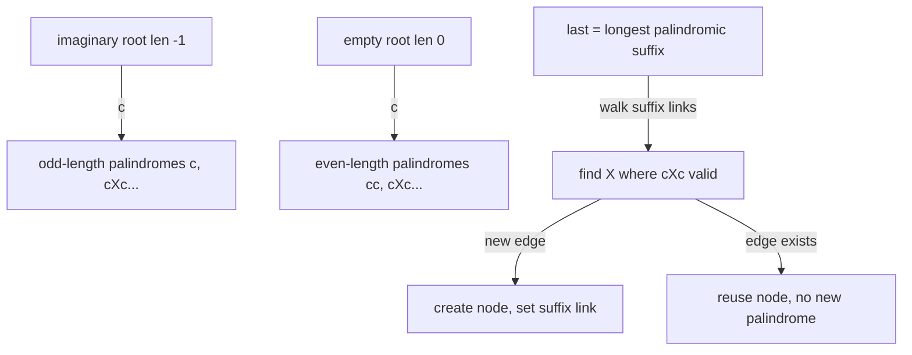

# Palindromic Tree (eertree) — Junior Level

> **One-line summary:** The eertree (palindromic tree) is a data structure that stores **every distinct palindromic substring** of a string in linear `O(n)` space — at most `n + 2` nodes — and builds online, one character at a time, in `O(n)` total. Each node is one distinct palindrome; two special "root" nodes (an imaginary one of length `-1` and a real one of length `0`) bootstrap the whole thing, and **suffix links** point each palindrome to its longest proper palindromic suffix.

---

## Table of Contents

1. [Introduction](#introduction)
2. [Prerequisites](#prerequisites)
3. [Glossary](#glossary)
4. [Core Concepts](#core-concepts)
5. [Big-O Summary](#big-o-summary)
6. [Real-World Analogies](#real-world-analogies)
7. [Pros & Cons](#pros--cons)
8. [Step-by-Step Walkthrough](#step-by-step-walkthrough)
9. [Code Examples](#code-examples)
10. [Coding Patterns](#coding-patterns)
11. [Error Handling](#error-handling)
12. [Performance Tips](#performance-tips)
13. [Best Practices](#best-practices)
14. [Edge Cases & Pitfalls](#edge-cases--pitfalls)
15. [Common Mistakes](#common-mistakes)
16. [Cheat Sheet](#cheat-sheet)
17. [Visual Animation](#visual-animation)
18. [Summary](#summary)
19. [Further Reading](#further-reading)

---

## Introduction

A **palindrome** is a string that reads the same forwards and backwards: `aba`, `noon`, `racecar`, or a single character like `x`. Suppose someone hands you a string such as `ababa` and asks: *"How many **different** palindromes appear somewhere inside it?"* For `ababa` the distinct palindromic substrings are `a`, `b`, `aba`, `bab`, and `ababa` — five of them. Notice the word **distinct**: the palindrome `a` occurs three times in `ababa`, but we count it once.

The brute-force way to answer is to look at every one of the `O(n²)` substrings, check each for being a palindrome in `O(n)`, and throw them into a set — a slow `O(n³)` (or `O(n²)` with hashing) approach that also uses a lot of memory to store the set. The **eertree**, invented by Mikhail Rubinchik and Arseny Shur in 2014, does dramatically better:

> **The eertree stores all distinct palindromic substrings of a length-`n` string using at most `n + 2` nodes, and it builds in `O(n · |Σ|)` time (or `O(n log |Σ|)` with a map), processing the string left to right one character at a time.**

The deep and slightly magical fact that makes this possible is:

> **Adding one character to the end of a string creates at most ONE new distinct palindrome.**

That single fact is the whole reason the structure is linear. If each appended character introduces at most one brand-new palindrome, then after `n` characters there are at most `n` distinct palindromes (plus the two bootstrap roots) — never the `O(n²)` you might fear. This is also the secret behind the structure's name: read "eertree" backwards and it is (almost) "eertree" — a palindrome-flavored joke for a palindrome data structure, and a cousin of the **trie/tree** it visually resembles.

This file builds the structure from scratch, focusing on the two roots and the "append one character" operation. Sibling topic `11-manacher` (Manacher's algorithm) also finds palindromes in `O(n)`, but it *counts* and locates palindromes around centers without **storing the distinct ones**; the eertree's superpower is that it gives you an explicit node for every distinct palindrome, which you can then annotate (with occurrence counts, lengths, positions) and traverse.

---

## Prerequisites

Before reading this file you should be comfortable with:

- **Strings and substrings** — a substring is a contiguous slice `s[i..j]`. See the parent section `17-string-algorithms`.
- **What a palindrome is** — `s` equals its own reverse; single characters and the empty string are palindromes too.
- **Trees and links** — nodes with parent/child pointers; a "link" is just a pointer from one node to another.
- **Tries (prefix trees)** — helpful intuition, since the eertree's edges are labeled by characters like a trie.
- **Arrays / hash maps** — each node stores children indexed by character (an array of size `|Σ|` or a map).
- **Big-O notation** — `O(n)`, `O(n · |Σ|)`, `O(n²)`.

Optional but helpful:

- A glance at **Manacher's algorithm** (sibling `11-manacher`) so you can contrast "count palindromes" with "store distinct palindromes".
- Familiarity with **suffix automata / suffix trees** — the eertree is the palindromic analogue and shares the "suffix link" idea.

---

## Glossary

| Term | Meaning |
|------|---------|
| **Palindrome** | A string equal to its reverse (`aba`, `xx`, `z`, or the empty string). |
| **Palindromic substring** | A contiguous substring that is itself a palindrome. |
| **Distinct palindromes** | The *set* of palindromic substrings, counted once each regardless of how many times they occur. |
| **eertree / palindromic tree** | The data structure storing all distinct palindromic substrings as nodes. |
| **Node** | One distinct palindrome. It stores its **length** `len`, a **suffix link**, and **children** by character. |
| **Imaginary root (`len = -1`)** | A fake node of length `-1`. Its only job is to bootstrap odd-length palindromes (single characters). |
| **Empty root (`len = 0`)** | The real node for the empty string. Bootstraps even-length palindromes. |
| **Suffix link** | A pointer from a palindrome `P` to its **longest proper palindromic suffix** (a shorter palindrome that ends `P`). |
| **Edge / child** | A labeled pointer: from node `U` on character `c` you reach the palindrome `c + U + c` (wrap `U` in `c` on both sides). |
| **`last` (active node)** | The node representing the **longest palindromic suffix** of the prefix processed so far. |
| **`|Σ|`** | The alphabet size (e.g. 26 for lowercase letters). |

---

## Core Concepts

### 1. Each Node Is One Distinct Palindrome

The eertree is a graph of nodes. **Every node corresponds to exactly one distinct palindrome** that occurs in the string. A node stores three things:

```
node:
  len            // length of this palindrome
  suffixLink     // pointer to the longest proper palindromic suffix
  next[c]        // child on character c: the palindrome c + thisPalindrome + c
```

The child relationship is the key building rule: if node `U` is the palindrome `P`, then following the edge labeled `c` lands on the palindrome `cPc` — you wrap `P` in the character `c` on **both** sides. Wrapping a palindrome in the same character on both sides always yields a longer palindrome, so this is well-defined.

### 2. The Two Roots

Real palindromes have length `0, 1, 2, 3, …`. To grow them uniformly with the "wrap in `c` on both sides" rule, the eertree starts from **two roots**:

- **The empty root**, length `0`. Wrapping the empty string in `c` gives `cc` (length 2). So the empty root is the parent of all even-length palindromes.
- **The imaginary root**, length `-1`. This node does not correspond to a real string; it is a clever fiction. Wrapping a length `-1` "string" in `c` is *defined* to give `c` (length 1). So the imaginary root is the parent of all single characters, and hence of all odd-length palindromes.

Why length `-1`? Because a length-1 palindrome `c` is `c` wrapped around something of length `-1`: `len(c) = len(inner) + 2`, so `len(inner) = 1 - 2 = -1`. The imaginary root makes the arithmetic work so odd and even palindromes share one growth rule. The imaginary root's **suffix link points to itself** (or to the empty root, by convention) — it is the terminator of every suffix-link chain.

### 3. The Suffix Link

For a palindrome `P`, its **suffix link** points to the **longest proper palindromic suffix** of `P`. "Proper" means shorter than `P` itself. For example:

- `aba` → its longest proper palindromic suffix is `a` (the suffixes are `ba`, `a`; only `a` is a palindrome).
- `abacaba` → longest proper palindromic suffix is `aba`.
- A single character `a` → its longest proper palindromic suffix is the empty string (the empty root).

Suffix links form a tree rooted at the empty/imaginary roots. Following suffix links from any node visits a *decreasing* chain of palindromic suffixes — exactly the structure we walk during construction.

### 4. The `last` Pointer (Longest Palindromic Suffix So Far)

As we process the string left to right, we maintain `last` = the node for the **longest palindromic suffix of the prefix read so far**. After reading `abab`, the longest palindromic suffix is `bab`, so `last` points to the `bab` node. This `last` pointer is the entry point for adding the next character: to extend, we look at palindromes that end the current prefix, which are exactly the suffix-link chain starting at `last`.

### 5. Appending One Character (the heart of the algorithm)

To add character `c` at the end:

1. Starting from `last`, **walk suffix links** until you find a node `X` such that the character just before the occurrence of `X` equals `c` — i.e. `cXc` would be a valid palindrome ending at the new position. (Formally: `s[i - len(X) - 1] == c`.)
2. If the edge `X --c-->` already exists, that palindrome already occurred before; just set `last` to it. **No new node** — no new distinct palindrome.
3. Otherwise create a **new node** for `cXc`. Set its `len = len(X) + 2`. Then find its **suffix link** by continuing the suffix-link walk from `X`'s link to locate the longest proper palindromic suffix of the new palindrome, and connect the new node as `X`'s child on `c`. Set `last` to the new node.

Because step 2 reuses existing nodes and step 3 creates **at most one** node per appended character, the total node count stays `≤ n + 2`.

---

## Big-O Summary

| Operation | Time | Space | Notes |
|-----------|------|-------|-------|
| Add one character (array children) | **O(|Σ|)** amortized | O(1) | The suffix-link walk is amortized `O(1)` per character. |
| Add one character (map children) | O(log |Σ|) amortized | O(1) | Trades array memory for a map lookup. |
| Build the whole tree | **O(n · |Σ|)** or O(n log |Σ|) | O(n · |Σ|) or O(n) | Linear in `n`. |
| Number of nodes | — | **≤ n + 2** | The headline space bound. |
| Count distinct palindromes | O(n) build, O(1) read | — | `numberOfNodes - 2`. |
| Count total palindromic occurrences | O(n) | O(n) | Propagate counts down suffix links. |
| Palindromes ending at each position | O(n) overall | O(n) | One value tracked per appended character. |
| Brute force (set of substrings) | O(n²) or worse | O(n²) | What the eertree replaces. |

The headline numbers: **`O(n)` build time and `≤ n + 2` nodes** — both linear, which is what makes the eertree the tool of choice for palindrome enumeration.

---

## Real-World Analogies

| Concept | Analogy |
|---------|---------|
| Each node is one distinct palindrome | A library catalog: one card per distinct title, no matter how many copies are on the shelves. The eertree keeps one node per distinct palindrome, no matter how often it occurs. |
| The two roots | Two "seed crystals" from which palindromes grow: one seed for even-length palindromes (the empty string), one fictional seed for odd-length ones (length `-1`). |
| Wrapping in `c` on both sides | Putting a matching bookend on each side of a shelf of books — the arrangement stays symmetric, just longer. |
| Suffix link | A "see also" cross-reference: from `racecar`'s card, jump to the longest palindrome that *ends* it, `c` — and from there to the empty string. |
| `last` pointer | Your finger on the longest mirror-symmetric tail you have read so far; the next letter either extends it or you slide your finger back along the chain. |
| "At most one new palindrome per character" | Each new letter can crown at most one new symmetric phrase that ends right there; everything else was already catalogued. |

Where the analogy breaks: a library catalog is static, but the eertree is built **online** — it is updated character by character, and the suffix-link walk reuses work from earlier characters, which a static catalog has no analogue for.

---

## Pros & Cons

| Pros | Cons |
|------|------|
| Stores **all distinct** palindromic substrings explicitly, one node each. | More conceptually involved than Manacher; the suffix-link walk takes practice. |
| Linear `O(n)` time and `≤ n + 2` nodes — both optimal in order. | Array children cost `O(n · |Σ|)` memory; large alphabets need a map. |
| **Online**: handles characters as they arrive, no need for the whole string up front. | Does not directly give palindrome **positions** without extra bookkeeping. |
| Each node can be annotated (occurrence count, first position, depth) for rich queries. | Two roots and length `-1` are an unintuitive bootstrap for newcomers. |
| Counts distinct **and** total palindromes, plus per-position counts, almost for free. | For a single "is `s` a palindrome?" check it is massive overkill. |

**When to use:** you need the **set of distinct palindromes**, total palindrome occurrence counts, the number of palindromes ending at each position, palindromic richness, or any per-palindrome annotation — especially when the string arrives incrementally.

**When NOT to use:** you only need the **longest** palindromic substring or a count around centers (Manacher, sibling `11`, is simpler); or you just need to test whether one fixed string is a palindrome (two pointers suffice).

---

## Step-by-Step Walkthrough

Let us build the eertree for `s = "aba"` character by character. We start with the two roots:

```
node 0: imaginary root, len = -1, suffixLink = 0 (itself)
node 1: empty root,     len =  0, suffixLink = 0 (to imaginary)
last = node 1 (empty root)
```

**Append `a` (position 0).** Walk suffix links from `last` (empty root) to find `X` with `s[i - len(X) - 1] == 'a'`. For the empty root, `len = 0`, so we check `s[0 - 0 - 1] = s[-1]` — out of bounds, so the empty root fails. We fall back to the imaginary root (`len = -1`), check `s[0 - (-1) - 1] = s[0] = 'a'` ✓. The edge from the imaginary root on `'a'` does not exist, so create:

```
node 2: "a", len = 1, parent = imaginary root via 'a'
suffix link of "a": longest proper palindromic suffix = empty string = node 1
last = node 2 ("a")
```

One new palindrome: `a`.

**Append `b` (position 1).** Now `s = "ab"`. From `last` ("a", len 1), check `s[1 - 1 - 1] = s[-1]` — fails. Walk to `"a"`'s suffix link (empty root), check `s[1 - 0 - 1] = s[0] = 'a' ≠ 'b'` — fails. Walk to imaginary root, check `s[1 - (-1) - 1] = s[1] = 'b'` ✓. No edge on `'b'`, so create:

```
node 3: "b", len = 1, suffix link = empty root (node 1)
last = node 3 ("b")
```

One new palindrome: `b`.

**Append `a` (position 2).** Now `s = "aba"`. From `last` ("b", len 1), check `s[2 - 1 - 1] = s[0] = 'a' = 'a'` ✓ — so `"b"` can be wrapped: but wait, wrapping `"b"` in `'a'` gives `"aba"`. Check: does the edge `"b" --a-->` exist? No. Create:

```
node 4: "aba", len = len("b") + 2 = 3
```

Now find its suffix link: the longest proper palindromic suffix of `"aba"`. Continue the suffix-link walk from `"b"`'s link (empty root). From the empty root, check `s[2 - 0 - 1] = s[1] = 'b' ≠ 'a'` — fails; walk to imaginary root, check `s[2 - (-1) - 1] = s[2] = 'a'` ✓, and the edge imaginary `--a-->` exists (it points to `"a"`, node 2). So:

```
suffix link of "aba" = node 2 ("a")
last = node 4 ("aba")
```

One new palindrome: `aba`. Final distinct palindromes: `a`, `b`, `aba` → **3 distinct**, stored in `numberOfNodes - 2 = 5 - 2 = 3` nodes. Each appended character added at most one node, exactly as promised.

---

## Code Examples

### Example: Build the eertree and count distinct palindromes

#### Go

```go
package main

import "fmt"

const SIGMA = 26

type Eertree struct {
	s    []byte
	len  []int     // len[node] = palindrome length
	link []int     // suffix link
	next [][]int   // children by character
	last int       // longest palindromic suffix node
	cnt  int       // number of nodes
}

func NewEertree(cap int) *Eertree {
	e := &Eertree{}
	// node 0 = imaginary root (len -1), node 1 = empty root (len 0)
	e.len = []int{-1, 0}
	e.link = []int{0, 0} // imaginary -> itself; empty -> imaginary
	e.next = [][]int{make([]int, SIGMA), make([]int, SIGMA)}
	e.last = 1
	e.cnt = 2
	return e
}

// getLink walks suffix links from x until s[i - len[x] - 1] == s[i].
func (e *Eertree) getLink(x, i int) int {
	for i-e.len[x]-1 < 0 || e.s[i-e.len[x]-1] != e.s[i] {
		x = e.link[x]
	}
	return x
}

// Add appends character c (0..SIGMA-1); returns true if a NEW palindrome was created.
func (e *Eertree) Add(c byte) bool {
	i := len(e.s)
	e.s = append(e.s, c)
	cur := e.getLink(e.last, i)
	if e.next[cur][c] != 0 {
		e.last = e.next[cur][c]
		return false // already existed
	}
	// create a new node
	e.next = append(e.next, make([]int, SIGMA))
	e.len = append(e.len, e.len[cur]+2)
	now := e.cnt
	e.cnt++
	if e.len[now] == 1 {
		e.link[appendInt(&e.link, 0)] = 1 // length-1 palindrome links to empty root
	} else {
		e.link = append(e.link, e.next[e.getLink(e.link[cur], i)][c])
	}
	e.next[cur][c] = now
	e.last = now
	return true
}

func appendInt(slice *[]int, v int) int {
	*slice = append(*slice, v)
	return len(*slice) - 1
}

func main() {
	e := NewEertree(16)
	for _, ch := range "aba" {
		e.Add(byte(ch) - 'a')
	}
	fmt.Println("distinct palindromes:", e.cnt-2) // 3
}
```

#### Java

```java
import java.util.*;

public class Eertree {
    static final int SIGMA = 26;
    char[] s = new char[0];
    List<Integer> len = new ArrayList<>();
    List<Integer> link = new ArrayList<>();
    List<int[]> next = new ArrayList<>();
    int last, n;

    Eertree() {
        // node 0 = imaginary root (len -1), node 1 = empty root (len 0)
        len.add(-1); len.add(0);
        link.add(0); link.add(0);
        next.add(new int[SIGMA]); next.add(new int[SIGMA]);
        last = 1; n = 0;
    }

    int getLink(int x, int i) {
        while (i - len.get(x) - 1 < 0 || s[i - len.get(x) - 1] != s[i]) x = link.get(x);
        return x;
    }

    boolean add(char c, int i) {
        int idx = c - 'a';
        int cur = getLink(last, i);
        if (next.get(cur)[idx] != 0) { last = next.get(cur)[idx]; return false; }
        int now = len.size();
        len.add(len.get(cur) + 2);
        next.add(new int[SIGMA]);
        if (len.get(now) == 1) link.add(1);
        else link.add(next.get(getLink(link.get(cur), i))[idx]);
        next.get(cur)[idx] = now;
        last = now;
        return true;
    }

    public static void main(String[] args) {
        Eertree e = new Eertree();
        String str = "aba";
        e.s = str.toCharArray();
        for (int i = 0; i < str.length(); i++) e.add(str.charAt(i), i);
        System.out.println("distinct palindromes: " + (e.len.size() - 2)); // 3
    }
}
```

#### Python

```python
class Eertree:
    def __init__(self):
        # node 0 = imaginary root (len -1), node 1 = empty root (len 0)
        self.s = []
        self.length = [-1, 0]
        self.link = [0, 0]      # imaginary -> itself; empty -> imaginary
        self.to = [dict(), dict()]
        self.last = 1

    def _get_link(self, x, i):
        while i - self.length[x] - 1 < 0 or self.s[i - self.length[x] - 1] != self.s[i]:
            x = self.link[x]
        return x

    def add(self, c):
        i = len(self.s)
        self.s.append(c)
        cur = self._get_link(self.last, i)
        if c in self.to[cur]:
            self.last = self.to[cur][c]
            return False                       # already existed
        now = len(self.length)
        self.length.append(self.length[cur] + 2)
        self.to.append(dict())
        if self.length[now] == 1:
            self.link.append(1)                # length-1 -> empty root
        else:
            self.link.append(self.to[self._get_link(self.link[cur], i)][c])
        self.to[cur][c] = now
        self.last = now
        return True


if __name__ == "__main__":
    e = Eertree()
    for ch in "aba":
        e.add(ch)
    print("distinct palindromes:", len(e.length) - 2)  # 3
```

**What it does:** builds the eertree for `aba`, character by character, and reports `numberOfNodes - 2 = 3` distinct palindromes (`a`, `b`, `aba`).
**Run:** `go run main.go` | `javac Eertree.java && java Eertree` | `python eertree.py`

---

## Coding Patterns

### Pattern 1: Brute-Force Distinct-Palindrome Oracle (test against this)

**Intent:** Before trusting the eertree, count distinct palindromes the slow, obvious way and check they agree on small inputs.

```python
def distinct_palindromes_bruteforce(s):
    seen = set()
    n = len(s)
    for i in range(n):
        for j in range(i + 1, n + 1):
            sub = s[i:j]
            if sub == sub[::-1]:
                seen.add(sub)
    return len(seen)
```

This is `O(n³)` (or `O(n²)` with hashing). It is far too slow for large `n` but perfect as a correctness oracle: the eertree's `numberOfNodes - 2` must equal it.

### Pattern 2: Distinct Palindrome Count

**Intent:** The number of distinct palindromic substrings is simply the node count minus the two roots.

```
distinctPalindromes = numberOfNodes - 2
```

Each non-root node *is* a distinct palindrome, so this is `O(1)` once the tree is built.

### Pattern 3: New-Palindrome Flag per Character

**Intent:** `add()` returns whether a brand-new palindrome appeared. Summing those booleans reconstructs the running distinct count as the string grows — handy for online queries.



---

## Error Handling

| Error | Cause | Fix |
|-------|-------|-----|
| Infinite loop in `getLink` | The imaginary root's self-loop / bounds check is wrong, so the walk never terminates. | The condition `i - len[x] - 1 < 0` must short-circuit; the imaginary root (`len = -1`) always satisfies the wrap test, ending the walk. |
| Wrong distinct count | Forgot to subtract the **two** roots, or counted only one. | `distinct = numberOfNodes - 2`. |
| Index out of range | Checking `s[i - len[x] - 1]` without the `< 0` guard. | Always test `i - len[x] - 1 >= 0` *before* indexing. |
| Length-1 link wrong | Set a length-1 palindrome's suffix link to the imaginary root instead of the empty root. | Single characters link to the **empty** root (length 0), not the imaginary one. |
| Children collision | Reused a child array between nodes (shared reference). | Allocate a fresh `next` array/map per node. |
| Node 0 ambiguity | Used `0` both as "no child" sentinel and as a real node index. | Reserve node 0 for the imaginary root and use a separate sentinel, or check the map for presence. |

---

## Performance Tips

- **Array vs map children.** For small alphabets (DNA `ACGT`, lowercase 26), a fixed `int[|Σ|]` array per node is fastest. For large or unknown alphabets, use a hash map to avoid `O(n · |Σ|)` memory blow-up.
- **Preallocate node arrays** to `n + 2` capacity up front so you never reallocate mid-build.
- **Cache `len[last]`** in the hot suffix-link loop; repeated indexing into a growing slice is slower than a local.
- **Amortized walk:** do not fear the inner `while` in `getLink` — across the whole string the suffix-link walk does `O(n)` total work, so each `add` is amortized `O(|Σ|)` (array) or `O(1)`-ish (map).
- **Combine passes:** track occurrence counts and per-position counts *during* construction rather than in a second pass when you can.

---

## Best Practices

- Always test the eertree's distinct count against the brute-force oracle (Pattern 1) on random small strings before trusting it on large inputs.
- Initialize the two roots explicitly and document the `len = -1` / `len = 0` convention right at construction.
- Keep `add()` returning a boolean ("did a new palindrome appear?") — it makes online distinct-count queries trivial.
- Store the alphabet size as a named constant, never a magic `26` sprinkled through the code.
- For multilingual or large alphabets, switch children to a map and keep the rest of the code identical.
- Comment the `getLink` termination invariant: the imaginary root (`len = -1`) always satisfies the wrap test, so the loop always halts.

---

## Edge Cases & Pitfalls

- **Empty string** — the tree has just the two roots; distinct palindromes = `2 - 2 = 0`. Correct.
- **Single character `"a"`** — one new node (`a`); distinct = 1.
- **All identical characters `"aaaa"`** — distinct palindromes are `a`, `aa`, `aaa`, `aaaa` → `n` of them; the tree has `n` non-root nodes. A good stress test of the suffix-link chain.
- **No repeated palindromes vs all repeats** — `"abc"` has 3 distinct (`a`, `b`, `c`); `"aaa"` has 3 distinct (`a`, `aa`, `aaa`). Both have 3 nodes but very different shapes.
- **Length-1 palindromes** — their suffix link is the empty root, not the imaginary root. The single most common bug.
- **The imaginary root is not a real string** — never treat its `len = -1` as a real length; it exists only to make the wrap arithmetic close.
- **Online correctness** — because the tree is built incrementally, an off-by-one in the position `i` used inside `getLink` corrupts everything downstream; pin `i = len(s)` *before* appending the new character, or be consistent.

---

## Common Mistakes

1. **Subtracting only one root** — distinct palindromes is `numberOfNodes - 2`, not `- 1`. There are *two* roots.
2. **Linking length-1 palindromes to the imaginary root** — they must link to the **empty** root (length 0).
3. **Indexing `s[i - len[x] - 1]` without the bounds guard** — causes an out-of-range crash; the `< 0` check must come first.
4. **Forgetting the imaginary root terminates the walk** — the `getLink` loop relies on `len = -1` always matching; remove it and you get an infinite loop.
5. **Using node `0` as both a sentinel and a real node** — reserve indices clearly so "no child" is distinguishable from "child is the imaginary root".
6. **Confusing walks-around-centers (Manacher) with stored distinct palindromes** — Manacher counts/locates but does **not** store the distinct set; only the eertree gives you a node per distinct palindrome.
7. **Recomputing the whole tree after each character** — the whole point is that `add()` is incremental and amortized `O(1)`; never rebuild from scratch per character.

---

## Cheat Sheet

| Question | Tool | Formula |
|----------|------|---------|
| Distinct palindromic substrings | node count | `numberOfNodes - 2` |
| Did appending `c` add a new palindrome? | `add()` return value | boolean |
| Longest palindromic suffix of current prefix | `last` pointer | node `last`, length `len[last]` |
| Suffix link of a palindrome | `link[node]` | longest proper palindromic suffix |
| Child palindrome `cPc` | `next[node][c]` | wrap `P` in `c` both sides |
| Two roots | bootstrap | imaginary `len = -1`, empty `len = 0` |
| Total nodes | space bound | `≤ n + 2` |

Core algorithm:

```
addChar(c) at position i:
    cur = getLink(last, i)              # walk suffix links from last
    if next[cur][c] exists:
        last = next[cur][c]; return false   # palindrome already seen
    create node now with len = len[cur] + 2
    if len[now] == 1: link[now] = emptyRoot
    else:             link[now] = next[getLink(link[cur], i)][c]
    next[cur][c] = now; last = now; return true   # new palindrome
# total build: O(n · |Σ|), nodes ≤ n + 2
```

---

## Visual Animation

> See [`animation.html`](./animation.html) for an interactive visualization.
>
> The animation demonstrates:
> - The two roots (imaginary `len = -1` and empty `len = 0`) at the start
> - Appending characters one at a time from an editable string
> - The current longest palindromic suffix (`last`) highlighted
> - The suffix-link walk searching for where `cXc` can be formed
> - New palindrome nodes appearing, and the suffix links being drawn
> - Step / Run / Reset controls to watch each character grow the tree

---

## Summary

The eertree (palindromic tree) stores **every distinct palindromic substring** of a length-`n` string in at most `n + 2` nodes and builds **online** in linear time. Two roots bootstrap it: an imaginary node of length `-1` (parent of all odd-length palindromes) and an empty node of length `0` (parent of all even-length palindromes). Each node is one distinct palindrome with its `len`, a **suffix link** to its longest proper palindromic suffix, and character-labeled children that wrap a palindrome in `c` on both sides. Appending a character walks suffix links from `last` (the longest palindromic suffix so far) to find where `cXc` can be formed, reusing an existing node or creating exactly one new one — which is why **each character adds at most one distinct palindrome** and the whole structure is linear. Counting distinct palindromes is just `numberOfNodes - 2`. Where Manacher (sibling `11`) counts palindromes around centers, the eertree *stores* the distinct ones as addressable, annotatable nodes — its defining superpower.

---

## Further Reading

- Rubinchik & Shur (2015), *EERTREE: An Efficient Data Structure for Processing Palindromes in Strings* — the original paper.
- Sibling topic `11-manacher` — `O(n)` palindrome detection around centers; contrast with stored distinct palindromes.
- Parent section `17-string-algorithms` — suffix structures and string matching foundations.
- cp-algorithms.com — "Palindromic tree (eertree)" with construction code and applications.
- *Competitive Programmer's Handbook* (Laaksonen) — string algorithms chapter.
- USACO Guide / Codeforces blogs on eertree applications: palindromic richness, distinct palindrome counting, total occurrence counting.
