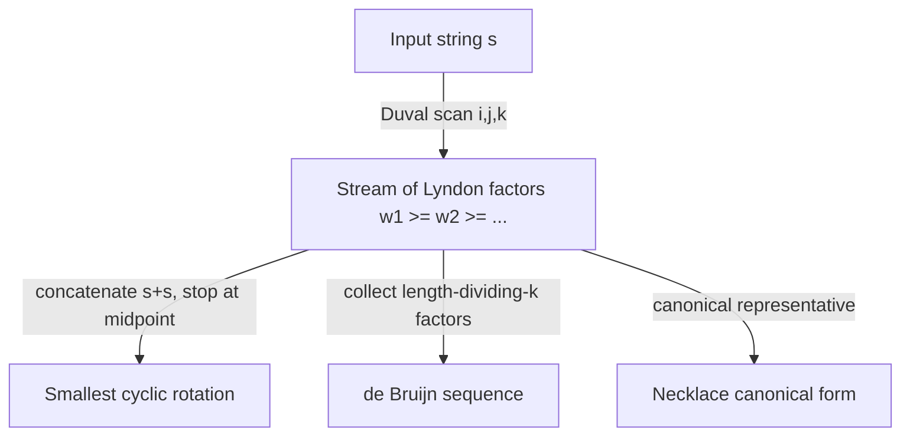

# Lyndon Words & Duval's Algorithm — Junior Level

> **One-line summary:** A **Lyndon word** is a non-empty string that is *strictly smaller* than every one of its proper rotations (equivalently, strictly smaller than each of its proper suffixes). **Duval's algorithm** factors any string into a non-increasing sequence of Lyndon words in `O(n)` time using `O(1)` extra space, and that same factorization is the key to finding a string's *smallest cyclic rotation* in linear time.

---

## Table of Contents

1. [Introduction](#introduction)
2. [Prerequisites](#prerequisites)
3. [Glossary](#glossary)
4. [Core Concepts](#core-concepts)
5. [Big-O Summary](#big-o-summary)
6. [Real-World Analogies](#real-world-analogies)
7. [Pros & Cons](#pros--cons)
8. [Step-by-Step Walkthrough](#step-by-step-walkthrough)
9. [Code Examples](#code-examples)
10. [Coding Patterns](#coding-patterns)
11. [Error Handling](#error-handling)
12. [Performance Tips](#performance-tips)
13. [Best Practices](#best-practices)
14. [Edge Cases & Pitfalls](#edge-cases--pitfalls)
15. [Common Mistakes](#common-mistakes)
16. [Cheat Sheet](#cheat-sheet)
17. [Visual Animation](#visual-animation)
18. [Summary](#summary)
19. [Further Reading](#further-reading)

---

## Introduction

Suppose someone hands you a circular bracelet of colored beads and asks: *"Starting from which bead does the sequence read smallest?"* You could cut the bracelet at every bead, read off all `n` rotations, and pick the lexicographically smallest — but that is `O(n²)` work (or worse) and feels wasteful. There is a beautiful linear-time answer hiding in a single concept: the **Lyndon word**.

A string is a **Lyndon word** if it is *strictly less than* every rotation of itself. For example `aab` is a Lyndon word: its rotations are `aba` and `baa`, and `aab < aba < baa`. By contrast `aba` is *not* a Lyndon word, because rotating it gives `aab`, which is smaller. The single string `a` is a Lyndon word (it has no proper rotations to lose to). The strings `aa` and `abab` are *not* Lyndon words because they equal one of their rotations.

The deep fact that makes everything work is the **Chen-Fox-Lyndon theorem**:

> **Every non-empty string `s` factors *uniquely* into a sequence of Lyndon words `w₁ ≥ w₂ ≥ … ≥ w_m`, where the factors are in non-increasing lexicographic order.**

So `s = w₁ w₂ … w_m` where each `wᵢ` is a Lyndon word and `w₁ ≥ w₂ ≥ … ≥ w_m`. This decomposition is unique — there is exactly one way to do it. **Duval's algorithm** computes this factorization in `O(n)` time and only `O(1)` extra space (it just scans the string with three index pointers). That is remarkably cheap for such a structured result.

Why should a junior engineer care? Because this one tool unlocks several classic problems:

- **Smallest cyclic rotation** of a string in `O(n)` (run Duval on `s + s` and stop at the factor crossing position `n`). This is the headline application.
- **Canonical form of a necklace** (the smallest rotation is the canonical representative).
- A clean linear-time alternative to **Booth's algorithm** for least rotation.
- The construction of **de Bruijn sequences** by concatenating Lyndon words.
- A stepping stone to the **Burrows-Wheeler Transform** (sibling `10-burrows-wheeler-transform`) and to suffix structures.

The whole topic rests on two ideas: *what a Lyndon word is*, and *how Duval's scan finds the factors*. Master those two and the applications follow.

---

## Prerequisites

Before reading this file you should be comfortable with:

- **Strings and indexing** — characters, substrings `s[i..j]`, length `n`.
- **Lexicographic comparison** — how `<` is decided character by character, with a prefix being smaller than any longer string that extends it (`ab < abc`).
- **Rotations of a string** — `s = abc` has rotations `abc`, `bca`, `cab` (cut and wrap around).
- **Suffixes** — `s[i..]` for `0 ≤ i < n`; the *proper* suffixes exclude the whole string.
- **Big-O notation** — `O(n)`, `O(1)` extra space, why linear matters.
- **Basic loops and pointers** — Duval is a single forward scan with three integer indices.

Optional but helpful:

- A glance at the **suffix array** (sibling `04-suffix-arrays`), because Lyndon words and the smallest rotation are closely related to suffix ordering.
- Familiarity with **modular indexing** (`i % n`) for working with rotations of `s + s`.

---

## Glossary

| Term | Meaning |
|------|---------|
| **Rotation** | Cutting a string at some position and wrapping the prefix to the end: a rotation of `abc` by 1 is `bca`. There are `n` rotations (some may coincide). |
| **Lexicographic order** | Dictionary order; compare character by character, the first differing character decides. A proper prefix is smaller than its extension. |
| **Lyndon word** | A non-empty string strictly smaller than all of its proper rotations (equivalently, strictly smaller than each of its proper suffixes). |
| **Proper suffix** | Any suffix `s[i..]` with `i > 0` (i.e. not the whole string). |
| **Chen-Fox-Lyndon factorization** | The unique decomposition `s = w₁w₂…w_m` with each `wᵢ` Lyndon and `w₁ ≥ w₂ ≥ … ≥ w_m`. Also called the **Lyndon factorization** or **standard factorization**. |
| **Duval's algorithm** | The `O(n)`-time, `O(1)`-space scan that produces the Lyndon factorization. |
| **Smallest cyclic rotation** | The lexicographically least rotation of a string; the canonical form of the cyclic string / necklace. |
| **Necklace** | An equivalence class of strings under rotation; its canonical representative is the smallest rotation. |
| **Booth's algorithm** | A classic `O(n)` algorithm for the least rotation specifically (uses a modified failure function). |
| **de Bruijn sequence** | A cyclic sequence in which every length-`k` string over the alphabet appears exactly once as a substring; buildable from Lyndon words. |

---

## Core Concepts

### 1. What Exactly Is a Lyndon Word?

A non-empty string `w` is a **Lyndon word** if and only if `w` is strictly smaller (lexicographically) than every proper rotation of `w`. Two facts make this concrete:

- A Lyndon word is **aperiodic** — it cannot be written as `u^k` for `k ≥ 2` (because `u^k` equals one of its own rotations, so it is not strictly smaller than all of them).
- A Lyndon word always **begins with its smallest character** and, more strongly, is smaller than *all* of its proper suffixes.

Examples (alphabet `a < b < c`): `a`, `b`, `ab`, `aab`, `abb`, `aabb`, `abc`, `aabaab`... wait, `aabaab = (aab)²` is **not** Lyndon. Careful: `aabab` is Lyndon, but `aabaab` is periodic. The single characters are always Lyndon.

### 2. Two Equivalent Definitions

These two statements about a non-empty `w` are equivalent (proof sketch in [`professional.md`](./professional.md)):

```
(A)  w  <  every proper rotation of w
(B)  w  <  every proper suffix of w
```

Definition (B) is the one Duval's algorithm exploits, because suffixes are easy to compare with a left-to-right scan. Intuitively, if `w` were *not* smaller than some proper suffix `s`, you could rotate `w` so that `s` comes first and get a rotation `≤ w`, contradicting (A).

### 3. The Chen-Fox-Lyndon Factorization

The theorem says every string splits uniquely into Lyndon words in **non-increasing** order:

```
s = w₁ w₂ … w_m       with   w₁ ≥ w₂ ≥ … ≥ w_m,   each wᵢ a Lyndon word.
```

Worked example for `s = banana`:

```
banana  →  b · an · an · a       (factors: "b", "an", "an", "a")
```

Check the order: `b ≥ an ≥ an ≥ a`? Compare `b` vs `an`: `b > a`, so `b ≥ an`. Then `an = an`. Then `an ≥ a` because `a` is a prefix of `an`, so `a < an` hence `an ≥ a`. Each factor (`b`, `an`, `a`) is itself a Lyndon word. The factorization is unique.

### 4. Duval's Algorithm — the Idea

Duval scans `s` with three indices:

- `i` — the start of the current chunk we are still factoring,
- `j` — a "look-ahead" pointer reading new characters,
- `k` — a pointer trailing `j` by a fixed period, comparing `s[k]` to `s[j]`.

It maintains the invariant that `s[i..j)` is a concatenation of equal Lyndon words plus a strict prefix of the next one. The comparison of `s[j]` to `s[k]` tells it whether to keep extending (`s[j] == s[k]`), restart the period (`s[j] > s[k]`), or **output** finished Lyndon factors (`s[j] < s[k]`). The whole scan is `O(n)` because each character is examined a small bounded number of times.

### 5. Smallest Rotation via Lyndon on `s + s`

To find the **smallest cyclic rotation** of `s` (length `n`):

```
1. Form t = s + s  (length 2n).
2. Run Duval's factorization on t.
3. Find the Lyndon factor whose start index is < n but that reaches index ≥ n
   (the factor that "straddles" position n). Its start index p is the answer:
   the smallest rotation is t[p .. p+n).
```

The smallest rotation begins at the start of the Lyndon factor that crosses the midpoint, because that factor is the smallest "wrap-around" piece. This is the application you will use most.

### 6. Why It Beats Brute Force

Brute force compares all `n` rotations pairwise: building and comparing them is `O(n²)` in the worst case (think `aaaa…ab`). Duval on `s + s` is `O(n)` and `O(1)` extra space. For long strings that is the difference between instant and sluggish.

---

## Big-O Summary

| Operation | Time | Space | Notes |
|-----------|------|-------|-------|
| Duval Lyndon factorization | **O(n)** | **O(1)** extra | Three-pointer scan; output streamed. |
| Smallest cyclic rotation (Duval on `s+s`) | **O(n)** | O(n) for `s+s`, O(1) extra | The headline application. |
| Largest cyclic rotation | O(n) | O(n) | Reverse the comparison or invert the alphabet. |
| Booth's least-rotation algorithm | O(n) | O(n) | Alternative to Duval-on-`s+s`. |
| Brute-force least rotation | O(n²) | O(n) | Compare all rotations; the baseline to beat. |
| Generate all Lyndon words ≤ length n (FKM) | O(total output) | O(n) | Amortized `O(1)` per word. |
| de Bruijn sequence of order `k` | O(alphabetᵏ) | O(output) | Concatenate Lyndon words whose length divides `k`. |

The headline numbers: **`O(n)` time, `O(1)` extra space** for the factorization, and **`O(n)`** for the smallest rotation.

---

## Real-World Analogies

| Concept | Analogy |
|---------|---------|
| Lyndon word | A "canonical starting point" sentence — the unique phrasing of a circular slogan that sounds smallest when read aloud, and never repeats as a sub-loop. |
| Smallest rotation | Choosing where to cut a circular necklace so the bead colors read in the smallest order — a fixed, agreed-upon way to write down a loop. |
| Lyndon factorization | Breaking a long musical loop into its natural, ever-"calmer" (non-increasing) phrases, each of which is itself irreducible. |
| Duval's three pointers | A proofreader scanning text with a finger on the current word start, a finger reading ahead, and a finger checking the rhythm a fixed distance back. |
| Necklace canonical form | A library catalog rule: rotate every circular title to its smallest reading so two clockwise-equal titles file in the same place. |
| de Bruijn sequence | A circular keypad code that, as you slide a window across it, shows every possible PIN exactly once. |

Where the analogy breaks: real necklaces have a clasp; mathematical rotations wrap perfectly with no seam, and the comparison is strict character-by-character, not "feel".

---

## Pros & Cons

| Pros | Cons |
|------|------|
| Linear time `O(n)` and `O(1)` extra space — optimal for the factorization. | The algorithm's three-pointer logic is subtle; off-by-one bugs are common. |
| Gives the smallest cyclic rotation in `O(n)`, beating `O(n²)` brute force. | Only solves *cyclic* problems cleanly; not a general string-search tool. |
| The factorization is **unique**, so it is a true canonical form. | The Lyndon definition (strict `<`) trips people up on ties / periodic strings. |
| Streams output — you can process factors as they are produced. | Comparison is alphabet-order dependent; you must fix the ordering up front. |
| Underpins necklaces, de Bruijn sequences, BWT, and combinatorics on words. | Smallest rotation needs `s + s`, doubling the buffer (still `O(n)` memory). |

**When to use:** smallest/largest cyclic rotation, canonical form of a necklace/loop, deduplicating rotation-equivalent strings, generating Lyndon words or de Bruijn sequences, BWT-related preprocessing.

**When NOT to use:** plain substring search (use KMP / Z-function, siblings `01-kmp`, `02-z-function`), edit distance, or any non-cyclic problem — Lyndon machinery is overkill there.

---

## Step-by-Step Walkthrough

Let us factor `s = "bbababaa"` with Duval's algorithm. We keep `i` = start of the unprocessed part, `j` = look-ahead, `k` = trailing comparison pointer. When `j` advances and `s[j] < s[k]`, we emit one or more finished Lyndon factors of length `(j - k)` each.

```
s = b b a b a b a a
    0 1 2 3 4 5 6 7
```

**Outer iteration 1 — start at i = 0.**
Set `k = i = 0`, `j = i + 1 = 1`.

```
j=1: s[1]='b', s[k=0]='b'  → equal  → k=1, j=2   (period length j-k = 1, candidate "b")
j=2: s[2]='a', s[k=1]='b'  → s[j] < s[k]  → emit a Lyndon factor of length (j-k)=1.
     Output "b".  Advance i by 1 → i = 1.
```

Wait — Duval emits factors of length `(j - k)` while `i + (j - k) ≤ k`. Here `j - k = 1`, so it emits the single Lyndon word `"b"` and moves `i` to `1`. Restart the inner loop from `i = 1`.

**Outer iteration 2 — start at i = 1.**
Again the leading character is `b`. Set `k = 1`, `j = 2`.

```
j=2: s[2]='a', s[k=1]='b'  → s[j] < s[k]  → emit length (j-k)=1 factor "b". i → 2.
```

Output so far: `"b", "b"`.

**Outer iteration 3 — start at i = 2.**
Now the chunk begins with `a`. Set `k = 2`, `j = 3`.

```
j=3: s[3]='b', s[k=2]='a'  → s[j] > s[k]  → reset k = i = 2, j = 4   (candidate Lyndon word "ab" extends)
j=4: s[4]='a', s[k=2]='a'  → equal        → k = 3, j = 5
j=5: s[5]='b', s[k=3]='b'  → equal        → k = 4, j = 6
j=6: s[6]='a', s[k=4]='a'  → equal        → k = 5, j = 7
j=7: s[7]='a', s[k=5]='b'  → s[j] < s[k]  → period (j-k) = 2; emit factors of length 2.
```

Here `j - k = 2`, and the segment `s[2..7) = "ababa"`... we emit Lyndon words of length 2 (`"ab"`) repeatedly while `i + 2 ≤ k`. That outputs `"ab"`, `"ab"`, advancing `i` to `6`.

Output so far: `"b", "b", "ab", "ab"`.

**Outer iteration 4 — start at i = 6.**
Chunk is `"aa"`. Set `k = 6`, `j = 7`.

```
j=7: s[7]='a', s[k=6]='a'  → equal  → k=7, j=8  (j now past end)
j=8: end of string → emit remaining factors of length (j-k)=1: "a", advance; i=7.
i=7: single "a" remains → output "a". i = 8. Done.
```

Final factorization: **`"b", "b", "ab", "ab", "a", "a"`** — wait, let us re-check. Actually `"aa"` factors into `"a"` and `"a"`. So:

```
bbababaa  →  b · b · ab · ab · a · a
```

Check non-increasing order: `b ≥ b ≥ ab ≥ ab ≥ a ≥ a`. Compare `b` vs `ab`: `b > a` so `b > ab`. Compare `ab` vs `a`: `a` is a prefix of `ab`, so `a < ab`, giving `ab > a`. All good. Each factor is a Lyndon word, and the sequence is non-increasing — exactly what the theorem promises.

---

## Code Examples

### Example: Duval's Lyndon Factorization

This returns the list of factor strings.

#### Go

```go
package main

import "fmt"

// duval returns the Chen-Fox-Lyndon factorization of s as a slice of factors.
func duval(s string) []string {
	n := len(s)
	var factors []string
	i := 0
	for i < n {
		j := i + 1
		k := i
		for j < n && s[k] <= s[j] {
			if s[k] < s[j] {
				k = i // s[j] strictly bigger: reset trailing pointer
			} else {
				k++ // equal: advance trailing pointer (period continues)
			}
			j++
		}
		// each Lyndon factor has length (j - k); emit while it fits
		for i <= k {
			factors = append(factors, s[i:i+j-k])
			i += j - k
		}
	}
	return factors
}

func main() {
	fmt.Println(duval("bbababaa")) // [b b ab ab a a]
	fmt.Println(duval("banana"))   // [b an an a]
	fmt.Println(duval("aaa"))      // [a a a]
}
```

#### Java

```java
import java.util.*;

public class Duval {
    // Chen-Fox-Lyndon factorization of s.
    static List<String> duval(String s) {
        int n = s.length();
        List<String> factors = new ArrayList<>();
        int i = 0;
        while (i < n) {
            int j = i + 1, k = i;
            while (j < n && s.charAt(k) <= s.charAt(j)) {
                if (s.charAt(k) < s.charAt(j)) k = i; // strictly bigger: reset
                else k++;                              // equal: extend period
                j++;
            }
            while (i <= k) {
                factors.add(s.substring(i, i + j - k));
                i += j - k;
            }
        }
        return factors;
    }

    public static void main(String[] args) {
        System.out.println(duval("bbababaa")); // [b, b, ab, ab, a, a]
        System.out.println(duval("banana"));   // [b, an, an, a]
        System.out.println(duval("aaa"));      // [a, a, a]
    }
}
```

#### Python

```python
def duval(s: str) -> list[str]:
    """Chen-Fox-Lyndon factorization of s in O(n) time, O(1) extra space."""
    n = len(s)
    factors = []
    i = 0
    while i < n:
        j = i + 1
        k = i
        while j < n and s[k] <= s[j]:
            if s[k] < s[j]:
                k = i        # s[j] strictly bigger: reset trailing pointer
            else:
                k += 1       # equal: advance trailing pointer (period continues)
            j += 1
        # each Lyndon factor has length (j - k)
        while i <= k:
            factors.append(s[i:i + j - k])
            i += j - k
    return factors


if __name__ == "__main__":
    print(duval("bbababaa"))  # ['b', 'b', 'ab', 'ab', 'a', 'a']
    print(duval("banana"))    # ['b', 'an', 'an', 'a']
    print(duval("aaa"))       # ['a', 'a', 'a']
```

**What it does:** scans once with `i`, `j`, `k`, emits the non-increasing Lyndon factors.
**Run:** `go run main.go` | `javac Duval.java && java Duval` | `python duval.py`

---

## Coding Patterns

### Pattern 1: Brute-Force Lyndon Checker (the oracle you test against)

**Intent:** Before trusting Duval, verify "is `w` a Lyndon word?" the slow, obvious way, and verify factors on small inputs.

```python
def is_lyndon(w: str) -> bool:
    # w is Lyndon iff it is strictly smaller than all its proper rotations
    return all(w < w[i:] + w[:i] for i in range(1, len(w)))
```

`is_lyndon("aab")` is `True`; `is_lyndon("aba")` is `False`; `is_lyndon("aa")` is `False`. Use it to assert every factor Duval returns is genuinely Lyndon and that they are non-increasing.

### Pattern 2: Smallest Rotation via Duval on `s + s`

**Intent:** Find the index where the lexicographically smallest rotation begins.

```python
def least_rotation_index(s: str) -> int:
    n = len(s)
    t = s + s
    i, ans = 0, 0
    while i < n:
        ans = i
        j, k = i + 1, i
        while j < 2 * n and t[k] <= t[j]:
            k = i if t[k] < t[j] else k + 1
            j += 1
        while i <= k:
            i += j - k
    return ans
```

`least_rotation_index("baca")` returns the start of `"abac"`-style smallest rotation. (Build the rotation with `s[idx:] + s[:idx]`.)

### Pattern 3: Stream Factors Without Storing Them

**Intent:** For huge strings, process each Lyndon factor as it is found instead of building a list — keeping `O(1)` extra space.



---

## Error Handling

| Error | Cause | Fix |
|-------|-------|-----|
| Factors are not non-increasing | Used `<` where `<=` was needed in the inner comparison (or vice versa). | The inner loop condition is `s[k] <= s[j]`; the reset happens only on strict `<`. |
| Infinite loop / index out of range | Forgot to bound `j < n` (or `j < 2n` for rotations). | Always check the array bound before reading `s[j]`. |
| Wrong factor lengths | Emitted `(j - k)` but advanced `i` incorrectly. | Emit while `i <= k`, advancing `i += j - k` each time. |
| Empty input crashes | `n = 0` not handled. | Return an empty factorization for the empty string. |
| Smallest rotation off by one | Returned an index `≥ n` from `s + s`. | The answer index is always in `[0, n)`; take `ans % n` if needed. |
| Wrong ordering for "largest" rotation | Reused the smallest-rotation code. | For largest, invert the comparison or map each char `c → (MAX - c)`. |

---

## Performance Tips

- **Compare by character code, not substrings.** Inside Duval, never build `s[i:]` to compare; compare single characters `s[k]` vs `s[j]`. Substring builds turn `O(n)` into `O(n²)`.
- **Avoid materializing `s + s` if you can index modulo `n`.** Use `t[idx] = s[idx % n]` to save half the memory for the rotation problem.
- **Stream factors** instead of appending to a list when you only need to consume them once.
- **Use byte arrays** for ASCII to dodge per-character object overhead (especially in Java/Python).
- **Fix the alphabet order once.** Re-deriving comparison rules per call wastes cycles; pass a comparator or rely on the native byte order.

---

## Best Practices

- Always test Duval's output with the brute-force `is_lyndon` oracle and a non-increasing-order check on random small strings.
- Treat the empty string explicitly: its factorization is the empty list.
- Document your alphabet ordering (e.g. ASCII `a < b < … < z`) at the top of the function.
- For the smallest rotation, return the *index* and let the caller build the rotated string — it is cheaper and more flexible.
- Keep `duval` and `least_rotation_index` as separate, individually testable functions; most bugs hide in the inner comparison.
- When you need the *largest* rotation, prefer mapping the alphabet (`c → reverse`) over copy-pasting and tweaking comparisons — one well-tested routine, two uses.

---

## Edge Cases & Pitfalls

- **Single character** — `"a"` is a Lyndon word; its factorization is `["a"]`.
- **All equal characters** — `"aaaa"` factors into `["a","a","a","a"]` (each `"a"` is Lyndon; the whole thing is *not* Lyndon because it equals its rotations).
- **Already a Lyndon word** — `"aab"` factors into the single factor `["aab"]`.
- **Periodic string** — `"abab"` is *not* Lyndon (`abab = (ab)²`); Duval factors it into `["ab","ab"]`.
- **Empty string** — return `[]`; do not read `s[0]`.
- **Strict vs non-strict** — a Lyndon word must be *strictly* smaller than every rotation; equality (as in `"aa"`) disqualifies it.
- **Rotation index out of range** — when using `s + s`, clamp the answer to `[0, n)`.
- **Non-ASCII / multibyte** — comparison must be on the intended code units; mixing byte and rune comparisons silently corrupts order.

---

## Common Mistakes

1. **Confusing "rotation" with "suffix"** — the two definitions are equivalent, but newcomers compare the wrong objects when checking by hand.
2. **Using `<=` for the Lyndon test** — a Lyndon word is *strictly* less than all rotations; `"aa"` fails because it equals its rotation.
3. **Building substrings inside the inner loop** — turns linear Duval into quadratic. Compare characters only.
4. **Forgetting the `i += j - k` advance** — leads to repeated or skipped factors.
5. **Off-by-one on `s + s`** — reading past `2n`, or returning an index `≥ n` for the smallest rotation.
6. **Assuming factors are increasing** — they are *non-increasing* (`w₁ ≥ w₂ ≥ …`); reversing the expected order is a classic slip.
7. **Treating ties wrong in the inner loop** — on `s[k] == s[j]` you advance `k`; on `s[k] < s[j]` you reset `k = i`. Swapping these two breaks the scan.

---

## Cheat Sheet

| Question | Tool | Key fact |
|----------|------|----------|
| Is `w` a Lyndon word? | strict-rotation test (oracle) / it is its own unique Duval factor | `w <` every proper rotation |
| Factor `s` into Lyndon words | Duval's algorithm | `O(n)` time, `O(1)` space, non-increasing factors |
| Smallest cyclic rotation | Duval on `s + s` | answer = start of factor crossing index `n` |
| Largest cyclic rotation | Duval on `s + s` with inverted alphabet | map `c → MAX - c` |
| Canonical necklace form | smallest rotation | unique representative under rotation |
| Generate Lyndon words ≤ `n` | FKM / Duval generation | amortized `O(1)` per word |

Core algorithm:

```
duval(s):                       # Chen-Fox-Lyndon factorization
    i = 0
    while i < n:
        j = i + 1; k = i
        while j < n and s[k] <= s[j]:
            k = i if s[k] < s[j] else k + 1
            j += 1
        while i <= k:
            output s[i : i + (j - k)]    # one Lyndon factor
            i += j - k
# cost: O(n) time, O(1) extra space
```

---

## Visual Animation

> See [`animation.html`](./animation.html) for an interactive visualization.
>
> The animation demonstrates:
> - The `i`, `j`, `k` pointers scanning the string during Duval's algorithm
> - The current candidate Lyndon factor highlighted as it grows
> - The moment a factor is emitted and added to the running decomposition `w₁ ≥ w₂ ≥ …`
> - A second mode showing the **smallest rotation** via Duval on `s + s`
> - Play / Pause / Step controls and an editable input string

---

## Summary

A **Lyndon word** is a non-empty string strictly smaller than all its rotations (equivalently, all its proper suffixes). The **Chen-Fox-Lyndon theorem** guarantees that every string factors *uniquely* into a non-increasing sequence of Lyndon words, and **Duval's algorithm** computes that factorization in `O(n)` time with `O(1)` extra space using a three-pointer scan. The single most useful application is finding a string's **smallest cyclic rotation** in linear time — run Duval on `s + s` and read off the factor that crosses the midpoint. This same machinery gives canonical necklace forms, de Bruijn sequences, and feeds into the Burrows-Wheeler Transform. Remember the two rules that trip people up: the inequality is *strict*, and the factors come out in *non-increasing* order.

---

## Further Reading

- *Combinatorics on Words* (Lothaire) — the canonical reference on Lyndon words and the Chen-Fox-Lyndon theorem.
- Duval, J.-P. (1983), "Factorizing words over an ordered alphabet" — the original `O(n)` algorithm.
- cp-algorithms.com — "Lyndon factorization" and "Finding the smallest cyclic shift".
- Sibling topic `10-burrows-wheeler-transform` — where rotations and canonical forms reappear.
- Sibling topic `04-suffix-arrays` — the close cousin to Lyndon-based rotation ordering.
- Booth, K. S. (1980), "Lexicographically least circular substrings" — Booth's algorithm for least rotation.
