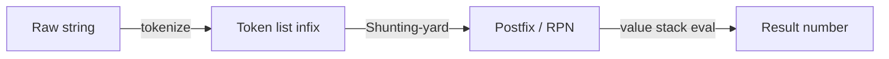

# Expression Parsing & Evaluation — Junior Level

> **One-line summary:** To evaluate an arithmetic string like `3 + 4 * 2`, first **tokenize** it into numbers and operators, then convert the **infix** form to **postfix** (Reverse Polish Notation) with the **Shunting-yard algorithm** using an operator stack, and finally **evaluate the postfix** with a value stack. Precedence and parentheses are handled while shunting, so the evaluation step never needs to think about precedence again.

---

## Table of Contents

1. [Introduction](#introduction)
2. [Prerequisites](#prerequisites)
3. [Glossary](#glossary)
4. [Core Concepts](#core-concepts)
5. [Big-O Summary](#big-o-summary)
6. [Real-World Analogies](#real-world-analogies)
7. [Pros & Cons](#pros--cons)
8. [Step-by-Step Walkthrough](#step-by-step-walkthrough)
9. [Code Examples](#code-examples)
10. [Coding Patterns](#coding-patterns)
11. [Error Handling](#error-handling)
12. [Performance Tips](#performance-tips)
13. [Best Practices](#best-practices)
14. [Edge Cases & Pitfalls](#edge-cases--pitfalls)
15. [Common Mistakes](#common-mistakes)
16. [Cheat Sheet](#cheat-sheet)
17. [Visual Animation](#visual-animation)
18. [Summary](#summary)
19. [Further Reading](#further-reading)

---

## Introduction

Type `3 + 4 * 2` into any calculator and it answers `11`, not `14`. The calculator "knows" that multiplication binds tighter than addition. Behind that one tiny fact lives a whole field: **expression parsing and evaluation** — turning a flat string of characters into a correctly evaluated number while respecting **operator precedence**, **associativity**, and **parentheses**.

The naive idea — "scan left to right and apply each operator as you meet it" — is wrong, because it computes `(3 + 4) * 2 = 14`. We need a method that defers `+` until after the `*` has been applied. The classic, beautiful solution has three stages, and this whole file is built around that spine:

1. **Tokenize (lex):** split `"3 + 4 * 2"` into the token list `[3, +, 4, *, 2]`. Each token is a number, an operator, or a parenthesis — no longer raw characters.
2. **Shunting-yard:** convert the infix token list into **postfix** (Reverse Polish Notation, RPN) `[3, 4, 2, *, +]`, using an **operator stack** to reorder operators by precedence. This is Edsger **Dijkstra's** algorithm; the name comes from how it shunts operators onto a stack like a railway shunting yard.
3. **Evaluate RPN:** walk the postfix list left to right with a **value stack**: push numbers, and when you hit an operator pop two values, combine them, and push the result. The final remaining value is the answer.

Why postfix? Because RPN has **no parentheses and no precedence** — the order of operators *is* the order of evaluation. All the hard thinking happens once, during shunting; evaluation becomes a trivial stack loop. The combination is `O(n)` time: every token is pushed and popped a constant number of times.

The same string `3 + 4 * 2` flows like this:

```
infix:    3 + 4 * 2
tokens:   [3] [+] [4] [*] [2]
postfix:  3 4 2 * +          (Shunting-yard output)
evaluate: 4*2 = 8, then 3+8 = 11
```

This file teaches the three stages in order, with full code in Go, Java, and Python. Sibling level `middle.md` adds recursive-descent parsing and ASTs; `senior.md` covers Pratt parsing and production error handling; `professional.md` proves the algorithms correct with a formal grammar. Two stack-based ideas underpin everything here, so the prerequisite topic `09-stacks-and-queues` is your friend.

---

## Prerequisites

Before reading this file you should be comfortable with:

- **Stacks (LIFO).** Push, pop, peek/top, and "is the stack empty". Both Shunting-yard and RPN evaluation are stack algorithms. See sibling topic `09-stacks-and-queues`.
- **Strings and characters** — iterating a string, recognizing digit characters `'0'..'9'`, building a multi-digit number.
- **Basic arithmetic operators** — `+ - * /` and what integer vs floating-point division means.
- **Big-O notation** — we will claim `O(n)` time and explain why.
- **Arrays / lists / slices** — the token list and the output queue are just sequences.

Optional but helpful:

- A glance at **operator precedence** in your favorite language (why `2 + 3 * 4 == 14`).
- Familiarity with **associativity** (left vs right) — most operators are left-associative; exponent `^` is right-associative.

---

## Glossary

| Term | Meaning |
|------|---------|
| **Token** | The smallest meaningful unit of an expression: a number, an operator (`+ - * / ^`), or a parenthesis. |
| **Lexing / Tokenizing** | Scanning the raw character string and producing the token list. Skips whitespace, groups digits into numbers. |
| **Infix notation** | The everyday form `a + b`: the operator sits **between** its operands. Needs precedence and parentheses to be unambiguous. |
| **Postfix / RPN** | Reverse Polish Notation `a b +`: the operator comes **after** its operands. No parentheses, no precedence needed. |
| **Prefix / Polish** | `+ a b`: operator **before** operands. Rare in calculators; the mirror image of postfix. |
| **Precedence** | Which operator binds tighter. `*` and `/` have higher precedence than `+` and `-`, so `*`/`/` apply first. |
| **Associativity** | How operators of *equal* precedence group: `a - b - c` is `(a - b) - c` (left); `a ^ b ^ c` is `a ^ (b ^ c)` (right). |
| **Operator stack** | The stack in Shunting-yard that holds operators waiting to be emitted to the output. |
| **Value stack** | The stack in RPN evaluation that holds operand values waiting to be combined. |
| **Output queue** | The growing postfix sequence produced by Shunting-yard. |
| **Unary operator** | An operator with one operand, e.g. unary minus in `-5` or `3 * -2`. |

---

## Core Concepts

### 1. Tokenizing (Lexing)

The first stage turns characters into tokens. We scan left to right:

- **Whitespace** is skipped.
- A run of **digits** (and an optional decimal point) becomes one **number** token. `"42"` is one token, not two.
- A single `+ - * / ^ ( )` becomes its own token.
- Anything else is a **lexing error** (e.g. a stray letter `@`).

```
"12 + 3*45"  ->  [NUM 12] [OP +] [NUM 3] [OP *] [NUM 45]
```

Grouping multi-digit numbers is the key job here: without it, `12` would wrongly become `1` and `2`.

### 2. Infix vs Postfix (Why RPN Helps)

Infix `3 + 4 * 2` is ambiguous *until* you apply precedence rules. Postfix `3 4 2 * +` is **completely unambiguous**: there is exactly one way to evaluate it, reading left to right. The whole trick of expression evaluation is to pay the "precedence cost" once (during conversion to postfix) so evaluation is dead simple.

### 3. The Shunting-yard Algorithm

Shunting-yard reads the infix tokens one at a time and maintains an **operator stack** and an **output queue**:

- **Number** → append straight to the output queue.
- **Operator `o1`** → while the operator `o2` on top of the stack has **higher precedence**, or **equal precedence and `o1` is left-associative**, pop `o2` to the output. Then push `o1`.
- **Left paren `(`** → push it onto the stack (it acts as a barrier).
- **Right paren `)`** → pop operators to the output until you meet the matching `(`, then discard that `(`.
- **End of input** → pop any remaining operators to the output.

The popping rule is the heart of it: an operator only goes to the output once we know nothing higher-precedence will land on top of it.

### 4. Evaluating RPN with a Value Stack

Once we have postfix, evaluation is a tiny loop over a **value stack**:

- **Number** → push it.
- **Binary operator** → pop the right operand `b`, pop the left operand `a`, compute `a OP b`, push the result. (Order matters: the *second* pop is the left operand.)

At the end exactly one value remains — the answer.

```
postfix 3 4 2 * +
push 3          stack: [3]
push 4          stack: [3, 4]
push 2          stack: [3, 4, 2]
'*': pop 2,4 -> 8   stack: [3, 8]
'+': pop 8,3 -> 11  stack: [11]
result = 11
```

### 5. Precedence and Associativity Tables

For the basic four-function calculator plus exponent:

| Operator | Precedence | Associativity |
|----------|-----------|---------------|
| `^` (power) | 4 (highest) | **right** |
| unary `-` | 3 | right |
| `* /` | 2 | left |
| `+ -` | 1 (lowest) | left |

The associativity column decides what happens on *equal* precedence. For left-associative `-`, when `o1` equals the stack top we pop (so `a - b - c` becomes `(a-b)-c`). For right-associative `^`, on equal precedence we do **not** pop, leaving `a ^ b ^ c` as `a ^ (b ^ c)`.

---

## Big-O Summary

| Stage | Time | Space | Notes |
|-------|------|-------|-------|
| Tokenize | **O(n)** | O(n) | One pass over the characters; output is the token list. |
| Shunting-yard (infix → postfix) | **O(n)** | O(n) | Each token pushed and popped at most once. |
| Evaluate RPN | **O(n)** | O(n) | One pass over postfix; value stack holds operands. |
| **End-to-end** | **O(n)** | O(n) | `n` = number of tokens. Linear in input size. |
| Recursive-descent (see `middle.md`) | O(n) | O(d) depth | `d` = nesting depth; same linear time. |

The headline is **`O(n)`** for the entire pipeline. There is no hidden quadratic blowup: the amortized argument is that every operator is pushed once and popped once across the whole run.

---

## Real-World Analogies

| Concept | Analogy |
|---------|---------|
| Tokenizing | Reading a sentence and splitting it into words before you parse the grammar — you do not reason about letters, you reason about words. |
| Operator stack | A stack of plates: you can only add/remove from the top, which is exactly how deferred operators wait their turn. |
| Shunting-yard | A railway shunting yard reorders train cars (operators) onto a side track until the main line (output) is ready for them. That is literally where the name comes from. |
| Precedence | "Multiplication before addition" is a queue-jumping rule: higher-precedence operators cut in line and get applied first. |
| Postfix evaluation | A reverse-Polish HP calculator: you key in the numbers first, then the operation, and it combines the top of the stack. |
| Parentheses | Brackets are a "do this sub-task first" instruction — like a nested to-do list item you must finish before resuming the outer list. |

Where the analogy breaks: a real shunting yard cares about physical car order; the algorithm only cares about precedence and associativity, which are abstract rules.

---

## Pros & Cons

| Pros | Cons |
|------|------|
| **Linear `O(n)`** time and space — fast and predictable. | Two-phase (shunt then evaluate) needs an intermediate postfix representation. |
| Precedence/parentheses handled **once**, during shunting; evaluation is trivial. | Shunting-yard's pop conditions are fiddly to get exactly right (associativity edge cases). |
| Postfix is reusable: convert once, evaluate many times (e.g. with different variable values). | Adding unary minus, functions, and right-assoc `^` complicates the basic rules. |
| Stack-only — no recursion, so no stack-overflow risk on deep input. | Less directly produces an AST than recursive descent does (you get a flat RPN, not a tree). |
| Easy to extend the operator table with new precedences. | Error reporting (where exactly did parsing fail?) is harder than with recursive descent. |

**When to use Shunting-yard / RPN:** simple arithmetic evaluators, calculator apps, formula engines, spreadsheet cells, anywhere you want a compact stack-based evaluator with linear time.

**When to prefer recursive descent (see `middle.md`):** when you need an **AST**, rich error messages, or a grammar that goes beyond simple operators (function calls, conditionals).

---

## Step-by-Step Walkthrough

Take the expression `( 1 + 2 ) * 3 - 4`. We tokenize, shunt, then evaluate.

**Tokenize:**

```
( 1 + 2 ) * 3 - 4
tokens: [ ( ] [ 1 ] [ + ] [ 2 ] [ ) ] [ * ] [ 3 ] [ - ] [ 4 ]
```

**Shunting-yard** (track output queue and operator stack):

```
token   action                                  output            opstack
(       push (                                  []                [(]
1       emit number                             [1]               [(]
+       push (top is ( barrier, no pop)         [1]               [(, +]
2       emit number                             [1 2]             [(, +]
)       pop until ( : pop +                      [1 2 +]           []
*       push (stack empty)                      [1 2 +]           [*]
3       emit number                             [1 2 + 3]         [*]
-       * has higher prec -> pop *; push -       [1 2 + 3 *]       [-]
4       emit number                             [1 2 + 3 * 4]     [-]
END     pop remaining: pop -                     [1 2 + 3 * 4 -]   []
```

Postfix result: `1 2 + 3 * 4 -`.

**Evaluate the postfix** with a value stack:

```
postfix: 1 2 + 3 * 4 -
1     push 1            [1]
2     push 2            [1, 2]
+     pop 2,1 -> 3      [3]
3     push 3            [3, 3]
*     pop 3,3 -> 9      [9]
4     push 4            [9, 4]
-     pop 4,9 -> 5      [5]
result = 5
```

Check by hand: `(1 + 2) * 3 - 4 = 3 * 3 - 4 = 9 - 4 = 5`. The pipeline and the hand calculation agree. Notice how the parentheses forced `1 + 2` to be emitted *before* `*`, exactly as intended.

---

## Code Examples

### Example: Tokenize → Shunting-yard → Evaluate

This computes an integer arithmetic expression with `+ - * /` and parentheses.

#### Go

```go
package main

import (
	"fmt"
	"strings"
)

// precedence of binary operators
func prec(op byte) int {
	switch op {
	case '+', '-':
		return 1
	case '*', '/':
		return 2
	}
	return 0
}

// tokenize into a slice of strings: numbers and single-char operators
func tokenize(s string) []string {
	var toks []string
	i := 0
	for i < len(s) {
		c := s[i]
		if c == ' ' {
			i++
			continue
		}
		if c >= '0' && c <= '9' {
			j := i
			for j < len(s) && s[j] >= '0' && s[j] <= '9' {
				j++
			}
			toks = append(toks, s[i:j])
			i = j
			continue
		}
		toks = append(toks, string(c)) // operator or paren
		i++
	}
	return toks
}

// Shunting-yard: infix tokens -> postfix tokens
func toPostfix(toks []string) []string {
	var out []string
	var ops []byte
	for _, t := range toks {
		c := t[0]
		switch {
		case c >= '0' && c <= '9':
			out = append(out, t)
		case c == '(':
			ops = append(ops, '(')
		case c == ')':
			for len(ops) > 0 && ops[len(ops)-1] != '(' {
				out = append(out, string(ops[len(ops)-1]))
				ops = ops[:len(ops)-1]
			}
			ops = ops[:len(ops)-1] // pop the '('
		default: // operator (left-associative)
			for len(ops) > 0 && ops[len(ops)-1] != '(' &&
				prec(ops[len(ops)-1]) >= prec(c) {
				out = append(out, string(ops[len(ops)-1]))
				ops = ops[:len(ops)-1]
			}
			ops = append(ops, c)
		}
	}
	for len(ops) > 0 {
		out = append(out, string(ops[len(ops)-1]))
		ops = ops[:len(ops)-1]
	}
	return out
}

// evaluate postfix tokens with a value stack
func evalPostfix(post []string) int {
	var st []int
	for _, t := range post {
		if t[0] >= '0' && t[0] <= '9' {
			n := 0
			for k := 0; k < len(t); k++ {
				n = n*10 + int(t[k]-'0')
			}
			st = append(st, n)
			continue
		}
		b := st[len(st)-1]
		a := st[len(st)-2]
		st = st[:len(st)-2]
		var r int
		switch t[0] {
		case '+':
			r = a + b
		case '-':
			r = a - b
		case '*':
			r = a * b
		case '/':
			r = a / b
		}
		st = append(st, r)
	}
	return st[0]
}

func main() {
	expr := "( 1 + 2 ) * 3 - 4"
	toks := tokenize(strings.TrimSpace(expr))
	post := toPostfix(toks)
	fmt.Println("postfix:", post)         // [1 2 + 3 * 4 -]
	fmt.Println("result :", evalPostfix(post)) // 5
}
```

#### Java

```java
import java.util.*;

public class Calculator {
    static int prec(char op) {
        if (op == '+' || op == '-') return 1;
        if (op == '*' || op == '/') return 2;
        return 0;
    }

    static List<String> tokenize(String s) {
        List<String> toks = new ArrayList<>();
        int i = 0;
        while (i < s.length()) {
            char c = s.charAt(i);
            if (c == ' ') { i++; continue; }
            if (Character.isDigit(c)) {
                int j = i;
                while (j < s.length() && Character.isDigit(s.charAt(j))) j++;
                toks.add(s.substring(i, j));
                i = j;
            } else {
                toks.add(String.valueOf(c));
                i++;
            }
        }
        return toks;
    }

    static List<String> toPostfix(List<String> toks) {
        List<String> out = new ArrayList<>();
        Deque<Character> ops = new ArrayDeque<>();
        for (String t : toks) {
            char c = t.charAt(0);
            if (Character.isDigit(c)) {
                out.add(t);
            } else if (c == '(') {
                ops.push('(');
            } else if (c == ')') {
                while (!ops.isEmpty() && ops.peek() != '(')
                    out.add(String.valueOf(ops.pop()));
                ops.pop(); // discard '('
            } else {
                while (!ops.isEmpty() && ops.peek() != '(' &&
                       prec(ops.peek()) >= prec(c))
                    out.add(String.valueOf(ops.pop()));
                ops.push(c);
            }
        }
        while (!ops.isEmpty()) out.add(String.valueOf(ops.pop()));
        return out;
    }

    static int evalPostfix(List<String> post) {
        Deque<Integer> st = new ArrayDeque<>();
        for (String t : post) {
            if (Character.isDigit(t.charAt(0))) {
                st.push(Integer.parseInt(t));
            } else {
                int b = st.pop(), a = st.pop();
                switch (t.charAt(0)) {
                    case '+': st.push(a + b); break;
                    case '-': st.push(a - b); break;
                    case '*': st.push(a * b); break;
                    case '/': st.push(a / b); break;
                }
            }
        }
        return st.pop();
    }

    public static void main(String[] args) {
        List<String> toks = tokenize("( 1 + 2 ) * 3 - 4");
        List<String> post = toPostfix(toks);
        System.out.println("postfix: " + post);          // [1, 2, +, 3, *, 4, -]
        System.out.println("result : " + evalPostfix(post)); // 5
    }
}
```

#### Python

```python
def prec(op):
    if op in "+-":
        return 1
    if op in "*/":
        return 2
    return 0


def tokenize(s):
    toks = []
    i = 0
    while i < len(s):
        c = s[i]
        if c == " ":
            i += 1
            continue
        if c.isdigit():
            j = i
            while j < len(s) and s[j].isdigit():
                j += 1
            toks.append(s[i:j])
            i = j
        else:
            toks.append(c)        # operator or paren
            i += 1
    return toks


def to_postfix(toks):
    out, ops = [], []
    for t in toks:
        if t.isdigit():
            out.append(t)
        elif t == "(":
            ops.append("(")
        elif t == ")":
            while ops and ops[-1] != "(":
                out.append(ops.pop())
            ops.pop()             # discard "("
        else:                     # operator, left-associative
            while ops and ops[-1] != "(" and prec(ops[-1]) >= prec(t):
                out.append(ops.pop())
            ops.append(t)
    while ops:
        out.append(ops.pop())
    return out


def eval_postfix(post):
    st = []
    for t in post:
        if t.isdigit():
            st.append(int(t))
        else:
            b = st.pop()
            a = st.pop()
            st.append({"+": a + b, "-": a - b,
                       "*": a * b, "/": a // b}[t])
    return st[0]


if __name__ == "__main__":
    toks = tokenize("( 1 + 2 ) * 3 - 4")
    post = to_postfix(toks)
    print("postfix:", post)            # ['1', '2', '+', '3', '*', '4', '-']
    print("result :", eval_postfix(post))  # 5
```

**What it does:** tokenizes the string, shunts to postfix `1 2 + 3 * 4 -`, then evaluates to `5`.
**Run:** `go run main.go` | `javac Calculator.java && java Calculator` | `python calc.py`

---

## Coding Patterns

### Pattern 1: Brute-Force Reference (the oracle you test against)

**Intent:** Before trusting Shunting-yard, evaluate with your language's own parser on small inputs and compare.

```python
def reference_eval(expr):
    # ONLY for testing small, trusted inputs — never on untrusted input!
    return eval(expr.replace("//", "/"))  # use as a correctness oracle only
```

Run your pipeline and `reference_eval` on random small expressions and assert they agree. (Never ship `eval` on untrusted input — see `senior.md` on security.)

### Pattern 2: Single-Pass Direct Two-Stack Evaluator

**Intent:** Skip building postfix; evaluate infix directly with **two stacks** — one for values, one for operators. Whenever you would pop an operator in Shunting-yard, apply it immediately to the value stack instead of emitting it. This is detailed in `middle.md`.

### Pattern 3: Recognize the Three Roles of a Token

**Intent:** Every token is exactly one of: an **operand** (goes to values/output), an **operator** (compared by precedence), or a **grouping** symbol (`(` / `)`). Classifying the token first makes the dispatch clean.



---

## Error Handling

| Error | Cause | Fix |
|-------|-------|-----|
| Mismatched parentheses | A `)` with no matching `(`, or leftover `(` at end. | When popping for `)`, error if the stack empties before finding `(`. After shunting, error if any `(` remains. |
| Too few operands | Operator applied with < 2 values on the value stack (e.g. `3 +`). | Check the value stack has ≥ 2 elements before popping. |
| Too many operands | More than one value left at the end (e.g. `3 4`). | After evaluating postfix, the value stack must hold exactly one element. |
| Division by zero | `a / 0`. | Check the divisor before dividing; raise a clear error. |
| Unexpected character | A stray `@` or letter during tokenizing. | Tokenizer must reject characters that are not digits, operators, parens, or whitespace. |
| Empty input | The user typed nothing. | Treat as an error or return a defined "empty expression" result. |

---

## Performance Tips

- **Tokenize once.** Do not re-scan the string in each stage; produce a token list and reuse it.
- **Reuse a converted postfix.** If you evaluate the same formula with different variable values, convert to postfix once and evaluate many times.
- **Avoid string allocations in hot loops.** Represent tokens as small structs/enums (kind + value), not freshly allocated strings, when performance matters.
- **Use a slice/array as the stack.** A dynamic array with index-based push/pop is faster and more cache-friendly than a linked structure.
- **Parse numbers while tokenizing.** Convert digit runs to integers/floats during lexing so evaluation does no parsing.

---

## Best Practices

- Keep the three stages — **tokenize**, **shunt**, **evaluate** — as separate, independently testable functions. Most bugs hide in the shunt step's pop conditions.
- Define your precedence and associativity in **one table/map**, never as scattered `if` chains. Adding an operator should be a one-line table edit.
- Decide and document **integer vs floating-point** semantics up front (does `7 / 2` give `3` or `3.5`?).
- Always test against a trusted reference evaluator on random small expressions (Pattern 1).
- Validate parentheses balance and operand counts explicitly; do not let an out-of-bounds pop crash with a cryptic message.

---

## Edge Cases & Pitfalls

- **Empty expression** — define behavior (error vs `0`).
- **Single number** — `42` must evaluate to `42` (no operators at all).
- **Leading/trailing spaces** — the tokenizer must skip them.
- **Multi-digit numbers** — `123` is one token; failing to group digits is the classic first bug.
- **Negative numbers / unary minus** — `-5` and `3 * -2` need special handling (covered in `middle.md`); the basic algorithm here assumes binary operators only.
- **Right-associative `^`** — `2 ^ 3 ^ 2` must be `2 ^ (3 ^ 2) = 512`, not `(2^3)^2 = 64`. The pop condition differs for right-associative operators.
- **Division semantics** — integer truncation vs float; and division by zero.
- **Deeply nested parentheses** — the operator stack grows with nesting depth; fine for stacks, but recursive descent could overflow on adversarial depth.

---

## Common Mistakes

1. **Applying operators left to right** without precedence — computing `3 + 4 * 2 = 14`. Always defer lower-precedence operators.
2. **Swapping operands** in evaluation — for `-` and `/`, the *first* pop is the **right** operand. `a - b`, not `b - a`.
3. **Not grouping multi-digit numbers** during tokenizing — `12` becomes `1` and `2`.
4. **Forgetting to flush the operator stack** at end of input — trailing operators never get emitted.
5. **Mishandling associativity** — using `>=` vs `>` in the pop condition incorrectly turns left-assoc into right-assoc or vice versa.
6. **Not checking parenthesis balance** — a missing `(` makes the `)` loop pop the whole stack and crash.
7. **Leaving extra values on the stack** — `3 4 +` is fine, but `3 4` (no operator) leaves two values; a valid expression ends with exactly one.

---

## Cheat Sheet

| Stage | Data structure | Rule |
|-------|---------------|------|
| Tokenize | output token list | group digits; emit single-char operators/parens; skip spaces |
| Shunt: number | output queue | append to output |
| Shunt: operator | operator stack | pop while top has ≥ precedence (left-assoc); then push |
| Shunt: `(` | operator stack | push |
| Shunt: `)` | operator stack | pop to output until `(`; discard `(` |
| Shunt: end | operator stack | pop all remaining to output |
| Eval: number | value stack | push |
| Eval: operator | value stack | pop `b`, pop `a`, push `a OP b` |

Precedence (high → low): `^` (right) > `* /` (left) > `+ -` (left).

Core loop:

```
shunt(tokens):
    out=[]; ops=[]
    for t in tokens:
        if number: out.append(t)
        elif '(' : ops.push('(')
        elif ')' : pop ops to out until '('; pop '('
        else:      while top is operator and prec(top) >= prec(t): out.append(pop)
                   ops.push(t)
    flush ops to out
    return out               # O(n)
```

---

## Visual Animation

> See [`animation.html`](./animation.html) for an interactive visualization.
>
> The animation demonstrates:
> - Tokens streaming in from an editable expression
> - The **output queue** and **operator stack** updating per token, with the action labeled (push value, pop on precedence, parentheses)
> - The resulting **RPN** being evaluated on a **value stack**
> - Play / Pause / Step controls and a field to type your own expression

---

## Summary

Evaluating an arithmetic expression correctly means respecting precedence, associativity, and parentheses — which the naive left-to-right scan ignores. The classic three-stage pipeline solves it cleanly: **tokenize** the string into numbers and operators, run **Shunting-yard** to convert infix to **postfix (RPN)** using an operator stack that defers low-precedence operators, and **evaluate the postfix** with a value stack that pops two operands per operator. The whole pipeline is `O(n)`. All the precedence reasoning happens once during shunting, so postfix evaluation is a trivial stack loop. Get the pop conditions and operand order right, validate parentheses, and you have a correct, fast calculator. Recursive descent and ASTs in `middle.md` give an alternative when you need a tree or rich errors.

---

## Further Reading

- Dijkstra's original note on the **Shunting-yard algorithm** (1961).
- *Compilers: Principles, Techniques, and Tools* (the "Dragon Book") — lexing and parsing fundamentals.
- Sibling topic `09-stacks-and-queues` — the stack operations both algorithms rely on.
- Sibling file `middle.md` — recursive-descent parsing, ASTs, unary minus, right-associative exponent.
- Sibling file `senior.md` — Pratt / precedence-climbing parsing and production error handling.
- cp-algorithms.com — "Expression parsing" (Shunting-yard with unary operators).
