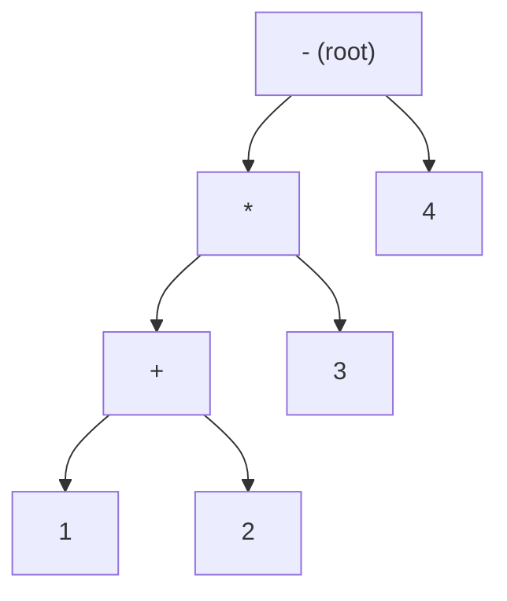

# Expression Parsing & Evaluation — Middle Level

> **Focus:** Formal precedence/associativity tables, the **direct two-stack** infix evaluator (no postfix intermediate), **recursive-descent** parsing with an `expr / term / factor` grammar, handling **unary minus** and **right-associative exponent**, building and evaluating an **AST**, and choosing between the stack approach and the recursive approach.

---

## Table of Contents

1. [Introduction](#introduction)
2. [Precedence & Associativity, Formalized](#precedence--associativity-formalized)
3. [The Direct Two-Stack Infix Evaluator](#the-direct-two-stack-infix-evaluator)
4. [Recursive-Descent Parsing](#recursive-descent-parsing)
5. [Unary Minus and Right-Associative Exponent](#unary-minus-and-right-associative-exponent)
6. [Building and Evaluating an AST](#building-and-evaluating-an-ast)
7. [Comparison of Approaches](#comparison-of-approaches)
8. [Code Examples](#code-examples)
9. [Error Handling](#error-handling)
10. [Performance Analysis](#performance-analysis)
11. [Best Practices](#best-practices)
12. [Visual Animation](#visual-animation)
13. [Summary](#summary)

---

## Introduction

At junior level the pipeline was: tokenize → Shunting-yard → evaluate RPN. That is the canonical stack approach, and it is excellent. But two things push you further:

- The postfix detour can be **collapsed**: instead of emitting operators to an output queue, apply them immediately to a **value stack**. This is the **direct two-stack evaluator** — one pass, two stacks, no intermediate RPN.
- When you need an **abstract syntax tree** (for variables, functions, re-evaluation, optimization, or great error messages), **recursive-descent** parsing is the natural fit. It mirrors a **grammar** directly in code: one function per grammar rule.

This file develops both, formalizes precedence and associativity into a usable table, and handles the two features that trip everyone up: **unary minus** (`-5`, `3 * -2`) and the **right-associative** exponent (`2 ^ 3 ^ 2 = 512`). It closes with a head-to-head comparison so you can pick the right tool.

---

## Precedence & Associativity, Formalized

Precedence answers "which operator applies first when they compete"; associativity answers "how equal-precedence operators group".

| Operator | Precedence | Associativity | Arity | Example grouping |
|----------|-----------|---------------|-------|------------------|
| `(` `)` | grouping | — | — | overrides everything |
| `^` (power) | 4 | **right** | binary | `2^3^2 = 2^(3^2) = 512` |
| unary `-`, unary `+` | 3 | right | unary | `--5 = -(-5) = 5` |
| `*` `/` `%` | 2 | left | binary | `8/4/2 = (8/4)/2 = 1` |
| `+` `-` | 1 | left | binary | `5-2-1 = (5-2)-1 = 2` |

Two precise rules drive every algorithm in this file:

- **Left-associative** operator `o1`: pop the stack top `o2` when `prec(o2) >= prec(o1)` (i.e. `>=`, equal precedence pops).
- **Right-associative** operator `o1`: pop the stack top `o2` only when `prec(o2) > prec(o1)` (i.e. strictly `>`, equal precedence does **not** pop).

That single `>=` vs `>` distinction is the difference between `8/4/2 = 1` and a wrong `8/4/2 = 4`, and between `2^3^2 = 512` and a wrong `64`.

---

## The Direct Two-Stack Infix Evaluator

The insight: Shunting-yard's "emit operator to output" is followed later by "evaluation pops two operands and applies it". You can **fuse** these. Keep two stacks:

- a **values** stack (numbers),
- an **operators** stack (operators and `(`).

Define `applyTop()`: pop one operator, pop two values `b` then `a`, push `a OP b`. Then process tokens:

- **Number** → push to values.
- **`(`** → push to operators.
- **`)`** → `applyTop()` until the top is `(`; then discard the `(`.
- **Operator `o1`** → while the operator on top has precedence to apply before `o1` (per the left/right rule above), `applyTop()`; then push `o1`.
- **End** → `applyTop()` until operators is empty.

When it finishes, the single value left in the values stack is the answer. This is exactly Shunting-yard, but it evaluates as it goes — no RPN list materialized. It is the standard "Basic Calculator" interview solution.

```
2 + 3 * 4 - 1
push 2                vals[2]        ops[]
'+': push             vals[2]        ops[+]
push 3                vals[2,3]      ops[+]
'*': prec(*)>prec(+) so don't apply; push   vals[2,3]   ops[+,*]
push 4                vals[2,3,4]    ops[+,*]
'-': apply * -> 12, then apply + -> 14; push -   vals[14]  ops[-]
push 1                vals[14,1]     ops[-]
END: apply - -> 13    vals[13]       ops[]
result = 13
```

---

## Recursive-Descent Parsing

Recursive descent writes **one function per grammar rule**. The grammar encodes precedence by *nesting*: lower-precedence rules call higher-precedence rules, so the higher-precedence operators bind tighter automatically. Here is a concrete grammar for `+ - * /`, parentheses, unary minus, and right-associative `^`:

```
expr    = term   { ("+" | "-") term }          // lowest precedence, left-assoc
term    = power  { ("*" | "/") power }          // higher,           left-assoc
power   = unary  [ "^" power ]                   // right-assoc (note: power on the right)
unary   = ("+" | "-") unary | primary           // unary minus/plus
primary = NUMBER | "(" expr ")"                  // atoms and grouping
```

Read it top-down:

- `expr` parses a `term`, then loops while it sees `+`/`-`, each time parsing another `term` and combining left-to-right (left-associative).
- `term` does the same for `*`/`/` over `power`.
- `power` parses a `unary`, and if it sees `^`, recurses into `power` again on the right — this **right recursion** makes `^` right-associative.
- `unary` consumes leading `-`/`+` then recurses (so `--5` works), else falls through to `primary`.
- `primary` is a number or a parenthesized sub-expression (which re-enters `expr`, the recursion that handles nesting).

Each function consumes exactly the tokens of its rule and leaves the cursor at the next token. Precedence falls out of the call structure: because `expr` calls `term` which calls `power`, a `*` is always resolved inside a `+`'s operands. No precedence numbers needed at all — the grammar **is** the precedence.

---

## Unary Minus and Right-Associative Exponent

These two features are where naive implementations break.

**Unary minus.** The token `-` is ambiguous: in `3 - 2` it is binary subtraction; in `-3` or `3 * -2` or `(-3)` it is unary negation. The rule of thumb: a `-` is **unary** when it appears at the start of input, right after another operator, or right after a `(`. In the grammar above, `unary` is reached exactly in those positions, so recursive descent disambiguates structurally. In the Shunting-yard/two-stack world, you typically detect unary context and either (a) treat it as a distinct high-precedence right-associative operator `u-`, or (b) emit a `0` before it and let binary `-` do the work (a common quick hack).

**Right-associative `^`.** For `2 ^ 3 ^ 2`, the correct grouping is `2 ^ (3 ^ 2) = 2^9 = 512`. In recursive descent, `power = unary [ "^" power ]` recurses on the right, producing right-association for free. In Shunting-yard, the pop condition for `^` uses strict `>` (pop only higher precedence, never equal), so a second `^` does **not** pop the first. Getting this wrong yields `(2^3)^2 = 64`.

---

## Building and Evaluating an AST

Instead of computing a number directly, recursive descent can build an **abstract syntax tree** — a tree whose internal nodes are operators and whose leaves are numbers/variables. The same `expr/term/factor` functions return **nodes** rather than values:

```
        -            (subtraction)
       / \
      *   4
     / \
    +   3
   / \
  1   2
```

This tree represents `(1 + 2) * 3 - 4`. Evaluating it is a simple post-order recursion: evaluate children, then combine at the node. The AST is the right intermediate form when you need to: evaluate repeatedly with different variable bindings, perform constant folding/optimization, pretty-print, or produce precise error locations. Postfix is a flat, throwaway form; the AST is a reusable structure.



---

## Comparison of Approaches

| Approach | Produces | Time | Space | Best when |
|----------|----------|------|-------|-----------|
| Shunting-yard + RPN eval | postfix, then value | O(n) | O(n) | classic stack evaluator; reuse postfix across many evals |
| Direct two-stack | value directly | O(n) | O(n) | one-shot evaluation; the "Basic Calculator" interview answer |
| Recursive descent (value) | value directly | O(n) | O(depth) | grammar clarity, easy to extend, good errors |
| Recursive descent (AST) | tree, then value | O(n) | O(n) | need a reusable tree: variables, optimization, re-evaluation |
| Pratt / precedence climbing | value or AST | O(n) | O(depth) | many operators with many precedences (see `senior.md`) |

Trade-offs in words:

- **Stack methods** are iterative (no recursion-depth limit), compact, and great for pure arithmetic. They are slightly fiddlier for unary operators and functions.
- **Recursive descent** reads like the grammar, extends cleanly (add a rule, add a function), and gives natural error positions — but deep nesting risks a recursion-depth limit, and adding a new precedence level means editing the rule chain.
- **Pratt parsing** (next level) keeps recursive descent's clarity while making *many* precedences a data-driven table instead of a long `expr/term/power/...` chain.

---

## Code Examples

### Recursive-Descent Calculator (value-returning), with unary minus and right-assoc `^`

#### Go

```go
package main

import (
	"fmt"
	"math"
	"strconv"
	"strings"
)

type Parser struct {
	toks []string
	pos  int
}

func (p *Parser) peek() string {
	if p.pos < len(p.toks) {
		return p.toks[p.pos]
	}
	return ""
}
func (p *Parser) next() string { t := p.peek(); p.pos++; return t }

// expr = term { ("+"|"-") term }
func (p *Parser) expr() float64 {
	v := p.term()
	for p.peek() == "+" || p.peek() == "-" {
		op := p.next()
		r := p.term()
		if op == "+" {
			v += r
		} else {
			v -= r
		}
	}
	return v
}

// term = power { ("*"|"/") power }
func (p *Parser) term() float64 {
	v := p.power()
	for p.peek() == "*" || p.peek() == "/" {
		op := p.next()
		r := p.power()
		if op == "*" {
			v *= r
		} else {
			v /= r
		}
	}
	return v
}

// power = unary [ "^" power ]   (right-associative)
func (p *Parser) power() float64 {
	v := p.unary()
	if p.peek() == "^" {
		p.next()
		return math.Pow(v, p.power())
	}
	return v
}

// unary = ("+"|"-") unary | primary
func (p *Parser) unary() float64 {
	if p.peek() == "-" {
		p.next()
		return -p.unary()
	}
	if p.peek() == "+" {
		p.next()
		return p.unary()
	}
	return p.primary()
}

// primary = NUMBER | "(" expr ")"
func (p *Parser) primary() float64 {
	t := p.peek()
	if t == "(" {
		p.next()
		v := p.expr()
		p.next() // discard ")"
		return v
	}
	p.next()
	n, _ := strconv.ParseFloat(t, 64)
	return n
}

func tokenize(s string) []string {
	var toks []string
	i := 0
	for i < len(s) {
		c := s[i]
		if c == ' ' {
			i++
			continue
		}
		if (c >= '0' && c <= '9') || c == '.' {
			j := i
			for j < len(s) && ((s[j] >= '0' && s[j] <= '9') || s[j] == '.') {
				j++
			}
			toks = append(toks, s[i:j])
			i = j
			continue
		}
		toks = append(toks, string(c))
		i++
	}
	return toks
}

func main() {
	for _, e := range []string{"2 ^ 3 ^ 2", "-3 + 4 * 2", "(1 + 2) * 3 - 4"} {
		p := &Parser{toks: tokenize(strings.TrimSpace(e))}
		fmt.Printf("%-16s = %g\n", e, p.expr())
	}
	// 2 ^ 3 ^ 2 = 512, -3 + 4 * 2 = 5, (1+2)*3-4 = 5
}
```

#### Java

```java
import java.util.*;

public class RecursiveDescent {
    private final List<String> toks;
    private int pos = 0;

    RecursiveDescent(List<String> toks) { this.toks = toks; }

    private String peek() { return pos < toks.size() ? toks.get(pos) : ""; }
    private String next() { return toks.get(pos++); }

    double expr() {
        double v = term();
        while (peek().equals("+") || peek().equals("-")) {
            String op = next();
            double r = term();
            v = op.equals("+") ? v + r : v - r;
        }
        return v;
    }

    double term() {
        double v = power();
        while (peek().equals("*") || peek().equals("/")) {
            String op = next();
            double r = power();
            v = op.equals("*") ? v * r : v / r;
        }
        return v;
    }

    double power() {            // right-associative
        double v = unary();
        if (peek().equals("^")) {
            next();
            return Math.pow(v, power());
        }
        return v;
    }

    double unary() {
        if (peek().equals("-")) { next(); return -unary(); }
        if (peek().equals("+")) { next(); return unary(); }
        return primary();
    }

    double primary() {
        if (peek().equals("(")) {
            next();
            double v = expr();
            next();             // discard ")"
            return v;
        }
        return Double.parseDouble(next());
    }

    static List<String> tokenize(String s) {
        List<String> t = new ArrayList<>();
        int i = 0;
        while (i < s.length()) {
            char c = s.charAt(i);
            if (c == ' ') { i++; continue; }
            if (Character.isDigit(c) || c == '.') {
                int j = i;
                while (j < s.length() &&
                       (Character.isDigit(s.charAt(j)) || s.charAt(j) == '.')) j++;
                t.add(s.substring(i, j));
                i = j;
            } else { t.add(String.valueOf(c)); i++; }
        }
        return t;
    }

    public static void main(String[] args) {
        for (String e : new String[]{"2 ^ 3 ^ 2", "-3 + 4 * 2", "(1 + 2) * 3 - 4"})
            System.out.printf("%-16s = %s%n", e,
                new RecursiveDescent(tokenize(e)).expr());
    }
}
```

#### Python

```python
import math


class Parser:
    def __init__(self, toks):
        self.toks, self.pos = toks, 0

    def peek(self):
        return self.toks[self.pos] if self.pos < len(self.toks) else ""

    def next(self):
        t = self.peek()
        self.pos += 1
        return t

    def expr(self):                      # expr = term { (+|-) term }
        v = self.term()
        while self.peek() in ("+", "-"):
            op = self.next()
            r = self.term()
            v = v + r if op == "+" else v - r
        return v

    def term(self):                      # term = power { (*|/) power }
        v = self.power()
        while self.peek() in ("*", "/"):
            op = self.next()
            r = self.power()
            v = v * r if op == "*" else v / r
        return v

    def power(self):                     # power = unary [ ^ power ]  right-assoc
        v = self.unary()
        if self.peek() == "^":
            self.next()
            return v ** self.power()
        return v

    def unary(self):                     # unary = (+|-) unary | primary
        if self.peek() == "-":
            self.next()
            return -self.unary()
        if self.peek() == "+":
            self.next()
            return self.unary()
        return self.primary()

    def primary(self):                   # primary = NUMBER | ( expr )
        if self.peek() == "(":
            self.next()
            v = self.expr()
            self.next()                  # discard ")"
            return v
        return float(self.next())


def tokenize(s):
    toks, i = [], 0
    while i < len(s):
        c = s[i]
        if c == " ":
            i += 1
            continue
        if c.isdigit() or c == ".":
            j = i
            while j < len(s) and (s[j].isdigit() or s[j] == "."):
                j += 1
            toks.append(s[i:j])
            i = j
        else:
            toks.append(c)
            i += 1
    return toks


if __name__ == "__main__":
    for e in ["2 ^ 3 ^ 2", "-3 + 4 * 2", "(1 + 2) * 3 - 4"]:
        print(f"{e:16} = {Parser(tokenize(e)).expr():g}")
    # 512, 5, 5
```

### AST node + evaluator (Python sketch)

```python
class Num:
    def __init__(self, v): self.v = v
    def eval(self, env): return self.v

class BinOp:
    def __init__(self, op, a, b): self.op, self.a, self.b = op, a, b
    def eval(self, env):
        x, y = self.a.eval(env), self.b.eval(env)
        return {"+": x + y, "-": x - y, "*": x * y, "/": x / y}[self.op]

# Build BinOp("-", BinOp("*", BinOp("+", Num(1), Num(2)), Num(3)), Num(4))
# tree.eval({}) -> 5 ; re-evaluate cheaply with different env for variables.
```

---

## Error Handling

| Scenario | What goes wrong | Correct approach |
|----------|-----------------|------------------|
| Unbalanced parens | `)` with no `(` (recursive descent) | In `primary`, after `expr` require a `)`; error if missing. |
| Unexpected token | `3 +` ends early | `expr` ends but tokens remain, or `primary` finds no number → report position. |
| Missing operand | `* 3` | `primary` is reached with an operator token → syntax error. |
| Unary vs binary confusion | `3 - - 2` | The `unary` rule recurses, so `--` and `- -` parse correctly. |
| Right-assoc `^` wrong | `2^3^2` gives 64 | Recurse on the right in `power`; in Shunting-yard use strict `>` pop for `^`. |
| Division by zero | `1/0` | Check divisor at evaluation; raise a clear error (or return inf for floats, by design). |
| Trailing input | `1 + 2 )` | After parsing `expr` at top level, assert all tokens consumed. |

A virtue of recursive descent: the parser **knows where it is** in the grammar, so error messages can say "expected a number or `(` at position 4", which is far friendlier than a stack underflow.

---

## Performance Analysis

| Stage | Time | Space | Note |
|-------|------|-------|------|
| Tokenize | O(n) | O(n) | one character pass |
| Two-stack eval | O(n) | O(n) | each token pushed/popped O(1) times |
| Recursive descent | O(n) | O(d) | `d` = max nesting/precedence depth (recursion stack) |
| AST build + eval | O(n) | O(n) | tree has O(n) nodes; eval is one post-order pass |

All approaches are linear in token count. The constant factors differ: the two-stack evaluator does the least allocation (no tree, no RPN list), while the AST approach allocates one node per operator/operand but buys reusability. Recursion depth for recursive descent is bounded by parenthesis nesting plus the fixed number of precedence levels — fine for typical input, a concern only for adversarial deeply-nested strings (handled in `senior.md`).

---

## Best Practices

- **Let the grammar encode precedence.** In recursive descent, never sprinkle precedence numbers — the `expr → term → power → unary → primary` chain *is* the precedence ladder.
- **One table for precedence/associativity** in the stack approach; adding an operator is a one-row edit.
- **Disambiguate unary minus by context** (start, after operator, after `(`), and test `-3`, `3*-2`, `--5`, `-(2+1)`.
- **Use strict `>` for right-associative operators** and `>=` for left-associative ones; write a test that pins `2^3^2 = 512` and `8/4/2 = 1`.
- **Prefer an AST** the moment you need variables, repeated evaluation, or optimization; prefer the two-stack evaluator for one-shot arithmetic.
- **Assert all tokens are consumed** at the top level to catch trailing garbage.

---

## Visual Animation

> See [`animation.html`](./animation.html) for an interactive view.
>
> The middle-level relevant parts of the animation show:
> - The operator stack making **pop-on-precedence** decisions per token (the same decisions the two-stack evaluator makes inline).
> - How `(` acts as a barrier and `)` flushes back to it.
> - The resulting RPN, which the recursive-descent AST would represent as a tree of the same shape.

---

## Summary

The postfix detour can be collapsed into a **direct two-stack evaluator** that applies operators to a value stack as it shunts — one pass, no RPN list. When you need a tree, **recursive descent** maps a grammar to code: `expr` (left-assoc `+`/`-`) calls `term` (left-assoc `*`/`/`) calls `power` (right-assoc `^`) calls `unary` (unary `±`) calls `primary` (number or parenthesized `expr`). Precedence is encoded by the *nesting of the rules*, and right-association by *right recursion*. The two features that break naive code — **unary minus** and **right-associative `^`** — are handled structurally by the grammar, or by the `>=`-vs-`>` pop rule in the stack approach. Build an **AST** when you need reuse (variables, optimization, errors); use the two-stack evaluator for fast one-shot arithmetic. All approaches run in `O(n)`. Pratt parsing in `senior.md` keeps the grammar clarity while scaling to many precedence levels.
