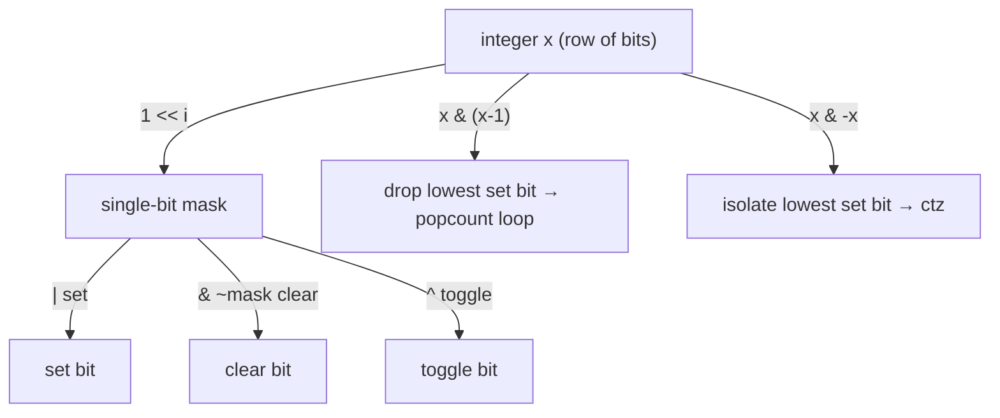

# Bit Tricks (The Foundational Bit-Manipulation Toolkit) — Junior Level

> **One-line summary:** Integers are just rows of bits, and with a handful of operators (`&`, `|`, `^`, `~`, `<<`, `>>`) plus two magic identities (`x & (x-1)` clears the lowest set bit, `x & -x` isolates it) you can test, set, clear, toggle, and count bits in O(1) — the building blocks under flags, sets, hashing, and low-level performance code.

---

## Table of Contents

1. [Introduction](#introduction)
2. [Prerequisites](#prerequisites)
3. [Glossary](#glossary)
4. [Core Concepts](#core-concepts)
5. [Big-O Summary](#big-o-summary)
6. [Real-World Analogies](#real-world-analogies)
7. [Pros & Cons](#pros--cons)
8. [Step-by-Step Walkthrough](#step-by-step-walkthrough)
9. [Code Examples](#code-examples)
10. [Coding Patterns](#coding-patterns)
11. [Error Handling](#error-handling)
12. [Performance Tips](#performance-tips)
13. [Best Practices](#best-practices)
14. [Edge Cases & Pitfalls](#edge-cases--pitfalls)
15. [Common Mistakes](#common-mistakes)
16. [Cheat Sheet](#cheat-sheet)
17. [Visual Animation](#visual-animation)
18. [Summary](#summary)
19. [Further Reading](#further-reading)

---

## Introduction

Every integer your computer stores is, underneath, a fixed-width row of binary digits called **bits**. The number `13` in a 32-bit integer is really the row `00000000 00000000 00000000 00001101`. Most of the time you never see those bits — you just do arithmetic. But a whole family of problems becomes dramatically simpler, faster, or smaller in memory once you start treating an integer as **a row of switches you can flip individually**.

That is what *bit manipulation* is: using the bitwise operators (`AND`, `OR`, `XOR`, `NOT`, and the two shifts) to read and change individual bits or groups of bits directly. The payoff shows up everywhere:

- **Flags and options.** Instead of ten separate boolean variables, pack ten on/off settings into one integer, one bit each.
- **Sets of small things.** A 64-bit integer is a ready-made set of the numbers `0..63`; membership is one `AND`, insertion is one `OR`.
- **Speed.** Multiplying by `8` is `x << 3`; testing "is this even?" is `x & 1`; checking "is this a power of two?" is `x & (x-1) == 0`. These run in a single CPU cycle.
- **Algorithms.** Counting set bits ("popcount"), finding the lowest set bit, and computing `log2` via leading zeros are the engine behind hashing, compression, graphics, cryptography, and competitive-programming tricks.

This file teaches the **foundational toolkit**: how integers are stored (including the all-important **two's complement** for negative numbers), the core single-bit operations (test, set, clear, toggle), the two famous identities `x & (x-1)` and `x & -x`, the power-of-two check, counting bits, and finding leading/trailing zeros. We emphasize *correctness* above cleverness — bit tricks are notorious for subtle bugs around **sign** and **width** (32-bit vs 64-bit), and we will point at every trap as we go.

A single mental model carries the whole topic: **the integer is a row of cells; each operator transforms that row in a predictable, parallel way.** Once you can picture the cells, every trick becomes obvious instead of mysterious.

---

## Prerequisites

Before reading this file you should be comfortable with:

- **Binary numbers** — that `1101₂ = 8 + 4 + 0 + 1 = 13`, and how to convert small numbers to and from binary.
- **Integer types and their widths** — that an `int32` holds 32 bits, an `int64`/`long` holds 64, and that values *wrap around* when they exceed the width.
- **Boolean logic** — AND is true only if both inputs are true; OR is true if either is; XOR is true if exactly one is.
- **Powers of two** — `1, 2, 4, 8, 16, …` and that bit position `i` has place value `2^i`.
- **Basic loops and functions** — every algorithm here is a short loop or a one-liner.

Optional but helpful:

- A peek at **hexadecimal** (`0xFF = 11111111₂`), because masks are far easier to read in hex.
- The idea of **signed vs unsigned** integers, which we develop from scratch in [Core Concepts](#core-concepts).

---

## Glossary

| Term | Meaning |
|------|---------|
| **Bit** | A single binary digit, `0` or `1`. The smallest unit of data. |
| **Width** | How many bits a value has (8, 16, 32, 64). Operations are defined *within* that width; going past it wraps. |
| **LSB (least significant bit)** | Bit position 0, the rightmost bit, place value `2^0 = 1`. Decides odd/even. |
| **MSB (most significant bit)** | The leftmost bit. In a signed type it is the **sign bit**. |
| **Mask** | A constant whose set bits select which positions you want to act on, e.g. `1 << i`. |
| **Set / clear / toggle a bit** | Force a bit to 1 / force it to 0 / flip it. |
| **Set bit** | A bit equal to 1 (also "on" bit). |
| **Popcount** | The number of set bits in a value (the *population count* or *Hamming weight*). |
| **Two's complement** | The standard way to represent signed integers; `-x` is stored as `~x + 1`. |
| **Sign bit** | The MSB; `1` means negative under two's complement. |
| **CLZ / CTZ** | Count Leading Zeros / Count Trailing Zeros — number of 0 bits before the first 1 from the top / bottom. |
| **Power of two** | A number with exactly one set bit (`1, 2, 4, 8, …`). |
| **Logical vs arithmetic shift** | Right shift filling with 0 (logical) vs copying the sign bit (arithmetic). |

---

## Core Concepts

### 1. The Six Operators

Bit manipulation rests on six operators. Picture two rows of bits lined up; each acts column by column.

| Operator | Symbol | Rule (per bit) | Use |
|----------|--------|----------------|-----|
| AND | `&` | 1 only if **both** are 1 | clear/keep bits (masking) |
| OR | `\|` | 1 if **either** is 1 | set bits |
| XOR | `^` | 1 if **exactly one** is 1 | toggle bits, compare, swap |
| NOT | `~` | flips every bit | build inverse masks |
| Left shift | `<<` | move bits left, fill 0 on right | multiply by 2^n, build masks |
| Right shift | `>>` | move bits right | divide by 2^n, extract fields |

A worked column example for `12 & 10`:

```
  1100   (12)
& 1010   (10)
  ----
  1000   (8)    each column is 1 only when both inputs are 1
```

### 2. Two's Complement (How Negatives Are Stored)

Computers do not store a separate "minus sign". Instead they use **two's complement**: to get `-x`, flip every bit and add 1.

```
 5  = 00000101
~5  = 11111010   (flip all bits)
-5  = 11111011   (add 1)   ← this is how -5 is stored
```

The beautiful consequence: ordinary addition "just works" for negatives, and the single identity `-x == ~x + 1` is the source of many tricks. The leftmost bit (the **sign bit**) is `1` for every negative number. Remember this — it is why `x & -x` (next section) works.

### 3. Single-Bit Operations With `1 << i`

To act on bit `i`, build the mask `1 << i` (a single 1 at position `i`):

```
Test   bit i:  (x >> i) & 1        → 1 if set, else 0
Set    bit i:  x | (1 << i)        → forces bit i to 1
Clear  bit i:  x & ~(1 << i)       → forces bit i to 0
Toggle bit i:  x ^ (1 << i)        → flips bit i
```

These are the four fundamental moves. Everything else is built from them.

### 4. The Two Magic Identities

Two expressions appear constantly:

- **`x & (x - 1)` clears the lowest set bit.** Subtracting 1 flips the lowest 1 to 0 and turns all the 0s below it into 1s; ANDing with the original wipes out that whole run.

  ```
  x      = 10110100
  x - 1  = 10110011
  x&(x-1)= 10110000   ← lowest set bit (position 2) is gone
  ```

- **`x & -x` isolates the lowest set bit.** Because `-x = ~x + 1`, the only bit that survives the AND is the lowest 1.

  ```
  x      = 10110100
  -x     = 01001100
  x & -x = 00000100   ← just the lowest set bit
  ```

### 5. Power-of-Two Check

A power of two has **exactly one** set bit. Clearing its lowest set bit leaves zero:

```
isPowerOfTwo(x)  =  x > 0  AND  (x & (x - 1)) == 0
```

The `x > 0` guard matters: `0` and negative numbers must be rejected.

### 6. Counting Set Bits (Popcount)

The number of 1-bits is the **popcount**. The simplest correct loop uses the clear-lowest-bit identity (Brian Kernighan's method): each iteration removes one set bit, so it loops exactly *popcount* times.

```
count = 0
while x != 0:
    x = x & (x - 1)   # drop one set bit
    count += 1
```

### 7. Leading / Trailing Zeros and log2

- **CTZ (count trailing zeros)** = position of the lowest set bit.
- **CLZ (count leading zeros)** = number of zeros above the highest set bit.
- For a positive number, `floor(log2(x)) = (width - 1) - clz(x)` — the index of the highest set bit.

Most languages give you these as fast builtins (covered in [Code Examples](#code-examples)).

### 8. Multiply / Divide by Powers of Two

Shifting moves the place values: `x << k` multiplies by `2^k`, and `x >> k` divides by `2^k` (rounding toward zero for *unsigned* or non-negative values; signed right shift rounds toward negative infinity, a pitfall we flag later).

---

## Big-O Summary

| Operation | Time | Notes |
|-----------|------|-------|
| Test / set / clear / toggle one bit | **O(1)** | A shift plus one logical op. |
| `x & (x-1)` (clear lowest set bit) | O(1) | One subtract + one AND. |
| `x & -x` (isolate lowest set bit) | O(1) | One negate + one AND. |
| Power-of-two check | O(1) | One subtract, one AND, one compare. |
| Popcount via Kernighan loop | **O(set bits)** | At most `width` iterations; usually fewer. |
| Popcount via builtin / parallel | O(1) | Hardware instruction or fixed shifts. |
| CLZ / CTZ via builtin | O(1) | Hardware instruction on modern CPUs. |
| CLZ / CTZ via naive loop | O(width) | Scans bit by bit. |
| Multiply / divide by `2^k` (shift) | O(1) | Single instruction. |
| Round up to next power of two | O(1) | Fixed sequence of shifts/ORs (or one CLZ). |

The headline: **almost everything is O(1)** within a fixed width. The only loop is the bit-by-bit fallback, bounded by the width (≤ 64). That constant-time nature is exactly why these tricks power performance-critical code.

---

## Real-World Analogies

| Concept | Analogy |
|---------|---------|
| Integer as bits | A row of light switches; each switch is one bit, on (1) or off (0). |
| Mask (`1 << i`) | A stencil that exposes only one switch so you can flip exactly it. |
| AND with a mask | Putting a cardboard cutout over the row so only the selected switches show through. |
| OR to set | Pressing a switch firmly *on* — it ends up on no matter where it started. |
| XOR to toggle | A push-button light switch: press it and it changes state. |
| Two's complement | An odometer that rolls backward past zero into "all nines" instead of showing a minus sign. |
| `x & (x-1)` | Removing the rightmost lit bulb from a string of fairy lights. |
| Popcount | Counting how many bulbs in the string are currently lit. |
| Power of two | A light string with exactly one bulb on. |

Where the analogies break: real switches do not "carry" into their neighbor, but subtraction (`x - 1`) does ripple across a run of zeros. That ripple is precisely what makes `x & (x-1)` work.

---

## Pros & Cons

| Pros | Cons |
|------|------|
| Constant-time operations; often a single CPU instruction. | Code is terse and hard to read without comments. |
| Compact storage — 64 booleans fit in one 64-bit word. | Easy to introduce sign/width bugs that pass small tests. |
| No branches in many tricks → CPU-pipeline friendly. | Tricks differ between signed and unsigned types. |
| Portable core (`&`, `|`, `^`, shifts) across all languages. | Shifting by ≥ the width is undefined behavior in C/C++/Go. |
| Foundation for sets, flags, hashing, compression, graphics. | XOR swap and other "clever" tricks are footguns in real code. |
| Builtins (`popcount`, `clz`, `ctz`) make it fast *and* clean. | Misreading a hex mask silently corrupts results. |

**When to use:** flags/options bundles, small-universe sets, performance-critical inner loops, hashing and checksums, low-level protocols, and counting/searching problems where O(1) bit math replaces a loop.

**When NOT to use:** when readability matters more than the nanoseconds saved, when the "set" is large or sparse (use a real hash set), or when a clear arithmetic expression (`x * 8`) is just as fast and far clearer than `x << 3` to your team.

---

## Step-by-Step Walkthrough

Let us take `x = 44` and walk through the core operations by hand. In 8 bits, `44 = 00101100`.

**Test bit 2.** `(44 >> 2) & 1`. Shifting right by 2 gives `00001011`; AND with 1 gives `1`. Bit 2 is set. ✓ (Indeed `44` includes `4 = 2^2`.)

**Set bit 1.** `44 | (1 << 1) = 00101100 | 00000010 = 00101110 = 46`. Bit 1 is now on.

**Clear bit 2.** `44 & ~(1 << 2)`. The mask `1 << 2 = 00000100`; its inverse `~` is `11111011`; AND gives `00101000 = 40`. Bit 2 is now off.

**Toggle bit 5.** `44 ^ (1 << 5) = 00101100 ^ 00100000 = 00001100 = 12`. Bit 5 was on, now off.

**Clear the lowest set bit, `x & (x-1)`:**

```
x      = 00101100   (44)
x - 1  = 00101011   (43)
x&(x-1)= 00101000   (40)   ← the lowest set bit (position 2) vanished
```

**Isolate the lowest set bit, `x & -x`:**

```
x      = 00101100   (44)
-x     = 11010100   (two's complement of 44)
x & -x = 00000100   (4)    ← exactly the lowest set bit, at position 2
```

**Count set bits with Kernighan's loop:**

```
44 = 00101100  → 3 set bits expected
iter 1: x = 44 & 43 = 40,  count = 1
iter 2: x = 40 & 39 = 32,  count = 2
iter 3: x = 32 & 31 = 0,   count = 3
x is 0 → stop. popcount(44) = 3 ✓
```

Three iterations for three set bits — the loop runs exactly *popcount* times, never more.

---

## Code Examples

### Example: The Core Toolkit in Three Languages

Each snippet implements test/set/clear/toggle, the two identities, power-of-two, and popcount.

#### Go

```go
package main

import (
	"fmt"
	"math/bits"
)

func testBit(x uint, i int) bool  { return (x>>uint(i))&1 == 1 }
func setBit(x uint, i int) uint   { return x | (1 << uint(i)) }
func clearBit(x uint, i int) uint { return x &^ (1 << uint(i)) } // &^ is AND-NOT
func toggleBit(x uint, i int) uint { return x ^ (1 << uint(i)) }

func lowestSetBit(x uint) uint    { return x & (-x) }       // isolate lowest 1
func dropLowestBit(x uint) uint   { return x & (x - 1) }    // clear lowest 1
func isPowerOfTwo(x uint) bool    { return x != 0 && x&(x-1) == 0 }

func popcountKernighan(x uint) int {
	count := 0
	for x != 0 {
		x &= x - 1 // drop one set bit per iteration
		count++
	}
	return count
}

func main() {
	x := uint(44) // 00101100
	fmt.Println("test bit 2:", testBit(x, 2))      // true
	fmt.Println("set bit 1:", setBit(x, 1))        // 46
	fmt.Println("clear bit 2:", clearBit(x, 2))    // 40
	fmt.Println("toggle bit 5:", toggleBit(x, 5))  // 12
	fmt.Println("lowest set bit:", lowestSetBit(x)) // 4
	fmt.Println("drop lowest:", dropLowestBit(x))   // 40
	fmt.Println("power of two? 64:", isPowerOfTwo(64)) // true
	fmt.Println("popcount:", popcountKernighan(x))     // 3
	fmt.Println("builtin popcount:", bits.OnesCount(x)) // 3
}
```

#### Java

```java
public class BitTricks {
    static boolean testBit(int x, int i)  { return ((x >> i) & 1) == 1; }
    static int setBit(int x, int i)       { return x | (1 << i); }
    static int clearBit(int x, int i)     { return x & ~(1 << i); }
    static int toggleBit(int x, int i)    { return x ^ (1 << i); }

    static int lowestSetBit(int x)        { return x & (-x); }
    static int dropLowestBit(int x)       { return x & (x - 1); }
    static boolean isPowerOfTwo(int x)    { return x > 0 && (x & (x - 1)) == 0; }

    static int popcountKernighan(int x) {
        int count = 0;
        while (x != 0) {
            x &= x - 1;   // drop one set bit
            count++;
        }
        return count;
    }

    public static void main(String[] args) {
        int x = 44; // 00101100
        System.out.println("test bit 2: " + testBit(x, 2));     // true
        System.out.println("set bit 1: " + setBit(x, 1));       // 46
        System.out.println("clear bit 2: " + clearBit(x, 2));   // 40
        System.out.println("toggle bit 5: " + toggleBit(x, 5)); // 12
        System.out.println("lowest set bit: " + lowestSetBit(x)); // 4
        System.out.println("power of two? 64: " + isPowerOfTwo(64)); // true
        System.out.println("popcount: " + popcountKernighan(x));     // 3
        System.out.println("builtin popcount: " + Integer.bitCount(x)); // 3
    }
}
```

#### Python

```python
def test_bit(x, i):    return (x >> i) & 1 == 1
def set_bit(x, i):     return x | (1 << i)
def clear_bit(x, i):   return x & ~(1 << i)
def toggle_bit(x, i):  return x ^ (1 << i)

def lowest_set_bit(x): return x & (-x)      # isolate lowest 1
def drop_lowest(x):    return x & (x - 1)   # clear lowest 1
def is_power_of_two(x): return x > 0 and (x & (x - 1)) == 0

def popcount_kernighan(x):
    count = 0
    while x:
        x &= x - 1   # drop one set bit per iteration
        count += 1
    return count


if __name__ == "__main__":
    x = 44  # 0b101100
    print("test bit 2:", test_bit(x, 2))       # True
    print("set bit 1:", set_bit(x, 1))         # 46
    print("clear bit 2:", clear_bit(x, 2))     # 40
    print("toggle bit 5:", toggle_bit(x, 5))   # 12
    print("lowest set bit:", lowest_set_bit(x)) # 4
    print("power of two? 64:", is_power_of_two(64)) # True
    print("popcount:", popcount_kernighan(x))   # 3
    print("builtin popcount:", x.bit_count())   # 3  (Python 3.10+)
```

**What it does:** runs every core trick on `x = 44` and prints results that match the hand walkthrough.
**Run:** `go run main.go` | `javac BitTricks.java && java BitTricks` | `python bittricks.py`

> **Note on Python:** Python integers are *arbitrary precision* — there is no fixed width and no two's-complement sign bit, so `~x == -x-1` and there is no 32-bit overflow. When a problem assumes 32-bit `int`, mask with `& 0xFFFFFFFF` to simulate it. This is the single biggest cross-language gotcha for beginners.

---

## Coding Patterns

### Pattern 1: Build a Mask for the Low `i` Bits

**Intent:** Get a value whose lowest `i` bits are all 1, useful for extracting fields.

```python
def low_mask(i):
    return (1 << i) - 1   # i ones:  (1<<3)-1 = 0b111 = 7
```

`1 << i` is a single 1 at position `i`; subtracting 1 turns it into `i` ones below that position.

### Pattern 2: Extract a Bit Field

**Intent:** Read bits `[lo, lo+len)` out of `x` as a small number.

```python
def extract_field(x, lo, length):
    return (x >> lo) & ((1 << length) - 1)
```

Shift the field down to position 0, then mask off everything above it.

### Pattern 3: Iterate Over Set Bits

**Intent:** Visit each set bit's position exactly once (great for subset/bitmask problems).

```python
def each_set_bit(x):
    while x:
        low = x & (-x)          # isolate lowest set bit
        i = low.bit_length() - 1 # its position
        yield i
        x &= x - 1              # drop it and continue
```

### Pattern 4: Round Up to the Next Power of Two

**Intent:** Common in hash-table and buffer sizing. Smear the highest bit downward, then add 1.

```python
def next_power_of_two_32(x):
    if x <= 1:
        return 1
    x -= 1
    x |= x >> 1
    x |= x >> 2
    x |= x >> 4
    x |= x >> 8
    x |= x >> 16
    return x + 1
```



---

## Error Handling

| Error | Cause | Fix |
|-------|-------|-----|
| Negative or huge result from `1 << i` | `i ≥ width` of the type (undefined / overflow). | Keep `0 ≤ i < width`; use a 64-bit literal `1L << i` / `uint64(1) << i` if you need high bits. |
| `isPowerOfTwo(0)` returns true | Forgot the `x > 0` guard; `0 & -1 == 0`. | Always guard: `x > 0 && (x & (x-1)) == 0`. |
| Wrong sign after `>>` | Arithmetic (sign-preserving) shift on a negative number. | Use unsigned types or Java's `>>>` for a logical shift. |
| Python answer differs from Go/Java | Python has no fixed width / no sign bit. | Mask with `& 0xFFFFFFFF` (or `0xFFFFFFFFFFFFFFFF`) to emulate fixed width. |
| `1 << 31` is negative in Java | `1` is a 32-bit `int`; bit 31 is the sign bit. | Use `1L << 31` for a 64-bit value, or treat as unsigned. |
| `x & -x` of `0` is `0` | `0` has no set bit to isolate. | Handle `x == 0` separately if 0 is possible. |

---

## Performance Tips

- **Prefer the builtin popcount** (`bits.OnesCount`, `Integer.bitCount`, `int.bit_count`) over hand loops — it compiles to a single CPU instruction on modern hardware.
- **Use `&^` in Go** (AND-NOT) to clear bits in one operator instead of `& ~mask`.
- **Avoid branches** where a bit trick removes them: `x & 1` beats `x % 2 == 0` for parity, and branchless `min`/`abs` avoid mispredictions in tight loops.
- **Shift to multiply/divide by powers of two** only when the constant is genuinely a power of two; modern compilers already turn `x * 8` into a shift, so do it for clarity, not magic.
- **Pick the smallest correct width.** Operating on `uint32` is fine for 32-bit data; do not promote to 64-bit unless you need the extra bits.

---

## Best Practices

- **Comment every mask** with its meaning and the bit positions it touches; `0x0F` is far clearer as `// low nibble`.
- **Use unsigned types** for pure bit work so that `>>` is logical and `x & -x` behaves predictably.
- **Prefer named helpers** (`setBit`, `clearBit`) over inline magic in application code; reserve raw operators for hot inner loops.
- **Reach for builtins** for popcount/clz/ctz instead of reimplementing — they are correct, fast, and obvious.
- **Test against a brute-force oracle** (a bit-by-bit loop) for every clever trick before trusting it.
- **Write the width down.** Decide 32 vs 64 up front and stay consistent; mixing widths is where most bugs live.

---

## Edge Cases & Pitfalls

- **`x = 0`** — popcount is 0, `x & -x` is 0, `x & (x-1)` is 0, and it is **not** a power of two.
- **Shifting by `width` or more** — undefined behavior in C/C++/Go and a no-op-or-wrap in some languages; never do `1 << 32` on a 32-bit type.
- **The sign bit** — `1 << 31` is negative as a signed 32-bit `int`; use a 64-bit or unsigned type for high bits.
- **Signed right shift** — `-8 >> 1` is `-4` (rounds toward negative infinity), not `-4`'s magnitude truncation you might expect; division by shifting differs from integer division for negatives.
- **Negative numbers in `x & (x-1)`** — works fine in two's complement, but the "lowest set bit" of a negative number may surprise you; reason in binary, not in decimal.
- **Python's unbounded integers** — `~x` and `<<` never overflow, so 32-bit assumptions must be enforced manually with masks.
- **`-x` of the minimum value** — for `INT_MIN`, `-x` overflows to itself; `x & -x` still works but the magnitude wraps.

---

## Common Mistakes

1. **Forgetting the `x > 0` guard** in the power-of-two check, so `0` falsely reports true.
2. **Shifting `1` instead of `1L`/`uint64(1)`** when you need bit 32 or higher, silently truncating to 0 or hitting the sign bit.
3. **Confusing `&` with `&&`** (and `|` with `||`) — the bitwise vs logical operators are different and mix-ups compile but misbehave.
4. **Assuming `>>` zero-fills** on signed types; it copies the sign bit, corrupting negative-number math.
5. **Porting C bit tricks to Python verbatim** and ignoring that Python has no fixed width — results diverge for high bits and negatives.
6. **Using XOR swap** in real code (`a ^= b; b ^= a; a ^= b`) — it breaks when both operands alias the same location, setting it to 0. Use a temp or tuple swap.
7. **Off-by-one in masks** — `(1 << i)` is one bit at `i`, while `(1 << i) - 1` is `i` bits; mixing them produces fields that are too wide or too narrow.

---

## Cheat Sheet

| Goal | Expression |
|------|------------|
| Test bit `i` | `(x >> i) & 1` |
| Set bit `i` | `x \| (1 << i)` |
| Clear bit `i` | `x & ~(1 << i)` |
| Toggle bit `i` | `x ^ (1 << i)` |
| Isolate lowest set bit | `x & -x` |
| Clear lowest set bit | `x & (x - 1)` |
| Is power of two? | `x > 0 && (x & (x-1)) == 0` |
| Low `i` bits mask | `(1 << i) - 1` |
| Extract field `[lo, lo+len)` | `(x >> lo) & ((1 << len) - 1)` |
| Multiply by `2^k` | `x << k` |
| Divide by `2^k` (non-negative) | `x >> k` |
| Popcount (builtin) | `bits.OnesCount` / `Integer.bitCount` / `x.bit_count()` |
| Trailing zeros (ctz) | `bits.TrailingZeros` / `Integer.numberOfTrailingZeros` |
| Leading zeros (clz) | `bits.LeadingZeros` / `Integer.numberOfLeadingZeros` |
| `floor(log2 x)` (x>0) | `(width-1) - clz(x)` |

Core popcount loop (Kernighan):

```
count = 0
while x != 0:
    x = x & (x - 1)   # drop one set bit
    count += 1
# runs exactly popcount(x) times
```

---

## Visual Animation

> See [`animation.html`](./animation.html) for an interactive visualization.
>
> The animation demonstrates:
> - The 32 bit cells of an editable integer, lit (1) or dark (0)
> - Stepping through set / clear / toggle on a chosen bit `i`
> - `x & (x-1)` removing the lowest set bit, and `x & -x` isolating it
> - Brian Kernighan's popcount loop, one set bit removed per step
> - Play / Pause / Step controls and a live binary + decimal readout

---

## Summary

A computer integer is a fixed-width row of bits, and the six operators (`&`, `|`, `^`, `~`, `<<`, `>>`) let you read and rewrite those bits in O(1). The four fundamental moves — test, set, clear, toggle — all build on the mask `1 << i`. Negative numbers use **two's complement** (`-x == ~x + 1`), which powers the two identities you will use forever: `x & (x-1)` clears the lowest set bit (basis of Kernighan's popcount) and `x & -x` isolates it (basis of ctz). From these you get the power-of-two check, mask building, field extraction, and log2-via-clz. The whole toolkit is fast and compact, but it is *unforgiving* about **sign** and **width**: keep shifts in range, watch the sign bit, reach for unsigned types, prefer builtins over clever reimplementations, and remember that Python's unbounded integers do not behave like fixed-width ones. Master these basics and the rest of bit manipulation becomes routine.

---

## Further Reading

- *Hacker's Delight* (Henry S. Warren, Jr.) — the canonical catalog of bit tricks with proofs.
- Sean Eron Anderson — "Bit Twiddling Hacks" (Stanford graphics page), a famous free reference.
- *Introduction to Algorithms* (CLRS) — appendix on integer arithmetic and representation.
- Go `math/bits`, Java `Integer`/`Long`, Python `int` documentation — the standard-library builtins.
- Sibling topics in `18-bit-manipulation` — bitmask DP, subset enumeration, and Gray codes build directly on this toolkit.
