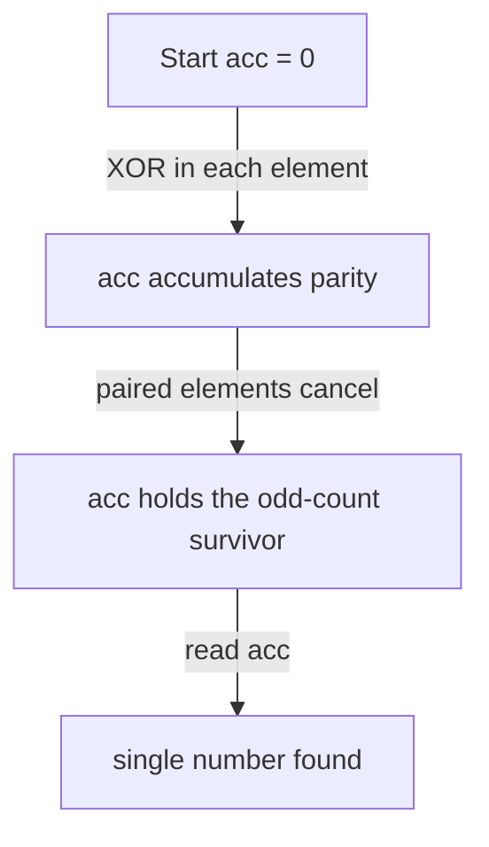

# XOR Pairing & XOR Identities — Junior Level

> **One-line summary:** XOR (`^`) is its own inverse — `x ^ x = 0` and `x ^ 0 = x`. So if you XOR together a whole array in which every value appears twice except one, all the pairs cancel out and you are left with exactly the single value. That one idea, plus a few cousins, solves a whole family of array puzzles in `O(n)` time and `O(1)` extra space.

---

## Table of Contents

1. [Introduction](#introduction)
2. [Prerequisites](#prerequisites)
3. [Glossary](#glossary)
4. [Core Concepts](#core-concepts)
5. [Big-O Summary](#big-o-summary)
6. [Real-World Analogies](#real-world-analogies)
7. [Pros & Cons](#pros--cons)
8. [Step-by-Step Walkthrough](#step-by-step-walkthrough)
9. [Code Examples](#code-examples)
10. [Coding Patterns](#coding-patterns)
11. [Error Handling](#error-handling)
12. [Performance Tips](#performance-tips)
13. [Best Practices](#best-practices)
14. [Edge Cases & Pitfalls](#edge-cases--pitfalls)
15. [Common Mistakes](#common-mistakes)
16. [Cheat Sheet](#cheat-sheet)
17. [Visual Animation](#visual-animation)
18. [Summary](#summary)
19. [Further Reading](#further-reading)

---

## Introduction

Imagine a lecture hall where everyone arrived with a partner and sat down in pairs. The lights go out, and you are told: *"Exactly one person came alone. Find them — but you may only carry a single number in your head, and you must look at each seat exactly once."* You cannot build a list of who you have seen, because you are only allowed to remember one value. How do you do it?

The trick is **XOR** (the exclusive-or operation, written `^`). XOR has a magical pairing property: combining any value with itself gives zero (`x ^ x = 0`), and combining any value with zero leaves it unchanged (`x ^ 0 = x`). So if you start with `0` and XOR in every seat number one at a time, every person who came with a partner gets cancelled by their partner, and the single value left over is exactly the loner.

This is the canonical **single number** problem: *given an array in which every element appears exactly twice except for one element that appears once, find that one element.* The brute-force way uses a hash set or counts occurrences — that needs `O(n)` extra memory. The XOR way needs **one integer** of memory and a single pass:

```
answer = 0
for each value x in the array:
    answer = answer ^ x
return answer
```

Why does this work? Because XOR is **commutative** and **associative**, you may reorder and regroup the operations however you like. Mentally pair up the duplicates: each pair XORs to `0`, all the zeros XOR to `0`, and the lonely element XORs with `0` to give itself. The order in the array does not matter at all.

This single identity (`x ^ x = 0`) is the seed of an entire toolkit. The same "things cancel in pairs" reasoning lets you find a missing number, detect a duplicate, compute the XOR of a whole range `[0..n]` with a four-case closed form, answer "XOR of this subarray" queries in `O(1)` with prefix XORs, generate Gray codes with `x ^ (x >> 1)`, and even swap two variables without a temporary. We will use **single number (others appear twice)** as the running example throughout this file, then point you to the next level for the harder variants.

A note on scope: this topic is about the *algebra of XOR and its classic applications*. The sibling topic `06-binary-trie-xor-basis` covers the heavier **data structures** — the binary trie and the linear (XOR) basis used to maximize/query XOR over sets. Here we stay with the identities and the array tricks they unlock.

---

## Prerequisites

Before reading this file you should be comfortable with:

- **Binary representation of integers** — every integer is a string of bits; `5` is `101`, `6` is `110`.
- **The three bitwise operators** — AND (`&`), OR (`|`), and XOR (`^`), at least at a "truth table" level.
- **Arrays and a single loop** — every algorithm here is one pass over an array.
- **Big-O notation** — `O(n)` time and `O(1)` space are the targets.
- **Hash sets / counting** — so you can appreciate what XOR *saves* (the extra memory).

Optional but helpful:

- A glance at **two's complement** (how negative numbers are stored) — XOR works bit-by-bit regardless, so signs rarely matter, but it helps to know.
- Familiarity with **operator precedence**, because `^` binds *looser* than `==` and `+` in C-family languages — a notorious bug source.

---

## Glossary

| Term | Meaning |
|------|---------|
| **XOR (`^`)** | Exclusive-or: bitwise `1` exactly where the two operands' bits **differ**. `1^1 = 0`, `1^0 = 1`, `0^0 = 0`. |
| **Self-inverse / involution** | An operation that undoes itself: `x ^ y ^ y = x`. XORing by the same value twice returns the original. |
| **Identity element** | The value that changes nothing under an operation. For XOR it is `0`: `x ^ 0 = x`. |
| **Commutative** | Order does not matter: `a ^ b = b ^ a`. |
| **Associative** | Grouping does not matter: `(a ^ b) ^ c = a ^ (b ^ c)`. |
| **XOR-all / fold** | Combining every element of a collection with XOR into one accumulator. |
| **Set bit** | A bit position holding `1`. "Lowest set bit" of `x` is `x & (-x)`. |
| **Prefix XOR** | `pre[i]` = XOR of the first `i` elements; lets you XOR any subarray in `O(1)`. |
| **Gray code** | An ordering of integers where consecutive values differ in exactly one bit; `gray(x) = x ^ (x >> 1)`. |
| **Partition by a set bit** | Splitting values into two groups by whether a chosen bit is `0` or `1`; the key to the two-singles problem. |

---

## Core Concepts

### 1. The XOR Truth Table

XOR compares two bits and outputs `1` only when they **differ**:

```
a   b   a^b
0   0    0
0   1    1
1   0    1
1   1    0
```

On full integers, XOR is applied independently to each bit position. So `5 ^ 6` is `101 ^ 110 = 011 = 3`. Think of XOR as "bitwise difference detector."

### 2. The Four Identities That Run Everything

```
x ^ 0 = x          (0 is the identity element)
x ^ x = 0          (every value is its own inverse — self-inverse)
a ^ b = b ^ a      (commutative)
(a ^ b) ^ c = a ^ (b ^ c)   (associative)
```

The first two are the headline. **`x ^ x = 0` is the cancellation rule**, and **`x ^ 0 = x` is the survival rule**. Together they say: in a long XOR chain, anything that appears an *even* number of times disappears, and anything that appears an *odd* number of times survives. Commutativity and associativity are what *let* you mentally rearrange the chain so pairs sit next to each other and cancel.

### 3. XOR-All Isolates the Odd One Out

Take the array `[4, 1, 2, 1, 2]`. Fold it with XOR:

```
0 ^ 4 ^ 1 ^ 2 ^ 1 ^ 2
= 4 ^ (1 ^ 1) ^ (2 ^ 2)      // regroup — allowed by commutativity/associativity
= 4 ^ 0 ^ 0
= 4
```

The two `1`s cancelled, the two `2`s cancelled, and `4` (the only value appearing an odd number of times) survived. That is the **single number (others twice)** algorithm in full.

### 4. The Self-Inverse Property Is the Whole Game

`x ^ x = 0` means XOR is an **involution**: applying `^ k` twice with the same `k` brings you back. This shows up everywhere:

- Add a value, then "remove" it later by XORing the same value again.
- Toggle a bit on, then off, with the same mask.
- Swap two numbers (each side XORed twice cancels — see the swap trick below).

If you remember nothing else, remember: **XOR is the operation that perfectly undoes itself.**

### 5. The Algebra: `(Z/2)^n` Under XOR (Gentle Version)

For the curious — and this is made rigorous in `professional.md` — the set of all `n`-bit numbers, with XOR as the "addition," forms a clean algebraic structure called a **group** (specifically `(Z/2)^n`, the vector space of bit-strings over the two-element field). The four identities above are exactly the group axioms: `0` is the identity, every element is its own inverse, and the operation is commutative and associative. You do not need this vocabulary to use XOR, but it explains *why* the tricks never have surprising exceptions: the algebra guarantees it.

### 6. Partition by a Set Bit (Preview)

When two different elements survive (the "two singles" problem in `middle.md`), XOR-all gives you `a ^ b` — the bits where `a` and `b` differ. Pick any one of those differing bits, split the array into "bit is 0" and "bit is 1" groups, and XOR each group separately. `a` and `b` land in different groups, so each group reduces to a single-number problem. We mention it here so the technique is on your radar; the full treatment is at the next level.

### 7. XOR Is Carry-Free (So It Never Overflows)

Unlike `+`, which can carry from one bit into the next (`1 + 1 = 10` in binary), XOR computes each bit *independently* — there is no carry. A practical consequence: you can XOR a billion fixed-width integers together and the accumulator never overflows the original width. This is why XOR-based solutions to missing-number and duplicate problems are preferred over the "sum trick" (`n(n+1)/2 - sum`): the sum can overflow for large `n`, but the XOR version cannot. Carry-freedom also makes XOR a single, fast CPU instruction with no special-case handling.

In fact, XOR is sometimes called "addition without carry" or "addition modulo 2 per bit." That phrasing captures both its power (it behaves like an addition you can always undo) and its limit (it forgets how many times something was added, keeping only the even/odd parity). Hold onto that mental model: XOR adds and cancels in lockstep, one independent bit at a time.

---

## Big-O Summary

| Operation | Time | Space | Notes |
|-----------|------|-------|-------|
| Single number (others twice), XOR-all | **O(n)** | **O(1)** | One pass, one accumulator. |
| Same problem via hash set | O(n) | O(n) | Correct but uses linear memory. |
| Missing number in `[0..n]` via XOR | O(n) | O(1) | XOR indices and values together. |
| XOR of range `[0..n]` (closed form) | **O(1)** | O(1) | Four-case formula on `n mod 4`. |
| Build prefix-XOR array | O(n) | O(n) | Enables `O(1)` subarray XOR. |
| One subarray-XOR query | **O(1)** | — | `pre[r] ^ pre[l-1]`. |
| Gray code of `x` | O(1) | O(1) | `x ^ (x >> 1)`. |
| Swap via XOR | O(1) | O(1) | No temporary variable. |

The headline pair is **`O(n)` time, `O(1)` space** for XOR-all — strictly better in memory than the hash-set approach, with the same time.

---

## Real-World Analogies

| Concept | Analogy |
|---------|---------|
| `x ^ x = 0` (pairs cancel) | A dance where partners pair off and walk out together; only the person without a partner remains on the floor. |
| `x ^ 0 = x` (identity) | Mixing a color with "nothing" leaves the color unchanged. |
| XOR-all the array | Tallying attendance with a light switch you flip once per ID; an even count returns it to off, an odd count leaves it on. |
| Self-inverse / undo | A light switch: flip it twice and you are exactly where you started. |
| Partition by a set bit | Sorting people into two rooms by whether their badge number is odd or even, knowing the two you seek differ on that digit. |
| Prefix XOR | A running parity ledger: subtract (XOR) two checkpoints to learn the parity of everything in between. |
| Gray code | A combination lock dial where each click changes only one wheel by one notch — no abrupt multi-digit jumps. |

Where the analogies break: real switches and dancers are physical and one-dimensional, whereas XOR operates on *all bit positions at once and independently*. The cancellation happens in parallel across every bit.

---

## Pros & Cons

| Pros | Cons |
|------|------|
| `O(1)` extra space — beats the hash-set solution's `O(n)`. | Only works when the *structure* matches (exactly one odd-count element, rest even). |
| Branch-free, single CPU instruction per fold — extremely fast. | A single misplaced element silently corrupts the answer (no error raised). |
| Order-independent: works on streams, shuffled data, any traversal. | Cannot tell you *how many* times something appeared, only the parity. |
| No overflow worries — XOR never carries, so no sums to overflow. | Operator precedence of `^` is low; missing parentheses cause subtle bugs. |
| Same identities power many problems — high reuse. | "Others appear 3 times" needs a different (mod-3) trick, not plain XOR-all. |

**When to use:** finding an odd-count element, missing/duplicate detection over `[0..n]`, parity questions, subarray-XOR queries, toggling state, swapping in tight loops, Gray-code generation.

**When NOT to use:** when you need actual counts, when more than one element has odd count *and* you cannot split them cleanly, or when the duplicate structure is not "all even except one."

---

## Step-by-Step Walkthrough

Take the array `nums = [4, 1, 2, 1, 2]`. Every value appears twice except `4`. We fold with an accumulator `acc` starting at `0`.

```
acc = 0

step 1:  acc = 0 ^ 4 = 4        (binary 000 ^ 100 = 100)
step 2:  acc = 4 ^ 1 = 5        (binary 100 ^ 001 = 101)
step 3:  acc = 5 ^ 2 = 7        (binary 101 ^ 010 = 111)
step 4:  acc = 7 ^ 1 = 6        (binary 111 ^ 001 = 110)  -- first 1 cancelled
step 5:  acc = 6 ^ 2 = 4        (binary 110 ^ 010 = 100)  -- first 2 cancelled

result = 4
```

Notice how the accumulator wanders (4 → 5 → 7 → 6 → 4) but lands exactly back on `4`. The intermediate values look random; that is fine. What matters is the *final* state, where every paired contribution has cancelled.

**Verify with regrouping.** Because XOR is commutative and associative, reorder the array as `[1, 1, 2, 2, 4]`:

```
(1 ^ 1) ^ (2 ^ 2) ^ 4
= 0 ^ 0 ^ 4
= 4
```

Same answer, obtained by pairing duplicates explicitly. The algorithm does this implicitly, in whatever order the array happens to be in.

**Bit-level view of the final state.** Look at each bit column across all five numbers:

```
        bit2 bit1 bit0
4  =     1    0    0
1  =     0    0    1
2  =     0    1    0
1  =     0    0    1
2  =     0    1    0
        ----------------
parity:  1    0    0   -> 100 = 4
```

Each bit column's answer is the **parity** (XOR) of that column. Columns with an even number of `1`s give `0`; the column where `4` contributes its lone `1` gives `1`. The survivor is `4`. This is why XOR-all works bit by bit, simultaneously.

**A second tiny example.** Take `nums = [7, 3, 5, 3, 7]`. The pairs are the two `7`s and the two `3`s; the lone value is `5`.

```
acc = 0
acc = 0 ^ 7 = 7
acc = 7 ^ 3 = 4
acc = 4 ^ 5 = 1
acc = 1 ^ 3 = 2
acc = 2 ^ 7 = 5
result = 5
```

Regrouping confirms it: `(7 ^ 7) ^ (3 ^ 3) ^ 5 = 0 ^ 0 ^ 5 = 5`. Notice again that the accumulator's intermediate values (7, 4, 1, 2, 5) look unrelated to the answer — only the final state matters, and it lands precisely on the unpaired element.

---

## Code Examples

### Example: Single Number (every other element appears twice)

This reads an array and returns the unique element using XOR-all.

#### Go

```go
package main

import "fmt"

// singleNumber returns the element that appears exactly once when every
// other element appears exactly twice. O(n) time, O(1) space.
func singleNumber(nums []int) int {
	acc := 0
	for _, x := range nums {
		acc ^= x // fold each value in; pairs cancel to 0
	}
	return acc
}

func main() {
	fmt.Println(singleNumber([]int{4, 1, 2, 1, 2})) // 4
	fmt.Println(singleNumber([]int{2, 2, 7}))       // 7
	fmt.Println(singleNumber([]int{99}))            // 99 (single element)
}
```

#### Java

```java
public class SingleNumber {
    // O(n) time, O(1) space.
    static int singleNumber(int[] nums) {
        int acc = 0;
        for (int x : nums) {
            acc ^= x; // self-inverse: duplicates cancel
        }
        return acc;
    }

    public static void main(String[] args) {
        System.out.println(singleNumber(new int[]{4, 1, 2, 1, 2})); // 4
        System.out.println(singleNumber(new int[]{2, 2, 7}));       // 7
        System.out.println(singleNumber(new int[]{99}));            // 99
    }
}
```

#### Python

```python
from functools import reduce
from operator import xor


def single_number(nums):
    """Element appearing once when all others appear twice. O(n)/O(1)."""
    acc = 0
    for x in nums:
        acc ^= x          # explicit fold; pairs cancel to 0
    return acc


def single_number_reduce(nums):
    """Same idea, idiomatic one-liner."""
    return reduce(xor, nums, 0)


if __name__ == "__main__":
    print(single_number([4, 1, 2, 1, 2]))         # 4
    print(single_number([2, 2, 7]))               # 7
    print(single_number_reduce([4, 1, 2, 1, 2]))  # 4
```

**What it does:** folds the array into one accumulator; every duplicate cancels with its twin, leaving the unique value.
**Run:** `go run main.go` | `javac SingleNumber.java && java SingleNumber` | `python single.py`

### Example: Swap Two Variables Without a Temporary

A direct use of the self-inverse property.

#### Go

```go
package main

import "fmt"

func main() {
	a, b := 7, 19
	a ^= b // a = a^b
	b ^= a // b = b ^ (a^b) = a
	a ^= b // a = (a^b) ^ a = b
	fmt.Println(a, b) // 19 7  (swapped)
}
```

#### Python

```python
a, b = 7, 19
a ^= b
b ^= a
a ^= b
print(a, b)  # 19 7
```

> Note: the XOR swap is a *teaching* trick. Use it to internalize self-inverse, not in production — a normal temporary (or tuple swap in Python) is clearer and just as fast, and the XOR swap breaks if both names alias the same storage (it zeroes the value).

---

## Coding Patterns

### Pattern 1: The Brute-Force Oracle (test against this)

**Intent:** Before trusting XOR-all, count occurrences the obvious way and confirm they agree on small inputs.

```python
from collections import Counter


def single_number_bruteforce(nums):
    counts = Counter(nums)
    for value, c in counts.items():
        if c == 1:
            return value
    raise ValueError("no unique element")
```

This is `O(n)` time but `O(n)` space. It is the oracle: the XOR version must give the same answer. Use it in tests, not in the hot path.

### Pattern 2: Fold From a Non-Zero Seed

**Intent:** Sometimes you want "XOR of the array, then combine with something else." Start the accumulator at that something else instead of `0`. Because `0` is the identity, seeding with `0` is the neutral default; seeding with `s` computes `s ^ (XOR of array)`.

### Pattern 3: Toggle Membership

**Intent:** Maintain a "running XOR signature" of a multiset as elements are inserted and removed. Inserting and later removing the same element cancels (self-inverse), so the signature reflects only the elements present an odd number of times.



---

## Error Handling

| Error | Cause | Fix |
|-------|-------|-----|
| Wrong answer, looks "random" | Input does not match the assumption (some element appears an odd number of times unexpectedly). | Validate the structure with the counting oracle in tests. |
| `0` returned unexpectedly | The "unique" element is genuinely `0`, **or** everything cancelled (no unique element). | Distinguish by checking input length parity / counts when correctness matters. |
| Compile/parse surprise with `==` | `if x ^ y == 0` parses as `x ^ (y == 0)` in some languages. | Parenthesize: `if (x ^ y) == 0`. |
| Sign confusion | Worrying that negatives break XOR. | They do not — XOR is bitwise; two's-complement bits XOR fine. |
| Off-by-one in missing-number variant | Forgot to also XOR the final index `n`. | XOR all indices `0..n` *and* all values; see `middle.md`. |

---

## Performance Tips

- **One pass, one accumulator.** Do not build a set just to find an odd-count element; XOR-all is `O(1)` space and a single instruction per element.
- **Avoid `reduce` overhead in hot Python loops.** A plain `for` loop with `acc ^= x` is often faster than `functools.reduce` due to call overhead; profile if it matters.
- **No overflow handling needed.** XOR never carries, so unlike summation it cannot overflow — skip any `% MOD` you might reflexively add.
- **Stream-friendly.** Because order does not matter, you can XOR elements as they arrive without storing them — ideal for streaming/online input.
- **Parenthesize once, then forget it.** Wrapping XOR expressions in parentheses costs nothing at runtime and prevents precedence bugs.

---

## Best Practices

- Always test XOR-all against the counting oracle (Pattern 1) on small random arrays before trusting it on large input.
- State the precondition in a comment: *"assumes exactly one element with odd count, all others even."* The algorithm has no way to detect a violated precondition.
- Seed the accumulator at `0` explicitly; it documents the identity element and handles the empty array (returns `0`).
- Prefer the explicit `for` loop in teaching code; it makes the fold obvious. Use `reduce`/streams when the team already reads them fluently.
- Keep the XOR swap out of production; use it only to demonstrate self-inverse.

---

## Edge Cases & Pitfalls

- **Empty array** — XOR-all returns the seed `0`. Decide whether that means "no answer" in your context.
- **Single element** — returns that element (`acc = 0 ^ x = x`). Correct and natural.
- **The unique value is `0`** — perfectly fine; `0` survives just like any other odd-count value. But note that an all-cancelled array *also* yields `0`, so `0` alone does not tell you which case you are in.
- **Negative numbers** — work without special handling; XOR is purely bitwise.
- **Duplicates that are not exactly pairs** — if some value appears an *even* number of times (4×, 6×), it still cancels. The algorithm finds the element with *odd* count, which is the single one only when the rest are all even.
- **Operator precedence** — in C, C++, Go, Java, `^` binds looser than comparison and arithmetic. Always parenthesize mixed expressions.

---

## Common Mistakes

1. **Building a hash set "to be safe"** — defeats the entire point; XOR-all needs only one integer.
2. **Forgetting parentheses around `^`** — `a ^ b == c` is not `(a ^ b) == c` in C-family languages.
3. **Assuming XOR gives counts** — it gives *parity*, never how many times something appeared.
4. **Applying plain XOR-all to the "others appear 3 times" problem** — duplicates appearing thrice do *not* cancel under XOR; that needs the mod-3 bit-count trick (`middle.md`).
5. **Confusing `^` (XOR) with `**` or `pow`** — in Python `^` is XOR, not exponentiation; in math notation `^` often means power. Mind the language.
6. **Using the XOR swap on aliased storage** — `xorSwap(x, x)` zeroes `x`. Never use it where the two operands might be the same location.
7. **Expecting an error on malformed input** — XOR-all silently returns a wrong-but-valid-looking integer; it cannot signal "your precondition was violated."

---

## Cheat Sheet

| Question | Tool | Formula |
|----------|------|---------|
| Single element, others appear twice | XOR-all | `acc = ⊕ nums[i]` |
| Swap two variables, no temp | self-inverse | `a^=b; b^=a; a^=b` |
| Is a value its own inverse under XOR? | always | `x ^ x = 0` |
| Does `0` change a value? | no (identity) | `x ^ 0 = x` |
| Toggle a single bit `i` | XOR with mask | `x ^ (1 << i)` |
| Two distinct singles | XOR-all + split | see `middle.md` |
| Others appear 3 times | mod-3 bit counts | see `middle.md` |
| XOR of range `[0..n]` | closed form | depends on `n mod 4`; see `middle.md` |
| Subarray XOR `[l..r]` | prefix XOR | `pre[r] ^ pre[l-1]` |
| Gray code of `x` | shift-XOR | `x ^ (x >> 1)` |

Core algorithm (single number):

```
singleNumber(nums):
    acc = 0
    for x in nums:
        acc = acc ^ x      # pairs cancel (x^x=0); identity is 0 (x^0=x)
    return acc
# O(n) time, O(1) space
```

---

## Visual Animation

> See [`animation.html`](./animation.html) for an interactive visualization.
>
> The animation demonstrates:
> - Folding `XOR-all` over an editable array, one element at a time, with the accumulator's bits flipping as each value is folded in
> - The bit-column parity view showing why even-count values cancel and the odd one survives
> - The two-singles **split-by-a-set-bit** partition: how `a ^ b` reveals a differing bit and separates the two unique values into two groups
> - Step / Run / Reset controls and an editable array so you can try your own inputs

---

## Summary

XOR's two headline identities — `x ^ x = 0` (self-inverse, "pairs cancel") and `x ^ 0 = x` (identity, "lone values survive") — combined with commutativity and associativity, let you fold an entire array into a single accumulator and read off the one element with odd count. That is the **single number** problem solved in `O(n)` time and `O(1)` space, beating the hash-set solution on memory. The same algebra underlies missing/duplicate detection, range XOR, prefix-XOR subarray queries, Gray codes, and the no-temp swap. The one precondition to internalize: XOR-all finds the *odd-count* element, so the input must have exactly one. Master the four identities and the "things cancel in pairs" picture, and an entire family of array puzzles collapses to a one-line loop.

---

## Further Reading

- Sibling topic `01-bitwise-basics` (in `18-bit-manipulation`) — the AND/OR/XOR/shift operators from scratch.
- Sibling topic `06-binary-trie-xor-basis` — the trie and linear-basis *data structures* for maximizing/querying XOR (a different, heavier toolset).
- *Hacker's Delight* (Warren) — a treasure chest of bit-twiddling identities, including XOR tricks.
- LeetCode "Single Number" (#136), "Missing Number" (#268), "Single Number III" (#260) — the canonical practice problems.
- cp-algorithms.com — "Bit manipulation" and "XOR of all numbers in a range."
- *Introduction to Algorithms* (CLRS) — appendix on bitwise operations and parity arguments.
