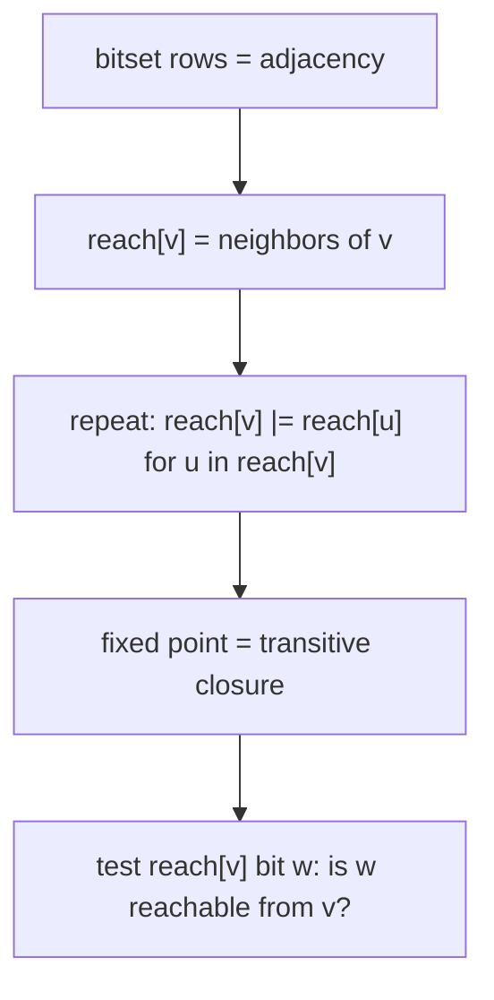

# Bit-Parallel Techniques (Word-Level Parallelism / Bitset Acceleration) — Middle Level

> **Focus:** the full bitset operation set on a multi-word `uint64[]`, the cross-word left shift that powers `B |= B << w`, boolean reachability / transitive closure by OR-ing rows, and bit-parallel substring search with **Shift-Or (Bitap)** — all unified by the rule *operate on whole words, get 64 lanes per instruction*.

---

## Table of Contents

1. [Introduction](#introduction)
2. [Deeper Concepts](#deeper-concepts)
3. [Comparison with Alternatives](#comparison-with-alternatives)
4. [Advanced Patterns](#advanced-patterns)
5. [Graph and Reachability Applications](#graph-and-reachability-applications)
6. [Bit-Parallel String Matching (Shift-Or)](#bit-parallel-string-matching-shift-or)
7. [Code Examples](#code-examples)
8. [Error Handling](#error-handling)
9. [Performance Analysis](#performance-analysis)
10. [Best Practices](#best-practices)
11. [Visual Animation](#visual-animation)
12. [Summary](#summary)

---

## Introduction

At junior level the message was a single line: `B |= B << w` computes subset-sum reachability with a 64× constant-factor win. At middle level you implement the bitset *properly* — as a multi-word `uint64[]` with correct cross-word shifting — and you learn that the *same* word-parallel idea is the engine behind three more classic speedups:

- The **full bitset API**: set/clear/test plus word-parallel `and`/`or`/`xor`/`not`, `count` (popcount), and `findFirstSet` (ctz).
- **Boolean reachability / transitive closure**: represent each adjacency row as a bitset and OR rows together — `O(V³/64)` instead of `O(V³)`.
- **Shift-Or / Bitap**: track *all* in-progress matches of a length-`≤ 64` pattern in one register, scanning text in `O(m)` with a tiny constant.
- The **cross-word shift** details that the junior level hid behind Python's big integers.

These are the questions that separate "I can write `B |= B << w` when the language gives me big integers" from "I can implement bit-parallel acceleration correctly in a fixed-width language and recognize when it applies."

---

## Deeper Concepts

### The bitset as a `uint64[]`

A bitset over `[0, T)` is an array of `⌈T/64⌉` words. The addressing is the same everywhere:

```
word(s)  = s >> 6      // s / 64
posn(s)  = s & 63      // s % 64
mask(s)  = 1 << posn(s)
```

The single-bit ops are `O(1)`; the *whole-bitset* ops are `O(T/64)`:

| Op | Per word | Meaning |
|----|----------|---------|
| `and(A,B)` | `C[i] = A[i] & B[i]` | set intersection |
| `or(A,B)`  | `C[i] = A[i] \| B[i]` | set union |
| `xor(A,B)` | `C[i] = A[i] ^ B[i]` | symmetric difference |
| `andNot(A,B)` | `C[i] = A[i] & ~B[i]` | set difference |
| `count(A)` | `Σ popcount(A[i])` | cardinality |
| `ffs(A)` | first nonzero word, then `ctz` | minimum element |

### The cross-word left shift (the heart of `B |= B << w`)

When `w` is not a multiple of 64, shifting the whole bitset left by `w` moves each word's high `bitShift` bits into the *next higher* word. Decompose `w`:

```
wordShift = w >> 6        // whole words to move up
bitShift  = w & 63        // bits within a word
```

The shifted value landing in output word `i` comes from source word `i - wordShift`, shifted left by `bitShift`, **plus** the top `bitShift` bits of word `i - wordShift - 1`:

```
out[i] = (src[i-wordShift] << bitShift)
       | (src[i-wordShift-1] >> (64 - bitShift))   // only if bitShift > 0
```

Two correctness rules:

1. **Direction.** For an *in-place* left shift you must iterate **high index → low index**, or you overwrite a source word before reading it.
2. **The `bitShift == 0` trap.** `x >> (64 - 0)` is `x >> 64`, which is undefined in Go/Java. Guard the carry term with `if bitShift > 0`.

Python sidesteps all of this: a Python `int` is an arbitrary-width bitset and `B |= B << w` carries across "words" automatically at C speed.

### Why `B |= B << w` is exactly subset-sum

Bit `s` set means "sum `s` reachable". `B << w` relabels bit `s` as bit `s + w` — i.e. "for every reachable `s`, the sum `s + w` (take this item) is also reachable". The OR unions "don't take it" (old `B`) with "take it" (`B << w`). One shift + one OR processes all `T/64` words, 64 candidate sums per instruction.

### popcount and ffs: counting and searching

`popcount` (hardware `POPCNT`) gives the number of reachable sums in `O(T/64)`. `findFirstSet`/ctz gives the smallest set bit: scan words for the first nonzero, then `ctz` that word. Skipping zero words makes ffs fast on sparse bitsets.

### A worked cross-word shift

Suppose `w = 70` (so `wordShift = 1`, `bitShift = 6`) and a bitset with `B[0]` having bit 60 set. Shifting left by 70 should land that bit at position `60 + 70 = 130`, i.e. word 2, bit 2:

```
out[2] = (B[1] << 6) | (B[0] >> 58)   # B[0] bit 60 -> (60-58)=2 of out[2]
```

The high `bitShift = 6` bits of `B[0]` (positions 58–63) carry into the low 6 bits of word 2. Bit 60 is among them, landing at out[2] bit `60 - (64 - 6) = 2`. This is exactly the carry term `B[src-1] >> (64 - bitShift)`. Trace through it once by hand and the formula stops being mysterious.

### Why the OR keeps both alternatives

In `B |= B << w`, the OR unions two sets: the *unshifted* `B` (sums reachable *without* the new item) and the *shifted* `B << w` (sums reachable *with* it). Neither is discarded, which is exactly the subset-sum recurrence "take it or leave it". If you wrote `B = B << w` (assignment, not OR-assign), you would *force* taking every item — a different and wrong computation. The `|=` is load-bearing.

---

## Comparison with Alternatives

### Bitset vs boolean array vs hash set

| Structure | Membership | AND/OR of two sets | Memory for `T` slots | Best when |
|-----------|-----------|---------------------|----------------------|-----------|
| `bool[]` | O(1) | O(T) | T bytes | tiny, readability over speed |
| **bitset `uint64[]`** | O(1) | **O(T/64)** | T/8 bytes | dense booleans, many set ops |
| hash set | O(1) avg | O(size) | ~size·constant | **sparse** sets, huge universe |

The bitset wins decisively when the universe `T` is moderate (fits in memory as `T/64` words) and the booleans are *dense* — exactly the subset-sum and reachability regimes. For sparse sets over a gigantic universe, a hash set's `O(size)` beats the bitset's `O(T/64)`.

### Subset-sum: bitset shift vs scalar DP

| Approach | Time | Notes |
|----------|------|-------|
| Recursive enumeration | O(2ⁿ) | hopeless beyond ~25 items |
| Scalar boolean DP | O(n·T) | the textbook table |
| **Bitset shift `B \|= B << w`** | **O(n·T/64)** | same class, 64× smaller constant |

Concrete (`n = 1000`, `T = 10^5`):

| Approach | Operations | Verdict |
|----------|-----------|---------|
| Scalar DP | 10⁸ bool writes | ~0.1–1 s |
| Bitset shift | 10⁸ / 64 ≈ 1.6·10⁶ word ops | a few ms |

### String search: Shift-Or vs KMP vs naive

| Algorithm | Preprocess | Search | Pattern length limit | Notes |
|-----------|-----------|--------|----------------------|-------|
| Naive | — | O(n·m) | none | slow on bad inputs |
| KMP | O(m) | O(n) | none | optimal asymptotically |
| **Shift-Or (Bitap)** | O(σ + m) | **O(n)** with tiny constant | **≤ word width** (64) per word | branch-free; extends to fuzzy match |

Shift-Or is not asymptotically better than KMP, but its inner loop is two or three branch-free word ops, so in practice it is extremely fast for short patterns and trivially extends to approximate matching (Shift-Add, Bitap with errors).

---

## Advanced Patterns

### Pattern: in-place cross-word `B |= B << w`

The production subset-sum core. Iterate high→low, carry across words, guard the `bitShift == 0` case. (Full code in [Code Examples](#code-examples).)

### Pattern: bounded subset-sum (cap the bitset width)

If only totals up to a cap `C` matter, size the bitset to `C+1` words and let bits beyond `C` fall off the end — they are answers you do not care about. This bounds memory and time to `O(n·C/64)` regardless of the raw item magnitudes.

### Pattern: "which items" reconstruction

Reachability tells you *that* a sum is achievable, not *which* items. Keep a per-item snapshot (or recompute): after the full bitset is built, walk items backward, and for target `t`, if `t - w` was reachable *before* item `w` was added, item `w` is part of a solution; recurse on `t - w`. This is `O(n)` extra per reconstruction.

### Pattern: word-parallel set algebra

Union, intersection, difference, and complement of dense sets are one loop of word ops each — the foundation for reachability closure and for filtering.



---

## Graph and Reachability Applications

### Boolean transitive closure by OR-ing rows

Represent the graph as `V` bitsets: `row[v]` has bit `u` set iff there is an edge `v → u`. Reachability closure (Warshall-style) becomes:

```
for k in 0..V-1:
    for i in 0..V-1:
        if row[i] has bit k set:
            row[i] |= row[k]      # one word-parallel OR over V/64 words
```

Each inner `row[i] |= row[k]` is `O(V/64)` instead of `O(V)`, so the whole closure is `O(V³/64)` instead of `O(V³)`. For `V` in the low thousands this is the difference between feasible and not. This is the canonical "boolean matrix multiply / reachability" bitset acceleration, and it composes with binary exponentiation if you need *exactly-`k`-step* reachability (square the boolean adjacency bitset).

### Reachability in exactly `k` steps

Boolean matrix power: `(A^k)[i][j] = 1` iff a length-`k` walk exists. Packing each row as a bitset makes each boolean multiply `O(V³/64)`; binary exponentiation gives `A^k` in `O(V³/64 · log k)`.

### Worked reachability example

Graph `0→1, 1→2, 2→0`. Rows as bitsets: `row[0]={1}`, `row[1]={2}`, `row[2]={0}`. After adding reflexivity and running the closure, `row[0]` becomes `{0,1,2}` — vertex 0 reaches all three (it is a cycle). Each absorb step `row[i] |= row[k]` is one word-parallel OR. For `V ≤ 64` the whole adjacency row is a single `uint64`, so the entire closure is a tight double loop of register ORs — extremely fast, the canonical demonstration of why dependency-graph reachability uses bitsets in compilers and build systems.

### Bitset Boolean multiply, explicitly

```
C[i] = OR over t of (A[i] has bit t set ? B[t] : 0)
```

i.e. output row `i` is the OR of the source rows `B[t]` for every `t` where `A[i]` has an edge. This is the row-bitset multiply; it composes with binary exponentiation (square the boolean adjacency) for exact-`k` reachability. The identity matrix is the reflexive bitset (`I[i]` = only bit `i`).

---

## Bit-Parallel String Matching (Shift-Or)

**Shift-Or** (a.k.a. **Bitap**) finds all occurrences of a pattern `P` of length `m ≤ 64` in a text `T`, scanning each text character with a couple of word operations. It is the cleanest illustration that an *automaton's whole state* can live in one register.

### The idea: state bits track in-progress matches

Encode a state word `R` where bit `j` is `0` iff the pattern prefix `P[0..j]` currently matches the text ending at the current position. (Shift-Or uses `0` = "matched" so a left shift naturally introduces a fresh `0` at the bottom.) Precompute, for each alphabet character `c`, a **mask** `mask[c]` whose bit `j` is `0` iff `P[j] == c`.

The per-character update is:

```
R = (R << 1) | mask[text[i]]
```

- `R << 1` advances every in-progress match by one position (and shifts a fresh `0` into bit 0, optimistically starting a new match).
- `| mask[c]` *invalidates* (sets to 1) every position `j` where `P[j] != c`.

A full match ending at position `i` is detected when bit `m-1` of `R` is `0`:

```
if (R & (1 << (m-1))) == 0:  report match ending at i
```

### Why it is correct (state automaton encoded in bits)

`R` is the bit-encoded state of the nondeterministic prefix automaton: bit `j` low ⇔ "the first `j+1` characters of `P` align with the text ending here". The shift moves the "how far have we matched" frontier forward by one; OR-ing the character mask kills alignments that the new character contradicts. Because all `m` prefix-states live in distinct bit lanes of one word, all transitions happen in a single `<<` and `|` — the entire automaton steps in `O(1)` word ops per text character.

### Initialization and conventions

Start `R = ~0` (all 1 = no match in progress). Build masks with `mask[c]` all-ones, then clear bit `j` for each `j` with `P[j] == c`. The "0 means matched" convention is what makes the optimistic `<<` introduce a starting `0`. (A dual "1 means matched" Shift-And formulation exists; pick one and be consistent.)

### Extensions

- **Patterns longer than 64**: use multiple words and carry the shift across them (like the subset-sum cross-word shift).
- **Approximate matching (Bitap with `k` errors)**: keep `k+1` state words `R₀..R_k`; `R_d` allows up to `d` edits, updated from `R_d`, `R_{d-1}` via shift/OR/AND. This is the basis of `agrep` and fuzzy search.

### Worked Shift-Or trace

For `P = "abab"`, `mask['a'] = …1010` (bits 0,2 cleared), `mask['b'] = …0101` (bits 1,3 cleared). Scanning `"ababcabab"` and watching the low 4 bits of `R`, a match is reported when bit 3 (= `m-1`) becomes 0. This happens at text index 3 (the substring starting at 0) and again at index 8 (starting at 5). Two matches, found with one shift + one OR + one test per character — the automaton stepping entirely inside one register.

---

## Code Examples

### Multi-word bitset with cross-word shift + subset-sum (counting semiring of booleans)

#### Go

```go
package main

import (
	"fmt"
	"math/bits"
)

type Bitset struct{ w []uint64 }

func NewBitset(nbits int) *Bitset { return &Bitset{w: make([]uint64, (nbits+63)>>6)} }
func (b *Bitset) Set(s int)       { b.w[s>>6] |= 1 << uint(s&63) }
func (b *Bitset) Test(s int) bool { return b.w[s>>6]>>uint(s&63)&1 == 1 }
func (b *Bitset) Count() int {
	c := 0
	for _, x := range b.w {
		c += bits.OnesCount64(x)
	}
	return c
}

// ShiftLeftOr performs b |= b << amt, carrying across words.
func (b *Bitset) ShiftLeftOr(amt int) {
	ws, bs := amt>>6, uint(amt&63)
	for i := len(b.w) - 1; i >= 0; i-- {
		var v uint64
		if src := i - ws; src >= 0 {
			v = b.w[src] << bs
			if bs > 0 && src-1 >= 0 {
				v |= b.w[src-1] >> (64 - bs)
			}
		}
		b.w[i] |= v
	}
}

func subsetSum(weights []int, cap int) *Bitset {
	b := NewBitset(cap + 1)
	b.Set(0)
	for _, w := range weights {
		b.ShiftLeftOr(w)
	}
	return b
}

func main() {
	b := subsetSum([]int{3, 1, 2, 64, 65}, 200)
	fmt.Println(b.Test(67), b.Test(200), b.Count()) // cross-word sums work
}
```

#### Java

```java
public class Bitset {
    final long[] w;
    Bitset(int nbits) { w = new long[(nbits + 63) >> 6]; }
    void set(int s)     { w[s >> 6] |= 1L << (s & 63); }
    boolean test(int s) { return ((w[s >> 6] >>> (s & 63)) & 1L) == 1L; }
    int count() { int c = 0; for (long x : w) c += Long.bitCount(x); return c; }

    void shiftLeftOr(int amt) {
        int ws = amt >> 6, bs = amt & 63;
        for (int i = w.length - 1; i >= 0; i--) {
            long v = 0L;
            int src = i - ws;
            if (src >= 0) {
                v = w[src] << bs;
                if (bs > 0 && src - 1 >= 0) v |= w[src - 1] >>> (64 - bs);
            }
            w[i] |= v;
        }
    }

    static Bitset subsetSum(int[] weights, int cap) {
        Bitset b = new Bitset(cap + 1);
        b.set(0);
        for (int x : weights) b.shiftLeftOr(x);
        return b;
    }

    public static void main(String[] args) {
        Bitset b = subsetSum(new int[]{3, 1, 2, 64, 65}, 200);
        System.out.println(b.test(67) + " " + b.test(200) + " " + b.count());
    }
}
```

#### Python

```python
def subset_sum(weights, cap=None):
    B = 1
    for w in weights:
        B |= B << w
    if cap is not None:
        B &= (1 << (cap + 1)) - 1  # drop sums beyond the cap
    return B


if __name__ == "__main__":
    B = subset_sum([3, 1, 2, 64, 65], cap=200)
    print((B >> 67) & 1, (B >> 200) & 1, bin(B).count("1"))
```

### Shift-Or (Bitap) exact substring search

#### Go

```go
package main

import "fmt"

// shiftOr returns starting indices of all matches of pat (len <= 64) in text.
func shiftOr(text, pat string) []int {
	m := len(pat)
	var mask [256]uint64
	for i := range mask {
		mask[i] = ^uint64(0)
	}
	for j := 0; j < m; j++ {
		mask[pat[j]] &^= 1 << uint(j) // clear bit j (0 = matches)
	}
	var R uint64 = ^uint64(0)
	matchBit := uint64(1) << uint(m-1)
	var res []int
	for i := 0; i < len(text); i++ {
		R = (R << 1) | mask[text[i]]
		if R&matchBit == 0 {
			res = append(res, i-m+1)
		}
	}
	return res
}

func main() {
	fmt.Println(shiftOr("ababcabab", "abab")) // [0 5]
}
```

#### Java

```java
import java.util.*;

public class ShiftOr {
    static List<Integer> search(String text, String pat) {
        int m = pat.length();
        long[] mask = new long[256];
        Arrays.fill(mask, ~0L);
        for (int j = 0; j < m; j++)
            mask[pat.charAt(j)] &= ~(1L << j);   // 0 = matches
        long R = ~0L, matchBit = 1L << (m - 1);
        List<Integer> res = new ArrayList<>();
        for (int i = 0; i < text.length(); i++) {
            R = (R << 1) | mask[text.charAt(i)];
            if ((R & matchBit) == 0) res.add(i - m + 1);
        }
        return res;
    }

    public static void main(String[] args) {
        System.out.println(search("ababcabab", "abab")); // [0, 5]
    }
}
```

#### Python

```python
def shift_or(text, pat):
    m = len(pat)
    mask = [~0] * 256
    for j, ch in enumerate(pat):
        mask[ord(ch)] &= ~(1 << j)        # 0 = matches
    R = ~0
    match_bit = 1 << (m - 1)
    full = (1 << 64) - 1                  # keep R in 64 bits like Go/Java
    res = []
    for i, ch in enumerate(text):
        R = ((R << 1) | mask[ord(ch)]) & full
        if R & match_bit == 0:
            res.append(i - m + 1)
    return res


if __name__ == "__main__":
    print(shift_or("ababcabab", "abab"))  # [0, 5]
```

---

## Error Handling

| Scenario | What goes wrong | Correct approach |
|----------|-----------------|------------------|
| `bitShift == 0` carry | `x >> (64 - 0)` is `>> 64`, undefined. | Guard the carry term with `if bitShift > 0`. |
| Wrong shift direction | In-place left shift low→high overwrites unread source words. | Iterate high→low for left shift. |
| Pattern longer than word | Shift-Or with `m > 64` silently drops the high bits. | Multi-word Shift-Or, or use KMP for long patterns. |
| Java arithmetic shift | `>>` on `long` leaks the sign bit. | Use `>>>` (logical) for unsigned moves. |
| Python R grows unbounded | Without masking, `R << 1` keeps widening the int. | AND with `(1<<64)-1` each step to emulate fixed width. |
| Bitset undersized | Sums beyond the array vanish. | Size to `sum(weights)` or the cap. |
| Wrong match convention | Mixing "0 = match" and "1 = match" Shift-Or/Shift-And. | Pick one convention; build masks accordingly. |

---

## Performance Analysis

| Workload | Scalar | Bitset (`/64`) | Speedup |
|----------|--------|----------------|---------|
| Subset-sum, `n=10³`, `T=10⁵` | 10⁸ writes | ~1.6·10⁶ word ops | ~64× |
| Transitive closure, `V=2000` | 8·10⁹ | 1.25·10⁸ word ops | ~64× |
| Shift-Or, text `10⁷`, `m≤64` | n/a | ~2·10⁷ word ops | branch-free, cache-friendly |

The dominant cost is the number of *word* operations, `T/64` per pass. The single biggest practical levers:

- **Skip empty words** in `ffs`/scan loops.
- **Native popcount/ctz** instead of bit-by-bit counting.
- **Flat contiguous word array** for cache locality (8× density vs `bool[]`).
- **In Python, use native big-int shifts** — they run in C and dwarf any hand-rolled word loop.
- **Skip zero words** in the cross-word shift and in ffs scans; a long run of zero words costs nothing if you detect and jump over it.
- **Cap the universe** to the largest target you care about; an un-capped subset-sum bitset can grow to `sum(weights)` bits and blow the cache.

```python
import time

def bench(n, t):
    import random
    weights = [random.randint(1, t // n) for _ in range(n)]
    start = time.perf_counter()
    B = 1
    for w in weights:
        B |= B << w
    return time.perf_counter() - start, bin(B).count("1")

# Typical: n=1000, t=10**5 -> a few ms in CPython, since << and | are C-level.
```

---

## Best Practices

- **Implement the cross-word shift once, test it hard:** it is the single most bug-prone routine. Compare against the scalar oracle on random inputs.
- **Choose a fixed match convention** (0=match for Shift-Or) and document it.
- **Size bitsets to the real maximum** (`sum(weights)` or a cap); never guess.
- **Use logical shifts** (`>>>` in Java; unsigned in Go) to avoid sign-bit leaks.
- **Prefer the language's native bitset** when available: Python `int`, Java `BitSet`, C++ `std::bitset`/`dynamic_bitset` — only hand-roll `uint64[]` when you need explicit control or shift-OR.
- **Validate against the scalar DP / KMP** on small inputs before trusting any bit-parallel routine.

---

## Visual Animation

> See [`animation.html`](./animation.html) for an interactive view.
>
> The middle-level animation highlights:
> - The reachable-sums bit array as a row of cells, lit iff the sum is reachable.
> - Each item performing `B |= B << w`: the shifted copy slides up by `w`, newly-set bits flash green, then OR-merge.
> - A live popcount (count of reachable totals) and an editable item list.

---

## Summary

### Mini-recap of the three accelerations

- **Subset-sum:** `B |= B << w` per item, `O(n·T/64)` — the shift adds `w` to all reachable sums.
- **Reachability:** OR adjacency-row bitsets, `O(V³/64)` — absorb a target's reachable set with one word-parallel OR.
- **Shift-Or:** `R = (R << 1) | mask[c]` per text char, `O(n)` — the whole prefix automaton steps in one register.

All three are the same idea (operate on whole words) on three different boolean structures.

A bitset is an array of 64-bit words; whole-bitset boolean ops (`and`/`or`/`xor`/`andNot`, `count`, `ffs`) run in `O(T/64)`, giving the flat **64× win**. The implementation crux is the **cross-word left shift** behind `B |= B << w`: split `w` into `wordShift` and `bitShift`, iterate high→low in place, carry the top `bitShift` bits into the next word, and guard the `bitShift == 0` case. The same word-parallel principle powers **boolean transitive closure** (OR adjacency-row bitsets, `O(V³/64)`) and **Shift-Or / Bitap** substring search, where the entire prefix automaton lives in one register and steps with a single `(R << 1) | mask[c]`. None of these change the asymptotic class — they multiply throughput by the word width. Master the multi-word bitset, the cross-word shift, and the Shift-Or state encoding, and one small toolkit accelerates subset-sum, reachability, and string matching alike.
