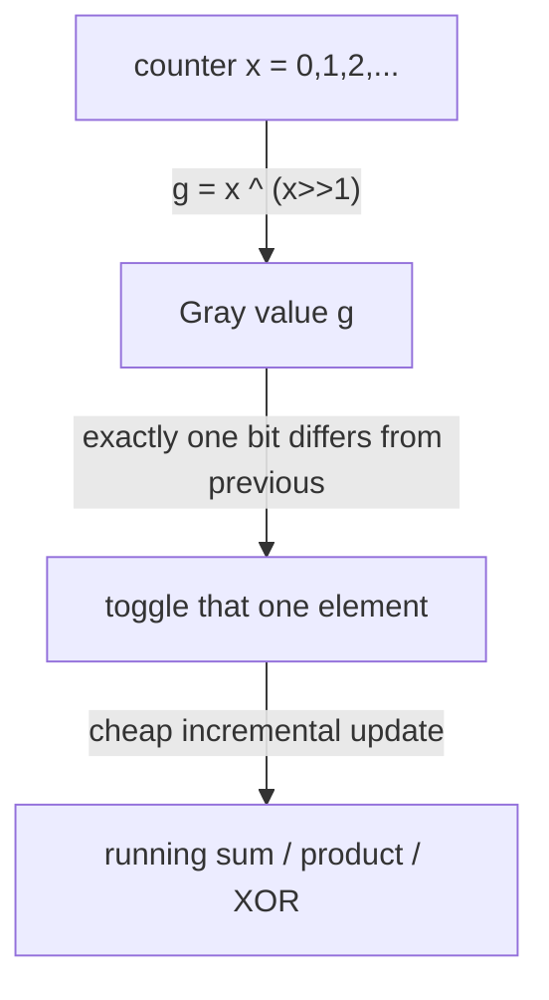

# Gosper's Hack & Gray Code — Junior Level

> **One-line summary:** **Gray code** lists all `2^n` bit patterns so that each one differs from the previous by exactly **one** flipped bit (`g = x ^ (x >> 1)`). **Gosper's hack** walks through every bitmask with exactly `k` ones in increasing numeric order, jumping from one `k`-subset to the next-larger one with a tiny constant-time formula. Both are classic combinatorial *bit-iteration* techniques.

---

## Table of Contents

1. [Introduction](#introduction)
2. [Prerequisites](#prerequisites)
3. [Glossary](#glossary)
4. [Core Concepts](#core-concepts)
5. [Big-O Summary](#big-o-summary)
6. [Real-World Analogies](#real-world-analogies)
7. [Pros & Cons](#pros--cons)
8. [Step-by-Step Walkthrough](#step-by-step-walkthrough)
9. [Code Examples](#code-examples)
10. [Coding Patterns](#coding-patterns)
11. [Error Handling](#error-handling)
12. [Performance Tips](#performance-tips)
13. [Best Practices](#best-practices)
14. [Edge Cases & Pitfalls](#edge-cases--pitfalls)
15. [Common Mistakes](#common-mistakes)
16. [Cheat Sheet](#cheat-sheet)
17. [Visual Animation](#visual-animation)
18. [Summary](#summary)
19. [Further Reading](#further-reading)

---

## Introduction

A **bitmask** is just an integer whose binary bits stand for the members of a set: if bit `i` is `1`, element `i` is "in"; if `0`, it is "out". Two classic problems come up over and over:

1. *"Walk through **all** `2^n` subsets, but change only **one** element at a time."* — solved by **Gray code**.
2. *"Walk through only the subsets that have **exactly `k`** elements, in increasing numeric order."* — solved by **Gosper's hack**.

We introduce Gray code first because it is the gentler of the two. A **Gray code** is an ordering of the numbers `0, 1, …, 2^n − 1` such that consecutive numbers differ in exactly one bit. The standard one — the *reflected binary Gray code* — has a one-line formula:

> **`gray(x) = x ^ (x >> 1)`**

That single XOR converts an ordinary counter `x` into its Gray-code value, and the resulting sequence flips just one bit per step. The inverse (recovering `x` from a Gray value) is a short *prefix-XOR* loop.

**Gosper's hack** answers the second question. Given a bitmask `x` with exactly `k` bits set, this four-line spell produces the **next-larger** integer that also has exactly `k` bits set:

```
c = x & -x;                 // lowest set bit
r = x + c;                  // ripple-carry that move
x = (((r ^ x) >> 2) / c) | r;   // the new, smaller bits, repacked
```

Start at `(1 << k) - 1` (the `k` lowest bits set, the smallest `k`-subset) and keep applying the hack until the mask grows past `1 << n`. That enumerates every `k`-subset of an `n`-element set in `O(C(n, k))` time — perfect for brute force or dynamic programming over fixed-size subsets.

Both techniques are pure bit tricks: no arrays, no recursion, just a handful of `&`, `|`, `^`, `+`, `>>` operations. This file builds them up gently, with worked traces. The deeper proofs (why the Gosper formula gives the *smallest* next combination, why each Gray step flips exactly one bit) live in [`professional.md`](./professional.md); the engineering concerns (overflow at the top of the range, hardware encoders) live in [`senior.md`](./senior.md).

---

## Prerequisites

Before reading this file you should be comfortable with:

- **Binary representation** — how an integer is a sum of powers of two, and how to read its bits.
- **Bitwise operators** — `&` (AND), `|` (OR), `^` (XOR), `~` (NOT), `<<` and `>>` (shifts). Sibling topics `01-bit-basics` and `02-bit-tricks` cover these.
- **The lowest-set-bit trick** — `x & -x` isolates the least significant `1` bit. (Covered in `02-bit-tricks`.)
- **Popcount** — counting how many bits are set in an integer (the "population count").
- **Big-O notation** — `O(2^n)`, `O(C(n, k))`, `O(1)` per step.
- **Subsets as bitmasks** — the idea that an `n`-bit integer encodes a subset of `{0, 1, …, n−1}`.

Optional but helpful:

- A glance at **two's complement**, since `x & -x` relies on how negatives are stored.
- Familiarity with **combinations** `C(n, k)` ("n choose k") — Gosper's hack enumerates exactly that many masks.

---

## Glossary

| Term | Meaning |
|------|---------|
| **Bitmask** | An integer whose binary `1` bits select members of a set. Bit `i` set ⇒ element `i` chosen. |
| **Popcount** | The number of `1` bits in an integer (its Hamming weight). |
| **Hamming distance** | The number of bit positions in which two integers differ. Gray code keeps this at `1` between neighbors. |
| **Gray code** | An ordering of all `2^n` values where consecutive values differ in exactly one bit. |
| **Reflected binary Gray code** | The standard Gray code, defined by `g = x ^ (x >> 1)`; built by "reflecting" the `(n−1)`-bit sequence. |
| **`k`-subset / `k`-combination** | A subset with exactly `k` elements; as a bitmask, an integer with exactly `k` bits set. |
| **Gosper's hack** | The `O(1)` formula that turns a `k`-bit mask into the next-larger `k`-bit mask. |
| **Lowest set bit** | `x & -x`: the value of the least significant `1` bit of `x` (e.g. `12 & -12 = 4`). |
| **Ripple carry** | Adding `x + c` where `c` is the lowest set bit causes a chain of carries that "promotes" a block of low ones. |
| **`x ^ (x >> 1)`** | The binary-to-Gray conversion: XOR a number with itself shifted right by one. |

---

## Core Concepts

### 1. Subsets as Bitmasks

An integer's bits *are* a subset. For `n = 3`, the value `0b101 = 5` means "elements 0 and 2 are in, element 1 is out". The `2^3 = 8` integers `0..7` enumerate every subset of a 3-element set. This is the universal language both techniques speak.

```
binary   subset
000      {}
001      {0}
010      {1}
011      {0,1}
100      {2}
101      {0,2}
110      {1,2}
111      {0,1,2}
```

### 2. Gray Code: One Bit Changes at a Time

Counting `0,1,2,3,…` in plain binary often flips many bits at once: `0111 → 1000` flips **four** bits. A **Gray code** reorders the same `2^n` values so that going from one to the next flips exactly **one** bit. The reflected binary Gray code for `n = 3`:

```
index  binary  gray    bit that flipped
0      000     000     (start)
1      001     001     bit 0
2      010     011     bit 1
3      011     010     bit 0
4      100     110     bit 2
5      101     111     bit 0
6      110     101     bit 1
7      111     100     bit 0
```

Read the `gray` column top to bottom: every adjacent pair differs in exactly one position. The conversion is a single XOR:

> **`gray(x) = x ^ (x >> 1)`**

For example `gray(6) = 6 ^ 3 = 0b110 ^ 0b011 = 0b101 = 5`. Why this works — and why the result always flips one bit per step — is proved in [`professional.md`](./professional.md). For now, treat the formula as a reliable black box.

### 3. Recovering `x` from a Gray Value (the Inverse)

Going the other way (Gray → binary) is a **prefix-XOR**: each output bit is the XOR of all Gray bits from the top down to that position.

```
x = 0
while g > 0:
    x ^= g
    g >>= 1
```

So `inverse_gray(5) = 5 ^ 2 ^ 1 = 0b101 ^ 0b010 ^ 0b001 = 0b110 = 6`, undoing the example above.

### 4. `k`-Subsets and Why Order Matters

A `k`-subset is a bitmask with exactly `k` ones. We want them in **increasing numeric order**. The smallest is "the `k` lowest bits all set":

```
start = (1 << k) - 1
```

For `n = 5, k = 3` that is `0b00111 = 7`. The next-larger 3-bit masks are `0b01011 = 11`, `0b01101 = 13`, `0b01110 = 14`, `0b10011 = 19`, … We need a way to jump from one to the next in `O(1)`.

### 5. Gosper's Hack: The Smallest Next Combination

Given `x` with `k` bits set, the next-larger value with `k` bits set is:

```
c = x & -x;                     // lowest set bit of x
r = x + c;                      // add it: ripples the lowest block up by one
x = (((r ^ x) >> 2) / c) | r;   // re-pack the freed low bits as far right as possible
```

The idea in plain words: find the lowest block of consecutive `1`s, push its top bit up by one position (that is `r = x + c`), and then slide all the *other* bits of that block down to the far right so the result is as small as possible. The repacking term `(((r ^ x) >> 2) / c)` is exactly the arithmetic that does that sliding. A full worked trace is in [the walkthrough](#step-by-step-walkthrough) and the formal proof is in [`professional.md`](./professional.md).

### 6. The Stop Condition

Keep iterating while the mask still fits in `n` bits:

```
x = (1 << k) - 1
while x < (1 << n):
    use(x)
    if x == 0: break          // guard for k == 0
    c = x & -x
    r = x + c
    x = (((r ^ x) >> 2) / c) | r
```

Once `x` reaches or exceeds `1 << n`, the high bit has spilled past element `n−1`, meaning we have produced all `C(n, k)` combinations.

---

## Big-O Summary

| Operation | Time | Space | Notes |
|-----------|------|-------|-------|
| `gray(x) = x ^ (x >> 1)` | **O(1)** | O(1) | One shift, one XOR. |
| `inverse_gray(g)` (prefix-XOR loop) | O(n) | O(1) | `n` = number of bits; or O(log n) with a doubling trick. |
| Generate full `n`-bit Gray sequence | O(2^n) | O(1) extra | One value per step, `2^n` steps. |
| One Gosper step (next `k`-subset) | **O(1)** | O(1) | A handful of arithmetic/bit ops. |
| Enumerate all `k`-subsets via Gosper | **O(C(n, k))** | O(1) extra | One mask emitted per step. |
| Enumerate all subsets (any size) | O(2^n) | O(1) extra | Plain counter or Gray code. |

The headline numbers: **`O(1)` per step** for both the Gray conversion and one Gosper jump, so generating a whole sequence costs exactly "number of items produced" — `O(2^n)` for all subsets, `O(C(n, k))` for the `k`-subsets. There is no wasted work.

---

## Real-World Analogies

| Concept | Analogy |
|---------|---------|
| Gray code | A **rotary dial / odometer designed to never misread**: physical rotary encoders use Gray code so that as the dial turns, only one track changes at a time, avoiding glitches where several bits flip "simultaneously" and a sensor catches a wrong intermediate value. |
| One-bit-change property | Walking a **hypercube** by moving along one edge at a time — each step changes a single coordinate. |
| `(1 << k) - 1` start | The **leftmost seats taken**: imagine `k` people sitting in the `k` lowest-numbered seats of a row; the smallest seating arrangement. |
| One Gosper step | **Sliding people to the next lawful seating**: the lowest cluster's front person steps up one seat, and everyone behind them slides to the very front — the next arrangement in lexicographic order. |
| Enumerating `k`-subsets | Dealing out **every possible hand of `k` cards** from `n` cards, in a fixed predictable order. |
| Inverse Gray (prefix-XOR) | **Undoing the encoder reading** to learn the true position the dial is at. |

Where the analogies break: a real odometer wraps around (cyclic), and the *reflected* Gray code is indeed a cycle (the last value differs from the first by one bit too); the seating analogy ignores that Gosper works on a fixed universe of `n` "seats" and stops when the cluster spills past seat `n−1`.

---

## Pros & Cons

| Pros | Cons |
|------|------|
| Both run in `O(1)` per step — no wasted work, output-sized total cost. | Tied to integer word size: only works while `n ≤ 63` (for 64-bit), else needs big integers. |
| No recursion, no auxiliary arrays — tiny, cache-friendly, allocation-free. | The Gosper formula is opaque; easy to mis-transcribe a shift or sign. |
| Gosper emits `k`-subsets in **sorted numeric order** for free. | Gosper's division `/c` must be an *integer* divide of an exact multiple; using float division silently corrupts it. |
| Gray code gives a "one change at a time" order ideal for hardware and incremental DP. | Gray code's one-bit-change order is *not* numeric order — you must convert if you need the integer. |
| Both are language-agnostic: the same operators exist in Go, Java, Python, C. | High-end overflow: `x + c` can wrap if `x` already uses the top bit; needs a sentinel or wider type. |

**When to use Gosper:** iterating over all fixed-size subsets for brute force / bitmask DP (e.g. "try every team of `k` players", "every `k`-element committee"), especially when you want them sorted.

**When to use Gray code:** rotary/optical encoders, minimizing the number of toggles between consecutive states (low-power hardware, test vectors), Karnaugh-map layouts, and any enumeration where changing one element at a time lets you *update* a running computation instead of recomputing it from scratch.

---

## Step-by-Step Walkthrough

### Walkthrough A — Gosper's hack on `n = 5, k = 3`

We start at the smallest 3-bit mask and apply the hack three times. We use 5-bit binary.

**Start:** `x = (1 << 3) - 1 = 0b00111 = 7`. Subset `{0,1,2}`.

**Step 1 — compute the next mask:**

```
x = 0b00111 = 7
c = x & -x  = 0b00001 = 1        // lowest set bit
r = x + c   = 0b01000 = 8        // 00111 + 00001 = 01000 (carry rippled the block of three 1s)
r ^ x       = 0b01111 = 15       // bits that changed between x and r
(r ^ x) >> 2 = 0b00011 = 3       // drop two low bits
/ c          = 3 / 1 = 3 = 0b00011  // divide by lowest bit (here c = 1, so unchanged)
| r          = 0b01000 | 0b00011 = 0b01011 = 11
```

So the next mask is `0b01011 = 11`, subset `{0,1,3}`. Notice the top of the block moved from position 2 to position 3, and the other two ones slid down to positions 0 and 1.

**Step 2 — from `x = 0b01011 = 11`:**

```
c = x & -x  = 0b00001 = 1
r = x + c   = 0b01100 = 12       // 01011 + 1 = 01100
r ^ x       = 0b00111 = 7
(r ^ x)>>2  = 0b00001 = 1
/ c         = 1 / 1 = 1
| r         = 0b01100 | 0b00001 = 0b01101 = 13
```

Next mask `0b01101 = 13`, subset `{0,2,3}`.

**Step 3 — from `x = 0b01101 = 13`:**

```
c = x & -x  = 0b00001 = 1
r = x + c   = 0b01110 = 14
r ^ x       = 0b00011 = 3
(r ^ x)>>2  = 0b00000 = 0
/ c         = 0 / 1 = 0
| r         = 0b01110 | 0 = 0b01110 = 14
```

Next mask `0b01110 = 14`, subset `{1,2,3}`.

The full ordered list of 3-subsets of `{0,1,2,3,4}` produced this way is: `7, 11, 13, 14, 19, 21, 22, 25, 26, 28` (that is `C(5,3) = 10` masks), and the loop stops when the mask would reach or exceed `1 << 5 = 32`.

### Walkthrough B — Gray code for `n = 3`

Apply `g = x ^ (x >> 1)` to each `x`:

```
x=0: 000 ^ 000 = 000
x=1: 001 ^ 000 = 001    (flipped bit 0 vs previous 000)
x=2: 010 ^ 001 = 011    (flipped bit 1)
x=3: 011 ^ 001 = 010    (flipped bit 0)
x=4: 100 ^ 010 = 110    (flipped bit 2)
x=5: 101 ^ 010 = 111    (flipped bit 0)
x=6: 110 ^ 011 = 101    (flipped bit 1)
x=7: 111 ^ 011 = 100    (flipped bit 0)
```

Every consecutive pair differs in exactly one bit — verify by eye. And the cycle closes: `100` (last) vs `000` (first) also differ in one bit, so the reflected Gray code is a *Hamiltonian cycle* on the cube (see [`professional.md`](./professional.md)).

---

## Code Examples

### Example: Enumerate all `k`-subsets (Gosper) and print the Gray sequence

#### Go

```go
package main

import "fmt"

// nextCombination returns the next-larger integer with the same popcount.
func nextCombination(x uint64) uint64 {
	c := x & (-x)                  // lowest set bit
	r := x + c                     // ripple-carry the block
	return (((r ^ x) >> 2) / c) | r
}

// gosper iterates over every k-subset of {0..n-1} in increasing order.
func gosper(n, k int) {
	if k == 0 {
		fmt.Println("0 (empty subset)")
		return
	}
	x := uint64((1 << uint(k)) - 1) // smallest k-subset
	limit := uint64(1) << uint(n)
	for x < limit {
		fmt.Printf("%0*b\n", n, x)
		x = nextCombination(x)
	}
}

// gray converts an ordinary counter value into its reflected Gray code.
func gray(x uint64) uint64 { return x ^ (x >> 1) }

// inverseGray recovers x from its Gray code via prefix XOR.
func inverseGray(g uint64) uint64 {
	x := uint64(0)
	for g > 0 {
		x ^= g
		g >>= 1
	}
	return x
}

func main() {
	fmt.Println("3-subsets of {0..4}:")
	gosper(5, 3)
	fmt.Println("3-bit Gray sequence:")
	for x := uint64(0); x < 8; x++ {
		fmt.Printf("%03b -> %03b\n", x, gray(x))
	}
	fmt.Println("inverseGray(5) =", inverseGray(5)) // 6
}
```

#### Java

```java
public class GosperGray {

    // Next-larger integer with the same number of set bits.
    static long nextCombination(long x) {
        long c = x & (-x);                 // lowest set bit
        long r = x + c;                    // ripple-carry the block
        return (((r ^ x) >> 2) / c) | r;
    }

    // Iterate every k-subset of {0..n-1} in increasing order.
    static void gosper(int n, int k) {
        if (k == 0) { System.out.println("0 (empty subset)"); return; }
        long x = (1L << k) - 1;            // smallest k-subset
        long limit = 1L << n;
        while (x < limit) {
            System.out.println(toBin(x, n));
            x = nextCombination(x);
        }
    }

    static long gray(long x) { return x ^ (x >> 1); }

    static long inverseGray(long g) {
        long x = 0;
        for (; g > 0; g >>= 1) x ^= g;
        return x;
    }

    static String toBin(long x, int n) {
        StringBuilder sb = new StringBuilder();
        for (int i = n - 1; i >= 0; i--) sb.append((x >> i) & 1);
        return sb.toString();
    }

    public static void main(String[] args) {
        System.out.println("3-subsets of {0..4}:");
        gosper(5, 3);
        System.out.println("3-bit Gray sequence:");
        for (long x = 0; x < 8; x++)
            System.out.println(toBin(x, 3) + " -> " + toBin(gray(x), 3));
        System.out.println("inverseGray(5) = " + inverseGray(5)); // 6
    }
}
```

#### Python

```python
def next_combination(x: int) -> int:
    """Next-larger integer with the same popcount (Gosper's hack)."""
    c = x & (-x)                 # lowest set bit
    r = x + c                    # ripple-carry the block
    return (((r ^ x) >> 2) // c) | r   # NOTE integer division //


def gosper(n: int, k: int):
    """Yield every k-subset of {0..n-1} as a bitmask, increasing order."""
    if k == 0:
        yield 0
        return
    x = (1 << k) - 1             # smallest k-subset
    limit = 1 << n
    while x < limit:
        yield x
        x = next_combination(x)


def gray(x: int) -> int:
    return x ^ (x >> 1)


def inverse_gray(g: int) -> int:
    x = 0
    while g:
        x ^= g
        g >>= 1
    return x


if __name__ == "__main__":
    print("3-subsets of {0..4}:")
    for m in gosper(5, 3):
        print(format(m, "05b"))
    print("3-bit Gray sequence:")
    for x in range(8):
        print(format(x, "03b"), "->", format(gray(x), "03b"))
    print("inverse_gray(5) =", inverse_gray(5))  # 6
```

**What it does:** lists all ten 3-subsets of a 5-element set in sorted order, prints the 3-bit Gray code, and inverts one Gray value.
**Run:** `go run main.go` | `javac GosperGray.java && java GosperGray` | `python gg.py`

---

## Coding Patterns

### Pattern 1: Brute-force `k`-subset loop (the oracle you test against)

**Intent:** Before trusting Gosper's hack, generate `k`-subsets the obvious slow way and confirm they match.

```python
from itertools import combinations

def k_subsets_bruteforce(n, k):
    masks = []
    for combo in combinations(range(n), k):
        m = 0
        for b in combo:
            m |= (1 << b)
        masks.append(m)
    return sorted(masks)   # itertools already yields lexicographic order
```

Gosper's output must equal this list. It is the perfect correctness check on small `n`.

### Pattern 2: Bitmask DP over fixed-size subsets

**Intent:** Many DP problems iterate over subsets of a given size (e.g. "choose exactly `k` items"). Gosper feeds them in order:

```python
for mask in gosper(n, k):
    process(mask)   # e.g. relax a DP state indexed by mask
```

### Pattern 3: Incremental update using Gray code

**Intent:** Because Gray code flips one bit per step, you can *add or remove a single element* and update a running aggregate instead of recomputing it.



---

## Error Handling

| Error | Cause | Fix |
|-------|-------|-----|
| Wrong masks from Gosper | Used float division `/` instead of integer division. | In Python use `//`; in Go/Java integer `/` on integer types is already integer division. |
| Infinite loop / never stops | Forgot the `x < (1 << n)` stop condition. | Always bound by `1 << n`. |
| Crash / division by zero | Called the hack with `x = 0` (`k = 0` case, `c = 0`). | Special-case `k = 0` (the only subset is the empty mask). |
| Overflow at the top of the range | `x + c` overflowed the integer type at the high end. | Use an unsigned/64-bit type and `n ≤ 63`, or a sentinel; see `senior.md`. |
| Gray sequence "out of order" | Expected numeric order from Gray code. | Gray code is one-bit-change order, not numeric; convert with the inverse if you need the integer. |
| Negative shift / sign issues | Used a signed shift on a value with the top bit set. | Prefer unsigned types (`uint64` in Go, `>>>` in Java for logical shift). |

---

## Performance Tips

- **Avoid floating point in Gosper.** The `/c` step is an *exact* integer division — `(r ^ x) >> 2` is always a multiple of `c`. Float division introduces rounding and breaks it. Use `//` in Python, integer types in Go/Java.
- **Use `x & -x` for the lowest set bit** — it is a single subtraction and AND, far faster than a loop.
- **Prefer the closed-form Gray conversion** `x ^ (x >> 1)` over building the sequence recursively; it is `O(1)` and branch-free.
- **Stream, don't store.** Both techniques emit one value per step; process each as it comes instead of materializing the whole `C(n,k)` or `2^n` list.
- **Pick the smallest universe `n`.** Cost scales with the number of items produced, so do not pad the mask with unused high bits.

---

## Best Practices

- Always test Gosper against the `itertools.combinations` oracle (Pattern 1) on small `n, k` before trusting it on large inputs.
- Keep `n` and `k` as named parameters; never hard-code mask widths.
- Use **unsigned** integer types for masks so shifts and `x & -x` behave as expected.
- Document the start value `(1 << k) - 1` and the stop value `1 << n` as comments — they are easy to mix up.
- For Gray code, decide up front whether you need the *Gray order* (one-bit-change) or the *numeric value*, and convert explicitly when crossing between them.
- Wrap each technique in a small, separately testable function (`next_combination`, `gray`, `inverse_gray`).

---

## Edge Cases & Pitfalls

- **`k = 0`** — the only 0-subset is the empty mask `0`. Do not call the hack (it divides by `c = 0`); emit `0` and stop.
- **`k = n`** — there is exactly one subset (all bits set, `(1 << n) - 1`); the loop runs once.
- **`k > n`** — no valid subsets; the loop body should never run (`(1 << k) - 1 ≥ 1 << n`).
- **`n = 0`** — empty universe; the only subset is the empty one.
- **Top-of-range overflow** — when the highest mask is near the word's top bit, `x + c` can wrap. Keep `n ≤ 63` for `uint64`, or use a sentinel/bigint (see `senior.md`).
- **Signed shifts** — `x >> 1` on a negative signed integer is arithmetic (sign-extending); use unsigned types or logical shift (`>>>` in Java) for masks.
- **Gray ≠ numeric order** — `gray(x)` produces a *permutation* of `0..2^n−1`, not the sorted sequence; the values appear in one-bit-change order.

---

## Common Mistakes

1. **Float division in Gosper** — `(((r ^ x) >> 2) / c)` in Python uses true division and yields a float, corrupting the mask. Use `//`.
2. **Forgetting the `k = 0` guard** — `x & -x` is `0`, and dividing by `0` crashes.
3. **Wrong start value** — starting at `0` or `1` instead of `(1 << k) - 1` skips or breaks combinations.
4. **Wrong stop condition** — comparing against `1 << k` or `n` instead of `1 << n` ends early or loops forever.
5. **Assuming Gray code is sorted** — it is one-bit-change order; the integers are permuted, not ascending.
6. **Using signed shifts on top-bit-set masks** — arithmetic shift sign-extends and produces garbage; use unsigned.
7. **Mixing up `gray` and `inverse_gray`** — encoding then "encoding again" does not recover the original; the inverse is the prefix-XOR loop.

---

## Cheat Sheet

| Goal | Formula / Snippet |
|------|-------------------|
| Binary → Gray | `g = x ^ (x >> 1)` |
| Gray → Binary | `x=0; while g: x^=g; g>>=1` (prefix XOR) |
| Lowest set bit | `c = x & -x` |
| Next `k`-subset | `c=x&-x; r=x+c; x=(((r^x)>>2)/c)|r` |
| Smallest `k`-subset (start) | `(1 << k) - 1` |
| Stop condition | `x < (1 << n)` |
| All subsets, one-bit-change | iterate `gray(0), gray(1), …, gray(2^n−1)` |
| Count of `k`-subsets emitted | `C(n, k)` |

Core Gosper loop:

```
x = (1 << k) - 1            # smallest k-subset
while x < (1 << n):         # stop when it spills past n bits
    use(x)
    if x == 0: break        # k == 0 guard
    c = x & -x              # lowest set bit
    r = x + c               # ripple the block up
    x = (((r ^ x) >> 2) / c) | r   # repack (integer divide!)
# cost: O(1) per step, O(C(n,k)) total
```

---

## Visual Animation

> See [`animation.html`](./animation.html) for an interactive visualization.
>
> The animation demonstrates:
> - **Mode 1 (Gosper):** stepping through the `k`-subset bitmasks, showing the intermediate `c = x & -x`, `r = x + c`, and the repacked result mask, with the changed bits highlighted.
> - **Mode 2 (Gray code):** the `n`-bit Gray sequence with exactly one bit flipping (highlighted) between consecutive values.
> - Play / Pause / Step controls and adjustable `n` and `k`.

---

## Summary

Two bit-iteration techniques solve two everyday enumeration problems. **Gray code** orders all `2^n` values so each differs from the previous in exactly one bit; the conversion is a single XOR `g = x ^ (x >> 1)`, and the inverse is a short prefix-XOR loop. It powers rotary encoders and any "change one element at a time" enumeration. **Gosper's hack** jumps from one `k`-bit mask to the next-larger one in `O(1)` using `c = x & -x; r = x + c; x = (((r ^ x) >> 2) / c) | r`, starting at `(1 << k) - 1` and stopping at `1 << n`; it enumerates all `C(n, k)` fixed-size subsets in sorted order with no recursion or arrays. Remember the two big gotchas: Gosper needs **integer** division (and a `k = 0` guard), and Gray code is **one-bit-change order, not numeric order**. Master these short formulas and you can iterate combinations and minimal-change sequences with optimal, allocation-free code.

---

## Further Reading

- *Hacker's Delight* (Henry S. Warren Jr.) — the canonical reference for bit tricks, Gosper's hack, and Gray codes.
- Knuth, *The Art of Computer Programming*, Vol. 4A — combinatorial generation, Gray codes, and combination enumeration in depth.
- Sibling topic `02-bit-tricks` — the `x & -x` lowest-set-bit and related identities.
- Sibling topic `04-subset-enumeration` — iterating all subsets and submasks with bitmasks.
- cp-algorithms.com — "Gray code" and "Generating all combinations / Gosper's Hack".
- The HAKMEM memo (MIT AI Memo 239), item 175 — the historical origin of Gosper's combination-enumeration trick.
