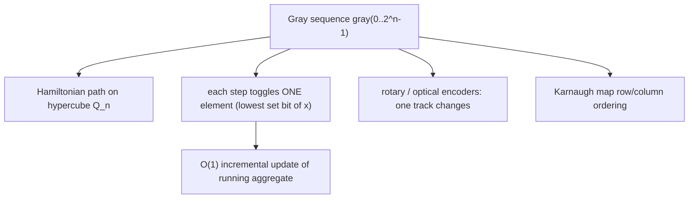

# Gosper's Hack & Gray Code — Middle Level

> **Focus:** A full step-by-step dissection of Gosper's hack with a complete worked trace, the `k`-subset enumeration loop and its exact stop condition, Gray-code generation and its prefix-XOR inverse, the link between Gray order and "add/remove one element at a time" subset traversal, and head-to-head comparisons with recursive combination generation.

---

## Table of Contents

1. [Introduction](#introduction)
2. [Deeper Concepts](#deeper-concepts)
3. [Gosper's Hack, Line by Line](#gospers-hack-line-by-line)
4. [The k-Subset Enumeration Loop](#the-k-subset-enumeration-loop)
5. [Gray Code Generation and Inverse](#gray-code-generation-and-inverse)
6. [The One-Bit-Change Subset Order](#the-one-bit-change-subset-order)
7. [Comparison with Alternatives](#comparison-with-alternatives)
8. [Code Examples](#code-examples)
9. [Error Handling](#error-handling)
10. [Performance Analysis](#performance-analysis)
11. [Best Practices](#best-practices)
12. [Visual Animation](#visual-animation)
13. [Summary](#summary)

---

## Introduction

At junior level the message was two formulas: `gray(x) = x ^ (x >> 1)` flips one bit per step, and `c=x&-x; r=x+c; x=(((r^x)>>2)/c)|r` jumps to the next `k`-subset. At middle level you start asking the questions that decide whether your enumeration is *correct* and *complete*:

- *Exactly* what does each term of the Gosper formula compute, and why does the division come out integer every time?
- Where does the enumeration start, and what is the precise stop condition that guarantees you emit **all** `C(n, k)` masks and no more?
- How do you generate the full Gray sequence, and how do you invert a Gray value back to its index?
- Why does the Gray order correspond exactly to "toggle one element at a time" over subsets, and when does that let you *update* a running computation instead of recomputing it?
- When should you reach for Gosper or Gray code instead of plain recursive `combinations` / DFS?

These are the questions that separate "I copied the formula" from "I can reason about, debug, and adapt the formula."

---

## Deeper Concepts

### Subsets, popcount, and the two orderings

A bitmask is a subset. There are two natural ways to walk subsets:

1. **Numeric (lexicographic by value):** `0, 1, 2, …, 2^n − 1`. Within a fixed popcount `k`, the numeric order *is* the lexicographic order of the combinations — this is what Gosper produces.
2. **Minimal-change (Gray):** an order where each step flips exactly one bit, i.e. adds or removes exactly one element. This is what Gray code produces (over *all* sizes at once).

Gosper restricts to a single popcount and gives numeric order. Gray code spans all sizes and gives minimal-change order. They answer different questions, and knowing which order you need is half the battle.

### Why "next-larger same-popcount" is well-defined

For any `x` with `0 < popcount(x) = k` and `x` not already the largest `k`-mask in your universe, there is a unique smallest integer `y > x` with `popcount(y) = k`. Gosper computes exactly that `y`. The largest `k`-mask within `n` bits is the top `k` bits set; once you pass it, the result's high bit exceeds `n−1` and the stop condition fires.

### The block structure that Gosper exploits

Write `x` in binary and find its **lowest block of consecutive 1s** (the run of ones that includes the least significant set bit). Call its length `b`. The next combination is formed by:

- moving the *highest* bit of that block up by one position, and
- sliding the remaining `b − 1` bits of the block all the way down to positions `0 … b−2`.

That is the lexicographically smallest way to increase the number while keeping the popcount. Every line of the hack implements one piece of that plan, which we now dissect.

---

## Gosper's Hack, Line by Line

Let `x` have popcount `k`, lowest block of length `b` starting at position `p` (so the block occupies bits `p … p+b−1`).

### Line 1: `c = x & -x`

`x & -x` isolates the lowest set bit, which is bit `p`. So `c = 2^p`. In two's complement, `-x = ~x + 1`, which flips all bits above-and-including the lowest set bit's region such that ANDing with `x` leaves only that lowest bit. Example: `x = 0b0101100`, lowest set bit is at position 2, `c = 0b0000100 = 4`.

### Line 2: `r = x + c`

Adding `c = 2^p` to `x` adds 1 at position `p`. Since bits `p … p+b−1` are all `1`, this triggers a **ripple carry**: all `b` ones turn to `0` and a single `1` appears at position `p + b`. So `r` has the lowest block cleared and one new bit set just above it. Example: `x = 0b0101100` (block of two 1s at positions 2,3), `c = 4`, `r = 0b0110000` — the block `11` at positions 2–3 became `0`, and bit 4 turned on (well, position 4 here), with the higher `1` at position 5 unaffected. The popcount of `r` is `k − b + 1` (we removed `b` ones, added `1`).

### Line 3a: `r ^ x`

XOR marks exactly the bits that **changed** between `x` and `r`. Those are: the `b` cleared ones (positions `p … p+b−1`) and the newly set bit (position `p+b`). So `r ^ x` is a contiguous run of `b + 1` ones starting at position `p`. Example: `0b0101100 ^ 0b0110000 = 0b0011100` — three ones (`b + 1 = 3`, since `b = 2`).

### Line 3b: `(r ^ x) >> 2`

Shift that run right by 2. This drops the two lowest ones of the `(b+1)`-run, leaving `b − 1` ones at the bottom (positions `0 … b−2`) after the next division. Why exactly `>> 2`? One shift would account for the carry bit; the second positions the leftover ones so that after dividing by `c = 2^p` they land at the very bottom. Example: `0b0011100 >> 2 = 0b0000111` — wait, that has three ones; the division by `c` finishes the job.

### Line 3c: `/ c` (integer division by `2^p`)

`(r ^ x) >> 2` is a multiple of `2^p / 4`... more precisely, `(r ^ x)` is `2^p · (2^{b+1} − 1)`, so `(r ^ x) >> 2 = 2^{p−2} · (2^{b+1} − 1)` only when `p ≥ 2`; the combined operation `((r ^ x) >> 2) / c` equals `(2^{b+1} − 1) >> 2 = 2^{b−1} − 1`, which is exactly `b − 1` ones at the bottom. The division is **always exact** because `r ^ x` is a clean multiple of `c = 2^p`; this is the crux you must not break with float division. Example: with `c = 4`, `((r^x)>>2)/c = 0b0000111 / ... ` resolves to `0b0000001 = 1` for `b = 2` (one leftover bit).

### Line 3d: `| r`

OR the `b − 1` repacked low bits onto `r`. Result: the moved-up bit (from line 2), the untouched higher bits, and the `b − 1` ones now sitting at positions `0 … b−2`. Total popcount: `(k − b + 1) + (b − 1) = k`. Popcount preserved, value minimally increased. Done.

### Worked numeric trace, fully

Take `x = 0b010110 = 22`, `n = 6`, `k = 3` (block at positions 1–2, length `b = 2`; plus a high `1` at position 4).

```
x      = 0b010110 = 22        block of two 1s at positions 1,2; high 1 at pos 4
c=x&-x = 0b000010 = 2         lowest set bit (position 1)
r=x+c  = 0b011000 = 24        00110 (low block) + 10 = ripple: bits 1,2 cleared, bit 3 set
r^x    = 0b001110 = 14        the b+1 = 3 changed bits, run starting at position 1
>>2    = 0b000011 = 3         drop two low ones
/c     = 3 / 2 = 1 = 0b000001 integer divide by c=2 -> one leftover 1 at the bottom
|r     = 0b011000 | 0b000001 = 0b011001 = 25
```

So the next 3-subset after `22 = {1,2,4}` is `25 = {0,3,4}`. Check: `25 = 0b011001`, bits 0, 3, 4 — popcount 3, and `25 > 22` with no 3-mask strictly between them (`23 = 0b10111` has popcount 4, `24 = 0b11000` has popcount 2). Correct.

---

## The k-Subset Enumeration Loop

The complete, correct loop with start value, stop condition, and the `k = 0` guard:

```
def k_subsets(n, k):
    if k == 0:
        yield 0                  # the empty subset is the only 0-subset
        return
    x = (1 << k) - 1             # smallest k-subset: k lowest bits set
    limit = 1 << n               # stop when the mask spills past bit n-1
    while x < limit:
        yield x
        c = x & -x
        r = x + c
        x = (((r ^ x) >> 2) // c) | r
```

**Why `(1 << k) - 1` is the start.** This is `k` ones in the lowest positions — the numerically smallest integer with popcount `k`. Any other `k`-mask is larger.

**Why `x < (1 << n)` is the stop.** The largest `k`-mask within an `n`-bit universe has its ones in the top `k` positions: `((1 << k) - 1) << (n - k)`, which is `< 2^n`. The *next* Gosper step from that mask moves a bit to position `n` (or beyond), making `x ≥ 2^n`, so the loop exits. This guarantees exactly the `C(n, k)` valid masks are emitted, in increasing order.

**Why the `k = 0` guard.** With `k = 0` the start would be `0`, and `c = 0 & -0 = 0`, so the division `/c` is a division by zero. The only 0-subset is the empty mask, so we emit `0` and return.

**Off-by-one sanity:** for `n = 4, k = 2` the masks are `0011, 0101, 0110, 1001, 1010, 1100` — that is `C(4,2) = 6` values: `3, 5, 6, 9, 10, 12`. The next Gosper step from `12 = 0b1100` produces `0b10001 = 17 ≥ 16 = 1 << 4`, so the loop stops. Exactly six emitted. Correct.

---

## Gray Code Generation and Inverse

### Forward: binary index → Gray value

```
def gray(x):
    return x ^ (x >> 1)
```

To produce the whole `n`-bit Gray sequence, iterate the counter `x = 0 … 2^n − 1` and convert each. Consecutive Gray values differ in exactly one bit (proof in [`professional.md`](./professional.md)). The intuition: incrementing `x` flips a low run of bits in binary, but XOR-ing with the shifted copy cancels all but one of those flips.

### Inverse: Gray value → binary index (prefix XOR)

```
def inverse_gray(g):
    x = 0
    while g:
        x ^= g
        g >>= 1
    return x
```

Each binary bit is the XOR of all Gray bits at-or-above it. Bit `i` of `x` is `g_i ^ g_{i+1} ^ … ^ g_{n-1}`. Equivalently, `x_i = x_{i+1} ^ g_i` working from the top bit down. The loop above accumulates this prefix XOR in `O(n)` time. There is also an `O(log n)` "XOR-doubling" form:

```
def inverse_gray_fast(g):       # for fixed width up to 32 bits
    g ^= g >> 16
    g ^= g >> 8
    g ^= g >> 4
    g ^= g >> 2
    g ^= g >> 1
    return g
```

which folds the prefix XOR in logarithmically many steps — handy in hot loops.

### Worked Gray trace for `n = 3`

```
x   bin   gray = x ^ (x>>1)   inverse_gray(gray)
0   000   000 ^ 000 = 000      000 -> 0
1   001   001 ^ 000 = 001      001 -> 1
2   010   010 ^ 001 = 011      011 ^ 001 = 010 -> 2
3   011   011 ^ 001 = 010      010 ^ 001 = 011 -> 3
4   100   100 ^ 010 = 110      110 ^ 011 = 101... -> 4
5   101   101 ^ 010 = 111      -> 5
6   110   110 ^ 011 = 101      -> 6
7   111   111 ^ 011 = 100      -> 7
```

Every adjacent pair in the `gray` column differs in one bit, and the inverse recovers the original index — the two functions are exact inverses.

---

## The One-Bit-Change Subset Order

Because a Gray step flips exactly one bit, walking `gray(0), gray(1), …, gray(2^n − 1)` visits **every subset of an `n`-set exactly once, adding or removing exactly one element each step.** This is precisely a Hamiltonian path on the hypercube `Q_n` (every subset is a vertex; edges connect subsets differing in one element).

The practical payoff: if you maintain an aggregate over the current subset (a sum, product, XOR, count of satisfied constraints, etc.), a Gray step changes the subset by *one element*, so you can update the aggregate in `O(1)` rather than recomputing from scratch in `O(n)`.

**Which bit flips at step `x`?** Going from `gray(x-1)` to `gray(x)`, the flipped bit position equals the position of the **lowest set bit of `x`** — that is, `log2(x & -x)`. So you know exactly which element to toggle without diffing the two masks:

```
prev = 0
for x in range(1, 1 << n):
    g = x ^ (x >> 1)
    bit = (x & -x).bit_length() - 1   # the single element that toggled
    if g & (1 << bit):
        add_element(bit)              # element entered the subset
    else:
        remove_element(bit)           # element left the subset
    prev = g
```

This is the engine behind techniques like iterating all subsets while maintaining an incremental hash, or the classic "subset-sum by Gray code" that updates the running sum with one add/subtract per step.



---

## Comparison with Alternatives

### Gosper vs recursive combination generation

| Approach | Per-combination cost | Order | Extra space | Notes |
|----------|---------------------|-------|-------------|-------|
| **Gosper's hack** | `O(1)` | increasing numeric (= lexicographic) | `O(1)` | no recursion, no array; bounded by word size |
| Recursive DFS (`choose k of n`) | `O(k)` to build each combo | lexicographic | `O(k)` recursion stack | natural for non-bitmask elements |
| `itertools.combinations` (Python) | amortized `O(1)`–`O(k)` | lexicographic | `O(k)` | convenient, but yields tuples not masks |
| Bit-twiddling submask loop | varies | not size-restricted | `O(1)` | enumerates *all* submasks, not fixed size |

Gosper wins when you want **bitmasks of a fixed size in sorted order with zero allocation**, e.g. bitmask DP. Recursive generation wins when elements are not integers or `n` exceeds the word size.

### Gray code vs plain binary counting

| Property | Plain counter (`0,1,2,…`) | Gray code |
|----------|---------------------------|-----------|
| Bits changed per step | up to `n` (e.g. `0111 → 1000`) | exactly `1` |
| Order | numeric | minimal-change (Hamiltonian path) |
| Incremental update friendliness | poor (many bits change) | excellent (one element toggles) |
| Hardware glitch resistance | low | high (encoders use it) |
| Conversion cost | none | `O(1)` forward, `O(n)`/`O(log n)` inverse |

### Concrete: number of bit flips

For `n = 4`, plain counting `0..15` flips a total of `1+2+1+3+1+2+1+4+… = 26` bits across the 15 steps (the binary "carry" cost). Gray code flips exactly `15` bits total — one per step. That factor matters when each flip is a physical transition (power) or an expensive recompute.

### A subtle third option: the combinations Gray code

There is a less-known ordering worth knowing about so you do not confuse it with the two above: the **revolving-door** (or Eades-McKay) Gray code for *fixed-size* subsets. It lists all `C(n, k)` subsets so that each step **removes one element and adds another** — the mask changes in exactly two bit positions (Hamming distance 2), keeping popcount fixed. Compare:

| Ordering | Spans | Change per step | Mask Hamming distance |
|----------|-------|-----------------|------------------------|
| Gosper | one popcount class | moves a block | up to `b + 1` (many) |
| Reflected Gray | all popcounts | toggle one element | exactly `1` |
| Revolving-door | one popcount class | swap one element | exactly `2` |

Use the revolving-door code when you want fixed-size subsets *and* minimal change (e.g. incrementally maintaining a `k`-element selection where each transition is "swap one item in for one out"). Gosper gives you fixed size and sorted order but multi-bit jumps; the reflected Gray code gives you one-bit changes but varying sizes. They are three genuinely different tools, and reaching for the wrong one is a classic mistake.

### Worked Gray sequence for `n = 4`

To cement the one-bit-change property at a slightly larger size:

```
x    gray(x)   flipped bit ν(x)
0    0000      —
1    0001      0
2    0011      1
3    0010      0
4    0110      2
5    0111      0
6    0101      1
7    0100      0
8    1100      3
9    1101      0
10   1111      1
11   1110      0
12   1010      2
13   1011      0
14   1001      1
15   1000      0
```

The flipped-bit column `0,1,0,2,0,1,0,3,0,1,0,2,0,1,0` is the *ruler sequence* — symmetric, with the unique `3` (the top bit) at the exact center `x = 8`. And `1000` (last) versus `0000` (first) differ in one bit too, so the code is cyclic.

---

## Code Examples

### Reusable Gosper + Gray utilities (counting semiring of subsets)

#### Go

```go
package main

import (
	"fmt"
	"math/bits"
)

func nextCombination(x uint64) uint64 {
	c := x & (-x)
	r := x + c
	return (((r ^ x) >> 2) / c) | r
}

// KSubsets returns all k-subsets of {0..n-1} as masks, increasing order.
func KSubsets(n, k int) []uint64 {
	out := []uint64{}
	if k == 0 {
		return []uint64{0}
	}
	x := uint64((1 << uint(k)) - 1)
	limit := uint64(1) << uint(n)
	for x < limit {
		out = append(out, x)
		x = nextCombination(x)
	}
	return out
}

func gray(x uint64) uint64       { return x ^ (x >> 1) }
func inverseGray(g uint64) uint64 {
	x := uint64(0)
	for g > 0 {
		x ^= g
		g >>= 1
	}
	return x
}

func main() {
	masks := KSubsets(4, 2)
	fmt.Print("2-subsets of {0..3}: ")
	for _, m := range masks {
		fmt.Printf("%04b ", m)
	}
	fmt.Println()
	fmt.Println("count =", len(masks), "(expected C(4,2)=6)")

	fmt.Println("Gray walk, toggled element per step:")
	for x := uint64(1); x < 8; x++ {
		toggled := bits.TrailingZeros64(x & (-x))
		fmt.Printf("x=%d gray=%03b toggled bit %d\n", x, gray(x), toggled)
	}
	_ = inverseGray
}
```

#### Java

```java
public class GosperGrayMid {

    static long nextCombination(long x) {
        long c = x & (-x);
        long r = x + c;
        return (((r ^ x) >> 2) / c) | r;
    }

    static long[] kSubsets(int n, int k) {
        if (k == 0) return new long[]{0};
        java.util.ArrayList<Long> out = new java.util.ArrayList<>();
        long x = (1L << k) - 1, limit = 1L << n;
        while (x < limit) { out.add(x); x = nextCombination(x); }
        long[] res = new long[out.size()];
        for (int i = 0; i < res.length; i++) res[i] = out.get(i);
        return res;
    }

    static long gray(long x) { return x ^ (x >> 1); }

    static long inverseGray(long g) {
        long x = 0;
        for (; g > 0; g >>= 1) x ^= g;
        return x;
    }

    static String bin(long x, int n) {
        StringBuilder sb = new StringBuilder();
        for (int i = n - 1; i >= 0; i--) sb.append((x >> i) & 1);
        return sb.toString();
    }

    public static void main(String[] args) {
        long[] masks = kSubsets(4, 2);
        System.out.print("2-subsets of {0..3}: ");
        for (long m : masks) System.out.print(bin(m, 4) + " ");
        System.out.println("\ncount = " + masks.length + " (expected 6)");

        System.out.println("Gray walk, toggled element per step:");
        for (long x = 1; x < 8; x++) {
            int toggled = Long.numberOfTrailingZeros(x & (-x));
            System.out.println("x=" + x + " gray=" + bin(gray(x), 3) + " toggled bit " + toggled);
        }
        System.out.println("inverseGray(5) = " + inverseGray(5));
    }
}
```

#### Python

```python
def next_combination(x: int) -> int:
    c = x & (-x)
    r = x + c
    return (((r ^ x) >> 2) // c) | r


def k_subsets(n: int, k: int):
    if k == 0:
        yield 0
        return
    x = (1 << k) - 1
    limit = 1 << n
    while x < limit:
        yield x
        x = next_combination(x)


def gray(x: int) -> int:
    return x ^ (x >> 1)


def inverse_gray(g: int) -> int:
    x = 0
    while g:
        x ^= g
        g >>= 1
    return x


if __name__ == "__main__":
    masks = list(k_subsets(4, 2))
    print("2-subsets of {0..3}:", [format(m, "04b") for m in masks])
    print("count =", len(masks), "(expected C(4,2)=6)")

    print("Gray walk, toggled element per step:")
    for x in range(1, 8):
        toggled = (x & -x).bit_length() - 1
        print(f"x={x} gray={gray(x):03b} toggled bit {toggled}")
    print("inverse_gray(5) =", inverse_gray(5))
```

---

## Error Handling

| Scenario | What goes wrong | Correct approach |
|----------|-----------------|------------------|
| `k = 0` passed to the hack | `c = 0`, division by zero. | Special-case: the only 0-subset is `0`; emit it and return. |
| Python `/` instead of `//` | `(((r^x)>>2)/c)` becomes a float; mask corrupted. | Use integer division `//`. |
| Wrong stop bound | Looping past `1 << n` repeats or runs forever. | Stop exactly when `x >= (1 << n)`. |
| Signed shift on big mask | `x >> 1` sign-extends a negative; garbage Gray value. | Use unsigned (`uint64`, Java `>>>`). |
| Expecting numeric order from Gray | Gray is minimal-change, not ascending. | Convert with `inverse_gray` if you need the index. |
| Overflow at top of range | `x + c` wraps when the top bit is involved. | Keep `n ≤ 63` for 64-bit, or use a sentinel/bigint (see `senior.md`). |
| `k > n` | Start `(1<<k)-1 ≥ 1<<n`, loop body never runs (correct) but caller may expect masks. | Document that there are `0` subsets; handle empty output. |

---

## Performance Analysis

Both operations are `O(1)` per produced item, so total cost equals output size.

| Task | Items produced | Total cost | Per item |
|------|----------------|------------|----------|
| All `k`-subsets via Gosper | `C(n, k)` | `O(C(n, k))` | `O(1)` |
| Full `n`-bit Gray sequence | `2^n` | `O(2^n)` | `O(1)` forward |
| Inverse Gray (loop) | 1 | `O(n)` | — |
| Inverse Gray (XOR-doubling) | 1 | `O(log n)` | — |

| `n, k` | `C(n, k)` | Gosper steps | Notes |
|--------|-----------|--------------|-------|
| `n=10, k=5` | 252 | 252 | instant |
| `n=20, k=10` | 184 756 | 184 756 | sub-millisecond |
| `n=32, k=16` | ~601 million | ~601 M | seconds; consider whether you really need all of them |
| `n=40, k=20` | ~137 billion | infeasible | the count, not the per-step cost, is the wall |

The lesson: the per-step cost is trivially `O(1)`; the wall is always the **number of combinations** `C(n, k)`, which can explode. Gosper does not make an intractable count tractable — it just generates each item with zero overhead. Use it when `C(n, k)` is itself manageable.

```python
import time

def bench_gosper(n, k):
    start = time.perf_counter()
    count = sum(1 for _ in k_subsets(n, k))
    return count, time.perf_counter() - start

# Typical: n=20, k=10 -> 184756 masks in well under a millisecond per item.
```

The biggest constant-factor mistakes are: (1) materializing the whole list when you could stream, and (2) accidentally using float division in Python, which both slows and corrupts.

---

## Best Practices

- **Stream, don't store:** yield each mask / Gray value and process it immediately; do not build a `C(n,k)`-sized list unless you must.
- **Guard `k = 0`** before the loop; it is the one input that breaks the formula.
- **Use unsigned, fixed-width types** for masks in Go/Java; reserve Python's bigints for `n > 63`.
- **Prefer `//` in Python** for the Gosper division — it is the single most common bug.
- **Pick the order deliberately:** Gosper for sorted fixed-size subsets, Gray for minimal-change traversal; convert with `inverse_gray` only when you need the numeric index.
- **Exploit the one-bit-change** of Gray code to update aggregates incrementally — that is the whole reason to use Gray order over a plain counter.
- **Test against `itertools.combinations`** (or a recursive oracle) on small `n, k` before trusting Gosper at scale.

---

## Visual Animation

> See [`animation.html`](./animation.html) for an interactive view.
>
> The middle-level animation highlights:
> - **Mode 1 (Gosper):** the intermediate `c = x & -x`, `r = x + c`, the changed-bit run `r ^ x`, and the repacked result, with the lowest block and the moved bit color-coded.
> - **Mode 2 (Gray):** the `n`-bit Gray sequence with the single flipped bit highlighted at each step, and a side panel naming which element toggled (the lowest set bit of the counter).
> - Adjustable `n` and `k`, with Step / Run / Reset controls.

---

## Summary

Gosper's hack is four bit operations that, dissected, implement one geometric idea: take the lowest block of consecutive `1`s, push its top bit up one position (`r = x + c` via ripple carry), and slide the remaining `b − 1` ones to the very bottom (`(((r ^ x) >> 2) / c)`), giving the lexicographically smallest larger mask of the same popcount. Start at `(1 << k) - 1`, stop at `1 << n`, guard `k = 0`, and you emit all `C(n, k)` combinations in sorted order at `O(1)` each. Gray code, via `g = x ^ (x >> 1)` and its prefix-XOR inverse, orders all `2^n` subsets so each step toggles exactly one element — a Hamiltonian walk on the hypercube that lets you update running aggregates incrementally and powers glitch-free hardware encoders. The flipped element at step `x` is the lowest set bit of `x`. Choose Gosper for sorted fixed-size subsets, Gray for minimal-change traversal, and remember the per-step cost is `O(1)` — the only wall is the size of the output itself.
