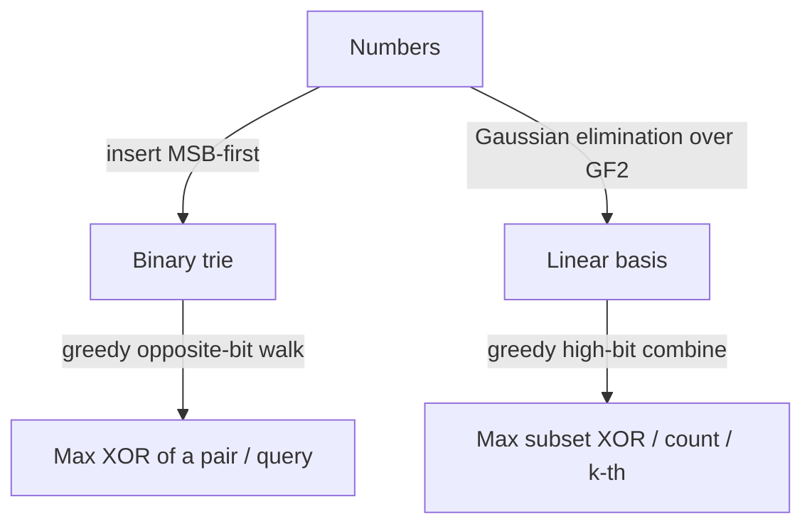

# Binary Trie & XOR Linear Basis — Junior Level

> **One-line summary:** A **binary trie** stores numbers as fixed-width bit strings (most-significant bit first) so you can greedily walk the *opposite* bit at every level and find the value in your set that XORs to the maximum with a query — the canonical way to solve "maximum XOR pair in an array" in `O(n·B)`. The **XOR linear basis** is the algebra cousin: it keeps a tiny reduced set of numbers that can reproduce every XOR achievable by your collection.

---

## Table of Contents

1. [Introduction](#introduction)
2. [Prerequisites](#prerequisites)
3. [Glossary](#glossary)
4. [Core Concepts](#core-concepts)
5. [Big-O Summary](#big-o-summary)
6. [Real-World Analogies](#real-world-analogies)
7. [Pros & Cons](#pros--cons)
8. [Step-by-Step Walkthrough](#step-by-step-walkthrough)
9. [Code Examples](#code-examples)
10. [Coding Patterns](#coding-patterns)
11. [Error Handling](#error-handling)
12. [Performance Tips](#performance-tips)
13. [Best Practices](#best-practices)
14. [Edge Cases & Pitfalls](#edge-cases--pitfalls)
15. [Common Mistakes](#common-mistakes)
16. [Cheat Sheet](#cheat-sheet)
17. [Visual Animation](#visual-animation)
18. [Summary](#summary)
19. [Further Reading](#further-reading)

---

## Introduction

Suppose someone hands you an array of numbers and asks: *"Which two numbers, XORed together, give the largest possible value?"* The XOR of two numbers `a ^ b` has a 1-bit wherever the two numbers **disagree**, so to make `a ^ b` large you want the two numbers to disagree at the highest bits possible. Trying every pair is `O(n²)` — fine for 1,000 numbers, hopeless for a million.

There is a beautiful data structure that solves this in `O(n·B)`, where `B` is the bit-width (say 30 for numbers under `10^9`). It is the **binary trie** (also called a bitwise trie or 0/1 trie). You insert each number as a path of bits from the most-significant bit down to the least-significant bit. Then, for any query value `x`, you walk down the trie always trying to go to the **opposite** of `x`'s current bit, because opposite bits make the XOR's bit a `1`. If the opposite child exists you take it (and bank a `1` in that position); otherwise you are forced to follow the same bit (banking a `0`). The path you trace spells out the number already in the set that maximizes `x ^ (that number)`.

> **The whole idea in one sentence:** *Store numbers bit-by-bit from the top, then greedily chase the opposite bit to make the XOR as large as possible.*

This single structure also answers many cousins of the question: *the maximum XOR of a query against the set*, *how many pairs have XOR less than `k`*, *the k-th smallest XOR*, and (with subtree counts) it even supports **deletion**.

There is a second, completely different tool that overlaps with the trie: the **XOR linear basis**. Instead of storing every number, it keeps a *reduced* set of at most `B` numbers — like a minimal spelling alphabet — from which you can XOR-combine to reproduce every value reachable from your collection. The basis instantly answers "what is the maximum XOR of *any subset*?" and "how many distinct XOR values can I make?" We introduce it gently at the end of this file; the deeper machinery lives in `middle.md` and `professional.md`.

This topic is the home of the two core **XOR data structures**. It does *not* re-cover the plain XOR identities or the "find the single number" trick — those live in the sibling `02-xor-pairing`. It is also unrelated to string tries (alphabetic prefix trees) elsewhere in the roadmap; here the alphabet is just `{0, 1}` and the meaning is bitwise.

---

## Prerequisites

Before reading this file you should be comfortable with:

- **Binary representation of integers** — how a number is a sequence of bits, and what "the i-th bit" means.
- **The XOR operator (`^`)** — `0^0=0`, `0^1=1`, `1^0=1`, `1^1=0`; a 1-bit appears exactly where two numbers **differ**.
- **Bit extraction** — getting bit `i` with `(x >> i) & 1`. See sibling `01-bit-tricks`.
- **Trees / tree nodes** — a node with up to two children; following a path from the root. See `04-trees`.
- **Big-O notation** — `O(n)`, `O(n·B)`, `O(B)`.
- **Arrays and loops** — every operation here is a loop over bit positions.

Optional but helpful:

- A glance at the plain XOR rules from `02-xor-pairing` (we use, but do not re-derive, them here).
- Familiarity with **greedy algorithms** — the trie walk is a greedy choice at each level.

---

## Glossary

| Term | Meaning |
|------|---------|
| **Bit-width `B`** | The fixed number of bits we treat each number as having (e.g. 30, 32, or 64). Every number is padded to exactly `B` bits. |
| **Binary trie** | A tree where each node has up to two children (`0` and `1`). A root-to-leaf path of length `B` spells one number, MSB first. |
| **MSB-first** | Most-significant-bit-first: we read/insert bits from the top (bit `B-1`) down to bit `0`. Required so the greedy walk fixes high bits first. |
| **Opposite bit** | If `x`'s current bit is `b`, the opposite is `1-b`. Going to the opposite child makes that XOR bit a `1`. |
| **XOR (`^`)** | Bitwise exclusive-or; a bit is `1` where the two operands disagree. |
| **Maximum XOR pair** | The largest value of `a ^ b` over all pairs `a, b` in the array. |
| **Subtree count** | A counter stored at each trie node = how many inserted numbers pass through it. Enables deletion and counting. |
| **XOR linear basis** | A reduced set of ≤ `B` numbers whose XOR-combinations reproduce every XOR achievable from the original collection. |
| **Rank** | The size of the basis = number of independent values = log₂ of the number of distinct achievable XORs. |
| **Span** | The set of all values you can build by XORing together any subset of the basis. |

---

## Core Concepts

### 1. Numbers as Fixed-Width Bit Paths

Pick a bit-width `B` large enough to hold every number (for values `< 2^30`, use `B = 30`). A number becomes a path: start at the root, and for `i = B-1` down to `0`, step into child `(x >> i) & 1`. Two numbers that share a high prefix share the top of their paths.

```
B = 4, insert 6 (=0110) and 5 (=0101):

          root
           |0
          (0)
           |1
          (1)
         0/   \1
       (10)   (11)   <- they split at bit 1
        |0     |1
      (100)  (110)
   = 5(0101) = 6(0110)
```

### 2. Why MSB-First Matters

XOR comparison is decided at the **highest differing bit**. If two candidate XOR results differ at bit 7, nothing at bits 0–6 can change which is larger. So we must commit to the high bits first — that is exactly what an MSB-first trie lets us do greedily. A least-significant-bit-first trie would be useless for maximization.

### 3. The Greedy Maximize-XOR Walk

To maximize `x ^ y` over all `y` in the trie, walk down from the root. At level `i`, let `b = (x >> i) & 1`. We *want* to set this XOR bit to `1`, which means we want `y`'s bit to be `1-b`.

```
want = 1 - b
if child[want] exists:  go there, this XOR bit = 1
else:                   go to child[b], this XOR bit = 0  (forced)
```

Because we always prefer a `1` at the most significant undecided bit, and a `1` high up beats any combination of lower bits, this greedy choice is provably optimal (proof in `professional.md`).

### 4. Maximum XOR Pair in an Array (the running example)

Insert numbers one at a time. Before (or after) inserting `nums[i]`, query the trie with `nums[i]` to get the best XOR partner among numbers already present, and track the global maximum. Inserting all `n` numbers costs `O(n·B)`; each query is `O(B)`; total `O(n·B)`. That beats the `O(n²)` brute force decisively.

### 5. Subtree Counts → Counting and Deletion

Store at each node a counter `cnt` = how many inserted numbers pass through it. Insert increments along the path; "delete" decrements along the path; a child "exists" for the walk only if its `cnt > 0`. These counts also let you answer *how many numbers in the set XOR with `x` to less than `k`* by routing down the trie and adding up whole subtrees (covered in `middle.md`).

### 6. The XOR Linear Basis (gentle intro)

A different question: *"What is the largest XOR I can make by combining ANY subset of the numbers?"* Here the trie does not directly help, but the **linear basis** does. Think of each number as a vector of bits and XOR as vector addition. Gaussian elimination keeps a minimal independent set (the basis). Then the maximum subset-XOR is found by greedily XORing in basis vectors that increase the result, from the high bit down. The basis also tells you that the number of distinct achievable XORs is exactly `2^rank`. Full treatment: `middle.md` / `professional.md`.

---

## Big-O Summary

| Operation | Time | Space | Notes |
|-----------|------|-------|-------|
| Insert one number into trie | **O(B)** | O(B) new nodes worst case | One step per bit. |
| Query max XOR of `x` vs trie | **O(B)** | O(1) | One greedy step per bit. |
| Build trie of `n` numbers | O(n·B) | O(n·B) nodes | Each number adds ≤ `B` nodes. |
| Maximum XOR pair in array | **O(n·B)** | O(n·B) | Insert all, query each. |
| Delete one number (with counts) | O(B) | O(1) | Decrement counts along path. |
| Count pairs with XOR < k | O(n·B) | O(n·B) | Route + subtree sums (see middle). |
| Basis insert/reduce one number | **O(B)** | O(B) total | At most `B` basis slots. |
| Max subset-XOR via basis | O(B) | O(B) | Greedy over basis from high bit. |
| Number of distinct subset-XORs | O(1) after build | O(B) | Exactly `2^rank`. |

The two headline numbers: **`O(n·B)`** for the trie-based max-XOR-pair, and **`O(B)` per operation** for the linear basis with only **`O(B)` total** storage.

---

## Real-World Analogies

| Concept | Analogy |
|---------|---------|
| Binary trie | A library where books are shelved by a binary call number, digit by digit from the most important digit. To find the "most different" book you keep turning toward the opposite digit at each shelf split. |
| MSB-first walk | Choosing a debate opponent: you first disagree on the biggest issue, then the next biggest — the top disagreements dominate the outcome. |
| Greedy opposite bit | A "spot the difference" game where high-value differences are worth far more, so you grab the highest-value difference available at every step. |
| Subtree counts | A turnstile counter at every fork of a maze recording how many people walked through; removing a person decrements every turnstile on their route. |
| Linear basis | A minimal set of LEGO master-bricks: combine subsets of them (by XOR) to build every shape your full pile could build, but with far fewer pieces to carry. |
| 2^rank distinct XORs | If your alphabet has `r` independent letters, you can spell exactly `2^r` distinct words (each letter either in or out). |

Where the analogies break: real shelves are linear, but a trie shares prefixes so two close numbers literally share the top of their path; and XOR "addition" has no carries, which is what makes the basis a clean vector space (see `professional.md`).

---

## Pros & Cons

| Pros | Cons |
|------|------|
| Max XOR pair in `O(n·B)` instead of `O(n²)`. | Trie uses `O(n·B)` nodes — memory-heavy for large `n` with pointers. |
| Greedy trie walk is simple and provably optimal. | Bit-width must be chosen correctly; too small silently drops high bits. |
| Subtree counts add deletion and rich counting cheaply. | Counting variants (XOR < k) need careful subtree bookkeeping. |
| Linear basis uses only `O(B)` space regardless of `n`. | Basis answers *subset*-XOR questions, not *pair* questions. |
| Basis supports max/min/k-th/count of achievable XORs and merging. | Two different tools to learn; choosing the wrong one wastes effort. |
| Both are pure-integer, no floating point, no overflow if `B ≤ 63`. | Trie order matters: MSB-first is mandatory for maximization. |

**When to use the trie:** "max/min XOR of a *pair*", "max XOR of a query against a *set*", "count pairs with XOR in a range", anything needing per-element membership and deletion.

**When to use the basis:** "max/min/k-th XOR of *any subset*", "is value `v` representable as a subset-XOR?", "how many distinct XORs?", merging two collections' XOR spans.

---

## Step-by-Step Walkthrough

Take the array `[3, 10, 5, 25, 2, 8]` and find the maximum XOR pair. Use bit-width `B = 5` (since `25 < 32 = 2^5`).

```
3  = 00011
10 = 01010
5  = 00101
25 = 11001
2  = 00010
8  = 01000
```

**Step 1 — Insert every number into an MSB-first trie.** Each number creates a 5-deep path. After all inserts the trie holds all six paths, sharing common high prefixes.

**Step 2 — Query the trie with each number, take the best.** Let us query with `5 = 00101`. We want the opposite bit at each level:

```
bit4: x=0 → want 1. Does a stored number start with 1? Yes (25=11001). Take 1. XOR bit=1.
bit3: at the '1' node, x=1 → want 0. Children under 11...? 25 has 11001 → next bit 1, no 0 child. Forced 1. XOR bit=0.
bit2: x=1 → want 0. 25 is 110(0)1 → next bit 0 exists. Take 0. XOR bit=1.
bit1: x=0 → want 1. 25 is 1100(0)1 → next bit 0, no 1 child. Forced 0. XOR bit=0.
bit0: x=1 → want 0. 25 is 11001 → next bit 1, no 0 child. Forced 1. XOR bit=0.
```

The path we walked spells `11001 = 25`, and `5 ^ 25 = 00101 ^ 11001 = 11100 = 28`. The XOR-bits we banked were `1,0,1,0,0 = 10100 = 28`. They match.

**Step 3 — Repeat for every element**, keeping the running maximum. Trying the other numbers as queries yields nothing larger than `28`, so the answer is **`5 ^ 25 = 28`**.

**Why greedy is correct here:** at `bit4` we secured a `1` in the highest position. No matter what happens at bits 3–0, any result starting with `1` (≥ 16) beats any result starting with `0` (≤ 15). The greedy choice at the top dominates.

**A peek at the basis on the same array:** reducing `[3, 10, 5, 25, 2, 8]` with Gaussian elimination yields a basis of a few independent values; the *maximum subset-XOR* (combining any subset) can exceed the best pair — that is the key difference between the two tools, explored in `middle.md`.

---

## Code Examples

### Example: Maximum XOR Pair via Binary Trie

This inserts all numbers, then queries each to find the best XOR partner, returning the global maximum.

#### Go

```go
package main

import "fmt"

const B = 30 // bits; enough for values < 2^30

type Trie struct {
	child [][2]int // child[node][bit] = index or -1
}

func newTrie() *Trie {
	t := &Trie{}
	t.child = append(t.child, [2]int{-1, -1}) // root = node 0
	return t
}

func (t *Trie) insert(x int) {
	node := 0
	for i := B - 1; i >= 0; i-- {
		b := (x >> i) & 1
		if t.child[node][b] == -1 {
			t.child = append(t.child, [2]int{-1, -1})
			t.child[node][b] = len(t.child) - 1
		}
		node = t.child[node][b]
	}
}

func (t *Trie) maxXor(x int) int {
	node, res := 0, 0
	for i := B - 1; i >= 0; i-- {
		b := (x >> i) & 1
		want := 1 - b
		if t.child[node][want] != -1 {
			res |= 1 << i
			node = t.child[node][want]
		} else {
			node = t.child[node][b]
		}
	}
	return res
}

func maxXorPair(nums []int) int {
	t := newTrie()
	best := 0
	t.insert(nums[0])
	for i := 1; i < len(nums); i++ {
		if v := t.maxXor(nums[i]); v > best {
			best = v
		}
		t.insert(nums[i])
	}
	return best
}

func main() {
	nums := []int{3, 10, 5, 25, 2, 8}
	fmt.Println("max XOR pair =", maxXorPair(nums)) // 28
}
```

#### Java

```java
public class MaxXorPair {
    static final int B = 30;
    static int[][] child = new int[1][2]; // grows; child[node][bit]
    static int size = 1;

    static void ensure() {
        if (size == child.length) {
            int[][] bigger = new int[child.length * 2][2];
            for (int i = 0; i < child.length; i++) bigger[i] = child[i];
            child = bigger;
        }
    }

    static void insert(int x) {
        int node = 0;
        for (int i = B - 1; i >= 0; i--) {
            int b = (x >> i) & 1;
            if (child[node][b] == 0) {
                ensure();
                child[size][0] = 0; child[size][1] = 0;
                child[node][b] = size++;
            }
            node = child[node][b];
        }
    }

    static int maxXor(int x) {
        int node = 0, res = 0;
        for (int i = B - 1; i >= 0; i--) {
            int b = (x >> i) & 1, want = 1 - b;
            if (child[node][want] != 0) { res |= (1 << i); node = child[node][want]; }
            else node = child[node][b];
        }
        return res;
    }

    public static void main(String[] args) {
        int[] nums = {3, 10, 5, 25, 2, 8};
        child = new int[2 * nums.length * B][2]; size = 1; // root at 0
        int best = 0;
        insert(nums[0]);
        for (int i = 1; i < nums.length; i++) {
            best = Math.max(best, maxXor(nums[i]));
            insert(nums[i]);
        }
        System.out.println("max XOR pair = " + best); // 28
    }
}
```

> Note: the Java version above uses index `0` to mean "no child" and starts real nodes at index `1`. This works because the root is node `0` and is never a child target.

#### Python

```python
B = 30  # bits; enough for values < 2^30


class Trie:
    def __init__(self):
        # child[node][bit] = index or None; node 0 is the root
        self.child = [[None, None]]

    def insert(self, x):
        node = 0
        for i in range(B - 1, -1, -1):
            b = (x >> i) & 1
            if self.child[node][b] is None:
                self.child.append([None, None])
                self.child[node][b] = len(self.child) - 1
            node = self.child[node][b]

    def max_xor(self, x):
        node, res = 0, 0
        for i in range(B - 1, -1, -1):
            b = (x >> i) & 1
            want = 1 - b
            if self.child[node][want] is not None:
                res |= 1 << i
                node = self.child[node][want]
            else:
                node = self.child[node][b]
        return res


def max_xor_pair(nums):
    t = Trie()
    t.insert(nums[0])
    best = 0
    for x in nums[1:]:
        best = max(best, t.max_xor(x))
        t.insert(x)
    return best


if __name__ == "__main__":
    print("max XOR pair =", max_xor_pair([3, 10, 5, 25, 2, 8]))  # 28
```

**What it does:** builds an MSB-first 0/1 trie, then for each number finds its best XOR partner among earlier numbers.
**Run:** `go run main.go` | `javac MaxXorPair.java && java MaxXorPair` | `python trie.py`

---

## Coding Patterns

### Pattern 1: Brute-Force Oracle (test against this)

**Intent:** Verify the trie before trusting it. Compare all pairs on small inputs.

```python
def max_xor_pair_bruteforce(nums):
    best = 0
    for i in range(len(nums)):
        for j in range(i + 1, len(nums)):
            best = max(best, nums[i] ^ nums[j])
    return best
```

This is `O(n²)` — too slow for big `n`, but a perfect correctness oracle: the trie must agree on random small arrays.

### Pattern 2: Max XOR of a Query Against a Set

**Intent:** Maintain a growing set of numbers and answer "max XOR of `x` with anything in the set" online. Just keep one trie and call `insert` / `maxXor` as queries arrive.

### Pattern 3: A First Linear Basis (insert + max subset XOR)

**Intent:** Keep at most `B` independent numbers; query the maximum achievable subset-XOR.

```python
B = 30
basis = [0] * B  # basis[i] has its highest set bit at position i, or is 0


def add(x):
    for i in range(B - 1, -1, -1):
        if not (x >> i) & 1:
            continue
        if basis[i] == 0:
            basis[i] = x
            return True          # increased the rank
        x ^= basis[i]
    return False                 # x was dependent (reduced to 0)


def max_subset_xor():
    res = 0
    for i in range(B - 1, -1, -1):
        if (res ^ basis[i]) > res:
            res ^= basis[i]
    return res
```



---

## Error Handling

| Error | Cause | Fix |
|-------|-------|-----|
| Wrong (too small) answer | Bit-width `B` smaller than the largest number's high bit. | Set `B` so `2^B` exceeds the maximum value. |
| Querying an empty trie | No numbers inserted yet. | Insert at least one before querying; for max-pair, insert `nums[0]` first. |
| `IndexError` / nil child | Following a non-existent child during the walk. | Always fall back to `child[b]` when `child[want]` is missing. |
| Off-by-one in bit loop | Looping `0..B` instead of `B-1..0`. | Iterate `i` from `B-1` down to `0`, MSB first. |
| Counting wrong after deletes | "Exists" check ignores subtree count. | A child exists only if its `cnt > 0` when deletions are enabled. |
| Basis never grows | Forgot to reduce `x` by `basis[i]` before checking lower bits. | XOR `x ^= basis[i]` and continue down. |

---

## Performance Tips

- **Pick the smallest correct `B`.** Using `B = 64` when values fit in 20 bits triples the work and memory for nothing.
- **Pool nodes in an array** instead of allocating pointer objects per node — far friendlier to the cache and the garbage collector (see `senior.md`).
- **Skip impossible children early** in the walk; the fallback branch costs the same `O(B)`, so there is no extra penalty for forced bits.
- **Prefer the basis when you only need subset answers** — `O(B)` memory beats `O(n·B)` trie nodes by a huge margin.
- **Reuse one trie** across all queries in the max-pair loop; never rebuild it per query.

---

## Best Practices

- Always test trie and basis against the `O(n²)` / `O(2^n)` brute-force oracles on random small inputs before trusting them.
- Define `B` once as a named constant at the top; never sprinkle magic `30`/`32` literals.
- Decide up front whether you need *pair* answers (trie) or *subset* answers (basis) — they are different problems.
- Store subtree counts from the start if deletion or counting might be needed; retrofitting is error-prone.
- Keep `insert`, `maxXor`, and `add` (basis) as small, separately testable functions; most bugs hide in the bit loop.

---

## Edge Cases & Pitfalls

- **Single element** — a max-XOR-*pair* needs at least two numbers; with one element the answer is undefined (often `0`).
- **Duplicate values** — `a ^ a = 0`; duplicates never help maximize a pair, but with subtree counts they still insert/delete correctly.
- **All identical numbers** — every pair XORs to `0`; the max pair is `0`. The basis has rank ≤ 1.
- **Zero in the array** — `0` is a valid number; it pairs to give `x ^ 0 = x`, so it can be the partner that yields a large XOR.
- **Value `0` in the basis** — it is "dependent" and never stored; adding `0` does not change the basis.
- **Bit-width too small** — if any number has a bit above `B-1`, high bits are silently lost and answers shrink. Always size `B` to the data.
- **LSB-first by mistake** — building the trie least-significant-bit-first breaks the greedy maximization entirely.

---

## Common Mistakes

1. **Building the trie LSB-first** — maximization requires MSB-first so the highest bits are decided first.
2. **Wrong bit-width** — too small drops high bits; too large wastes time and memory.
3. **Forgetting the forced branch** — when the opposite child is missing you must still descend the same-bit child, not stop.
4. **Querying before inserting** — in the max-pair loop, query against earlier elements, then insert the current one (or insert all first, then query each).
5. **Using the trie for subset questions** — "max XOR of any subset" is a basis problem, not a trie problem.
6. **Not reducing in the basis** — you must XOR `x` by each existing basis vector with a matching high bit before testing the next bit.
7. **Mixing the two tools' answers** — the best *pair* XOR and the best *subset* XOR are generally different numbers.

---

## Cheat Sheet

| Question | Tool | How |
|----------|------|-----|
| Max XOR of a pair in an array | binary trie | insert all, query each with opposite-bit walk |
| Max XOR of `x` against a set | binary trie | greedy opposite-bit walk |
| Min XOR of `x` against a set | binary trie | greedy *same*-bit walk |
| Count pairs with XOR < k | trie + counts | route by `k`'s bits, sum subtrees (middle) |
| Delete a number | trie + counts | decrement `cnt` along the path |
| Max XOR of any subset | linear basis | greedy high-bit combine |
| Distinct achievable XORs | linear basis | exactly `2^rank` |
| Is `v` representable? | linear basis | reduce `v`; representable iff it reaches `0` |

Core trie walk:

```
maxXor(x):
    node = root; res = 0
    for i = B-1 down to 0:
        b = (x >> i) & 1; want = 1 - b
        if child[node][want] exists:
            res |= (1 << i); node = child[node][want]
        else:
            node = child[node][b]
    return res
# cost: O(B) per query
```

Core basis insert:

```
add(x):
    for i = B-1 down to 0 where bit i of x is 1:
        if basis[i] == 0: basis[i] = x; return true   # rank++
        x ^= basis[i]
    return false   # x was dependent
# cost: O(B) per insert
```

---

## Visual Animation

> See [`animation.html`](./animation.html) for an interactive visualization.
>
> The animation demonstrates:
> - Inserting numbers bit-by-bit (MSB first) to build the binary trie
> - A query value walking down the trie, choosing the **opposite** bit when possible to maximize XOR (the chosen path and running XOR are highlighted)
> - A second mode that builds the **linear basis** by reducing each inserted value
> - Play / Pause / Step / Reset controls to watch each bit decision

---

## Summary

The binary trie stores numbers as fixed-width bit paths from the most-significant bit down, so you can greedily chase the **opposite** bit at every level and find the value in your set that maximizes XOR with a query. That turns "maximum XOR pair in an array" from `O(n²)` into `O(n·B)`: insert all numbers, query each. Adding subtree counts unlocks deletion and counting variants like "pairs with XOR < k". The **XOR linear basis** is the algebraic partner — a reduced set of at most `B` independent values that reproduces every achievable XOR, answering max/min/k-th/count of *subset*-XORs in `O(B)` time and space. Learn which question you face — *pair* (trie) versus *subset* (basis) — and you can answer almost any XOR-optimization query quickly and correctly.

---

## Further Reading

- Sibling topic `02-xor-pairing` — plain XOR identities and the find-the-single trick (deliberately *not* repeated here).
- Sibling topic `01-bit-tricks` — extracting and manipulating individual bits.
- cp-algorithms.com — "Maximum XOR of two numbers" (binary trie) and "XOR basis (linear span)".
- LeetCode 421 *Maximum XOR of Two Numbers in an Array* — the canonical trie problem.
- LeetCode 1707 *Maximum XOR With an Element From Array* — the constrained (offline) variant.
- USACO Guide / Codeforces EDU — "Linear basis over GF(2)" tutorials and problem sets.
- `middle.md` and `professional.md` in this folder — counting variants, deletion, and the full correctness proofs.
