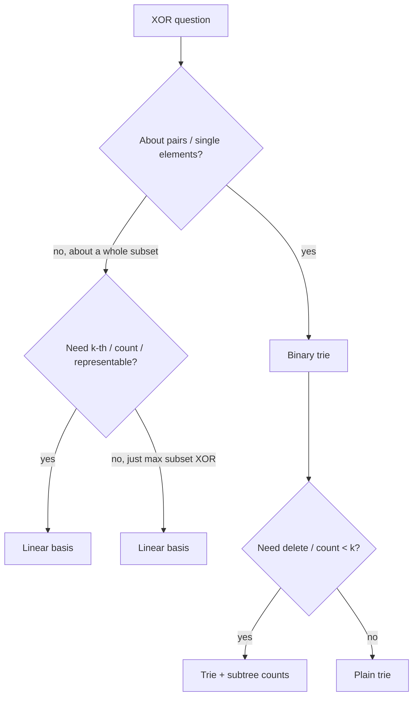

# Binary Trie & XOR Linear Basis — Middle Level

> **One-line summary:** Beyond the basic max-XOR-pair walk, the binary trie with **subtree counts** answers ranged counting (pairs with XOR `< k`, XOR in `[lo, hi)`) and supports **deletion**; the **XOR linear basis** is the algebraic alternative that gives maximum/minimum/k-th/count of *subset* XORs in `O(B)` time and `O(B)` space. Knowing when to reach for the trie versus the basis is the core skill of this level.

---

## Table of Contents

1. [Introduction](#introduction)
2. [Deeper Concepts](#deeper-concepts)
3. [Comparison with Alternatives](#comparison-with-alternatives)
4. [Advanced Patterns](#advanced-patterns)
5. [Counting Variants on the Trie](#counting-variants-on-the-trie)
6. [The XOR Linear Basis Operations](#the-xor-linear-basis-operations)
7. [Code Examples](#code-examples)
8. [Trie vs Basis: Decision Guide](#trie-vs-basis-decision-guide)
9. [Error Handling](#error-handling)
10. [Performance Analysis](#performance-analysis)
11. [Best Practices](#best-practices)
12. [Visual Animation](#visual-animation)
13. [Summary](#summary)

---

## Introduction

At the junior level we used a binary trie to find the maximum XOR of a pair, and met the linear basis as a teaser. Here we make both tools fully operational. The trie gains **subtree counts** — one integer per node recording how many inserted values pass through it — and that single addition unlocks a whole family of *counting* queries and *deletion*. The basis gains its complete operation set: maximum, minimum, k-th smallest achievable XOR, the count of distinct XORs (`2^rank`), representability testing, and merging two bases.

The central judgment you must develop is *which structure fits the question*. The trie is the tool for questions about **individual stored values and pairs**: "how many values XOR with `x` to less than `k`?", "delete this value", "max XOR of `x` against the current multiset". The basis is the tool for questions about the **XOR span of a whole collection**: "what is the maximum XOR I can build from any subset?", "is `v` achievable?", "how many distinct results exist?". They overlap on a few problems (notably max-XOR), and we will see exactly where.

Throughout, `B` is the fixed bit-width. All structures here are pure integer arithmetic; with `B ≤ 63` everything fits in a 64-bit word with no overflow concerns.

---

## Deeper Concepts

### Subtree counts make the trie a multiset

A plain trie answers membership-shaped questions but cannot delete or count. Add `cnt` to every node: `insert` walks the path incrementing each node's `cnt`; `erase` walks the same path decrementing. A child "exists" for any traversal **iff its `cnt > 0`**. Now the trie faithfully represents a *multiset* of integers — duplicates increment counts rather than creating duplicate paths — and it supports the counting queries below.

### Routing by a threshold `k`

The key counting trick: to count values `y` in the trie with `x ^ y < k`, walk down comparing the desired XOR bit against `k`'s bit at each level. Let `xb = bit i of x` and `kb = bit i of k`.

- If `kb == 1`: every `y` whose XOR bit here is `0` keeps the result `< k` regardless of lower bits — so we can **add the entire count of the child that produces XOR bit 0** (that is `child[xb]`, the same-bit child) and then continue down the child producing XOR bit 1 (`child[1-xb]`) to refine.
- If `kb == 0`: the XOR bit must be `0` to stay `< k`, so we cannot add anything yet; continue down `child[xb]`.

This routes in `O(B)` per query and reuses subtree counts as bulk adders.

### The basis as XOR-Gaussian elimination

Treat each integer as a length-`B` bit vector over GF(2) (the field with two elements; addition is XOR). A **basis** is an array `basis[0..B-1]` where `basis[i]`, if nonzero, has its **highest set bit at position `i`**. Inserting `x` reduces it against existing basis vectors (XOR away any high bit already owned); if a leftover high bit `i` has no owner, `x` becomes `basis[i]` and the rank grows. The basis is a reduced echelon-like form of the span.

### Rank, span, and `2^rank`

The number of *distinct* values producible by XORing subsets of the collection equals `2^rank`, where `rank` is the number of nonzero basis vectors. Each basis vector independently doubles the reachable set (include it or not), and independence guarantees no collisions — proved in `professional.md`.

---

## Comparison with Alternatives

### Trie vs sorting/hashing for max XOR pair

| Approach | Time | Space | Notes |
|----------|------|-------|-------|
| Brute force all pairs | O(n²) | O(1) | Simple; only for tiny `n`. |
| Binary trie | **O(n·B)** | O(n·B) | Standard for max XOR pair / queries. |
| Bitwise divide (prefix sets) | O(n·B) | O(n) | Hash-set per bit; clever, less general. |
| Linear basis | O(n·B) build | **O(B)** | Solves *subset* XOR, not pair XOR. |

### Trie vs basis: what each can and cannot do

| Capability | Trie (+counts) | Linear basis |
|------------|----------------|--------------|
| Max XOR of a *pair* | yes | no (it answers subset, not pair) |
| Max XOR of `x` vs set | yes | no |
| Count pairs with XOR < k | yes | no |
| Delete an element | yes | no (basis is not a multiset) |
| Max XOR of any *subset* | no (directly) | yes |
| k-th smallest subset XOR | no | yes |
| Count distinct subset XORs | no | yes (`2^rank`) |
| Memory | O(n·B) | O(B) |

### When to prefer which

Use the **trie** whenever the question is about the *elements themselves* or *pairs of them*, or requires deletion/membership. Use the **basis** whenever the question is about the *XOR span* of the whole set (subsets), where individual identities are irrelevant. If both could apply (rare — only pure max-XOR-pair-vs-subset cases overlap), pick by memory budget and by whether you need *pairs* (trie) or *subsets* (basis).

---

## Advanced Patterns

### Pattern: Count pairs with XOR < k

**Intent:** Given an array, count unordered pairs `(i, j)` with `nums[i] ^ nums[j] < k`. Insert numbers incrementally; before inserting `nums[i]`, add the count of earlier numbers `y` with `nums[i] ^ y < k`.

### Pattern: Count values with XOR in a range `[lo, hi)`

**Intent:** `count(x, hi) - count(x, lo)` where `count(x, t)` counts stored `y` with `x ^ y < t`. The same routing function serves both ends.

### Pattern: Deletion-capable max-XOR multiset

**Intent:** Support `insert(v)`, `erase(v)`, and `maxXor(x)` online. The walk treats a child as present only when `cnt > 0`, so erased values automatically vanish from queries.

### Pattern: k-th smallest subset XOR via reduced basis

**Intent:** Reduce the basis to row-echelon form so each pivot bit appears in exactly one vector. Then the i-th smallest XOR (0-indexed) is obtained by reading the bits of `i` and XORing in the corresponding reduced basis vectors from the lowest pivot up — a bijection between `[0, 2^rank)` and the sorted distinct XORs (proof in `professional.md`).

---

## Counting Variants on the Trie

The routing function below counts stored values `y` with `x ^ y < k`. It is the workhorse for all ranged counting.

```text
countLess(x, k):
    node = root; total = 0
    for i = B-1 down to 0:
        if node is null: break
        xb = bit i of x; kb = bit i of k
        if kb == 1:
            # XOR bit 0 keeps us < k for sure: add that whole subtree
            same = child[node][xb]                 # produces XOR bit 0
            if same: total += cnt[same]
            node = child[node][1 - xb]              # refine on XOR bit 1
        else:
            node = child[node][xb]                  # XOR bit must be 0
    return total
```

To count pairs with XOR `< k` over the whole array, insert elements one at a time and accumulate `countLess(nums[i], k)` against the trie of earlier elements. Range counting `[lo, hi)` is `countLess(x, hi) - countLess(x, lo)`.

---

## The XOR Linear Basis Operations

A complete basis supports six operations. All assume `basis[i]` (if nonzero) has highest set bit at position `i`.

| Operation | Idea | Time |
|-----------|------|------|
| `add(x)` | Reduce `x` against basis; install if a new pivot remains. | O(B) |
| `maxXor()` | Greedily XOR in `basis[i]` (high→low) when it raises the result. | O(B) |
| `minXor()` | If a vector reduces the running value, apply it; result is the smallest nonzero span element (or 0 if `0` is representable, i.e. fewer than `n` vectors are independent). | O(B) |
| `kthXor(k)` | On the reduced basis, use bits of `k` to pick pivots; maps `[0, 2^rank)` to sorted distinct XORs. | O(B) |
| `count()` | Distinct achievable XORs = `2^rank`. | O(1) |
| `representable(v)` | Reduce `v` by the basis; representable iff it reduces to `0`. | O(B) |
| `merge(other)` | `add` each nonzero vector of `other` into this basis. | O(B²) |

For `kthXor`, first put the basis into **reduced** form: for each pivot `i`, XOR it into every other vector that has bit `i` set, so each pivot bit appears in exactly one basis vector. Collect the nonzero pivots into a list sorted by pivot position; then bit `t` of `k` decides whether the `t`-th pivot (from the smallest) is included.

---

## Code Examples

### Count pairs with XOR < k (binary trie + counts)

#### Go

```go
package main

import "fmt"

const B = 20

type Node struct {
	ch  [2]int
	cnt int
}

var tr = []Node{{}} // node 0 = root

func insert(x int) {
	node := 0
	for i := B - 1; i >= 0; i-- {
		b := (x >> i) & 1
		if tr[node].ch[b] == 0 {
			tr = append(tr, Node{})
			tr[node].ch[b] = len(tr) - 1
		}
		node = tr[node].ch[b]
		tr[node].cnt++
	}
}

func countLess(x, k int) int {
	node, total := 0, 0
	for i := B - 1; i >= 0; i-- {
		if node == 0 && i != B-1 {
			break
		}
		xb := (x >> i) & 1
		kb := (k >> i) & 1
		if kb == 1 {
			same := tr[node].ch[xb] // XOR bit 0
			if same != 0 {
				total += tr[same].cnt
			}
			node = tr[node].ch[1-xb]
		} else {
			node = tr[node].ch[xb]
		}
		if node == 0 {
			break
		}
	}
	return total
}

func countPairsXorLess(nums []int, k int) int {
	tr = []Node{{}}
	total := 0
	for _, v := range nums {
		total += countLess(v, k)
		insert(v)
	}
	return total
}

func main() {
	nums := []int{1, 2, 3, 4, 5}
	fmt.Println("pairs with XOR < 5 =", countPairsXorLess(nums, 5))
}
```

#### Java

```java
import java.util.*;

public class CountPairsXorLess {
    static final int B = 20;
    static int[][] ch;
    static int[] cnt;
    static int size;

    static void init(int cap) { ch = new int[cap][2]; cnt = new int[cap]; size = 1; }

    static void insert(int x) {
        int node = 0;
        for (int i = B - 1; i >= 0; i--) {
            int b = (x >> i) & 1;
            if (ch[node][b] == 0) { ch[size][0] = 0; ch[size][1] = 0; cnt[size] = 0; ch[node][b] = size++; }
            node = ch[node][b];
            cnt[node]++;
        }
    }

    static long countLess(int x, int k) {
        int node = 0; long total = 0;
        for (int i = B - 1; i >= 0; i--) {
            int xb = (x >> i) & 1, kb = (k >> i) & 1;
            if (kb == 1) {
                int same = ch[node][xb];
                if (same != 0) total += cnt[same];
                node = ch[node][1 - xb];
            } else {
                node = ch[node][xb];
            }
            if (node == 0) break;
        }
        return total;
    }

    public static void main(String[] args) {
        int[] nums = {1, 2, 3, 4, 5};
        init(nums.length * B + 5);
        long total = 0;
        for (int v : nums) { total += countLess(v, 5); insert(v); }
        System.out.println("pairs with XOR < 5 = " + total);
    }
}
```

#### Python

```python
B = 20


class CountTrie:
    def __init__(self):
        self.ch = [[0, 0]]
        self.cnt = [0]

    def _new(self):
        self.ch.append([0, 0])
        self.cnt.append(0)
        return len(self.ch) - 1

    def insert(self, x):
        node = 0
        for i in range(B - 1, -1, -1):
            b = (x >> i) & 1
            if self.ch[node][b] == 0:
                self.ch[node][b] = self._new()
            node = self.ch[node][b]
            self.cnt[node] += 1

    def count_less(self, x, k):
        node, total = 0, 0
        for i in range(B - 1, -1, -1):
            xb = (x >> i) & 1
            kb = (k >> i) & 1
            if kb == 1:
                same = self.ch[node][xb]   # XOR bit 0
                if same:
                    total += self.cnt[same]
                node = self.ch[node][1 - xb]
            else:
                node = self.ch[node][xb]
            if node == 0:
                break
        return total


def count_pairs_xor_less(nums, k):
    t = CountTrie()
    total = 0
    for v in nums:
        total += t.count_less(v, k)
        t.insert(v)
    return total


if __name__ == "__main__":
    print("pairs with XOR < 5 =", count_pairs_xor_less([1, 2, 3, 4, 5], 5))
```

### Linear basis: max / min / k-th / count

#### Python

```python
B = 30


class XorBasis:
    def __init__(self):
        self.basis = [0] * B
        self.rank = 0

    def add(self, x):
        for i in range(B - 1, -1, -1):
            if not (x >> i) & 1:
                continue
            if self.basis[i] == 0:
                self.basis[i] = x
                self.rank += 1
                return True
            x ^= self.basis[i]
        return False  # dependent; x reduced to 0

    def max_xor(self, start=0):
        res = start
        for i in range(B - 1, -1, -1):
            if self.basis[i] and (res ^ self.basis[i]) > res:
                res ^= self.basis[i]
        return res

    def min_xor(self):
        # smallest nonzero value if rank == count of inserted independent
        for i in range(B):
            if self.basis[i]:
                return self.basis[i]  # after reduction the lowest pivot is the min nonzero
        return 0

    def count_distinct(self):
        return 1 << self.rank

    def representable(self, v):
        for i in range(B - 1, -1, -1):
            if (v >> i) & 1 and self.basis[i]:
                v ^= self.basis[i]
        return v == 0

    def reduced_list(self):
        # make each pivot bit appear in exactly one vector, then list pivots low->high
        b = self.basis[:]
        for i in range(B):
            if not b[i]:
                continue
            for j in range(B):
                if j != i and b[j] and (b[j] >> i) & 1:
                    b[j] ^= b[i]
        return [b[i] for i in range(B) if b[i]]

    def kth_xor(self, k):
        # k is 0-indexed among distinct achievable XORs (including 0)
        piv = self.reduced_list()
        if k >= (1 << len(piv)):
            return -1
        res = 0
        for t in range(len(piv)):
            if (k >> t) & 1:
                res ^= piv[t]
        return res


if __name__ == "__main__":
    b = XorBasis()
    for v in [3, 10, 5, 25, 2, 8]:
        b.add(v)
    print("rank =", b.rank)
    print("max subset XOR =", b.max_xor())
    print("distinct XORs =", b.count_distinct())
    print("3rd smallest XOR =", b.kth_xor(3))
    print("is 0 representable? ", b.representable(0))  # always True
```

#### Go

```go
package main

import "fmt"

const BB = 30

type Basis struct {
	v    [BB]int
	rank int
}

func (b *Basis) add(x int) bool {
	for i := BB - 1; i >= 0; i-- {
		if (x>>i)&1 == 0 {
			continue
		}
		if b.v[i] == 0 {
			b.v[i] = x
			b.rank++
			return true
		}
		x ^= b.v[i]
	}
	return false
}

func (b *Basis) maxXor() int {
	res := 0
	for i := BB - 1; i >= 0; i-- {
		if b.v[i] != 0 && res^b.v[i] > res {
			res ^= b.v[i]
		}
	}
	return res
}

func (b *Basis) countDistinct() int { return 1 << b.rank }

func main() {
	var b Basis
	for _, v := range []int{3, 10, 5, 25, 2, 8} {
		b.add(v)
	}
	fmt.Println("rank =", b.rank)
	fmt.Println("max subset XOR =", b.maxXor())
	fmt.Println("distinct XORs =", b.countDistinct())
}
```

#### Java

```java
public class XorBasisDemo {
    static final int B = 30;
    static long[] basis = new long[B];
    static int rank = 0;

    static boolean add(long x) {
        for (int i = B - 1; i >= 0; i--) {
            if (((x >> i) & 1) == 0) continue;
            if (basis[i] == 0) { basis[i] = x; rank++; return true; }
            x ^= basis[i];
        }
        return false;
    }

    static long maxXor() {
        long res = 0;
        for (int i = B - 1; i >= 0; i--)
            if (basis[i] != 0 && (res ^ basis[i]) > res) res ^= basis[i];
        return res;
    }

    public static void main(String[] args) {
        for (long v : new long[]{3, 10, 5, 25, 2, 8}) add(v);
        System.out.println("rank = " + rank);
        System.out.println("max subset XOR = " + maxXor());
        System.out.println("distinct XORs = " + (1L << rank));
    }
}
```

**Run:** `go run main.go` | `javac *.java && java <Class>` | `python file.py`

---

## Trie vs Basis: Decision Guide



A quick checklist:

- The word "**pair**" or "two elements" → trie.
- The word "**subset**" or "any combination" → basis.
- "**delete**", "**count how many**", "**range**" → trie with counts.
- "**k-th**", "**distinct**", "**representable**", "**merge**" → basis.

---

## Error Handling

| Error | Cause | Fix |
|-------|-------|-----|
| Negative pair count | `countLess` adds the wrong child or double counts. | Add the *same-bit* child (XOR bit 0) only when `kb == 1`, then descend the other. |
| Delete underflow | Erasing a value never inserted. | Guard with a membership check; counts must stay `≥ 0`. |
| Basis `kthXor` wrong order | Used un-reduced basis. | Reduce to echelon form so each pivot bit is unique before indexing. |
| `min_xor` returns 0 unexpectedly | `0` is representable when fewer vectors are independent than inserted. | The minimum *over all subsets* (incl. empty) is always 0; ask for min *nonzero* explicitly. |
| Merge loses rank | Added raw vectors without reduction. | Use `add` (which reduces) for each vector of the other basis. |
| Count off by `2^0` | Forgot the empty subset (value 0). | `2^rank` counts include 0; subtract 1 if you must exclude it. |

---

## Performance Analysis

- **Trie counting** is `O(B)` per query, `O(n·B)` for a full pass; memory is `O(n·B)` nodes (each value adds ≤ `B`).
- **Basis** is `O(B)` per `add`/`max`/`min`/`representable`, `O(B²)` for `reduce`/`merge`, and just `O(B)` memory regardless of `n`. This is the basis's killer advantage for streaming.
- For `B = 30` and `n = 10^6`, the trie holds up to `3·10^7` node slots — sizable; array-pooled nodes (see `senior.md`) are essential.
- The basis processes a stream of a billion numbers in `O(B)` memory — it never grows past `B` vectors.

---

## Best Practices

- Pick the structure by the *question type*, not by habit; the decision guide above resolves most cases.
- Always store subtree counts if deletion or counting is even possible later — retrofitting mid-problem is bug-prone.
- For `kthXor`, keep a separate `reduced` step and cache the pivot list; do not re-reduce per query.
- Validate both structures against brute force (`O(n²)` pairs, `O(2^n)` subsets) on small random inputs.
- Document the bit-width `B` and the meaning of "node 0 = root, 0 = no child" sentinel conventions clearly.

---

## Visual Animation

> See [`animation.html`](./animation.html) for an interactive visualization.
>
> The animation demonstrates:
> - Building the trie with per-node counts as numbers are inserted
> - The greedy opposite-bit query walk highlighting the chosen path and the running XOR
> - A basis mode showing each inserted value reduced against existing pivots until it installs a new pivot or vanishes
> - Step / Run / Reset controls

---

## Summary

Adding subtree counts turns the binary trie into a full multiset that supports deletion and a family of ranged counting queries — most importantly "count pairs with XOR `< k`" via threshold routing that uses whole subtrees as bulk adders. The XOR linear basis is the algebraic counterpart: a reduced set of at most `B` independent vectors over GF(2) that answers maximum, minimum, k-th smallest, count (`2^rank`), representability, and merge — all in `O(B)` time and space. The trie owns questions about elements and pairs (and deletion); the basis owns questions about the XOR span of subsets. Match the structure to the question, store counts when you might delete, reduce the basis before k-th queries, and test both against brute force.
