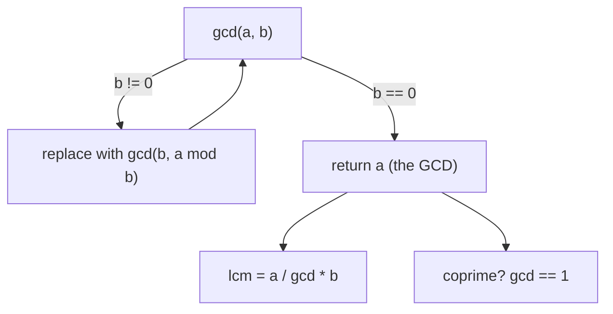

# GCD and LCM (The Euclidean Algorithm) — Junior Level

> **One-line summary:** The greatest common divisor of two numbers is found by the rule `gcd(a, b) = gcd(b, a mod b)`, repeated until the second number becomes `0`; the last non-zero value is the answer. It runs in `O(log min(a, b))` steps, and the least common multiple follows from `lcm(a, b) = a / gcd(a, b) * b`.

---

## Table of Contents

1. [Introduction](#introduction)
2. [Prerequisites](#prerequisites)
3. [Glossary](#glossary)
4. [Core Concepts](#core-concepts)
5. [Big-O Summary](#big-o-summary)
6. [Real-World Analogies](#real-world-analogies)
7. [Pros & Cons](#pros--cons)
8. [Step-by-Step Walkthrough](#step-by-step-walkthrough)
9. [Code Examples](#code-examples)
10. [Coding Patterns](#coding-patterns)
11. [Error Handling](#error-handling)
12. [Performance Tips](#performance-tips)
13. [Best Practices](#best-practices)
14. [Edge Cases & Pitfalls](#edge-cases--pitfalls)
15. [Common Mistakes](#common-mistakes)
16. [Cheat Sheet](#cheat-sheet)
17. [Visual Animation](#visual-animation)
18. [Summary](#summary)
19. [Further Reading](#further-reading)

---

## Introduction

Suppose someone hands you two integers — say `48` and `18` — and asks: *"What is the largest number that divides both of them exactly?"* That number is the **greatest common divisor** (GCD). For `48` and `18` the answer is `6`, because `6` divides `48` (`48 = 6 × 8`) and `6` divides `18` (`18 = 6 × 3`), and no larger number divides both.

The obvious way to find it is to list every divisor of each number and take the biggest one they share. That works, but it is slow: for two numbers near `10^18` you would test billions of candidates. There is a far better way, discovered over two thousand years ago and still the standard today — the **Euclidean algorithm**:

> **`gcd(a, b) = gcd(b, a mod b)`**, and `gcd(a, 0) = a`.

That single recurrence shrinks the problem dramatically at each step. To compute `gcd(48, 18)`:

```
gcd(48, 18) = gcd(18, 48 mod 18) = gcd(18, 12)
            = gcd(12, 18 mod 12) = gcd(12, 6)
            = gcd(6,  12 mod 6)  = gcd(6, 0)
            = 6
```

Three steps and we are done. The remainder gets at least *halved* every two steps (we will see why), so the whole thing finishes in **`O(log min(a, b))`** operations. Even for numbers with hundreds of digits this is essentially instant.

Hand-in-hand with the GCD comes its twin, the **least common multiple** (LCM): the smallest positive number that *both* `a` and `b` divide into. The two are tied together by the beautiful identity

```
gcd(a, b) × lcm(a, b) = |a × b|
```

so once you have the GCD, the LCM is a single division and multiplication away — with one important ordering trick (`a / gcd * b`, not `a * b / gcd`) to avoid overflow. We will cover that carefully.

This topic is foundational. GCD and LCM sit underneath fraction reduction, modular inverses, the existence of solutions to linear Diophantine equations, cycle and period problems, and a huge fraction of competitive-programming and cryptography math. The **extended Euclidean algorithm**, which also finds the Bezout coefficients `x, y` with `a·x + b·y = gcd(a, b)`, is the natural sequel — covered in sibling topic `06-extended-euclidean`. Here we focus on the plain GCD/LCM and the recurrence that powers them.

---

## Prerequisites

Before reading this file you should be comfortable with:

- **Integer division and remainder** — `a / b` (integer quotient) and `a mod b` (remainder), and the fact that `0 ≤ (a mod b) < b` for positive `b`.
- **Divisibility** — "`d` divides `n`" (written `d | n`) means `n = d · k` for some integer `k`, i.e. `n mod d == 0`.
- **Basic recursion or loops** — the Euclidean algorithm is naturally written either recursively or as a small `while` loop.
- **Big-O notation** — `O(log n)` and why logarithmic is fast.
- **Integer overflow awareness** — multiplying two large 64-bit numbers can exceed the type's range; this matters for LCM.

Optional but helpful:

- A glance at **prime factorization**, since GCD and LCM have a clean meaning in terms of shared prime factors (we use it for intuition, not for the algorithm).
- Familiarity with **bit operations** (`>>`, `&`), used by the faster binary GCD variant introduced later.

---

## Glossary

| Term | Meaning |
|------|---------|
| **Divisor / factor** | `d` is a divisor of `n` if `n mod d == 0`. Every positive `n` has `1` and `n` as divisors. |
| **Common divisor** | A number that divides *both* `a` and `b`. `1` is always a common divisor. |
| **GCD (greatest common divisor)** | The largest common divisor of `a` and `b`. Also called HCF (highest common factor). |
| **Multiple** | `m` is a multiple of `n` if `m mod n == 0`. |
| **Common multiple** | A number that *both* `a` and `b` divide. `a·b` is always a common multiple. |
| **LCM (least common multiple)** | The smallest positive common multiple of `a` and `b`. |
| **Coprime / relatively prime** | `a` and `b` are coprime if `gcd(a, b) = 1` — they share no common factor besides `1`. |
| **`a mod b`** | The remainder when `a` is divided by `b` (`0 ≤ a mod b < b` for `b > 0`). |
| **Euclidean algorithm** | The procedure `gcd(a, b) = gcd(b, a mod b)` repeated until `b = 0`. |
| **Bezout coefficients** | Integers `x, y` with `a·x + b·y = gcd(a, b)` — produced by the *extended* algorithm. |
| **Stein's / binary GCD** | A GCD variant using only subtraction and bit shifts (no division). |

---

## Core Concepts

### 1. What the GCD actually is

The GCD of `a` and `b` is the largest integer dividing both. In terms of prime factorization, if

```
a = 2^3 · 3^1 · 5^0 · …      b = 2^1 · 3^2 · 5^1 · …
```

then the GCD takes the **minimum** exponent of each prime, and the LCM takes the **maximum**:

```
gcd(a, b) = 2^min(3,1) · 3^min(1,2) · 5^min(0,1) · … = 2^1 · 3^1 = 6
lcm(a, b) = 2^max(3,1) · 3^max(1,2) · 5^max(0,1) · … = 2^3 · 3^2 · 5^1 = 360
```

This "min and max of exponents" view is the cleanest *definition*, but factorizing large numbers is slow. The Euclidean algorithm computes the GCD **without ever factorizing**, which is exactly why it is fast.

### 2. The Euclidean recurrence

The whole algorithm rests on one fact:

> **Every common divisor of `a` and `b` is also a common divisor of `b` and `a mod b`, and vice versa.**

Because the *set* of common divisors is unchanged, the *greatest* of them is unchanged too:

```
gcd(a, b) = gcd(b, a mod b)
```

Why does swapping `a` for `a mod b` preserve common divisors? Write `a = q·b + r` where `r = a mod b`. If `d` divides both `a` and `b`, then it divides `a − q·b = r`, so `d` divides `b` and `r`. Conversely, if `d` divides `b` and `r`, it divides `q·b + r = a`. So the common divisors of `(a, b)` and of `(b, r)` are *identical sets*. The full proof lives in [`professional.md`](./professional.md), but that paragraph is the heart of it.

### 3. The base case and termination

We stop when the second argument hits `0`:

```
gcd(a, 0) = a
```

This is correct because *every* number divides `0` (since `0 = d·0`), so the common divisors of `a` and `0` are just the divisors of `a`, the greatest of which is `a` itself. Termination is guaranteed because the remainder strictly decreases at each step (`0 ≤ a mod b < b`), so the second argument forms a strictly decreasing sequence of non-negative integers, which must reach `0`.

### 4. Why it is `O(log)` fast

The remainder doesn't just shrink — it shrinks *fast*. A key lemma: after **two** steps of the algorithm, the larger value is reduced to **less than half** its original size. So the number of steps is at most about `2 · log₂(min(a, b))`. For `a, b < 10^18` that is fewer than ~90 iterations. The provable worst case happens for **consecutive Fibonacci numbers** — they make the algorithm take the most steps for their size (Lamé's theorem), and even then it is logarithmic. We explore this in [`professional.md`](./professional.md).

### 5. LCM from GCD (overflow-safe)

The LCM is *derived* from the GCD via `gcd(a,b) · lcm(a,b) = |a·b|`, so:

```
lcm(a, b) = |a · b| / gcd(a, b)
```

But `a · b` may overflow even when the LCM itself fits. **Divide first**: since `gcd(a, b)` always divides `a`, compute

```
lcm(a, b) = (a / gcd(a, b)) · b      // divide before multiply
```

This keeps the intermediate value smaller and avoids needless overflow. (By convention `lcm(a, 0) = 0`.)

### 6. Properties worth memorizing

```
gcd(a, 0) = a                 gcd(a, a) = a
gcd(a, b) = gcd(b, a)         gcd(a, 1) = 1
gcd(a, b) = gcd(|a|, |b|)     gcd(c·a, c·b) = c · gcd(a, b)   (distributive)
```

The distributive property `gcd(c·a, c·b) = c · gcd(a, b)` is especially handy. And the deep fact — **Bezout's identity** — says `gcd(a, b)` is the *smallest positive value* of `a·x + b·y` over all integers `x, y`. That preview matters because it explains *why* a modular inverse exists exactly when `gcd(a, m) = 1`.

---

## Big-O Summary

| Operation | Time | Space | Notes |
|-----------|------|-------|-------|
| `gcd(a, b)` (Euclidean) | **O(log min(a, b))** | O(1) iterative | The standard method. |
| `gcd(a, b)` (binary / Stein) | O(log² max(a,b)) bit-ops, O(log) on machine ints | O(1) | Division-free; uses shifts. |
| `lcm(a, b)` | O(log min(a, b)) | O(1) | One GCD plus a divide and multiply. |
| `gcd` of an array of `n` items | O(n · log(max)) | O(1) | Fold the pairwise GCD across the array. |
| `lcm` of an array of `n` items | O(n · log(max)) | O(1) | Fold pairwise; can overflow — use mod or big ints. |
| Naive "list all divisors" GCD | O(min(a, b)) | O(1) | Far too slow; avoid. |
| Factorization-based GCD | O(√max) per factorization | O(1) | Slower and unnecessary. |

The headline number is **`O(log min(a, b))`** — logarithmic in the size of the smaller input. That is what makes GCD trivial even for astronomically large numbers.

---

## Real-World Analogies

| Concept | Analogy |
|---------|---------|
| GCD | The largest square tile that can perfectly cover a rectangular floor of size `a × b` with no cutting. For `48 × 18`, the biggest such tile is `6 × 6`. |
| Euclidean step | Lay the biggest squares you can along the short side, then repeat on the leftover strip — each strip is smaller, and the last perfect square is the GCD. |
| LCM | Two gears with `a` and `b` teeth: the LCM is the number of teeth that must pass before both gears return to their starting alignment. |
| Coprime (`gcd = 1`) | Two gears whose tooth counts share no factor — they cycle through *every* relative position before realigning. |
| `gcd(a, 0) = a` | A strip of length `a` and a strip of length `0`: the biggest tile fitting both is just `a`. |
| Fibonacci worst case | The "stubbornest" pair of numbers — like a rectangle whose proportions force you to peel off only one square at a time, the slowest the algorithm ever gets. |

Where the analogy breaks: the tiling picture is exact for the *geometric* GCD but doesn't directly show *why* it is logarithmic — for that you need the "remainder halves every two steps" argument, not the picture.

---

## Pros & Cons

| Pros | Cons |
|------|------|
| Euclidean GCD is `O(log min(a,b))` — essentially instant for any machine integer. | The LCM can overflow even when both inputs fit; needs careful ordering or big integers. |
| Needs no factorization — works on huge numbers where factoring is infeasible. | Plain division-based GCD can be slightly slower than binary GCD on hardware where division is costly. |
| Tiny, branch-light code; trivial to write recursively or iteratively. | Sign and zero handling (`gcd(0, 0)`, negatives) is easy to get subtly wrong. |
| Generalizes directly to arrays and to the extended algorithm (Bezout, inverses). | Recursive form risks (very shallow) stack use; iterative form is preferred in production. |
| Underpins fraction reduction, modular inverses, Diophantine equations, CRT. | Array LCM grows explosively — must be taken modulo a prime or with big integers. |

**When to use:** reducing fractions, testing coprimality, computing modular inverse existence, solving linear Diophantine equations, simplifying ratios, period/cycle alignment problems, and as a building block for the extended algorithm and CRT.

**When NOT to use:** when you actually need the *prime factorization* (GCD doesn't give it), or when the LCM clearly overflows and the problem doesn't specify a modulus or big-integer type.

---

## Step-by-Step Walkthrough

Let us compute `gcd(48, 18)` and then `lcm(48, 18)` by hand.

**GCD via the Euclidean recurrence.** Each line replaces `(a, b)` with `(b, a mod b)`:

```
Step 0:  gcd(48, 18)              a=48, b=18, 48 mod 18 = 12
Step 1:  gcd(18, 12)              a=18, b=12, 18 mod 12 = 6
Step 2:  gcd(12, 6)               a=12, b=6,  12 mod 6  = 0
Step 3:  gcd(6, 0)   → b is 0  →  answer = 6
```

The remainders `12, 6, 0` strictly decrease, guaranteeing we reach `0`. The last non-zero second argument (here `6`) is the GCD. Notice it took only 3 divisions for numbers up to `48` — logarithmic, not linear.

**The geometric view.** Picture a `48 × 18` rectangle. Lay down as many `18 × 18` squares as fit along the long side: two of them cover `36`, leaving a `12 × 18` strip. Now fill that with `12 × 12` squares: one fits, leaving `12 × 6`. Fill with `6 × 6` squares: exactly two fit, nothing left over. The side of that final perfect square — `6` — is the GCD. Each "leftover strip" is exactly the `a mod b` of the algorithm.

**LCM from the GCD (overflow-safe order).**

```
gcd(48, 18) = 6
lcm(48, 18) = (48 / 6) * 18 = 8 * 18 = 144
```

Check: `144 / 48 = 3` and `144 / 18 = 8`, both whole — `144` is indeed a common multiple, and it is the smallest. Note we divided *first* (`48 / 6 = 8`) before multiplying by `18`; computing `48 * 18 = 864` first would also work here, but on large inputs the divide-first order is what prevents overflow.

**Verify the identity:** `gcd · lcm = 6 · 144 = 864 = 48 · 18`. ✓

---

## Code Examples

### Example: GCD and LCM of two numbers

This computes `gcd(a, b)` iteratively (the production-preferred form) and derives `lcm(a, b)` with the overflow-safe ordering.

#### Go

```go
package main

import "fmt"

// gcd returns the greatest common divisor of a and b (a, b >= 0).
func gcd(a, b int64) int64 {
	for b != 0 {
		a, b = b, a%b // gcd(a, b) = gcd(b, a mod b)
	}
	return a // base case: gcd(a, 0) = a
}

// lcm returns the least common multiple; divide before multiply to limit overflow.
func lcm(a, b int64) int64 {
	if a == 0 || b == 0 {
		return 0 // convention: lcm with 0 is 0
	}
	return a / gcd(a, b) * b
}

func main() {
	fmt.Println(gcd(48, 18)) // 6
	fmt.Println(lcm(48, 18)) // 144
	fmt.Println(gcd(17, 5))  // 1 (coprime)
	fmt.Println(gcd(0, 9))   // 9
}
```

#### Java

```java
public class GcdLcm {
    // greatest common divisor (a, b >= 0)
    static long gcd(long a, long b) {
        while (b != 0) {
            long t = a % b; // gcd(a, b) = gcd(b, a mod b)
            a = b;
            b = t;
        }
        return a; // gcd(a, 0) = a
    }

    // least common multiple; divide before multiply to limit overflow
    static long lcm(long a, long b) {
        if (a == 0 || b == 0) return 0;
        return a / gcd(a, b) * b;
    }

    public static void main(String[] args) {
        System.out.println(gcd(48, 18)); // 6
        System.out.println(lcm(48, 18)); // 144
        System.out.println(gcd(17, 5));  // 1
        System.out.println(gcd(0, 9));   // 9
    }
}
```

#### Python

```python
def gcd(a, b):
    """Greatest common divisor of a and b (non-negative)."""
    while b:
        a, b = b, a % b   # gcd(a, b) = gcd(b, a mod b)
    return a               # gcd(a, 0) = a


def lcm(a, b):
    """Least common multiple; divide before multiply."""
    if a == 0 or b == 0:
        return 0
    return a // gcd(a, b) * b


if __name__ == "__main__":
    print(gcd(48, 18))  # 6
    print(lcm(48, 18))  # 144
    print(gcd(17, 5))   # 1 (coprime)
    print(gcd(0, 9))    # 9
    # Python's standard library already has both:
    import math
    print(math.gcd(48, 18), math.lcm(48, 18))  # 6 144
```

**What it does:** computes the GCD by the Euclidean loop and the LCM by the overflow-safe `a / gcd * b`.
**Run:** `go run main.go` | `javac GcdLcm.java && java GcdLcm` | `python gcdlcm.py`

---

## Coding Patterns

### Pattern 1: Recursive GCD (the textbook one-liner)

**Intent:** The recurrence translates to a one-line recursive function — great for clarity, fine for machine integers since the depth is `O(log n)`.

```python
def gcd(a, b):
    return a if b == 0 else gcd(b, a % b)
```

The iterative version is preferred in production (no stack frames), but this recursive form is the clearest statement of the recurrence and the one to write on a whiteboard.

### Pattern 2: GCD of an array (fold)

**Intent:** The GCD of many numbers is the running pairwise GCD: `gcd(x0, x1, x2, …)`. Because `gcd(g, 0) = g`, you can start the accumulator at `0`.

```python
from functools import reduce

def gcd_all(nums):
    return reduce(gcd, nums, 0)   # start at 0; gcd(0, x) = x
```

An early exit helps: once the running GCD hits `1`, it can never decrease further, so you can stop.

### Pattern 2b: LCM of an array (fold from 1)

**Intent:** The LCM of many numbers is the running pairwise LCM. The identity for the fold is `1` (since `lcm(1, x) = x`). Beware: the value grows fast and can overflow — use big integers if it might.

```python
from functools import reduce

def lcm_all(nums):
    return reduce(lcm, nums, 1)   # identity is 1 for lcm
# lcm_all([2, 3, 4]) == 12
```

Unlike the GCD fold there is no early exit — the LCM only grows, so you must process every element (and watch the magnitude).

### Pattern 3: Coprimality test

**Intent:** "Are `a` and `b` relatively prime?" is just `gcd(a, b) == 1`. This is the existence test for a modular inverse of `a` mod `b`.

```python
def coprime(a, b):
    return gcd(a, b) == 1
```



---

## Error Handling

| Error | Cause | Fix |
|-------|-------|-----|
| Wrong sign in result | Negative inputs; `%` can yield negatives in Go/Java. | Take `abs` of inputs first, or normalize the final result to non-negative. |
| Overflow computing LCM | Used `a * b / gcd` and `a * b` overflowed. | Use `a / gcd * b` (divide first); or use a wider type / big integers. |
| Division by zero | Called `lcm` with a `0` input and divided by it, or computed `a % b` with `b = 0`. | Guard: define `lcm(_, 0) = 0`; the GCD loop stops *before* dividing by `0`. |
| Infinite loop | Wrote `gcd(a, b)` but never reduced `b` (e.g., swapped the arguments wrong). | Ensure each step does `a, b = b, a % b`; the remainder strictly decreases. |
| `gcd(0, 0)` surprise | Both inputs zero. | By convention `gcd(0, 0) = 0`; make sure your code returns `0`, not an error. |
| Off-by-one in array fold | Started the accumulator at `1` instead of `0` for GCD. | Start GCD folds at `0` (identity for gcd); start LCM folds at `1`. |

---

## Performance Tips

- **Prefer the iterative loop** over recursion in hot paths — it avoids function-call overhead and any (small) stack-depth risk.
- **Use the language's built-in** when available: Python's `math.gcd`/`math.lcm`, C++'s `std::gcd`/`std::lcm`, Java's `BigInteger.gcd`. They are tested and often optimized.
- **Early-exit array GCD at `1`** — once the running GCD is `1`, no later element can lower it, so you can break immediately.
- **Divide before multiplying** in LCM (`a / gcd * b`) — smaller intermediates mean fewer overflows and no extra cost.
- **Binary GCD (Stein's)** replaces division with shifts and subtraction; on architectures where integer division is expensive it can be faster (covered in [`middle.md`](./middle.md)).
- **Pass the smaller value as `b`** if you want the first `mod` to do the most work — though the algorithm self-corrects after one step regardless of order.

---

## Best Practices

- Always normalize inputs to **non-negative** before computing the GCD, then reason about signs explicitly. `gcd(a, b) = gcd(|a|, |b|)`.
- Treat `gcd(a, 0) = a` and `lcm(_, 0) = 0` as deliberate, documented conventions — write a comment so the next reader knows it is intentional.
- For LCM, **always** divide by the GCD before multiplying, and consider whether the result can overflow your integer type at all.
- Prefer the **iterative** GCD in libraries; reserve the recursive form for teaching and quick prototypes.
- When taking the GCD/LCM of a whole array, fold with the right identity (`0` for GCD, `1` for LCM) and add the `==1` early exit for GCD.
- If the problem asks for `lcm` of many numbers "modulo `p`", remember you **cannot** simply reduce intermediate LCMs mod `p` and keep dividing — handle it with prime-factor exponents or big integers (see [`middle.md`](./middle.md)).

---

## Edge Cases & Pitfalls

- **`gcd(a, 0) = a`** and **`gcd(0, 0) = 0`** — the loop handles both; just don't special-case them wrong.
- **Negative inputs** — `gcd(-48, 18)` should be `6`. In Go/Java the `%` operator can return a negative remainder, so the loop still terminates but you should `abs` the final answer (or the inputs).
- **`lcm` with a zero operand** — define it as `0`; do not divide by a zero GCD.
- **One argument is `1`** — `gcd(a, 1) = 1` always; `lcm(a, 1) = a`.
- **Equal arguments** — `gcd(a, a) = a` and `lcm(a, a) = a`.
- **Overflow in LCM** — even `lcm(10^9, 10^9 - 1)` is about `10^18`, near the edge of a signed 64-bit integer; an *array* LCM overflows almost immediately.
- **The Fibonacci worst case** — `gcd(F(n+1), F(n))` takes the most steps for inputs that size, but is still logarithmic; it is the stress test, not a failure case.
- **Both inputs equal** — `gcd(a, a) = a` is reached after a single `mod` (`a mod a = 0`), so equal inputs are the *fastest* case, the opposite extreme from Fibonacci pairs.
- **One input a multiple of the other** — `gcd(a, b)` with `b | a` finishes in one step (`a mod b = 0`), returning `b`. Common in practice and trivially fast.

---

## Common Mistakes

1. **Using `a * b / gcd` for LCM** — the product `a * b` overflows before the division. Always divide first: `a / gcd * b`.
2. **Starting an array GCD fold at `1`** — that forces the result to `1`. The identity for GCD is `0` (since `gcd(0, x) = x`).
3. **Forgetting negative remainders** in Go/Java — the algorithm still terminates, but the returned GCD can be negative; normalize with `abs`.
4. **Confusing GCD and LCM directions** — GCD takes the *minimum* prime exponents (it shrinks), LCM the *maximum* (it grows). Mixing them up flips the answer.
5. **Reducing LCM modulo `p` naively across an array** — you cannot divide by a GCD under a modulus unless you use modular inverses; this silently corrupts the answer.
6. **Assuming `gcd(0, 0)` is undefined or an error** — the standard convention is `0`; library functions return `0`.
7. **Listing divisors to find the GCD** — `O(min(a,b))` and hopeless for large numbers; use the Euclidean recurrence.

---

## Cheat Sheet

| Question | Tool | Formula |
|----------|------|---------|
| Greatest common divisor | Euclidean loop | `while b: a, b = b, a%b; return a` |
| Base case | — | `gcd(a, 0) = a`, `gcd(0, 0) = 0` |
| Least common multiple | derive from GCD | `lcm(a,b) = a / gcd(a,b) * b` |
| Are they coprime? | GCD test | `gcd(a, b) == 1` |
| GCD of an array | fold from `0` | `reduce(gcd, arr, 0)` |
| LCM of an array | fold from `1` | `reduce(lcm, arr, 1)` (watch overflow) |
| Reduce a fraction `a/b` | divide by GCD | `g = gcd(a,b); (a/g, b/g)` |
| Key identity | — | `gcd(a,b) * lcm(a,b) = |a*b|` |
| Distributive law | — | `gcd(c·a, c·b) = c · gcd(a, b)` |

Core algorithm:

```
gcd(a, b):
    while b != 0:
        a, b = b, a mod b      # remainder strictly decreases
    return a                   # last non-zero value
# cost: O(log min(a, b))

lcm(a, b):
    if a == 0 or b == 0: return 0
    return a / gcd(a, b) * b    # divide before multiply
```

---

## Visual Animation

> See [`animation.html`](./animation.html) for an interactive visualization.
>
> The animation demonstrates:
> - The Euclidean recurrence `a, b = b, a mod b` step by step, with the shrinking pair shown each iteration
> - A geometric "tile the rectangle with squares" view, peeling off the largest squares until a perfect square (the GCD) remains
> - The strictly decreasing remainder sequence that guarantees termination
> - Step / Run / Reset controls and editable `a`, `b` to try your own pairs

---

## Summary

The greatest common divisor is the largest number dividing both inputs, and the **Euclidean algorithm** finds it with one recurrence: `gcd(a, b) = gcd(b, a mod b)`, stopping at `gcd(a, 0) = a`. It works because replacing `a` with `a mod b` never changes the *set* of common divisors, and it is **`O(log min(a, b))`** because the remainder shrinks by more than half every two steps (with consecutive Fibonacci numbers the provable worst case). The least common multiple follows from the identity `gcd(a,b) · lcm(a,b) = |a·b|`, computed overflow-safely as `a / gcd(a,b) * b`. Master this tiny loop and you have the engine behind fraction reduction, coprimality tests, modular inverses, and linear Diophantine equations — with the extended algorithm in `06-extended-euclidean` as the natural next step.

---

## Recap Checklist

Before moving on, make sure you can do each of these from memory:

- Write the iterative GCD loop `while b: a, b = b, a % b; return a` and explain why it terminates (the remainder strictly decreases).
- State the base case `gcd(a, 0) = a` and the convention `gcd(0, 0) = 0`.
- Derive `lcm(a, b) = a / gcd(a, b) * b` from the identity `gcd · lcm = |a·b|`, and explain why you divide *before* multiplying.
- Test coprimality with `gcd(a, b) == 1`.
- Fold an array's GCD from `0` (with early exit at `1`) and its LCM from `1`.
- Reduce a fraction by dividing numerator and denominator by their GCD.
- Recognize that the worst case is consecutive Fibonacci numbers, and that it is still `O(log min(a, b))`.

If any of these is shaky, re-read the [Core Concepts](#core-concepts) and [Step-by-Step Walkthrough](#step-by-step-walkthrough) sections — they are the load-bearing parts of this file.

---

## Further Reading

- *Introduction to Algorithms* (CLRS), Chapter 31 — number-theoretic algorithms, GCD, and the extended Euclidean algorithm.
- Sibling topic `06-extended-euclidean` — Bezout coefficients and modular inverses.
- Sibling topic `02-modular-arithmetic` — where coprimality and inverses are used.
- Euclid's *Elements*, Book VII, Propositions 1–2 — the original "anthyphairesis" (repeated subtraction) GCD.
- cp-algorithms.com — "Euclidean algorithm for computing the GCD" and "Binary Exponentiation".
- Knuth, *The Art of Computer Programming*, Vol. 2 — Euclid's algorithm, the binary GCD, and Lamé's theorem.