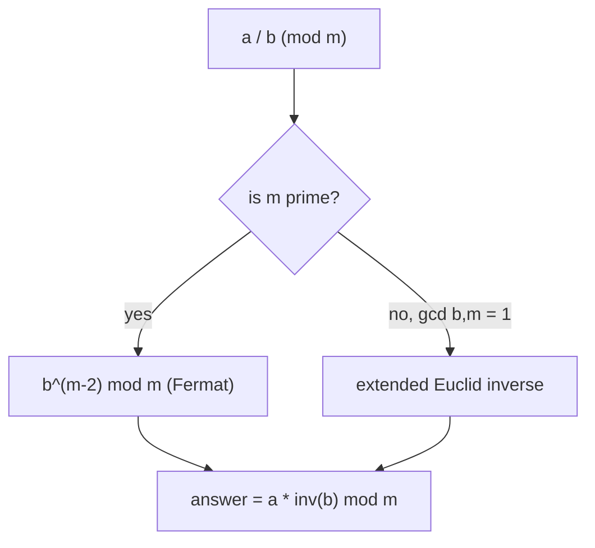

# Modular Arithmetic — Junior Level

> **One-line summary:** Modular arithmetic is "clock arithmetic": every number is replaced by its remainder after dividing by a fixed modulus `m`. Addition, subtraction, and multiplication all behave consistently under "take the remainder", which lets you keep numbers small and avoid overflow — as long as you remember the safe patterns for negatives and for multiplying big numbers.

---

## Table of Contents

1. [Introduction](#introduction)
2. [Prerequisites](#prerequisites)
3. [Glossary](#glossary)
4. [Core Concepts](#core-concepts)
5. [Big-O Summary](#big-o-summary)
6. [Real-World Analogies](#real-world-analogies)
7. [Pros & Cons](#pros--cons)
8. [Step-by-Step Walkthrough](#step-by-step-walkthrough)
9. [Code Examples](#code-examples)
10. [Coding Patterns](#coding-patterns)
11. [Error Handling](#error-handling)
12. [Performance Tips](#performance-tips)
13. [Best Practices](#best-practices)
14. [Edge Cases & Pitfalls](#edge-cases--pitfalls)
15. [Common Mistakes](#common-mistakes)
16. [Cheat Sheet](#cheat-sheet)
17. [Visual Animation](#visual-animation)
18. [Summary](#summary)
19. [Further Reading](#further-reading)

---

## Introduction

Look at a 12-hour clock. If it is 10 o'clock now and you wait 5 hours, the clock reads 3 — not 15 — because the hour hand wraps around after 12. We just computed `10 + 5 = 15`, then "wrapped" by subtracting 12 to land on `3`. That wrapping is the whole idea of **modular arithmetic**: we fix a number `m` (here `m = 12`, the **modulus**), and we only ever care about the **remainder** after dividing by `m`.

We write this with the `mod` operator. `15 mod 12 = 3`. More importantly, we say two numbers are **congruent modulo `m`** when they leave the same remainder:

> `a ≡ b (mod m)` means `m` divides `(a − b)` — equivalently, `a` and `b` have the same remainder when divided by `m`.

So `15 ≡ 3 (mod 12)`, `27 ≡ 3 (mod 12)`, and `−9 ≡ 3 (mod 12)` (yes, even negatives) all describe the same "slot" on the clock. The set of all numbers that share a slot is one **residue class**; there are exactly `m` of them: `0, 1, 2, …, m−1`. This finite set of `m` residue classes, together with `+`, `−`, and `×`, forms the **ring `Z/mZ`** (read "Z mod m").

Why does any of this matter for programming? Two huge reasons:

1. **Numbers stay small.** Competitive programming and cryptography routinely ask for answers "modulo `10^9 + 7`" or "modulo `998244353`". Instead of computing an astronomically large exact number, you keep every intermediate value in `[0, m)`, so it always fits in a machine integer.
2. **The arithmetic is *consistent*.** You are allowed to reduce mod `m` at *any* point — before adding, after multiplying, in the middle — and the final remainder is unchanged. This is the property that makes the whole technique usable.

There are exactly three things that trip up beginners, and this file drills all three: the **mod of a negative number** (which many languages get "wrong" by your intuition), **multiplication overflow** (two values under `m` can still overflow when multiplied), and **division** (you cannot just divide — you multiply by a *modular inverse*, covered at the end and in the middle file). Master the safe patterns for these and modular arithmetic becomes a reliable everyday tool.

This topic is the bedrock for almost everything else in number theory: modular exponentiation (sibling `26-binary-exponentiation`), modular inverses via Fermat/Euler (sibling `04-fermat-euler`) and the extended Euclidean algorithm (sibling `06-extended-euclidean-modular-inverse`), the Chinese Remainder Theorem (sibling `05-crt`), and fast `mulmod` via Montgomery reduction (sibling `14-montgomery-multiplication`).

---

## Prerequisites

Before reading this file you should be comfortable with:

- **Integer division and remainder** — the `/` and `%` operators, and the relationship `a = (a / m) * m + (a % m)`.
- **Basic algebra** — what it means for one number to *divide* another, and simple manipulation of `a − b`.
- **Machine integer types** — that a 32-bit `int` overflows past ~`2.1 × 10^9`, and a 64-bit `int64`/`long` past ~`9.2 × 10^18`. This is *why* we reduce mod `m`.
- **Big-O notation** — `O(1)` for a single arithmetic op, `O(log m)` for exponentiation/inverse (referenced, proved in siblings).

Optional but helpful:

- A glance at **prime numbers**, since a *prime* modulus unlocks the simplest inverse formula (Fermat's little theorem).
- Familiarity with **how `%` behaves on negatives** in your language — Go, Java, C, and C++ can return negative remainders; Python always returns non-negative. We handle both.

---

## Glossary

| Term | Meaning |
|------|---------|
| **Modulus `m`** | The fixed divisor we wrap around. The "12" of a 12-hour clock. |
| **Remainder / residue** | The value `a mod m`, always intended to land in `[0, m−1]`. |
| **Congruent (`a ≡ b mod m`)** | `a` and `b` have the same remainder mod `m`; equivalently `m | (a − b)`. |
| **Residue class** | The set of all integers congruent to a given value mod `m` (e.g., `{…, −9, 3, 15, 27, …}` mod 12). |
| **`Z/mZ`** | The ring of the `m` residue classes `{0, 1, …, m−1}` under `+`, `−`, `×` mod `m`. |
| **Reduction** | Replacing a value by its remainder mod `m` (often written `x %= m`). |
| **Modular inverse** | A value `a⁻¹` with `a · a⁻¹ ≡ 1 (mod m)`. Used to "divide". Exists iff `gcd(a, m) = 1`. |
| **Coprime** | `gcd(a, m) = 1`; no common factor other than 1. The condition for an inverse to exist. |
| **Modular exponentiation (modpow)** | Computing `a^b mod m` fast, in `O(log b)` multiplications. See sibling `26-binary-exponentiation`. |
| **`mulmod`** | Computing `(a · b) mod m` *without* overflowing, even when `a·b` exceeds 64 bits. |

---

## Core Concepts

### 1. The Modulus and Reduction

For a fixed modulus `m > 0`, the operation `a mod m` collapses every integer onto one of `m` slots `0, 1, …, m−1`. Visually, the integers are wrapped around a circle of `m` positions, like beads on a loop:

```
m = 5:    … −2 −1  0  1  2  3  4  5  6  7  8 …
slot:     …  3  4  0  1  2  3  4  0  1  2  3 …
```

So `7 mod 5 = 2`, `12 mod 5 = 2`, and (the tricky one) `−2 mod 5 = 3` because `−2` is three steps "before" `0`, which is the same as three steps after.

### 2. Congruence

`a ≡ b (mod m)` is the mathematician's way of saying "same slot". The three equivalent definitions are worth memorizing:

```
a ≡ b (mod m)   ⟺   m divides (a − b)   ⟺   a mod m == b mod m
```

Congruence behaves like equality: it is reflexive (`a ≡ a`), symmetric (`a ≡ b ⟹ b ≡ a`), and transitive (`a ≡ b` and `b ≡ c ⟹ a ≡ c`). That is exactly why we can swap any value for a congruent one mid-computation.

### 3. Addition, Subtraction, Multiplication Are Compatible

The key theorem (proved in `professional.md`) is that congruence *respects* the three basic operations:

```
if a ≡ a' (mod m) and b ≡ b' (mod m), then
    a + b ≡ a' + b'   (mod m)
    a − b ≡ a' − b'   (mod m)
    a · b ≡ a' · b'   (mod m)
```

In code this means you can reduce operands *before* combining them:

```
(a + b) mod m = ((a mod m) + (b mod m)) mod m
(a · b) mod m = ((a mod m) · (b mod m)) mod m
```

The right-hand side keeps the inputs small, so the result of `+` or `×` doesn't grow without bound.

### 4. The Dangerous Mod of Negatives

Here is the single most common beginner bug. In Go, Java, C, and C++, the `%` operator returns a result with the **sign of the dividend**. So `(-7) % 5` is `-2`, not `3`. If your math expects a value in `[0, m)`, a negative remainder will silently corrupt array indexing, comparisons, and further arithmetic.

The fix is a tiny, memorable idiom:

```
((x % m) + m) % m      // always lands in [0, m), for any sign of x
```

The inner `x % m` is in `(−m, m)`; adding `m` makes it positive (in `(0, 2m)`); the outer `% m` brings it back into `[0, m)`. (Python's `%` already returns non-negative for positive `m`, so this idiom is harmless but unnecessary there.)

### 5. Multiplication Overflow and `mulmod`

Suppose `m = 10^9 + 7`. Two reduced values can each be as large as `m − 1 ≈ 10^9`. Their product is about `10^18`, which **fits in a signed 64-bit integer** (max ≈ `9.2 × 10^18`) — but only just. If `m` is larger (say near `10^18`), the product `a · b` can be near `10^36`, which overflows 64 bits badly. Computing `(a · b) mod m` *correctly* in that regime needs one of:

- **`__int128`** (C/C++): compute the product in a 128-bit type, then reduce. Cleanest when available.
- **Careful 64-bit / `unsigned` tricks** — limited to moduli small enough that the product fits.
- **Russian-peasant `mulmod`** — multiply by repeated doubling-and-adding mod `m`, never forming the full product. `O(log b)` additions, always overflow-safe. (Shown in Code Examples.)

For the common `m = 10^9 + 7` with 64-bit math, a plain `(a * b) % m` is safe; for larger moduli, reach for one of the above.

### 6. Exponentiation, Inverse, and Division (Preview)

Three operations build on the basics; each has a dedicated sibling topic and is summarized here:

- **Modular exponentiation (`a^b mod m`)** — never compute `a^b` then reduce; instead use **binary exponentiation** (square-and-multiply) for `O(log b)` cost. Full treatment in sibling `26-binary-exponentiation`; a compact version appears in `middle.md`.
- **Modular inverse (`a⁻¹`)** — the value with `a · a⁻¹ ≡ 1 (mod m)`. It exists **only when `gcd(a, m) = 1`**. Two ways to get it: Fermat's little theorem `a⁻¹ ≡ a^(m−2) mod m` when `m` is **prime** (sibling `04-fermat-euler`), or the extended Euclidean algorithm for **any** coprime modulus (sibling `06-extended-euclidean-modular-inverse`).
- **Modular division (`a / b mod m`)** — there is no real division; you multiply by the inverse: `a / b ≡ a · b⁻¹ (mod m)`.

---

## Big-O Summary

| Operation | Time | Space | Notes |
|-----------|------|-------|-------|
| `(a + b) mod m`, `(a − b) mod m` | **O(1)** | O(1) | Plus the negative-fix idiom for `−`. |
| `(a · b) mod m`, `m ≈ 10^9` | **O(1)** | O(1) | Plain 64-bit product is safe. |
| `mulmod` for huge `m` (Russian-peasant) | O(log b) | O(1) | Overflow-safe without 128-bit. |
| `mulmod` via `__int128` | O(1) | O(1) | One 128-bit multiply + reduce. |
| Modular exponentiation `a^b mod m` | **O(log b)** | O(1) | Binary exponentiation; sibling `26`. |
| Modular inverse (Fermat, prime `m`) | O(log m) | O(1) | One modpow `a^(m−2)`. |
| Modular inverse (extended Euclid) | O(log m) | O(1) | Works for any coprime `m`. |
| Precompute factorials `0..n` mod p | O(n) | O(n) | For `nCr mod p`. |
| Each `nCr mod p` query after precompute | **O(1)** | — | With inverse factorials. |

The headline: the everyday operations are `O(1)`, and the "advanced" ones (power, inverse) are `O(log m)` — cheap.

---

## Real-World Analogies

| Concept | Analogy |
|---------|---------|
| Modulus `m` | The number of hours on a clock face (12 or 24). |
| Reduction `a mod m` | Reading the clock: 15:00 shows as 3 on a 12-hour clock. |
| Congruence `a ≡ b` | Two trains scheduled 12 hours apart arrive at the same clock position. |
| Residue class | All the times that read "3 o'clock" — `3, 15, 27, …` and `−9, −21, …`. |
| Negative mod fix | Counting *backwards* on the clock: 2 hours before midnight is "10", not "−2". |
| Modular inverse | The "undo" knob — the unique rotation that brings the hand back to 1. |
| Overflow in `mulmod` | A car odometer that can only show 6 digits — multiply too much and it rolls over, losing the true total unless you reduce as you go. |

Where the analogy breaks: a real clock has `m = 12` or `24`, but modular arithmetic uses any `m` (often a giant prime). And clocks don't multiply or invert — the algebra of `Z/mZ` goes well beyond timekeeping.

---

## Pros & Cons

| Pros | Cons |
|------|------|
| Keeps every value in `[0, m)`, so machine integers never overflow. | You lose the exact value — only the remainder survives. |
| `+`, `−`, `×` are all `O(1)` and consistent under reduction. | Division requires a modular inverse, which only exists when `gcd(a, m) = 1`. |
| Enables fast `a^b mod m` in `O(log b)`. | The negative-mod pitfall corrupts results silently in Go/Java/C/C++. |
| Foundation for cryptography, hashing, CRT, NTT, combinatorics mod p. | Multiplication can overflow even when operands are reduced (large `m`). |
| With a prime modulus, `Z/mZ` is a field — every nonzero element is invertible. | Composite moduli have non-invertible elements; inverse formulas can fail. |

**When to use:** any time the answer is requested "modulo `m`", whenever exact integers would overflow, in hashing, in cryptographic protocols, and in counting problems (binomial coefficients `nCr mod p`).

**When NOT to use:** when you genuinely need the exact, full-precision integer (use big integers, sibling `27-bigint-arithmetic`), or when the problem's `m` is not actually fixed.

---

## Step-by-Step Walkthrough

Let's compute a small expression carefully with `m = 7`, reducing at every step. We want `(20 + 15) · 9 − 30 (mod 7)`.

**Step 1 — reduce each input.**

```
20 mod 7 = 6     (20 = 2·7 + 6)
15 mod 7 = 1     (15 = 2·7 + 1)
 9 mod 7 = 2
30 mod 7 = 2
```

**Step 2 — addition, reduced.**

```
(20 + 15) mod 7 = (6 + 1) mod 7 = 7 mod 7 = 0
```

**Step 3 — multiplication, reduced.**

```
(0 · 9) mod 7 = (0 · 2) mod 7 = 0
```

**Step 4 — subtraction, with the negative fix.**

```
(0 − 30) mod 7 = (0 − 2) mod 7 = (−2) mod 7
```

Now `−2 mod 7` *must* be normalized: `((−2 % 7) + 7) % 7 = (−2 + 7) % 7 = 5`. So the answer is **5**.

**Verify directly.** `(20 + 15)·9 − 30 = 35·9 − 30 = 315 − 30 = 285`. And `285 mod 7 = 285 − 40·7 = 285 − 280 = 5`. The reduced-as-you-go path and the exact path agree — that is the consistency theorem in action.

**Now a modpow by hand:** compute `3^13 mod 7`. Write `13 = 1101₂ = 8 + 4 + 1`. Square repeatedly mod 7:

```
3^1 mod 7 = 3
3^2 mod 7 = 9 mod 7 = 2
3^4 mod 7 = 2^2 mod 7 = 4
3^8 mod 7 = 4^2 mod 7 = 16 mod 7 = 2
```

Multiply the powers whose bit is set (`8, 4, 1`):

```
3^13 mod 7 = 3^8 · 3^4 · 3^1 mod 7 = 2 · 4 · 3 mod 7 = 24 mod 7 = 3
```

So `3^13 ≡ 3 (mod 7)`. We did it in 4 squarings + 2 multiplies, not 13 multiplications — the `O(log b)` win.

---

## Code Examples

### Example: Safe Modular `+`, `−`, `×`, and a Russian-Peasant `mulmod`

This shows the four everyday helpers, including the negative-safe subtraction and an overflow-proof `mulmod`.

#### Go

```go
package main

import "fmt"

const MOD = 1_000_000_007

func addMod(a, b, m int64) int64 {
	return ((a+b)%m + m) % m
}

func subMod(a, b, m int64) int64 {
	return ((a-b)%m + m) % m // the negative-safe idiom
}

func mulMod(a, b, m int64) int64 {
	// safe for m up to ~10^9 in 64-bit; for huge m see mulModSafe below
	return ((a%m)*(b%m)%m + m) % m
}

// Russian-peasant: never forms the full product, safe for any m < 2^62.
func mulModSafe(a, b, m int64) int64 {
	a = ((a % m) + m) % m
	b = ((b % m) + m) % m
	var result int64 = 0
	for b > 0 {
		if b&1 == 1 {
			result = (result + a) % m
		}
		a = (a + a) % m // double
		b >>= 1
	}
	return result
}

func main() {
	fmt.Println(addMod(20, 15, 7))         // 0
	fmt.Println(subMod(0, 30, 7))          // 5  (handles the negative)
	fmt.Println(mulMod(123456789, 987654321, MOD))
	fmt.Println(mulModSafe(1_000_000_000_000, 1_000_000_000_000, MOD))
}
```

#### Java

```java
public class ModBasics {
    static final long MOD = 1_000_000_007L;

    static long addMod(long a, long b, long m) {
        return ((a + b) % m + m) % m;
    }

    static long subMod(long a, long b, long m) {
        return ((a - b) % m + m) % m; // negative-safe
    }

    static long mulMod(long a, long b, long m) {
        return ((a % m) * (b % m) % m + m) % m;
    }

    // Overflow-safe for any m < 2^62.
    static long mulModSafe(long a, long b, long m) {
        a = ((a % m) + m) % m;
        b = ((b % m) + m) % m;
        long result = 0;
        while (b > 0) {
            if ((b & 1) == 1) result = (result + a) % m;
            a = (a + a) % m;
            b >>= 1;
        }
        return result;
    }

    public static void main(String[] args) {
        System.out.println(addMod(20, 15, 7));   // 0
        System.out.println(subMod(0, 30, 7));    // 5
        System.out.println(mulMod(123456789L, 987654321L, MOD));
        System.out.println(mulModSafe(1_000_000_000_000L, 1_000_000_000_000L, MOD));
    }
}
```

#### Python

```python
MOD = 1_000_000_007


def add_mod(a, b, m):
    return (a + b) % m


def sub_mod(a, b, m):
    return (a - b) % m  # Python's % is already non-negative for m > 0


def mul_mod(a, b, m):
    return (a * b) % m  # Python ints are arbitrary precision: never overflows


def mul_mod_safe(a, b, m):
    # Shown for parity with Go/Java; in Python plain * is already exact.
    a %= m
    b %= m
    result = 0
    while b > 0:
        if b & 1:
            result = (result + a) % m
        a = (a + a) % m
        b >>= 1
    return result


if __name__ == "__main__":
    print(add_mod(20, 15, 7))   # 0
    print(sub_mod(0, 30, 7))    # 5
    print(mul_mod(123456789, 987654321, MOD))
    print(mul_mod_safe(10**12, 10**12, MOD))
```

**What it does:** demonstrates safe `+`, `−` (with the negative fix), `×`, and an overflow-proof `mulmod`. Note Python needs no overflow tricks because its integers are arbitrary precision.
**Run:** `go run main.go` | `javac ModBasics.java && java ModBasics` | `python mod.py`

---

## Coding Patterns

### Pattern 1: Normalize Once at the Boundary

**Intent:** Whenever a value *enters* your modular computation (from input, subtraction, or an external source), normalize it immediately so every later step can assume it is in `[0, m)`.

```python
def norm(x, m):
    return ((x % m) + m) % m
```

Apply `norm` right after reading negatives or after any subtraction. Inside tight loops where everything is already in range, you can skip it for speed.

### Pattern 2: Reduce After Every Multiply in an Accumulating Sum

**Intent:** When summing many products (e.g., a dot product or a hash), reduce after each step so the running total never overflows.

```python
def dot_mod(a, b, m):
    total = 0
    for x, y in zip(a, b):
        total = (total + x * y) % m   # reduce every step
    return total
```

### Pattern 3: Multiply by the Inverse Instead of Dividing

**Intent:** "Divide by `b` mod `m`" is really "multiply by `b⁻¹` mod `m`". Compute the inverse once (Fermat or extended Euclid) and reuse it.



---

## Error Handling

| Error | Cause | Fix |
|-------|-------|-----|
| Negative result where `[0, m)` expected | `%` returns dividend's sign in Go/Java/C/C++. | Use `((x % m) + m) % m`. |
| Wrong answer from `(a*b)%m` on big `m` | Product `a·b` overflowed before the `%`. | Use `__int128`, or Russian-peasant `mulMod`. |
| Crash / wrong inverse | Tried to invert `b` with `gcd(b, m) ≠ 1`. | Check coprimality; non-invertible elements have no inverse. |
| `a^b` overflow / hang | Computed `a^b` then reduced. | Use modpow (`O(log b)`), reducing every multiply. |
| Off-by-one in `m` | Used `m = 10^9` instead of the prime `10^9 + 7`. | Pin the exact modulus as a named constant. |
| Inverse of 0 | `0` is never invertible. | Guard against `b ≡ 0 (mod m)` before inverting. |

---

## Performance Tips

- **Avoid the `%` operator when you can.** Division/modulo is one of the slowest integer instructions. After an addition, `if (x >= m) x -= m;` is faster than `x %= m` because the sum is at most `2m − 2`.
- **Batch your reductions.** When summing, you can let a 64-bit accumulator grow and reduce only when it nears the overflow threshold, rather than every single step (bound the term count carefully).
- **Prefer a prime modulus** when you control it — inverses become a single modpow, and the whole structure is a field.
- **Precompute factorials and inverse factorials once** for repeated `nCr mod p` queries; each query is then `O(1)`.
- **Use `__int128` for `mulmod`** when the language offers it — it is far faster than the Russian-peasant loop for large `m`.

---

## Best Practices

- Declare the modulus once as a named constant (`MOD = 1_000_000_007`); never sprinkle the literal around.
- Wrap subtraction in a `subMod` helper so the negative fix is impossible to forget.
- Decide up front whether `m` is small enough for plain `(a*b)%m` or needs a safe `mulmod`, and document the choice.
- Confirm the modulus is **prime** before using Fermat's inverse `a^(m−2)`; for composite or unknown `m`, use the extended Euclidean inverse.
- Keep `addMod`, `subMod`, `mulMod`, `powMod`, and `inv` as small, separately tested functions — most bugs hide in `mulMod` and `inv`.

---

## Edge Cases & Pitfalls

- **`m = 1`** — every value is congruent to `0`; all results are `0`. Harmless but worth a sanity guard.
- **Negative inputs** — always normalize with `((x % m) + m) % m`; this is the #1 source of silent bugs.
- **`a = 0` in `a^b`** — `0^0` is conventionally `1`; `0^b = 0` for `b > 0`. Decide and document.
- **Inverse of a non-coprime element** — does not exist. E.g., `2` has no inverse mod `4` because `gcd(2, 4) = 2`.
- **Composite modulus** — `Z/mZ` is *not* a field; some nonzero elements (the ones sharing a factor with `m`) cannot be inverted.
- **Overflow at `m` near 2^31 in 32-bit code** — `(a*b)` of two ~`2·10^9` values overflows 32 bits; always do the product in 64-bit.
- **Dividing factorials directly** — `n! / (r!(n−r)!)` is *not* valid mod `p`; you must multiply by inverse factorials.

---

## Common Mistakes

1. **Forgetting the negative fix** after a subtraction, leaving a value in `(−m, 0)` that breaks indexing and comparisons.
2. **`(a * b) % m` overflowing** for large `m` because the product exceeds 64 bits before reduction.
3. **Computing `a^b` then taking mod** — overflows or hangs; use modpow instead.
4. **Trying to divide** with `/` instead of multiplying by the modular inverse.
5. **Using Fermat's inverse on a composite modulus** — `a^(m−2)` is only valid when `m` is prime.
6. **Inverting a non-coprime value** — produces garbage; the inverse simply does not exist.
7. **Mixing two different moduli** in one expression without converting — every operation must use the same `m`.

---

## Cheat Sheet

| Want | Formula / Idiom |
|------|-----------------|
| Reduce any `x` to `[0, m)` | `((x % m) + m) % m` |
| `(a + b) mod m` | `((a + b) % m + m) % m` |
| `(a − b) mod m` | `((a − b) % m + m) % m` |
| `(a · b) mod m`, small `m` | `(a * b) % m` (64-bit product) |
| `(a · b) mod m`, huge `m` | `__int128` or Russian-peasant `mulmod` |
| `a^b mod m` | binary exponentiation, `O(log b)` (sibling `26`) |
| `a⁻¹ mod m`, `m` prime | `a^(m−2) mod m` (Fermat, sibling `04`) |
| `a⁻¹ mod m`, any coprime `m` | extended Euclid (sibling `06`) |
| `a / b mod m` | `a · b⁻¹ mod m` |
| `nCr mod p` | `fact[n] · invfact[r] · invfact[n−r] mod p` |

Core safe-subtract reminder:

```
subMod(a, b, m) = ((a - b) % m + m) % m
# never leave a remainder negative when you expect [0, m)
```

---

## Visual Animation

> See [`animation.html`](./animation.html) for an interactive visualization.
>
> The animation demonstrates:
> - A **number wheel** of size `m`: watch `a + b` and `a · b` step around the circle and wrap past `0`.
> - The **negative-mod** case, showing how `−x` counts backward to land in `[0, m)`.
> - A **square-and-multiply** trace of `a^b mod m`, highlighting which bits of `b` trigger a multiply.
> - Editable `a`, `b`, `m` plus Play / Pause / Step controls.

---

## Summary

Modular arithmetic replaces every integer by its remainder mod `m`, collapsing the infinite number line onto `m` clock-like slots. Two numbers are *congruent* (`a ≡ b mod m`) when they share a slot, and the magic property is that `+`, `−`, and `×` all *respect* congruence — so you may reduce mod `m` at any point and keep numbers small. Three pitfalls dominate the beginner experience: the **mod of negatives** (always normalize with `((x % m) + m) % m`), **multiplication overflow** (use `__int128` or a Russian-peasant `mulmod` for large `m`), and **division** (multiply by a modular inverse, which exists only when `gcd(a, m) = 1`). Build on this with fast modular exponentiation (sibling `26`) and inverses via Fermat (prime `m`, sibling `04`) or extended Euclid (any coprime `m`, sibling `06`), and you have the toolkit behind cryptography, hashing, and counting mod `p`.

---

## Further Reading

- Sibling `26-binary-exponentiation` — computing `a^b mod m` in `O(log b)`.
- Sibling `04-fermat-euler` — Fermat's little theorem and Euler's theorem for inverses.
- Sibling `06-extended-euclidean-modular-inverse` — inverses for any coprime modulus.
- Sibling `05-crt` — combining residues across several moduli.
- Sibling `14-montgomery-multiplication` — fast `mulmod` without the costly `%`.
- *Concrete Mathematics* (Graham, Knuth, Patashnik) — Chapter 4, "Number Theory", on congruences.
- cp-algorithms.com — "Modular arithmetic", "Modular inverse", "Binary exponentiation".
