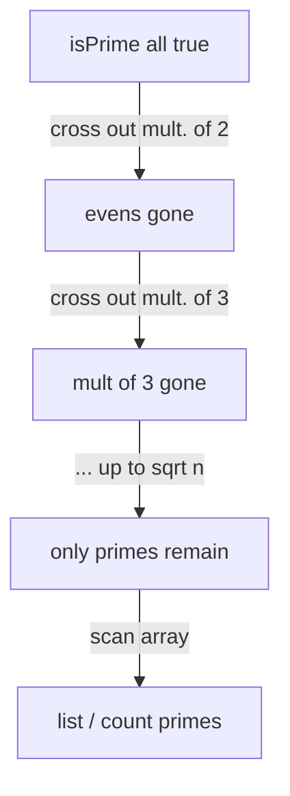

# Prime Sieves (Sieve of Eratosthenes) — Junior Level

> **One-line summary:** A *prime sieve* finds every prime number up to `n` all at once. The **Sieve of Eratosthenes** does it by crossing out the multiples of each prime, leaving only the primes standing, in `O(n log log n)` time — vastly faster than testing each number one by one.

---

## Table of Contents

1. [Introduction](#introduction)
2. [Prerequisites](#prerequisites)
3. [Glossary](#glossary)
4. [Core Concepts](#core-concepts)
5. [Big-O Summary](#big-o-summary)
6. [Real-World Analogies](#real-world-analogies)
7. [Pros & Cons](#pros--cons)
8. [Step-by-Step Walkthrough](#step-by-step-walkthrough)
9. [Code Examples](#code-examples)
10. [Coding Patterns](#coding-patterns)
11. [Error Handling](#error-handling)
12. [Performance Tips](#performance-tips)
13. [Best Practices](#best-practices)
14. [Edge Cases & Pitfalls](#edge-cases--pitfalls)
15. [Common Mistakes](#common-mistakes)
16. [Cheat Sheet](#cheat-sheet)
17. [Visual Animation](#visual-animation)
18. [Summary](#summary)
19. [Further Reading](#further-reading)

---

## Introduction

Suppose someone asks: *"List every prime number from 2 up to 1,000,000."* A prime is a whole number greater than 1 whose only divisors are 1 and itself (2, 3, 5, 7, 11, …). The obvious approach is to test each number for primality on its own: for each candidate `x`, try dividing it by every smaller number and see whether any divides evenly. That works, but it repeats an enormous amount of effort, because the *same* small divisors (2, 3, 5, …) get tried again and again for every candidate.

There is a beautiful, ancient shortcut discovered by the Greek mathematician **Eratosthenes** over 2,200 years ago. Instead of asking "is `x` prime?" one number at a time, we flip the question around: we *assume everything is prime*, then systematically **cross out the things that cannot be** — the multiples of each prime. Whatever survives the crossing-out is prime.

> **The Sieve of Eratosthenes:** start with `2`. It is prime, so cross out `4, 6, 8, 10, …` (all multiples of 2). Move to the next number not yet crossed out — that is `3`, prime, so cross out `6, 9, 12, …`. Next survivor is `5`, cross out its multiples, and so on. When you finish, every number still standing is prime.

The magic is in *why this is fast*. Each composite (non-prime) number gets crossed out a small number of times — once for each of its prime factors. The total amount of crossing-out is about `n · (1/2 + 1/3 + 1/5 + 1/7 + …)`, and that sum of reciprocals of primes grows like `ln ln n`, which is *incredibly* slow-growing. So the whole sieve runs in **`O(n log log n)`** time — for practical purposes, almost linear in `n`. For `n = 10^7`, `ln ln n` is under 3, so the sieve does only a few tens of millions of simple operations.

This single idea unlocks a huge amount of number theory. Once you have all the primes up to `n` (or, better, the **smallest prime factor** of every number — a refinement we meet in [`middle.md`](./middle.md)), you can factor any number `≤ n` almost instantly, answer "is it prime?" for millions of numbers in `O(1)` each, and precompute number-theoretic functions like Euler's totient `φ`, the Möbius function `μ`, divisor counts, and divisor sums. Sieving is the *precomputation backbone* of competitive programming and computational number theory.

In this junior file we focus entirely on the classic Sieve of Eratosthenes: how it works, why it is fast, how to code it correctly, and the small but deadly off-by-one bugs that trip up beginners. The faster **linear sieve** (which also records the smallest prime factor) and the **segmented sieve** (for ranges with a huge upper bound) live in [`middle.md`](./middle.md).

---

## Prerequisites

Before reading this file you should be comfortable with:

- **What a prime number is** — an integer `> 1` divisible only by 1 and itself. `1` is *not* prime; `2` is the only even prime.
- **Divisibility and multiples** — `m` is a multiple of `p` when `m = p · q` for some integer `q ≥ 1`.
- **Arrays / lists** — the sieve is a boolean array `isPrime[0..n]` that we flip as we cross things out.
- **Nested loops** — an outer loop over candidate primes, an inner loop crossing out multiples.
- **Big-O notation** — enough to read `O(n)`, `O(n log log n)`, `O(√n)`.
- **Integer division and modulo** — `a % b == 0` tests divisibility.

Optional but helpful:

- A glance at the **Fundamental Theorem of Arithmetic** — every integer `> 1` factors uniquely into primes. This is *why* sieving by smallest factor works (see [`professional.md`](./professional.md)).
- Familiarity with **memory layout** — a boolean array of `n` bytes for `n = 10^8` is 100 MB; that motivates the bit-packing tricks in [`middle.md`](./middle.md).

---

## Glossary

| Term | Meaning |
|------|---------|
| **Prime** | Integer `> 1` whose only positive divisors are 1 and itself (2, 3, 5, 7, 11, …). |
| **Composite** | Integer `> 1` that is *not* prime; it has a divisor other than 1 and itself. |
| **Sieve** | A method that finds all primes up to `n` at once by eliminating composites, rather than testing numbers individually. |
| **Sieve of Eratosthenes** | The classic sieve: cross out multiples of each prime in turn. `O(n log log n)`. |
| **Multiple of `p`** | A number `p·2, p·3, p·4, …`; these are exactly what we cross out for prime `p`. |
| **`isPrime[]`** | Boolean array; `isPrime[x]` stays `true` iff `x` is prime when the sieve finishes. |
| **Smallest prime factor (SPF)** | The smallest prime dividing `x`. Recording it (see `middle.md`) enables `O(log x)` factorization. |
| **Sieving bound `√n`** | We only need to start crossing out from primes up to `√n`; larger primes have no un-crossed multiples `≤ n`. |
| **`p·p` start** | When crossing out multiples of `p`, we begin at `p²` (smaller multiples were already crossed by smaller primes). |
| **Prime-counting `π(n)`** | The number of primes `≤ n`. Roughly `n / ln n` (the Prime Number Theorem). |

---

## Core Concepts

### 1. Start by Assuming Everything Is Prime

Create a boolean array `isPrime` indexed `0` through `n`. Mark `isPrime[0] = isPrime[1] = false` (0 and 1 are not prime by definition), and every other entry `true` to begin. We will *demote* composites to `false` as we discover them.

```
isPrime = [F, F, T, T, T, T, T, T, T, T, T, ...]   // index 0,1 false; rest true
            0  1  2  3  4  5  6  7  8  9 10
```

### 2. Cross Out Multiples of Each Prime

Walk `p` from `2` upward. When you reach a `p` that is still `true` (still prime), it really *is* prime — nothing smaller divided it. Now cross out all its multiples:

```
for p = 2, 3, 4, ... up to n:
    if isPrime[p]:               # p survived → p is prime
        for m = 2p, 3p, 4p, ... up to n:
            isPrime[m] = false   # m is composite (divisible by p)
```

Each multiple `m` of a prime `p` is genuinely composite, so marking it `false` is always correct. And every composite number has at least one prime factor, so it *will* be crossed out by that factor. Conversely, a true prime is never a multiple of any smaller prime, so it survives. That is the whole correctness argument (the rigorous version is in [`professional.md`](./professional.md)).

### 3. Two Crucial Speedups: Start at `p²`, Stop at `√n`

These two optimizations turn a sluggish sieve into the fast one everyone uses.

- **Start the inner loop at `p²`, not `2p`.** Any multiple `k·p` with `k < p` has a smaller prime factor (some prime dividing `k`), so it was *already* crossed out when we processed that smaller prime. The first multiple of `p` that no smaller prime touched is `p · p`. Starting there saves a lot of redundant work.
- **Stop the outer loop at `√n`.** If `p > √n`, then `p² > n`, so there are no multiples of `p` in range `[p², n]` to cross out. Every composite `≤ n` has a prime factor `≤ √n`, so once we have sieved with all primes up to `√n`, every composite is already crossed out. The numbers still marked `true` above `√n` are exactly the primes there.

```
for p = 2; p*p <= n; p++:
    if isPrime[p]:
        for m = p*p; m <= n; m += p:
            isPrime[m] = false
```

### 4. Read Off the Primes

After the loops, `isPrime[x] == true` exactly for the primes. Collect them into a list, or just keep the boolean array for `O(1)` primality queries:

```
primes = [x for x in 2..n if isPrime[x]]
```

### 5. Why It Is `O(n log log n)`

For each prime `p ≤ n`, the inner loop crosses out about `n/p` multiples. The total work is `n · Σ (1/p)` summed over primes `p ≤ n`. A famous result (Mertens' theorem) says `Σ_{p ≤ n} 1/p ≈ ln ln n + constant`. So the total is `O(n log log n)`. Because `log log n` grows so painfully slowly (for `n = 10^9` it is under 4), the sieve behaves almost like `O(n)` in practice. The full derivation is in [`professional.md`](./professional.md).

To feel how slowly `log log n` grows, compare it to other functions at realistic sizes:

| `n` | `log₂ n` | `√n` | `ln ln n` (≈) |
|-----|----------|------|----------------|
| `10³` | ~10 | ~32 | 1.93 |
| `10⁶` | ~20 | 1000 | 2.62 |
| `10⁹` | ~30 | ~31623 | 3.03 |
| `10¹²` | ~40 | `10⁶` | 3.32 |

The `ln ln n` column barely moves. That is why people often describe the sieve as "essentially linear": the extra factor over `O(n)` is a tiny constant in any practical range.

### 6. What the Sieve Does *Not* Do

It is just as important to know the sieve's limits as its powers:

- It does **not** factor numbers by itself — the plain boolean sieve only tells you *whether* a number is prime, not its factors. To factor, record the **smallest prime factor** (the linear sieve in [`middle.md`](./middle.md)).
- It does **not** handle a single huge number like `10^18`. The sieve's cost and memory scale with `n`; you cannot allocate `10^18` cells. Use a probabilistic test (topic `08-miller-rabin`) for one large number.
- It does **not** directly give primes in a far-away window like `[10^12, 10^12 + 10^6]`. For that you need the **segmented sieve** (`middle.md`), which reuses primes up to `√R`.

---

## Big-O Summary

| Operation | Time | Space | Notes |
|-----------|------|-------|-------|
| Sieve of Eratosthenes up to `n` | **O(n log log n)** | O(n) bits/bytes | The standard method. |
| Query "is `x` prime?" after sieving | O(1) | — | Just read `isPrime[x]`. |
| List all primes `≤ n` | O(n) | O(π(n)) | One pass over the array. |
| Count primes `≤ n` (`π(n)`) | O(n log log n) | O(n) | Sieve, then count `true` entries. |
| Naive trial division for *all* `x ≤ n` | O(n √n) | O(1) | Far slower; avoid for ranges. |
| Trial-divide a *single* `x` | O(√x) | O(1) | Fine for one number; bad for many. |
| Linear (Euler) sieve + SPF | **O(n)** | O(n) | See `middle.md`. |

The headline number is **`O(n log log n)`** — effectively linear. Sieving a million numbers is a few milliseconds; sieving ten million is a fraction of a second.

---

## Real-World Analogies

| Concept | Analogy |
|---------|---------|
| Sieve array | A long row of numbered light bulbs, all switched on, from 2 to `n`. |
| Crossing out multiples of `p` | Walking down the row and switching *off* every `p`-th bulb (every multiple of `p`). |
| Surviving bulbs | The bulbs still glowing at the end are the primes. |
| Starting at `p²` | You skip the early multiples of `p` because a previous worker (a smaller prime) already switched them off. |
| Stopping at `√n` | Once every "small" prime has done its rounds, no bulb above `√n` can be switched off again, so you stop early. |
| Smallest prime factor | A label on each switched-off bulb saying *who* turned it off first — that is its smallest prime factor (see `middle.md`). |

Another useful picture: imagine a calendar of days numbered 2 to `n`. Each prime `p` is a worker who comes in and marks every `p`-th day as "busy". A day that no worker ever marks is a prime — it had no divisors among the workers who already came. The sieve is just running all the workers in order and reading off the unmarked days at the end.

Where the analogy breaks: real light bulbs do not know which prime turned them off, but the *linear sieve* in `middle.md` does record exactly that, which is what makes fast factorization possible.

---

## Pros & Cons

| Pros | Cons |
|------|------|
| Finds *all* primes up to `n` in `O(n log log n)` — almost linear. | Needs `O(n)` memory; for `n = 10^9` that is hundreds of MB unless bit-packed. |
| After sieving, primality queries are `O(1)`. | Bounded by `n`: cannot sieve a single huge number like `10^18` (use Miller-Rabin, topic `08`). |
| Dead-simple to code: one array, two nested loops. | A range `[L, R]` with huge `R` needs the *segmented* sieve (see `middle.md`), not the plain one. |
| Foundation for SPF, `φ`, `μ`, divisor functions (precompute once, reuse). | Plain version recomputes from scratch; no incremental update for a growing `n`. |
| Cache-friendly with odd-only / bitset tricks (`middle.md`). | Off-by-one bugs around `0`, `1`, and the `≤ n` bound are extremely common. |

**When to use:** you need every prime (or primality, or factorization) for many numbers up to a fixed bound `n` that fits in memory (typically `n ≤ 10^8` plain, more with bit-packing). This is the common case in competitive programming: precompute primes once at the start, then answer many queries instantly.

**When NOT to use:** testing a single very large number (use a probabilistic test — see topic `08-miller-rabin`); or a range `[L, R]` where `R` is astronomically large but `R − L` is small (use the **segmented sieve** in `middle.md`).

---

## Step-by-Step Walkthrough

Let us sieve up to `n = 30` by hand. Start with everything from 2 to 30 marked prime (`·` = still prime, `x` = crossed out). Index 0 and 1 are pre-marked non-prime.

```
2  3  4  5  6  7  8  9 10 11 12 13 14 15 16 17 18 19 20 21 22 23 24 25 26 27 28 29 30
·  ·  ·  ·  ·  ·  ·  ·  ·  ·  ·  ·  ·  ·  ·  ·  ·  ·  ·  ·  ·  ·  ·  ·  ·  ·  ·  ·  ·
```

**p = 2** (prime). Cross out from `2² = 4`, step 2: `4, 6, 8, 10, 12, …, 30`.

```
2  3  4  5  6  7  8  9 10 11 12 13 14 15 16 17 18 19 20 21 22 23 24 25 26 27 28 29 30
·  ·  x  ·  x  ·  x  ·  x  ·  x  ·  x  ·  x  ·  x  ·  x  ·  x  ·  x  ·  x  ·  x  ·  x
```

**p = 3** (still `·`, prime). Cross out from `3² = 9`, step 3: `9, 12, 15, 18, 21, 24, 27, 30`. (Some, like 12 and 18, were already out — harmless.)

```
2  3  4  5  6  7  8  9 10 11 12 13 14 15 16 17 18 19 20 21 22 23 24 25 26 27 28 29 30
·  ·  x  ·  x  ·  x  x  x  ·  x  ·  x  x  x  ·  x  ·  x  x  x  ·  x  ·  x  x  x  ·  x
```

**p = 4** — already crossed out, skip. **p = 5** (prime). Cross out from `5² = 25`, step 5: `25, 30`.

```
2  3  4  5  6  7  8  9 10 11 12 13 14 15 16 17 18 19 20 21 22 23 24 25 26 27 28 29 30
·  ·  x  ·  x  ·  x  x  x  ·  x  ·  x  x  x  ·  x  ·  x  x  x  ·  x  x  x  x  x  ·  x
```

Now `p = 6` is crossed out (skip), and `p = 6` already satisfies `p·p = 36 > 30`, so **we stop** — we have passed `√30 ≈ 5.48`. The survivors are the primes:

```
2, 3, 5, 7, 11, 13, 17, 19, 23, 29     → π(30) = 10 primes
```

Notice how `25` was only crossed out by `5` (its smallest prime factor), and `30` was crossed by `2` first. Every composite was eliminated by at least one prime, and no prime was ever touched. That is the sieve working exactly as the theory predicts.

---

## Code Examples

### Example: Sieve of Eratosthenes — primes up to `n`

Build the boolean array, cross out multiples starting at `p²`, stop at `√n`, then collect the primes.

#### Go

```go
package main

import "fmt"

// sieve returns isPrime[0..n] and the list of primes <= n.
func sieve(n int) ([]bool, []int) {
	isPrime := make([]bool, n+1)
	for i := 2; i <= n; i++ {
		isPrime[i] = true
	}
	for p := 2; p*p <= n; p++ {
		if isPrime[p] {
			for m := p * p; m <= n; m += p {
				isPrime[m] = false
			}
		}
	}
	primes := []int{}
	for x := 2; x <= n; x++ {
		if isPrime[x] {
			primes = append(primes, x)
		}
	}
	return isPrime, primes
}

func main() {
	n := 30
	isPrime, primes := sieve(n)
	fmt.Println("primes up to", n, ":", primes)
	fmt.Println("count π(n) =", len(primes))
	fmt.Println("is 29 prime?", isPrime[29]) // true
	fmt.Println("is 27 prime?", isPrime[27]) // false
}
```

#### Java

```java
import java.util.*;

public class Eratosthenes {
    // returns boolean[] isPrime of length n+1
    static boolean[] sieve(int n) {
        boolean[] isPrime = new boolean[n + 1];
        Arrays.fill(isPrime, 2, n + 1, true); // indices 0,1 stay false
        for (int p = 2; (long) p * p <= n; p++) {
            if (isPrime[p]) {
                for (int m = p * p; m <= n; m += p) {
                    isPrime[m] = false;
                }
            }
        }
        return isPrime;
    }

    public static void main(String[] args) {
        int n = 30;
        boolean[] isPrime = sieve(n);
        List<Integer> primes = new ArrayList<>();
        for (int x = 2; x <= n; x++) {
            if (isPrime[x]) primes.add(x);
        }
        System.out.println("primes up to " + n + " : " + primes);
        System.out.println("count π(n) = " + primes.size());
        System.out.println("is 29 prime? " + isPrime[29]); // true
        System.out.println("is 27 prime? " + isPrime[27]); // false
    }
}
```

#### Python

```python
def sieve(n):
    is_prime = bytearray([0, 0]) + bytearray([1]) * (n - 1)  # index 0,1 = 0
    p = 2
    while p * p <= n:
        if is_prime[p]:
            # start at p*p, step p; slice assignment is fast in CPython
            is_prime[p * p : n + 1 : p] = b"\x00" * len(range(p * p, n + 1, p))
        p += 1
    primes = [x for x in range(2, n + 1) if is_prime[x]]
    return is_prime, primes


if __name__ == "__main__":
    n = 30
    is_prime, primes = sieve(n)
    print("primes up to", n, ":", primes)
    print("count π(n) =", len(primes))
    print("is 29 prime?", bool(is_prime[29]))  # True
    print("is 27 prime?", bool(is_prime[27]))  # False
```

**What it does:** sieves up to 30, prints the 10 primes, the count, and two primality checks that match our hand walkthrough.
**Run:** `go run main.go` | `javac Eratosthenes.java && java Eratosthenes` | `python sieve.py`

---

## Coding Patterns

### Pattern 1: Sieve once, query many times

**Intent:** When you must answer "is `x` prime?" for thousands of values, sieve once up to the max, then each query is `O(1)`.

```python
is_prime, _ = sieve(1_000_000)
queries = [97, 100, 7919, 7920]
for q in queries:
    print(q, "->", bool(is_prime[q]))
```

This is the whole reason sieves exist: amortize one `O(n log log n)` build over many `O(1)` lookups.

### Pattern 2: Collect primes into a list for iteration

**Intent:** Many algorithms (segmented sieve, trial division by primes only, factorization) need the *list* of primes, not just the boolean array.

```python
_, primes = sieve(10_000)
# now `primes` = [2, 3, 5, 7, 11, ...], ready to iterate
```

### Pattern 3: Count primes / prime density

**Intent:** Answer `π(n)` and observe the Prime Number Theorem `π(n) ≈ n / ln n`.

```python
import math
_, primes = sieve(1_000_000)
print("π(10^6) =", len(primes))                 # 78498
print("estimate n/ln n =", 1_000_000 / math.log(1_000_000))  # ~72382
```

The estimate `n / ln n` is in the right ballpark and gets relatively more accurate as `n` grows — a concrete sighting of the Prime Number Theorem.

### Pattern 4: Sum or filter over primes

**Intent:** Many problems want the *sum* of primes up to `n`, or primes satisfying a predicate (twin primes, primes ending in 1, etc.). Sieve once, then iterate the survivors.

```python
_, primes = sieve(100)
print("sum of primes <= 100 =", sum(primes))          # 1060
twins = [(p, p + 2) for p in primes if (p + 2) in set(primes)]
print("twin prime pairs <= 100:", twins)
```



---

## Error Handling

| Error | Cause | Fix |
|-------|-------|-----|
| `1` reported as prime | Forgot to mark `isPrime[1] = false`. | Explicitly set indices 0 and 1 to false. |
| `n` itself missing from results | Loop bound `< n` instead of `<= n`. | Use `m <= n` and `x <= n`; the array is size `n+1`. |
| `IndexError` / out-of-bounds | Array sized `n` instead of `n+1`. | Allocate `n+1` slots so index `n` is valid. |
| Integer overflow in `p*p` | `p*p` overflows 32-bit `int` for large `n`. | Cast to 64-bit: `(long)p*p` (Java/Go) before comparing to `n`. |
| Sieve "too slow" | Inner loop starts at `2p` and outer runs to `n`. | Start inner at `p*p`, stop outer at `p*p <= n`. |
| Wrong answer for `n < 2` | No primes exist; code assumes `n ≥ 2`. | Guard: if `n < 2`, return an empty prime list. |

---

## Performance Tips

- **Start the inner loop at `p*p`.** Beginning at `2p` re-crosses numbers smaller primes already handled — pure waste.
- **Stop the outer loop at `√n`** (`p*p <= n`). Beyond that there is nothing left to cross out.
- **Use a compact array type.** A `bytearray` (Python), `boolean[]` (Java), or `[]bool` (Go) uses one byte per entry. For huge `n`, pack into bits (8× less memory) — see `middle.md`.
- **Sieve odds only.** Half the numbers are even and trivially composite; an odd-only sieve halves both time and memory (see `middle.md`).
- **Avoid Python `for`-loops for the inner cross-out.** Use slice assignment `is_prime[p*p::p] = ...`, which runs in C and is dramatically faster.
- **Reuse the sieve.** Build it once at program start; never re-sieve inside a loop.

---

## Best Practices

- Always set `isPrime[0]` and `isPrime[1]` to `false` first — this is the single most common bug.
- Size the array `n+1` and use `<= n` consistently so `n` itself is included.
- Wrap the sieve in a function that returns either the boolean array, the list, or both, so callers pick what they need.
- For competitive programming, prefer the **linear sieve** (`middle.md`) when you also need smallest-prime-factor or a multiplicative function — it is `O(n)` and gives factorization for free.
- Document the bound `n` clearly; a query for `x > n` is out of range and must be handled separately (e.g., trial-divide or Miller-Rabin).
- Test `π(n)` against known values: `π(10) = 4`, `π(100) = 25`, `π(1000) = 168`, `π(10^6) = 78498`.

---

## Edge Cases & Pitfalls

- **`n = 0` or `n = 1`** — there are no primes; return an empty list and do not index out of bounds.
- **`n = 2`** — exactly one prime (2). Make sure the loops still mark it correctly.
- **`1` is not prime** — and `0` is not prime. Both must be `false`.
- **`2` is the only even prime** — every other even number is crossed out by 2.
- **Even `n`** — `n` itself can still be checked; just ensure the array covers index `n`.
- **Re-crossing already-crossed multiples** — harmless (setting `false` to `false`), but starting at `p²` avoids most of it.
- **Huge `n` and memory** — `n = 10^9` as one byte each is ~1 GB; you must bit-pack or use a segmented sieve (see `middle.md`).
- **A single number `> n`** — the sieve cannot answer it; trial-divide it or use Miller-Rabin (topic `08`).

---

## Common Mistakes

1. **Leaving `1` (or `0`) marked prime** — the classic off-by-one; explicitly clear both.
2. **Starting the inner loop at `2p`** — correct but slow; start at `p*p`.
3. **Running the outer loop all the way to `n`** — wasteful; stop at `√n` (`p*p <= n`).
4. **Sizing the array `n` instead of `n+1`** — index `n` overflows or is silently dropped.
5. **Overflow in `p*p`** — for large `n`, `p*p` can exceed 32-bit range; use 64-bit.
6. **Using a slow per-element inner loop in Python** — prefer slice assignment.
7. **Confusing the sieve with primality of one big number** — sieving is for *ranges up to `n`*, not a lone `10^18`.

---

## Cheat Sheet

| Question | Tool | Note |
|----------|------|------|
| All primes up to `n` | Sieve of Eratosthenes | `O(n log log n)` |
| Is `x` prime? (`x ≤ n`, many queries) | precomputed `isPrime[x]` | `O(1)` each |
| Count primes `≤ n` | sieve + count `true` | `π(n)` |
| Factor every `x ≤ n` fast | smallest-prime-factor sieve | see `middle.md` |
| Range `[L, R]`, huge `R` | segmented sieve | see `middle.md` |
| Primes in `O(n)` exactly | linear (Euler) sieve | see `middle.md` |
| One big number `> n` | Miller-Rabin | see topic `08` |

Core algorithm:

```
sieve(n):
    isPrime[0..n] = true; isPrime[0] = isPrime[1] = false
    for p = 2; p*p <= n; p++:
        if isPrime[p]:
            for m = p*p; m <= n; m += p:
                isPrime[m] = false
    return isPrime
# cost: O(n log log n) time, O(n) space
```

---

## Visual Animation

> See [`animation.html`](./animation.html) for an interactive visualization.
>
> The animation demonstrates:
> - A grid of numbers from 2 to `n`, all initially "prime" (lit)
> - Selecting the next surviving number as a prime, then striking out its multiples starting at `p²`
> - Primes lighting up in green as they are confirmed, composites fading as they are crossed out
> - Play / Pause / Step controls and an editable `n` to watch the sieve build the prime list

---

## Summary

The Sieve of Eratosthenes finds *every* prime up to `n` by assuming all numbers are prime and crossing out the multiples of each prime in turn. Two small optimizations — starting the cross-out at `p²` and stopping the outer loop at `√n` — make it run in `O(n log log n)`, which is effectively linear because `log log n` barely grows. After sieving you get `O(1)` primality queries, the full prime list, and the foundation for fast factorization and number-theoretic precomputation. The deadly bugs are tiny: forgetting that `0` and `1` are not prime, sizing the array `n` instead of `n+1`, and starting the inner loop too early. Master those, and you have the single most useful precomputation tool in number theory. The faster `O(n)` linear sieve with smallest-prime-factor, and the segmented sieve for huge ranges, are waiting in [`middle.md`](./middle.md).

---

## Further Reading

- *Introduction to Algorithms* (CLRS) — number-theoretic algorithms and the analysis of sieving.
- Sibling file [`senior.md`](./senior.md) — bitset/odd-only memory layout, cache blocking, and parallel sieving for production-scale `n`.
- cp-algorithms.com — "Sieve of Eratosthenes" and "Linear Sieve".
- Sibling file [`middle.md`](./middle.md) — linear (Euler) sieve, smallest-prime-factor, segmented sieve, sieving `φ` and `μ`.
- Sibling file [`professional.md`](./professional.md) — proof of correctness and the `O(n log log n)` bound via `Σ 1/p ~ ln ln n`.
- Sibling topic `08-miller-rabin` (in `19-number-theory`) — fast primality for a single huge number.
- Sibling topic `04-factorization` — turning the SPF table into factorizations.
- *Concrete Mathematics* (Graham, Knuth, Patashnik) — harmonic and prime-reciprocal sums.
- Project Euler problems 7, 10, 35, 37 — direct practice with sieving and prime properties.
- Sibling file [`interview.md`](./interview.md) — count-primes, fast-factorization, and segmented-sieve coding challenges with runnable solutions.
- Sibling file [`tasks.md`](./tasks.md) — graded beginner/intermediate/advanced sieve exercises in Go, Java, and Python.
