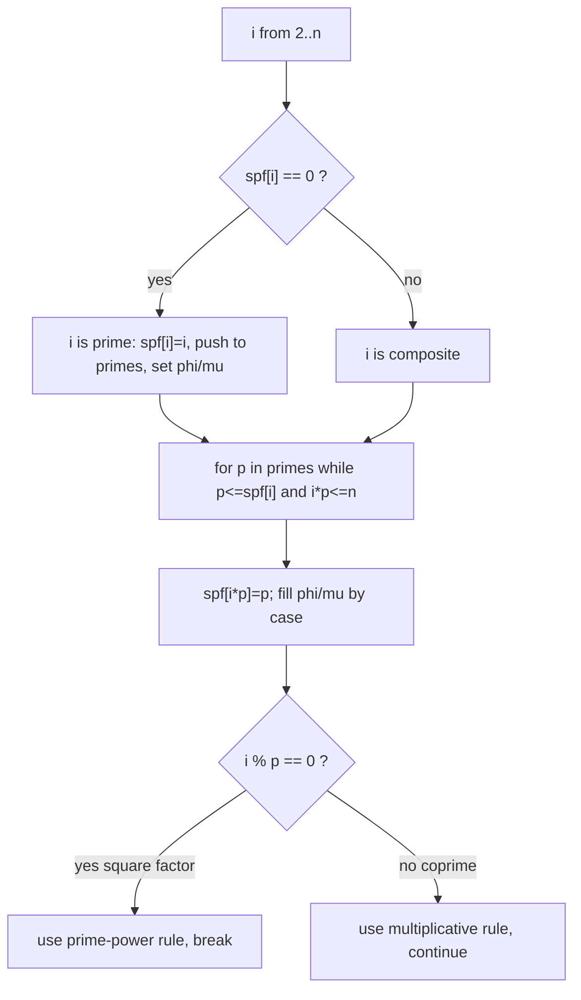

# Linear Sieve & Multiplicative Functions — Junior Level

> **One-line summary:** The **linear sieve** (Euler's sieve) lists every prime up to `n` *and* records the **smallest prime factor (SPF)** of every number, visiting each composite **exactly once** — so it runs in true `O(n)`. Using the SPF information, the very same loop can fill whole tables of **multiplicative functions** (Euler's totient `φ`, the Möbius function `μ`, divisor count `τ`, divisor sum `σ`) for all numbers `≤ n`.

---

## Table of Contents

1. [Introduction](#introduction)
2. [Prerequisites](#prerequisites)
3. [Glossary](#glossary)
4. [Core Concepts](#core-concepts)
5. [Big-O Summary](#big-o-summary)
6. [Real-World Analogies](#real-world-analogies)
7. [Pros & Cons](#pros--cons)
8. [Step-by-Step Walkthrough](#step-by-step-walkthrough)
9. [Code Examples](#code-examples)
10. [Coding Patterns](#coding-patterns)
11. [Error Handling](#error-handling)
12. [Performance Tips](#performance-tips)
13. [Best Practices](#best-practices)
14. [Edge Cases & Pitfalls](#edge-cases--pitfalls)
15. [Common Mistakes](#common-mistakes)
16. [Cheat Sheet](#cheat-sheet)
17. [Visual Animation](#visual-animation)
18. [Summary](#summary)
19. [Further Reading](#further-reading)

---

## Introduction

The classic **Sieve of Eratosthenes** (see topic `03-prime-sieves`) finds every prime up to `n` by crossing out the multiples of each prime. It is fast — `O(n log log n)` — but it does some redundant work: a number like `12 = 2²·3` gets crossed out *twice*, once as a multiple of `2` and once as a multiple of `3`. That double-marking is exactly where the `log log n` factor comes from.

The **linear sieve**, also called **Euler's sieve**, removes that redundancy. It arranges things so that **every composite number is marked exactly once** — specifically, by its *smallest prime factor*. Because each composite is touched only once, the total work is proportional to the count of composites, which is `O(n)`. That is the first headline:

> **The linear sieve runs in `O(n)`** — strictly linear, not just "almost linear."

But raw speed is not even the main reason to learn it. The second headline is what you get *for free* along the way:

> **The linear sieve records `spf[x]` — the smallest prime that divides `x` — for every `x ≤ n`.** With that table, you can factor any `x ≤ n` in `O(log x)` (just keep dividing out `spf[x]`), and you can fill in whole tables of useful number-theoretic functions in the same single pass.

Those number-theoretic functions are **multiplicative functions**: `φ` (Euler's totient — how many numbers below `n` are coprime to `n`), `μ` (the Möbius function — a sign that powers inclusion-exclusion arguments), `τ` (how many divisors a number has), and `σ` (the sum of a number's divisors). All four can be computed for *every* number from `1` to `n` while the sieve runs, at no extra asymptotic cost. This is the precomputation engine behind a huge fraction of competitive-programming and computational-number-theory problems: "for all `n ≤ 10^7`, give me `φ(n)`," or "sum `μ(d)` over all `d`," and so on.

In this junior file we keep the focus concrete: what the SPF array is, exactly how the linear sieve fills it while hitting each composite once, and how — using that same loop — `φ` and `μ` get computed with a tiny two-case rule. The *proofs* (why exactly once? why are the recurrences correct?) live in [`professional.md`](./professional.md); the *engineering at scale* (huge `n`, memory, cache, batch precompute systems) lives in [`senior.md`](./senior.md); the *when/why and comparisons* live in [`middle.md`](./middle.md).

---

## Prerequisites

Before reading this file you should be comfortable with:

- **What a prime number is** — an integer `> 1` divisible only by `1` and itself. `1` is *not* prime; `2` is the only even prime.
- **Divisibility, factors, and multiples** — `p ∣ x` ("p divides x") means `x = p·q` for some integer `q`.
- **The Sieve of Eratosthenes** — the classic "cross out multiples" sieve from topic `03-prime-sieves`. The linear sieve is its more refined cousin.
- **Arrays / lists** — the sieve fills several integer arrays indexed `0..n`.
- **Nested loops** — an outer loop over `i`, an inner loop over the known primes.
- **The modulo operator** — `i % p == 0` tests whether prime `p` divides `i`.
- **Big-O notation** — enough to read `O(n)`, `O(log x)`, `O(n log log n)`.

Optional but helpful:

- The **Fundamental Theorem of Arithmetic** — every integer `> 1` factors uniquely into primes. This is *why* "smallest prime factor" is well-defined.
- A first glance at **Euler's totient `φ`** — see sibling topic `05-fermat-euler`. We compute it here but explain its meaning only briefly.

---

## Glossary

| Term | Meaning |
|------|---------|
| **Prime** | Integer `> 1` whose only positive divisors are `1` and itself. |
| **Composite** | Integer `> 1` that is not prime; it has a divisor other than `1` and itself. |
| **Smallest prime factor (SPF)** | `spf[x]` = the smallest prime dividing `x`. For a prime `p`, `spf[p] = p`. |
| **Linear sieve (Euler's sieve)** | A sieve that visits each composite exactly once (via its SPF), running in `O(n)` and recording `spf[]`. |
| **Multiplicative function** | A function `f` with `f(a·b) = f(a)·f(b)` whenever `gcd(a, b) = 1`. |
| **Euler's totient `φ(n)`** | Count of integers in `[1, n]` that are coprime to `n` (share no factor with `n`). |
| **Möbius function `μ(n)`** | `1` if `n` is a squarefree product of an even number of primes, `−1` if odd, `0` if `n` has a squared prime factor. |
| **Divisor count `τ(n)`** | Number of positive divisors of `n` (sometimes written `d(n)`). |
| **Divisor sum `σ(n)`** | Sum of all positive divisors of `n`. |
| **Squarefree** | An integer no prime divides more than once (e.g. `30 = 2·3·5`); `12 = 2²·3` is *not* squarefree. |
| **Dirichlet convolution** | A way of "multiplying" two number-theoretic functions, `(f * g)(n) = Σ_{d ∣ n} f(d)·g(n/d)` (introduced in `professional.md`). |

---

## Core Concepts

### 1. The Smallest Prime Factor (SPF) Array

The single most important by-product of the linear sieve is an integer array `spf[0..n]` where `spf[x]` is the **smallest prime that divides `x`**. Examples:

```
x   :  2  3  4  5  6  7  8  9 10 11 12
spf :  2  3  2  5  2  7  2  3  2 11  2
```

For a prime `p`, `spf[p] = p` (its only prime factor is itself). For a composite, `spf[x]` is the first prime you would hit if you tried `2, 3, 5, …`. Once you have this array, **factorizing any `x ≤ n` is trivial and fast**:

```
factorize(x):
    while x > 1:
        p = spf[x]          # smallest prime factor — looked up in O(1)
        record p
        while x % p == 0: x = x / p
```

Each pass removes at least one prime, and `x` at least halves overall, so factorization is `O(log x)`. No trial division, no `√x` loop — just array lookups. This is the everyday reason competitive programmers reach for the linear sieve.

### 2. The Linear Sieve: Mark Each Composite Once

The core loop walks `i` from `2` to `n` and maintains a growing list of the primes found so far. For each `i`, it produces new composites of the form `i · p` (for primes `p` in the list) — but with one crucial stopping rule.

```
linear_sieve(n):
    spf[0..n] = 0
    primes = []
    for i = 2 .. n:
        if spf[i] == 0:           # nothing marked i → i is prime
            spf[i] = i
            primes.append(i)
        for p in primes:
            if p > spf[i]: break          # only use primes ≤ spf[i]
            if i * p > n: break           # stay within the array
            spf[i*p] = p                  # p is the SPF of i*p
            if i % p == 0: break          # ← THE key stopping rule
    return spf, primes
```

The line `if i % p == 0: break` is the heart of the algorithm. Once `p` divides `i`, we stop the inner loop immediately. (Equivalently, you can write the guard as `p > spf[i]`, since `spf[i]` is the smallest prime dividing `i`.) This guarantees that each composite `c` is created **exactly once** — by the pair `(c / spf[c], spf[c])`. We give the intuition next and the full proof in [`professional.md`](./professional.md).

### 3. Why "Exactly Once"? (Intuition)

Take any composite `c`, and let `q = spf[c]` be its smallest prime factor. Write `c = q · m` where `m = c / q`. Because `q` is the *smallest* prime dividing `c`, it is no larger than the smallest prime dividing `m`, i.e. `q ≤ spf[m]`. So when the outer loop reaches `i = m`, the inner loop will reach `p = q` *before* it breaks (the break happens when `p` exceeds `spf[i]` or divides `i`), and it sets `spf[c] = q`. No *other* `(i, p)` pair can produce `c`: since `spf[c] = q` is forced, the only factorization the rule allows is `i = c/q` and `p = q`. One composite, one marking. That is why the total work is `O(n)`.

### 4. Multiplicative Functions

A function `f` defined on positive integers is **multiplicative** if

```
f(a · b) = f(a) · f(b)        whenever gcd(a, b) = 1.
```

The "`gcd(a, b) = 1`" (coprime) condition is essential — multiplicativity is only promised for coprime factors. Crucially, once you know `f` on prime powers (`f(p), f(p²), f(p³), …`), the value `f(n)` for any `n` is determined: factor `n = p₁^{a₁} ⋯ p_k^{a_k}` and multiply, `f(n) = f(p₁^{a₁}) ⋯ f(p_k^{a_k})`. The four functions we sieve are all multiplicative:

| Function | Meaning | On a prime `p` | On a prime power `p^a` |
|----------|---------|----------------|------------------------|
| `φ(n)` Euler totient | count of `k ≤ n` coprime to `n` | `p − 1` | `p^a − p^{a−1} = p^{a-1}(p-1)` |
| `μ(n)` Möbius | inclusion-exclusion sign | `−1` | `0` for `a ≥ 2` |
| `τ(n)` divisor count | number of divisors | `2` | `a + 1` |
| `σ(n)` divisor sum | sum of divisors | `p + 1` | `1 + p + ⋯ + p^a` |

### 5. Computing `φ` and `μ` Inside the Sieve

Because the linear sieve visits every number as `i · p` with `p = spf[i·p]`, we can compute `f(i·p)` from `f(i)` using a **two-case split**, exactly the place where we write `spf[i*p] = p`:

- **Case A — `p` does *not* divide `i`** (so `gcd(i, p) = 1`, coprime). Use multiplicativity directly: `f(i·p) = f(i) · f(p)`.
- **Case B — `p` *does* divide `i`** (the `i % p == 0` break case). Then `i·p` raises the power of `p`, so we use the *prime-power* rule for `f`.

Concretely for `φ` and `μ`:

| Function | When `p ∤ i` (coprime) | When `p ∣ i` (square factor) |
|----------|-------------------------|------------------------------|
| `φ(i·p)` | `φ(i) · (p − 1)` | `φ(i) · p` |
| `μ(i·p)` | `−μ(i)` | `0` (because a prime now appears squared) |

For `φ` and `μ` the rules need no extra bookkeeping. `τ` and `σ` need one small auxiliary array (the exponent of the smallest prime); we show those in [`middle.md`](./middle.md). The result: all of `spf`, `primes`, `φ`, `μ` filled in one `O(n)` loop.

---

## Big-O Summary

| Operation | Time | Space | Notes |
|-----------|------|-------|-------|
| Linear sieve build (`spf`, primes, `φ`, `μ`) | **O(n)** | O(n) ints | Each composite marked once. |
| Classic Sieve of Eratosthenes | O(n log log n) | O(n) bits | Faster constant for *just* primality. |
| Factor an `x ≤ n` using `spf[]` | O(log x) | O(1) | Divide out `spf[x]` repeatedly. |
| Query `φ(x)` / `μ(x)` / `τ(x)` / `σ(x)` after sieve | O(1) | — | Just read the table. |
| Naive `φ(x)` by trial-division gcd | O(x log x) | O(1) | Far slower; avoid for whole-range. |
| Naive `μ` / `τ` / `σ` by factoring each `x` | O(√x) each | O(1) | Fine for one number, slow for a range. |

The headline is **`O(n)`** to fill `spf`, all the primes, and the multiplicative-function tables together.

---

## Real-World Analogies

| Concept | Analogy |
|---------|---------|
| Linear sieve | A bakery that stamps each pastry with the name of the *first* baker who shaped it — and never lets a second baker re-stamp it. |
| `spf[x]` | That stamp: the smallest (first) prime "baker" responsible for `x`. |
| "Each composite once" | A strict rule: a pastry leaves the line the instant its first baker stamps it, so no double work happens. |
| Multiplicative function | A recipe where the cost of a combined dish equals the product of the costs of its *independent* (coprime) ingredients. |
| The two-case split | "Is this a brand-new ingredient (coprime) or more of one we already have (a higher power)?" — you handle each differently. |

Another picture: imagine assigning every composite to a unique "owner" — its smallest prime factor. The linear sieve is just walking through all numbers and, for each `i`, handing out ownership of the products `i·p` to the prime `p`, stopping the moment `p` would no longer be the smallest owner. Because ownership is unique, nobody is processed twice.

Where the analogy breaks: real bakers do not enforce a "smallest factor only" rule for free — the cleverness is entirely in the `i % p == 0: break` line, which has no everyday equivalent.

---

## Pros & Cons

| Pros | Cons |
|------|------|
| True `O(n)` — each composite marked exactly once. | Slightly larger constant than a tight bitset Eratosthenes for *pure* primality. |
| Records `spf[x]` → `O(log x)` factorization of any `x ≤ n`. | Stores integers (`O(n)` words), not bits — more memory than a boolean sieve. |
| Computes `φ`, `μ`, `τ`, `σ` for all `x ≤ n` in the same pass. | The `i % p == 0: break` rule is subtle; easy to get wrong. |
| One precompute serves millions of `O(1)` table lookups afterward. | Bounded by `n`: cannot handle a single huge number (use Miller-Rabin, topic `08`). |
| Foundation for Dirichlet-convolution and sum-of-function problems. | The multiplicative-function recurrences require care for the square-factor case. |

**When to use:** you need factorization (`spf`) or a multiplicative function (`φ`/`μ`/`τ`/`σ`) for *all* numbers up to a fixed bound `n` that fits in memory. This is the common precompute-once pattern in number-theory problems.

**When NOT to use:** if you need only primality for large `n` and care about wall-clock speed, a bitset odd-only Eratosthenes is usually faster (see `03-prime-sieves`). For a *single* huge number, use Miller-Rabin (topic `08`) or Pollard's rho (topic `09`).

---

## Step-by-Step Walkthrough

Let us run the linear sieve up to `n = 12` and fill `spf`, `φ`, and `μ`. Seed `φ[1] = 1`, `μ[1] = 1`. The list `primes` starts empty.

```
i = 2:  spf[2]=0 → 2 is prime. spf[2]=2, φ[2]=1, μ[2]=−1, primes=[2].
        inner: p=2. 2≤spf[2]=2 ✓, 2·2=4≤12 ✓ → spf[4]=2.
                    2 % 2 == 0 → square-factor: φ[4]=φ[2]·2=2, μ[4]=0. break.

i = 3:  spf[3]=0 → prime. spf[3]=3, φ[3]=2, μ[3]=−1, primes=[2,3].
        inner: p=2. 3·2=6 → spf[6]=2. 3 % 2 ≠ 0 → coprime: φ[6]=φ[3]·(2−1)=2, μ[6]=−μ[3]=1.
               p=3. 3≤spf[3]=3 ✓, 3·3=9 → spf[9]=3. 3 % 3 == 0 → square: φ[9]=φ[3]·3=6, μ[9]=0. break.

i = 4:  spf[4]=2 (already set, not prime).
        inner: p=2. 4·2=8 → spf[8]=2. 4 % 2 == 0 → square: φ[8]=φ[4]·2=4, μ[8]=0. break.

i = 5:  prime. spf[5]=5, φ[5]=4, μ[5]=−1, primes=[2,3,5].
        inner: p=2. 5·2=10 → spf[10]=2. 5 % 2 ≠ 0 → coprime: φ[10]=φ[5]·1=4, μ[10]=−μ[5]=1.
               p=3. 5·3=15 > 12 → break.

i = 6:  spf[6]=2 (not prime).
        inner: p=2. 6·2=12 → spf[12]=2. 6 % 2 == 0 → square: φ[12]=φ[6]·2=4, μ[12]=0. break.

i = 7:  prime. spf[7]=7, φ[7]=6, μ[7]=−1, primes=[2,3,5,7].
        inner: p=2. 7·2=14 > 12 → break.

i = 8..12: composites; inner loops produce only products > 12, so nothing new.
```

Final tables:

```
x   :  1   2   3   4   5   6   7   8   9  10  11  12
spf :  -   2   3   2   5   2   7   2   3   2  11   2
φ   :  1   1   2   2   4   2   6   4   6   4  10   4
μ   :  1  -1  -1   0  -1   1  -1   0   0   1  -1   0
```

Cross-check with the closed forms: `φ(12) = 12·(1−1/2)(1−1/3) = 4` ✓; `μ(12) = 0` because `12 = 2²·3` has a squared prime ✓; `μ(6) = +1` because `6 = 2·3` has two distinct primes ✓. The sieve reproduced all of these without ever explicitly computing a product or factorizing.

---

## Code Examples

### Example: Linear sieve filling `spf`, primes, `φ`, and `μ`

#### Go

```go
package main

import "fmt"

// linearSieve fills spf, phi, mu for all x in [0, n] and returns the prime list.
func linearSieve(n int) (spf, phi, mu []int, primes []int) {
	spf = make([]int, n+1)
	phi = make([]int, n+1)
	mu = make([]int, n+1)
	if n >= 1 {
		phi[1], mu[1] = 1, 1
	}
	for i := 2; i <= n; i++ {
		if spf[i] == 0 { // i is prime
			spf[i] = i
			phi[i] = i - 1
			mu[i] = -1
			primes = append(primes, i)
		}
		for _, p := range primes {
			if p > spf[i] || i*p > n {
				break
			}
			spf[i*p] = p
			if i%p == 0 { // p divides i → square factor
				phi[i*p] = phi[i] * p
				mu[i*p] = 0
				break // critical: stop after the smallest prime factor
			}
			// coprime case
			phi[i*p] = phi[i] * (p - 1)
			mu[i*p] = -mu[i]
		}
	}
	return
}

func factorize(x int, spf []int) []int {
	var f []int
	for x > 1 {
		p := spf[x]
		f = append(f, p)
		for x%p == 0 {
			x /= p
		}
	}
	return f
}

func main() {
	spf, phi, mu, primes := linearSieve(12)
	fmt.Println("primes:", primes)        // [2 3 5 7 11]
	fmt.Println("spf:", spf)              // index 0..12
	fmt.Println("phi[12]:", phi[12])      // 4
	fmt.Println("mu[6]:", mu[6])          // 1
	fmt.Println("factor 360:", factorize(360, mustSieve(360)))
}

func mustSieve(n int) []int { s, _, _, _ := linearSieve(n); return s }
```

#### Java

```java
import java.util.*;

public class LinearSieve {
    static int[] spf, phi, mu;
    static List<Integer> primes = new ArrayList<>();

    static void linearSieve(int n) {
        spf = new int[n + 1];
        phi = new int[n + 1];
        mu = new int[n + 1];
        if (n >= 1) { phi[1] = 1; mu[1] = 1; }
        for (int i = 2; i <= n; i++) {
            if (spf[i] == 0) { // i is prime
                spf[i] = i;
                phi[i] = i - 1;
                mu[i] = -1;
                primes.add(i);
            }
            for (int p : primes) {
                if (p > spf[i] || (long) i * p > n) break;
                spf[i * p] = p;
                if (i % p == 0) {            // square factor
                    phi[i * p] = phi[i] * p;
                    mu[i * p] = 0;
                    break;                   // critical stopping rule
                }
                phi[i * p] = phi[i] * (p - 1); // coprime
                mu[i * p] = -mu[i];
            }
        }
    }

    static List<Integer> factorize(int x) {
        List<Integer> f = new ArrayList<>();
        while (x > 1) {
            int p = spf[x];
            f.add(p);
            while (x % p == 0) x /= p;
        }
        return f;
    }

    public static void main(String[] args) {
        linearSieve(360);
        System.out.println("primes start: " + primes.subList(0, 5));
        System.out.println("phi[12] = " + phi[12]); // 4
        System.out.println("mu[6]  = " + mu[6]);     // 1
        System.out.println("factor 360: " + factorize(360)); // [2, 3, 5]
    }
}
```

#### Python

```python
def linear_sieve(n):
    spf = [0] * (n + 1)
    phi = [0] * (n + 1)
    mu = [0] * (n + 1)
    if n >= 1:
        phi[1] = mu[1] = 1
    primes = []
    for i in range(2, n + 1):
        if spf[i] == 0:        # i is prime
            spf[i] = i
            phi[i] = i - 1
            mu[i] = -1
            primes.append(i)
        for p in primes:
            if p > spf[i] or i * p > n:
                break
            spf[i * p] = p
            if i % p == 0:      # square factor
                phi[i * p] = phi[i] * p
                mu[i * p] = 0
                break           # critical stopping rule
            phi[i * p] = phi[i] * (p - 1)   # coprime
            mu[i * p] = -mu[i]
    return spf, phi, mu, primes


def factorize(x, spf):
    f = []
    while x > 1:
        p = spf[x]
        f.append(p)
        while x % p == 0:
            x //= p
    return f


if __name__ == "__main__":
    spf, phi, mu, primes = linear_sieve(12)
    print("primes:", primes)        # [2, 3, 5, 7, 11]
    print("phi[12]:", phi[12])      # 4
    print("mu[6]:", mu[6])          # 1
    spf2, *_ = linear_sieve(360)
    print("factor 360:", factorize(360, spf2))  # [2, 3, 5]
```

**What it does:** builds `spf`, the prime list, `φ`, and `μ` up to `n` in one `O(n)` pass, then factorizes a number using the SPF table.
**Run:** `go run main.go` | `javac LinearSieve.java && java LinearSieve` | `python sieve.py`

---

## Coding Patterns

### Pattern 1: Sieve once, query many times

**Intent:** Precompute the tables once, then answer thousands of `φ`/`μ`/factorization queries in `O(1)` (or `O(log x)`) each.

```python
spf, phi, mu, _ = linear_sieve(1_000_000)
for q in [12, 97, 360, 1_000_000]:
    print(q, "-> phi =", phi[q], ", mu =", mu[q])
```

This is the entire reason the sieve exists: amortize one `O(n)` build over many cheap queries.

### Pattern 2: Fast factorization with SPF

**Intent:** Factor any `x ≤ n` in `O(log x)` with array lookups instead of trial division.

```python
spf, *_ = linear_sieve(10_000)
print(factorize(8400, spf))  # [2, 3, 5, 7]  (distinct primes)
```

### Pattern 3: Prefix sums over a sieved function

**Intent:** Many problems ask for `Σ φ(i)` or `Σ μ(i)` over a range. Sieve once, prefix-sum once, then range sums are `O(1)`.

```python
_, phi, mu, _ = linear_sieve(100)
pref = [0] * 101
for i in range(1, 101):
    pref[i] = pref[i - 1] + phi[i]
# sum of phi over [a, b] = pref[b] - pref[a-1]
print("sum phi[1..10] =", pref[10])  # 1+1+2+2+4+2+6+4+6+4 = 32
```

### Pattern 4: Distinct prime factors via SPF

**Intent:** Count `ω(x)` (distinct prime factors) for a number using the SPF chain.

```python
spf, *_ = linear_sieve(10_000)
print(len(set(factorize(360, spf))))  # 360 = 2^3·3^2·5 → 3 distinct primes
```



---

## Error Handling

| Error | Cause | Fix |
|-------|-------|-----|
| Composite marked twice / wrong `spf` | Missing the `i % p == 0: break`. | Always break after the smallest prime factor divides `i`. |
| `φ`/`μ` wrong for prime powers | Did not split coprime vs square-factor. | Use the `i % p == 0` branch (prime-power rule). |
| `μ` nonzero for non-squarefree `x` | Forgot to set `μ[i·p] = 0` in the square case. | In the `i % p == 0` branch, set `μ = 0`. |
| `IndexError` / out of bounds | Array sized `n` instead of `n+1`, or no `i*p > n` guard. | Allocate `n+1`; break when `i*p > n`. |
| Wrong `φ(1)` / `μ(1)` | Loop starts at `i = 2`; index 1 never set. | Seed `φ[1] = 1`, `μ[1] = 1` before the loop. |
| Overflow in `i*p` | 32-bit multiply for large `n`. | Compare `(long)i*p > n` in Go/Java. |

---

## Performance Tips

- **Always include the `i % p == 0: break`.** Without it the sieve is no longer linear and the function tables are wrong — it is not just an optimization, it is correctness.
- **Use the cheapest break guard.** `p > spf[i]` and `i % p == 0` both work; many implementations check `i % p == 0` *after* marking, then break, which is the standard form.
- **Seed `f(1)` once** before the loop, never inside it.
- **Don't store more than you need.** If you only want `spf`, drop the `φ`/`μ` arrays to save memory.
- **For pure primality at large `n`,** a bitset odd-only Eratosthenes is usually faster wall-clock; reach for the linear sieve when you specifically need `spf` or a multiplicative function (see `middle.md`).
- **Reuse the tables.** Build once at program start; never re-sieve in a loop.

---

## Best Practices

- Seed `φ[1] = μ[1] = 1` (and `τ[1] = σ[1] = 1` if you sieve those) explicitly.
- Keep the two-case split (`i % p == 0` vs not) clearly commented — it is where every bug hides.
- Size all arrays `n + 1` and guard the inner loop with `i*p > n`.
- Validate sieved values against closed forms on small inputs: `φ(12) = 4`, `μ(30) = −1`, `μ(12) = 0`, `τ(360) = 24`, `σ(6) = 12`.
- Write a tiny brute-force `f` (direct factorization) and assert equality for all `x ≤ 1000` before trusting the sieved tables.
- Decide *once* which tables you actually need and allocate only those.
- Document the bound `n`; a query for `x > n` is out of range and must be handled separately.

---

## Edge Cases & Pitfalls

- **`n = 0` or `n = 1`** — no primes; make sure you seed index 1 only if `n ≥ 1` and never index past `n`.
- **`φ(1) = μ(1) = 1`** — both are seeded, not derived.
- **`μ` of a non-squarefree number is `0`** — `μ(4) = μ(8) = μ(12) = 0`. Forgetting the square-factor branch gives wrong signs.
- **Prime powers** — `φ(8) = 4`, `φ(9) = 6`; these come from the `i % p == 0` branch, not the coprime one.
- **The break is mandatory** — dropping `i % p == 0: break` breaks both linearity *and* correctness of `φ`/`μ`.
- **Overflow** — `i*p` can exceed 32-bit for large `n`; widen the comparison.
- **A single number `> n`** — the sieve cannot help; use Miller-Rabin (topic `08`).

---

## Common Mistakes

1. **Omitting `i % p == 0: break`** — the most fundamental error; ruins both speed and the function tables.
2. **Using the coprime rule in the square-factor case** (or vice versa) — `φ` and `μ` come out wrong.
3. **Forgetting `μ[i·p] = 0`** in the square case — leaves nonzero `μ` for non-squarefree numbers.
4. **Not seeding `f(1)`** — index 1 is never visited by the loop.
5. **Sizing arrays `n` instead of `n+1`** — index `n` overflows or is dropped.
6. **Overflow in `i*p`** — use 64-bit comparison for large `n`.
7. **Confusing the linear sieve with single-number primality** — it is for *dense ranges up to `n`*, not a lone `10^18`.

---

## Cheat Sheet

| Question | Tool | Note |
|----------|------|------|
| `spf[x]`, primes up to `n` | linear (Euler) sieve | `O(n)` |
| Factor `x ≤ n` | divide out `spf[x]` | `O(log x)` |
| `φ(x)` / `μ(x)` for all `x ≤ n` | sieve recurrences | `O(n)` build, `O(1)` query |
| `τ(x)` / `σ(x)` for all `x ≤ n` | sieve + exponent array | see `middle.md` |
| Just primality, big `n`, fast | bitset Eratosthenes | see `03-prime-sieves` |
| One huge number | Miller-Rabin / Pollard | topics `08`, `09` |

Core algorithm:

```
linear_sieve(n):
    spf[0..n] = 0; phi[1]=mu[1]=1; primes = []
    for i = 2..n:
        if spf[i] == 0: spf[i]=i; phi[i]=i-1; mu[i]=-1; primes += i
        for p in primes:
            if p > spf[i] or i*p > n: break
            spf[i*p] = p
            if i % p == 0: phi[i*p]=phi[i]*p;     mu[i*p]=0;       break
            else:          phi[i*p]=phi[i]*(p-1); mu[i*p]=-mu[i]
# cost: O(n) time, O(n) space
```

---

## Visual Animation

> See [`animation.html`](./animation.html) for an interactive visualization.
>
> The animation demonstrates:
> - A grid of numbers `1..n`, each shown with its `spf`, `φ`, and `μ`.
> - The outer pointer `i` sweeping left to right, with primes highlighted as discovered.
> - For each `i`, the inner loop marking products `i·p`, color-coded by the **coprime** vs **square-factor** branch.
> - Each composite cell flashing **exactly once** when its `spf` is assigned — the visual proof of `O(n)`.
> - Play / Pause / Step controls, an editable `n`, a Big-O panel, and a running operation log.

---

## Summary

The **linear sieve (Euler's sieve)** improves on the classic Sieve of Eratosthenes by marking each composite **exactly once** — through its smallest prime factor — which makes it run in true `O(n)` and, as a by-product, fills the `spf[]` array that factorizes any `x ≤ n` in `O(log x)`. The same loop computes whole tables of **multiplicative functions** — Euler's totient `φ`, the Möbius function `μ`, and (with a little extra bookkeeping) the divisor count `τ` and divisor sum `σ` — using a two-case split at the marking step: the **coprime** case (`p ∤ i`) applies multiplicativity, and the **square-factor** case (`p ∣ i`, the break case) applies the prime-power rule. The deadly bug is dropping the `i % p == 0: break` line, which destroys both linearity and correctness. Master this single loop and you have the precomputation engine behind a vast range of number-theory problems. Next, learn *why* you choose it over Eratosthenes and how the divisor functions are sieved in [`middle.md`](./middle.md).

---

## Further Reading

- Sibling topic `03-prime-sieves` — the classic Sieve of Eratosthenes and the segmented sieve.
- Sibling topic `05-fermat-euler` — Euler's totient `φ` and Euler's theorem in depth.
- Sibling file [`middle.md`](./middle.md) — why linear vs Eratosthenes, sieving `τ` and `σ`, Dirichlet-convolution context, comparisons.
- Sibling file [`senior.md`](./senior.md) — large-`N` tables, memory/cache, segmented variants, batch precompute systems.
- Sibling file [`professional.md`](./professional.md) — the `O(n)` proof (each composite hit once by `spf`), and multiplicative-function correctness proofs via Dirichlet convolution.
- cp-algorithms.com — "Linear Sieve" and "Euler's totient function".
- *Introduction to Algorithms* (CLRS) — number-theoretic algorithms.
- Sibling file [`interview.md`](./interview.md) — tiered Q&A and runnable coding challenges.
- Sibling file [`tasks.md`](./tasks.md) — graded practice exercises in Go, Java, and Python.
