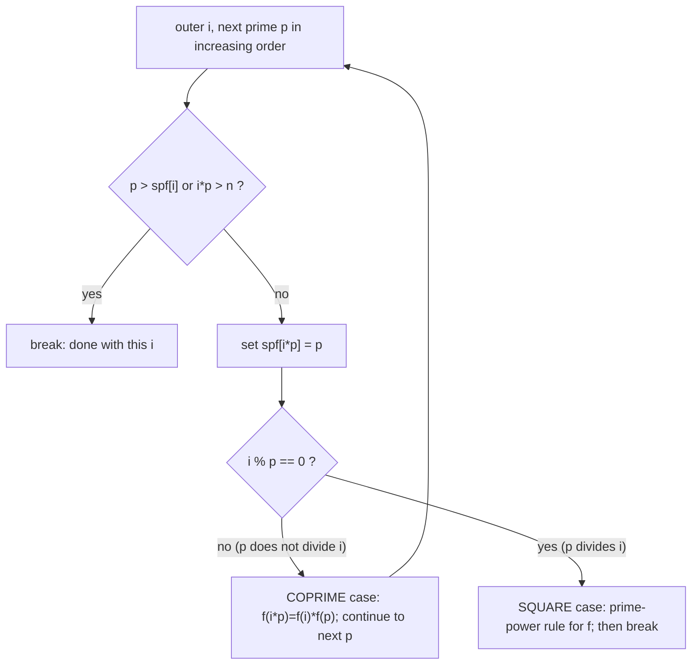

# Linear Sieve & Multiplicative Functions — Middle Level

> **Focus:** *Why* the linear sieve beats Eratosthenes asymptotically, *when* to choose each, and *how* to compute the full family of multiplicative functions inside the `O(n)` pass — Euler `φ`, Möbius `μ`, divisor count `τ`, divisor sum `σ`, plus the auxiliary "lowest-power" arrays they need. We frame all of this in the language of **Dirichlet convolution**, the algebra that makes "multiply two number-theoretic functions" precise and explains where every recurrence comes from.

---

## Table of Contents

1. [Introduction](#introduction)
2. [Deeper Concepts](#deeper-concepts)
3. [Sieving the Full Family: φ, μ, τ, σ](#sieving-the-full-family-φ-μ-τ-σ)
4. [Dirichlet Convolution Context](#dirichlet-convolution-context)
5. [Comparison with Eratosthenes and Alternatives](#comparison-with-eratosthenes-and-alternatives)
6. [Advanced Patterns](#advanced-patterns)
7. [Code Examples](#code-examples)
8. [Error Handling](#error-handling)
9. [Performance Analysis](#performance-analysis)
10. [Best Practices](#best-practices)
11. [Visual Animation](#visual-animation)
12. [Summary](#summary)

---

## Introduction

At junior level we learned the mechanics: the linear sieve visits every composite exactly once via its smallest prime factor (SPF), runs in `O(n)`, and fills `spf`, `φ`, and `μ` with a two-case split. At middle level we answer the *engineering and design* questions:

- **Why** is the linear sieve `O(n)` while Eratosthenes is `O(n log log n)` — and does that difference actually matter in practice?
- **When** should you choose the linear sieve over the classic sieve (and when is the classic sieve the better tool)?
- **How** do you extend the same pass to the trickier functions `τ` (divisor count) and `σ` (divisor sum), which — unlike `φ` and `μ` — need an auxiliary array tracking the exponent of the smallest prime?
- **What** is the underlying algebra (Dirichlet convolution) that makes "these functions are multiplicative" rigorous and tells you the recurrences are not arbitrary tricks but consequences of one identity per function?

The payoff of this level is that you stop memorizing four separate recurrences and start *deriving* them from a small set of facts about multiplicative functions and convolution. That makes it easy to sieve a *new* multiplicative function you have never seen before — the skill interviewers and hard problems actually test.

---

## Deeper Concepts

### Why the classic sieve is not linear

In Eratosthenes, a composite `c` is crossed out once for each of its distinct prime factors. The number `12 = 2²·3` is crossed out by `2` (as `12 = 6·2`) and by `3` (as `12 = 4·3`) — two writes. Summed over all numbers up to `n`, the total number of cross-outs is

```
Σ_{p ≤ n} n/p  =  n · Σ_{p ≤ n} 1/p  ≈  n · ln ln n
```

That `ln ln n` is the redundancy. The linear sieve removes it by a single rule: **mark `i·p` only when `p` is the smallest prime factor of `i·p`.** Then each composite is written exactly once, so the total work is the count of composites, `n − π(n) = O(n)`.

### The bijection that powers everything

The cleanest way to see linearity is as a **bijection**. Every composite `c ≤ n` corresponds to a unique pair `(i, p)` with:

```
p = spf(c),      i = c / p,      p ≤ spf(i).
```

- *Existence:* let `p = spf(c)`, `i = c/p`. Since `p` is the smallest prime in `c`, it is `≤` any prime in `i`, so `p ≤ spf(i)`. The sieve reaches `i` in the outer loop and `p` in the inner loop before breaking.
- *Uniqueness:* given `c`, the value `p = spf(c)` is forced (it is a property of `c`), so `i = c/p` is forced too. No other `(i', p')` maps to `c`.

A bijection between {composites `≤ n`} and {(i, p) pairs the sieve actually visits} means the inner loop executes exactly `n − π(n)` times in total. The full proof is in [`professional.md`](./professional.md); here, internalize the bijection — it is *the* idea.

### The two-case split, restated

When the sieve sets `spf[i·p] = p`, exactly one of two situations holds:

- **Coprime case, `p ∤ i`** (equivalently `p < spf(i)`): the factor `p` is brand new to `i`, so `gcd(i, p) = 1` and `i·p` is a coprime product. Multiplicativity applies directly.
- **Square-factor case, `p ∣ i`** (equivalently `p == spf(i)`, the break case): `p` already divides `i`, so multiplying by `p` raises the exponent of `p`. We must use the *prime-power* behavior of the function.

Every multiplicative-function recurrence below is just "what does `f` do in each of these two cases?"

### Picturing the decision at each marking

The whole inner loop is a tiny decision tree. For the current outer index `i` and a candidate prime `p` (scanned in increasing order), the sieve either *marks* `i·p` or *stops*, and if it marks, it picks one of the two recurrence branches:



Read the diagram once and the two-case split stops being a "trick": the `i % p == 0` test is literally asking *"is `p` a brand-new prime for `i`, or is it the prime already at the bottom of `i`'s factorization?"* — and the answer chooses which multiplicative rule applies. The `break` on the square case is what guarantees `p = spf(i·p)` for every marking, the single fact that makes the sieve linear (see [`professional.md`](./professional.md)).

### The `i % p == 0` test, worked on real numbers

It helps to watch the test fire on concrete `(i, p)` pairs. Remember `p` runs over primes in increasing order and we stop the moment `p ∣ i`:

| `i` | `spf(i)` | `p` tried | `i % p` | Branch | Marks | Why |
|-----|----------|-----------|---------|--------|-------|-----|
| `6` | `2` | `2` | `0` | square | `spf[12]=2`, then **break** | `2 ∣ 6`, so `12 = 2²·3`; never try `p=3` |
| `5` | `5` | `2` | `1` | coprime | `spf[10]=2`, continue | `2 ∤ 5`, brand-new prime |
| `5` | `5` | `3` | `2` | coprime | `spf[15]=3`, continue | `3 ∤ 5`, brand-new prime |
| `5` | `5` | `5` | `0` | square | `spf[25]=5`, then **break** | `5 ∣ 5`, raises exponent |
| `4` | `2` | `2` | `0` | square | `spf[8]=2`, then **break** | `2 ∣ 4`, so `8 = 2³` |
| `12` | `2` | `2` | `0` | square | `spf[24]=2`, then **break** | stops immediately at `spf` |

Two patterns jump out. First, a *prime* `i` runs the inner loop the longest — it marks `i·2, i·3, …` and only breaks when it reaches `p = i` itself (the square case `i·i`). Second, a number whose `spf` is small (like `i = 12`, `spf = 2`) breaks almost immediately: it marks exactly one product (`i·spf`) and stops. This is the bijection in motion — each composite `i·p` is born from the *unique* `i` and the *unique* smallest prime `p` that the break rule permits.

---

## Sieving the Full Family: φ, μ, τ, σ

Here are the recurrences for all four functions. `φ` and `μ` need no extra state; `τ` and `σ` need an auxiliary array.

| Function | At a prime `p` | Coprime (`p ∤ i`) | Square factor (`p ∣ i`) | Extra state |
|----------|----------------|--------------------|--------------------------|-------------|
| `φ` Euler totient | `p − 1` | `φ(i·p) = φ(i)·(p−1)` | `φ(i·p) = φ(i)·p` | none |
| `μ` Möbius | `−1` | `μ(i·p) = −μ(i)` | `μ(i·p) = 0` | none |
| `τ` divisor count | `2` | `τ(i·p) = τ(i)·2` | uses exponent: see below | `cnt[]` (exponent of spf) |
| `σ` divisor sum | `p+1` | `σ(i·p) = σ(i)·(p+1)` | uses power sum: see below | `low[]` (`p^{cnt+1}` factor) |

### τ (divisor count)

If `n = p₁^{a₁} ⋯ p_k^{a_k}`, then `τ(n) = (a₁+1)(a₂+1)⋯(a_k+1)`. To maintain this in the sieve, keep `cnt[x]` = the exponent of the smallest prime factor of `x`.

- **Coprime (`p ∤ i`):** a new prime to the first power, contributing a factor `(1+1) = 2`. So `τ(i·p) = τ(i)·2`, and `cnt[i·p] = 1`.
- **Square factor (`p ∣ i`):** the exponent of `p` goes from `cnt[i]` to `cnt[i]+1`. The divisor-count contribution of that prime changes from `(cnt[i]+1)` to `(cnt[i]+2)`. So:

```
cnt[i*p] = cnt[i] + 1
τ(i*p)   = τ(i) / (cnt[i] + 1) * (cnt[i] + 2)
```

### σ (divisor sum)

If `n = Π p^a`, then `σ(n) = Π (1 + p + p² + ⋯ + p^a) = Π (p^{a+1} − 1)/(p − 1)`. Keep `low[x]` = the value `(1 + p + ⋯ + p^{cnt[x]})` for the smallest prime `p` of `x` (i.e. the geometric-sum factor contributed by `spf`).

- **Prime `p`:** `σ(p) = p + 1`, and `low[p] = p + 1`.
- **Coprime (`p ∤ i`):** new prime to the first power contributes `(1 + p)`. So `σ(i·p) = σ(i)·(p + 1)` and `low[i·p] = p + 1`.
- **Square factor (`p ∣ i`):** the factor for `p` grows from `low[i] = 1 + p + ⋯ + p^a` to `1 + p + ⋯ + p^{a+1} = low[i]·p + 1`. We divide out the old factor and multiply in the new one:

```
low[i*p] = low[i] * p + 1
σ(i*p)   = σ(i) / low[i] * low[i*p]
```

With these two auxiliary arrays (`cnt` for `τ`, `low` for `σ`), all four functions are filled in one `O(n)` pass. The derivations are proven from convolution identities in [`professional.md`](./professional.md).

### Worked table: all four functions over [1, 12]

Tracing the sieve by hand is the fastest way to internalize the recurrences. Below is the full state after the sieve reaches each `x` (seed row `x = 1` is the multiplicative identity). The `cnt`/`low` columns are the auxiliary state that `τ`/`σ` consume; primes are marked.

| `x` | factorization | how reached | `cnt` | `low` | `φ` | `μ` | `τ` | `σ` |
|-----|---------------|-------------|-------|-------|-----|-----|-----|-----|
| `1` | — | seed | — | — | `1` | `1` | `1` | `1` |
| `2` | `2` | prime | `1` | `3` | `1` | `−1` | `2` | `3` |
| `3` | `3` | prime | `1` | `4` | `2` | `−1` | `2` | `4` |
| `4` | `2²` | `i=2,p=2` (sq) | `2` | `7` | `2` | `0` | `3` | `7` |
| `5` | `5` | prime | `1` | `6` | `4` | `−1` | `2` | `6` |
| `6` | `2·3` | `i=3,p=2` (cop) | `1` | `3` | `2` | `1` | `4` | `12` |
| `7` | `7` | prime | `1` | `8` | `6` | `−1` | `2` | `8` |
| `8` | `2³` | `i=4,p=2` (sq) | `3` | `15` | `4` | `0` | `4` | `15` |
| `9` | `3²` | `i=3,p=3` (sq) | `2` | `13` | `6` | `0` | `3` | `13` |
| `10`| `2·5` | `i=5,p=2` (cop) | `1` | `3` | `4` | `1` | `4` | `18` |
| `11`| `11` | prime | `1` | `12` | `10`| `−1`| `2` | `12`|
| `12`| `2²·3`| `i=6,p=2` (sq) | `2` | `7` | `4` | `0` | `6` | `28` |

Spot-check three rows against their definitions:

- `x = 6`: coprime branch (`p = 2 ∤ i = 3`). `φ = φ(3)·(2−1) = 2`, `μ = −μ(3) = 1`, `τ = τ(3)·2 = 4`, `σ = σ(3)·(2+1) = 12`. Divisors of 6 are `{1,2,3,6}` → `τ=4`, sum `12`. ✓
- `x = 8`: square branch (`p = 2 ∣ i = 4`). `cnt` grows `2 → 3`, `low` grows `7 → 7·2+1 = 15`, `τ = τ(4)/(2+1)·(2+2) = 3/3·4 = 4`, `σ = σ(4)/low(4)·low(8) = 7/7·15 = 15`. Divisors `{1,2,4,8}`. ✓
- `x = 12`: square branch (`p = 2 ∣ i = 6`). `cnt(6)=1 → cnt(12)=2`, `low(6)=3 → low(12)=3·2+1=7`, `τ = τ(6)/(1+1)·(1+2) = 4/2·3 = 6`, `σ = σ(6)/low(6)·low(12) = 12/3·7 = 28`. Divisors `{1,2,3,4,6,12}`. ✓

Notice the `low` and `cnt` columns *reset* on the coprime branch (rows 6, 10: `cnt → 1`, `low → p+1`) because the new smallest prime starts fresh, but they *accumulate* on the square branch (rows 4, 8, 12). That reset-vs-accumulate dichotomy is the whole bookkeeping job of the auxiliary arrays.

---

## Dirichlet Convolution Context

The reason these recurrences exist is **Dirichlet convolution**, the natural "multiplication" of arithmetic functions:

```
(f * g)(n) = Σ_{d ∣ n} f(d) · g(n/d)
```

This operation is commutative and associative, with identity `ε` (where `ε(1) = 1`, `ε(n) = 0` for `n > 1`). The convolution of two multiplicative functions is again multiplicative — which is why the whole family of functions we sieve plays so nicely together. Three standard building blocks:

| Symbol | Function | Value |
|--------|----------|-------|
| `1` | constant one | `1(n) = 1` for all `n` |
| `id` | identity | `id(n) = n` |
| `ε` | convolution identity | `ε(1)=1`, else `0` |

Now every function we sieve appears as a simple convolution identity:

| Identity | Meaning |
|----------|---------|
| `τ = 1 * 1` | `τ(n) = Σ_{d ∣ n} 1` — the number of divisors. |
| `σ = id * 1` | `σ(n) = Σ_{d ∣ n} d` — the sum of divisors. |
| `μ * 1 = ε` | `μ` is the Dirichlet inverse of the constant `1` (Möbius inversion). |
| `φ * 1 = id` | `Σ_{d ∣ n} φ(d) = n` — a classic totient identity. |

These identities are *why* the functions are multiplicative and *why* the sieve recurrences work: each recurrence is the local (prime-power) consequence of a global convolution identity. The practical superpower this unlocks is **Möbius inversion**: if `g = f * 1` (i.e. `g(n) = Σ_{d∣n} f(d)`), then `f = g * μ` (i.e. `f(n) = Σ_{d∣n} μ(d) g(n/d)`). Many counting problems are solved by recognizing a sum as a convolution and inverting it with `μ` — and the linear sieve hands you `μ` for free. The algebra is developed rigorously in [`professional.md`](./professional.md); here the takeaway is: *the sieve is a fast evaluator for functions defined by Dirichlet identities.*

---

## Comparison with Eratosthenes and Alternatives

| Method | Time | Space | Gives you | Choose when |
|--------|------|-------|-----------|-------------|
| Sieve of Eratosthenes | `O(n log log n)` | `O(n)` bits | primality, prime list | only need primes; want least memory |
| **Linear (Euler) sieve** | **`O(n)`** | `O(n)` ints | primality + **SPF** + `φ`/`μ`/`τ`/`σ` | need factorization or a multiplicative function |
| Per-number factor + formula | `O(√x)` each | `O(1)` | one value of `φ`/`μ`/… | a single number, no precompute |
| Segmented sieve | `O((R−L)log log R + √R)` | `O(R−L+√R)` | primes in `[L, R]` | huge `R`, small window (see `03-prime-sieves`) |
| Miller-Rabin (topic `08`) | `O(k log³ x)` | `O(1)` | primality of one huge `x` | `x` beyond any sieve bound |

**The asymptotics vs the wall clock.** The linear sieve is asymptotically faster than Eratosthenes (`O(n)` vs `O(n log log n)`), but `log log n` is so tiny (< 5 for any realistic `n`) that the *constant factor* usually decides the race. Eratosthenes writes single bits in a tight, cache-friendly stride; the linear sieve writes `int`-sized SPF entries with a less regular access pattern. So for *pure primality* at large `n`, an odd-only bitset Eratosthenes is often faster wall-clock despite the worse asymptotic.

**Choose the linear sieve when:** you need `spf` (factorization) or any multiplicative-function table. Then the linear sieve is the right tool — it does in one pass what would otherwise take a sieve plus a per-number factorization loop.

**Choose Eratosthenes when:** you need only primality / the prime list, especially for large `n` where memory and cache matter — bits beat ints.

### The same composite, two sieves side by side

To make the "marked once vs marked per prime" difference concrete, track how each sieve handles `12 = 2²·3` and `30 = 2·3·5`:

| Number | Eratosthenes cross-outs | Linear sieve marking |
|--------|-------------------------|----------------------|
| `12` | by `2` (`12=2·6`), by `3` (`12=3·4`) → **2 writes** | once, at `i=6, p=2` → **1 write** |
| `30` | by `2`, by `3`, by `5` → **3 writes** | once, at `i=15, p=2` → **1 write** |
| general `c` | `ω(c)` writes (one per *distinct* prime) | exactly **1** write (`i=c/spf(c), p=spf(c)`) |

Summed over `[1, n]`, Eratosthenes' total is `Σ_{p≤n} ⌊n/p⌋ ≈ n ln ln n` and the linear sieve's is `n − π(n)`. That is the entire asymptotic gap, made of nothing but the redundant cross-outs Eratosthenes performs and the linear sieve skips. The price the linear sieve pays for skipping them is bookkeeping: it must store `spf` (and read `f(i)`), so it writes wider cells in a less regular order — which is why the asymptotic winner is not always the wall-clock winner (covered in [`senior.md`](./senior.md)).

---

## Advanced Patterns

### Pattern: derive the recurrence for a new multiplicative function

Given a multiplicative `f`, you only need two things to sieve it:

1. `f(p)` for a prime `p`.
2. `f(p^{a+1})` in terms of `f(p^a)` (the prime-power recurrence).

Then in the sieve: the coprime case uses `f(i·p) = f(i)·f(p)`; the square case uses the prime-power recurrence (often needing an auxiliary array like `cnt` or `low`). Example: the function `J_2(n) = n² Π(1 − 1/p²)` (Jordan totient) has `J_2(p) = p²−1`, `J_2(p^{a+1}) = J_2(p^a)·p²`. Plug in and sieve.

### Pattern: prefix sums of a sieved function

Most "sum of `f` over `[a, b]`" problems become: sieve `f` (`O(n)`), prefix-sum it (`O(n)`), answer each query in `O(1)`.

```python
_, phi, mu, _ = linear_sieve(n)
pref_mu = [0] * (n + 1)
for i in range(1, n + 1):
    pref_mu[i] = pref_mu[i - 1] + mu[i]
# Mertens function M(x) = pref_mu[x], in O(1) after the O(n) build
```

### Pattern: Möbius inversion in practice

To count coprime pairs, squarefree numbers, or apply inclusion-exclusion over divisors, recognize the sum as a convolution and invert with `μ` (sieved for free). Example: the number of integers in `[1, n]` coprime to `m` is `Σ_{d ∣ m} μ(d) ⌊n/d⌋`.

### Pattern: choose the smallest sufficient bound

Sieve up to exactly the largest `x` you must answer for — not more. Oversizing the sieve is a frequent memory-limit-exceeded cause. If you only need `φ` up to `X`, sieve up to `X`, not `2X`.

---

## Code Examples

### Full family: spf, φ, μ, τ, σ in one O(n) pass

#### Go

```go
package main

import "fmt"

type Tables struct {
	spf, phi, mu, tau, sigma []int
	cnt, low                 []int // auxiliary: exponent of spf, geometric-sum factor
	primes                   []int
}

func sieveAll(n int) Tables {
	t := Tables{
		spf:   make([]int, n+1),
		phi:   make([]int, n+1),
		mu:    make([]int, n+1),
		tau:   make([]int, n+1),
		sigma: make([]int, n+1),
		cnt:   make([]int, n+1),
		low:   make([]int, n+1),
	}
	if n >= 1 {
		t.phi[1], t.mu[1], t.tau[1], t.sigma[1] = 1, 1, 1, 1
	}
	for i := 2; i <= n; i++ {
		if t.spf[i] == 0 { // prime
			t.spf[i] = i
			t.phi[i] = i - 1
			t.mu[i] = -1
			t.tau[i] = 2
			t.cnt[i] = 1
			t.sigma[i] = i + 1
			t.low[i] = i + 1
			t.primes = append(t.primes, i)
		}
		for _, p := range t.primes {
			if p > t.spf[i] || i*p > n {
				break
			}
			ip := i * p
			t.spf[ip] = p
			if i%p == 0 { // square factor
				t.phi[ip] = t.phi[i] * p
				t.mu[ip] = 0
				t.cnt[ip] = t.cnt[i] + 1
				t.tau[ip] = t.tau[i] / (t.cnt[i] + 1) * (t.cnt[i] + 2)
				t.low[ip] = t.low[i]*p + 1
				t.sigma[ip] = t.sigma[i] / t.low[i] * t.low[ip]
				break
			}
			// coprime
			t.phi[ip] = t.phi[i] * (p - 1)
			t.mu[ip] = -t.mu[i]
			t.cnt[ip] = 1
			t.tau[ip] = t.tau[i] * 2
			t.low[ip] = p + 1
			t.sigma[ip] = t.sigma[i] * (p + 1)
		}
	}
	return t
}

func main() {
	t := sieveAll(12)
	fmt.Println("phi[12]   =", t.phi[12])   // 4
	fmt.Println("mu[12]    =", t.mu[12])    // 0
	fmt.Println("tau[12]   =", t.tau[12])   // 6  (1,2,3,4,6,12)
	fmt.Println("sigma[12] =", t.sigma[12]) // 28 (1+2+3+4+6+12)
}
```

#### Java

```java
import java.util.*;

public class SieveAll {
    static int[] spf, phi, mu, tau, sigma, cnt, low;
    static List<Integer> primes = new ArrayList<>();

    static void sieveAll(int n) {
        spf = new int[n + 1]; phi = new int[n + 1]; mu = new int[n + 1];
        tau = new int[n + 1]; sigma = new int[n + 1];
        cnt = new int[n + 1]; low = new int[n + 1];
        if (n >= 1) { phi[1] = mu[1] = tau[1] = sigma[1] = 1; }
        for (int i = 2; i <= n; i++) {
            if (spf[i] == 0) { // prime
                spf[i] = i; phi[i] = i - 1; mu[i] = -1;
                tau[i] = 2; cnt[i] = 1; sigma[i] = i + 1; low[i] = i + 1;
                primes.add(i);
            }
            for (int p : primes) {
                if (p > spf[i] || (long) i * p > n) break;
                int ip = i * p;
                spf[ip] = p;
                if (i % p == 0) { // square factor
                    phi[ip] = phi[i] * p;
                    mu[ip] = 0;
                    cnt[ip] = cnt[i] + 1;
                    tau[ip] = tau[i] / (cnt[i] + 1) * (cnt[i] + 2);
                    low[ip] = low[i] * p + 1;
                    sigma[ip] = sigma[i] / low[i] * low[ip];
                    break;
                }
                phi[ip] = phi[i] * (p - 1); // coprime
                mu[ip] = -mu[i];
                cnt[ip] = 1;
                tau[ip] = tau[i] * 2;
                low[ip] = p + 1;
                sigma[ip] = sigma[i] * (p + 1);
            }
        }
    }

    public static void main(String[] args) {
        sieveAll(12);
        System.out.println("phi[12]   = " + phi[12]);   // 4
        System.out.println("mu[12]    = " + mu[12]);    // 0
        System.out.println("tau[12]   = " + tau[12]);   // 6
        System.out.println("sigma[12] = " + sigma[12]); // 28
    }
}
```

#### Python

```python
def sieve_all(n):
    spf = [0] * (n + 1)
    phi = [0] * (n + 1)
    mu = [0] * (n + 1)
    tau = [0] * (n + 1)
    sigma = [0] * (n + 1)
    cnt = [0] * (n + 1)   # exponent of smallest prime factor
    low = [0] * (n + 1)   # geometric-sum factor of the smallest prime
    if n >= 1:
        phi[1] = mu[1] = tau[1] = sigma[1] = 1
    primes = []
    for i in range(2, n + 1):
        if spf[i] == 0:  # prime
            spf[i] = i
            phi[i] = i - 1
            mu[i] = -1
            tau[i] = 2
            cnt[i] = 1
            sigma[i] = i + 1
            low[i] = i + 1
            primes.append(i)
        for p in primes:
            if p > spf[i] or i * p > n:
                break
            ip = i * p
            spf[ip] = p
            if i % p == 0:  # square factor
                phi[ip] = phi[i] * p
                mu[ip] = 0
                cnt[ip] = cnt[i] + 1
                tau[ip] = tau[i] // (cnt[i] + 1) * (cnt[i] + 2)
                low[ip] = low[i] * p + 1
                sigma[ip] = sigma[i] // low[i] * low[ip]
                break
            phi[ip] = phi[i] * (p - 1)  # coprime
            mu[ip] = -mu[i]
            cnt[ip] = 1
            tau[ip] = tau[i] * 2
            low[ip] = p + 1
            sigma[ip] = sigma[i] * (p + 1)
    return spf, phi, mu, tau, sigma, primes


if __name__ == "__main__":
    spf, phi, mu, tau, sigma, primes = sieve_all(12)
    print("phi[12]  =", phi[12])    # 4
    print("mu[12]   =", mu[12])     # 0
    print("tau[12]  =", tau[12])    # 6
    print("sigma[12]=", sigma[12])  # 28
```

**Expected:** `φ(12)=4`, `μ(12)=0`, `τ(12)=6`, `σ(12)=28`. Validate against brute force for all `x ≤ 1000`.

### Brute-force validator (Python) — trust nothing until it passes

```python
from math import gcd


def brute(x):
    divs = [d for d in range(1, x + 1) if x % d == 0]
    phi = sum(1 for k in range(1, x + 1) if gcd(k, x) == 1)
    # mu via factorization
    n, mu, ok = x, 1, True
    d = 2
    while d * d <= n:
        if n % d == 0:
            n //= d
            if n % d == 0:
                ok = False
                break
            mu = -mu
        d += 1
    if n > 1:
        mu = -mu
    mu = mu if ok else 0
    return phi, mu, len(divs), sum(divs)


def test(limit=1000):
    spf, phi, mu, tau, sigma, _ = sieve_all(limit)
    for x in range(1, limit + 1):
        bphi, bmu, btau, bsig = brute(x)
        assert (phi[x], mu[x], tau[x], sigma[x]) == (bphi, bmu, btau, bsig), x
    print("all", limit, "values verified")


if __name__ == "__main__":
    test()
```

---

## Error Handling

| Error | Cause | Fix |
|-------|-------|-----|
| `τ`/`σ` wrong on prime powers | Forgot the `cnt`/`low` auxiliary update. | Maintain `cnt` (τ) and `low` (σ) in the square-factor branch. |
| Integer division gives wrong `τ`/`σ` | Divided before multiplying, losing exactness. | Keep the `/(cnt+1)*(cnt+2)` and `/low*low_new` order; these stay exact. |
| `μ` nonzero for non-squarefree | Missing `μ[i·p] = 0` in square case. | Set `μ = 0` whenever `i % p == 0`. |
| Composite double-marked | Missing `i % p == 0: break`. | Always break after the smallest prime divides `i`. |
| Wrong values at `x = 1` | Index 1 never visited by loop. | Seed `φ(1)=μ(1)=τ(1)=σ(1)=1`. |
| Overflow in `σ` for big `n` | `σ` grows large; products overflow. | Use 64-bit (`long`) for `σ`/`low`, and modular arithmetic if a modulus is given. |

---

## Performance Analysis

- **Linear vs Eratosthenes constant.** The linear sieve does `~n` operations but writes `int` arrays with a less regular stride; an odd-only bitset Eratosthenes is often faster for *pure primality* because it is cache-friendly. Use the linear sieve specifically when you need `spf` or a multiplicative function.
- **Memory dominates.** Each extra table (`φ`, `μ`, `τ`, `σ`, `cnt`, `low`) is another `O(n)` array. For `n = 10^8`, six `int` arrays are ~2.4 GB. Drop tables you do not need; use the smallest integer type that fits (e.g. `int16` for `μ`).
- **Prefix sums are the common follow-up.** Almost every problem that sieves a function then prefix-sums it; budget a second `O(n)` pass.
- **Modular sieving.** If the problem asks for `σ(n) mod M`, sieve the function modulo `M` from the start — but beware: the integer-division tricks for `τ`/`σ` are *not* valid modulo `M`. For modular `σ`, store the geometric-sum factor directly (`low`) and combine multiplicatively, never dividing.

### Why the division tricks are exact (and when they fail)

The `τ` update `tau[i]/(cnt[i]+1)*(cnt[i]+2)` is exact over the integers because `(cnt[i]+1)` is a genuine *factor* of `tau[i]` (it is the divisor-count contribution of the smallest prime). Likewise `sigma[i]/low[i]*low[ip]` is exact because `low[i]` exactly divides `sigma[i]`. Both rely on integer division being exact — which **fails under a modulus**, since `(cnt+1)` may not be invertible mod `M`. The modular-safe approach keeps the per-prime factor (`low`, and an analogous count factor) and rebuilds `σ`/`τ` multiplicatively without ever dividing.

---

## Best Practices

- Sieve only the functions you need; each table is an `O(n)` memory cost.
- Seed `f(1)` for every function: `φ(1)=μ(1)=τ(1)=σ(1)=1`.
- Keep `cnt` (for `τ`) and `low` (for `σ`); they are mandatory for the square-factor case.
- Validate every sieved function against a brute-force factorizer for all `x ≤ 1000` before trusting it.
- Under a modulus, never use the integer-division recurrences for `τ`/`σ` — keep per-prime factors and multiply.
- Use 64-bit for `σ` and any function whose values grow super-linearly.
- For *pure primality* at large `n`, prefer a bitset Eratosthenes; reach for the linear sieve when SPF or a multiplicative function is genuinely needed.
- Express the function you want as a Dirichlet convolution first — it tells you the prime and prime-power values you need to plug into the sieve.

---

## Visual Animation

> See [`animation.html`](./animation.html) for the interactive linear sieve. The same single-marking mechanic underlies every function: watch each composite cell light up exactly once (its `spf` assignment), and watch the `φ`/`μ` tables fill via the coprime vs square-factor branch. The conceptual upgrade this file makes is recognizing those branches as the local form of Dirichlet-convolution identities.

---

## Summary

The linear sieve is asymptotically faster than Eratosthenes (`O(n)` vs `O(n log log n)`) because the bijection between composites and `(i, p)` pairs guarantees each composite is marked exactly once — but in practice the choice is driven by *what you need*: pick the linear sieve when you want `spf` (factorization) or a multiplicative-function table, and pick a bitset Eratosthenes for raw primality speed. The same `O(n)` pass computes `φ` and `μ` with no extra state, and `τ` and `σ` with one auxiliary array each (`cnt` for divisor count, `low` for divisor sum), all via the coprime vs square-factor split. Those recurrences are not tricks: they are the local, prime-power consequences of **Dirichlet convolution** identities (`τ = 1*1`, `σ = id*1`, `φ*1 = id`, `μ*1 = ε`), and recognizing a problem's sum as a convolution — then inverting with the freely-sieved `μ` — is the real power this level unlocks. Next, see how this scales to huge `N` with memory and cache discipline in [`senior.md`](./senior.md).

---

## Further Reading

- cp-algorithms.com — "Linear Sieve", "Euler's totient function", "Möbius function".
- Sibling file [`professional.md`](./professional.md) — the `O(n)` bijection proof and convolution-based correctness proofs for all four functions.
- Sibling file [`senior.md`](./senior.md) — large-`N` tables, memory/cache, segmented variants, batch precompute systems.
- Sibling topic `03-prime-sieves` — Eratosthenes and the segmented sieve, for the primality-only case.
- Sibling topic `05-fermat-euler` — Euler's totient and theorem in depth.
- *Concrete Mathematics* (Graham, Knuth, Patashnik) — multiplicative functions and Möbius inversion.
- Sibling file [`interview.md`](./interview.md) — tiered Q&A and coding challenges.
