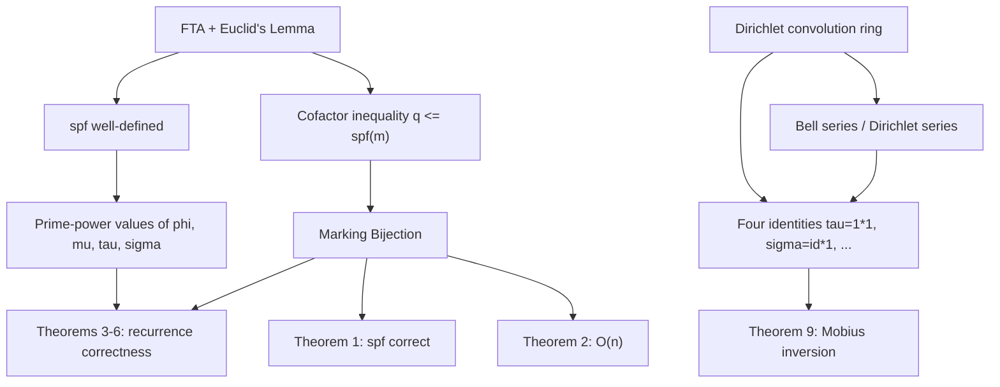

# Linear Sieve & Multiplicative Functions — Professional / Mathematical Foundations

> **Focus:** Rigorous proofs. (1) The linear sieve runs in `Θ(n)` because each composite is marked **exactly once**, by its smallest prime factor — proved via an explicit bijection. (2) The sieved recurrences for `φ`, `μ`, `τ`, `σ` are **correct**, proved from multiplicativity and the prime-power rules. (3) The algebra of **Dirichlet convolution** that places all four functions in one framework, including Möbius inversion, and explains *why* the recurrences take the form they do.

---

## Table of Contents

1. [Introduction](#introduction)
2. [Notation and Standing Assumptions](#notation-and-standing-assumptions)
3. [Foundations: Unique Factorization and SPF](#foundations-unique-factorization-and-spf)
4. [Correctness and O(n) of the Linear Sieve](#correctness-and-on-of-the-linear-sieve)
5. [Multiplicative Functions: Definitions and Prime-Power Values](#multiplicative-functions-definitions-and-prime-power-values)
6. [Correctness of the Sieved Recurrences](#correctness-of-the-sieved-recurrences)
7. [Dirichlet Convolution and the Ring of Arithmetic Functions](#dirichlet-convolution-and-the-ring-of-arithmetic-functions)
8. [Möbius Inversion](#möbius-inversion)
9. [Bell Series and Dirichlet Series](#bell-series-and-why-prime-power-behavior-suffices)
10. [Lower Bound, Complete Multiplicativity, Convolutions](#a-tight-lower-bound-the-sieve-is-θn-not-just-on)
11. [Worked Proof Walkthroughs](#worked-proof-walkthrough-φ-and-μ-over-1-12)
12. [Numerical Sanity Checks](#numerical-sanity-checks)
13. [Proof FAQ](#proof-faq)
14. [Per-Function Complexity Table](#per-function-complexity-table)
15. [Summary](#summary)
16. [Further Reading](#further-reading)

---

## Introduction

The linear sieve "obviously works," but *obvious* is not *proven*. The subtleties — why each composite is hit exactly once, why the `i % p == 0: break` is both necessary and sufficient, why the `φ`/`μ`/`τ`/`σ` recurrences agree with their closed-form definitions — are exactly what professional-level mastery demands. This file proves three central claims:

1. **Linearity & correctness of the sieve:** every composite `c ≤ n` is marked exactly once, by the unique pair `(c/spf(c), spf(c))`, giving `Θ(n)` total inner-loop work and a correct `spf` table.
2. **Recurrence correctness:** the sieved updates for `φ`, `μ`, `τ`, `σ` equal the values from the closed-form (factorization-based) definitions.
3. **Convolution framework:** all four functions are instances of Dirichlet-convolution identities (`τ = 1*1`, `σ = id*1`, `φ*1 = id`, `μ*1 = ε`), and Möbius inversion follows from `μ` being the Dirichlet inverse of `1`.

Each claim is stated as a lemma/theorem with an explicit proof you could reproduce on a whiteboard. Where a recurrence is "a trick," we show it is the local (prime-power) shadow of a global identity.

---

## Notation and Standing Assumptions

| Symbol | Meaning |
|--------|---------|
| `p`, `q` | prime numbers |
| `spf(x)` | smallest prime factor of `x` (`spf(p) = p` for prime `p`) |
| `π(x)` | number of primes `≤ x` |
| `φ(n)` | Euler's totient: count of `k ∈ [1, n]` with `gcd(k, n) = 1` |
| `μ(n)` | Möbius function |
| `τ(n)`, `σ(n)` | number of divisors, sum of divisors |
| `ω(n)` | number of *distinct* prime factors |
| `f * g` | Dirichlet convolution `Σ_{d ∣ n} f(d) g(n/d)` |
| `ε`, `1`, `id` | convolution identity (`ε(1)=1`, else 0), constant-one, identity (`id(n)=n`) |
| `[P]` | Iverson bracket: `1` if `P` true, else `0` |

Standing assumptions: all variables are positive integers unless stated; arithmetic is exact (overflow caveats are an implementation matter, not a mathematical one); "multiplicative" means `f(ab) = f(a)f(b)` whenever `gcd(a,b)=1` and `f(1) = 1`; "completely multiplicative" drops the coprimality requirement.

---

## Foundations: Unique Factorization and SPF

**Lemma (smallest divisor is prime).** Every integer `n > 1` has a smallest divisor `d > 1`, and `d` is prime. *Proof.* The set of divisors of `n` exceeding 1 is nonempty (contains `n`) and bounded below by 2, so it has a least element `d`. If `d` were composite, it would have a divisor `e` with `1 < e < d`; since `e ∣ d ∣ n`, `e ∣ n`, contradicting minimality. Hence `d` is prime. ∎

**Corollary (`√n` bound on SPF).** If `c` is composite then `spf(c) ≤ √c`. *Proof.* Write `c = spf(c)·m` with `m = c/spf(c)`. Every prime factor of `m` is `≥ spf(c)` (since `spf(c)` is the smallest prime factor of `c`, hence of any factor of `c`), so `m ≥ spf(c)`, giving `spf(c)² ≤ spf(c)·m = c`. ∎ This is the engine behind both the linear-sieve cofactor inequality and the narrow `spf` column width.

**Euclid's Lemma.** If `p` is prime and `p ∣ ab`, then `p ∣ a` or `p ∣ b`. *Proof.* If `p ∤ a` then `gcd(p, a) = 1`, so by Bézout `up + va = 1` for integers `u, v`; multiply by `b`: `upb + vab = b`. As `p ∣ upb` and `p ∣ vab`, `p ∣ b`. ∎

**Fundamental Theorem of Arithmetic.** Every `n > 1` factors into primes uniquely up to order. *Existence* by strong induction; *uniqueness* by repeated application of Euclid's lemma. ∎ This makes `spf(n)` well-defined and makes a multiplicative function determined by its values on prime powers: `f(n) = Π_i f(p_i^{a_i})`.

**Definition (SPF and the cofactor inequality).** For composite `c`, write `c = q·m` with `q = spf(c)`, `m = c/q`. Then **`q ≤ spf(m)`**. *Proof.* `m ∣ c`, so every prime factor of `m` is a prime factor of `c`, hence `≥ q = spf(c)`. In particular the smallest prime factor of `m` is `≥ q`. ∎ This single inequality is what the linear sieve exploits.

---

## Correctness and O(n) of the Linear Sieve

We analyze the procedure (junior/middle form):

```
spf[2..n] = 0; primes = []
for i = 2..n:
    if spf[i] == 0: spf[i] = i; primes.append(i)
    for p in primes:
        if p > spf[i] or i*p > n: break
        spf[i*p] = p
        if i % p == 0: break
```

**Theorem 1 (well-defined SPF & prime detection).** After the procedure, for every `2 ≤ x ≤ n`, `spf[x]` equals the true smallest prime factor of `x`; in particular `spf[x] == x` iff `x` is prime.

**Theorem 2 (linearity).** The inner loop body executes exactly `n − π(n)` times in total (once per composite `≤ n`), plus `π(n)` "prime detection" assignments, so the total work is `Θ(n)`.

Both follow from the central bijection.

**Lemma (Marking Bijection).** Define the map `Φ` from composites `c ∈ [2, n]` to pairs `(i, p)` by `Φ(c) = (c/spf(c), spf(c))`. Then:

1. For each composite `c`, the pair `(i, p) = Φ(c)` satisfies `2 ≤ i`, `p` prime, `p ≤ spf(i)`, and `i·p = c ≤ n` — i.e. it is a pair the sieve actually visits, and it sets `spf[c] = p` correctly.
2. `Φ` is injective: distinct composites map to distinct pairs.
3. Every pair `(i, p)` the sieve visits and marks corresponds to `Φ(c)` for `c = i·p`.

*Proof.*

*(1) Validity.* Let `c` be composite, `q = spf(c)`, `i = c/q`. Since `c` is composite, `i ≥ 2` (if `i = 1` then `c = q` prime, contradiction). By the cofactor inequality, `q ≤ spf(i)`. Now trace the sieve at outer index `i`: the inner loop iterates `p` over `primes` in increasing order. It does not break before reaching `q` because (a) `q ≤ spf(i)` means the guard `p > spf[i]` has not fired for any `p ≤ q`, and (b) for any prime `p < q`, `p ∤ i` — indeed if some `p < q` divided `i` it would divide `c = i·q`, contradicting `q = spf(c)` — so the `i % p == 0` break also has not fired. Hence the loop reaches `p = q`, and since `i·q = c ≤ n`, it executes `spf[c] = q`. Because `q` is genuinely the smallest prime factor of `c`, this assignment is *correct*.

*(2) Injectivity.* Suppose `Φ(c) = Φ(c')`. Then `spf(c) = spf(c') = p` and `c/p = c'/p`, so `c = c'`.

*(3) Surjectivity onto visited markings.* Suppose at outer index `i`, inner prime `p`, the sieve executes `spf[i·p] = p` (i.e. it did not break before reaching `p`). We must show `p = spf(i·p)`, so that `(i, p) = Φ(i·p)`. Because the loop processes primes in increasing order and has not broken, every prime `p' < p` in the list satisfies `p' ∤ i` (otherwise the `i % p' == 0` break would have fired at `p'`), and also `p' ≤ spf(i)`. So no prime smaller than `p` divides `i`; combined with `p ≤ spf(i)` (guard not fired), the smallest prime dividing `i` is `≥ p`. Then the smallest prime dividing `i·p` is `min(p, spf(i)) = p`. Hence `p = spf(i·p)`. ∎

**Proof of Theorem 1.** By part (1), each composite `c` gets `spf[c]` set to its true smallest prime factor at index `i = c/spf(c)`. By part (3), the sieve never sets `spf[x]` to a *wrong* value (every marking is `spf(i·p) = p` correctly). A prime `x` is never an `i·p` with `p ≤ spf(i)` and `i ≥ 2` (that product is composite), so its `spf[x]` stays 0 until the outer loop reaches `i = x` and sets `spf[x] = x`. Thus `spf[x] = x` iff `x` is prime. ∎

**Proof of Theorem 2.** By parts (1)–(3), the markings the sieve performs are in bijection with the composites `≤ n`. Each marking is one inner-loop body execution that does *not* trivially break-before-marking; the only additional inner-loop iterations are the ones that *do* break, and each outer index `i` triggers at most one break, contributing `≤ n` extra iterations. Hence total inner-loop work is `(n − π(n)) + O(n) = Θ(n)`, and prime detection adds `π(n) = O(n)`. Total: `Θ(n)`. ∎

**Remark (necessity of the break).** Without `i % p == 0: break`, the sieve would, at index `i` divisible by `p`, continue to a larger prime `p'` and set `spf[i·p'] = p'` — but `spf(i·p') = p < p'` since `p ∣ i ∣ i·p'`. That is a *wrong* assignment, and it also double-marks `i·p'` (again at `i' = i·p'/p`). The break is therefore both a correctness and a linearity requirement, not an optimization.

---

## Multiplicative Functions: Definitions and Prime-Power Values

**Definition.** `f` is *multiplicative* if `f(1) = 1` and `f(ab) = f(a)f(b)` whenever `gcd(a, b) = 1`. Consequently `f(n) = Π_i f(p_i^{a_i})` for `n = Π p_i^{a_i}`.

We record the prime-power values used by the recurrences.

**Multiplicativity of `φ` (full proof via CRT).** We claim `φ(mn) = φ(m)φ(n)` for `gcd(m, n) = 1`. By the Chinese Remainder Theorem, the map `x mod mn ↦ (x mod m, x mod n)` is a bijection between `ℤ/mn` and `ℤ/m × ℤ/n`. Under it, `gcd(x, mn) = 1 ⟺ gcd(x, m) = 1 and gcd(x, n) = 1`, because a prime dividing both `x` and `mn` divides exactly one of `m, n` (they are coprime) and hence divides `x` and that one factor. So the units of `ℤ/mn` correspond exactly to pairs of units of `ℤ/m` and `ℤ/n`: `φ(mn) = |units of ℤ/mn| = |units of ℤ/m| · |units of ℤ/n| = φ(m)φ(n)`. ∎ This is the structural reason `φ` is multiplicative; the sieve's coprime case is its `(m, n) = (i, p)` instance.

**Euler totient.** `φ(p^a) = p^a − p^{a−1} = p^{a−1}(p − 1)`. *Proof.* Among `1..p^a`, the integers *not* coprime to `p^a` are exactly the multiples of `p`, of which there are `p^{a−1}`. ∎

**Möbius.** `μ(1) = 1`; `μ(p_1⋯p_k) = (−1)^k` for distinct primes; `μ(n) = 0` if any prime divides `n` more than once. Equivalently `μ(p) = −1`, `μ(p^a) = 0` for `a ≥ 2`. `μ` is multiplicative (a product of coprime squarefree parts is squarefree with additive `ω`).

**Divisor count.** `τ(p^a) = a + 1` (divisors `1, p, …, p^a`); `τ` multiplicative, so `τ(n) = Π (a_i + 1)`. *Multiplicativity proof.* For `gcd(m, n) = 1`, every divisor `d ∣ mn` factors uniquely as `d = d_1 d_2` with `d_1 ∣ m`, `d_2 ∣ n` (a consequence of FTA, since the prime sets of `m` and `n` are disjoint). This is a bijection between divisors of `mn` and pairs of divisors, so `τ(mn) = τ(m)τ(n)`. ∎

**Divisor sum.** `σ(p^a) = 1 + p + ⋯ + p^a = (p^{a+1} − 1)/(p − 1)`; `σ` multiplicative, so `σ(n) = Π (p_i^{a_i+1} − 1)/(p_i − 1)`. *Multiplicativity proof.* Using the same divisor bijection, `σ(mn) = Σ_{d∣mn} d = Σ_{d_1∣m} Σ_{d_2∣n} d_1 d_2 = (Σ_{d_1∣m} d_1)(Σ_{d_2∣n} d_2) = σ(m)σ(n)`. ∎ Both proofs reduce to the single fact that coprime factors have disjoint prime supports, so their divisor lattices are independent — the same independence that the Bell-series factorization (Theorem 11) expresses analytically.

---

## Correctness of the Sieved Recurrences

Fix the marking `spf[i·p] = p` with `p = spf(i·p)`. Two cases (from the proof of surjectivity, `p` is the smallest prime of `i·p`, and `p ≤ spf(i)`):

- **Case A (coprime, `p ∤ i`):** then `gcd(i, p) = 1`.
- **Case B (square factor, `p ∣ i`, i.e. `p = spf(i)`):** then `i = p^b · u` with `b ≥ 1`, `p ∤ u`, and `i·p = p^{b+1}·u`.

**Theorem 3 (φ recurrence).**
*Case A:* `φ(i·p) = φ(i)·(p − 1)`. *Proof.* `gcd(i,p)=1`, multiplicativity gives `φ(i·p) = φ(i)φ(p) = φ(i)(p−1)`. ∎
*Case B:* `φ(i·p) = φ(i)·p`. *Proof.* Write `i = p^b u`, `p ∤ u`. Then `φ(i) = φ(p^b)φ(u) = p^{b−1}(p−1)φ(u)` and `φ(i·p) = φ(p^{b+1})φ(u) = p^{b}(p−1)φ(u) = p·φ(i)`. ∎

**Theorem 4 (μ recurrence).**
*Case A:* `μ(i·p) = −μ(i)`. *Proof.* `gcd(i,p)=1`, so `μ(i·p) = μ(i)μ(p) = −μ(i)`. ∎
*Case B:* `μ(i·p) = 0`. *Proof.* `p ∣ i`, so `p² ∣ i·p`; a squared prime forces `μ = 0`. ∎

**Theorem 5 (τ recurrence with `cnt`).** Let `cnt[x]` = exponent of `spf(x)` in `x`.
*Case A:* `cnt[i·p] = 1` and `τ(i·p) = τ(i)·2`. *Proof.* `p` is new (exponent 1, contributing factor `1+1=2`); coprimality gives `τ(i·p) = τ(i)τ(p) = 2τ(i)`. ∎
*Case B:* `cnt[i·p] = cnt[i] + 1` and `τ(i·p) = τ(i)/(cnt[i]+1)·(cnt[i]+2)`. *Proof.* Here `p = spf(i)` with exponent `cnt[i] = b`, so `τ(i) = (b+1)·T` where `T = Π_{other primes}(a_j+1)`. After multiplying by `p`, the exponent is `b+1`, giving `τ(i·p) = (b+2)·T = τ(i)·(b+2)/(b+1)`. The division is exact since `(b+1) ∣ τ(i)`. ∎

**Theorem 6 (σ recurrence with `low`).** Let `low[x] = 1 + p + ⋯ + p^{cnt[x]}` where `p = spf(x)` (the geometric-sum factor of the smallest prime).
*Case A:* `low[i·p] = p + 1` and `σ(i·p) = σ(i)·(p + 1)`. *Proof.* New prime to power 1 contributes `(1+p)`; coprimality gives `σ(i·p) = σ(i)σ(p) = σ(i)(p+1)`. ∎
*Case B:* `low[i·p] = low[i]·p + 1` and `σ(i·p) = σ(i)/low[i]·low[i·p]`. *Proof.* With `p = spf(i)`, `σ(i) = low[i]·S` where `S = Π_{other}σ(p_j^{a_j})` and `low[i] = 1 + p + ⋯ + p^b`. After multiplying by `p`, the geometric factor becomes `1 + p + ⋯ + p^{b+1} = low[i]·p + 1`, so `σ(i·p) = (low[i]·p + 1)·S = σ(i)·(low[i]·p+1)/low[i]`. The division is exact since `low[i] ∣ σ(i)`. ∎

These six theorems prove the sieve fills `φ`, `μ`, `τ`, `σ` correctly for every `x ≤ n`, since every `x > 1` is reached as some `i·p` with `p = spf(x)` (Marking Bijection) and `f(1) = 1` is seeded.

---

## Dirichlet Convolution and the Ring of Arithmetic Functions

**Definition.** For arithmetic functions `f, g`, their *Dirichlet convolution* is

```
(f * g)(n) = Σ_{d ∣ n} f(d) g(n/d).
```

**Theorem 7 (commutative ring).** The set of arithmetic functions with `f(1) ≠ 0` under pointwise `+` and `*` forms a commutative ring with identity `ε` (`ε(1)=1`, else 0); a function `f` has a Dirichlet inverse iff `f(1) ≠ 0`. *Proof sketch.* Commutativity: substitute `d ↦ n/d`. Associativity: both `((f*g)*h)(n)` and `(f*(g*h))(n)` equal `Σ_{abc=n} f(a)g(b)h(c)`. Identity: `(f*ε)(n) = Σ_{d∣n} f(d)ε(n/d) = f(n)`. Inverse: define `f^{-1}` recursively from `f*f^{-1}=ε`; solvable when `f(1)≠0`. ∎

**Theorem 8 (convolution preserves multiplicativity).** If `f, g` are multiplicative, so is `f * g`. *Proof.* For `gcd(m,n)=1`, every divisor `d ∣ mn` factors uniquely as `d = d_1 d_2` with `d_1 ∣ m`, `d_2 ∣ n`, `gcd(d_1,d_2)=1`; then `(f*g)(mn) = Σ_{d_1∣m}Σ_{d_2∣n} f(d_1 d_2)g((m/d_1)(n/d_2)) = (f*g)(m)·(f*g)(n)` using multiplicativity of `f, g` on coprime arguments. ∎

**The four identities.**

| Identity | Statement | Proof |
|----------|-----------|-------|
| `τ = 1 * 1` | `τ(n) = Σ_{d∣n} 1` | by definition of `τ` |
| `σ = id * 1` | `σ(n) = Σ_{d∣n} d` | by definition of `σ` |
| `μ * 1 = ε` | `Σ_{d∣n} μ(d) = [n=1]` | for `n = Π p_i^{a_i} > 1`, `Σ_{d∣n} μ(d) = Σ_{S ⊆ {p_i}} (−1)^{|S|} = (1−1)^{ω(n)} = 0` (binomial), and `=1` at `n=1` |
| `φ * 1 = id` | `Σ_{d∣n} φ(d) = n` | partition `{1,…,n}` by `gcd(k,n)=n/d`; the count with a given `gcd` is `φ(d)` |

Because each is built from multiplicative `1`, `id`, `μ`, `φ`, Theorem 8 re-confirms `τ`, `σ`, `μ`, `φ` are multiplicative — closing the loop with the prime-power computations. The sieve, then, is a *linear-time evaluator* of functions specified by such identities.

---

## Möbius Inversion

**Theorem 9 (Möbius inversion).** If `g(n) = Σ_{d∣n} f(d)` (i.e. `g = f * 1`), then `f(n) = Σ_{d∣n} μ(d) g(n/d)` (i.e. `f = g * μ`). *Proof.* `g = f*1`. Convolve both sides with `μ`: `g * μ = f * 1 * μ = f * (1 * μ) = f * ε = f`, using associativity and `1 * μ = ε` (Theorem on the four identities). ∎

**Consequence (deriving `φ` from `φ*1 = id`).** Since `φ * 1 = id`, inversion gives `φ = id * μ`, i.e. `φ(n) = Σ_{d∣n} μ(d)·(n/d) = n Σ_{d∣n} μ(d)/d`. For `n = Π p^a` this telescopes to `n Π (1 − 1/p)` — the closed form. The sieve's `φ` recurrence is the prime-power instance of exactly this identity.

Möbius inversion, with `μ` supplied for free by the linear sieve, is the workhorse behind coprime-counting, squarefree-counting, and inclusion-exclusion-over-divisors problems. The practical pipeline is: express the quantity as `g = f * 1`, invert to `f = g * μ`, and evaluate using sieved `μ`.

---

## Structure of the Argument

Before the details, here is the dependency graph of the proofs in this file, so the logical structure is explicit:



Everything flows from two roots: the **Fundamental Theorem of Arithmetic** (making `spf` and prime-power factorization well-defined) and the **cofactor inequality** (making the marking map a bijection). The recurrence proofs draw on *both* the bijection (which case are we in?) and the prime-power values (what does `f` do there?). The convolution layer is an independent algebraic structure that re-derives the same facts and supplies Möbius inversion.

---

## A Tight Lower Bound: the Sieve Is Θ(n), Not Just O(n)

We proved an `O(n)` upper bound. The matching `Ω(n)` lower bound is immediate but worth stating for completeness, because it certifies the algorithm is *asymptotically optimal* for the problem of filling an `spf` table.

**Theorem 10 (lower bound).** Any algorithm that writes a correct `spf[x]` (or any per-`x` function value) for all `2 ≤ x ≤ n` must perform `Ω(n)` operations.

*Proof.* The output is an array of `n − 1` entries, each of which depends on `x` (e.g. `spf` differs across infinitely many `x`, and certainly across `[2, n]`). An algorithm cannot produce `n − 1` distinct, input-dependent outputs in fewer than `n − 1` write operations, since each output cell must be written at least once. Hence `Ω(n)` writes, so `Ω(n)` time. ∎

Combined with Theorem 2 (`O(n)`), the linear sieve is **`Θ(n)`** — it is optimal up to constant factors for producing the full table. This is a stronger statement than the classic sieve can make: Eratosthenes is `Θ(n log log n)` *for its work*, strictly more than the `Θ(n)` output size, precisely because of the multi-marking the bijection eliminates.

**Remark (where the constant lives).** The `Θ(n)` hides a constant that, per composite, includes: one `spf` write, one `f` write per maintained function, the modulo `i % p`, and the loop bookkeeping. The linear sieve's constant is larger than Eratosthenes' bit-cross-out constant — which is why, for *primality only* (output is `n` bits, also `Θ(n)` to produce, but Eratosthenes' constant is tiny), Eratosthenes can win wall-clock despite its worse asymptotic. Asymptotic optimality and wall-clock optimality are different claims; the linear sieve achieves the former for the *full-table* problem.

---

## Multiplicative vs Completely Multiplicative

A subtlety that the recurrences quietly depend on: `φ`, `μ`, `τ`, `σ` are **multiplicative** but *not* **completely multiplicative**.

**Definition.** `f` is *completely multiplicative* if `f(ab) = f(a)f(b)` for **all** `a, b` (not only coprime ones).

**Counterexample (why the distinction matters).** `φ(4) = 2`, but `φ(2)·φ(2) = 1·1 = 1 ≠ 2`. So `φ` is not completely multiplicative; the coprime hypothesis is essential. This is *exactly* why the sieve needs the two-case split: in the square-factor case `p ∣ i`, the arguments `i` and `p` are **not** coprime, so we may not use `f(i·p) = f(i)f(p)` and must fall back to the prime-power recurrence.

| Function | Multiplicative? | Completely multiplicative? | Prime-power value |
|----------|-----------------|----------------------------|-------------------|
| `φ` | yes | no (`φ(p²)=p²−p ≠ φ(p)²`) | `p^{a-1}(p-1)` |
| `μ` | yes | no (`μ(p²)=0 ≠ μ(p)²=1`) | `0` for `a≥2` |
| `τ` | yes | no (`τ(p²)=3 ≠ τ(p)²=4`) | `a+1` |
| `σ` | yes | no (`σ(p²)=1+p+p² ≠ σ(p)²`) | `(p^{a+1}−1)/(p−1)` |
| `id`, `1` | yes | **yes** | `id(p^a)=p^a`, `1(p^a)=1` |

**Consequence for sieving a new function.** If a function happens to be *completely* multiplicative (like the Liouville function `λ`, where `λ(n) = (−1)^{Ω(n)}` and `λ(p^a) = (−1)^a`), the square-factor case simplifies to `f(i·p) = f(i)·f(p)` *even though* `p ∣ i`, because complete multiplicativity drops the coprimality requirement. Recognizing whether your target function is merely multiplicative or completely multiplicative tells you whether the square-factor branch needs the prime-power rule or can reuse the coprime rule.

---

## Bell Series and Why Prime-Power Behavior Suffices

The deepest "why" behind the sieve is that a multiplicative function is *completely determined by its restriction to prime powers*, and Dirichlet convolution acts **independently at each prime**. The formal device is the **Bell series**.

**Definition (Bell series).** For a multiplicative `f` and a fixed prime `p`, the Bell series of `f` at `p` is the formal power series

```
f_p(t) = Σ_{k ≥ 0} f(p^k) t^k.
```

**Theorem 11 (Bell series multiply under convolution).** For multiplicative `f, g`, `(f * g)_p(t) = f_p(t) · g_p(t)` for every prime `p`.

*Proof.* `(f*g)(p^k) = Σ_{i=0}^{k} f(p^i) g(p^{k-i})` (the only divisors of `p^k` are powers of `p`). This is precisely the coefficient of `t^k` in `f_p(t) g_p(t)`. ∎

This theorem is the structural reason every recurrence in this topic is a *local, per-prime* statement. Examples:

| Function | Bell series at `p` | Closed form |
|----------|--------------------|-------------|
| `1` | `1 + t + t² + ⋯ = 1/(1−t)` | constant one |
| `μ` | `1 − t` | note `(1−t)·1/(1−t) = 1` ⇒ `μ * 1 = ε` |
| `id` | `1 + pt + p²t² + ⋯ = 1/(1−pt)` | identity |
| `φ` | `(1−t)/(1−pt)` | since `φ = id * μ` ⇒ `φ_p = id_p · μ_p` |
| `τ` | `1/(1−t)²` | since `τ = 1 * 1` |
| `σ` | `1/((1−t)(1−pt))` | since `σ = id * 1` |

Read off `φ_p(t) = (1−t)/(1−pt) = (1−t)(1 + pt + p²t² + ⋯)`: the coefficient of `t^k` is `p^k − p^{k-1}`, exactly `φ(p^k)`. The convolution identities `μ*1=ε`, `φ=id*μ`, `τ=1*1`, `σ=id*1` become trivial *polynomial* identities in `t` — which is why they hold and why the sieve, working prime-by-prime, computes them correctly.

---

## Worked Proof Walkthrough: φ and μ over [1, 12]

We re-derive the junior walkthrough as a formal trace, citing the theorems. Seed `φ(1)=μ(1)=1`.

| Step | Marking | Case | Theorem | Result |
|------|---------|------|---------|--------|
| `i=2` prime | — | — | def | `φ(2)=1, μ(2)=−1` |
| `i=2, p=2` | `spf[4]=2` | B (`2∣2`) | T3/T4 | `φ(4)=φ(2)·2=2, μ(4)=0` |
| `i=3` prime | — | — | def | `φ(3)=2, μ(3)=−1` |
| `i=3, p=2` | `spf[6]=2` | A (`2∤3`) | T3/T4 | `φ(6)=φ(3)·1=2, μ(6)=−μ(3)=1` |
| `i=3, p=3` | `spf[9]=3` | B (`3∣3`) | T3/T4 | `φ(9)=φ(3)·3=6, μ(9)=0` |
| `i=4, p=2` | `spf[8]=2` | B (`2∣4`) | T3/T4 | `φ(8)=φ(4)·2=4, μ(8)=0` |
| `i=5` prime | — | — | def | `φ(5)=4, μ(5)=−1` |
| `i=5, p=2` | `spf[10]=2` | A | T3/T4 | `φ(10)=φ(5)·1=4, μ(10)=1` |
| `i=6, p=2` | `spf[12]=2` | B (`2∣6`) | T3/T4 | `φ(12)=φ(6)·2=4, μ(12)=0` |

Every entry matches the closed forms: `φ(12) = 12(1−½)(1−⅓) = 4`; `μ(12) = 0` (`2²∣12`); `μ(6) = +1` (two distinct primes). The Marking Bijection guarantees `4, 6, 8, 9, 10, 12` were each marked exactly once — observe each appears in exactly one row.

---

## Computing Arbitrary Dirichlet Convolutions in O(n log n)

The linear sieve evaluates *multiplicative* functions in `Θ(n)`. For a **general** (not necessarily multiplicative) convolution `h = f * g`, there is a complementary divisor-sum algorithm worth stating, because it is the tool you reach for when the function is *not* multiplicative and the sieve recurrences do not apply.

**Theorem 13 (harmonic-sum convolution).** Given `f, g` on `[1, n]`, the array `h(m) = Σ_{d ∣ m} f(d) g(m/d)` for all `m ≤ n` can be computed in `Θ(n log n)` time.

*Proof / algorithm.* Initialize `h ≡ 0`. For each `d` from `1` to `n`, and each multiple `m = d, 2d, 3d, …, ≤ n`, add `f(d)·g(m/d)` to `h(m)`. Every divisor pair `(d, m/d)` with `d ∣ m ≤ n` is enumerated exactly once. The total iteration count is `Σ_{d=1}^{n} ⌊n/d⌋ = Θ(n log n)` (the harmonic sum). ∎

```text
for d = 1..n:
    for m = d, 2d, 3d, ... <= n:
        h[m] += f[d] * g[m/d]
# cost: sum of n/d = n * H_n = Theta(n log n)
```

**Relationship to the sieve.** When `f, g` are multiplicative, `h = f * g` is multiplicative (Theorem 8), so the linear sieve computes it in `Θ(n)` — strictly better than `Θ(n log n)`. The harmonic-sum method is the fallback for the non-multiplicative case (or for a one-off convolution where coding the sieve recurrence is not worth it). The two methods agree on multiplicative inputs, which is a useful cross-check: sieve `φ` in `Θ(n)`, independently compute `id * μ` by the harmonic method, and assert they match — a strong test of *both* implementations.

**Möbius inversion as a convolution.** Concretely, to recover `f` from `g = f * 1` you compute `f = g * μ` by the same harmonic loop with `g` and `μ`. With sieved `μ`, this is `Θ(n log n)` and requires no factorization — the practical form of Theorem 9 for array-valued problems.

---

## Termination and the Loop-Variant Argument

For completeness we record the termination argument in loop-variant form, the style expected when presenting the proof at a whiteboard.

**Claim.** The procedure terminates and runs in finitely many steps.

```text
Outer loop variant:  V_out = n - i, strictly decreasing each outer iteration,
                     bounded below by 0  ->  at most n-1 outer iterations.

Inner loop variant:  the index into `primes` strictly increases each inner
                     iteration; it is bounded by |primes| <= pi(n); and the
                     loop additionally breaks when p > spf[i], i*p > n, or p | i.
                     -> finitely many inner iterations per outer iteration.

Aggregate bound (Theorem 2): the total number of inner-loop *markings* equals
                     |{composites <= n}| = n - 1 - pi(n)  (the bijection),
                     plus at most one break per outer index (<= n-1 extra),
                     so total inner work = Theta(n).
```

**Postcondition.** On exit, for every `2 ≤ x ≤ n`, `spf[x]` holds the true smallest prime factor (Theorem 1), and `φ[x]`, `μ[x]`, `τ[x]`, `σ[x]` hold the correct multiplicative-function values (Theorems 3–6), because every such `x` was visited as `i·p` with `p = spf(x)` exactly once (Marking Bijection) and `f(1)` was seeded. ∎

This closes the gap between "the bijection exists" and "the program halts with the right array contents" — the two halves a rigorous correctness proof must connect.

---

## Numerical Sanity Checks

Validate any implementation against these (all derivable from the theorems above):

| Check | Value | Source |
|-------|-------|--------|
| `φ(36)` | `12` | `36 = 2²3²`, `φ = 36(½)(⅔) = 12` |
| `μ(30)`, `μ(12)` | `−1`, `0` | `30=2·3·5` (3 primes), `12=2²·3` (square) |
| `τ(360)` | `24` | `360 = 2³3²5`, `(4)(3)(2)` |
| `σ(360)` | `1170` | `(2⁴−1)(3³−1)/2·(5²−1)/4 = 15·13·6` |
| `Σ_{d∣24} φ(d)` | `24` | identity `φ*1 = id` |
| `Σ_{d∣n} μ(d)` | `[n=1]` | identity `μ*1 = ε` |
| `Σ_{x=1}^{100} φ(x)` | `3045` | totient summatory |
| `Σ_{x=1}^{100} μ(x)` (Mertens) | `1` | `M(100) = 1` |

The two *identity* checks (`φ*1=id`, `μ*1=ε`) are the most valuable: they validate the relationships across the whole table, catching errors that point checks at a few values would miss.

**A cross-method check from Theorem 13.** Because `φ = id * μ`, you can compute `φ` two independent ways and assert agreement: (1) the linear-sieve recurrence in `Θ(n)`, and (2) the harmonic-sum convolution `id * μ` in `Θ(n log n)` using the sieved `μ`. A discrepancy at any index localizes the bug to one of the two implementations — a stronger statement than either method passing its own spot checks. The same holds for `σ = id * 1` and `τ = 1 * 1`: each multiplicative function is both a sieve recurrence *and* a convolution, and the two must coincide everywhere.

| Cross-check | Sieve side | Convolution side | Identity used |
|-------------|-----------|------------------|---------------|
| `φ` | recurrence (`Θ(n)`) | `id * μ` (`Θ(n log n)`) | `φ = id * μ` |
| `σ` | recurrence (`Θ(n)`) | `id * 1` (`Θ(n log n)`) | `σ = id * 1` |
| `τ` | recurrence (`Θ(n)`) | `1 * 1` (`Θ(n log n)`) | `τ = 1 * 1` |
| `μ` (implicit) | recurrence (`Θ(n)`) | invert `1` via `μ*1=ε` | `μ * 1 = ε` |

---

## Proof FAQ

A few questions that recur when this material is presented rigorously.

**Q. Why does `spf[prime] = prime` not break the bijection?** Primes are not in the domain of the marking map (it is defined on *composites*). A prime `x` gets its `spf` set in the *outer* loop's prime-detection branch, not by any `(i, p)` marking. So primes and composites are handled by disjoint mechanisms, and the bijection covers exactly the composites.

**Q. Could two different primes both be the "smallest" factor of some `c`?** No — `spf(c)` is unique because the prime factorization is unique (FTA). Uniqueness of `spf` is precisely what makes the marking pair `(c/spf(c), spf(c))` well-defined, hence the map a function at all.

**Q. Why is the inner loop's `p ≤ spf[i]` guard equivalent to checking `i % p == 0` after the fact?** Because `primes` is scanned in increasing order. The first prime `p` with `p ∣ i` is, by definition, `spf(i)`. So "break when `p ∣ i`" fires at exactly `p = spf(i)`, the same point as "break when `p > spf[i]` would next fire." The two formulations select the identical set of `(i, p)` pairs.

**Q. Does the order of the function updates matter?** The reads `f(i)` must occur before any write that could clobber `f(i)`. Since the sieve only ever *writes* to indices `i·p > i`, and reads `f(i)` at index `i`, no write within the same outer iteration touches index `i`. The updates are therefore safe in any order within the inner loop.

**Q. Why must `low[i]` divide `σ(i)` exactly?** Because `σ` is multiplicative and `low[i]` is exactly the factor `σ(p^{cnt[i]})` for `p = spf(i)`; the remaining `σ(i)/low[i]` is the product over the *other* primes, an integer. The same reasoning makes `(cnt[i]+1)` divide `τ(i)` exactly. These exact-division facts fail mod `M`, which is why modular sieving keeps the factors separately.

**Q. Is the `Θ(n)` bound affected by maintaining more functions?** No, as long as the function count `k` is a constant. Each function adds `O(1)` work per marking (Per-Function Complexity Table), so the total is `Θ(k·n) = Θ(n)` for fixed `k`. The bijection — and hence the number of *markings* — is unchanged; only the per-marking constant grows. The asymptotic class is robust to how many functions you sieve.

**Q. Does the proof assume `n` fits in a machine word?** The *mathematical* proof is over the integers and assumes exact arithmetic; it makes no machine assumption. The implementation caveat (overflow of `σ`, narrow `spf` columns) is an engineering concern addressed in [`senior.md`](./senior.md), explicitly separated from the correctness argument per the standing assumptions. A proof of an algorithm and a proof about a particular machine realization of it are different claims; this file proves the former.

**Q. Could a non-multiplicative function be sieved this way?** Not by these recurrences — they rely on `f(i·p) = f(i)f(p)` in the coprime case, which is exactly multiplicativity. A general (non-multiplicative) `f` defined by a convolution must use the `Θ(n log n)` harmonic method (Theorem 13) instead; the linear sieve's `Θ(n)` speed is a *reward* for multiplicativity, not a free lunch for arbitrary arithmetic functions.

---

## Worked Proof Walkthrough: τ and σ over a prime power

The `φ`/`μ` trace above never exercises the auxiliary arrays. Here we trace `τ` and `σ` along the chain `2 → 4 → 8`, where the square-factor branch and its `cnt`/`low` bookkeeping do all the work. Seed `τ(1)=σ(1)=1`.

| Step | Marking | `cnt` | `low` | `τ` update | `σ` update |
|------|---------|-------|-------|------------|------------|
| `i=2` prime | — | `cnt[2]=1` | `low[2]=3` | `τ(2)=2` | `σ(2)=3` |
| `i=2, p=2` (B) | `spf[4]=2` | `cnt[4]=cnt[2]+1=2` | `low[4]=low[2]·2+1=7` | `τ(4)=τ(2)/(1+1)·(1+2)=2/2·3=3` | `σ(4)=σ(2)/low[2]·low[4]=3/3·7=7` |
| `i=4, p=2` (B) | `spf[8]=2` | `cnt[8]=cnt[4]+1=3` | `low[8]=low[4]·2+1=15` | `τ(8)=τ(4)/(2+1)·(2+2)=3/3·4=4` | `σ(8)=σ(4)/low[4]·low[8]=7/7·15=15` |

Check against the closed forms: `τ(4)=3` (divisors `1,2,4`) ✓, `τ(8)=4` (`1,2,4,8`) ✓; `σ(4)=1+2+4=7` ✓, `σ(8)=1+2+4+8=15` ✓. Note how each division is **exact**: `(cnt+1)` always divides `τ` (Theorem 5) and `low[i]` always divides `σ` (Theorem 6). The `low` array tracks the running geometric sum `1+2+4+…` precisely so the square-factor step can "swap out" the old factor for the new one without re-deriving it.

Now a *mixed* chain `6 → 12` exercises the interaction of two primes. With `6 = 2·3`: `τ(6)=4` (`1,2,3,6`), `σ(6)=12`, `cnt[6]=1` (exponent of `spf=2`), `low[6]=3`. At `i=6, p=2` (B, since `2∣6`): `cnt[12]=2`, `low[12]=low[6]·2+1=7`, `τ(12)=τ(6)/(1+1)·(1+2)=4/2·3=6`, `σ(12)=σ(6)/low[6]·low[12]=12/3·7=28`. Verify: `12=2²·3`, divisors `1,2,3,4,6,12` ⇒ `τ=6` ✓, sum `=28` ✓. The auxiliary arrays correctly isolate the smallest prime's contribution while leaving the `3`-factor untouched.

---

## Dirichlet Series: the Analytic Shadow

Dirichlet convolution has an analytic counterpart that explains *why* these particular functions recur together throughout number theory. To each arithmetic function `f` associate its **Dirichlet series**

```
D(f, s) = Σ_{n ≥ 1} f(n) / n^s.
```

**Theorem 12 (series multiply under convolution).** `D(f * g, s) = D(f, s) · D(g, s)`, wherever both series converge. *Proof.* Multiply the two series and collect terms by the value of the product of indices: the coefficient of `n^{-s}` in the product is `Σ_{ab=n} f(a)g(b) = Σ_{d∣n} f(d)g(n/d) = (f*g)(n)`. ∎

This is the *exact* analytic mirror of Theorem 8 (convolution preserves multiplicativity) and Theorem 11 (Bell series multiply): convolution becomes ordinary multiplication of generating functions. The headline special case is the **Riemann zeta function** `ζ(s) = Σ n^{-s} = D(1, s)`. Then every identity from this topic becomes a `ζ` identity:

| Convolution identity | Dirichlet-series identity |
|----------------------|---------------------------|
| `τ = 1 * 1` | `D(τ, s) = ζ(s)²` |
| `σ = id * 1` | `D(σ, s) = ζ(s)·ζ(s−1)` |
| `μ * 1 = ε` | `D(μ, s)·ζ(s) = 1`, so `D(μ, s) = 1/ζ(s)` |
| `φ * 1 = id` | `D(φ, s)·ζ(s) = ζ(s−1)`, so `D(φ, s) = ζ(s−1)/ζ(s)` |

The relation `D(μ, s) = 1/ζ(s)` is one of the most consequential facts in analytic number theory: the Euler product `ζ(s) = Π_p (1 − p^{-s})^{-1}` gives `1/ζ(s) = Π_p (1 − p^{-s})`, whose `n^{-s}` coefficient is exactly `μ(n)`. So `μ` *is* the multiplicative inverse of the constant function `1`, in both the convolution ring and the Dirichlet-series ring — the same fact wearing two costumes. The linear sieve, which computes `μ` directly, is the discrete, finite-`n` evaluator for the object that analytically equals `1/ζ`.

We do not need the analytic machinery to run the sieve, but it answers the "why these four functions?" question definitively: they are the natural divisors and quotients of `ζ` and `ζ(s−1)`, the two simplest Dirichlet series, under the multiplication that the sieve computes locally at every prime.

---

## The Necessity of the `√n`-Style Cofactor Bound, Restated

It is worth isolating *why* the cofactor inequality `spf(c) ≤ spf(c/spf(c))` is the precise hinge of linearity, because a common faulty "optimization" violates it.

**Failure mode (iterate `i` over primes, `j` over all numbers).** A tempting but wrong variant marks `p·j` for every `p` and every `j ≤ n/p`. This is just Eratosthenes re-skinned: `12` is marked by `(2, 6)` and by `(3, 4)` — two markings. The linear sieve forbids the `(3, 4)` marking because at `i = 4`, the inner loop breaks at `p = 2` (`2 ∣ 4`) before ever reaching `p = 3`. The break enforces `p ≤ spf(i)`, which is exactly the cofactor bound that makes `(i, p) = (c/spf(c), spf(c))` the *unique* admissible factorization.

**Lemma (uniqueness is equivalent to the break).** The marking map is injective *iff* the inner loop enforces `p ≤ spf(i)`. *Proof.* (⇐) Shown in the Marking Bijection. (⇒) If for some `i` with `spf(i) = q` the loop reached a prime `p > q`, it would mark `i·p` with `spf[i·p] = p`; but `q ∣ i ∣ i·p` and `q < p` means `spf(i·p) = q ≠ p`, so this is both a wrong value and a *second* marking of `i·p` (the correct one occurs at `i' = i·p/q`). Injectivity fails. ∎

This is the formal statement of the junior-level mantra "the break is mandatory." It is not a heuristic: injectivity of the marking map — hence both `O(n)` and correctness of `spf` — is *logically equivalent* to enforcing `p ≤ spf(i)`.

**Corollary (the prime list is produced in increasing order).** The `primes` array, appended to whenever `spf[i] == 0` at outer index `i`, contains exactly the primes `≤ n` in strictly increasing order. *Proof.* The outer loop visits `i = 2, 3, …, n` in order, so any appends happen in increasing-`i` order. An index `i` is appended iff `spf[i]` was never set by a marking, which (Theorem 1) happens iff `i` is prime. Hence `primes` lists the primes `≤ n` ascending. ∎ This ordering is not incidental: the inner loop's correctness depends on scanning `primes` from smallest to largest (so the first divisor it meets is `spf(i)`), and this corollary certifies the array it scans has that property by construction — no separate sort is ever needed.

**Lemma (read-before-clobber safety).** Within one outer iteration `i`, every read of a function value `f(i)` precedes any write that could overwrite it. *Proof.* The inner loop only ever writes to indices `i·p` with `p ≥ 2`, so `i·p > i`; the index `i` itself is never written during iteration `i`. Therefore `f(i)`, read on the right-hand side of each recurrence, retains its final value throughout the inner loop, and the order of the updates within the loop is immaterial. ∎ This is the formal guarantee that the in-place sieve needs no double-buffering: the dependency `f(i) → f(i·p)` always points from a *settled* index to a *future* one.

---

## Comparison with Alternatives

| Attribute | Linear (Euler) sieve | Eratosthenes | Per-number factorization |
|-----------|----------------------|--------------|--------------------------|
| Work | `Θ(n)` (output-optimal) | `Θ(n log log n)` | `Σ √x = Θ(n^{3/2})` for all `x ≤ n` |
| Output | `spf` + primes + `φ`/`μ`/`τ`/`σ` | primality bits | one value at a time |
| Per-composite marks | exactly 1 | `ω(c)` (once per distinct prime) | n/a |
| Multiplicative tables | yes, same pass | no (needs extra factorization) | yes, but `Θ(n^{3/2})` total |
| Memory | `Θ(n)` ints | `Θ(n)` bits | `Θ(1)` |
| Cache friendliness | scattered writes | dense bit stride | n/a |
| Deterministic? | yes | yes | yes |
| Asymptotically optimal for full table? | **yes** (`Θ(n)`) | no (`log log n` overhead) | no (`√n` overhead) |

The linear sieve is the unique entry that is *output-optimal* (`Θ(n)`) **and** produces the multiplicative tables in one pass. Eratosthenes wins only on the constant factor for the narrower problem of primality bits; per-number factorization wins only on memory when queries are sparse.

---

## Per-Function Complexity Table

Beyond the overall `Θ(n)`, it is worth pinning down the *marginal* cost of each function the sieve maintains, because that cost — not the asymptotic class — decides how many functions you can afford in one pass. Each function adds a constant number of array writes and arithmetic operations *per composite marking*, so the per-function asymptotics are all `Θ(n)`; the constants differ.

| Function | Auxiliary state | Ops per coprime mark | Ops per square mark | Marginal asymptotic | Largest value (range) |
|----------|-----------------|----------------------|---------------------|---------------------|------------------------|
| `spf` | none | 1 write | 1 write | `Θ(n)` | `≤ √n` (composites) |
| `φ` | none | 1 mul, 1 write | 1 mul, 1 write | `Θ(n)` | `< n` |
| `μ` | none | 1 negate, 1 write | 1 write (`0`) | `Θ(n)` | `{−1,0,1}` |
| `τ` | `cnt[]` | 1 mul, 2 writes | 1 div + 1 mul, 2 writes | `Θ(n)` | `≤ n^{o(1)}` (subpolynomial) |
| `σ` | `low[]` | 1 mul, 2 writes | 1 mul-add + 1 div-mul, 2 writes | `Θ(n)` | `Θ(n log log n)` |

Two professional observations follow. First, `μ` is the *cheapest* function to maintain (a sign flip or a zero), which is why a Möbius-only sieve is barely costlier than a bare `spf` sieve — relevant when Möbius inversion is the only goal. Second, `τ`'s maximum value is **subpolynomial**: the maximal divisor count below `n` grows like `n^{c/ln ln n}` (Wigert's theorem), so for `n = 10^9` the largest `τ` is `1344`, comfortably a 16-bit value — whereas `σ` exceeds `n` and demands 64 bits. The complexity is uniform `Θ(n)`; the *width* is what differs, and the table above is the per-function ledger that drives the memory budget in [`senior.md`](./senior.md).

A third, subtler point: the *square*-branch updates for `τ` and `σ` carry an integer division, which on real hardware is several times costlier than the multiplications the coprime branch uses. But the square branch fires only for the minority of markings where `p ∣ i` (it is immediately followed by a `break`), so its amortized contribution stays within the `Θ(n)` constant — the division does not change the asymptotic class, only the constant, and only on a fraction of compositions. This is why an implementation may keep the clean divide-then-multiply form rather than precomputing modular inverses (which would be needed only under a modulus anyway).

**Cost of `k` functions in one pass.** Maintaining `k` functions is `Θ(k·n)` time and `Θ(k·n)` space (one column each), with the auxiliary `cnt`/`low` adding two transient columns regardless of `k`. There is no super-linear interaction term: the functions are independent reads/writes at the shared index `i·p`, so the cost is additive, not multiplicative, across functions. This is the formal justification for the senior-level advice "drop the functions you do not need" — each is a clean `Θ(n)` line item.

**Linear vs harmonic, quantified.** The gap between the sieve's `Θ(n)` and the harmonic-sum convolution's `Θ(n log n)` (Theorem 13) is the factor `H_n = Σ_{d≤n} 1/d ≈ ln n + γ`. At `n = 10^6` that is `≈ 14.4`; at `n = 10^9`, `≈ 21.3`. So computing a *multiplicative* function via the generic convolution rather than the sieve costs roughly an order of magnitude more — a concrete reason to recognize multiplicativity and use the recurrence. Conversely, when a function is genuinely *not* multiplicative, the harmonic method is not "slow," it is *the* correct tool, and its `Θ(n log n)` is the price of generality.

| `n` | sieve ops `~n` | harmonic ops `~n·H_n` | ratio `H_n` |
|-----|----------------|------------------------|-------------|
| `10^4` | `10^4` | `~9.8 × 10^4` | `9.8` |
| `10^6` | `10^6` | `~1.44 × 10^7` | `14.4` |
| `10^9` | `10^9` | `~2.13 × 10^{10}` | `21.3` |

The ratio grows without bound (logarithmically), so the advantage of recognizing multiplicativity *increases* with scale — the sieve is not merely a constant-factor win over the general convolution, it is an asymptotic one.

**Where the linear-time barrier is.** Could a *sub*-linear algorithm exist? Not for producing the full table: Theorem 10 fixes a hard `Ω(n)` floor (every output cell must be written). The genuinely sub-linear results in this area (e.g. computing a single summatory value `Σ_{x≤n} φ(x)` in `Õ(n^{2/3})` via hyperbola/Dirichlet-hyperbola methods, or `Σμ` via the Meissel–Mertens machinery) compute an *aggregate*, never the full per-`x` table. They trade away random access for sub-linear time on one number — the exact dual of the senior-level "stream, don't store" trade-off. The linear sieve is optimal in its own regime (full table, random access); those methods are optimal in theirs (one aggregate, no table). This is a recurring shape in algorithm design: the lower bound `Ω(n)` is a statement about *the problem* (produce `n` outputs), and you only escape it by *changing the problem* (ask for fewer outputs). No cleverness inside the full-table problem can beat `Θ(n)`; the linear sieve already attains it.

---

## Summary

The linear sieve is `Θ(n)` and correct because of one structural fact: the map `c ↦ (c/spf(c), spf(c))` is a **bijection** between composites `≤ n` and the `(i, p)` pairs the sieve marks, so each composite is hit exactly once and `spf` is filled correctly — and the `i % p == 0: break` is *necessary* for both, not an optimization. On top of that bijection, the sieved recurrences for `φ`, `μ`, `τ`, `σ` are proved correct by splitting each marking into the coprime case (apply multiplicativity) and the square-factor case (apply the prime-power rule), with `cnt` and `low` carrying the exponent and geometric-sum state that `τ` and `σ` require. All four functions live inside the commutative ring of arithmetic functions under **Dirichlet convolution**, where `τ = 1*1`, `σ = id*1`, `φ*1 = id`, and `μ*1 = ε`; the last makes `μ` the Dirichlet inverse of `1`, which is precisely **Möbius inversion** — the tool that turns "sum over divisors" problems into closed forms, powered by the `μ` the sieve produces for free.

---

## Further Reading

- Apostol, *Introduction to Analytic Number Theory* — Chapters 2–3 (arithmetic functions, Dirichlet convolution, Möbius inversion).
- Hardy & Wright, *An Introduction to the Theory of Numbers* — multiplicative functions and `φ`, `μ`.
- cp-algorithms.com — "Linear Sieve", "Möbius function", "Euler's totient function".
- Sibling file [`middle.md`](./middle.md) — the recurrences and convolution identities at working level.
- Sibling file [`senior.md`](./senior.md) — engineering the proofs into a scalable precompute system.
- Sibling topic `03-prime-sieves` (`professional.md`) — the `O(n log log n)` bound for Eratosthenes via `Σ 1/p`.
- Sibling topic `05-fermat-euler` — Euler's theorem and the totient in depth.
- Sibling file [`interview.md`](./interview.md) — proof-style interview questions with model answers.
