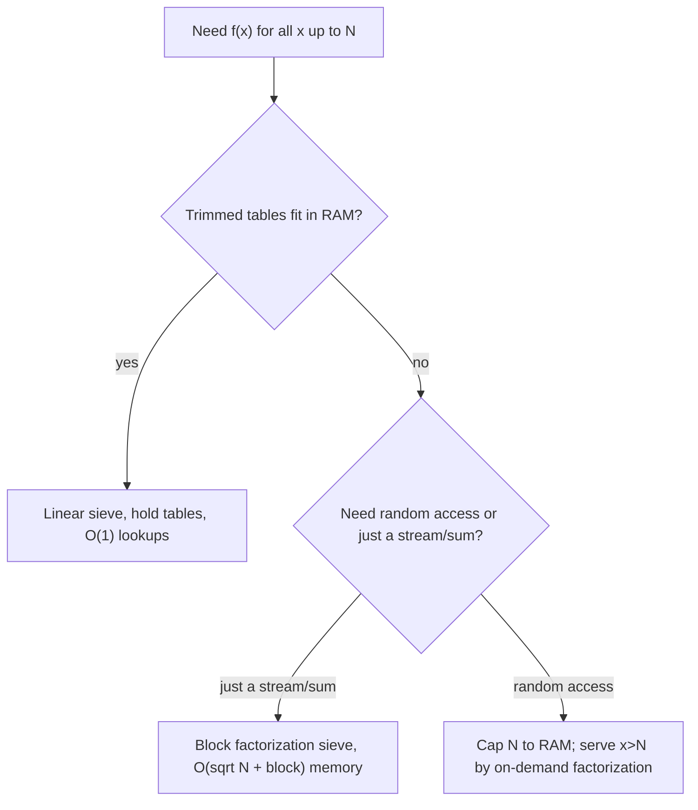
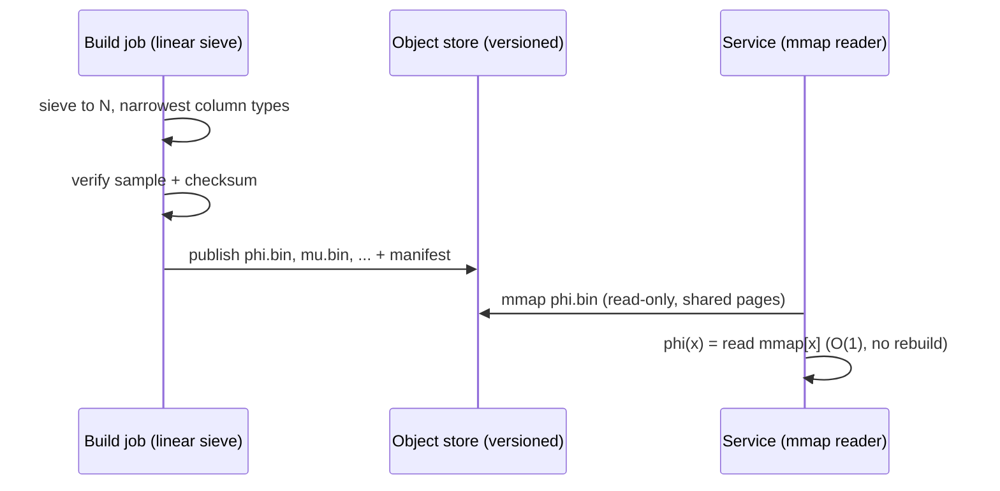
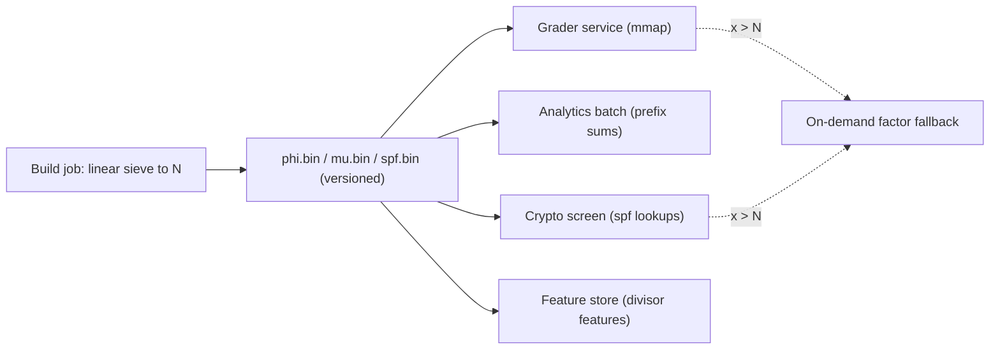

# Linear Sieve & Multiplicative Functions — Senior / Production Level

> **Focus:** Shipping multiplicative-function tables at scale. How big can `N` get before the `int` tables stop fitting in RAM, and what do you do then? Memory layout and column widths, cache behavior of the linear sieve's irregular writes, **block-segmented** linear sieving when `N` exceeds memory, **batch precompute systems** that build `φ`/`μ`/`τ`/`σ` once and serve many services, parallelization, the decision boundary between sieving and on-demand factorization, and how to test a table with billions of entries.

---

## Table of Contents

1. [Introduction](#introduction)
2. [Memory: Table Widths and What Fits](#memory-table-widths-and-what-fits)
3. [Cache Behavior of the Linear Sieve](#cache-behavior-of-the-linear-sieve)
4. [Data Layout: SoA, Alignment, and Huge Pages](#data-layout-soa-alignment-and-huge-pages)
5. [Segmented & Block Sieving for N Beyond RAM](#segmented--block-sieving-for-n-beyond-ram)
6. [Batch Precompute Systems](#batch-precompute-systems)
7. [Batch Precompute Use Cases](#batch-precompute-use-cases)
8. [Parallel and Multi-Threaded Sieving](#parallel-and-multi-threaded-sieving)
9. [Sieve vs On-Demand Factorization](#sieve-vs-on-demand-factorization)
10. [Production Code](#production-code)
11. [Testing Strategy](#testing-strategy)
12. [Failure Modes](#failure-modes)
13. [Capacity Planning Worked Example](#capacity-planning-worked-example)
14. [Observability and Operational Concerns](#observability-and-operational-concerns)
15. [Best Practices](#best-practices)
16. [Summary](#summary)
17. [Further Reading](#further-reading)

---

## Introduction

A linear sieve that fills `φ` up to `n = 30` in a tutorial and one that precomputes `φ`, `μ`, `τ`, `σ` for `n = 10^9` as a shared service are different artifacts. The recurrences are identical; the engineering is not. The senior questions are:

- **How wide are the tables, and how big can `N` get before they no longer fit in RAM?** Six `int32` arrays at `n = 10^9` is 24 GB — you will not allocate that on a commodity box.
- **Why is the linear sieve memory-bound, and why are its writes *less* cache-friendly than Eratosthenes?** The inner loop scatters writes to `i·p` for growing `p`, a strided pattern that misses cache.
- **How do you sieve a multiplicative function when `N` exceeds memory?** Plain segmentation does not directly carry the multiplicative recurrences across block boundaries — you need a block-local factorization sieve.
- **How do you build these tables once and serve them to many consumers** without rebuilding for every request — a precompute pipeline with versioning, checksums, and memory-mapped artifacts?
- **How do you test a table with `10^9` entries**, where one off-by-one corrupts a single value among a billion?

The recurring theme, as with all sieves, is that this is a **memory problem wearing an arithmetic costume**. The multiply-and-store per composite is trivial; the cost is moving `O(n)` words of table through the memory hierarchy. Every senior decision below is about *where the bytes live and how many times they move*.

---

## Memory: Table Widths and What Fits

The first wall is the size of the integer tables. Unlike Eratosthenes (one bit per number), the linear sieve stores integer-valued functions. Size every column to the *smallest type that holds its range*:

| Table | Range of values | Min width | Note |
|-------|-----------------|-----------|------|
| `spf[x]` | `≤ √n` (smallest factor is `≤ √x`) | 16-bit if `n ≤ 10^8` | size from `√n`, not `n` |
| `μ[x]` | `{−1, 0, 1}` | 8-bit (`int8`) | 1 byte each |
| `φ[x]` | `< x ≤ n` | width of `n` | 32-bit to `n ≈ 2·10^9` |
| `τ[x]` | small (`≤ ~1344` for `n ≤ 10^9`) | 16-bit | divisor count is tiny |
| `σ[x]` | up to `~n log log n` | 64-bit | sum of divisors grows past `n` |
| `cnt`, `low` | auxiliaries | transient | can be freed after the pass |

Memory arithmetic for the *kept* tables (drop what you do not need):

| `n` | `spf` 16-bit | `φ` 32-bit | `μ` 8-bit | `σ` 64-bit | all four |
|-----|-------------|-----------|-----------|-----------|----------|
| `10^7` | 20 MB | 40 MB | 10 MB | 80 MB | ~150 MB |
| `10^8` | 200 MB | 400 MB | 100 MB | 800 MB | ~1.5 GB |
| `10^9` | 2 GB | 4 GB | 1 GB | 8 GB | ~15 GB |

Two senior moves fall out immediately:

1. **`spf` fits in `√n` bits.** Since the smallest prime factor of any `x ≤ n` is `≤ √x ≤ √n`, `spf` values fit in the bit-width of `√n`. For `n = 10^8`, `√n = 10^4` → 16 bits, halving the SPF table versus a 32-bit store. Easily missed, real savings.
2. **Drop auxiliaries early.** `cnt` and `low` are only needed *during* the pass; if you stream the final tables to disk, free them before allocating the next stage.

When even the trimmed tables will not fit (`n ≥ ~10^9` on a typical machine), you stop holding the whole thing at once and **block-sieve** (next sections) or accept that you only need the function *streamed* once rather than as a random-access oracle.

---

## Cache Behavior of the Linear Sieve

A modern CPU does arithmetic far faster than it reads DRAM, so the sieve's cost is data movement. The linear sieve has a subtle disadvantage versus Eratosthenes here.

In **Eratosthenes**, crossing out multiples of `p` writes to `p², p²+p, p²+2p, …` — a single fixed stride `p` through one array. For small primes this stride is dense and prefetch-friendly.

In the **linear sieve**, the inner loop for a fixed `i` writes to `i·2, i·3, i·5, …` — addresses that jump by `i·(p_{k+1} − p_k)`, a *growing, irregular* stride. Across the whole run, every write to `spf[i·p]` (and the parallel writes to `φ`, `μ`, `τ`, `σ` at the same index) touches a fresh region of several arrays at once. For large `n` this scatters writes across gigabytes that do not fit in cache, so the linear sieve is typically **memory-bandwidth-bound and somewhat slower wall-clock than a tight bitset Eratosthenes** — which is exactly why you only pay for it when you need `spf` or a function table.

Mitigations:

- **Structure-of-arrays, not array-of-structs.** Keep `spf`, `φ`, `μ` as separate arrays. Writing to one index across three separate arrays still scatters, but each array stays a clean linear region for prefix-sum passes afterward.
- **Fuse the post-passes.** If you need prefix sums of `φ`, do them immediately after sieving while the array may still be warm, in one sequential sweep.
- **Block the sieve** (below) so the working set per block fits in L2 — the same trick that helps Eratosthenes, adapted to carry the recurrences.

---

## Data Layout: SoA, Alignment, and Huge Pages

Once you accept the linear sieve is memory-bound, the layout of those arrays in physical memory becomes the lever that matters most. Three decisions dominate.

### Structure-of-arrays vs array-of-structs

It is tempting to bundle each number's data into one record — `struct{ spf, phi, mu, tau, sigma }` — and store an array of those. **Do not.** That array-of-structs (AoS) layout has two problems for this workload:

1. **Mixed widths waste cache lines.** Padding a struct that mixes `int8` (`μ`) with `int64` (`σ`) blows the per-element footprint up to the largest member's alignment, so you drag `σ`'s 8 bytes into cache every time you touch `μ`'s 1 byte.
2. **Post-passes degrade.** Almost every use of the tables is a *sequential* sweep over one function (prefix-summing `φ`, scanning `μ` for squarefrees). In AoS those reads are strided by the struct size; in structure-of-arrays (SoA) — one contiguous array per function — they are perfectly linear and prefetchable.

So: keep `spf`, `phi`, `mu`, `tau`, `sigma` as **separate arrays**. The sieve's *write* phase scatters either way (it writes index `i·p`), but the far more frequent *read* phases stay linear.

### Alignment and false sharing

Allocate each column on a cache-line (64-byte) or page boundary so a column never shares a line with unrelated data. When you parallelize the block-factorization variant (below), give each worker block buffers that are page-aligned and exclusively owned — two workers writing into the same 64-byte line (even to different indices) trigger false sharing and serialize on the cache-coherence protocol.

### Huge pages

A 4 GB `φ` table at the default 4 KB page size needs ~1 million TLB entries to map — far more than the TLB holds, so random access thrashes the TLB. Backing the big columns with **2 MB huge pages** (Linux `MADV_HUGEPAGE` / `mmap(MAP_HUGETLB)`) cuts the entry count 512×, a measurable win for random `φ[x]` lookups in a serving process.

| Layout choice | Helps | Cost / caveat |
|---------------|-------|---------------|
| SoA (separate arrays) | linear post-passes, narrow per-column width | slightly more allocator bookkeeping |
| 64-byte alignment | avoids false sharing across workers | minor padding |
| 2 MB huge pages | fewer TLB misses on random lookups | needs OS support / privileges; wasteful for tiny `n` |

---

## Segmented & Block Sieving for N Beyond RAM

Plain Eratosthenes segments trivially: a window only needs the base primes up to `√R`. The **linear sieve does not segment as cleanly**, because the multiplicative recurrence for `f(x)` depends on `f(x / spf(x))`, which may live in a *different* block. There are two practical strategies:

### Strategy 1 — block factorization, then per-block formula

Process `[2, n]` in cache-sized blocks `[L, R]`. For each block:

1. Use base primes `≤ √R` to record, for each `x` in the block, its full factorization (or at least each `x`'s remaining cofactor after dividing out small primes). This is a segmented *factorization* sieve.
2. Compute `f(x)` from its factorization using the closed form (`φ = x·Π(1−1/p)`, `μ` = sign or 0, `τ = Π(a_i+1)`, `σ = Π (p^{a_i+1}−1)/(p−1)`).
3. Stream/consume the block's `f` values (sum them, write them to disk, feed a downstream pass), then discard the block.

Memory is `O(√n + block)`, independent of `n`. You lose `O(1)` random access to the whole table, but you can compute `Σ f(x)` over `[2, n]` for arbitrarily large `n`.

### Strategy 2 — keep the genuine linear sieve, accept the RAM bound

If you truly need a random-access `φ[x]` oracle, you must hold the array; there is no way around `O(n)` resident memory for random access. The honest senior answer is: pick the largest `n` whose trimmed tables fit, and serve queries `> n` by on-demand factorization (next sections).

### Why the recurrence will not cross a block boundary

It is worth being precise about *why* you cannot simply run the genuine linear-sieve recurrence over windows `[L, R]`. The recurrence computes `f(x)` from `f(x / spf(x))` — a *smaller* number that, for most `x` in a high block, lies in an *earlier* block you have already discarded. Concretely, for `x = 998244353 · 2` the value `f(x)` needs `f(998244353)`, which is half a billion indices away. To keep that dependency available you would have to retain all earlier `f` values — i.e. not segment at all. This is the fundamental difference from Eratosthenes, whose cross-out of `p`'s multiples needs only the base prime `p` (a tiny `O(√R)` set), never any previously computed *function value*.

The block-factorization strategy sidesteps this by *not* using the recurrence at all inside a block: it factors each `x` from scratch against the base primes and applies the closed form, so every block is self-contained and depends only on the shared `O(√n)` base-prime list — never on another block's output.

| Property | Monolithic linear sieve | Block factorization sieve |
|----------|-------------------------|---------------------------|
| Memory | `O(n)` resident | `O(√n + block)` |
| Random access | yes (`O(1)`) | no (stream/sum only) |
| Per-`x` cost | `O(1)` amortized | `O(ω(x))` factor + closed form |
| Cross-block dependency | n/a (one array) | none (self-contained) |
| Parallelizable | no (recurrence chain) | yes (independent blocks) |
| Best for | `n` fits RAM, many random queries | `n` beyond RAM, streamed sum |



---

## Batch Precompute Systems

In a real system the tables are an *asset* built by a pipeline, not recomputed per request. A precompute service for `φ`/`μ`/`τ`/`σ` looks like:

1. **Build stage.** A batch job runs the linear sieve to the contracted bound `N`, producing column files (`spf.bin`, `phi.bin`, `mu.bin`, …). Each column is the narrowest type that fits.
2. **Verify stage.** Re-derive a random sample (and all small `x`) by independent factorization; compute a checksum over each column.
3. **Publish stage.** Write artifacts to object storage with a version tag (`tables-v3-N1e9`) and the checksum; record `N` and the column widths in a manifest.
4. **Serve stage.** Consumers **memory-map** the column files read-only. The OS page cache loads pages on demand; multiple processes share the same physical pages. A query `φ(x)` is a single mmap read — no rebuild, no per-process copy.



Design points that matter in production:

- **Immutability + versioning.** Tables never change in place; a new `N` or a fix is a new version. Consumers pin a version, roll forward deliberately.
- **mmap, don't load.** Memory-mapping lets the kernel page-cache the column and share it across processes; cold pages fault in lazily, hot pages stay resident.
- **Manifest contract.** Record `N`, column dtypes, and checksums. A consumer that asks for `x > N` must fall back to on-demand factorization, and the manifest tells it where the boundary is.
- **Cost model.** Build is `O(N)` once; serving is `O(1)` per query forever. The whole point is to amortize one expensive build over an unbounded number of cheap reads.

---

## Batch Precompute Use Cases

The "build once, serve many" shape pays off whenever a workload hammers a *bounded* range of numbers with multiplicative-function queries. Concrete places this pattern shows up:

- **Competitive-programming / judge backends.** A problem set whose constraints cap `n ≤ 10^7` can ship a single precomputed `φ`/`μ` artifact that every submission's grader memory-maps, instead of each submission rebuilding the sieve (which would dominate the time limit).
- **Cryptographic parameter screening.** Pipelines that screen many small-to-medium moduli for smoothness or totient structure precompute `φ` and `spf` up to a bound and look up factorizations in `O(log x)` rather than trial-dividing each candidate.
- **Number-theoretic analytics / OEIS-style batch jobs.** Computing summatory functions (`Σφ`, Mertens `Σμ`, `Στ`) or running Möbius-inversion sweeps over a fixed range is a single linear pass plus a prefix sum over the shared table.
- **Feature stores for ML on integer keys.** When integer IDs carry number-theoretic features (divisor count, totient) that several models consume, materializing them once into a shared column beats recomputing per training run.
- **Game / simulation tick loops.** A simulation that repeatedly queries divisor sums of bounded entity counts reads a resident table in `O(1)` instead of factoring inside the hot loop.

The unifying test: **query density × bounded range**. If the same range is queried far more times than it has elements, precompute and share. If queries are sparse or the range is unbounded, prefer on-demand factorization (later section). The precompute artifact is justified exactly when amortized build cost per query approaches zero.



A single immutable artifact fans out to many independent consumers; each falls back to on-demand factorization only for the rare query beyond the contracted bound `N`.

---

## Parallel and Multi-Threaded Sieving

The *genuine* linear sieve is hard to parallelize because the recurrence creates a data dependency (`f(i·p)` reads `f(i)`). Two practical routes:

- **Parallelize the block-factorization variant.** The blocks of Strategy 1 are independent: each block factorizes its range against the shared, read-only base primes and computes `f` from the closed form locally. Hand disjoint blocks to a thread pool — near-linear scaling, no write sharing. This is the recommended way to parallelize multiplicative-function precompute.
- **Parallelize the post-passes.** Prefix sums can be done with a parallel scan; per-element transforms (e.g. `g[x] = μ[x]·something`) are embarrassingly parallel.
- **What does *not* parallelize:** the monolithic linear sieve itself, due to the `f(i) → f(i·p)` dependency and shared-array writes (false sharing). Do not try to split the single-array linear sieve by prime or by index range — partition by *block* with local factorization instead.

NUMA and pinning: give each worker its own freshly-allocated block buffer (first-touch on its NUMA node), pin threads to cores, and size blocks to fit each core's private L2.

---

## Sieve vs On-Demand Factorization

The boundary question: build a whole table, or factor numbers as they arrive?

| Situation | Use | Why |
|-----------|-----|-----|
| Many queries, all `x ≤ N`, `N` fits RAM | linear sieve table | `O(N)` build, `O(1)` queries |
| Few queries, or `x` unbounded/huge | on-demand factor + formula | no `O(N)` memory; per-query `O(√x)` or Pollard |
| `x ≤ N` but `N` too big for tables | block factorization sieve (stream) | `O(√N + block)` memory |
| One huge `x` (e.g. `10^{18}`) | Pollard's rho (topic `09`) then formula | sieving is impossible at that scale |

The most common production mistake is building a giant table to answer a handful of queries (waste of memory and build time), or factoring on demand inside a hot loop that revisits the same small range millions of times (should have sieved once). Match the tool to *query density × range size*.

---

## Production Code

### Memory-frugal linear sieve with narrow columns — Go

```go
package main

import (
	"fmt"
	"math"
)

// SieveTables holds narrow-typed multiplicative-function columns.
type SieveTables struct {
	Spf []uint16 // smallest prime factor (fits in sqrt(n) bits for n <= ~4.3e9)
	Mu  []int8   // {-1, 0, 1}
	Phi []uint32 // < n
	N   int
}

func buildTables(n int) SieveTables {
	t := SieveTables{
		Spf: make([]uint16, n+1),
		Mu:  make([]int8, n+1),
		Phi: make([]uint32, n+1),
		N:   n,
	}
	if n >= 1 {
		t.Mu[1], t.Phi[1] = 1, 1
	}
	primes := make([]int, 0, int(float64(n)/math.Log(float64(n)+2))+16)
	for i := 2; i <= n; i++ {
		if t.Spf[i] == 0 {
			t.Spf[i] = uint16(i) // safe: a prime i recorded as spf must be <= sqrt(n) when used,
			//                      but here spf[prime]=prime; guard n so prime i <= 65535 if uint16.
			t.Mu[i] = -1
			t.Phi[i] = uint32(i - 1)
			primes = append(primes, i)
		}
		for _, p := range primes {
			if uint16(p) > t.Spf[i] || i*p > n {
				break
			}
			ip := i * p
			t.Spf[ip] = uint16(p)
			if i%p == 0 {
				t.Mu[ip] = 0
				t.Phi[ip] = t.Phi[i] * uint32(p)
				break
			}
			t.Mu[ip] = -t.Mu[i]
			t.Phi[ip] = t.Phi[i] * uint32(p-1)
		}
	}
	return t
}

func main() {
	// NOTE: uint16 spf assumes all stored spf values fit in 16 bits.
	// For spf[prime]=prime this requires primes <= 65535; for production use
	// a width matching your n (spf of a composite is always <= sqrt(n)).
	t := buildTables(1000)
	fmt.Println("phi[840] =", t.Phi[840], " mu[840] =", t.Mu[840]) // 192, 0
}
```

### Block factorization sieve for a streamed sum of φ — Python

```python
import math


def simple_primes(limit):
    sieve = bytearray([1]) * (limit + 1)
    sieve[0] = sieve[1] = 0
    for p in range(2, int(limit ** 0.5) + 1):
        if sieve[p]:
            sieve[p * p :: p] = b"\x00" * len(range(p * p, limit + 1, p))
    return [i for i in range(2, limit + 1) if sieve[i]]


def sum_phi_block(N, block=1 << 20):
    """Stream Σ_{x=1}^{N} φ(x) using block factorization — O(sqrt N + block) memory."""
    base = simple_primes(int(math.isqrt(N)))
    total = 1  # φ(1) = 1
    L = 2
    while L <= N:
        R = min(L + block - 1, N)
        size = R - L + 1
        rem = list(range(L, R + 1))          # remaining cofactor of each x
        phi = [1] * size                      # multiplicative φ accumulator
        for p in base:
            start = max(p * 2, ((L + p - 1) // p) * p)  # first multiple of p >= L (and >= p, p itself handled below)
            start = max(start, p)             # ensure we cover x == p in-window
            for m in range(((L + p - 1) // p) * p, R + 1, p):
                idx = m - L
                if rem[idx] % p == 0:
                    cnt = 0
                    while rem[idx] % p == 0:
                        rem[idx] //= p
                        cnt += 1
                    phi[idx] *= (p - 1) * p ** (cnt - 1)
        for idx in range(size):
            if rem[idx] > 1:                  # a leftover prime factor > sqrt(N)
                phi[idx] *= rem[idx] - 1
            total += phi[idx]
        L = R + 1
    return total


if __name__ == "__main__":
    # Σ φ(x) for x in [1, 100] = 3045
    print(sum_phi_block(100))
```

This computes `φ` per block from factorization (closed form), never holding more than one block — the pattern for `N` beyond RAM.

### Java — narrow φ/μ table with a brute-force spot check

```java
public class FrugalSieve {
    final int n;
    final int[] phi;   // < n
    final byte[] mu;   // {-1,0,1}
    final int[] spf;

    FrugalSieve(int n) {
        this.n = n;
        phi = new int[n + 1];
        mu = new byte[n + 1];
        spf = new int[n + 1];
        if (n >= 1) { phi[1] = 1; mu[1] = 1; }
        int[] primes = new int[Math.max(16, (int)(n / Math.log(n + 2)) + 16)];
        int pc = 0;
        for (int i = 2; i <= n; i++) {
            if (spf[i] == 0) { spf[i] = i; phi[i] = i - 1; mu[i] = -1; primes[pc++] = i; }
            for (int k = 0; k < pc; k++) {
                int p = primes[k];
                if (p > spf[i] || (long) i * p > n) break;
                int ip = i * p;
                spf[ip] = p;
                if (i % p == 0) { phi[ip] = phi[i] * p; mu[ip] = 0; break; }
                phi[ip] = phi[i] * (p - 1); mu[ip] = (byte) -mu[i];
            }
        }
    }

    public static void main(String[] args) {
        FrugalSieve s = new FrugalSieve(1000);
        System.out.println("phi[840]=" + s.phi[840] + " mu[840]=" + s.mu[840]); // 192, 0
    }
}
```

---

## Testing Strategy

Testing a table with millions or billions of entries needs more than a few asserts:

- **Exhaustive small range.** Verify every `x ≤ 10^4` against an independent brute-force factorizer for all functions. Most bugs (square-factor branch, missing break) surface here.
- **Random spot checks at scale.** For a large `N`, factor a few thousand random `x` independently and compare — catches index-width overflow that only appears for large values.
- **Identity checks (cheap and powerful).** Use Dirichlet identities as invariants over the whole table: `Σ_{d∣n} φ(d) == n`, `Σ_{d∣n} μ(d) == [n==1]`, `τ(n) == Σ_{d∣n} 1`, `σ(n) == Σ_{d∣n} d`. Validate these for all `n ≤ 10^4` — they cross-check the *relationships*, not just point values.
- **Checksum the columns.** Hash each published column; the verify stage recomputes and compares, catching corruption in build/transport.
- **Property: each composite marked once.** Instrument a debug build to count inner-loop iterations and assert the total equals `n − π(n)` exactly. A mismatch means the linearity-critical break is wrong.
- **Boundary values.** `x = 1` (seeded), `x = N` (last index), prime powers (`4, 8, 9, 27`), and the largest prime `≤ N`.

---

## Failure Modes

- **Integer overflow in `σ` / `φ` at scale.** `σ(x)` exceeds 32-bit well before `n = 10^9`; a silent overflow corrupts one value. Use 64-bit for `σ`, validate ranges.
- **`spf` width too small.** Packing `spf` into 16 bits is valid only if all stored values fit; `spf[prime] = prime` can exceed 16 bits even when composite spf values are `≤ √n`. Either store spf for composites only, or size the type to the max prime.
- **Dropping the `i % p == 0: break` under refactor.** A "harmless cleanup" that removes the break silently re-marks composites and corrupts `φ`/`μ`. The iteration-count assertion catches it.
- **Modular division.** Reusing the integer-division `τ`/`σ` recurrences under a modulus produces garbage (no integer inverse). Use the modular-safe multiplicative form.
- **OOM at the next-bigger `N`.** A service contracted for `N = 10^8` that receives a request to bump to `10^9` will OOM if it naively reallocates. Move to block streaming or cap `N`.
- **Stale table version.** A consumer pinned to an old `N` silently returns "out of range" for newly valid `x`. Surface the table's `N` in the manifest and in error messages.

### Failure-mode triage table

When a sieved-table service misbehaves, the symptom usually points straight at the cause. Keep this triage map handy during an incident:

| Symptom | Most likely cause | First check |
|---------|-------------------|-------------|
| One `σ`/`φ` value wildly wrong, rest fine | integer overflow at a specific large `x` | is the column 64-bit where it needs to be? |
| Many `μ` values wrong, clustered on non-squarefree | square-factor branch / missing break | run the `n − π(n)` iteration-count assertion |
| Every value off by the same shape | wrong seed at `x = 1` | confirm `f(1)` seeded for each function |
| Correct locally, wrong on a big box | `spf` column packed too narrow for a stored prime | check max stored value vs column width |
| Sudden mass "out of range" errors | consumer pinned to stale `N` | compare deployed manifest `N` vs request range |
| Gradual latency creep on lookups | TLB / page-cache thrash on the resident table | huge pages? resident-set vs budget? |
| Garbage under a modulus | reused integer-division `τ`/`σ` recurrence mod `M` | switch to the modular-safe multiplicative form |

The two cheapest, highest-yield guards remain the **iteration-count assertion** (`exactly n − π(n)` inner-loop markings — catches every break/double-mark regression) and the **Dirichlet-identity sweep** (`Σ_{d∣n} φ(d) = n` for all small `n` — catches recurrence and seeding errors). Wire both into CI so a "harmless cleanup" cannot ship a corrupted table.

---

## Capacity Planning Worked Example

A concrete sizing exercise ties the abstract widths to a real decision. Suppose a service contracts to answer `φ`, `μ`, and `σ` for all `x ≤ N` on a box with **16 GB** of RAM, of which **10 GB** is the usable budget for tables (the rest is OS, runtime, headroom).

**Step 1 — per-element cost (kept columns only).** We keep `φ` (32-bit, since `φ(x) < x`), `μ` (8-bit), and `σ` (64-bit, since `σ(x)` exceeds `x`). We do *not* keep `spf` for serving (it was only needed transiently to build the functions, then dropped). Per element: `4 + 1 + 8 = 13` bytes.

**Step 2 — solve for N.** `13 · N ≤ 10 GB = 10 · 2^30 ≈ 1.07 × 10^10`, so `N ≤ ~8.25 × 10^8`. Round down to a clean **`N = 8 × 10^8`**, using `13 · 8e8 ≈ 10.4 GB`… which overshoots, so trim to **`N = 7.5 × 10^8`** (`≈ 9.75 GB`). The lesson: the 64-bit `σ` column dominates (it alone is `6 GB` at `7.5e8`), so dropping `σ` when a consumer needs only `φ`/`μ` roughly *triples* the reachable `N`.

| Kept columns | bytes/elem | Max `N` in 10 GB |
|--------------|-----------|------------------|
| `φ` only (32-bit) | 4 | `~2.7 × 10^9` |
| `φ` + `μ` | 5 | `~2.1 × 10^9` |
| `φ` + `μ` + `σ` (64-bit) | 13 | `~8.3 × 10^8` |
| all + `spf` (16-bit) resident | 15 | `~7.2 × 10^8` |

**Step 3 — build budget.** A linear sieve does `~N` multiply-and-store operations across several arrays; on a commodity core, building `7.5 × 10^8` entries with three functions is on the order of seconds-to-tens-of-seconds, dominated by memory bandwidth, not arithmetic. That is a one-time cost amortized over the service lifetime, which is exactly why the precompute model wins.

**Step 4 — the boundary policy.** Because `N = 7.5 × 10^8` is a hard cap, the manifest records it and every query `x > N` routes to the on-demand factorization fallback. If the business later needs `x` up to `10^{10}`, the answer is *not* "buy more RAM" (the `σ` column would need 80 GB) — it is "switch to the block factorization sieve and stream," or "keep only `φ`/`μ` resident and serve `σ` on demand."

**Step 5 — sanity-check the build itself fits.** The build job also needs the transient `spf`, `cnt`, and `low` columns *during* the pass, even though they are dropped before serving. At `N = 7.5 × 10^8` those add roughly `2 + 2 + 8 = 12` more bytes/element (`~9 GB`), so the *build* peak is `~19 GB` — it will not fit the same 16 GB box. The fix is to build on a larger machine (or build in blocks), then publish the trimmed serving columns. A frequent production surprise is a build OOM on a box that serves the finished table comfortably; size the *build* host for peak, not the resident footprint.

---

## Observability and Operational Concerns

| Metric | Why it matters | Alert |
|--------|----------------|-------|
| `table_build_seconds` | regression in sieve speed | > 1.5× baseline |
| `table_resident_bytes` | memory budget for the tables | > 80% of budget |
| `query_out_of_range_total` | requests for `x > N` (need fallback) | rising trend |
| `mmap_page_faults` | cold-table thrash on a serving box | sustained high |
| `verify_mismatch_total` | corruption in build/transport | any nonzero |

Operationally: pin the table version per deployment; ship the manifest (`N`, dtypes, checksum) alongside; alarm on any verify mismatch; and keep an on-demand factorization fallback path warm for `x > N` so a request just outside the bound degrades gracefully instead of erroring.

### Rolling a new bound `N` safely

Bumping the contracted bound from `N₁` to a larger `N₂` is the most common table change, and it is a *new artifact*, never an in-place edit. A safe rollout:

1. **Build the new artifact** (`tables-vK-N2`) in the batch job, verify it (sample + identity sweep + checksum), and publish it alongside the existing one — both versions coexist in object storage.
2. **Canary** a small fraction of serving instances onto `vK`, comparing their `φ`/`μ`/`σ` answers against the old version on the overlap range `[1, N₁]`; they must match exactly (the functions are absolute, so a mismatch on the overlap means a build bug).
3. **Roll forward** the fleet once the canary is clean; the new instances now answer `x ≤ N₂` natively and route fewer requests to the on-demand fallback.
4. **Retire** `N₁` only after no consumer is pinned to it.

Because the tables are immutable and the values are deterministic, this is a pure blue/green swap with a trivial correctness oracle (the overlap must be identical). The `query_out_of_range_total` metric should drop after the roll — a built-in success signal that the bigger bound is actually serving traffic.

---

## Best Practices

- Size every column to the narrowest type that fits its range; `spf` from `√n`, `μ` as `int8`, `σ` as 64-bit.
- Drop tables and auxiliaries (`cnt`, `low`) you do not need; each is `O(n)` memory.
- For `N` beyond RAM, switch to a **block factorization sieve** and stream/sum, accepting loss of random access.
- Build tables once in a batch job; **memory-map** versioned, checksummed artifacts for serving.
- Validate with Dirichlet identities across the whole small range, not just point checks.
- Instrument an iteration counter to assert exactly `n − π(n)` inner-loop steps — the cheapest guard for the linearity-critical break.
- Never use the integer-division `τ`/`σ` recurrences under a modulus; keep per-prime factors and multiply.
- Keep an on-demand factorization fallback for queries beyond the sieve bound `N`.
- Use structure-of-arrays (one column per function); back large resident columns with huge pages and align them to avoid false sharing.
- Roll a new bound `N` as an immutable, canaried artifact; verify the overlap range matches the old version exactly before rolling forward.
- Size the *build* host for peak memory (transient `spf`/`cnt`/`low` included), not the trimmed resident footprint.
- Match the precompute decision to query-density × range: build-and-share only when the bounded range is queried far more often than it has elements.

---

## Summary

At production scale the linear sieve is dominated by the memory footprint and cache behavior of its integer tables, not by arithmetic. Size every column to the narrowest type (`spf` from `√n`, `μ` as a byte, `σ` as 64-bit), drop what you do not need, and accept that the linear sieve's scattered writes make it memory-bound — which is why you pay for it only when you genuinely need `spf` or a multiplicative function. When `N` outgrows RAM, move from the monolithic sieve to a **block factorization sieve** that computes each function from its block-local factorization, giving `O(√N + block)` memory at the cost of random access. In a system, the tables are versioned, checksummed, memory-mapped artifacts built once by a batch job and shared across consumers, with an on-demand factorization fallback for out-of-range queries. Test with Dirichlet identities across the whole small range and an iteration-count assertion that pins the linearity-critical break. Next, the formal foundations — the `O(n)` bijection proof and the convolution-based correctness of every recurrence — in [`professional.md`](./professional.md).

---

## Further Reading

- Sibling file [`professional.md`](./professional.md) — the each-composite-once bijection proof and multiplicative-function correctness via Dirichlet convolution.
- Sibling file [`middle.md`](./middle.md) — the full family of recurrences and the convolution identities behind them.
- Sibling topic `03-prime-sieves` (`senior.md`) — bitset/cache/parallel engineering for the primality-only sieve.
- cp-algorithms.com — "Linear Sieve", "Segmented Sieve".
- *The Art of Computer Programming, Vol. 2* (Knuth) — arithmetic and number-theoretic algorithms at scale.
- Sibling topics `08-miller-rabin`, `09-pollard-rho` — on-demand primality/factorization for `x` beyond any sieve bound.
- Sibling file [`interview.md`](./interview.md) — tiered Q&A and coding challenges.
