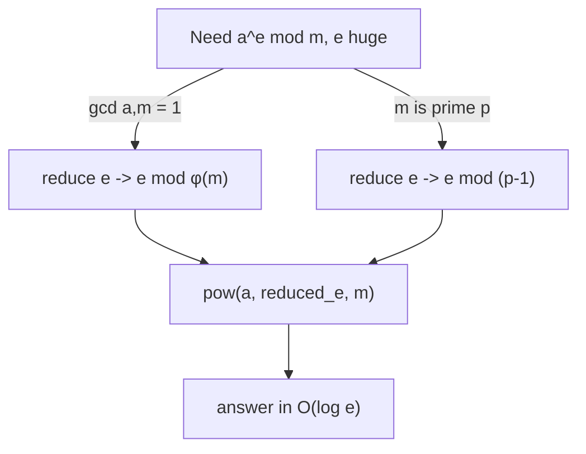

# Fermat's Little Theorem & Euler's Theorem — Junior Level

> **One-line summary:** For a prime `p` and any `a` not divisible by `p`, **`a^(p-1) ≡ 1 (mod p)`** (Fermat's little theorem). This single fact lets you compute a **modular inverse** as `a^(p-2) mod p`, reduce gigantic exponents, and is the arithmetic heart of RSA. Euler's theorem generalizes it to any modulus `m` using the totient `φ(m)`: `a^(φ(m)) ≡ 1 (mod m)` when `gcd(a, m) = 1`.

---

## Table of Contents

1. [Introduction](#introduction)
2. [Prerequisites](#prerequisites)
3. [Glossary](#glossary)
4. [Core Concepts](#core-concepts)
5. [Big-O Summary](#big-o-summary)
6. [Real-World Analogies](#real-world-analogies)
7. [Pros & Cons](#pros--cons)
8. [Step-by-Step Walkthrough](#step-by-step-walkthrough)
9. [Code Examples](#code-examples)
10. [Coding Patterns](#coding-patterns)
11. [Error Handling](#error-handling)
12. [Performance Tips](#performance-tips)
13. [Best Practices](#best-practices)
14. [Edge Cases & Pitfalls](#edge-cases--pitfalls)
15. [Common Mistakes](#common-mistakes)
16. [Cheat Sheet](#cheat-sheet)
17. [Visual Animation](#visual-animation)
18. [Summary](#summary)
19. [Further Reading](#further-reading)

---

## Introduction

Suppose someone asks: *"What is `3^1000000 mod 7`?"* You cannot literally compute `3^1000000` — it has roughly half a million digits. You need a shortcut, and number theory hands you a beautiful one.

The shortcut is **Fermat's little theorem** (FLT). It says that for a prime modulus `p` and any integer `a` that is *not* a multiple of `p`:

> **`a^(p-1) ≡ 1 (mod p)`**

In words: raise `a` to the power `(p - 1)`, divide by `p`, and the remainder is always exactly `1`. For `p = 7` that means `a^6 ≡ 1 (mod 7)` for every `a` in `{1, 2, 3, 4, 5, 6}`. So the powers of `a` modulo `7` *repeat with a period that divides 6*. To compute `3^1000000 mod 7`, reduce the exponent: `1000000 mod 6 = 4`, so `3^1000000 ≡ 3^4 = 81 ≡ 4 (mod 7)`. A million-digit problem collapses to computing `3^4`.

A second, equivalent form drops the coprimality requirement:

> **`a^p ≡ a (mod p)`** — true for *every* integer `a`, even multiples of `p`.

The single most useful consequence is the **modular inverse**. Dividing by `a` modulo `p` means multiplying by the number `a^(-1)` for which `a · a^(-1) ≡ 1 (mod p)`. Fermat tells us `a · a^(p-2) = a^(p-1) ≡ 1`, so `a^(-1) ≡ a^(p-2) (mod p)`. One fast exponentiation computes the inverse.

**Euler's theorem** removes the "prime" restriction. For *any* modulus `m` and any `a` with `gcd(a, m) = 1`:

> **`a^(φ(m)) ≡ 1 (mod m)`**

where `φ(m)` (Euler's **totient**) counts how many integers in `{1, …, m}` are coprime to `m`. When `m = p` is prime, every smaller positive number is coprime to it, so `φ(p) = p - 1` and Euler's theorem reduces back to Fermat's. These two theorems, the totient function, and the rule for reducing huge exponents are the four ideas this file builds.

---

## Prerequisites

Before reading this file you should be comfortable with:

- **Modular arithmetic** — `(a + b) mod m`, `(a · b) mod m`, and the idea of a residue (remainder). See sibling `02-modular-arithmetic`.
- **GCD and coprimality** — `gcd(a, b)` and what "`a` and `m` are coprime" (`gcd = 1`) means. See sibling `01-gcd-lcm`.
- **Binary exponentiation** — computing `a^e mod m` in `O(log e)` multiplications by squaring. See sibling `26-binary-exponentiation`.
- **Primes** — what makes a number prime, and how a sieve finds primes/factorizations. See sibling `03-prime-sieves`.
- **Big-O notation** — `O(log e)`, `O(√n)`.

Optional but helpful:

- A glance at **congruence notation** `a ≡ b (mod m)` ("`a` and `b` have the same remainder mod `m`").
- Familiarity with **prime factorization** `m = p₁^{e₁} · … · p_r^{e_r}`, which the totient formula needs.

---

## Glossary

| Term | Meaning |
|------|---------|
| **Congruence `a ≡ b (mod m)`** | `a` and `b` leave the same remainder when divided by `m`; equivalently `m` divides `a − b`. |
| **Coprime / relatively prime** | `gcd(a, m) = 1`; `a` and `m` share no common factor other than 1. |
| **Modular inverse `a^(-1)`** | The number `x` with `a · x ≡ 1 (mod m)`. Exists **iff** `gcd(a, m) = 1`. |
| **Fermat's little theorem** | For prime `p`, `gcd(a, p) = 1`: `a^(p-1) ≡ 1 (mod p)`. Also `a^p ≡ a (mod p)` for all `a`. |
| **Euler's totient `φ(m)`** | The count of integers in `{1, …, m}` that are coprime to `m`. `φ(p) = p − 1` for prime `p`. |
| **Euler's theorem** | For `gcd(a, m) = 1`: `a^(φ(m)) ≡ 1 (mod m)`. Generalizes Fermat. |
| **Order of `a` mod `m`** | The smallest positive `d` with `a^d ≡ 1 (mod m)`. Always **divides** `φ(m)` (and `p − 1` for prime). |
| **Multiplicative function** | A function `f` with `f(ab) = f(a)f(b)` whenever `gcd(a, b) = 1`. `φ` is multiplicative. |
| **Prime power `p^e`** | A single prime raised to a power; `φ(p^e) = p^e − p^{e-1} = p^{e-1}(p − 1)`. |
| **Witness / pseudoprime** | Background term: a composite `n` can satisfy `a^(n-1) ≡ 1 (mod n)` and fool the FLT test (see `08-miller-rabin-primality`). |

---

## Core Concepts

### 1. Fermat's Little Theorem (the entry point)

For a **prime** `p` and any `a` with `gcd(a, p) = 1`:

```
a^(p-1) ≡ 1 (mod p)
```

The cleanest way to *feel* why this is true: list the nonzero residues `1, 2, …, p-1`. Multiply every one of them by `a` (mod `p`). Because `a` is invertible, this just **permutes** the same set — you get `a·1, a·2, …, a·(p-1)`, which is `{1, 2, …, p-1}` shuffled. Multiply both lists together:

```
(a·1)(a·2)…(a·(p-1)) ≡ 1·2·…·(p-1) (mod p)
a^(p-1) · (p-1)! ≡ (p-1)! (mod p)
```

Since `(p-1)!` is coprime to `p`, cancel it from both sides: `a^(p-1) ≡ 1`. (The full proof lives in [`professional.md`](./professional.md).)

The "every integer" form `a^p ≡ a (mod p)` follows by multiplying both sides by `a`; it also holds when `p | a` because then both sides are `≡ 0`.

### 2. The Modular Inverse via `a^(p-2)`

To "divide by `a`" mod `p`, multiply by `a^(-1)`. From `a^(p-1) ≡ 1`:

```
a · a^(p-2) = a^(p-1) ≡ 1 (mod p)   ⟹   a^(-1) ≡ a^(p-2) (mod p)
```

So the inverse of `a` mod a prime `p` is just `a` raised to the power `p - 2`, computed with binary exponentiation in `O(log p)`. This is the simplest, most-used application of Fermat.

> Important: this works **only when `p` is prime** (and `a` is not a multiple of `p`). For a composite modulus, use the extended Euclidean algorithm (sibling `06-extended-euclidean-modular-inverse`) instead.

### 3. Euler's Totient `φ(m)`

`φ(m)` counts the integers in `{1, 2, …, m}` that are coprime to `m`. Small values:

```
φ(1) = 1   φ(2) = 1   φ(3) = 2   φ(4) = 2   φ(5) = 4
φ(6) = 2   φ(7) = 6   φ(8) = 4   φ(9) = 6   φ(10) = 4
```

For a prime `p`, all of `1, …, p-1` are coprime to `p`, so `φ(p) = p - 1`. For a prime power, `φ(p^e) = p^e − p^{e-1}` (we throw out the multiples of `p`). The general formula uses the prime factorization `m = p₁^{e₁} ⋯ p_r^{e_r}`:

```
φ(m) = m · ∏_{p | m} (1 − 1/p)
```

For example `φ(12) = 12 · (1 − 1/2)(1 − 1/3) = 12 · ½ · ⅔ = 4` (the coprime residues are `1, 5, 7, 11`).

### 4. Euler's Theorem (the generalization)

For *any* modulus `m` and `a` with `gcd(a, m) = 1`:

```
a^(φ(m)) ≡ 1 (mod m)
```

When `m = p` is prime, `φ(p) = p - 1`, recovering Fermat. The same permutation argument as in concept 1 works, but over the set of residues coprime to `m` (there are `φ(m)` of them). This gives a modular inverse for composite `m`: `a^(-1) ≡ a^(φ(m)-1) (mod m)` — provided you know `φ(m)`.

### 5. Reducing Huge Exponents

Because `a^(φ(m)) ≡ 1`, exponents can be reduced **mod φ(m)** (not mod `m`!) when `gcd(a, m) = 1`:

```
a^e ≡ a^(e mod φ(m)) (mod m)        [requires gcd(a, m) = 1]
```

For a prime `p` this is `a^e ≡ a^(e mod (p-1)) (mod p)`. This is exactly how `3^1000000 mod 7` collapsed to `3^4`. When `gcd(a, m) ≠ 1` a *generalized* rule applies (covered in `middle.md`/`senior.md`); for now, only reduce the exponent mod `φ(m)` when the base is coprime to the modulus.

### 6. The Order of an Element

The **order** of `a` mod `m` is the smallest `d > 0` with `a^d ≡ 1 (mod m)`. The powers of `a` cycle with period `d`. A key fact (proved in `professional.md`): the order always **divides** `φ(m)` — and `p - 1` when the modulus is prime. That is *why* `a^(φ(m)) ≡ 1`: `φ(m)` is a multiple of the period, so you land back on `1`.

---

## Big-O Summary

| Operation | Time | Space | Notes |
|-----------|------|-------|-------|
| `a^e mod m` (binary exponentiation) | **O(log e)** | O(1) | The workhorse for every theorem here. |
| Modular inverse via Fermat `a^(p-2)` | **O(log p)** | O(1) | Prime modulus only. |
| Compute `φ(m)` for one `m` | **O(√m)** | O(1) | Trial-divide to factor, apply the product formula. |
| Compute `φ(m)` with known factorization | O(r) | O(1) | `r` = number of distinct primes. |
| Sieve `φ(1..n)` for all `n` | O(n log log n) | O(n) | Modified Eratosthenes sieve — see `03-prime-sieves`. |
| Reduce exponent `e mod φ(m)` then power | O(√m + log e) | O(1) | Factoring dominates if `φ(m)` unknown. |
| Order of `a` mod `m` (divisor scan of `φ`) | O(√φ · log m · #divisors) | O(1) | Check divisors of `φ(m)`. |

The headline cost is **`O(log e)`** for any single exponentiation, and **`O(√m)`** to compute one totient by trial division. Everything else is built from these two.

---

## Real-World Analogies

| Concept | Analogy |
|---------|---------|
| Fermat's little theorem | A clock with `p` evenly spaced hours where multiplying by `a` *reshuffles* the hour marks — after enough turns you always return to 12 o'clock (the "1"). |
| Order of an element | The number of steps before a repeating dance move brings you back to your starting spot. The whole dance length (`φ(m)`) is always a whole number of repeats. |
| Totient `φ(m)` | Out of `m` lockers numbered `1..m`, how many have a number sharing no factor with `m` — the "stranger" lockers that don't line up with `m`'s rhythm. |
| Modular inverse | The "undo" key for multiplication on a circular keypad: pressing `a` then `a^(-1)` returns you to where you started (the value 1). |
| Reducing the exponent mod `φ(m)` | A treadmill that loops every `φ(m)` steps — running a million steps lands you exactly where running `million mod φ(m)` steps would. |
| RSA | A mailbox with a public slot (anyone can drop a letter, "encrypt") and a private key (only you can open it, "decrypt"); the lock mechanism is Euler's theorem applied to a product of two primes. |

Where the analogies break: the clock/treadmill pictures assume `gcd(a, m) = 1`. When the base shares a factor with the modulus, the powers may *never* return to `1` and you need the generalized exponent rule.

---

## Pros & Cons

| Pros | Cons |
|------|------|
| Fermat inverse is one line: `pow(a, p-2, p)`. | Fermat inverse needs a **prime** modulus; silently wrong for composite `m`. |
| Exponent reduction turns `e = 10^18` into a tiny number. | Reducing exponent mod `φ(m)` is valid **only** when `gcd(a, m) = 1`. |
| Euler's theorem covers *any* modulus, not just primes. | Needs `φ(m)`, which needs the factorization of `m` (`O(√m)` or hard for huge `m`). |
| The same `pow` routine powers FLT, Euler, RSA, and order-finding. | The order/period reasoning is subtle; off-by-one in `φ` corrupts everything. |
| Underpins RSA, Diffie-Hellman, and primality tests. | The FLT primality test has false positives (Carmichael numbers) — not a proof of primality. |

**When to use:** modular inverse with a prime modulus, reducing astronomically large exponents, RSA-style crypto math, order/primitive-root computations, fast division in competitive programming under `mod 10^9 + 7`.

**When NOT to use:** modular inverse with a *composite* modulus where you don't know `φ` (use extended Euclid), or as a *definitive* primality test (use Miller-Rabin, `08-miller-rabin-primality`).

---

## Step-by-Step Walkthrough

**Goal:** compute `3^1000000 mod 7` and the inverse of `3 mod 7`, both by hand.

**Step 1 — Confirm the modulus is prime and the base is coprime.** `7` is prime; `gcd(3, 7) = 1`. Both conditions hold, so Fermat applies: `3^6 ≡ 1 (mod 7)`.

**Step 2 — Reduce the exponent mod `(p - 1) = 6`.**

```
1000000 mod 6 = 1000000 − 6·166666 = 1000000 − 999996 = 4
```

So `3^1000000 ≡ 3^4 (mod 7)`.

**Step 3 — Compute the small power.** `3^4 = 81`, and `81 mod 7 = 81 − 77 = 4`. Therefore `3^1000000 ≡ 4 (mod 7)`.

**Step 4 — Verify the period.** List `3^k mod 7`:

```
3^1 = 3,  3^2 = 2,  3^3 = 6,  3^4 = 4,  3^5 = 5,  3^6 = 1,  3^7 = 3, …
```

The sequence repeats every 6 (the order of `3` is exactly 6, a divisor of `φ(7) = 6`), and indeed `3^4 = 4`, matching Step 3.

**Step 5 — Modular inverse of `3` via Fermat.** `3^(-1) ≡ 3^(7-2) = 3^5 (mod 7)`. From the table `3^5 = 5`. Check: `3 · 5 = 15 ≡ 1 (mod 7)`. Correct — `5` is the inverse of `3` mod `7`.

**Step 6 — Cross-check with Euler.** Since `7` is prime, `φ(7) = 6`, and Euler's theorem `3^6 ≡ 1` is the same statement as Fermat. The totient and the order agree: the order `6` divides `φ(7) = 6`.

That is the entire toolkit: reduce the exponent by `φ`, compute a small power, and read off an inverse as `a^(φ-1)` (or `a^(p-2)` for primes).

---

## Code Examples

### Example: Fast Power, Fermat Inverse, and Totient

This computes `a^e mod m` by binary exponentiation, derives the modular inverse via Fermat (prime modulus), and computes `φ(m)` by trial division.

#### Go

```go
package main

import "fmt"

// powMod computes a^e mod m in O(log e).
func powMod(a, e, m int64) int64 {
	a %= m
	if a < 0 {
		a += m
	}
	result := int64(1) % m
	for e > 0 {
		if e&1 == 1 {
			result = result * a % m
		}
		a = a * a % m
		e >>= 1
	}
	return result
}

// modInverseFermat returns a^(-1) mod p for PRIME p, gcd(a,p)=1.
func modInverseFermat(a, p int64) int64 {
	return powMod(a, p-2, p) // a^(p-2) ≡ a^(-1)
}

// totient computes φ(m) by trial-dividing out each prime factor.
func totient(m int64) int64 {
	result := m
	for p := int64(2); p*p <= m; p++ {
		if m%p == 0 {
			for m%p == 0 {
				m /= p
			}
			result -= result / p // result *= (1 - 1/p)
		}
	}
	if m > 1 { // a leftover prime factor > sqrt
		result -= result / m
	}
	return result
}

func main() {
	const p = int64(7)
	fmt.Println(powMod(3, 1000000, p))     // 4  (exponent reduces mod 6)
	fmt.Println(modInverseFermat(3, p))    // 5  (since 3*5 ≡ 1 mod 7)
	fmt.Println(totient(12))               // 4  (coprime: 1,5,7,11)
	fmt.Println(totient(7))                // 6  (prime ⟹ p-1)
}
```

#### Java

```java
public class FermatEuler {
    // a^e mod m in O(log e)
    static long powMod(long a, long e, long m) {
        a %= m;
        if (a < 0) a += m;
        long result = 1 % m;
        while (e > 0) {
            if ((e & 1) == 1) result = result * a % m;
            a = a * a % m;
            e >>= 1;
        }
        return result;
    }

    // a^(-1) mod p for PRIME p
    static long modInverseFermat(long a, long p) {
        return powMod(a, p - 2, p);
    }

    // φ(m) by trial division
    static long totient(long m) {
        long result = m;
        for (long p = 2; p * p <= m; p++) {
            if (m % p == 0) {
                while (m % p == 0) m /= p;
                result -= result / p;
            }
        }
        if (m > 1) result -= result / m;
        return result;
    }

    public static void main(String[] args) {
        long p = 7;
        System.out.println(powMod(3, 1000000, p));  // 4
        System.out.println(modInverseFermat(3, p)); // 5
        System.out.println(totient(12));            // 4
        System.out.println(totient(7));             // 6
    }
}
```

#### Python

```python
def pow_mod(a, e, m):
    """a^e mod m in O(log e). Python's built-in pow(a, e, m) does this too."""
    a %= m
    result = 1 % m
    while e > 0:
        if e & 1:
            result = result * a % m
        a = a * a % m
        e >>= 1
    return result


def mod_inverse_fermat(a, p):
    """a^(-1) mod p for PRIME p, gcd(a, p) = 1."""
    return pow_mod(a, p - 2, p)  # or pow(a, -1, p) in Python 3.8+


def totient(m):
    """Euler's totient φ(m) by trial division."""
    result = m
    p = 2
    while p * p <= m:
        if m % p == 0:
            while m % p == 0:
                m //= p
            result -= result // p
        p += 1
    if m > 1:
        result -= result // m
    return result


if __name__ == "__main__":
    p = 7
    print(pow_mod(3, 1000000, p))    # 4
    print(mod_inverse_fermat(3, p))  # 5
    print(totient(12))               # 4
    print(totient(7))                # 6
```

**What it does:** reduces `3^1000000 mod 7` to `4`, finds `3^(-1) ≡ 5 (mod 7)` via Fermat, and computes `φ(12) = 4` and `φ(7) = 6`.
**Run:** `go run main.go` | `javac FermatEuler.java && java FermatEuler` | `python fermat.py`

---

## Coding Patterns

### Pattern 1: Brute-Force Totient (the oracle you test against)

**Intent:** Before trusting the `O(√m)` formula, count coprime residues the slow, obvious way and check they agree on small `m`.

```python
from math import gcd

def totient_bruteforce(m):
    return sum(1 for a in range(1, m + 1) if gcd(a, m) == 1)
```

This is `O(m log m)` (a gcd per residue) — too slow for large `m` but perfect as a correctness oracle. The fast formula-based `totient` must match it for every small `m`.

### Pattern 2: Inverse by Fermat vs Extended Euclid

**Intent:** Pick the right inverse routine for the modulus.

```python
# PRIME modulus p: Fermat is a one-liner.
inv = pow(a, p - 2, p)

# COMPOSITE modulus m (and gcd(a, m) == 1): extended Euclid.
# Fermat's a^(p-2) is WRONG here; use 06-extended-euclidean-modular-inverse.
```

### Pattern 3: Exponent Tower Reduction

**Intent:** Compute `a^(b^c) mod m` without forming the astronomically large exponent `b^c`.

```python
def tower(a, b, c, m):
    phi = totient(m)
    exp = pow(b, c, phi)            # reduce the exponent mod φ(m)
    return pow(a, exp, m)          # requires gcd(a, m) = 1 (see senior for general case)
```



---

## Error Handling

| Error | Cause | Fix |
|-------|-------|-----|
| Wrong inverse for composite modulus | Used `a^(m-2)` when `m` is not prime. | Use extended Euclid (`06-...`) or `a^(φ(m)-1)` if `φ(m)` is known. |
| Division by zero / no inverse | `gcd(a, m) ≠ 1`; the inverse does not exist. | Check `gcd(a, m) == 1` before inverting. |
| Reduced exponent gives wrong answer | Reduced `e mod φ(m)` while `gcd(a, m) ≠ 1`. | Only reduce mod `φ(m)` when coprime; else use the generalized rule. |
| Overflow in `a*a` | Product of two near-`m` values overflows 64-bit. | In Go/Java use `int64`/128-bit or reduce after each multiply; Python is exact. |
| `pow(a, p-2, p)` returns 0 | `a ≡ 0 (mod p)` — base is a multiple of `p`. | `0` has no inverse; guard `a % p != 0`. |
| Totient off by a factor | Multiplied by `(1 − 1/p)` once per *occurrence* of `p` instead of once per distinct prime. | Subtract `result/p` exactly once per **distinct** prime. |

---

## Performance Tips

- **Use the language's built-in fast power** when available: Python `pow(a, e, m)`, and a hand-rolled `powMod` in Go/Java. Never loop `e` times.
- **Reduce the base first** (`a %= m`) so every multiply stays in range and `a^0 = 1` is computed correctly even when `m = 1`.
- **Factor once, reuse `φ`** — if you invert many numbers mod the same composite `m`, compute `φ(m)` a single time.
- **Sieve totients in bulk** — for `φ(1), …, φ(n)` use the linear/Eratosthenes sieve (`O(n log log n)`), not `O(√k)` per value. See `03-prime-sieves`.
- **Prefer extended Euclid for a single composite-modulus inverse** — it is `O(log m)` and needs no factorization, beating `a^(φ(m)-1)` which needs `φ(m)`.

---

## Best Practices

- State up front whether your modulus is **prime**. The whole choice of inverse method hinges on it.
- Always verify `gcd(a, m) == 1` before computing an inverse or reducing an exponent mod `φ(m)`.
- Compute totients with the **product formula over distinct primes**, and test against the brute-force coprime-counter (Pattern 1) on small inputs.
- Use `pow(a, p-2, p)` for prime-modulus inverses and document the primality assumption next to the call.
- When reducing exponents, write `e mod φ(m)` (or `e mod (p-1)`), never `e mod m` — a classic and silent mistake.

---

## Edge Cases & Pitfalls

- **`m = 1`** — every value is `≡ 0`, `φ(1) = 1`, and `result = 1 % m = 0`. The `powMod` `result = 1 % m` guard handles it.
- **`a` a multiple of `p`** — Fermat's `a^(p-1) ≡ 1` does **not** apply; here `a ≡ 0` and has no inverse. Only `a^p ≡ a (mod p)` (the "every integer" form) still holds.
- **Composite modulus** — `a^(m-2)` is *not* the inverse. The correct exponent is `φ(m) - 1`, or use extended Euclid.
- **`gcd(a, m) ≠ 1` exponent reduction** — reducing `e mod φ(m)` can give the wrong answer; use the generalized lifting rule.
- **`φ(1) = 1`**, not `0` — the single integer `1` is coprime to itself by convention.
- **Carmichael numbers** — composite `n` (like `561`) where `a^(n-1) ≡ 1 (mod n)` for all coprime `a`; they fool the naive FLT primality test.
- **Negative base** — normalize with `a = ((a % m) + m) % m` before powering.

---

## Common Mistakes

1. **Using `a^(p-2)` for a composite modulus** — Fermat's inverse needs a prime `p`. For composite `m`, use extended Euclid or `a^(φ(m)-1)`.
2. **Reducing the exponent mod `m` instead of mod `φ(m)`** — exponents reduce mod the *totient*, never mod the modulus itself.
3. **Reducing the exponent when `gcd(a, m) ≠ 1`** — the `mod φ(m)` shortcut requires coprimality; otherwise apply the generalized rule.
4. **Counting prime *occurrences* in the totient formula** — multiply by `(1 − 1/p)` once per **distinct** prime, not once per power.
5. **Trusting the FLT primality test** — `a^(n-1) ≡ 1 (mod n)` does *not* prove `n` is prime (Carmichael numbers). Use Miller-Rabin.
6. **Forgetting `a` might be `0 mod p`** — `0` has no inverse; `pow(0, p-2, p) = 0`, which is not a valid inverse.
7. **Overflowing the multiply in Go/Java** — `a*a` for `a` near `10^9` overflows 32-bit; use 64-bit and reduce, or 128-bit.

---

## Cheat Sheet

| Question | Tool | Formula |
|----------|------|---------|
| `a^(p-1) mod p`, `p` prime, `gcd(a,p)=1` | Fermat | `≡ 1` |
| `a^p mod p`, any `a` | Fermat (2nd form) | `≡ a` |
| Inverse of `a` mod prime `p` | Fermat | `a^(p-2) mod p` |
| Inverse of `a` mod any `m`, `φ(m)` known | Euler | `a^(φ(m)-1) mod m` |
| `a^(φ(m)) mod m`, `gcd(a,m)=1` | Euler | `≡ 1` |
| `φ(p)` | prime | `p − 1` |
| `φ(p^e)` | prime power | `p^e − p^{e-1}` |
| `φ(m)`, `m = ∏ p_i^{e_i}` | product formula | `m · ∏ (1 − 1/p_i)` |
| `a^e mod m`, `e` huge, `gcd(a,m)=1` | reduce exponent | `a^(e mod φ(m)) mod m` |
| order of `a` divides | always | `φ(m)` (and `p−1` for prime) |

Core routines:

```
powMod(a, e, m):           # O(log e)
    r = 1
    while e > 0:
        if e odd: r = r*a % m
        a = a*a % m
        e >>= 1
    return r

inverse_prime(a, p) = powMod(a, p-2, p)        # p prime
totient(m): result = m; for each distinct prime q | m: result -= result/q
```

---

## Visual Animation

> See [`animation.html`](./animation.html) for an interactive visualization.
>
> The animation demonstrates:
> - The cycle of powers `a^1, a^2, a^3, …` mod `m` looping back to `1` after exactly **`ord(a)`** steps
> - That `ord(a)` always **divides** `φ(m)` — so `a^(φ(m)) ≡ 1`
> - The set of residues coprime to `m`, whose count is the **totient** `φ(m)`
> - Editable `a` and `m`, with Play / Pause / Step controls to watch the cycle close

---

## Summary

Fermat's little theorem — `a^(p-1) ≡ 1 (mod p)` for a prime `p` and `gcd(a, p) = 1` — is the gateway. It instantly gives the **modular inverse** `a^(-1) ≡ a^(p-2) (mod p)` and lets you **reduce a huge exponent** `e` to `e mod (p-1)`, collapsing `3^1000000 mod 7` to `3^4 = 4`. Euler's theorem generalizes it to any modulus: `a^(φ(m)) ≡ 1 (mod m)` when `gcd(a, m) = 1`, where the **totient** `φ(m)` counts coprime residues and factors as `m · ∏(1 − 1/p)`. Exponents reduce mod `φ(m)` (never mod `m`), inverses become `a^(φ(m)-1)`, and the **order** of any element always divides `φ(m)`. Master one `powMod` routine plus the totient formula and you hold the arithmetic core of RSA, exponent towers, and fast modular division.

---

## Further Reading

- *An Introduction to the Theory of Numbers* (Hardy & Wright) — Fermat, Euler, and the totient function.
- Sibling topic `02-modular-arithmetic` — congruences and modular operations.
- Sibling topic `03-prime-sieves` — sieving `φ(1..n)` for all numbers at once.
- Sibling topic `06-extended-euclidean-modular-inverse` — inverses for composite moduli.
- Sibling topic `26-binary-exponentiation` — the `O(log e)` fast-power engine.
- Sibling topic `08-miller-rabin-primality` — why the FLT test alone is not a primality proof.
- cp-algorithms.com — "Euler's totient function" and "Modular inverse".
