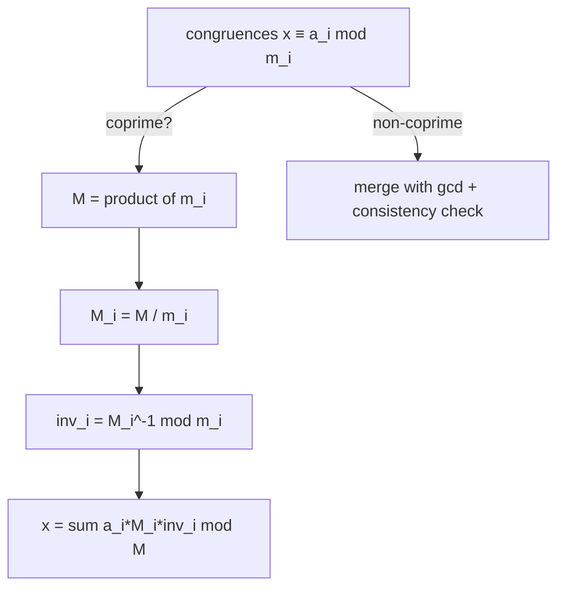

# Chinese Remainder Theorem (CRT) — Junior Level

> **One-line summary:** If you know a number's remainders modulo several **coprime** moduli — `x ≡ a₁ (mod m₁)`, `x ≡ a₂ (mod m₂)`, … — the Chinese Remainder Theorem tells you there is **exactly one** value of `x` in `[0, M)` (where `M = m₁·m₂·…`) that satisfies all of them at once, and it gives you a recipe to compute that `x`.

---

## Table of Contents

1. [Introduction](#introduction)
2. [Prerequisites](#prerequisites)
3. [Glossary](#glossary)
4. [Core Concepts](#core-concepts)
5. [Big-O Summary](#big-o-summary)
6. [Real-World Analogies](#real-world-analogies)
7. [Pros & Cons](#pros--cons)
8. [Step-by-Step Walkthrough](#step-by-step-walkthrough)
9. [Code Examples](#code-examples)
10. [Coding Patterns](#coding-patterns)
11. [Error Handling](#error-handling)
12. [Performance Tips](#performance-tips)
13. [Best Practices](#best-practices)
14. [Edge Cases & Pitfalls](#edge-cases--pitfalls)
15. [Common Mistakes](#common-mistakes)
16. [Cheat Sheet](#cheat-sheet)
17. [Visual Animation](#visual-animation)
18. [Summary](#summary)
19. [Further Reading](#further-reading)

---

## Introduction

Imagine an ancient general who wants to count his soldiers without lining them all up. He tells them to form rows of 3, and 2 soldiers are left over. Rows of 5, and 3 are left over. Rows of 7, and 2 are left over. From just those three leftovers — `2`, `3`, `2` — can he recover the exact number of soldiers? Remarkably, yes. There is a unique answer below `3·5·7 = 105`, and it is `23` (check: `23 = 7·3 + 2`, `23 = 4·5 + 3`, `23 = 3·7 + 2`). This puzzle, recorded in a Chinese mathematics text over 1500 years ago, is the origin of the **Chinese Remainder Theorem (CRT)**.

The modern statement is clean. You are given a **system of congruences**:

```
x ≡ a₁ (mod m₁)
x ≡ a₂ (mod m₂)
...
x ≡ aₙ (mod mₙ)
```

Each line says "when `x` is divided by `mᵢ`, the remainder is `aᵢ`." The CRT answers two questions:

> **Existence & Uniqueness:** If the moduli `m₁, …, mₙ` are **pairwise coprime** (no two of them share a common factor), then there is **exactly one** solution `x` in the range `[0, M)`, where `M = m₁·m₂·…·mₙ`. Every other solution differs from it by a multiple of `M`.

> **Construction:** There is an explicit formula (and an even simpler step-by-step *merge* procedure) that computes that unique `x`.

At junior level we focus on the most common case: **two coprime congruences**, which is the building block for everything else. We learn the formula, learn the merge view, and work a full example by hand. This single tool unlocks a surprising range of applications: reconstructing a number from its residues, doing arithmetic modulo a big number by splitting it into several small moduli (and recombining at the end to avoid overflow), and the RSA-CRT speedup that makes real-world cryptography about four times faster.

The theorem has a deeper meaning too. It says the moduli "don't interfere" with each other when they are coprime: choosing the remainder mod `m₁` and the remainder mod `m₂` are **completely independent** choices, and *every* combination of remainders is achievable by exactly one `x` below `M`. That independence is the heart of why CRT is so useful — it lets you take one hard computation modulo a big number and split it into several easy, parallel computations modulo small numbers.

---

## Prerequisites

Before reading this file you should be comfortable with:

- **Modular arithmetic** — what `x mod m` means (the remainder), and that `x ≡ a (mod m)` means `m` divides `x − a`. See sibling `01-modular-arithmetic`.
- **GCD (greatest common divisor)** — and the **Euclidean algorithm** that computes it. See sibling `02-gcd-lcm`.
- **Coprime / relatively prime** — two numbers are coprime when `gcd = 1`.
- **Modular inverse** — `t` is the inverse of `a` modulo `m` when `a·t ≡ 1 (mod m)`; it exists exactly when `gcd(a, m) = 1`. Computed with the **Extended Euclidean algorithm**. See sibling `03-modular-inverse`.
- **LCM (least common multiple)** — `lcm(a, b) = a·b / gcd(a, b)`.
- **Big-O notation** — `O(log m)` for one inverse, `O(n)` merges for `n` congruences.

Optional but helpful:

- A glance at the **Extended Euclidean algorithm**, which returns `g, x, y` with `a·x + b·y = g = gcd(a, b)`. We reuse it both for inverses and for the general (non-coprime) merge.

---

## Glossary

| Term | Meaning |
|------|---------|
| **Congruence** | A statement `x ≡ a (mod m)`, read "`x` is congruent to `a` modulo `m`", meaning `m` divides `x − a`. |
| **System of congruences** | Several congruences that must all hold for the same `x`. |
| **Residue `aᵢ`** | The required remainder of `x` modulo `mᵢ`. Usually normalized to `0 ≤ aᵢ < mᵢ`. |
| **Modulus `mᵢ`** | The divisor in congruence `i`. |
| **Pairwise coprime** | For every pair `i ≠ j`, `gcd(mᵢ, mⱼ) = 1`. (Stronger than "the whole set shares no common factor".) |
| **Product `M`** | `M = m₁·m₂·…·mₙ`. The unique solution lives in `[0, M)`. |
| **Partial product `Mᵢ`** | `Mᵢ = M / mᵢ`. It is divisible by every modulus except `mᵢ`. |
| **Modular inverse** | `t = a⁻¹ (mod m)` satisfies `a·t ≡ 1 (mod m)`; exists iff `gcd(a, m) = 1`. |
| **LCM** | Least common multiple; the combined modulus when merging is `lcm(m₁, m₂)`. |
| **Consistency condition** | For non-coprime merges, the system is solvable iff `a₁ ≡ a₂ (mod gcd(m₁, m₂))`. |

---

## Core Concepts

### 1. A Congruence Pins Down a Residue Class

`x ≡ 2 (mod 3)` does **not** name a single number — it names a whole infinite family: `…, 2, 5, 8, 11, 14, 17, 20, 23, …`. Each congruence is a sieve that keeps one residue class and discards the rest. CRT is about **intersecting** several such families.

### 2. Coprime Moduli ⇒ Exactly One Solution mod M

With two coprime moduli `m₁, m₂` and `M = m₁·m₂`, every combination `(a₁, a₂)` of remainders is hit by **exactly one** `x` in `[0, M)`. Why exactly one? There are `M = m₁·m₂` numbers in `[0, M)`, and there are `m₁·m₂` possible remainder-pairs; coprimality makes the map "`x` → its pair of remainders" a perfect one-to-one matching. (The full proof is in [`professional.md`](./professional.md).)

### 3. The Constructive Formula (Two Congruences)

For `x ≡ a₁ (mod m₁)` and `x ≡ a₂ (mod m₂)` with `gcd(m₁, m₂) = 1`:

```
M  = m₁ · m₂
M₁ = M / m₁ = m₂        ,  inv₁ = M₁⁻¹ mod m₁
M₂ = M / m₂ = m₁        ,  inv₂ = M₂⁻¹ mod m₂
x  = (a₁ · M₁ · inv₁ + a₂ · M₂ · inv₂)  mod M
```

The clever part: `M₁ = m₂` is a multiple of `m₂`, so the term `a₁·M₁·inv₁` is `≡ 0 (mod m₂)` and contributes nothing there; but modulo `m₁` it equals `a₁·(M₁·inv₁) ≡ a₁·1 = a₁`. Each term "activates" only its own modulus. Add them up and you get a number that is `a₁` mod `m₁` and `a₂` mod `m₂` simultaneously.

### 4. The Merge View (Often Easier to Code)

Instead of the symmetric formula, you can **combine two congruences into one** and repeat. Given `x ≡ a₁ (mod m₁)` and `x ≡ a₂ (mod m₂)`, every solution of the first has the form `x = a₁ + m₁·t`. Substitute into the second:

```
a₁ + m₁·t ≡ a₂ (mod m₂)
m₁·t ≡ (a₂ − a₁) (mod m₂)
t ≡ (a₂ − a₁) · m₁⁻¹ (mod m₂)         [needs gcd(m₁, m₂) = 1]
```

Solve for `t`, plug back, and you get a single congruence `x ≡ x₀ (mod m₁·m₂)`. The merge view scales to `n` congruences: fold them one at a time, carrying a running `(a, m)` pair. It also generalizes to **non-coprime** moduli (see [`middle.md`](./middle.md)).

### 5. Normalize Your Residues

Always reduce `aᵢ` into `[0, mᵢ)` first (`aᵢ = ((aᵢ % mᵢ) + mᵢ) % mᵢ`), and reduce the final `x` into `[0, M)`. Negative intermediate values are a frequent source of wrong answers, especially in languages where `%` can return a negative remainder.

### 6. The Answer Is Unique mod M, Not Absolutely Unique

CRT returns the **smallest non-negative** solution `x₀` in `[0, M)`. The complete solution set is `{ x₀, x₀ + M, x₀ + 2M, … }`. If a problem asks for "the smallest positive `x`" or "`x` in a given range", you start from `x₀` and add or subtract multiples of `M`.

### 7. Why Coprimality Gives Independence

Here is the one sentence to remember the *whole* theorem by: when the moduli are coprime, picking the remainder mod `m₁` tells you **nothing** about the remainder mod `m₂`. They are independent dials. Because there are `m₁` choices for the first and `m₂` for the second, there are `m₁·m₂ = M` total combinations — and there are exactly `M` numbers in `[0, M)`, so each combination is realized by exactly one number. That counting argument *is* existence and uniqueness. If the moduli shared a factor, the dials would be linked (they must agree modulo the shared part), some combinations would be impossible, and others would repeat — which is exactly the non-coprime story.

---

## Big-O Summary

| Operation | Time | Space | Notes |
|-----------|------|-------|-------|
| One modular inverse (Ext. Euclid) | **O(log m)** | O(1) | Dominant per-step cost. |
| Merge two congruences | O(log m) | O(1) | One inverse + a few mults. |
| Full coprime CRT, `n` congruences | **O(n · log M)** | O(1) | `n − 1` merges (or one formula pass). |
| Build all `Mᵢ = M/mᵢ` | O(n) | O(n) | If using the symmetric formula. |
| Reconstruct number from `n` residues | O(n · log M) | O(n) | Same as a full CRT. |
| Multiply two big numbers via multi-mod | O(n · cost) | O(n) | `n` small-prime products, then one CRT. |

The headline cost is **`O(n · log M)`** — linear in the number of congruences, with a logarithmic factor per modular inverse. For a handful of small primes this is effectively instant.

---

## Real-World Analogies

| Concept | Analogy |
|---------|---------|
| System of congruences | Several witnesses each remember *part* of a phone number ("ends in 3 mod 10", "is even"); together they pin it down. |
| Pairwise coprime moduli | Gears with no common tooth count — they only re-align after `lcm` turns, so each gear's position is independent information. |
| Unique solution mod M | A combination lock: each dial (modulus) is independent, and only one full setting below `M` matches all the clues. |
| Partial product `Mᵢ` and its inverse | A "spotlight" that lights up exactly one modulus and stays dark on all the others. |
| Multi-mod big computation | Splitting a huge invoice across several small ledgers, summing each ledger, then reconciling at the end (CRT is the reconciliation). |
| RSA-CRT speedup | Instead of one giant decryption mod `n = p·q`, do two small ones mod `p` and mod `q` and merge — like solving two easy sub-problems instead of one hard one. |

Where the analogy breaks: real locks are independent by construction; CRT's independence is *earned* by the coprimality condition. If the moduli share a factor, the "dials" interfere and a solution may not exist at all.

A second analogy that helps with the *uniqueness* claim: think of `(x mod m₁, x mod m₂)` as a pair of coordinates on a grid that is `m₁` wide and `m₂` tall. As `x` increases by 1, you step one cell right (wrapping around) and one cell up (wrapping around) at the same time — a knight-like diagonal walk. When `m₁` and `m₂` are coprime, this diagonal walk visits **every** cell of the grid exactly once before returning to the start after `m₁·m₂` steps. That "visits every cell exactly once" is precisely the existence-and-uniqueness of CRT. If the moduli share a factor, the walk only ever touches a sub-grid, so most cells (residue pairs) are unreachable — those correspond to systems with no solution.

---

## Pros & Cons

| Pros | Cons |
|------|------|
| Turns one big-modulus computation into several small independent ones (parallelizable). | Requires the moduli to be coprime for the clean version; otherwise needs the consistency check. |
| Avoids overflow: work mod small primes, recombine at the end. | The reconstruction step itself can overflow if `M` exceeds 64 bits — needs `mulmod` or big integers. |
| Exact integer arithmetic — no floating-point error. | A forgotten modular inverse or un-normalized residue silently gives a wrong `x`. |
| Underlies RSA-CRT, multi-mod NTT, and number reconstruction. | For non-coprime systems, inconsistency must be detected (no solution case). |
| Simple to implement once you have `extgcd` / modular inverse. | Choosing/managing several primes adds bookkeeping. |

**When to use:** reconstructing a number from residues, computing modulo a large `M` by splitting into coprime factors, multi-prime modular multiplication (NTT-style, bignum), RSA-CRT, calendar/cycle "when do these periods align" problems.

**When NOT to use:** a single congruence (nothing to combine), moduli that you cannot make coprime *and* that fail the consistency check (no solution), or when a direct big-integer computation is simpler and fast enough.

---

## Step-by-Step Walkthrough

Solve the system with **two coprime moduli**:

```
x ≡ 2 (mod 3)
x ≡ 3 (mod 5)
```

`gcd(3, 5) = 1`, so a unique solution exists in `[0, 15)`.

**Method A — the constructive formula.**

```
M  = 3 · 5 = 15
M₁ = M / m₁ = 15 / 3 = 5
M₂ = M / m₂ = 15 / 5 = 3

inv₁ = M₁⁻¹ mod m₁ = 5⁻¹ mod 3.  5 ≡ 2 (mod 3), and 2·2 = 4 ≡ 1, so inv₁ = 2.
inv₂ = M₂⁻¹ mod m₂ = 3⁻¹ mod 5.  3·2 = 6 ≡ 1 (mod 5), so inv₂ = 2.

x = (a₁·M₁·inv₁ + a₂·M₂·inv₂) mod M
  = (2·5·2     + 3·3·2)      mod 15
  = (20        + 18)         mod 15
  = 38 mod 15
  = 8
```

**Check:** `8 mod 3 = 2` ✓ and `8 mod 5 = 3` ✓. The unique solution is `x = 8`.

**Method B — the merge view (substitution).**

```
From x ≡ 2 (mod 3):  x = 2 + 3·t.
Substitute into x ≡ 3 (mod 5):
   2 + 3t ≡ 3 (mod 5)
   3t ≡ 1 (mod 5)
   t ≡ 1 · 3⁻¹ (mod 5) = 1·2 = 2 (mod 5)
So t = 2 + 5·s, and
   x = 2 + 3·(2 + 5s) = 2 + 6 + 15s = 8 + 15s.
```

The merged congruence is `x ≡ 8 (mod 15)` — same answer, now as a single congruence ready to merge with a third one. Both methods agree: `x = 8`.

**Add a third congruence** `x ≡ 2 (mod 7)` (the soldier puzzle from the intro). Merge `x ≡ 8 (mod 15)` with `x ≡ 2 (mod 7)`:

```
x = 8 + 15t,   8 + 15t ≡ 2 (mod 7)
15 ≡ 1 (mod 7), 8 ≡ 1 (mod 7), so 1 + t ≡ 2 → t ≡ 1 (mod 7)
x = 8 + 15·1 = 23  →  x ≡ 23 (mod 105)
```

`23 mod 3 = 2`, `23 mod 5 = 3`, `23 mod 7 = 2`. The general's count is `23` (mod 105).

---

## Code Examples

### Example: Merge-Based Coprime CRT (Two Congruences)

This computes the unique `x` for two coprime congruences using the merge derivation. It relies on the Extended Euclidean algorithm for the modular inverse.

#### Go

```go
package main

import "fmt"

// extgcd returns g, x, y with a*x + b*y = g = gcd(a, b).
func extgcd(a, b int64) (int64, int64, int64) {
	if b == 0 {
		return a, 1, 0
	}
	g, x1, y1 := extgcd(b, a%b)
	return g, y1, x1 - (a/b)*y1
}

// modInverse returns a^{-1} mod m, assuming gcd(a, m) = 1.
func modInverse(a, m int64) int64 {
	_, x, _ := extgcd(((a%m)+m)%m, m)
	return ((x % m) + m) % m
}

// crtCoprime merges x≡a1 (mod m1) and x≡a2 (mod m2), m1,m2 coprime.
// Returns the unique solution in [0, m1*m2).
func crtCoprime(a1, m1, a2, m2 int64) int64 {
	M := m1 * m2
	// x = a1 + m1 * t, where t ≡ (a2 - a1) * inv(m1) (mod m2)
	diff := (((a2-a1)%m2)+m2)%m2
	t := (diff * modInverse(m1, m2)) % m2
	x := (a1 + m1*t) % M
	return (x + M) % M
}

func main() {
	x := crtCoprime(2, 3, 3, 5)
	fmt.Printf("x ≡ %d (mod %d)\n", x, int64(15)) // x = 8
	x = crtCoprime(x, 15, 2, 7)
	fmt.Printf("x ≡ %d (mod %d)\n", x, int64(105)) // x = 23
}
```

#### Java

```java
public class CrtCoprime {
    // extgcd: returns {g, x, y} with a*x + b*y = g = gcd(a, b).
    static long[] extgcd(long a, long b) {
        if (b == 0) return new long[]{a, 1, 0};
        long[] r = extgcd(b, a % b);
        return new long[]{r[0], r[2], r[1] - (a / b) * r[2]};
    }

    static long modInverse(long a, long m) {
        a = ((a % m) + m) % m;
        long x = extgcd(a, m)[1];
        return ((x % m) + m) % m;
    }

    // Merge x≡a1 (mod m1), x≡a2 (mod m2), m1,m2 coprime; result in [0, m1*m2).
    static long crtCoprime(long a1, long m1, long a2, long m2) {
        long M = m1 * m2;
        long diff = (((a2 - a1) % m2) + m2) % m2;
        long t = (diff * modInverse(m1, m2)) % m2;
        long x = (a1 + m1 * t) % M;
        return (x + M) % M;
    }

    public static void main(String[] args) {
        long x = crtCoprime(2, 3, 3, 5);
        System.out.println("x ≡ " + x + " (mod 15)");  // 8
        x = crtCoprime(x, 15, 2, 7);
        System.out.println("x ≡ " + x + " (mod 105)"); // 23
    }
}
```

#### Python

```python
def extgcd(a, b):
    """Return (g, x, y) with a*x + b*y = g = gcd(a, b)."""
    if b == 0:
        return a, 1, 0
    g, x1, y1 = extgcd(b, a % b)
    return g, y1, x1 - (a // b) * y1


def mod_inverse(a, m):
    a %= m
    _, x, _ = extgcd(a, m)
    return x % m


def crt_coprime(a1, m1, a2, m2):
    """Merge x≡a1 (mod m1), x≡a2 (mod m2) for coprime m1, m2."""
    M = m1 * m2
    diff = (a2 - a1) % m2
    t = (diff * mod_inverse(m1, m2)) % m2
    x = (a1 + m1 * t) % M
    return x % M


if __name__ == "__main__":
    x = crt_coprime(2, 3, 3, 5)
    print(f"x ≡ {x} (mod 15)")   # 8
    x = crt_coprime(x, 15, 2, 7)
    print(f"x ≡ {x} (mod 105)")  # 23
```

**What it does:** merges two coprime congruences, then folds in a third, reproducing the soldier puzzle answer `23`.
**Run:** `go run main.go` | `javac CrtCoprime.java && java CrtCoprime` | `python crt.py`

---

## Coding Patterns

### Pattern 1: Brute-Force CRT (the oracle you test against)

**Intent:** Before trusting the formula, just scan `[0, M)` and return the first value matching all congruences. Use it to verify the fast version on small inputs.

```python
def crt_bruteforce(residues, moduli):
    M = 1
    for m in moduli:
        M *= m
    for x in range(M):
        if all(x % m == a % m for a, m in zip(residues, moduli)):
            return x
    return None  # only happens for inconsistent non-coprime systems
```

This is `O(M)` — far too slow for large moduli, but a perfect correctness oracle for small ones.

### Pattern 2: Fold Many Congruences

**Intent:** Reduce `n` congruences to one by repeated merging, carrying a running `(a, m)`.

```python
def crt_fold(residues, moduli):
    a, m = 0, 1            # x ≡ 0 (mod 1): true for all x
    for ai, mi in zip(residues, moduli):
        a = crt_coprime(a, m, ai % mi, mi)
        m *= mi
    return a
```

### Pattern 3: Constructive Formula (Symmetric)

**Intent:** Build `M`, each `Mᵢ = M/mᵢ`, its inverse mod `mᵢ`, and sum the terms.



---

## Error Handling

| Error | Cause | Fix |
|-------|-------|-----|
| Wrong `x`, off by a sign | `%` returned a negative remainder. | Normalize: `((v % m) + m) % m`. |
| Modular inverse "does not exist" | Moduli not coprime, so `m₁⁻¹ mod m₂` is undefined. | Use the **general** merge (gcd-based) — see `middle.md`. |
| Overflow in `m₁ * m₂` or `a*Mᵢ` | Product exceeds 64-bit range. | Use `mulmod` / 128-bit / big integers — see `senior.md`. |
| Result outside `[0, M)` | Forgot the final reduction. | `x = ((x % M) + M) % M`. |
| "No solution" not handled | Non-coprime system that is inconsistent. | Check `a₁ ≡ a₂ (mod gcd(m₁, m₂))` before merging. |
| Inverse computed mod wrong modulus | Used `m₁` instead of `m₂` (or vice versa). | `t ≡ (a₂−a₁)·m₁⁻¹ (mod m₂)` — the inverse is taken **mod `m₂`**. |

---

## Performance Tips

- **Reduce residues first.** `aᵢ = aᵢ mod mᵢ` keeps every intermediate small and avoids surprises with negatives.
- **Merge, don't re-derive.** Folding `(a, m)` once per congruence is `O(n)` inverses total; recomputing all `Mᵢ` from scratch each step is wasteful.
- **Precompute inverses** if you solve many systems with the *same* fixed moduli (common in multi-mod NTT) — the inverses depend only on the moduli, not the residues.
- **Use the smallest moduli that are still coprime** when you get to choose them; smaller primes keep products inside 64 bits longer.
- **Avoid recomputing `M`** — carry the running product alongside the running residue in the fold.

---

## Best Practices

- Always test the fast CRT against the brute-force oracle (Pattern 1) on random small systems before trusting it.
- Normalize every residue into `[0, mᵢ)` at the boundary, and the final answer into `[0, M)`.
- Decide up front whether the moduli are guaranteed coprime; if not, use the general gcd-based merge with a consistency check.
- Keep `extgcd` and `modInverse` as small, separately testable helpers — most CRT bugs hide there.
- Document the convention: CRT returns the **smallest non-negative** solution; the full solution set is `x₀ + k·M`.
- Prefer the **merge/fold** form over the symmetric formula in code: it is shorter, keeps intermediates smaller, and extends to the non-coprime case with one extra check.
- When you control the moduli (e.g. choosing primes for a multi-mod computation), pick small ones — the product `M` stays inside 64 bits longer, postponing the need for `mulmod` or big integers.
- Write a tiny `verify(x, residues, moduli)` helper that asserts `x % mᵢ == aᵢ` for every congruence, and call it in tests; it catches almost every CRT mistake immediately.

---

## Edge Cases & Pitfalls

- **A single congruence** — the answer is just `a₁ mod m₁`; there is nothing to merge.
- **`mᵢ = 1`** — every `x` is `≡ 0 (mod 1)`; this congruence carries no information and the merge leaves the answer unchanged. It is a valid identity to seed the fold (`a = 0, m = 1`).
- **Equal moduli** — `x ≡ 2 (mod 6)` and `x ≡ 5 (mod 6)` are contradictory (same modulus, different residue) — no solution. This is a non-coprime case (`gcd = 6`).
- **Non-coprime moduli** — the clean formula breaks; you must use the gcd-based merge and the consistency check `a₁ ≡ a₂ (mod gcd)`.
- **Negative residues** — `x ≡ −1 (mod 5)` means `x ≡ 4 (mod 5)`; normalize before use.
- **`M` overflows** — even if each `mᵢ` is small, the product `M` can exceed 64 bits; use `mulmod` or big integers (see `senior.md`).
- **Asking for a value in a range** — CRT gives `x₀ ∈ [0, M)`; shift by multiples of `M` to land in the requested window.

---

## Common Mistakes

1. **Taking the inverse modulo the wrong modulus** — in `t ≡ (a₂−a₁)·m₁⁻¹ (mod m₂)`, the inverse of `m₁` is computed **mod `m₂`**, not mod `m₁`.
2. **Forgetting to normalize negatives** — `(a₂ − a₁)` can be negative; reduce it into `[0, m₂)` first.
3. **Assuming a solution always exists** — for non-coprime moduli it may not; you must check consistency.
4. **Overflow in the product** — `m₁·m₂` or `a·Mᵢ·invᵢ` can overflow 64-bit integers; use safe multiplication.
5. **Returning the wrong representative** — the unique answer is in `[0, M)`; not reducing leaves a value like `38` instead of `8`.
6. **Confusing pairwise-coprime with overall-coprime** — `{6, 10, 15}` has overall gcd 1 but is **not** pairwise coprime (`gcd(6,10)=2`), so the simple formula does not apply directly.
7. **Mixing up `aᵢ` and `mᵢ` order** in the call — residue first, modulus second; a swap gives nonsense.
8. **Forgetting `gcd(Mᵢ, mᵢ) = 1` is what lets the inverse exist** — if you accidentally try to invert something sharing a factor with the modulus, the routine fails; that is a signal the moduli were not actually coprime.
9. **Returning `0` instead of `M` for "smallest positive"** — the CRT representative can legitimately be `0` (e.g. all residues `0`); if the problem wants the smallest *positive* value, return `M` in that case.

---

## Cheat Sheet

| Question | Tool | Formula |
|----------|------|---------|
| Two coprime congruences | constructive formula | `x = (a₁M₁inv₁ + a₂M₂inv₂) mod M`, `Mᵢ = M/mᵢ` |
| Two coprime congruences (merge) | substitution | `t ≡ (a₂−a₁)m₁⁻¹ (mod m₂)`, `x = a₁ + m₁t` |
| `n` coprime congruences | fold | merge one at a time, carry `(a, m)` |
| Combined modulus | product / lcm | coprime: `M = m₁m₂`; general: `lcm(m₁, m₂)` |
| Inverse exists? | gcd | iff `gcd(a, m) = 1` |
| Non-coprime solvable? | consistency | iff `a₁ ≡ a₂ (mod gcd(m₁, m₂))` |
| All solutions | shift | `{ x₀ + k·M : k ∈ ℤ }` |

Core merge (coprime):

```
crt(a1, m1, a2, m2):           # gcd(m1, m2) = 1
    diff = ((a2 - a1) mod m2 + m2) mod m2
    t    = diff * inverse(m1, m2) mod m2
    x    = (a1 + m1 * t) mod (m1*m2)
    return x                    # unique in [0, m1*m2)
```

---

## Visual Animation

> See [`animation.html`](./animation.html) for an interactive visualization.
>
> The animation demonstrates:
> - Two (or more) congruences `x ≡ aᵢ (mod mᵢ)` shown as residue classes on a number line
> - The merge step producing one combined congruence modulo the `lcm`
> - The unique solution highlighted in `[0, M)`
> - Editable `aᵢ` and `mᵢ`, plus play / pause / step controls

---

## Summary

The Chinese Remainder Theorem says that knowing a number's remainders modulo pairwise-coprime moduli is enough to pin it down uniquely below the product `M`. For two congruences you either apply the symmetric constructive formula — `Mᵢ = M/mᵢ`, multiply by its inverse, sum the terms — or, more simply, **merge** them: write `x = a₁ + m₁·t`, solve `t ≡ (a₂−a₁)·m₁⁻¹ (mod m₂)`, and back-substitute to get one congruence mod `m₁·m₂`. The merge view folds naturally to `n` congruences and extends (with a gcd-based consistency check) to non-coprime moduli. The one rule never to forget: normalize residues and the final answer, and take the modular inverse **modulo the right modulus**. Master the two-congruence merge and you can reconstruct numbers from residues, split big modular computations into small ones, and power the RSA-CRT speedup.

---

## Further Reading

- *Introduction to Algorithms* (CLRS) — number-theoretic algorithms, modular arithmetic, and CRT.
- Sibling topic `02-gcd-lcm` — the Euclidean algorithm CRT depends on.
- Sibling topic `03-modular-inverse` — Extended Euclid and inverses, the core CRT helper.
- Sibling topic `15-garner` (in `19-number-theory`) — Garner's algorithm, an incremental mixed-radix form of CRT.
- cp-algorithms.com — "Chinese Remainder Theorem" and "Garner's algorithm".
- *A Course in Computational Algebraic Number Theory* (Cohen) — CRT in number reconstruction and RSA-CRT.
- *Concrete Mathematics* (Graham, Knuth, Patashnik) — congruences, residues, and the number-theoretic groundwork.
- Project Euler and competitive-programming archives — many problems ("smallest number with given remainders", cycle-alignment puzzles) are direct CRT applications.
- Sibling topic `01-modular-arithmetic` — the congruence rules CRT builds on.
- The classic puzzle source: Sunzi Suanjing (孫子算經), the 3rd–5th century text where the soldier-counting problem first appears, giving CRT its name.
