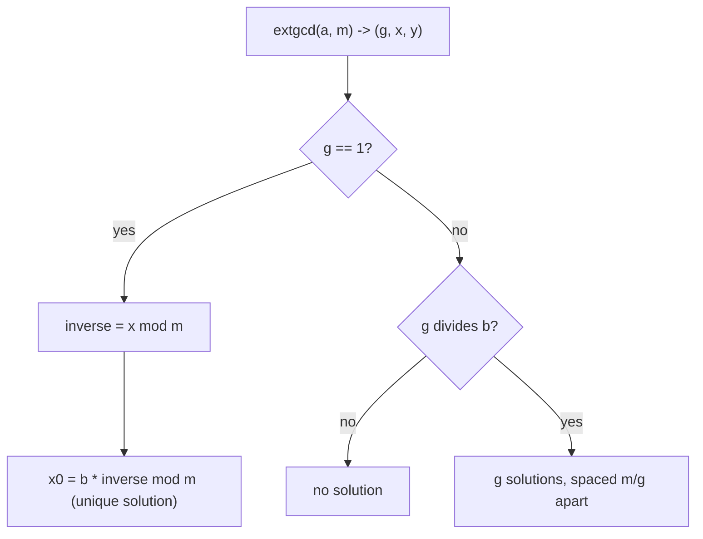

# Extended Euclidean Algorithm & Modular Inverse — Junior Level

> **One-line summary:** The **extended Euclidean algorithm** computes not just `g = gcd(a, b)` but two integers `x, y` with `a·x + b·y = g` (Bezout's identity). When `gcd(a, m) = 1`, the `x` it produces is the **modular inverse** of `a` modulo `m`: the unique `a⁻¹` in `[0, m)` with `a · a⁻¹ ≡ 1 (mod m)`.

---

## Table of Contents

1. [Introduction](#introduction)
2. [Prerequisites](#prerequisites)
3. [Glossary](#glossary)
4. [Core Concepts](#core-concepts)
5. [Big-O Summary](#big-o-summary)
6. [Real-World Analogies](#real-world-analogies)
7. [Pros & Cons](#pros--cons)
8. [Step-by-Step Walkthrough](#step-by-step-walkthrough)
9. [Code Examples](#code-examples)
10. [Coding Patterns](#coding-patterns)
11. [Error Handling](#error-handling)
12. [Performance Tips](#performance-tips)
13. [Best Practices](#best-practices)
14. [Edge Cases & Pitfalls](#edge-cases--pitfalls)
15. [Common Mistakes](#common-mistakes)
16. [Cheat Sheet](#cheat-sheet)
17. [Visual Animation](#visual-animation)
18. [Summary](#summary)
19. [Further Reading](#further-reading)

---

## Introduction

You already know the ordinary Euclidean algorithm: to find `gcd(a, b)` you repeatedly replace the larger number by its remainder when divided by the smaller, until one of them hits zero. For example `gcd(30, 12) → gcd(12, 6) → gcd(6, 0) = 6`. Simple, fast, and it gives you a single number: the greatest common divisor.

The **extended** Euclidean algorithm asks for more. Along the way it tracks *how* the gcd is built out of the two original numbers. It returns a triple `(g, x, y)` where `g = gcd(a, b)` **and**

> **`a·x + b·y = g`.**

This equation is called **Bezout's identity**, and the numbers `x, y` are **Bezout coefficients**. For our example `gcd(30, 12) = 6`, the extended algorithm finds `x = 1, y = -2`, because `30·1 + 12·(-2) = 30 - 24 = 6`. Those coefficients are the whole point — they are what an ordinary gcd throws away.

Why do we care about `x` and `y`? Because of one spectacular application: the **modular inverse**. In modular arithmetic you can add, subtract, and multiply, but you cannot directly "divide". To divide by `a` mod `m` you instead multiply by `a`'s inverse, written `a⁻¹`, which is the number satisfying

> **`a · a⁻¹ ≡ 1 (mod m)`.**

It turns out that `a` has an inverse mod `m` **if and only if** `gcd(a, m) = 1` (we say `a` and `m` are **coprime**). And when they are coprime, Bezout gives it to you for free: from `a·x + m·y = 1`, reduce both sides mod `m`. The `m·y` term vanishes (it is a multiple of `m`), leaving `a·x ≡ 1 (mod m)`. So `x` *is* the inverse. Reduce `x` into `[0, m)` and you are done.

This single tool — extended Euclid → Bezout → modular inverse — underlies a huge amount of computing: solving linear congruences `a·x ≡ b (mod m)`, the Chinese Remainder Theorem (CRT), RSA key generation, hashing, and almost every competitive-programming problem that says "answer mod a prime". This file builds the whole chain from scratch.

---

## Prerequisites

Before reading this file you should be comfortable with:

- **The ordinary Euclidean algorithm** — `gcd(a, b)` by repeated remainder. We extend exactly this.
- **Integer division and remainder** — the quotient `q = a / b` (floor) and remainder `r = a % b`, with `a = q·b + r`.
- **Modular arithmetic basics** — `(a + b) mod m`, `(a · b) mod m`, and the meaning of `a ≡ b (mod m)` ("`a` and `b` leave the same remainder mod `m`").
- **Negative numbers and `%`** — in many languages `%` can return a negative result for negative inputs; you will normalize with `((x % m) + m) % m`.
- **Big-O notation** — we use `O(log min(a, b))`.

Optional but helpful:

- A glance at **prime numbers** and **Fermat's little theorem** (`a^(p-1) ≡ 1 (mod p)` for prime `p`), since it gives an *alternative* inverse method we compare against.
- Familiarity with **recursion**, since the cleanest extended-Euclid is recursive.

---

## Glossary

| Term | Meaning |
|------|---------|
| **gcd(a, b)** | Greatest common divisor — the largest integer dividing both `a` and `b`. |
| **Coprime** | Two numbers with `gcd = 1`. Also called "relatively prime". |
| **Bezout's identity** | The fact that integers `x, y` always exist with `a·x + b·y = gcd(a, b)`. |
| **Bezout coefficients** | The specific `x, y` satisfying Bezout's identity (not unique). |
| **Extended Euclidean algorithm** | The algorithm returning `(g, x, y)` with `a·x + b·y = g`. |
| **Modular inverse `a⁻¹`** | The number with `a · a⁻¹ ≡ 1 (mod m)`; exists iff `gcd(a, m) = 1`. |
| **Congruence** | A statement `a ≡ b (mod m)`, meaning `m` divides `a - b`. |
| **Linear congruence** | An equation of the form `a·x ≡ b (mod m)`, solved for `x`. |
| **Fermat's little theorem** | For prime `p` and `a` not divisible by `p`, `a^(p-1) ≡ 1 (mod p)`, so `a⁻¹ ≡ a^(p-2)`. |
| **Residue** | A representative of a number mod `m`, usually taken in `[0, m)`. |

---

## Core Concepts

### 1. The Ordinary Euclidean Algorithm (the base we extend)

The recursive identity is `gcd(a, b) = gcd(b, a mod b)`, with `gcd(a, 0) = a`. Each step shrinks the numbers fast (the remainder is strictly smaller), so it terminates in `O(log min(a, b))` steps:

```
gcd(30, 12) = gcd(12, 6) = gcd(6, 0) = 6
```

That is all the ordinary algorithm tells us: the value `6`. It forgets the path.

### 2. Bezout's Identity

For any integers `a, b` (not both zero), there exist integers `x, y` with `a·x + b·y = gcd(a, b)`. The `x, y` are **not unique** — adding `b/g` to `x` while subtracting `a/g` from `y` gives another valid pair. The extended algorithm computes *one* such pair, the "small" one that falls out of the recursion.

### 3. The Extended Euclidean Algorithm (Recursive)

The recursion mirrors `gcd`. At the bottom, `gcd(a, 0) = a`, and the obvious coefficients are `x = 1, y = 0` because `a·1 + 0·0 = a`. Coming back up, suppose the recursive call on `(b, a mod b)` returned `(g, x₁, y₁)` with

```
b·x₁ + (a mod b)·y₁ = g
```

We want `x, y` for the level above with `a·x + b·y = g`. Using `a mod b = a - (a/b)·b` (where `a/b` is the floor quotient `q`), substitute:

```
b·x₁ + (a - q·b)·y₁ = g
a·y₁ + b·(x₁ - q·y₁) = g
```

So the new coefficients are `x = y₁` and `y = x₁ - q·y₁`. That two-line update is the entire extended algorithm.

### 4. From Bezout to the Modular Inverse

Run the algorithm on `(a, m)`. It returns `(g, x, y)` with `a·x + m·y = g`. **If `g = 1`** (i.e. `a` and `m` are coprime), reduce mod `m`:

```
a·x + m·y = 1
a·x ≡ 1 (mod m)        ← because m·y ≡ 0 (mod m)
```

So `x` is the inverse. Normalize it into `[0, m)` with `((x % m) + m) % m` because the raw `x` can be negative. **If `g ≠ 1`, no inverse exists** — `a` and `m` share a common factor, and there is simply no number you can multiply `a` by to get `1` mod `m`.

### 5. Why Coprimality Is Exactly the Condition

If `a` and `m` share a factor `d > 1`, then `a·(anything)` is always a multiple of `d`, so it can never be `≡ 1 (mod m)` (because `1` is not a multiple of `d`, and `m` is). Conversely, if `gcd(a, m) = 1`, Bezout hands you the inverse directly. So "inverse exists" and "coprime" are the *same* statement. This is the most important fact in the whole topic.

### 6. The Fermat Alternative (Prime Modulus Only)

When `m = p` is **prime**, Fermat's little theorem gives a shortcut: `a^(p-1) ≡ 1 (mod p)`, so `a⁻¹ ≡ a^(p-2) (mod p)`. You compute it with fast exponentiation in `O(log p)`. This works *only* for prime moduli (and `a` not a multiple of `p`). Extended Euclid works for **any** modulus where `gcd(a, m) = 1`, prime or not. Both are `O(log m)`; pick Fermat for prime mod (slightly simpler code), extended Euclid for general mod.

### 7. Inverses of 1..n in O(n) (the table trick)

Sometimes you need the inverse of *every* number `1, 2, …, n` modulo a prime `p` (this is common when precomputing binomial coefficients). Doing `n` separate inversions costs `O(n log p)`. A clever recurrence does it in `O(n)`:

```
inv[1] = 1
inv[i] = -(p / i) * inv[p % i] % p     (for i = 2..n)
```

The idea: write `p = (p/i)·i + (p mod i)`, which is `≡ 0 (mod p)`. Rearranging and multiplying by inverses gives `i⁻¹ ≡ -(p/i)·(p mod i)⁻¹`. Since `p mod i < i`, the value `(p mod i)⁻¹` is already in the table. One multiply per entry — linear time. (Requires `p` prime and `p > n` so every `i` is invertible.) The full derivation is in [`middle.md`](./middle.md).

### 8. Solving a·x ≡ b (mod m)

The inverse solves the special case `a·x ≡ 1`. The general equation `a·x ≡ b (mod m)` is solved by multiplying by the inverse when `gcd(a, m) = 1`: `x ≡ a⁻¹·b (mod m)`. If `gcd(a, m) = g > 1`, there is a solution only when `g | b`, and then there are `g` solutions. This is the gateway to CRT and linear Diophantine equations (siblings `08` and `07`), covered in depth in the middle file.

---

## Big-O Summary

| Operation | Time | Space | Notes |
|-----------|------|-------|-------|
| `gcd(a, b)` (ordinary) | **O(log min(a,b))** | O(1) iter / O(log) rec | Fast Fibonacci-bounded steps. |
| Extended `gcd` → `(g, x, y)` | **O(log min(a,b))** | O(1) iter / O(log) rec | Same step count plus two coefficient updates. |
| Modular inverse via extended Euclid | O(log m) | O(1) | One extended-gcd call. |
| Modular inverse via Fermat (`m` prime) | O(log m) | O(1) | One fast-exponentiation `a^(m-2)`. |
| Inverses of `1..n` mod `m` (the table trick) | **O(n)** | O(n) | One pass, one inverse per index. |
| Solve `a·x ≡ b (mod m)` | O(log m) | O(1) | One extended-gcd, then divide. |

The headline numbers: a single inverse is **`O(log m)`**, and computing *all* inverses `1..n` at once is **`O(n)`** thanks to a clever recurrence — far cheaper than `n` separate `O(log m)` calls.

---

## Real-World Analogies

| Concept | Analogy |
|---------|---------|
| gcd of `a` and `m` | The "shared rhythm" of two gears with `a` and `m` teeth — how often they realign. |
| Coprime gears (`gcd = 1`) | Two gears that, turning together, eventually hit every relative position before repeating — so you can "reach 1 step". |
| Modular inverse | The "undo" knob for multiplication: if multiplying by `a` scrambles, multiplying by `a⁻¹` unscrambles, all within the clock-face of size `m`. |
| Bezout coefficients | A recipe `a·x + m·y = 1` saying "take `x` copies of `a` and `y` copies of `m` to land exactly on 1". |
| No inverse (`gcd > 1`) | Gears that share a factor: turning by `a` can only ever land on multiples of that factor, never on `1`. |
| Fermat inverse (prime mod) | A special shortcut that only works on a "prime clock", computed by raising to a power. |

Where the analogy breaks: gears are physical and finite; modular inverses are exact integer facts. But the "undo multiplication on a clock face" picture is the one to keep.

Another useful picture: think of `a·x + m·y = 1` as a **recipe**. You have unlimited copies of two "ingredients" — packets of size `a` and packets of size `m`. Bezout says that *whenever `a` and `m` are coprime*, you can combine some positive number of one and some negative number of the other (negative = "give back") to net out exactly `1` unit. The number of `a`-packets in that recipe is the inverse. If `a` and `m` share a common size `d > 1`, every combination is a multiple of `d`, so you can never hit `1` — no recipe, no inverse.

---

## Pros & Cons

| Pros | Cons |
|------|------|
| Extended Euclid works for **any** modulus where `gcd(a, m) = 1` — prime or composite. | Slightly more code than Fermat; the sign of `x` must be normalized. |
| Gives full Bezout coefficients, useful for CRT and linear Diophantine equations. | The recursive version uses `O(log m)` stack depth (fine, but watch huge inputs). |
| `O(log m)` — extremely fast even for 64-bit moduli. | Inverse exists only when coprime; you must *check* `g == 1`. |
| The `O(n)` inverse-table trick computes all of `1..n` in linear time. | The `O(n)` trick needs `m` to be such that every `i` in `1..n` is invertible (usually `m` prime, `m > n`). |
| Numerically exact (integers only, no floating point). | Negative coefficients are a classic source of off-by-`m` bugs. |

**When to use extended Euclid:** any modulus, need Bezout coefficients, CRT, linear Diophantine, solving `a·x ≡ b (mod m)`, or a composite modulus.

**When to prefer Fermat:** the modulus is a known prime and you only need the inverse (cleaner one-liner with fast power). For computing many inverses `1..n` mod a prime, use the **O(n) table trick** instead of either.

---

## Step-by-Step Walkthrough

Let's compute the modular inverse of `a = 3` modulo `m = 11`. We expect `gcd(3, 11) = 1`, so an inverse exists.

**Run the extended algorithm on `(3, 11)`.** It is easiest to trace the recursion `extgcd(a, b) = extgcd(b, a mod b)` down to the base, then build coefficients back up. Because `a < b` here, the first step just swaps:

```
extgcd(3, 11):  q = 3/11 = 0,  3 mod 11 = 3   → call extgcd(11, 3)
extgcd(11, 3):  q = 11/3 = 3,  11 mod 3 = 2   → call extgcd(3, 2)
extgcd(3, 2):   q = 3/2  = 1,  3 mod 2  = 1   → call extgcd(2, 1)
extgcd(2, 1):   q = 2/1  = 2,  2 mod 1  = 0   → call extgcd(1, 0)
extgcd(1, 0):   base case → return (g=1, x=1, y=0)   [1·1 + 0·0 = 1]
```

**Now climb back up**, applying `x = y₁`, `y = x₁ - q·y₁` at each level (the `q` shown is the quotient computed at that level):

```
extgcd(2, 1): q=2, child=(1,1,0) → x=0, y=1-2·0=1   → (1, 0, 1)   check: 2·0 + 1·1 = 1 ✓
extgcd(3, 2): q=1, child=(1,0,1) → x=1, y=0-1·1=-1  → (1, 1, -1)  check: 3·1 + 2·(-1) = 1 ✓
extgcd(11,3): q=3, child=(1,1,-1)→ x=-1,y=1-3·(-1)=4→ (1, -1, 4)  check: 11·(-1) + 3·4 = 1 ✓
extgcd(3,11): q=0, child=(1,-1,4)→ x=4, y=-1-0·4=-1 → (1, 4, -1)  check: 3·4 + 11·(-1) = 1 ✓
```

**Read off the answer.** The top-level call `extgcd(3, 11)` returns `(g=1, x=4, y=-1)`, so `3·4 + 11·(-1) = 12 - 11 = 1`. The Bezout coefficient `x = 4` is already in `[0, 11)`, so:

```
3⁻¹ ≡ 4 (mod 11)
```

**Verify:** `3 · 4 = 12 ≡ 1 (mod 11)`. Correct. If `x` had come out negative (say `-7`), we would normalize: `((-7) % 11 + 11) % 11 = 4`.

### A second walkthrough: when no inverse exists

Now try `a = 4, m = 6`. Run the extended algorithm:

```
extgcd(4, 6): q = 0, 4 mod 6 = 4 → extgcd(6, 4)
extgcd(6, 4): q = 1, 6 mod 4 = 2 → extgcd(4, 2)
extgcd(4, 2): q = 2, 4 mod 2 = 0 → extgcd(2, 0)
extgcd(2, 0): base → (g = 2, x = 1, y = 0)
```

The gcd is `2`, **not** `1`. Climbing back gives some `(2, x, y)` with `4·x + 6·y = 2`, but since `g = 2 ≠ 1`, **`4` has no inverse mod `6`**. Intuitively: `4·x mod 6` is always even (`0, 4, 2, 0, 4, 2, …`), so it can never equal `1`. This is the coprimality law in action — the algorithm tells you "no inverse" precisely by returning `g ≠ 1`. Your code must check this before trusting any result.

---

## Code Examples

### Example: Extended Euclid and Modular Inverse

This computes `(g, x, y)` with `a·x + b·y = g`, then derives the inverse when `g == 1`.

#### Go

```go
package main

import "fmt"

// extgcd returns (g, x, y) such that a*x + b*y = g = gcd(a, b).
func extgcd(a, b int64) (int64, int64, int64) {
	if b == 0 {
		return a, 1, 0 // a*1 + 0*0 = a
	}
	g, x1, y1 := extgcd(b, a%b)
	x := y1
	y := x1 - (a/b)*y1
	return g, x, y
}

// modInverse returns a^{-1} mod m, or (0, false) if no inverse exists.
func modInverse(a, m int64) (int64, bool) {
	g, x, _ := extgcd(((a % m) + m) % m, m)
	if g != 1 {
		return 0, false // gcd(a, m) != 1 → no inverse
	}
	return ((x % m) + m) % m, true // normalize into [0, m)
}

func main() {
	g, x, y := extgcd(3, 11)
	fmt.Printf("gcd=%d, x=%d, y=%d  (3*%d + 11*%d = %d)\n", g, x, y, x, y, 3*x+11*y)
	inv, ok := modInverse(3, 11)
	fmt.Println("3^-1 mod 11 =", inv, "exists:", ok) // 4 true
	_, ok2 := modInverse(4, 6)                        // gcd(4,6)=2
	fmt.Println("4^-1 mod 6 exists:", ok2)            // false
}
```

#### Java

```java
public class ModInverse {
    // returns {g, x, y} with a*x + b*y = g = gcd(a, b)
    static long[] extgcd(long a, long b) {
        if (b == 0) return new long[]{a, 1, 0};
        long[] r = extgcd(b, a % b);
        long g = r[0], x1 = r[1], y1 = r[2];
        return new long[]{g, y1, x1 - (a / b) * y1};
    }

    // returns a^{-1} mod m, or -1 if no inverse exists
    static long modInverse(long a, long m) {
        a = ((a % m) + m) % m;
        long[] r = extgcd(a, m);
        if (r[0] != 1) return -1;        // gcd != 1 → none
        return ((r[1] % m) + m) % m;     // normalize
    }

    public static void main(String[] args) {
        long[] r = extgcd(3, 11);
        System.out.printf("gcd=%d x=%d y=%d -> %d%n", r[0], r[1], r[2], 3 * r[1] + 11 * r[2]);
        System.out.println("3^-1 mod 11 = " + modInverse(3, 11)); // 4
        System.out.println("4^-1 mod 6  = " + modInverse(4, 6));  // -1 (none)
    }
}
```

#### Python

```python
def extgcd(a, b):
    """Return (g, x, y) with a*x + b*y = g = gcd(a, b)."""
    if b == 0:
        return a, 1, 0          # a*1 + 0*0 = a
    g, x1, y1 = extgcd(b, a % b)
    return g, y1, x1 - (a // b) * y1


def mod_inverse(a, m):
    """Return a^{-1} mod m, or None if no inverse exists."""
    a %= m
    g, x, _ = extgcd(a, m)
    if g != 1:
        return None             # gcd(a, m) != 1 → no inverse
    return x % m                # Python % already returns [0, m)


if __name__ == "__main__":
    g, x, y = extgcd(3, 11)
    print(f"gcd={g}, x={x}, y={y}  ({3*x} + {11*y} = {3*x + 11*y})")
    print("3^-1 mod 11 =", mod_inverse(3, 11))  # 4
    print("4^-1 mod 6  =", mod_inverse(4, 6))    # None
```

**What it does:** runs extended Euclid on `(3, 11)`, prints the Bezout identity, derives `3⁻¹ ≡ 4 (mod 11)`, and shows that `4` has no inverse mod `6` because `gcd(4, 6) = 2`.
**Run:** `go run main.go` | `javac ModInverse.java && java ModInverse` | `python inv.py`

---

## Coding Patterns

### Pattern 1: Iterative Extended Euclid (no recursion stack)

**Intent:** Avoid recursion depth and make the coefficient bookkeeping explicit by carrying two coefficient pairs forward.

```python
def extgcd_iter(a, b):
    old_r, r = a, b
    old_s, s = 1, 0          # coefficients of a
    old_t, t = 0, 1          # coefficients of b
    while r != 0:
        q = old_r // r
        old_r, r = r, old_r - q * r
        old_s, s = s, old_s - q * s
        old_t, t = t, old_t - q * t
    return old_r, old_s, old_t   # (g, x, y)
```

This is the standard iterative form; `old_s, old_t` end up as the Bezout coefficients. It is the engine behind the middle-level material.

### Pattern 2: Fermat Inverse for a Prime Modulus

**Intent:** When `m` is a known prime, skip extended Euclid and raise to the `(m-2)` power.

```python
def mod_inverse_fermat(a, p):       # p must be prime, a % p != 0
    return pow(a, p - 2, p)          # a^(p-2) mod p
```

### Pattern 2b: Always Verify the Inverse

**Intent:** A one-line assertion catches sign-normalization and wrong-method bugs instantly.

```python
inv = mod_inverse(a, m)
assert inv is not None and (a * inv) % m == 1, "inverse check failed"
```

The check `(a * inv) % m == 1` is the single most valuable habit in this entire topic: it is cheap, foolproof, and catches the three classic bugs (forgot to normalize the sign, used Fermat on a composite modulus, did not check existence). Make it a reflex.

### Pattern 3: Solve a Linear Congruence `a·x ≡ b (mod m)`

**Intent:** Multiply both sides by `a⁻¹` when `gcd(a, m) = 1`; otherwise check `gcd(a, m) | b` for the general case (see `middle.md`).



---

## Error Handling

| Error | Cause | Fix |
|-------|-------|-----|
| Wrong (negative) inverse | Returned raw Bezout `x`, which can be `< 0`. | Normalize with `((x % m) + m) % m`. |
| "Inverse" that fails verification | Used Fermat with a **composite** modulus. | Use extended Euclid for non-prime moduli. |
| Claimed inverse when none exists | Did not check `g == 1`. | Always test `gcd(a, m) == 1` first. |
| Overflow in `a*x` | Intermediate products exceed 64-bit. | Use 128-bit / `__int128`, or reduce operands first. |
| Inverse of `0` | `0` never has an inverse (gcd with `m` is `m`). | Treat `a ≡ 0 (mod m)` as "no inverse". |
| Inverse of `a` where `a` shares factor with `m` | `gcd(a, m) > 1`. | Report "no inverse"; do not return garbage. |

---

## Performance Tips

- **Prefer the iterative extended Euclid** in hot loops to avoid recursion overhead and stack growth.
- **Reduce `a` mod `m` first** (`a %= m`) so the algorithm works on the smallest representative and products stay small.
- **For many inverses mod the same prime, use the O(n) table** (`inv[i] = -(m/i) * inv[m%i] % m`) instead of `n` separate calls — it is dramatically faster.
- **Pick Fermat for a single inverse mod a prime** only if you already have a tested fast-power; otherwise extended Euclid is one clean function.
- **Guard against overflow** with 128-bit products when `m` is near `2^63`.
- **Cache an inverse you reuse** — if you divide by the same `a` many times, compute `a⁻¹` once and multiply by it repeatedly instead of re-inverting each time.
- **In Python, `pow(a, -1, m)`** (3.8+) is a built-in modular inverse — use it in real code; implement your own only to learn the mechanism.

---

## Best Practices

- Always return a success flag (or `None`/`-1`) when the inverse does not exist; never silently return a wrong number.
- Normalize every result into `[0, m)` so downstream code never sees a negative residue.
- Name your modulus once as a constant (`MOD = 1_000_000_007`); never inline magic numbers.
- Test your inverse by asserting `(a * inv) % m == 1` — a one-line, foolproof check.
- Keep `extgcd` and `modInverse` as separate, individually testable functions.
- Reduce `a` into `[0, m)` before calling the algorithm so it works on the smallest representative.
- Comment whether a modulus is guaranteed prime — it tells the reader whether Fermat is even an option.

---

## Edge Cases & Pitfalls

- **`a = 0`** — has no inverse mod `m > 1` (gcd is `m`, not `1`). Handle explicitly.
- **`a` already `≥ m`** — reduce `a %= m` first; the inverse only depends on `a mod m`.
- **`a = 1`** — its inverse is always `1`.
- **`a = m - 1` (i.e. `-1`)** — its inverse is itself, `m - 1`, since `(m-1)² ≡ 1`.
- **Negative `a`** — reduce with `a = ((a % m) + m) % m` before running the algorithm.
- **Composite modulus** — extended Euclid still works as long as `gcd(a, m) = 1`; Fermat does **not**.
- **`m = 1`** — every number is `≡ 0`, and the only residue is `0`; inverses are degenerate. Most code defines `x mod 1 = 0`.
- **Raw Bezout `x` is negative** — this is normal; always normalize.

---

## Common Mistakes

1. **Forgetting to normalize the sign** — the extended algorithm often returns a negative `x`; you must map it to `[0, m)`.
2. **Using Fermat for a composite modulus** — `a^(m-2)` is only the inverse when `m` is prime. Composite moduli need extended Euclid.
3. **Not checking `gcd(a, m) == 1`** — returning a number even when no inverse exists corrupts everything downstream.
4. **Confusing the two Bezout coefficients** — `x` multiplies `a`, `y` multiplies `m`; the *inverse* is `x`, not `y`.
5. **Overflow in `a/b` vs `a%b`** — use the *floor* quotient consistently so `a = q·b + r` holds exactly.
6. **Trying to invert `0`** — `0` has no inverse; special-case it.
7. **Assuming the inverse is unique outside `[0, m)`** — there are infinitely many congruent values; the canonical one is in `[0, m)`.
8. **Treating "no inverse" as "no solution"** — `4·x ≡ 2 (mod 6)` has solutions (`x = 2, 5`) even though `4` has no inverse mod `6`; the congruence and the inverse are different questions.

---

## Cheat Sheet

| Question | Tool | Formula |
|----------|------|---------|
| `gcd(a, b)` with coefficients | extended Euclid | returns `(g, x, y)`, `a·x + b·y = g` |
| `a⁻¹ mod m` (any coprime `m`) | extended Euclid | `x mod m` from `a·x + m·y = 1` |
| `a⁻¹ mod p` (`p` prime) | Fermat | `a^(p-2) mod p` |
| inverse exists? | coprimality | iff `gcd(a, m) = 1` |
| inverses of `1..n` mod `m` | O(n) trick | `inv[i] = -(m/i)·inv[m%i] % m`, `inv[1]=1` |
| solve `a·x ≡ b (mod m)` | extended Euclid | solvable iff `gcd(a,m) | b`; `gcd(a,m)` solutions |

Core algorithm:

```
extgcd(a, b):
    if b == 0: return (a, 1, 0)
    (g, x1, y1) = extgcd(b, a mod b)
    return (g, y1, x1 - (a / b) * y1)   # floor division

modInverse(a, m):
    (g, x, _) = extgcd(a mod m, m)
    if g != 1: return NONE              # no inverse
    return ((x mod m) + m) mod m        # normalize to [0, m)
```

---

## Visual Animation

> See [`animation.html`](./animation.html) for an interactive visualization.
>
> The animation demonstrates:
> - The forward Euclidean table of `(a, b, q, r)` rows shrinking to `gcd`
> - The back-substitution that builds `x, y` so that `a·x + b·y = g`
> - Reading off the modular inverse `x mod m` once `g = 1`
> - Step / Run / Reset controls and editable `a` and `m`

---

## Summary

The extended Euclidean algorithm runs the ordinary gcd but remembers the path, returning `(g, x, y)` with `a·x + b·y = g` — **Bezout's identity**. Its killer application is the **modular inverse**: when `gcd(a, m) = 1`, reducing `a·x + m·y = 1` mod `m` shows `x` is the inverse `a⁻¹`. The inverse exists **exactly when** `a` and `m` are coprime; otherwise none exists. For a prime modulus, Fermat's `a^(p-2)` is an alternative; for many inverses `1..n` mod a prime, an `O(n)` recurrence beats repeated calls. The whole machine is `O(log m)`, exact, and the foundation of CRT, linear Diophantine equations, and RSA. Two rules to never forget: **check `g == 1`** before trusting an inverse, and **normalize the sign** into `[0, m)`.

---

## Further Reading

- *Introduction to Algorithms* (CLRS) — Chapter 31, number-theoretic algorithms and the extended Euclidean algorithm.
- Sibling topic `05-gcd-lcm-euclidean` — the ordinary gcd we extend here.
- Sibling topic `07-linear-diophantine` — solving `a·x + b·y = c` using these very Bezout coefficients.
- Sibling topic `08-chinese-remainder-theorem` (CRT) — built directly on modular inverses.
- cp-algorithms.com — "Extended Euclidean Algorithm" and "Modular Multiplicative Inverse".
- *A Computational Introduction to Number Theory and Algebra* (Shoup) — inverses, congruences, and rings `ℤ_m`.
