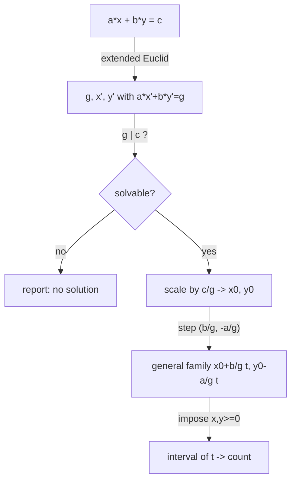

# Linear Diophantine Equations — Junior Level

> **One-line summary:** The equation `a*x + b*y = c` has an integer solution **if and only if** `g = gcd(a, b)` divides `c`. When it does, the extended Euclidean algorithm gives one solution by scaling the Bezout coefficients, and *all* solutions follow the family `x = x0 + (b/g)·t`, `y = y0 − (a/g)·t` for every integer `t`.

---

## Table of Contents

1. [Introduction](#introduction)
2. [Prerequisites](#prerequisites)
3. [Glossary](#glossary)
4. [Core Concepts](#core-concepts)
5. [Big-O Summary](#big-o-summary)
6. [Real-World Analogies](#real-world-analogies)
7. [Pros & Cons](#pros--cons)
8. [Step-by-Step Walkthrough](#step-by-step-walkthrough)
9. [Code Examples](#code-examples)
10. [Coding Patterns](#coding-patterns)
11. [Error Handling](#error-handling)
12. [Performance Tips](#performance-tips)
13. [Best Practices](#best-practices)
14. [Edge Cases & Pitfalls](#edge-cases--pitfalls)
15. [Common Mistakes](#common-mistakes)
16. [Cheat Sheet](#cheat-sheet)
17. [Visual Animation](#visual-animation)
18. [Summary](#summary)
19. [Further Reading](#further-reading)

---

## Introduction

Suppose you have two kinds of coins worth `a` and `b` units, and you owe exactly `c` units. You may *give* coins or *receive* them as change (so counts can be negative). The question "can I make exactly `c`, and in how many ways?" is the question *"does `a*x + b*y = c` have integer solutions, and what are they?"* This is a **linear Diophantine equation**: a linear equation where we only accept **integer** answers.

The word *Diophantine* honors Diophantus of Alexandria, who studied equations whose solutions must be whole numbers. The two-variable linear case `a*x + b*y = c` is the cleanest and most useful one, and it is solved completely by one classical fact:

> **`a*x + b*y = c` has an integer solution if and only if `gcd(a, b)` divides `c`.**

That is the **solvability condition**. Once you know a solution exists, the **extended Euclidean algorithm** does the heavy lifting: it computes `g = gcd(a, b)` *and* two integers `x'`, `y'` (the **Bezout coefficients**) with

```
a*x' + b*y' = g.
```

Because `g | c`, you can scale that identity by `c/g`:

```
a*(x' · c/g) + b*(y' · c/g) = c,
```

so `x0 = x' · c/g`, `y0 = y' · c/g` is **one** particular solution. The final piece is that solutions never come alone: from any single solution you slide along a line to get infinitely many, stepping by `(b/g, −a/g)`:

```
x = x0 + (b/g)·t,   y = y0 − (a/g)·t,   for every integer t.
```

These three ideas — the **solvability condition**, finding **one solution** via extended Euclid, and the **general-solution family** — are the entire story for two variables, and they power applications from the Chinese Remainder Theorem to scheduling, water-jug puzzles, and counting lattice points on a line. This file builds the whole pipeline `solve(a, b, c)` step by step.

---

## Prerequisites

Before reading this file you should be comfortable with:

- **Greatest common divisor (`gcd`)** — `gcd(a, b)` is the largest integer dividing both. See sibling `01-gcd-lcm`.
- **The Euclidean algorithm** — `gcd(a, b) = gcd(b, a mod b)`, repeated until the remainder is 0.
- **The extended Euclidean algorithm** — returns `g, x, y` with `a*x + b*y = g`. See sibling `06-extended-euclidean-modular-inverse`.
- **Divisibility** — "`g` divides `c`" (written `g | c`) means `c mod g == 0`.
- **Integer division** — `b/g` here always means *exact* division because `g` divides both `a` and `b`.
- **Big-O notation** — the cost is the cost of one gcd, `O(log min(a, b))`.

Optional but helpful:

- A glance at **Bezout's identity** (the statement that `gcd(a, b)` is the smallest positive value of `a*x + b*y`).
- Familiarity with the **coordinate line** `a*x + b*y = c`, since solutions are the integer (lattice) points sitting on it.

---

## Glossary

| Term | Meaning |
|------|---------|
| **Linear Diophantine equation** | `a*x + b*y = c` where `a, b, c` are given integers and we want **integer** `x, y`. |
| **gcd `g`** | `gcd(a, b)`, the greatest common divisor; the key quantity for solvability. |
| **Solvability condition** | The equation has an integer solution **iff** `g | c` (i.e. `c mod g == 0`). |
| **Bezout coefficients** | Integers `x'`, `y'` with `a*x' + b*y' = g`, produced by extended Euclid. |
| **Particular solution `(x0, y0)`** | One specific integer solution, obtained by scaling Bezout coefficients by `c/g`. |
| **General solution** | The whole family `x = x0 + (b/g)t`, `y = y0 − (a/g)t`, one solution per integer `t`. |
| **Step vector** | The shift `(b/g, −a/g)` that moves from one solution to the next. |
| **Homogeneous equation** | `a*x + b*y = 0`; its integer solutions are exactly the multiples of the step vector. |
| **Lattice point** | A point `(x, y)` with both coordinates integers — what we are hunting on the line. |
| **Frobenius / coin problem** | Given coprime `a, b`, the largest `c` **not** expressible with non-negative `x, y` (`a*b − a − b`). |

---

## Core Concepts

### 1. The Equation and What "Solve" Means

We are given three integers `a`, `b`, `c` and want **all** integer pairs `(x, y)` with `a*x + b*y = c`. Three outcomes are possible:

- **No solution** — when `g = gcd(a, b)` does not divide `c`.
- **Infinitely many** — when `g | c` and at least one of `a, b` is non-zero.
- **Degenerate** — when `a = b = 0` (then it is solvable iff `c = 0`, but with *no* constraint linking `x` and `y`).

"Solving" normally means: report whether a solution exists, give one particular solution, and describe the whole family.

### 2. The Solvability Condition: `gcd(a, b) | c`

Every value of `a*x + b*y` is a multiple of `g = gcd(a, b)`, because `g` divides `a` and `b`, hence divides `a*x + b*y` for any integers `x, y`. So if `g` does **not** divide `c`, no integer combination can hit `c` — no solution. Conversely, Bezout's identity guarantees some `x', y'` give `a*x' + b*y' = g`; scaling by `c/g` (an integer, since `g | c`) reaches `c`. Therefore:

```
a*x + b*y = c is solvable in integers  ⇔  gcd(a, b) | c.
```

This single line decides "yes/no" before any work. Always check it first.

### 3. Finding One Solution by Scaling Bezout Coefficients

Extended Euclid gives `g, x', y'` with `a*x' + b*y' = g`. Multiply the whole identity by `c/g`:

```
a*(x' · c/g) + b*(y' · c/g) = g · (c/g) = c.
```

So a **particular solution** is:

```
x0 = x' · (c/g),   y0 = y' · (c/g).
```

That is literally all that "scale the Bezout coefficients" means: solve for `g`, then multiply by `c/g`.

### 4. The General Solution Family

Once you have `(x0, y0)`, every other solution is `(x0 + (b/g)t, y0 − (a/g)t)`. Why does it stay a solution and why are these *all* of them?

- **Still a solution:** `a·(x0 + (b/g)t) + b·(y0 − (a/g)t) = (a x0 + b y0) + t·(a·b/g − b·a/g) = c + 0 = c`. The `t` terms cancel exactly.
- **All of them:** if `(x, y)` is any solution, subtract: `a(x − x0) + b(y − y0) = 0`. Dividing by `g`, `(a/g)(x − x0) = −(b/g)(y − y0)`. Since `a/g` and `b/g` are **coprime**, `b/g` must divide `(x − x0)`, forcing `x − x0 = (b/g)t` for some integer `t`, and then `y − y0 = −(a/g)t`.

So the step vector `(b/g, −a/g)` generates the *entire* solution set. We divide by `g` so the step is as **small** as possible — using `(b, −a)` would skip solutions.

### 5. Constrained Solutions and Counting

Real problems rarely want *all* solutions; they want ones obeying limits — most commonly `x ≥ 0` and `y ≥ 0`, or `x, y` inside given ranges. Because `x` and `y` are *linear* in `t`, each constraint becomes a bound on `t`:

```
x = x0 + (b/g)t ≥ 0   ⇒   a bound on t (direction depends on sign of b/g)
y = y0 − (a/g)t ≥ 0   ⇒   another bound on t
```

Intersect the two `t`-intervals; the number of integers `t` in the overlap is the **count of constrained solutions**. This "turn constraints into a `t`-interval, then count integers in it" idea is the workhorse for the middle-level material and the famous coin/Frobenius questions.

### 6. The Step Vector Solves the Homogeneous Equation

The companion equation `a*x + b*y = 0` (right-hand side zero) is called **homogeneous**. Its integer solutions are exactly the multiples of `(b/g, −a/g)`. So the full picture is: *general solution = one particular solution + any homogeneous solution.* This "particular + homogeneous" pattern is the same structure you meet later in linear algebra and differential equations.

---

## Big-O Summary

| Operation | Time | Space | Notes |
|-----------|------|-------|-------|
| `gcd(a, b)` (Euclid) | **O(log min(a, b))** | O(1) iterative | Number of steps is logarithmic. |
| Extended Euclid (`g, x', y'`) | **O(log min(a, b))** | O(1) iterative / O(log) recursive | Same loop, tracks coefficients. |
| Solvability check `g | c` | O(1) | — | One modulo after gcd. |
| One particular solution | O(1) | O(1) | Two multiplications by `c/g`. |
| Describe general family | O(1) | O(1) | Just store `x0, y0, b/g, a/g`. |
| Count non-negative solutions | O(1) | O(1) | Intersect two `t`-bounds; no loop. |
| Enumerate all `m` constrained solutions | O(m) | O(1) | Only if you must list them. |

The headline cost is a **single gcd**, `O(log min(a, b))`. Everything else — building one solution, the family, and *counting* constrained solutions — is `O(1)` arithmetic. Listing solutions costs `O(m)` only because there are `m` of them to print.

---

## Real-World Analogies

| Concept | Analogy |
|---------|---------|
| `a*x + b*y = c` | Paying `c` cents using `a`-cent and `b`-cent operations, where giving change counts as negative. |
| `gcd(a, b) | c` solvability | A vending machine with 6-cent and 9-cent buttons can only ever total multiples of `gcd(6,9)=3` — you can never make 7. |
| Particular solution | One concrete recipe that works ("hand over 2 of these, take back 1 of those"). |
| Step vector `(b/g, −a/g)` | A swap that leaves the total unchanged: add `b/g` of the first while removing `a/g` of the second. |
| Constraining `x, y ≥ 0` | "No giving change" — you may only *hand over* coins, never take any back. |
| Counting solutions in a range | Counting how many valid recipes fit within how many coins of each kind you actually own. |
| Frobenius number | The largest bill you simply *cannot* pay with only 6s and 9s (here, 21) when no change is allowed. |

Where the analogy breaks: coins are physical and finite, but the pure equation lets `x, y` roam over *all* integers. Constraints (non-negativity, ranges) are exactly how we bring the finite, physical world back in.

---

## Pros & Cons

| Pros | Cons |
|------|------|
| Complete theory: solvability, one solution, and *all* solutions in closed form. | Only the **two-variable linear** case is this clean; multi-variable needs recursion. |
| Solvability is a one-line gcd check, `O(log)`. | Easy to forget the `g | c` test and divide by zero or produce a wrong scale. |
| Counting constrained solutions is `O(1)` (interval of `t`), no enumeration. | Off-by-one and sign errors when turning constraints into `t`-bounds are common. |
| Reuses extended Euclid you already have for modular inverses. | Naively multiplying `x' · c/g` can **overflow** for big inputs (see senior level). |
| Underpins CRT, scheduling, lattice counting, water-jug puzzles. | Counting *non-negative* solutions (Frobenius) gets subtle for 3+ coin values. |
| Tiny code — extended Euclid plus a scale and two bounds. | Degenerate cases (`a = 0`, `b = 0`, or both) need explicit handling. |

**When to use:** any "express `c` as `a·x + b·y`" question, modular equations `a·x ≡ c (mod m)` (which are `a·x + m·y = c`), CRT merges, lattice points on a line, simple two-resource scheduling.

**When NOT to use:** non-linear Diophantine equations (Pell, sums of squares — different theory), problems where `x, y` must be reals (that is just a line, infinitely many trivially), or systems better handled directly by CRT primitives.

---

## Step-by-Step Walkthrough

Solve `6x + 9y = 21`, then list the non-negative solutions.

**Step 1 — Compute `g = gcd(6, 9)`.**

```
gcd(6, 9) = gcd(9, 6) = gcd(6, 3) = gcd(3, 0) = 3.
```

So `g = 3`.

**Step 2 — Check solvability `g | c`.** Is `3 | 21`? Yes, `21 / 3 = 7`. A solution exists. (Had `c` been 22, `3 ∤ 22`, and we would stop here with "no solution".)

**Step 3 — Extended Euclid for Bezout coefficients of `g = 3`.** We need `6x' + 9y' = 3`. One answer: `x' = −1`, `y' = 1`, since `6·(−1) + 9·1 = −6 + 9 = 3`. ✓

**Step 4 — Scale by `c/g = 21/3 = 7` to get a particular solution.**

```
x0 = x' · 7 = −1 · 7 = −7
y0 = y' · 7 =  1 · 7 =  7
```

Check: `6·(−7) + 9·7 = −42 + 63 = 21`. ✓

**Step 5 — Write the general family.** The step vector is `(b/g, −a/g) = (9/3, −6/3) = (3, −2)`:

```
x = −7 + 3t
y =  7 − 2t      for every integer t.
```

**Step 6 — Impose `x ≥ 0` and `y ≥ 0`, turning each into a bound on `t`.**

```
x ≥ 0:  −7 + 3t ≥ 0  ⇒  t ≥ 7/3  ⇒  t ≥ 3   (smallest integer ≥ 2.33)
y ≥ 0:   7 − 2t ≥ 0  ⇒  t ≤ 7/2  ⇒  t ≤ 3   (largest integer ≤ 3.5)
```

The overlap is `t = 3` only — **one** non-negative solution.

**Step 7 — Read it off.** At `t = 3`: `x = −7 + 9 = 2`, `y = 7 − 6 = 1`. Check: `6·2 + 9·1 = 12 + 9 = 21`. ✓ So the unique non-negative solution is `(2, 1)`: two 6s and one 9 make 21.

Each step turned a piece of the theory into one arithmetic operation: gcd, a divisibility test, extended Euclid, a scale, a family, two bounds, and a count.

---

## Code Examples

### Example: Solve `a*x + b*y = c` over the Integers

This computes `g = gcd(a, b)` with extended Euclid, checks `g | c`, scales the Bezout coefficients to a particular `(x0, y0)`, and prints the general family.

#### Go

```go
package main

import "fmt"

// extGCD returns (g, x, y) with a*x + b*y = g = gcd(a, b).
func extGCD(a, b int64) (int64, int64, int64) {
	if b == 0 {
		return a, 1, 0
	}
	g, x1, y1 := extGCD(b, a%b)
	return g, y1, x1 - (a/b)*y1
}

// solve reports whether a*x+b*y=c is solvable and a particular (x0, y0).
func solve(a, b, c int64) (bool, int64, int64, int64) {
	g, x1, y1 := extGCD(a, b)
	if g == 0 { // a == b == 0
		return c == 0, 0, 0, 0
	}
	if c%g != 0 {
		return false, 0, 0, 0 // gcd(a,b) does not divide c
	}
	scale := c / g
	return true, x1 * scale, y1 * scale, g
}

func main() {
	a, b, c := int64(6), int64(9), int64(21)
	ok, x0, y0, g := solve(a, b, c)
	if !ok {
		fmt.Println("no integer solution")
		return
	}
	fmt.Printf("particular: x0=%d y0=%d (check %d)\n", x0, y0, a*x0+b*y0)
	fmt.Printf("general: x = %d + %d*t, y = %d - %d*t\n", x0, b/g, y0, a/g)
}
```

#### Java

```java
public class LinearDiophantine {
    // returns {g, x, y} with a*x + b*y = g = gcd(a, b)
    static long[] extGCD(long a, long b) {
        if (b == 0) return new long[]{a, 1, 0};
        long[] r = extGCD(b, a % b);
        return new long[]{r[0], r[2], r[1] - (a / b) * r[2]};
    }

    // returns {ok(1/0), x0, y0, g}
    static long[] solve(long a, long b, long c) {
        long[] e = extGCD(a, b);
        long g = e[0];
        if (g == 0) return new long[]{c == 0 ? 1 : 0, 0, 0, 0};
        if (c % g != 0) return new long[]{0, 0, 0, 0};
        long scale = c / g;
        return new long[]{1, e[1] * scale, e[2] * scale, g};
    }

    public static void main(String[] args) {
        long a = 6, b = 9, c = 21;
        long[] s = solve(a, b, c);
        if (s[0] == 0) { System.out.println("no integer solution"); return; }
        long x0 = s[1], y0 = s[2], g = s[3];
        System.out.printf("particular: x0=%d y0=%d (check %d)%n", x0, y0, a * x0 + b * y0);
        System.out.printf("general: x = %d + %d*t, y = %d - %d*t%n", x0, b / g, y0, a / g);
    }
}
```

#### Python

```python
def ext_gcd(a, b):
    """Return (g, x, y) with a*x + b*y = g = gcd(a, b)."""
    if b == 0:
        return a, 1, 0
    g, x1, y1 = ext_gcd(b, a % b)
    return g, y1, x1 - (a // b) * y1


def solve(a, b, c):
    """Return (ok, x0, y0, g) for a*x + b*y = c."""
    g, x1, y1 = ext_gcd(a, b)
    if g == 0:                       # a == b == 0
        return (c == 0, 0, 0, 0)
    if c % g != 0:                   # gcd(a,b) does not divide c
        return (False, 0, 0, 0)
    scale = c // g
    return (True, x1 * scale, y1 * scale, g)


if __name__ == "__main__":
    a, b, c = 6, 9, 21
    ok, x0, y0, g = solve(a, b, c)
    if not ok:
        print("no integer solution")
    else:
        print(f"particular: x0={x0} y0={y0} (check {a*x0 + b*y0})")
        print(f"general: x = {x0} + {b//g}*t, y = {y0} - {a//g}*t")
```

**What it does:** solves `6x + 9y = 21`, prints a particular solution and the general family `x = −7 + 3t, y = 7 − 2t`.
**Run:** `go run main.go` | `javac LinearDiophantine.java && java LinearDiophantine` | `python diophantine.py`

---

## Coding Patterns

### Pattern 1: Brute-Force Solver (the oracle you test against)

**Intent:** Before trusting the gcd machinery, find a solution the slow, obvious way over a small range and check it agrees.

```python
def solve_bruteforce(a, b, c, lo=-50, hi=50):
    for x in range(lo, hi + 1):
        for y in range(lo, hi + 1):
            if a * x + b * y == c:
                return (x, y)
    return None
```

This is `O(R²)` over a search box of side `R`. Useless for large inputs but a perfect correctness oracle: the extended-Euclid solution, reduced into the same box via the step vector, must match.

### Pattern 2: Count Non-Negative Solutions Without Enumerating

**Intent:** "How many `(x, y)` with `x ≥ 0`, `y ≥ 0`?" Turn each non-negativity into a bound on `t` and count integers in the overlap.

```python
import math

def count_nonneg(a, b, c):
    g, x1, y1 = ext_gcd(abs(a), abs(b))
    if a < 0: x1 = -x1
    if b < 0: y1 = -y1
    if c % g != 0:
        return 0
    x0, y0 = x1 * (c // g), y1 * (c // g)
    dx, dy = b // g, a // g        # x += dx*t, y -= dy*t
    # x0 + dx*t >= 0  and  y0 - dy*t >= 0  -> interval of t
    lo = -math.inf
    hi = math.inf
    if dx > 0: lo = max(lo, math.ceil(-x0 / dx))
    elif dx < 0: hi = min(hi, math.floor(-x0 / dx))
    elif x0 < 0: return 0
    if dy > 0: hi = min(hi, math.floor(y0 / dy))
    elif dy < 0: lo = max(lo, math.ceil(y0 / dy))
    elif y0 < 0: return 0
    return max(0, int(hi) - int(lo) + 1) if lo <= hi else 0
```

The whole count is two ceilings, two floors, and a subtraction — `O(1)` after the gcd.

### Pattern 3: Smallest Positive `x`

**Intent:** Find the solution with the *least* `x > 0` (common in CRT and scheduling). Reduce `x0` modulo the step `b/g`:

```python
def smallest_positive_x(a, b, c):
    g, x1, _ = ext_gcd(a, b)
    if c % g != 0:
        return None
    step = b // g
    x0 = (x1 * (c // g)) % step
    if x0 <= 0:
        x0 += step                 # force into (0, step]
    y = (c - a * x0) // b
    return (x0, y)
```



---

## Error Handling

| Error | Cause | Fix |
|-------|-------|-----|
| Reports a solution that fails the check | Skipped the `g | c` test before scaling. | Always test `c % g == 0` first; return "no solution" otherwise. |
| Division by zero in `b/g` or `a/g` | `a = b = 0` (so `g = 0`). | Special-case `a == b == 0`: solvable iff `c == 0`, otherwise not. |
| Wrong step size (skips solutions) | Stepped by `(b, −a)` instead of `(b/g, −a/g)`. | Always divide the step by `g`. |
| Off-by-one in the count | Used `<`/`>` where `≤`/`≥` was needed, or floored/ceiled wrong. | `x ≥ 0` is `≥`; use `ceil` for lower bounds, `floor` for upper. |
| Overflow in `x' · (c/g)` | Big coefficients before scaling. | Use 64-bit (`int64`/`long`); reduce mod the step when only `x` mod something is needed. See senior. |
| Negative remainder confusion | Language `%` can return negatives. | Normalize: `((r % m) + m) % m` when you need a value in `[0, m)`. |

---

## Performance Tips

- **One gcd is the whole cost.** Don't loop to search for a solution; extended Euclid hands it to you in `O(log)`.
- **Never enumerate to count.** Translate `x ≥ 0`, `y ≥ 0` (or any range) into a `t`-interval and count integers with `hi − lo + 1`. Enumeration is only for *printing* solutions.
- **Take absolute values up front** for the gcd, then fix the signs of the Bezout coefficients; it removes a swarm of sign bugs.
- **Reduce `x0` modulo `b/g`** when you only need the smallest positive `x`; this keeps numbers tiny and avoids overflow.
- **Avoid floating point** for the bounds when you can use integer `ceil`/`floor` via floored division; it sidesteps rounding error on large inputs.

---

## Best Practices

- Always run the **solvability check first** — it is one modulo and saves you from dividing by `g` in a meaningless case.
- Keep extended Euclid as a small, separately tested function returning `(g, x, y)`; most bugs hide there.
- Verify a particular solution by plugging back in: assert `a*x0 + b*y0 == c` before returning.
- Store the family as four numbers `(x0, y0, b/g, a/g)` so callers can generate any solution by choosing `t`.
- Document sign conventions for negative `a` or `b`; decide once whether the step is `(b/g, −a/g)` with signed `a, b` and stick to it.
- Test against the brute-force oracle (Pattern 1) on random small `a, b, c` before trusting the closed form.

---

## Edge Cases & Pitfalls

- **`c = 0`** — always solvable; `(0, 0)` works, and the family is the homogeneous solutions `(b/g)t, −(a/g)t`.
- **`a = 0`, `b ≠ 0`** — reduces to `b*y = c`: solvable iff `b | c`, with `x` free (any integer) and `y = c/b`.
- **`b = 0`, `a ≠ 0`** — symmetric: solvable iff `a | c`, `y` free, `x = c/a`.
- **`a = b = 0`** — solvable iff `c = 0`, and then *every* `(x, y)` works (no link between them); otherwise no solution.
- **Negative `a` or `b`** — fine; take absolute values for the gcd and adjust coefficient signs. The step vector keeps the same `(b/g, −a/g)` form with signed `a, b`.
- **Negative `c`** — fine; scaling by `c/g` simply makes `c/g` negative.
- **`g | c` fails** — there is genuinely **no** integer solution; do not "round" — report none.

---

## Common Mistakes

1. **Forgetting the `g | c` check** and producing a bogus solution from scaling.
2. **Stepping by `(b, −a)` instead of `(b/g, −a/g)`** — this skips every solution between, undercounting by a factor of `g`.
3. **Dividing by zero** when `a = b = 0` because `g = 0`; that degenerate case must be handled before any `b/g`.
4. **Sign mistakes with negative `a`/`b`**, especially the direction of the `t`-bound (`≥` flips to `≤` when the coefficient is negative).
5. **Off-by-one in the count** — using `floor`/`ceil` incorrectly or `<` instead of `≤`.
6. **Overflow** when forming `x' · (c/g)` for large inputs; not promoting to 64-bit.
7. **Confusing "any solution exists" with "a non-negative solution exists"** — solvability over all integers does not imply a solution with `x, y ≥ 0` (that is the Frobenius question).

---

## Cheat Sheet

| Question | Tool | Formula |
|----------|------|---------|
| Does `a*x + b*y = c` have a solution? | gcd | solvable iff `gcd(a,b) | c` |
| One solution | extended Euclid + scale | `x0 = x'·c/g`, `y0 = y'·c/g` |
| All solutions | step vector | `x = x0 + (b/g)t`, `y = y0 − (a/g)t` |
| Homogeneous solutions (`c = 0`) | step vector | `(b/g)t, −(a/g)t` |
| Count with `x, y ≥ 0` | `t`-interval | `# integers t with both bounds` |
| Smallest positive `x` | reduce mod step | `x0 = (x'·c/g) mod (b/g)`, fix to `(0, b/g]` |
| Largest `c` not non-neg representable (coprime `a,b`) | Frobenius | `a·b − a − b` |

Core algorithm:

```
solve(a, b, c):
    (g, x', y') = extGCD(a, b)          # a*x' + b*y' = g
    if a == 0 and b == 0: return (c == 0)   # degenerate
    if c % g != 0: return NO_SOLUTION       # solvability
    x0 = x' * (c / g);  y0 = y' * (c / g)   # particular
    return x0, y0, step=(b/g, -a/g)         # family
# cost: O(log min(a, b))
```

---

## Visual Animation

> See [`animation.html`](./animation.html) for an interactive visualization.
>
> The animation demonstrates:
> - The line `a*x + b*y = c` drawn on the integer lattice with editable `a`, `b`, `c`
> - The particular solution `(x0, y0)` highlighted, then stepping by `(b/g, −a/g)` to neighbouring solutions
> - Non-negative (constrained) solutions glowing in the first quadrant
> - Play / Pause / Step controls to watch the solution slide along the line one step at a time

---

## Summary

A linear Diophantine equation `a*x + b*y = c` is solved by three facts that fit on a postcard. **Solvability:** an integer solution exists iff `gcd(a, b) | c`. **One solution:** run extended Euclid to get `a*x' + b*y' = g`, then scale by `c/g` to land `x0 = x'·c/g`, `y0 = y'·c/g`. **All solutions:** slide along the line by the step vector `(b/g, −a/g)`, giving `x = x0 + (b/g)t`, `y = y0 − (a/g)t`. Constraints like `x, y ≥ 0` become bounds on `t`, and *counting* the valid solutions is just counting integers in an interval — `O(1)` after one gcd. Master extended Euclid plus the scale-and-step pattern and you can answer existence, construction, and counting questions for any two-variable linear Diophantine equation.

---

## Further Reading

- *Elementary Number Theory* (Burton) — Bezout's identity and linear Diophantine equations.
- Sibling topic `01-gcd-lcm` — the Euclidean algorithm and gcd properties.
- Sibling topic `06-extended-euclidean-modular-inverse` — the extended algorithm that produces Bezout coefficients.
- Sibling topic `05-crt` — the Chinese Remainder Theorem, which merges congruences via the same machinery.
- cp-algorithms.com — "Linear Diophantine Equation" and "Extended Euclidean Algorithm".
- *Concrete Mathematics* (Graham, Knuth, Patashnik) — the coin/Frobenius problem and lattice-point counting.
