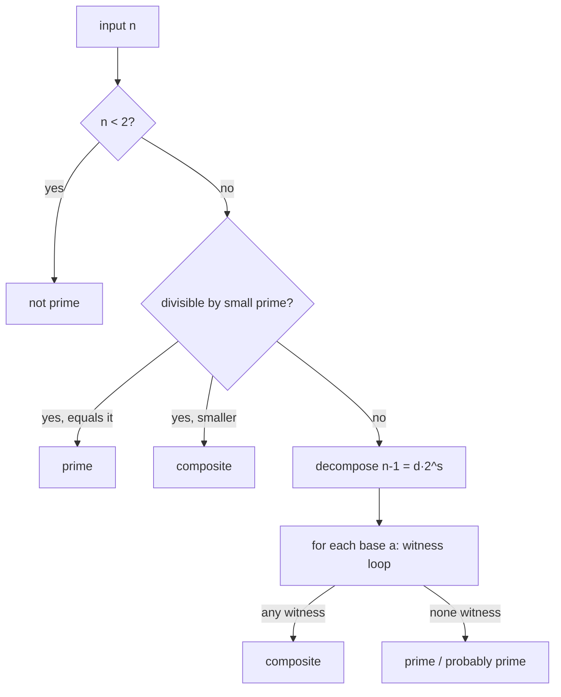

# Miller-Rabin Primality Testing — Junior Level

> **One-line summary:** To decide whether a number `n` is prime, pick a random base `a`, write `n-1 = d·2^s`, and check whether `a^d ≡ 1` or one of `a^d, a^(2d), a^(4d), …, a^(2^(s-1)·d)` is `≡ -1 (mod n)`. If neither happens, `a` is a **witness** that `n` is composite. A few bases make the test extremely reliable, and for 64-bit numbers a fixed list of bases makes it **provably exact**.

---

## Table of Contents

1. [Introduction](#introduction)
2. [Prerequisites](#prerequisites)
3. [Glossary](#glossary)
4. [Core Concepts](#core-concepts)
5. [Big-O Summary](#big-o-summary)
6. [Real-World Analogies](#real-world-analogies)
7. [Pros & Cons](#pros--cons)
8. [Step-by-Step Walkthrough](#step-by-step-walkthrough)
9. [Code Examples](#code-examples)
10. [Coding Patterns](#coding-patterns)
11. [Error Handling](#error-handling)
12. [Performance Tips](#performance-tips)
13. [Best Practices](#best-practices)
14. [Edge Cases & Pitfalls](#edge-cases--pitfalls)
15. [Common Mistakes](#common-mistakes)
16. [Cheat Sheet](#cheat-sheet)
17. [Visual Animation](#visual-animation)
18. [Summary](#summary)
19. [Further Reading](#further-reading)

---

## Introduction

Suppose someone hands you a number like `n = 561` or `n = 2_147_483_647` and asks: *"Is this a prime number?"* The most obvious method is **trial division** — try every divisor from `2` up to `√n` and see if any of them divides `n` evenly. That works, but it costs about `√n` divisions. For a number near `10^18`, `√n` is about `10^9` — a billion divisions per query — far too slow when you need to test many numbers or work with the large primes used in cryptography.

There is a much faster idea built on a fact every prime obeys but most composites do not. It starts with **Fermat's Little Theorem**:

> If `n` is prime and `a` is not a multiple of `n`, then `a^(n-1) ≡ 1 (mod n)`.

So you could pick a base `a`, compute `a^(n-1) mod n` (cheaply, with fast exponentiation), and if the result is **not** `1`, you have *proof* that `n` is composite. That is the **Fermat primality test**. It is fast, but it has a fatal weakness: certain composite numbers — called **Carmichael numbers**, the smallest being `561` — pass the Fermat test for *every* base coprime to them. They masquerade as primes forever.

**Miller-Rabin** fixes this. It strengthens the Fermat check by also looking at **square roots of 1**. The key fact:

> **Modulo a prime, the only square roots of `1` are `+1` and `-1`.**

Miller-Rabin writes `n - 1 = d · 2^s` (pull out all the factors of 2), computes `x = a^d (mod n)`, and then squares it `s` times, watching the sequence `a^d, a^(2d), a^(4d), …`. Along the way it must reach `1`, and the step *just before* it first becomes `1` must be `-1`. If at some squaring the value jumps to `1` from something that is **not** `±1`, we have found a **nontrivial square root of 1** — something that *cannot* happen modulo a prime — so `n` is definitely composite and `a` is a **witness**.

This single extra check destroys the Carmichael loophole. Even better, the math guarantees that for a random base, a composite `n` is caught with probability **at least 3/4**. Run `k` independent random bases and the chance of a composite slipping through is at most `(1/4)^k`. And for numbers up to `2^64`, mathematicians have found *small fixed sets of bases* (like `{2, 3, 5, 7, 11, 13, 17, 19, 23, 29, 31, 37}`) that make the test **100% deterministic** — never wrong. This file builds that whole picture, with the **Fermat test → Miller-Rabin witness** idea as its spine.

---

## Prerequisites

Before reading this file you should be comfortable with:

- **Modular arithmetic** — `(a + b) mod n`, `(a · b) mod n`, and why remainders keep numbers small.
- **Modular exponentiation (fast power)** — computing `a^e mod n` in `O(log e)` by squaring. (Covered for scalars in sibling `10-matrix-exponentiation` and the binary-exponentiation note.)
- **Even/odd and powers of two** — factoring `n - 1` as `d · 2^s` with `d` odd.
- **Prime vs composite** — a prime has exactly two divisors (`1` and itself); a composite has more.
- **Big-O notation** — `O(√n)`, `O(log n)`, `O(k log³ n)`.
- **64-bit integers and overflow** — why `a * b` can exceed the range of a 64-bit integer.

Optional but helpful:

- A glance at **Fermat's Little Theorem** and a few small primes worked by hand.
- Familiarity with **probabilistic vs deterministic** algorithms (a test that is "usually right" vs "always right").

---

## Glossary

| Term | Meaning |
|------|---------|
| **Prime** | An integer `n > 1` whose only positive divisors are `1` and `n`. |
| **Composite** | An integer `n > 1` that is not prime (has a divisor strictly between `1` and `n`). |
| **Trial division** | Testing divisibility by every candidate up to `√n`; simple but `O(√n)`. |
| **Fermat's Little Theorem** | For prime `n` and `gcd(a, n) = 1`, `a^(n-1) ≡ 1 (mod n)`. |
| **Fermat test** | Check `a^(n-1) ≡ 1 (mod n)`; if not, `n` is composite. Fooled by Carmichael numbers. |
| **Carmichael number** | A composite `n` that passes the Fermat test for *every* base coprime to it (e.g. `561, 1105, 1729`). |
| **`n - 1 = d · 2^s`** | The decomposition with `d` **odd** and `s ≥ 1`; the backbone of Miller-Rabin. |
| **Witness** | A base `a` whose Miller-Rabin check **proves** `n` is composite. |
| **Strong probable prime** | An `n` that *passes* Miller-Rabin for base `a` (no witness found yet). |
| **Nontrivial square root of 1** | A value `x ≠ ±1` with `x² ≡ 1 (mod n)`; its existence proves `n` is composite. |
| **mulmod** | Multiplication modulo `n` done so that the intermediate `a·b` never overflows. |

---

## Core Concepts

### 1. Trial Division — the slow baseline

The obvious primality test divides `n` by `2, 3, 4, …, ⌊√n⌋`. If none divide evenly, `n` is prime. Correct, but `O(√n)`. For `n ≈ 10^18` that is a billion operations — far too slow when you have many queries or need cryptographic-size numbers. We want something `polylogarithmic` in `n`.

### 2. Fermat's Little Theorem and the Fermat Test

For a prime `n` and any `a` with `1 ≤ a ≤ n-1`, Fermat's Little Theorem says `a^(n-1) ≡ 1 (mod n)`. The **Fermat test** flips this around: compute `a^(n-1) mod n`; if it is **not** `1`, then `n` cannot be prime — `a` is a "Fermat witness." This is fast (`O(log n)` via fast power). The danger is the converse: many composites *also* satisfy `a^(n-1) ≡ 1` for some bases (a "Fermat liar").

### 3. The Carmichael Weakness

A **Carmichael number** is a composite `n` for which `a^(n-1) ≡ 1 (mod n)` holds for *every* `a` coprime to `n`. The smallest is `561 = 3 · 11 · 17`. No matter which coprime base you try, the Fermat test says "probably prime" — forever. Carmichael numbers are infinitely many. So the plain Fermat test can be fooled with no escape. Miller-Rabin exists precisely to close this hole.

### 4. The Square-Root-of-1 Insight

Modulo a **prime** `p`, the equation `x² ≡ 1 (mod p)` has exactly two solutions: `x ≡ 1` and `x ≡ -1` (which is `p-1`). The reason: `x² - 1 = (x-1)(x+1)`, and a prime modulus means if `p` divides the product it divides one of the factors, forcing `x ≡ ±1`. For a **composite** `n`, there can be *extra* square roots of 1 — "nontrivial" ones. Finding one is a certificate that `n` is composite. (Full proof in [`professional.md`](./professional.md).)

### 5. Writing `n - 1 = d · 2^s`

Because `n` (when odd and > 2) makes `n - 1` even, we factor out all the 2s:

```
n - 1 = d · 2^s     with d odd, s ≥ 1
```

Example: `n = 561`, `n - 1 = 560 = 35 · 16 = 35 · 2^4`, so `d = 35`, `s = 4`.

Now `a^(n-1) = a^(d·2^s) = ((a^d)^2)^2 … ` — we get there from `a^d` by squaring `s` times. The Fermat test only looks at the **end** of this squaring chain; Miller-Rabin watches **every step**.

### 6. The Witness Loop

Given base `a`, compute `x = a^d (mod n)`. There are two ways `n` can "pass" for this base:

- `x ≡ 1 (mod n)` right away, **or**
- one of the values `x, x², x⁴, …, x^(2^(s-1))` (i.e. `a^d, a^(2d), …, a^(2^(s-1)d)`) is `≡ -1 (mod n)`.

If we square `x` up to `s-1` times and **never** see `-1`, and it was not `1` to begin with, then `a` is a **witness** and `n` is composite. (Seeing the value become `1` *without* a preceding `-1` means we just hit a nontrivial square root of 1 — composite!)

### 7. Probabilistic Guarantee and Determinism

For a composite `n`, **at least 3/4 of the bases** in `[2, n-2]` are witnesses (Rabin's theorem). So a single random base catches a composite with probability `≥ 3/4`, and `k` random bases reduce the miss probability to `≤ (1/4)^k`. For `n < 2^64`, fixed small base sets are *proven* to catch every composite, giving a **deterministic** test (Section on best practices and `professional.md`).

---

## Big-O Summary

| Operation | Time | Space | Notes |
|-----------|------|-------|-------|
| Trial division | **O(√n)** | O(1) | Far too slow for big `n`. |
| One modular exponentiation `a^e mod n` | O(log n) | O(1) | Via fast power (`log e ≤ log n`). |
| One Miller-Rabin base test | **O(log³ n)** | O(1) | `log n` squarings × `O(log² n)` per mulmod (schoolbook), or `O(log² n)` with hardware `__int128`. |
| Miller-Rabin, `k` bases | **O(k log³ n)** | O(1) | Probabilistic; error `≤ (1/4)^k`. |
| Deterministic MR for `n < 2^64` | O(log³ n) | O(1) | 12 fixed bases (or 7) — provably exact. |
| Deterministic AKS | O(log⁶⁺ n) | poly(log n) | Polynomial but slow in practice. |

The headline cost per base is `O(log² n)` *modular multiplications*, and there are `O(log n)` of them, so roughly `O(log³ n)` bit operations per base with schoolbook multiplication. With a fixed handful of bases, testing a 64-bit number is a few dozen modular multiplications — microseconds.

---

## Real-World Analogies

| Concept | Analogy |
|---------|---------|
| Trial division | Checking every key on a giant keyring one by one to see which opens the lock — guaranteed but exhausting. |
| Fermat test | A quick "does this badge scan?" check at the door. Fast, but a clever forger (Carmichael number) made a badge that always scans. |
| Carmichael number | A counterfeit ID that passes every *simple* scanner, no matter which scanner model you use. |
| Miller-Rabin's extra check | A second guard who also checks the hologram (the square-root-of-1 step) — the forgery the simple scanner missed now gets caught. |
| Witness | The specific guard/test that catches the fake. At least 3 out of 4 guards will catch any forgery. |
| Multiple random bases | Sending the suspect past several independent guards; the chance *all* are fooled shrinks geometrically. |
| Deterministic base set | A known, fixed lineup of guards proven to catch every fake up to a certain size — no luck required. |

Where the analogy breaks: a real guard might catch a fake by accident, but Miller-Rabin's witness is a *mathematical proof* of compositeness — when it says "composite," it is never wrong.

---

## Pros & Cons

| Pros | Cons |
|------|------|
| Extremely fast: `O(k log³ n)` vs `O(√n)` for trial division. | The probabilistic version can (rarely) call a composite "prime" — needs enough bases. |
| Fixing the base set makes it **deterministic and exact** for all `n < 2^64`. | "Composite" is certain, but "prime" is only certain with the right (proven) base set. |
| When it reports "composite," that is a **proof** (a witness), never a false alarm. | Requires careful **overflow-safe mulmod** (`__int128` / Montgomery) for 64-bit `n`. |
| Tiny, uniform code: a fast-power loop plus a witness loop. | Does not produce a factor — only a yes/no answer. |
| Powers cryptographic prime generation (find big primes by random-test-retry). | Subtle bugs (forgetting the `-1` check, wrong `d/s`) silently break correctness. |

**When to use:** testing whether a number is prime quickly, especially for many queries or large (cryptographic) numbers; generating big random primes; as a fast pre-filter before heavier checks.

**When NOT to use:** when you actually need the **factorization** (use Pollard's rho or trial division for small factors); when `n` is tiny and trial division is simpler; when you need a *primality certificate* an outside party can re-verify cheaply (then consider ECPP/Pratt certificates).

---

## Step-by-Step Walkthrough

Let us test two numbers by hand: the Carmichael number `n = 561` (which fools Fermat) and the prime `n = 13`.

**Example A — `n = 561` with base `a = 2`.**

First decompose: `n - 1 = 560 = 35 · 16`, so `d = 35`, `s = 4`.

```
Compute x = a^d mod n = 2^35 mod 561.
  2^35 = 34359738368;  34359738368 mod 561 = 263.
x = 263.  Is x == 1? No.  Is x == 560 (-1)? No.
```

Now square up to `s-1 = 3` times, watching for `-1 (= 560)`:

```
square 1: 263^2 mod 561 = 69169 mod 561 = 166.   not 560.
square 2: 166^2 mod 561 = 27556 mod 561 = 67.    not 560.
square 3: 67^2  mod 561 = 4489  mod 561 = 1.      JUMPED to 1, but previous was 67, not 560 → nontrivial square root of 1!
```

We reached `1` from `67`, and `67 ≠ ±1`. That is a **nontrivial square root of 1**, impossible modulo a prime. So `a = 2` is a **witness**: `561` is **composite**. (Indeed `561 = 3·11·17`.) Notice the Fermat test alone would have computed `2^560 mod 561 = 1` and been fooled — Miller-Rabin's squaring chain caught it.

**Example B — `n = 13` with base `a = 2`.**

Decompose: `n - 1 = 12 = 3 · 4`, so `d = 3`, `s = 2`.

```
x = 2^3 mod 13 = 8.  Is x == 1? No.  Is x == 12 (-1)? No.
square 1: 8^2 mod 13 = 64 mod 13 = 12.  That is -1!  → passes for this base.
```

We saw `-1` in the chain, so `13` passes for base `2`. Trying more bases also passes — and since `13 < 2^64`, the deterministic base set confirms `13` is **prime**. Each base test is just one fast power plus a short squaring loop.

---

## Code Examples

### Example: Deterministic Miller-Rabin for 64-bit numbers

This tests an unsigned 64-bit `n` exactly using the proven base set `{2, 3, 5, 7, 11, 13, 17, 19, 23, 29, 31, 37}`. The `mulmod` uses a 128-bit intermediate to avoid overflow.

#### Go

```go
package main

import "fmt"

// mulMod returns a*b mod m without overflow using 128-bit intermediate.
func mulMod(a, b, m uint64) uint64 {
	// Go's math/bits gives a 128-bit product; here we use the simpler
	// big-via-uint128 emulation through the compiler's 128-bit support.
	hi, lo := bits128Mul(a, b)
	_ = hi
	return mod128(hi, lo, m)
}

// powMod returns a^e mod m using binary exponentiation.
func powMod(a, e, m uint64) uint64 {
	result := uint64(1) % m
	a %= m
	for e > 0 {
		if e&1 == 1 {
			result = mulMod(result, a, m)
		}
		a = mulMod(a, a, m)
		e >>= 1
	}
	return result
}

func isComposite(n, a uint64) bool {
	// returns true if base a is a WITNESS that n is composite
	d := n - 1
	s := 0
	for d&1 == 0 {
		d >>= 1
		s++
	}
	x := powMod(a, d, n)
	if x == 1 || x == n-1 {
		return false // passes for this base
	}
	for r := 0; r < s-1; r++ {
		x = mulMod(x, x, n)
		if x == n-1 {
			return false // saw -1, passes
		}
	}
	return true // witness: n is composite
}

func isPrime(n uint64) bool {
	if n < 2 {
		return false
	}
	for _, p := range []uint64{2, 3, 5, 7, 11, 13, 17, 19, 23, 29, 31, 37} {
		if n%p == 0 {
			return n == p
		}
	}
	for _, a := range []uint64{2, 3, 5, 7, 11, 13, 17, 19, 23, 29, 31, 37} {
		if isComposite(n, a) {
			return false
		}
	}
	return true
}

func main() {
	fmt.Println(isPrime(561))                 // false (Carmichael)
	fmt.Println(isPrime(13))                  // true
	fmt.Println(isPrime(2147483647))          // true (Mersenne prime)
	fmt.Println(isPrime(1000000000000000003)) // true
}
```

(The `bits128Mul`/`mod128` helpers stand in for the language's 128-bit multiply; see `middle.md` for a portable mulmod that needs no 128-bit type.)

#### Java

```java
import java.math.BigInteger;

public class MillerRabin {
    static final long[] BASES = {2, 3, 5, 7, 11, 13, 17, 19, 23, 29, 31, 37};

    // mulMod via BigInteger keeps it simple and overflow-free for 64-bit n.
    static long mulMod(long a, long b, long m) {
        return BigInteger.valueOf(a)
                .multiply(BigInteger.valueOf(b))
                .mod(BigInteger.valueOf(m))
                .longValue();
    }

    static long powMod(long a, long e, long m) {
        long result = 1 % m;
        a %= m;
        while (e > 0) {
            if ((e & 1) == 1) result = mulMod(result, a, m);
            a = mulMod(a, a, m);
            e >>= 1;
        }
        return result;
    }

    static boolean isComposite(long n, long a) {
        long d = n - 1;
        int s = 0;
        while ((d & 1) == 0) { d >>= 1; s++; }
        long x = powMod(a, d, n);
        if (x == 1 || x == n - 1) return false;
        for (int r = 0; r < s - 1; r++) {
            x = mulMod(x, x, n);
            if (x == n - 1) return false;
        }
        return true;
    }

    static boolean isPrime(long n) {
        if (n < 2) return false;
        for (long p : BASES) {
            if (n % p == 0) return n == p;
        }
        for (long a : BASES) {
            if (isComposite(n, a)) return false;
        }
        return true;
    }

    public static void main(String[] args) {
        System.out.println(isPrime(561));                 // false
        System.out.println(isPrime(13));                  // true
        System.out.println(isPrime(2147483647L));         // true
        System.out.println(isPrime(1000000000000000003L)); // true
    }
}
```

#### Python

```python
def is_composite(n, a, d, s):
    """Return True if base a is a WITNESS that n is composite."""
    x = pow(a, d, n)          # Python's pow does fast modular exponentiation
    if x == 1 or x == n - 1:
        return False          # passes for this base
    for _ in range(s - 1):
        x = x * x % n
        if x == n - 1:
            return False      # saw -1, passes
    return True               # witness: composite


def is_prime(n):
    if n < 2:
        return False
    bases = (2, 3, 5, 7, 11, 13, 17, 19, 23, 29, 31, 37)
    for p in bases:
        if n % p == 0:
            return n == p
    d, s = n - 1, 0
    while d % 2 == 0:
        d //= 2
        s += 1
    return all(not is_composite(n, a, d, s) for a in bases)


if __name__ == "__main__":
    print(is_prime(561))                  # False (Carmichael)
    print(is_prime(13))                   # True
    print(is_prime(2147483647))           # True
    print(is_prime(1000000000000000003))  # True
```

**What it does:** decomposes `n-1 = d·2^s`, runs the witness loop over each fixed base, and reports prime/composite. Python's built-in `pow(a, d, n)` and big-int arithmetic make overflow a non-issue; Go and Java need explicit overflow-safe `mulMod`.
**Run:** `go run main.go` | `javac MillerRabin.java && java MillerRabin` | `python mr.py`

---

## Coding Patterns

### Pattern 1: Trial-Division Oracle (test against this)

**Intent:** Before trusting Miller-Rabin, check it against the slow, obviously-correct trial division on small numbers.

```python
def is_prime_trial(n):
    if n < 2:
        return False
    i = 2
    while i * i <= n:
        if n % i == 0:
            return False
        i += 1
    return True

# Every n up to, say, 1_000_000 must agree with Miller-Rabin.
```

### Pattern 2: The `n-1 = d·2^s` Decomposition

**Intent:** Always pull out factors of 2 first; `d` ends up odd, `s` counts the squarings.

```python
def decompose(n):
    d, s = n - 1, 0
    while d % 2 == 0:
        d //= 2
        s += 1
    return d, s     # d odd, s >= 1 for odd n > 1
```

### Pattern 3: Small-Prime Pre-Filter

**Intent:** Divide out by the first few primes before any modular exponentiation; this rejects most composites instantly and also handles the bases themselves.



---

## Error Handling

| Error | Cause | Fix |
|-------|-------|-----|
| Wrong "prime" for huge `n` in Go/Java | `a * a` overflowed 64-bit before `mod`. | Use overflow-safe `mulMod` (`__int128`, BigInteger, or the doubling trick). |
| `561` reported prime | Used the Fermat test, not Miller-Rabin (missing `-1` square-root check). | Implement the full witness loop with the `x == n-1` check inside it. |
| Crash / wrong result for `n = 2` | `n - 1 = 1` makes `d = 1, s = 0`; loops misbehave. | Special-case small `n` (`< 2`, `2`, `3`) before the main loop. |
| Base `a ≥ n` gives wrong answer | `a mod n` was not reduced, or `a == 0`. | Skip bases `a ≥ n` (or reduce `a %= n` and skip if `0`); a base equal to a factor is handled by the small-prime check. |
| Even `n` mis-tested | Forgot to handle even numbers. | Return composite for even `n > 2` up front. |
| Infinite/zero loop on `s` | Off-by-one in the squaring loop bound. | Loop exactly `s-1` times after computing `a^d`. |

---

## Performance Tips

- **Pre-filter by small primes** (`2, 3, 5, 7, …`) before any modular exponentiation; most composites die here for free.
- **Use the smallest proven base set** for your range — e.g. for `n < 3,215,031,751` just `{2, 3, 5, 7}` suffices, far fewer than 12 bases.
- **Skip redundant bases:** if `a ≥ n` or `a` divides `n` (caught by the pre-filter), do not run the witness loop.
- **Reduce `a %= n` once** at the start of `powMod`, not repeatedly.
- **Pick an overflow-safe mulmod that fits your language:** `__int128` in C/C++, `math/bits.Mul64` in Go, `BigInteger` (simple) or Montgomery (fast) in Java; Python's big ints are automatic.

---

## Best Practices

- Always test your implementation against **trial division** for all `n` up to a million before trusting it on big numbers.
- For a deterministic 64-bit test, use a **published, proven** base set; do not invent your own.
- State the modulus/overflow strategy explicitly; a silent overflow is the #1 source of wrong answers.
- Special-case `n < 2`, `n = 2`, `n = 3`, and even `n` up front so the main loop only sees odd `n ≥ 5`.
- Keep `mulMod`, `powMod`, and the witness loop as small, separately tested functions.
- Document whether your function is *deterministic* (fixed proven bases) or *probabilistic* (random bases with an error bound).

---

## Edge Cases & Pitfalls

- **`n < 2`** — not prime by definition (`0` and `1` are neither prime nor composite in this test).
- **`n = 2` and `n = 3`** — primes; handle before decomposing (`n - 1` would give `d = 1, s = 0/1`).
- **Even `n > 2`** — composite immediately; the small-prime check by `2` catches it.
- **`n` equal to a base** — e.g. `n = 7`; the `n % p == 0 → return n == p` rule reports it prime correctly.
- **Carmichael numbers** (`561, 1105, 1729, …`) — pass Fermat but are caught by Miller-Rabin; great test cases.
- **Overflow** — `a * b` for `a, b` near `2^64` overflows; without a safe mulmod the result is garbage.
- **Base `a = 0` or `a = 1`** — useless bases (always "pass"); never include them.

---

## Common Mistakes

1. **Implementing only the Fermat test** — checking `a^(n-1) ≡ 1` without the square-root chain; Carmichael numbers slip through.
2. **Forgetting the `x == n-1` check inside the squaring loop** — you miss the legitimate `-1` and falsely flag primes as composite.
3. **64-bit overflow in `mulMod`** — `a * b` wraps around; use `__int128` / BigInteger / Montgomery.
4. **Wrong `d`/`s` decomposition** — not pulling out *all* factors of 2, or starting the loop at the wrong index.
5. **Using random bases when determinism was needed** — for `n < 2^64` use the proven fixed set, not a few random tries.
6. **Not special-casing small `n`** — `n = 2, 3` and even `n` break the generic loop if not handled.
7. **Confusing "composite is proven" with "prime is proven"** — a witness proves composite; "prime" is only certain with a proven base set (or accepting a tiny error probability).

---

## Cheat Sheet

| Question | Tool | Key idea |
|----------|------|----------|
| Is `n` prime, quickly? | Miller-Rabin | witness loop on `n-1 = d·2^s` |
| Is `n` prime, exactly, `n < 2^64`? | Deterministic MR | bases `{2,3,5,7,11,13,17,19,23,29,31,37}` |
| Smaller proven set, `n < 3.2·10^9` | Deterministic MR | bases `{2,3,5,7}` |
| Why is Fermat not enough? | Carmichael numbers | pass Fermat for all coprime bases |
| What proves composite? | a witness | `a^d ≠ ±1` and no `-1` after `s-1` squarings |
| Probabilistic error per random base | Rabin's bound | `≤ 1/4` |

Core algorithm:

```
isPrime(n):
    handle n<2, n=2,3, even n
    d, s = n-1 with all 2s pulled out   # n-1 = d·2^s, d odd
    for each base a:
        x = a^d mod n                    # fast power
        if x == 1 or x == n-1: continue  # passes this base
        for r in 1 .. s-1:
            x = x*x mod n                # overflow-safe!
            if x == n-1: break           # passes
        else:
            return COMPOSITE             # a is a witness
    return PRIME
# cost: O(k log^3 n)
```

---

## Visual Animation

> See [`animation.html`](./animation.html) for an interactive visualization.
>
> The animation demonstrates:
> - Decomposing `n - 1 = d · 2^s` (pulling out the factors of 2)
> - Picking a base `a` and computing `x = a^d (mod n)`
> - Repeatedly squaring `x` and checking for `1` or `-1` at each step
> - Declaring `a` a **witness** (composite) or the base "passes" (probably prime)
> - Editable `n` plus Step / Run / Reset controls

---

## Summary

Miller-Rabin turns "is `n` prime?" into a fast, reliable check. It begins with **Fermat's Little Theorem** (`a^(n-1) ≡ 1` for primes) but repairs Fermat's fatal weakness — **Carmichael numbers** that pass for every base — by adding the **square-root-of-1** test. You write `n - 1 = d · 2^s`, compute `a^d (mod n)`, and square it, watching for `1` and `-1`. A composite is caught (a **witness** found) with probability at least `3/4` per random base, so a few bases make errors astronomically unlikely, and a **fixed proven base set** makes the test **deterministic and exact for all `n < 2^64`**. The two rules never to forget: when it says "composite," that is a *proof*; and you must use an **overflow-safe mulmod** so squaring large values modulo `n` stays correct.

---

## Further Reading

- *Introduction to Algorithms* (CLRS) — the Miller-Rabin section and Fermat's theorem.
- cp-algorithms.com — "Primality tests" (Fermat, Miller-Rabin, deterministic base sets).
- Sibling topic `10-matrix-exponentiation` (in `19-number-theory`) — the fast-power machinery `powMod` relies on.
- Sibling topics on modular arithmetic and `gcd` — the algebra behind `mod n` operations.
- Crandall & Pomerance, *Prime Numbers: A Computational Perspective* — deterministic base bounds and BPSW.
- Wikipedia — "Miller–Rabin primality test" and "Carmichael number" for the historical and proof context.
