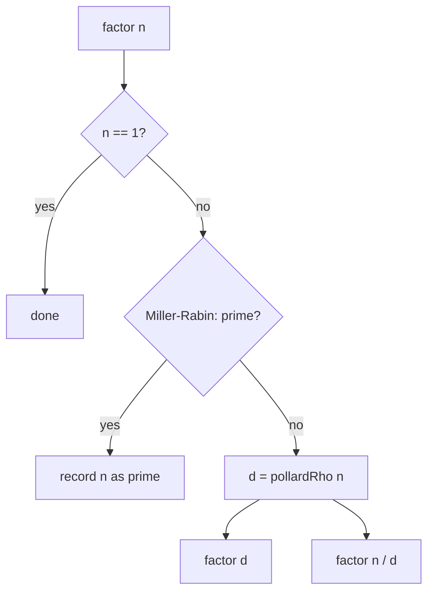

# Pollard's Rho Factorization — Junior Level

> **One-line summary:** Pollard's rho finds a **nontrivial factor** of a composite number `n` by walking a pseudo-random sequence `x ← x² + c (mod n)`, watching for a repeat (a cycle), and computing `gcd(|x − y|, n)`. When that gcd lands strictly between `1` and `n`, you have split `n` — in expected `O(n^{1/4})` time, far faster than trial-dividing up to `√n`.

---

## Table of Contents

1. [Introduction](#introduction)
2. [Prerequisites](#prerequisites)
3. [Glossary](#glossary)
4. [Core Concepts](#core-concepts)
5. [Big-O Summary](#big-o-summary)
6. [Real-World Analogies](#real-world-analogies)
7. [Pros & Cons](#pros--cons)
8. [Step-by-Step Walkthrough](#step-by-step-walkthrough)
9. [Code Examples](#code-examples)
10. [Coding Patterns](#coding-patterns)
11. [Error Handling](#error-handling)
12. [Performance Tips](#performance-tips)
13. [Best Practices](#best-practices)
14. [Edge Cases & Pitfalls](#edge-cases--pitfalls)
15. [Common Mistakes](#common-mistakes)
16. [Cheat Sheet](#cheat-sheet)
17. [Visual Animation](#visual-animation)
18. [Summary](#summary)
19. [Further Reading](#further-reading)

---

## Introduction

Suppose someone hands you a 19-digit number like `n = 1234567891011121314` and asks: *"What are its prime factors?"* The obvious approach — try dividing by `2, 3, 5, 7, …` up to `√n` — is hopeless: `√n` is about `1.1 × 10⁹`, so a billion trial divisions per number. For a 64-bit number `√n` reaches `4.3 × 10⁹`. That is too slow when you must factor many numbers.

There is a clever shortcut discovered by John Pollard in 1975, the **rho (ρ) algorithm**. It does not search for a factor directly. Instead it generates a sequence of "random-looking" numbers modulo `n`:

```
x₀ = 2,   x₁ = f(x₀),   x₂ = f(x₁),   …      where  f(x) = (x² + c) mod n
```

and looks for a moment when two of these values become **congruent modulo a hidden prime factor `p`** of `n`. When `xᵢ ≡ xⱼ (mod p)` but `xᵢ ≠ xⱼ (mod n)`, the difference `xᵢ − xⱼ` is a multiple of `p` but not of `n`. So:

> **`gcd(|xᵢ − xⱼ|, n)` is a multiple of `p` that is smaller than `n` — a nontrivial factor of `n`.**

The deep reason this is fast is the **birthday paradox**. The sequence `x mod p` lives in a set of only `p` values, and a repeating value (a collision) appears after about `√p` steps — *not* `p` steps. Since `p ≤ √n` for the smallest prime factor, we expect to find a factor in roughly `√(√n) = n^{1/4}` iterations. For a 64-bit number that is around `65000` steps instead of billions.

This single idea connects three things you may have met separately:

- **Random walks and cycles** — the sequence eventually loops, tracing a shape like the Greek letter ρ (a tail leading into a circle), which is where the name comes from.
- **The gcd / Euclidean algorithm** (sibling `01-gcd-euclidean`) — the workhorse that turns a collision into an actual factor.
- **Primality testing** (sibling `08-miller-rabin`) — Pollard's rho only *splits* `n`; to **fully** factor `n` you recurse, and at each step you ask Miller-Rabin "is this piece already prime?"

One caveat from minute one: Pollard's rho is a factoring tool for **composite** numbers. Before running it you should (a) strip small factors by quick trial division, and (b) check with Miller-Rabin whether `n` is already prime — running rho on a prime never terminates usefully.

---

## Prerequisites

Before reading this file you should be comfortable with:

- **Modular arithmetic** — `(a + b) mod n`, `(a · b) mod n`, and why products can overflow 64-bit integers (this matters a lot here).
- **The gcd and the Euclidean algorithm** — `gcd(a, b)` via repeated remainder. See sibling `01-gcd-euclidean`.
- **What a prime factor is** — every integer `> 1` factors uniquely into primes (the Fundamental Theorem of Arithmetic).
- **Big-O notation** — `O(√n)`, `O(n^{1/4})`, `O(log n)`.
- **Loops and recursion** — rho is a loop; full factorization is a small recursion.

Optional but helpful:

- A glance at the **birthday paradox** (a collision among random draws from `p` items appears after `≈ √p` draws).
- Familiarity with **Miller-Rabin** primality testing (sibling `08-miller-rabin`), used to decide when to stop recursing.

---

## Glossary

| Term | Meaning |
|------|---------|
| **Factor / divisor** | An integer `d > 0` with `n mod d == 0`. A **nontrivial** factor satisfies `1 < d < n`. |
| **Prime** | An integer `> 1` whose only divisors are `1` and itself. |
| **Composite** | An integer `> 1` that is not prime (has a nontrivial factor). |
| **The map `f`** | The pseudo-random iteration `f(x) = (x² + c) mod n` driving the rho sequence. |
| **`c` (the constant)** | A small added constant in `f`; if one `c` fails you retry with another. Avoid `c = 0` and `c = −2`. |
| **Cycle / collision** | The point where the sequence `x mod p` repeats a value, closing a loop. |
| **Tortoise & hare (Floyd)** | Two pointers, one moving 1 step and one moving 2 steps, used to detect the cycle. |
| **`gcd(|x − y|, n)`** | The greatest common divisor that turns a collision into a factor. |
| **Nontrivial gcd** | A gcd `d` with `1 < d < n`; this is the factor we want. |
| **`n^{1/4}`** | The fourth root of `n`, the expected number of rho steps to find a factor. |
| **mulmod** | An overflow-safe routine computing `(a · b) mod n` when `a·b` exceeds 64 bits. |

---

## Core Concepts

### 1. The Pseudo-Random Sequence

Pollard's rho generates values modulo `n` by iterating a simple polynomial:

```
f(x) = (x² + c) mod n
x₀ = 2
xₖ₊₁ = f(xₖ)
```

This sequence is **deterministic** (no real randomness), but `x² + c (mod n)` scrambles values enough to behave like a random walk for our purposes. We pick a starting seed (often `2`) and a constant `c` (often `1`).

### 2. Why the Sequence Forms a "Rho" Shape

The values live in `{0, 1, …, n−1}`, a finite set, so the sequence **must eventually repeat** — once a value reappears, the sequence cycles forever. Drawing the trajectory, you get a tail leading into a loop, exactly the shape of the Greek letter ρ:

```
x₀ → x₁ → x₂ → x₃ → x₄ → x₅
                  ↑          |
                  └──────────┘   (x₆ = x₃, the loop closes)
```

The same shape appears when we look at the sequence **modulo a hidden prime `p`** that divides `n`. Because `p` is much smaller than `n`, that smaller cycle closes much sooner.

### 3. The Collision That Reveals a Factor

Let `p` be an (unknown) prime factor of `n`. Consider the sequence reduced mod `p`: `x₀ mod p, x₁ mod p, …`. This sequence lives in only `p` values, so it collides after about `√p` steps: there exist indices `i < j` with

```
xᵢ ≡ xⱼ (mod p)   →   p divides (xⱼ − xᵢ)
```

If at the same time `xᵢ ≠ xⱼ (mod n)` (which is usually true since `n` is much bigger), then `xⱼ − xᵢ` is **not** a multiple of `n`. Therefore:

```
gcd(|xⱼ − xᵢ|, n) = a multiple of p that is < n = a nontrivial factor of n.
```

That gcd is the factor we extract. We never know `p` in advance — the gcd finds it for us.

### 4. Cycle Detection: Floyd's Tortoise and Hare

We cannot store all past values to check for collisions (there could be `√p ≈ n^{1/4}` of them, but we want `O(1)` memory). Floyd's trick uses two pointers:

```
tortoise: x ← f(x)          (1 step per round)
hare:     y ← f(f(y))       (2 steps per round)
each round: d = gcd(|x − y|, n)
```

Because the hare moves twice as fast, it "laps" the tortoise inside the cycle; the difference `x − y` will hit a multiple of `p` (a collision mod `p`) and the gcd catches it. We check the gcd every round.

### 5. Three Outcomes of the gcd

Each round the gcd `d = gcd(|x − y|, n)` is one of:

- **`1 < d < n`** — success! `d` is a nontrivial factor; return it.
- **`d == 1`** — no collision yet; keep iterating.
- **`d == n`** — the tortoise and hare collided *mod n* before splitting (the rare bad case). Restart with a different `c` (and/or seed). The whole sequence collapsed to a trivial result.

### 6. From Splitting to Fully Factoring

Pollard's rho gives **one** factor `d`. To get the complete prime factorization you combine it with primality testing:

```
factor(n):
    if n == 1: return
    if isPrime(n):  record n; return          # Miller-Rabin (sibling 08)
    d = pollardRho(n)                          # one nontrivial factor
    factor(d)                                  # recurse on the factor
    factor(n / d)                              # recurse on the cofactor
```

You first strip out small primes (trial division by `2, 3, 5, …`), then run rho on what remains, recursing until every piece is prime.

---

## Big-O Summary

| Operation | Time | Space | Notes |
|-----------|------|-------|-------|
| Trial division up to `√n` | `O(√n)` | O(1) | The slow baseline; fine only for small `n`. |
| One Pollard rho step | `O(log n)` | O(1) | One mulmod (a few 64-bit ops) plus a gcd. |
| Pollard rho to find one factor | **`O(n^{1/4})` expected** | O(1) | Birthday paradox on the smallest prime `p ≤ √n`. |
| Miller-Rabin primality test | `O(log³ n)` | O(1) | Decides prime vs composite (sibling `08`). |
| Full factorization (recurse + test) | `O(n^{1/4} · polylog n)` expected | O(log n) | Dominated by rho on the largest prime factor. |
| Worst case (rho unlucky / `n` prime) | can loop | O(1) | Mitigated by Miller-Rabin first and `c`-restarts. |

The headline number is **`O(n^{1/4})`** expected to split a composite — the square root of the trial-division bound `O(√n)`. For 64-bit `n` that is the difference between `~65000` and `~4 billion` operations.

---

## Real-World Analogies

| Concept | Analogy |
|---------|---------|
| The sequence `x ← x² + c` | A pinball bouncing around a finite board — chaotic but deterministic; eventually it retraces a path. |
| The rho (ρ) shape | A runner on a track who jogs in from the parking lot (the tail) and then circles the loop forever. |
| Birthday paradox | In a room of just 23 people two share a birthday with >50% chance; collisions happen far sooner than the 365-size set suggests — here the "room" is the `p`-sized residue set. |
| Tortoise and hare | Two runners on a circular track at different speeds: the faster one always laps the slower, so they meet. |
| `gcd(|x − y|, n)` | A metal detector: it cannot see the buried prime `p`, but it beeps (returns a factor) the moment two positions differ by a multiple of `p`. |
| Restart with new `c` | Re-rolling the dice when a board layout traps you in a dead loop — a fresh constant reshapes the walk. |

Where the analogy breaks: a real pinball is physical and random; our sequence is exact integer arithmetic mod `n`, fully reproducible from the same seed and `c`.

---

## Pros & Cons

| Pros | Cons |
|------|------|
| Expected `O(n^{1/4})` — square-root faster than trial division for finding a factor. | **Expected**, not guaranteed: a bad `c` can fail and force a restart. |
| Tiny `O(1)` memory — just a few integer variables. | Returns **one** factor, not the full factorization; needs recursion + primality test. |
| Simple to code once you have gcd and a safe mulmod. | Requires an **overflow-safe** `(a·b) mod n` (`__int128` or Montgomery) for 64-bit `n`. |
| Finds **small** prime factors especially fast (cost scales with the *smallest* prime). | Useless against cryptographic semiprimes (RSA-2048): `n^{1/4}` is still astronomically large. |
| Combines cleanly with Miller-Rabin for full factorization of 64-bit numbers in microseconds. | Must special-case `n` even, `n` prime, and perfect powers, or it misbehaves. |

**When to use:** factoring 64-bit (or up to ~`10^{18}`–`10^{19}`) integers quickly; number-theory problems needing the factorization of one or many medium-sized numbers; computing things like the number/sum of divisors, Euler's totient, or the largest prime factor.

**When NOT to use:** breaking real cryptography (the moduli are hundreds of digits; `n^{1/4}` is hopeless), or when `n` is tiny (trial division is simpler and the constant factors favor it).

---

## Step-by-Step Walkthrough

Let us factor `n = 8051` by hand-ish reasoning. (`8051 = 83 × 97`; the smallest prime is `p = 83`, so we expect a collision after about `√83 ≈ 9` steps.)

Use `f(x) = (x² + 1) mod 8051`, seed `x = y = 2`. Each round: advance tortoise once, hare twice, then `gcd(|x − y|, 8051)`.

```
Round 1:
  tortoise: x = f(2) = (4 + 1) = 5
  hare:     y = f(f(2)) = f(5) = (25 + 1) = 26
  gcd(|5 − 26|, 8051) = gcd(21, 8051) = 1     → keep going

Round 2:
  x = f(5)  = 26
  y = f(f(26)) = f(677) = (677² + 1) mod 8051 = 7474
  gcd(|26 − 7474|, 8051) = gcd(7448, 8051) = 1 → keep going

Round 3:
  x = f(26) = 677
  y = f(f(7474)) = … = 871
  gcd(|677 − 871|, 8051) = gcd(194, 8051) = 97 → SUCCESS
```

The gcd returned `97`, a nontrivial factor of `8051`. The cofactor is `8051 / 97 = 83`. Both `97` and `83` are prime (Miller-Rabin would confirm), so the full factorization is `8051 = 83 × 97`.

**What happened mod `p = 83`?** Look at the sequence mod 83: `2, 5, 26, 677 mod 83 = 13, …`. At some point two of these coincided mod 83 (a collision), making their difference a multiple of 83. The gcd then surfaced a factor — in this trace it surfaced `97` first because the difference `677 − 871 = −194 = −2 × 97` happened to be a multiple of 97. Either prime is a valid nontrivial factor; rho is happy to return whichever collision it hits first.

Each round did exactly one mulmod for the tortoise, two for the hare, and one gcd — a handful of cheap operations, and it split `8051` in 3 rounds.

---

## Code Examples

### Example: Pollard's Rho to Find One Factor

This implements Floyd's tortoise-and-hare rho with a safe `mulmod`, returning one nontrivial factor of a composite `n`.

#### Go

```go
package main

import (
	"fmt"
	"math/bits"
)

// mulmod computes (a*b) % m without overflowing 64 bits, using 128-bit math.
func mulmod(a, b, m uint64) uint64 {
	hi, lo := bits.Mul64(a, b)
	_, rem := bits.Div64(hi%m, lo, m) // (hi:lo) mod m
	return rem
}

func gcd(a, b uint64) uint64 {
	for b != 0 {
		a, b = b, a%b
	}
	return a
}

func abssub(a, b uint64) uint64 {
	if a > b {
		return a - b
	}
	return b - a
}

// pollardRho returns a nontrivial factor of composite n (n even handled outside).
func pollardRho(n uint64) uint64 {
	if n%2 == 0 {
		return 2
	}
	for c := uint64(1); ; c++ {
		f := func(x uint64) uint64 { return (mulmod(x, x, n) + c) % n }
		x, y, d := uint64(2), uint64(2), uint64(1)
		for d == 1 {
			x = f(x)       // tortoise: 1 step
			y = f(f(y))    // hare: 2 steps
			d = gcd(abssub(x, y), n)
		}
		if d != n { // success: nontrivial factor
			return d
		}
		// d == n: collapsed; retry with the next c
	}
}

func main() {
	fmt.Println(pollardRho(8051))               // 83 or 97
	fmt.Println(pollardRho(1234567891011121314)) // a nontrivial factor
}
```

#### Java

```java
import java.math.BigInteger;

public class PollardRho {
    static long mulmod(long a, long b, long m) {
        // Use 128-bit via BigInteger for clarity/safety in Java.
        return BigInteger.valueOf(a).multiply(BigInteger.valueOf(b))
                .mod(BigInteger.valueOf(m)).longValue();
    }

    static long gcd(long a, long b) {
        while (b != 0) { long t = a % b; a = b; b = t; }
        return a;
    }

    static long pollardRho(long n) {
        if (n % 2 == 0) return 2;
        for (long c = 1; ; c++) {
            long x = 2, y = 2, d = 1;
            while (d == 1) {
                x = (mulmod(x, x, n) + c) % n;                 // tortoise
                y = (mulmod(y, y, n) + c) % n;
                y = (mulmod(y, y, n) + c) % n;                 // hare (2 steps)
                d = gcd(Math.abs(x - y), n);
            }
            if (d != n) return d;                             // success
            // d == n: retry with next c
        }
    }

    public static void main(String[] args) {
        System.out.println(pollardRho(8051L));                // 83 or 97
        System.out.println(pollardRho(1234567891011121314L));
    }
}
```

#### Python

```python
from math import gcd


def pollard_rho(n):
    if n % 2 == 0:
        return 2
    c = 1
    while True:
        f = lambda x: (x * x + c) % n   # Python ints never overflow
        x, y, d = 2, 2, 1
        while d == 1:
            x = f(x)                    # tortoise: 1 step
            y = f(f(y))                 # hare: 2 steps
            d = gcd(abs(x - y), n)
        if d != n:                      # success: nontrivial factor
            return d
        c += 1                          # d == n: retry with new c


if __name__ == "__main__":
    print(pollard_rho(8051))                # 83 or 97
    print(pollard_rho(1234567891011121314)) # a nontrivial factor
```

**What it does:** walks the rho sequence with tortoise/hare, computes the gcd each round, returns the first nontrivial factor, and restarts with a new `c` if the gcd hits `n`.
**Run:** `go run main.go` | `javac PollardRho.java && java PollardRho` | `python rho.py`

---

## Coding Patterns

### Pattern 1: Trial Division Oracle (the slow truth you test against)

**Intent:** Before trusting rho, factor the slow, obvious way and check the products match on small inputs.

```python
def factor_trial(n):
    factors = []
    d = 2
    while d * d <= n:
        while n % d == 0:
            factors.append(d)
            n //= d
        d += 1
    if n > 1:
        factors.append(n)
    return factors   # always correct, but O(sqrt(n))
```

This is `O(√n)`. Too slow for big `n`, but a perfect correctness oracle: `factor_rho(n)` must return the same multiset.

### Pattern 2: Strip Small Factors First

**Intent:** Quick trial division by small primes removes easy factors and the even case, so rho only runs on the hard remainder.

```python
def strip_small(n, factors, limit=1000):
    d = 2
    while d <= limit and d * d <= n:
        while n % d == 0:
            factors.append(d)
            n //= d
        d += 1
    return n   # the remaining (possibly prime) cofactor
```

### Pattern 3: Recurse with Miller-Rabin to Fully Factor

**Intent:** rho splits; primality decides when to stop.



---

## Error Handling

| Error | Cause | Fix |
|-------|-------|-----|
| Wrong / overflowed factor on 64-bit `n` | `x*x` overflowed before `% n`. | Use an overflow-safe `mulmod` (`__int128` / `bits.Mul64` / BigInteger / Python big ints). |
| Infinite loop | Ran rho on a **prime** `n` (no nontrivial factor exists). | Test primality with Miller-Rabin first; never feed rho a prime. |
| Always returns `n` (no progress) | Bad constant `c` (e.g. `c = 0` makes the sequence degenerate). | Retry with a different `c`; never use `c = 0` or `c = n − 2`. |
| Misses factor `2` | Even `n` not handled; rho with `c` can stall on small factors. | Strip `2` (and other small primes) by trial division first. |
| Recursion never terminates | Forgot the `isPrime` base case in `factor`. | Always check `isPrime(n)` before recursing. |
| Negative difference / wrong gcd | Computed `x − y` as a signed value that wrapped. | Use `abs(x − y)` (or a branch) on unsigned types. |

---

## Performance Tips

- **Use a real `mulmod`.** On 64-bit `n`, `a*b` overflows; `__int128` (C/C++), `bits.Mul64`+`bits.Div64` (Go), or Montgomery multiplication makes each step fast *and* correct.
- **Strip small primes first.** A short trial-division sieve up to ~1000 removes most factors instantly and shrinks the number rho must crack.
- **Batch the gcd (Brent).** Computing a gcd every step is wasteful; accumulate the product of several `|x − y|` values mod `n` and take one gcd per batch (covered in `middle.md`).
- **Prefer Brent's variant.** Brent's cycle detection does fewer `f` evaluations than Floyd's tortoise/hare for the same work — typically ~25% faster (see `middle.md`).
- **Pick the smallest factor early.** rho's cost scales with the *smallest* prime, so it naturally finds small factors first; stripping them keeps the remaining `n` small.

---

## Best Practices

- Always run **Miller-Rabin first** to avoid looping forever on a prime, and to decide when recursion stops.
- Always use an **overflow-safe mulmod** for any `n` beyond ~`2^{31}`; never write a plain `(a*b) % n` for big `n`.
- Handle **`c`-restarts**: wrap rho in a loop that retries with a new `c` (and reseed) when the gcd returns `n`.
- **Strip small primes** by trial division before invoking rho; it is faster and dodges rho's weakness on tiny factors.
- Test the full factorizer against a **trial-division oracle** on many random small `n` so you trust it on large `n`.
- Keep `pollardRho`, `mulmod`, `gcd`, and `isPrime` as small, separately testable functions — most bugs hide in `mulmod`.

---

## Edge Cases & Pitfalls

- **`n` is prime** — rho cannot split it and loops; you must detect primality first.
- **`n` is even** — return `2` immediately; do not waste rho on the factor `2`.
- **`n = 1`** — has no prime factors; the recursion base case must handle it.
- **`n` is a perfect power** (e.g. `p²`, `p³`) — rho can struggle to split a prime power; some implementations check for perfect powers first (see `senior.md`).
- **Small `n` (< ~100)** — just trial-divide; rho's overhead is not worth it.
- **The gcd returns `n`** — the rare collapse; restart with a different `c`. Do **not** treat `n` as a factor.
- **Overflow** — the single most common correctness killer: `x*x` for 64-bit `n` overflows a 64-bit product. Always use a safe mulmod.

---

## Common Mistakes

1. **Plain `(a*b) % n` for 64-bit `n`** — silently overflows and returns garbage factors. Use a 128-bit / Montgomery mulmod.
2. **Running rho on a prime** — infinite loop. Always Miller-Rabin first.
3. **Using `c = 0`** — makes `f(x) = x²` degenerate (it can get stuck at fixed points like `0` and `1`). Start at `c = 1`.
4. **Never restarting on `gcd == n`** — the algorithm gets stuck; you must retry with a new `c`.
5. **Treating the gcd `== n` as a factor** — `n` is *not* a nontrivial factor; this corrupts the factorization.
6. **Forgetting to strip the factor `2`** — rho is awkward with small factors; handle even `n` up front.
7. **No primality base case in recursion** — `factor` recurses forever; always stop when `isPrime(n)`.
8. **Assuming rho cracks RSA** — for cryptographic `n`, `n^{1/4}` is still impossibly large; rho is a *medium*-size tool only.

---

## Cheat Sheet

| Question | Tool | Note |
|----------|------|------|
| Find one factor of composite `n` | Pollard's rho | `O(n^{1/4})` expected |
| Is `n` prime? | Miller-Rabin (sibling `08`) | needed before & during factoring |
| Turn a collision into a factor | `gcd(|x − y|, n)` | nontrivial iff `1 < gcd < n` |
| Detect the cycle | Floyd (tortoise/hare) or Brent | `O(1)` memory |
| gcd returned `n` | restart | new `c`, new seed |
| Strip easy factors | trial division to ~1000 | do this first |
| Fully factor `n` | recurse + Miller-Rabin | split, then recurse on both parts |

Core algorithm:

```
pollardRho(n):
    if n even: return 2
    for c = 1, 2, 3, …:
        x = y = 2;  d = 1
        f(v) = (v*v + c) mod n        # use a SAFE mulmod
        while d == 1:
            x = f(x)                  # tortoise (1 step)
            y = f(f(y))               # hare (2 steps)
            d = gcd(|x − y|, n)
        if d != n: return d           # nontrivial factor
        # else d == n → next c
# expected O(n^{1/4}); pair with Miller-Rabin to fully factor
```

---

## Visual Animation

> See [`animation.html`](./animation.html) for an interactive visualization.
>
> The animation demonstrates:
> - The sequence `xᵢ = (x² + c) mod n` tracing out the "rho" shape (a tail leading into a cycle).
> - The **tortoise** (1 step) and **hare** (2 steps) pointers chasing each other around the loop.
> - The `gcd(|x − y|, n)` being computed each round, with `1`, the factor, or `n` highlighted.
> - A **factor popping out** when the gcd lands strictly between `1` and `n`, plus editable `n` and `c` and Step/Run/Reset controls.

---

## Summary

Pollard's rho factors a composite `n` by walking the pseudo-random sequence `x ← x² + c (mod n)` and watching for a **collision modulo a hidden prime `p`**: when `xᵢ ≡ xⱼ (mod p)` the difference is a multiple of `p`, so `gcd(|xᵢ − xⱼ|, n)` is a nontrivial factor. Floyd's tortoise-and-hare finds the cycle in `O(1)` memory, and the **birthday paradox** makes the whole search take only `≈ √p ≤ n^{1/4}` steps — the square root of trial division's `√n`. The one rule never to forget: rho **splits** a composite into one factor; to **fully** factor you strip small primes by trial division, test primality with Miller-Rabin (sibling `08`), and recurse on the pieces. Get the overflow-safe `mulmod` right and you can factor 64-bit numbers in microseconds.

---

## Further Reading

- J. M. Pollard, *A Monte Carlo method for factorization* (1975) — the original two-page paper.
- Sibling topic `01-gcd-euclidean` — the gcd that turns a collision into a factor.
- Sibling topic `08-miller-rabin` — the primality test that decides when to stop recursing.
- R. Brent, *An improved Monte Carlo factorization algorithm* (1980) — the faster cycle-detection variant (`middle.md`).
- cp-algorithms.com — "Integer factorization" and "Pollard's rho algorithm".
- *Introduction to Algorithms* (CLRS), number-theoretic algorithms chapter — Pollard's rho and gcd.
