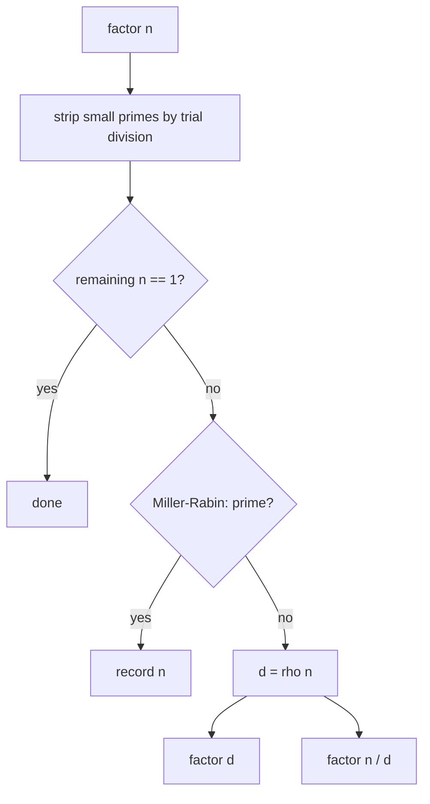

# Pollard's Rho Factorization — Middle Level

> **Focus:** Floyd vs Brent cycle detection, batched gcd that amortizes the Euclidean cost away, the full-factorization recursion built on Miller-Rabin + trial division, and Pollard's p−1 method as a complementary tool. The rho iteration + cycle detection + gcd is the spine; everything here makes it fast and complete.

---

## Table of Contents

1. [Introduction](#introduction)
2. [Deeper Concepts](#deeper-concepts)
3. [Comparison with Alternatives](#comparison-with-alternatives)
4. [Advanced Patterns](#advanced-patterns)
5. [Full Factorization Pipeline](#full-factorization-pipeline)
6. [Pollard's p−1 Method](#pollards-p1-method)
7. [Code Examples](#code-examples)
8. [Error Handling](#error-handling)
9. [Performance Analysis](#performance-analysis)
10. [Best Practices](#best-practices)
11. [Visual Animation](#visual-animation)
12. [Summary](#summary)

---

## Introduction

At junior level the message was a single fact: walk `x ← x² + c (mod n)`, watch for a collision mod a hidden prime `p`, and `gcd(|x − y|, n)` hands you a factor in `≈ n^{1/4}` steps. At middle level you start asking the engineering questions that decide whether your factorizer is correct *and* fast *and* complete:

- Floyd's tortoise/hare is the textbook cycle detector — but **Brent's** variant does fewer `f` evaluations. How much faster is it, and why?
- A gcd per step is `O(log n)` each — can we **batch** many `|x − y|` into one gcd?
- rho gives **one** factor. How do we wire it into a **full** factorization with Miller-Rabin and trial division so every reported factor is prime?
- When is **Pollard's p−1** the better tool, and how does it differ from rho?
- Which `c` and seed choices fail, and how do restarts recover?

These are the questions that separate "I can split one number" from "I can robustly factor any 64-bit integer in microseconds."

---

## Deeper Concepts

### The rho recurrence, restated

The sequence is `xₖ₊₁ = f(xₖ)` with `f(x) = (x² + c) mod n`. Reduce everything mod a prime factor `p | n`:

```
yₖ = xₖ mod p,    yₖ₊₁ = (yₖ² + c) mod p
```

Because `f` commutes with reduction mod `p` (`(x² + c) mod n` then mod `p` equals `(x² + c) mod p`), the `y`-sequence is itself a rho walk in the smaller world `Z/pZ`. It enters a cycle after a **tail** of length `λ` and loops with **period** `μ`, and `λ + μ = O(√p)` by the birthday paradox. A collision `yᵢ = yⱼ` (`i ≠ j`) means `p | (xᵢ − xⱼ)`, so `gcd(|xᵢ − xⱼ|, n)` is a multiple of `p`. As long as that gcd is not all of `n`, it is a nontrivial factor.

### Floyd's tortoise and hare

Floyd advances a slow pointer `x` by one `f` and a fast pointer `y` by two `f` per round, testing `gcd(|x − y|, n)` each round. The fast pointer enters the cycle and eventually coincides with the slow one *mod p*; the gcd surfaces `p`. Per round Floyd does **3** evaluations of `f` (one for the tortoise, two for the hare).

### Brent's improvement

Brent's cycle detection uses a different bookkeeping: it keeps a fixed reference `y`, advances `x` by single steps, and periodically (at power-of-two boundaries) resets the reference `y ← x`. It detects the cycle using only **1** `f` evaluation per step — roughly **25% fewer** `f` evaluations than Floyd for the same cycle, because Floyd "wastes" the hare's extra step. Brent also composes naturally with batched gcd (below). In practice Brent + batching is the standard competitive-programming rho.

### Why batching the gcd is safe

A gcd costs `O(log n)`. Doing it every step dominates the runtime. Instead, accumulate a running product:

```
Q ← Q · |x − y|  (mod n)      for a batch of ~128 steps
then  d = gcd(Q, n)           once per batch
```

If **any** `|x − y|` in the batch was a multiple of `p`, then `p | Q`, so the batched gcd still finds `p`. This replaces ~128 gcds with one gcd plus 128 cheap mulmods — a big constant-factor win.

**The subtlety:** the batched product can accidentally become `0 (mod n)` or a multiple of `n` if two different factors collide in the same batch, making `gcd(Q, n) = n` (collapse). The fix is to **remember the last good `y`** (or the batch start) and, on collapse, re-run that batch one step at a time computing an individual gcd each step. That recovers the factor the batch overshot.

### The three gcd outcomes (recap, with batching)

| `gcd(Q, n)` | Meaning | Action |
|-------------|---------|--------|
| `1` | no collision in this batch | continue to next batch |
| `1 < d < n` | nontrivial factor found | return `d` |
| `n` | batch collapsed (over-multiplied) | back off, re-run the batch step-by-step |

---

## Comparison with Alternatives

### Cycle-detection variants

| Method | `f` evals per "round" | Memory | gcd batching | Notes |
|--------|----------------------|--------|--------------|-------|
| Floyd (tortoise/hare) | 3 (1 + 2) | O(1) | possible | simplest; textbook |
| Brent | ~1 amortized | O(1) | natural fit | ~25% fewer `f` evals; the practical default |
| Brent + batched gcd | ~1 + 1 gcd / batch | O(1) | yes | fastest in practice |
| Store-all + hashset | 1 | O(√p) | n/a | detects exact collision but uses too much memory |

### Factoring algorithms by size of `n`

| Algorithm | Good for | Cost (find one factor) |
|-----------|----------|------------------------|
| Trial division | tiny `n`, stripping small primes | `O(√n)` (or `O(smallest factor)`) |
| **Pollard's rho** | up to ~`10^{18}`–`10^{19}` (64-bit) | `O(n^{1/4})` expected |
| **Pollard's p−1** | `n` with a prime factor `p` where `p−1` is smooth | `O(B log B log² n)` for bound `B` |
| Elliptic Curve Method (ECM) | factors up to ~`10^{40}` | sub-exponential in factor size |
| Quadratic Sieve / GNFS | large semiprimes (crypto) | sub-exponential / `L_n` |

The lesson: for **64-bit** numbers, Pollard's rho (with Miller-Rabin) is the sweet spot — simple, `O(1)` memory, microsecond-fast. Beyond ~`10^{20}` you escalate to ECM; for crypto-size you need the number field sieve.

---

## Advanced Patterns

### Pattern: Brent's rho with batched gcd

Brent advances `x` from a fixed reference, doubling the segment length each round, and multiplies the differences into `Q` before a single batched gcd. The differences are taken against the reference `y` captured at the start of each round.

#### Go

```go
package main

import (
	"fmt"
	"math/bits"
)

func mulmod(a, b, m uint64) uint64 {
	hi, lo := bits.Mul64(a, b)
	_, r := bits.Div64(hi%m, lo, m)
	return r
}

func gcd(a, b uint64) uint64 {
	for b != 0 {
		a, b = b, a%b
	}
	return a
}

func absdiff(a, b uint64) uint64 {
	if a > b {
		return a - b
	}
	return b - a
}

// brentRho returns a nontrivial factor of composite, odd n.
func brentRho(n uint64) uint64 {
	if n%2 == 0 {
		return 2
	}
	for c := uint64(1); ; c++ {
		f := func(x uint64) uint64 { return (mulmod(x, x, n) + c) % n }
		var x, ys uint64
		y := uint64(2)
		d := uint64(1)
		q := uint64(1)
		m := uint64(128) // batch size
		r := uint64(1)
		for d == 1 {
			x = y
			for i := uint64(0); i < r; i++ {
				y = f(y)
			}
			for k := uint64(0); k < r && d == 1; k += m {
				ys = y
				lim := m
				if r-k < m {
					lim = r - k
				}
				for i := uint64(0); i < lim; i++ {
					y = f(y)
					q = mulmod(q, absdiff(x, y), n)
				}
				d = gcd(q, n)
			}
			r *= 2
		}
		if d == n { // batch collapsed: re-run step-by-step from ys
			for {
				ys = f(ys)
				d = gcd(absdiff(x, ys), n)
				if d > 1 {
					break
				}
			}
		}
		if d != n {
			return d
		}
		// retry with next c
	}
}

func main() {
	fmt.Println(brentRho(8051))
	fmt.Println(brentRho(1000000007 * 1000000009))
}
```

#### Java

```java
import java.math.BigInteger;

public class BrentRho {
    static long mulmod(long a, long b, long m) {
        return BigInteger.valueOf(a).multiply(BigInteger.valueOf(b))
                .mod(BigInteger.valueOf(m)).longValue();
    }

    static long gcd(long a, long b) {
        while (b != 0) { long t = a % b; a = b; b = t; }
        return a;
    }

    static long brentRho(long n) {
        if (n % 2 == 0) return 2;
        for (long c = 1; ; c++) {
            long y = 2, d = 1, q = 1, r = 1, m = 128, x = 0, ys = 0;
            while (d == 1) {
                x = y;
                for (long i = 0; i < r; i++) y = (mulmod(y, y, n) + c) % n;
                for (long k = 0; k < r && d == 1; k += m) {
                    ys = y;
                    long lim = Math.min(m, r - k);
                    for (long i = 0; i < lim; i++) {
                        y = (mulmod(y, y, n) + c) % n;
                        q = mulmod(q, Math.abs(x - y), n);
                    }
                    d = gcd(q, n);
                }
                r *= 2;
            }
            if (d == n) {
                do {
                    ys = (mulmod(ys, ys, n) + c) % n;
                    d = gcd(Math.abs(x - ys), n);
                } while (d <= 1);
            }
            if (d != n) return d;
        }
    }

    public static void main(String[] args) {
        System.out.println(brentRho(8051L));
        System.out.println(brentRho(1000000007L * 1000000009L));
    }
}
```

#### Python

```python
from math import gcd


def brent_rho(n):
    if n % 2 == 0:
        return 2
    c = 1
    while True:
        f = lambda x: (x * x + c) % n
        y, d, q, r, m = 2, 1, 1, 1, 128
        x = ys = 0
        while d == 1:
            x = y
            for _ in range(r):
                y = f(y)
            k = 0
            while k < r and d == 1:
                ys = y
                for _ in range(min(m, r - k)):
                    y = f(y)
                    q = (q * abs(x - y)) % n
                d = gcd(q, n)
                k += m
            r *= 2
        if d == n:                      # collapse: re-run step-by-step
            while True:
                ys = f(ys)
                d = gcd(abs(x - ys), n)
                if d > 1:
                    break
        if d != n:
            return d
        c += 1


if __name__ == "__main__":
    print(brent_rho(8051))
    print(brent_rho(1000000007 * 1000000009))
```

### Pattern: gcd-batch trade-off

Batch size `m` trades gcd count against collapse frequency. Small `m` (e.g. 64–256) is the sweet spot: large enough to amortize the gcd, small enough that collapses are rare and cheap to recover from. A batch of `m = 1` degenerates to plain per-step gcd (Floyd-style).

---

## Full Factorization Pipeline

rho only **splits**. A complete factorizer layers three tools:

1. **Trial division** strips small primes (`2, 3, 5, …` up to a few hundred or thousand) — cheap and removes the cases rho handles poorly (small factors, the even case).
2. **Miller-Rabin** (sibling `08-miller-rabin`) decides whether the current `n` is prime — the recursion's base case.
3. **Pollard's rho** splits a composite into one factor `d`; recurse on `d` and `n/d`.



The recursion terminates because each split produces strictly smaller numbers, and Miller-Rabin halts the recursion at every prime. The total cost is dominated by rho on the **largest prime factor** `P`: `O(P^{1/4} · polylog)` — but since `P ≤ n`, the bound is `O(n^{1/4} · polylog n)` expected.

**Why strip small primes first?** rho's expected cost scales with the *smallest* prime factor, so if `n = 2³ · large_prime`, rho would find `2` repeatedly — wasteful and awkward. Trial division clears those instantly, leaving rho to do the one hard split.

---

## Pollard's p−1 Method

Pollard's **p−1** is a *different* algorithm, complementary to rho. It succeeds when `n` has a prime factor `p` such that `p − 1` is **B-smooth** (all prime factors of `p − 1` are `≤ B` for a modest bound `B`).

**The idea (Fermat's little theorem).** For any `a` coprime to `p`, `a^{p−1} ≡ 1 (mod p)`. If `p − 1` divides some highly composite exponent `M = lcm(1, 2, …, B)`, then `a^M ≡ 1 (mod p)`, so `p | (a^M − 1)`. Therefore:

```
compute a^M mod n     (M = product of prime powers up to B)
g = gcd(a^M − 1, n)
if 1 < g < n: g is a nontrivial factor
```

**Algorithm sketch:**

```
pMinus1(n, B):
    a = 2
    for each prime power q ≤ B:
        a = pow(a, q, n)            # accumulate the smooth exponent
    g = gcd(a - 1, n)
    if 1 < g < n: return g
    else: increase B, or fall back to rho
```

**When it shines vs rho.** p−1 finds a factor `p` in time depending on the smoothness of `p − 1`, *not* on the size of `p`. So if `n` has a factor `p` with `p − 1 = 2 · 3 · 5 · 7 · 11 · …` (smooth), p−1 cracks it fast even when `p` itself is large. rho, by contrast, depends only on `√p`. In practice a robust factorizer tries a quick p−1 pass and falls back to rho. p−1's weakness: if **no** factor has smooth `p − 1`, it fails entirely, whereas rho always works (given restarts). This smoothness dependence is exactly why cryptographic primes are chosen as **safe primes** (`p = 2q + 1`), making `p − 1 = 2q` non-smooth and immune to p−1.

#### Python (p−1)

```python
from math import gcd


def pollard_p_minus_1(n, B=10000):
    a = 2
    for p in _primes_up_to(B):
        pk = p
        while pk * p <= B:
            pk *= p
        a = pow(a, pk, n)           # a ^= p^k mod n
        g = gcd(a - 1, n)
        if 1 < g < n:
            return g
    return None                     # no smooth factor found; fall back to rho


def _primes_up_to(B):
    sieve = [True] * (B + 1)
    for i in range(2, int(B ** 0.5) + 1):
        if sieve[i]:
            for j in range(i * i, B + 1, i):
                sieve[j] = False
    return [i for i in range(2, B + 1) if sieve[i]]
```

---

## Code Examples

### Full factorization with rho + trial division (Miller-Rabin assumed from sibling 08)

This is the same rho engine as junior, wrapped in the recursion. `isPrime` is Miller-Rabin (sibling `08-miller-rabin`).

#### Python

```python
from math import gcd
from random import randrange


def is_prime(n):  # deterministic Miller-Rabin for 64-bit (sibling 08)
    if n < 2:
        return False
    for p in (2, 3, 5, 7, 11, 13, 17, 19, 23, 29, 31, 37):
        if n % p == 0:
            return n == p
    d, s = n - 1, 0
    while d % 2 == 0:
        d //= 2
        s += 1
    for a in (2, 3, 5, 7, 11, 13, 17, 19, 23, 29, 31, 37):
        x = pow(a, d, n)
        if x in (1, n - 1):
            continue
        for _ in range(s - 1):
            x = x * x % n
            if x == n - 1:
                break
        else:
            return False
    return True


def pollard_rho(n):
    if n % 2 == 0:
        return 2
    while True:
        c = randrange(1, n)
        f = lambda x: (x * x + c) % n
        x, y, d = 2, 2, 1
        while d == 1:
            x = f(x)
            y = f(f(y))
            d = gcd(abs(x - y), n)
        if d != n:
            return d


def factor(n):
    factors = []

    def rec(m):
        if m == 1:
            return
        if is_prime(m):
            factors.append(m)
            return
        d = pollard_rho(m)
        rec(d)
        rec(m // d)

    # strip small primes first
    for p in range(2, 1000):
        while n % p == 0:
            factors.append(p)
            n //= p
    rec(n)
    return sorted(factors)


if __name__ == "__main__":
    print(factor(8051))                      # [83, 97]
    print(factor(1234567891011121314))       # full prime factorization
```

#### Go

```go
package main

import (
	"fmt"
	"math/bits"
	"math/rand"
	"sort"
)

func mulmod(a, b, m uint64) uint64 {
	hi, lo := bits.Mul64(a, b)
	_, r := bits.Div64(hi%m, lo, m)
	return r
}

func powmod(a, e, m uint64) uint64 {
	r := uint64(1 % m)
	a %= m
	for e > 0 {
		if e&1 == 1 {
			r = mulmod(r, a, m)
		}
		a = mulmod(a, a, m)
		e >>= 1
	}
	return r
}

func isPrime(n uint64) bool {
	if n < 2 {
		return false
	}
	for _, p := range []uint64{2, 3, 5, 7, 11, 13, 17, 19, 23, 29, 31, 37} {
		if n%p == 0 {
			return n == p
		}
	}
	d, s := n-1, 0
	for d%2 == 0 {
		d /= 2
		s++
	}
	for _, a := range []uint64{2, 3, 5, 7, 11, 13, 17, 19, 23, 29, 31, 37} {
		x := powmod(a, d, n)
		if x == 1 || x == n-1 {
			continue
		}
		ok := false
		for i := 0; i < s-1; i++ {
			x = mulmod(x, x, n)
			if x == n-1 {
				ok = true
				break
			}
		}
		if !ok {
			return false
		}
	}
	return true
}

func gcd(a, b uint64) uint64 {
	for b != 0 {
		a, b = b, a%b
	}
	return a
}

func pollardRho(n uint64) uint64 {
	if n%2 == 0 {
		return 2
	}
	for {
		c := uint64(rand.Int63n(int64(n-1))) + 1
		f := func(x uint64) uint64 { return (mulmod(x, x, n) + c) % n }
		x, y, d := uint64(2), uint64(2), uint64(1)
		for d == 1 {
			x = f(x)
			y = f(f(y))
			diff := x
			if y > x {
				diff = y - x
			} else {
				diff = x - y
			}
			d = gcd(diff, n)
		}
		if d != n {
			return d
		}
	}
}

func factor(n uint64) []uint64 {
	var fs []uint64
	var rec func(m uint64)
	rec = func(m uint64) {
		if m == 1 {
			return
		}
		if isPrime(m) {
			fs = append(fs, m)
			return
		}
		d := pollardRho(m)
		rec(d)
		rec(m / d)
	}
	for p := uint64(2); p < 1000; p++ {
		for n%p == 0 {
			fs = append(fs, p)
			n /= p
		}
	}
	rec(n)
	sort.Slice(fs, func(i, j int) bool { return fs[i] < fs[j] })
	return fs
}

func main() {
	fmt.Println(factor(8051))
	fmt.Println(factor(1234567891011121314))
}
```

#### Java

```java
import java.math.BigInteger;
import java.util.*;

public class FullFactor {
    static long mulmod(long a, long b, long m) {
        return BigInteger.valueOf(a).multiply(BigInteger.valueOf(b))
                .mod(BigInteger.valueOf(m)).longValue();
    }

    static boolean isPrime(long n) {
        if (n < 2) return false;
        for (long p : new long[]{2,3,5,7,11,13,17,19,23,29,31,37})
            if (n % p == 0) return n == p;
        long d = n - 1; int s = 0;
        while (d % 2 == 0) { d /= 2; s++; }
        for (long a : new long[]{2,3,5,7,11,13,17,19,23,29,31,37}) {
            long x = BigInteger.valueOf(a).modPow(BigInteger.valueOf(d), BigInteger.valueOf(n)).longValue();
            if (x == 1 || x == n - 1) continue;
            boolean ok = false;
            for (int i = 0; i < s - 1; i++) {
                x = mulmod(x, x, n);
                if (x == n - 1) { ok = true; break; }
            }
            if (!ok) return false;
        }
        return true;
    }

    static long gcd(long a, long b) { while (b != 0) { long t = a % b; a = b; b = t; } return a; }

    static long pollardRho(long n) {
        if (n % 2 == 0) return 2;
        Random rnd = new Random();
        while (true) {
            long c = 1 + (Math.abs(rnd.nextLong()) % (n - 1));
            long x = 2, y = 2, d = 1;
            while (d == 1) {
                x = (mulmod(x, x, n) + c) % n;
                y = (mulmod(y, y, n) + c) % n;
                y = (mulmod(y, y, n) + c) % n;
                d = gcd(Math.abs(x - y), n);
            }
            if (d != n) return d;
        }
    }

    static void rec(long m, List<Long> fs) {
        if (m == 1) return;
        if (isPrime(m)) { fs.add(m); return; }
        long d = pollardRho(m);
        rec(d, fs);
        rec(m / d, fs);
    }

    static List<Long> factor(long n) {
        List<Long> fs = new ArrayList<>();
        for (long p = 2; p < 1000; p++)
            while (n % p == 0) { fs.add(p); n /= p; }
        rec(n, fs);
        Collections.sort(fs);
        return fs;
    }

    public static void main(String[] args) {
        System.out.println(factor(8051L));
        System.out.println(factor(1234567891011121314L));
    }
}
```

---

## Error Handling

| Scenario | What goes wrong | Correct approach |
|----------|-----------------|------------------|
| rho called on a prime | infinite loop | Miller-Rabin guards every recursion level. |
| Batched gcd collapses (`gcd(Q,n)=n`) | over-multiplied past a factor | back off; re-run the batch step-by-step computing per-step gcd. |
| Plain `(a*b)%n` overflows | wrong factor on 64-bit `n` | use `__int128` / `bits.Mul64` / BigInteger / Python big ints. |
| Same `c` retried after failure | deterministic re-failure | randomize `c` (and seed) on each restart. |
| p−1 returns `None` | no factor with smooth `p−1` | fall back to rho — never rely on p−1 alone. |
| Recursion missing base case | never terminates | stop at `m == 1` and at every `isPrime(m)`. |
| Small factor not found by rho | rho awkward with tiny primes | strip small primes by trial division first. |

---

## Performance Analysis

| `n` size | smallest prime `p` | rho steps `≈ √p` | wall time (typical) |
|----------|--------------------|-------------------|---------------------|
| `10^9` (semiprime) | `~10^{4.5}` | `~180` | microseconds |
| `10^{12}` | `~10^6` | `~1000` | tens of microseconds |
| `10^{15}` | `~10^{7.5}` | `~5600` | sub-millisecond |
| `10^{18}` (two ~`10^9` primes) | `~10^9` | `~31000` | ~1 ms |
| `10^{19}` (full 64-bit) | up to `~3×10^9` | `~55000` | a few ms |

The cost is `≈ √p` iterations where `p` is the **smallest** prime factor, each iteration being one mulmod plus (amortized) a tiny share of a gcd. Brent over Floyd saves ~25% of the `f` evaluations; batched gcd removes nearly all the gcd cost. The worst case for a hard 64-bit **semiprime** (two ~`√n` primes) is ~`n^{1/4} ≈ 55000` iterations — milliseconds.

```python
import time

def benchmark(n):
    start = time.perf_counter()
    _ = factor(n)
    return time.perf_counter() - start

# Typical: a hard 18-19 digit semiprime factors in a few milliseconds in Python,
# microseconds in Go/Java with a real mulmod.
```

The single biggest constant-factor wins are: an overflow-safe **mulmod** (Montgomery is fastest), **Brent** over Floyd, and **batched gcd** (one gcd per ~128 steps).

---

## Best Practices

- **Brent + batched gcd** is the default fast rho; reserve plain Floyd for clarity/teaching.
- **Always Miller-Rabin first** at every recursion level — it is both the base case and the loop-forever guard.
- **Strip small primes** by trial division before rho; it handles the even case and rho's small-factor weakness.
- **Randomize `c` and the seed on restart**; a fixed `c` that failed will fail again.
- **Recover from collapse** (`gcd == n`) by re-running the last batch step-by-step, not by giving up.
- **Try a quick p−1 pass** when factors with smooth `p−1` are plausible; always fall back to rho.
- **Test against a trial-division oracle** on thousands of random `n` to validate the full pipeline.

---

## Visual Animation

> See [`animation.html`](./animation.html) for an interactive view.
>
> The middle-level animation highlights:
> - The rho sequence `x ← x² + c (mod n)` forming the ρ shape, with the tail and cycle marked.
> - Tortoise (1 step) and hare (2 steps) pointers, and how Brent's reference resets differ.
> - The batched product `Q ← Q · |x − y|` accumulating, then one `gcd(Q, n)` per batch.
> - A factor popping out when `1 < gcd < n`, and a collapse (`gcd == n`) triggering a restart with new `c`.

---

## Summary

The rho spine — walk `x ← x² + c`, detect the cycle, take `gcd(|x − y|, n)` — finds one factor in `≈ n^{1/4}` steps. Middle-level engineering makes it production-grade: **Brent's** cycle detection cuts `f` evaluations ~25% over Floyd's tortoise/hare, and **batched gcd** replaces a per-step Euclidean call with one gcd per ~128 cheap mulmods (recovering from the rare collapse by re-running the batch step-by-step). rho only *splits*, so a complete factorizer wraps it in a recursion guarded by **Miller-Rabin** (sibling `08`) and preceded by **trial division** to strip small primes. **Pollard's p−1** is the complementary tool: it cracks factors `p` with smooth `p − 1` regardless of `p`'s size, and a robust factorizer tries it before falling back to rho. Master Brent + batching + the Miller-Rabin recursion and you can fully factor any 64-bit integer in microseconds.
