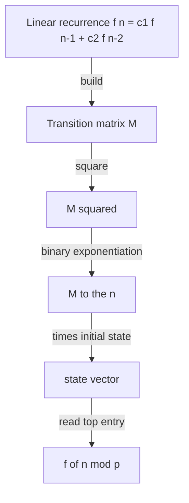

# Matrix Exponentiation for Linear Recurrences — Junior Level

> **One-line summary:** A constant-coefficient linear recurrence such as Fibonacci `F_n = F_{n-1} + F_{n-2}` can be written as a **matrix-vector product** `state_n = M · state_{n-1}`. Then `state_n = M^n · state_0`, and you compute `M^n` quickly with **binary exponentiation** (exponentiation by squaring), usually taking entries modulo a prime to avoid overflow. This evaluates the `n`-th term in `O(k^3 log n)` for an order-`k` recurrence.

---

## Table of Contents

1. [Introduction](#introduction)
2. [Prerequisites](#prerequisites)
3. [Glossary](#glossary)
4. [Core Concepts](#core-concepts)
5. [Big-O Summary](#big-o-summary)
6. [Real-World Analogies](#real-world-analogies)
7. [Pros & Cons](#pros--cons)
8. [Step-by-Step Walkthrough](#step-by-step-walkthrough)
9. [Code Examples](#code-examples)
10. [Coding Patterns](#coding-patterns)
11. [Error Handling](#error-handling)
12. [Performance Tips](#performance-tips)
13. [Best Practices](#best-practices)
14. [Edge Cases & Pitfalls](#edge-cases--pitfalls)
15. [Common Mistakes](#common-mistakes)
16. [Cheat Sheet](#cheat-sheet)
17. [Frequently Asked Questions](#frequently-asked-questions)
18. [Visual Animation](#visual-animation)
19. [Summary](#summary)
20. [Further Reading](#further-reading)

---

## Introduction

Suppose someone asks you: *"What is the 1,000,000,000,000-th Fibonacci number, modulo `10^9 + 7`?"* The obvious loop `for i in range(n): a, b = b, a + b` would take a *trillion* iterations — far too slow. There is a beautiful shortcut that finishes in a few dozen steps.

The trick is to notice that the Fibonacci rule `F_n = F_{n-1} + F_{n-2}` is **linear**: the next term is a fixed linear combination of the previous ones. Any linear relationship can be packaged as a matrix multiplication. Stack the two most recent terms into a column vector and ask "what `2×2` matrix `M` moves the window forward by one step?"

```
[ F_n     ]   [ 1  1 ] [ F_{n-1} ]
[ F_{n-1} ] = [ 1  0 ] [ F_{n-2} ]
```

That single matrix `M = [[1,1],[1,0]]` is the **transition matrix** (also called the *companion matrix*). Applying it once advances the recurrence one step. Applying it `n` times advances `n` steps:

> **`state_n = M^n · state_0`** — so to jump straight to `F_n`, raise `M` to the `n`-th power and read the right entry.

The magic is that `M^n` does **not** require `n` multiplications. Using **binary exponentiation** (the same "exponentiation by squaring" trick that computes `2^n` fast), `M^n` costs only `O(log n)` matrix multiplications. Each `2×2` multiply is `O(1)` work, so Fibonacci at any index `n` — even `n = 10^18` — takes about 60 multiplications total. That is `O(log n)`.

For a general order-`k` recurrence (depending on the last `k` terms) the transition matrix is `k × k`, each multiply costs `O(k^3)`, and the whole evaluation is **`O(k^3 log n)`**. This file uses Fibonacci and its `2×2` matrix as the spine, then shows the general recipe.

This idea has a graph-flavored sibling: in topic `11-graphs/32-paths-fixed-length`, the *same* binary-exponentiation-of-a-matrix machinery counts **walks of length `k`** in a graph (`(A^k)[i][j]`). That topic is the *graph* angle; **this** topic is the *number-theory / linear-recurrence* angle — Fibonacci, the companion matrix, and modular powers. Cross-reference it whenever you want the combinatorial picture.

---

## Prerequisites

Before reading this file you should be comfortable with:

- **Linear recurrences** — a sequence where each term is a fixed linear combination of earlier terms, like `F_n = F_{n-1} + F_{n-2}` or `T_n = 2·T_{n-1} + 3·T_{n-2}`.
- **Matrix multiplication** — the row-by-column dot-product rule `C[i][j] = Σ_t A[i][t] · B[t][j]`.
- **Matrix-vector product** — multiplying a `k × k` matrix by a `k × 1` column vector to get a new `k × 1` vector.
- **Modular arithmetic** — `(a + b) mod p`, `(a · b) mod p`, and why we use it to prevent overflow.
- **Binary exponentiation** — computing `x^n` in `O(log n)` by squaring. (Covered for scalars elsewhere in `19-number-theory`.)
- **Big-O notation** — `O(k^3)`, `O(log n)`, `O(k^3 log n)`.

Optional but helpful:

- A glance at the **identity matrix** `I` (the matrix that acts like the number `1`).
- Familiarity with **2D arrays / nested loops**, since every matrix operation here is a triple loop.

---

## Glossary

| Term | Meaning |
|------|---------|
| **Linear recurrence** | A rule `f(n) = c_1 f(n-1) + … + c_k f(n-k)` where the `c_i` are fixed constants. |
| **Order `k`** | How many previous terms the recurrence depends on (Fibonacci has order 2). |
| **State vector** | The column of the last `k` terms, e.g. `(F_n, F_{n-1})ᵀ`, that fully determines the future. |
| **Transition / companion matrix `M`** | The `k × k` matrix with `M · state_{n-1} = state_n`. It advances the recurrence one step. |
| **Matrix power `M^n`** | `M` multiplied by itself `n` times. `M^0` is the identity matrix `I`. |
| **Identity matrix `I`** | `I[i][j] = 1` if `i == j`, else `0`. The multiplicative identity: `M · I = M`. |
| **Binary exponentiation** | Computing `M^n` via `O(log n)` squarings, reading `n`'s bits. Also "exponentiation by squaring". |
| **Modulus `p`** | A number (often a prime like `10^9 + 7`) we reduce entries by, so terms never overflow 64-bit integers. |
| **Constant-coefficient** | The multipliers `c_i` do not change with `n` (so `M` is the same at every step). |
| **Homogeneous** | No added constant term; `f(n) = c_1 f(n-1) + …` with nothing extra. Adding a constant needs an *augmented* matrix (see middle). |

---

## Core Concepts

### 1. A Recurrence Is a Linear Map

Fibonacci says `F_n = F_{n-1} + F_{n-2}`. The crucial observation is that knowing the **last two** terms is enough to produce the next one. So the "state" we carry forward is the pair `(F_n, F_{n-1})`. One step later the state is `(F_{n+1}, F_n)`, and we can write *each new component* as a linear combination of the old pair:

```
F_{n+1} = 1·F_n + 1·F_{n-1}
F_n     = 1·F_n + 0·F_{n-1}
```

The coefficients form a matrix. That is the whole idea: **a linear recurrence is a fixed linear map applied repeatedly.**

### 2. The Transition Matrix `M`

Collecting those coefficients gives the `2×2` transition matrix:

```
M = [ 1  1 ]      and       [ F_{n+1} ] = M [ F_n     ]
    [ 1  0 ]                 [ F_n     ]     [ F_{n-1} ]
```

The top row holds the recurrence coefficients `(1, 1)`. The bottom row `(1, 0)` is a *shift*: it just copies `F_n` down into the second slot so the window slides forward. This shape — coefficients on top, an identity shift underneath — is the **companion matrix** pattern that works for any order (covered in `middle.md`).

### 3. Powers Advance Many Steps at Once

Applying `M` once moves the state one step. Applying it twice (`M · M = M²`) moves it two steps. In general:

```
state_n = M · state_{n-1} = M · M · state_{n-2} = … = M^n · state_0
```

So if `state_0 = (F_1, F_0) = (1, 0)`, then `state_n = M^n · (1, 0)ᵀ` and `F_n` falls right out of the result vector. The problem of "find the `n`-th term" becomes "raise `M` to the `n`-th power."

### 4. Binary Exponentiation (Fast Powers)

Multiplying `M` by itself `n` times directly costs `n` multiplications — no better than the loop. We do far better by squaring. To compute `M^13` (binary `1101`):

```
M^13 = M^8 · M^4 · M^1          (8 + 4 + 1 = 13)
```

We compute `M^1, M^2, M^4, M^8` by repeated squaring (`M^2 = M·M`, `M^4 = M²·M²`, …) — only `log₂ n` squarings — and multiply in the powers whose bit is set in `n`. That is `O(log n)` matrix multiplies. For a `k × k` matrix each multiply is `O(k^3)`, giving **`O(k^3 log n)`** total. For Fibonacci, `k = 2`, so it is just `O(log n)`.

### 5. The Identity Matrix Is `M^0`

By convention `M^0 = I`, the identity matrix. This is correct: applying the transition zero times leaves the state unchanged, and `I` is exactly the matrix that does nothing (`I · v = v`). The identity is also the starting **accumulator** in binary exponentiation — you begin with `result = I` and multiply in powers as you read the bits of `n`.

### 6. Take Everything mod `p`

Recurrence terms grow *fast* — Fibonacci roughly multiplies by `1.618` each step, so by index 90 it overflows 64-bit integers. If the problem asks for the answer "modulo `10^9 + 7`" (it almost always does), reduce every addition and multiplication mod `p` as you go. Because `(+, ×)` mod `p` is still ordinary arithmetic, the recurrence holds for the residues too — `F_n mod p` is computed exactly.

### 7. The General Order-`k` Shape (Preview)

Fibonacci is order 2, so its matrix is `2×2`. A recurrence depending on the last `k` terms — like tribonacci `T_n = T_{n-1} + T_{n-2} + T_{n-3}` (order 3) — uses a `k × k` matrix. The pattern is always the same: the **top row holds the coefficients** of the recurrence, and just below it sits a block of `1`s on the sub-diagonal that simply *shifts* the older terms down one slot. So the tribonacci matrix is `[[1,1,1],[1,0,0],[0,1,0]]`. The full recipe for building this matrix from any recurrence is in `middle.md`; for now, just notice that Fibonacci's `[[1,1],[1,0]]` is the smallest instance of this shape — coefficients on top, an identity shift underneath. Everything else in this file (binary exponentiation, the modulus, reading the answer) works identically no matter how large `k` is.

---

## Big-O Summary

| Operation | Time | Space | Notes |
|-----------|------|-------|-------|
| Naive loop `for i in 1..n` | O(n) | O(1) | Too slow for huge `n`. |
| Single matrix multiply `M · N` (`k × k`) | **O(k³)** | O(k²) | Triple nested loop. |
| `M^n` by repeated multiply | O(k³ · n) | O(k²) | Naive; never use for large `n`. |
| `M^n` by binary exponentiation | **O(k³ log n)** | O(k²) | The standard method. |
| Fibonacci `F_n` (k = 2) | **O(log n)** | O(1) | `2×2` matrix, constant per multiply. |
| Read the term off `M^n · state_0` | O(k) | — | One matrix-vector product. |

The headline number is **`O(k^3 log n)`** — cubic in the recurrence order `k` but only *logarithmic* in the index `n`. That is what makes `n = 10^18` trivial.

---

## Real-World Analogies

| Concept | Analogy |
|---------|---------|
| State vector | A sliding "memory window" holding the last few values, like the last two odometer readings you need to predict the next. |
| Transition matrix `M` | A gearbox: one turn of the crank advances the machine by exactly one step in a fixed, mechanical way. |
| `M^n` | Pre-building a "fast-forward gear" that jumps `n` steps in one motion instead of cranking `n` times. |
| Binary exponentiation | Instead of cranking one step at a time for a billion steps, you assemble the jump from prebuilt "8-step", "4-step", "1-step" blocks and snap them together. |
| Taking mod `p` | The numbers get astronomically large, so you only track the last few digits (the remainder) to keep the bookkeeping manageable. |
| Order `k` | How far back the machine remembers — Fibonacci remembers 2 steps; tribonacci remembers 3. |

Where the analogy breaks: a real gearbox advances by a *fixed amount*; here each "step" can grow the numbers, which is why a modulus is needed. The matrix is exact; rounding is never involved.

---

## Pros & Cons

| Pros | Cons |
|------|------|
| Evaluates the `n`-th term in `O(k³ log n)` — logarithmic in `n`, so `n = 10^18` is instant. | Cubic in the order `k`; a recurrence of order in the hundreds gets slow (use Kitamasa, see senior). |
| One uniform recipe handles Fibonacci, tribonacci, tilings, path counts, and more. | Needs modular arithmetic to avoid overflow; a forgotten `mod` silently corrupts answers. |
| Numerically clean over `mod p` integers — no floating-point rounding error ever. | Building the transition matrix correctly is fiddly; an off-by-one in the rows is a common bug. |
| Tiny code — a matrix multiply plus a `O(log n)` power loop. | Returning the wrong entry of the result vector gives a plausible but wrong term. |
| Extends to recurrences with an added constant or running sums by *augmenting* the matrix. | Overkill for small `n`, where the plain `O(n)` loop is simpler and fast enough. |

**When to use:** huge index `n` (millions to `10^18`), small recurrence order `k`, answer wanted mod a prime, counting problems that reduce to a linear recurrence (tilings, restricted strings).

**When NOT to use:** small `n` (a plain loop is simpler), non-linear recurrences (matrix power does not apply), very large order `k` where the `k^3` factor dominates (prefer Kitamasa / Cayley-Hamilton, see `senior.md`).

---

## Step-by-Step Walkthrough

Let us compute `F_6` by powering `M = [[1,1],[1,0]]`. We know `F_0 = 0, F_1 = 1`, and the true answer is `F_6 = 8`.

**Set up the state.** `state_0 = (F_1, F_0)ᵀ = (1, 0)ᵀ`. We want `state_5 = M^5 · state_0`, whose top entry is `F_6`.

**Compute `M² = M · M` by hand.** Each entry `(i, j)` is the dot product of row `i` of `M` with column `j` of `M`.

```
M  = [ 1  1 ]
     [ 1  0 ]

(M²)[0][0] = 1·1 + 1·1 = 2
(M²)[0][1] = 1·1 + 1·0 = 1
(M²)[1][0] = 1·1 + 0·1 = 1
(M²)[1][1] = 1·1 + 0·0 = 1

M² = [ 2  1 ]
     [ 1  1 ]
```

Note the top-left entry of `M²` is `2 = F_3`, and the top-right is `1 = F_2`. In fact a known identity is `M^n = [[F_{n+1}, F_n], [F_n, F_{n-1}]]`.

**Compute `M^4 = M² · M²`:**

```
M^4 = [ 2·2+1·1   2·1+1·1 ]   = [ 5  3 ]
      [ 1·2+1·1   1·1+1·1 ]     [ 3  2 ]
```

The top-left `5 = F_5`, top-right `3 = F_4`. Consistent.

**Assemble `M^5 = M^4 · M^1`** (since `5 = 4 + 1`, binary `101`):

```
M^5 = [ 5·1+3·1   5·1+3·0 ]   = [ 8  5 ]
      [ 3·1+2·1   3·1+2·0 ]     [ 5  3 ]
```

**Read the answer.** `M^5 · (1, 0)ᵀ = (8·1 + 5·0, 5·1 + 3·0)ᵀ = (8, 5)ᵀ`. The top entry is `F_6 = 8`. Correct! And we used the squaring ladder `M → M² → M^4` plus one multiply — three multiplications instead of five. For `n = 10^18` the savings are the difference between feasible and impossible.

**The binary-exponentiation bookkeeping.** Why did we pick `M^4` and `M^1`? Because `5 = 101` in binary (`4 + 1`). Reading the bits of `5` from lowest to highest: bit 0 is `1` (multiply in `M^1`), bit 1 is `0` (skip `M^2`), bit 2 is `1` (multiply in `M^4`). The squaring ladder produces `M^1, M^2, M^4` one rung at a time, and we fold in only the rungs whose bit is set. For a 60-bit exponent like `10^18` this is at most 60 squarings plus 60 multiplies — about 120 matrix operations total, versus `10^18` for the naive loop. That logarithmic count is the entire point of the technique, and the [animation](#visual-animation) shows the bits driving the square-vs-multiply decision step by step.

**Tracing the accumulator `result` exactly as the code does.** The hand trace above multiplied prebuilt powers; the actual loop interleaves squaring and accumulating. Let us run the loop for `n = 5` the way the code in [Code Examples](#code-examples) does, starting from `result = I` (the identity) and `base = M`:

```
n = 5 (binary 101)   result = [[1,0],[0,1]]   base = [[1,1],[1,0]]

bit 0 = 1 -> result = result · base = M       = [[1,1],[1,0]]
             base   = base · base   = M²       = [[2,1],[1,1]]
n >>= 1 -> n = 2 (binary 10)

bit = 0   -> (skip the multiply into result)
             base   = base · base   = M⁴       = [[5,3],[3,2]]
n >>= 1 -> n = 1 (binary 1)

bit = 1 -> result = result · base = M · M⁴ = M⁵ = [[8,5],[5,3]]
             base   = base · base   = M⁸       (computed but never used)
n >>= 1 -> n = 0  -> loop ends
```

The final `result = M⁵ = [[8,5],[5,3]]`. Entry `[0][1]` is `5 = F_5`, and entry `[0][0]` is `8 = F_6`, matching the matrix identity `M^n = [[F_{n+1}, F_n],[F_n, F_{n-1}]]`. The loop only ever did 3 multiplications into `result` and 3 squarings of `base` — `O(log n)`, exactly as promised. Notice that `base` is squared one extra time at the end (producing `M⁸`) even though that value is discarded; that wasted squaring is harmless and not worth special-casing.

**Watching the modulus do its job.** Suppose `MOD = 7` instead of `10^9 + 7`, and we want `F_6 mod 7`. The true value is `F_6 = 8`, and `8 mod 7 = 1`. If we reduce every entry mod 7 as we go, the matrices stay small:

```
M    = [[1,1],[1,0]]                       (entries already < 7)
M²   = [[2,1],[1,1]]                       (no reduction needed yet)
M⁴   = [[5,3],[3,2]]                       (still < 7)
M⁵   = [[8,5],[5,3]] -> reduce -> [[1,5],[5,3]]   (8 mod 7 = 1)
```

So `M⁵[0][0] = 1 = F_6 mod 7`. The reduction never changes *which* residue you get — it only keeps the numbers from exploding. This is why a single `% MOD` after each multiply-and-add (as written in the `mul` helper) is enough to compute `F_n mod p` correctly for any `n`, even `n = 10^18` where the true `F_n` has hundreds of millions of digits.

---

## Code Examples

### Example: Fibonacci `F_n mod p` via the `2×2` Matrix

This builds `M`, raises it to the power `n` mod `p` by binary exponentiation, and reads `F_n`.

#### Go

```go
package main

import "fmt"

const MOD = 1_000_000_007

func mul2(a, b [2][2]int64) [2][2]int64 {
	var c [2][2]int64
	for i := 0; i < 2; i++ {
		for j := 0; j < 2; j++ {
			for t := 0; t < 2; t++ {
				c[i][j] = (c[i][j] + a[i][t]*b[t][j]) % MOD
			}
		}
	}
	return c
}

func fib(n int64) int64 {
	result := [2][2]int64{{1, 0}, {0, 1}} // identity = M^0
	base := [2][2]int64{{1, 1}, {1, 0}}   // the transition matrix M
	for n > 0 {
		if n&1 == 1 {
			result = mul2(result, base)
		}
		base = mul2(base, base)
		n >>= 1
	}
	// result = M^n ; M^n = [[F_{n+1}, F_n],[F_n, F_{n-1}]], so F_n is at [0][1]
	return result[0][1]
}

func main() {
	fmt.Println(fib(6))                  // 8
	fmt.Println(fib(10))                 // 55
	fmt.Println(fib(1_000_000_000_000))  // huge index, mod p, instant
}
```

#### Java

```java
public class FibMatrix {
    static final long MOD = 1_000_000_007L;

    static long[][] mul(long[][] a, long[][] b) {
        long[][] c = new long[2][2];
        for (int i = 0; i < 2; i++)
            for (int j = 0; j < 2; j++)
                for (int t = 0; t < 2; t++)
                    c[i][j] = (c[i][j] + a[i][t] * b[t][j]) % MOD;
        return c;
    }

    static long fib(long n) {
        long[][] result = {{1, 0}, {0, 1}}; // identity = M^0
        long[][] base = {{1, 1}, {1, 0}};   // transition matrix M
        while (n > 0) {
            if ((n & 1) == 1) result = mul(result, base);
            base = mul(base, base);
            n >>= 1;
        }
        return result[0][1]; // F_n
    }

    public static void main(String[] args) {
        System.out.println(fib(6));               // 8
        System.out.println(fib(10));              // 55
        System.out.println(fib(1_000_000_000_000L)); // instant, mod p
    }
}
```

#### Python

```python
MOD = 1_000_000_007


def mul(a, b):
    return [
        [sum(a[i][t] * b[t][j] for t in range(2)) % MOD for j in range(2)]
        for i in range(2)
    ]


def fib(n):
    result = [[1, 0], [0, 1]]   # identity = M^0
    base = [[1, 1], [1, 0]]     # transition matrix M
    while n > 0:
        if n & 1:
            result = mul(result, base)
        base = mul(base, base)
        n >>= 1
    return result[0][1]         # F_n


if __name__ == "__main__":
    print(fib(6))                    # 8
    print(fib(10))                   # 55
    print(fib(1_000_000_000_000))    # instant, mod p
```

**What it does:** builds the Fibonacci transition matrix, computes `M^n mod p`, and reads `F_n` from entry `[0][1]`.
**Run:** `go run main.go` | `javac FibMatrix.java && java FibMatrix` | `python fib.py`

**Why `result[0][1]` is `F_n`.** The known identity `M^n = [[F_{n+1}, F_n], [F_n, F_{n-1}]]` (which you can verify by induction, or by checking `M^1, M^2` against the worked example above) puts `F_n` in the top-right corner. If you instead prefer to multiply by an explicit initial vector `(F_1, F_0) = (1, 0)`, you would compute `M^n · (1, 0)ᵀ` and read the top entry — both give the same `F_n`. The matrix-identity shortcut is just a convenient way to skip the final matrix-vector multiply for the Fibonacci case.

---

## Coding Patterns

### Pattern 1: Naive Loop (the oracle you test against)

**Intent:** Before trusting matrix exponentiation, compute the term the slow, obvious way and check they agree on small inputs.

```python
def fib_loop(n, mod=10**9 + 7):
    a, b = 0, 1            # F_0, F_1
    for _ in range(n):
        a, b = b, (a + b) % mod
    return a               # F_n
```

This is `O(n)`. It is too slow for huge `n` but perfect as a correctness oracle. Matrix exponentiation must give the same answer mod `p`.

### Pattern 2: Read the Right Entry

**Intent:** The result `M^n` is a whole matrix; only one entry is the term you want. For Fibonacci with `state_0 = (F_1, F_0)`, the term `F_n` lives at `M^n[0][1]`. Always derive *which* entry from your state-vector layout rather than guessing.

### Pattern 3: Matrix-Vector Finish

**Intent:** Instead of reading an entry, multiply `M^n` by the explicit initial state vector and read the result vector's top component. This is the most general and least error-prone way; it generalizes to any order-`k` recurrence.

```python
def fib_via_vector(n, mod=10**9 + 7):
    # state_0 = (F_1, F_0) = (1, 0); answer is top entry of M^n · state_0
    if n == 0:
        return 0
    Mn = mat_pow_2x2([[1, 1], [1, 0]], n)  # your 2x2 power routine
    s0, s1 = 1, 0
    return (Mn[0][0] * s0 + Mn[0][1] * s1) % mod
```

This explicit form makes the state-vector convention visible and is the safest pattern when you move beyond Fibonacci to a general recurrence with a custom initial vector.



---

## Error Handling

| Error | Cause | Fix |
|-------|-------|-----|
| Wildly wrong huge numbers | Forgot to take `mod p`; 64-bit overflow. | Reduce after *every* `+` and `*` in `mul`. |
| Wrong answer for `n = 0` | Returned `M` instead of `I`. | `M^0` must be the identity matrix; handle small `n` directly. |
| Off-by-one in the term | Confused which result entry holds `F_n`. | Tie the entry to your state-vector layout; test against the loop. |
| Overflow even with mod in Java/Go | `a[i][t] * b[t][j]` overflows `int` before the `% MOD`. | Use 64-bit (`long` / `int64`) for the product. |
| Wrong transition matrix | Coefficients placed in the wrong row/order. | Top row = coefficients `(c_1,…,c_k)`; rows below = identity shift. |
| Negative entries after mod | In some languages `%` can be negative. | Add `MOD` then `% MOD` (only matters if coefficients can be negative). |

---

## Performance Tips

- **Keep the matrix minimal.** For an order-`k` recurrence the matrix is exactly `k × k` — never larger. Fibonacci is `2×2`, not `V × V`.
- **Reduce mod only where needed** — one `% MOD` per accumulation step is enough; doing it more often just wastes cycles.
- **Use fixed-size arrays for tiny matrices.** For `2×2`, a `[2][2]` array (Go) or stack array avoids heap allocation entirely.
- **Skip zero terms** in the inner multiply (`if a[i][t] == 0: continue`) when the matrix is sparse, as companion matrices are (the shift part is mostly zeros).
- **Handle `n` smaller than the order directly** — return the precomputed initial value instead of building a matrix.

---

## Best Practices

- Always test `M^n` against the naive `O(n)` loop (Pattern 1) on small `n` before trusting it on huge `n`.
- State your modulus once, at the top, as a named constant. Never sprinkle magic `1000000007` literals.
- Derive the transition matrix on paper first: write each new state component as a linear combination of the old ones, then read off the rows.
- Write `mul` and `matPow` as small, separately testable functions; most bugs hide in `mul`.
- Document your state-vector convention (which slot is `F_n`, which is `F_{n-1}`) so the result entry is unambiguous.

---

## Edge Cases & Pitfalls

- **`n = 0`** — `M^0 = I`; the answer is the initial value `F_0`. Often easiest to special-case `n < k`.
- **`n = 1`** — answer is just `F_1`; `M^1 = M`.
- **`n` smaller than the order `k`** — return the given initial value directly; do not build a matrix.
- **Negative coefficients** — allowed, but remember to normalize negative residues mod `p`.
- **Added constant term** — `f(n) = f(n-1) + f(n-2) + 7` is *not* homogeneous; the plain `2×2` matrix is wrong. You must **augment** the matrix with an extra "constant" row (see `middle.md`).
- **Overflow without a modulus** — if the problem wants the exact (non-modular) value and `n` is large, the term exceeds 64 bits; you need big integers.
- **Wrong initial vector** — `(F_1, F_0)` not `(F_0, F_1)`; swapping them shifts every answer by one.

---

## Common Mistakes

1. **Returning `M` for `n = 0`** instead of the identity matrix — breaks binary exponentiation's accumulator.
2. **Forgetting the modulus** — the term overflows and silently wraps to garbage.
3. **Multiplying before reducing** — `a * b` can overflow the integer type *before* the `% MOD`; cast to 64-bit first.
4. **Reading the wrong result entry** — `M^n` is a full matrix; pick the entry that matches your state layout.
5. **Using the homogeneous matrix for a recurrence with a `+constant`** — you must augment (add a row that carries the constant).
6. **Using floating-point** — never use `double` for exact terms; rounding destroys correctness. Use integers mod `p`.
7. **Building a `V × V` matrix** when the recurrence order is small — the matrix is `k × k`, where `k` is the order, not anything bigger.

---

## Cheat Sheet

| Question | Tool | Formula |
|----------|------|---------|
| `n`-th Fibonacci term | `2×2` matrix power | `(M^n)[0][1]`, `M = [[1,1],[1,0]]` |
| `n`-th term, order-`k` recurrence | companion matrix power | `(M^n · state_0)[0]` |
| Term for `n = 0` | identity | initial value `f(0)` |
| Term for `n = 1` | matrix itself | `f(1)` |
| Recurrence with `+constant` | augmented matrix | see `middle.md` |
| Running sum of terms | augmented (prefix) matrix | see `middle.md` |

Core algorithm:

```
matPow(M, n):
    result = I            # identity; M^0
    while n > 0:
        if n is odd: result = result · M
        M = M · M
        n = n >> 1
    return result
# cost: O(k^3 log n) for k x k matrix, entries taken mod p
```

---

## Frequently Asked Questions

**Q: Why a matrix? Why not just use Binet's formula `F_n = (φ^n − ψ^n)/√5`?**
Binet's formula uses the irrational golden ratio `φ`, so evaluating it needs floating-point, which loses precision well before `n = 80` and can never be reduced "mod `p`". The matrix method stays in exact integers, works mod any `p`, and is just as fast (`O(log n)`). Use Binet only for rough growth estimates, never for an exact term.

**Q: Does `M` have to be `2×2`?**
Only for order-2 recurrences like Fibonacci. The matrix is always `k × k` where `k` is the *order* — how many previous terms the rule uses. Tribonacci (order 3) is `3×3`. The order, not the index `n`, sets the matrix size.

**Q: What goes in the result vector, and which entry do I read?**
With state `state_0 = (F_1, F_0)ᵀ`, the product `M^n · state_0` is `(F_{n+1}, F_n)ᵀ`, so `F_n` is the *bottom* entry of that vector — or, using the matrix identity, the `[0][1]` entry of `M^n`. The safe habit is to write your state layout down and derive the answer entry from it rather than memorizing a corner.

**Q: Why start the accumulator at the identity matrix `I`?**
Because `M^0 = I`, and binary exponentiation builds the answer by multiplying in powers one at a time; it needs a neutral starting value, exactly like starting a running product at `1` for scalar powers. Starting at `M` instead of `I` would give you `M^{n+1}`.

**Q: It works for small `n` but gives garbage for large `n`. What is wrong?**
Almost always a missing or misplaced modulus: the term overflowed 64 bits and wrapped around. Make sure every `+` and `*` inside `mul` is followed by `% MOD`, and that the *product* `a*b` is computed in a 64-bit type before reducing.

**Q: How big can `n` be?**
As big as your integer type allows — `n = 10^18` fits in a signed 64-bit integer and takes about 60 squarings. The work grows with `log n`, so doubling `n` adds only one iteration.

**Q: My recurrence has a `+5` on the end (`f(n) = 2 f(n-1) + 5`). Does this still work?**
Not with the plain `2×2` matrix — that handles only *homogeneous* recurrences. You augment the matrix with an extra "constant" component that always equals 1. The full technique is in `middle.md`.

---

## Visual Animation

> See [`animation.html`](./animation.html) for an interactive visualization.
>
> The animation demonstrates:
> - The Fibonacci transition matrix `M = [[1,1],[1,0]]` being squared `M → M² → M⁴ → …`
> - The binary-exponentiation ladder that assembles `M^n` from the squared powers (the bits of `n` driving square vs multiply)
> - Reading the resulting matrix to recover `F_n`
> - Step / Run / Reset controls and an editable `n` to watch each multiply advance the recurrence

---

## Summary

A constant-coefficient linear recurrence is a fixed linear map applied repeatedly, so it can be written as `state_n = M · state_{n-1}` with a transition (companion) matrix `M`. Iterating gives `state_n = M^n · state_0`, and binary exponentiation computes `M^n` in `O(k^3 log n)` — logarithmic in the index `n`. Fibonacci is the canonical example: a `2×2` matrix `[[1,1],[1,0]]` powered in `O(log n)` yields `F_n`, even for `n = 10^18`, with every operation taken mod `p` to avoid overflow. The two rules never to forget: `M^0 = I`, and reduce mod `p` everywhere. Master the tiny `mul` + `matPow` pair and you can evaluate any linear recurrence at an astronomically large index. The graph cousin of this technique — counting walks of length `k` via `A^k` — lives in `11-graphs/32-paths-fixed-length`.

---

## Further Reading

- Sibling topic `11-graphs/32-paths-fixed-length` — the graph angle: `(A^k)[i][j]` counts walks of length `k`.
- Other `19-number-theory` topics — scalar binary exponentiation and modular arithmetic foundations.
- *Introduction to Algorithms* (CLRS) — matrix multiplication and recurrences.
- *Concrete Mathematics* (Graham, Knuth, Patashnik) — linear recurrences and generating functions.
- cp-algorithms.com — "Binary exponentiation" and "Matrix exponentiation".
- Binet's formula and the golden ratio — the eigenvalue view of Fibonacci growth (see `professional.md`).
