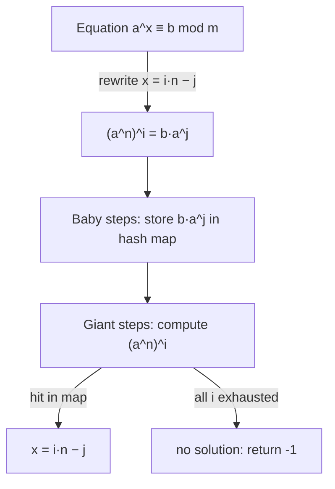

# Discrete Logarithm & Baby-Step Giant-Step (BSGS) — Junior Level

> **One-line summary:** The discrete logarithm problem asks you to find `x` with `a^x ≡ b (mod m)`. Baby-Step Giant-Step (BSGS) is a meet-in-the-middle algorithm that solves it in `O(√m)` time and space: write `x = i·n − j`, store all "baby steps" `a^j` in a hash map, then take "giant steps" `b·(a^{-n})^i` until one lands in the map.

---

## Table of Contents

1. [Introduction](#introduction)
2. [Prerequisites](#prerequisites)
3. [Glossary](#glossary)
4. [Core Concepts](#core-concepts)
5. [Big-O Summary](#big-o-summary)
6. [Real-World Analogies](#real-world-analogies)
7. [Pros & Cons](#pros--cons)
8. [Step-by-Step Walkthrough](#step-by-step-walkthrough)
9. [Code Examples](#code-examples)
10. [Coding Patterns](#coding-patterns)
11. [Error Handling](#error-handling)
12. [Performance Tips](#performance-tips)
13. [Best Practices](#best-practices)
14. [Edge Cases & Pitfalls](#edge-cases--pitfalls)
15. [Common Mistakes](#common-mistakes)
16. [Cheat Sheet](#cheat-sheet)
17. [Visual Animation](#visual-animation)
18. [Summary](#summary)
19. [Further Reading](#further-reading)

---

## Introduction

You already know ordinary logarithms: `log_2 8 = 3` because `2^3 = 8`. The **discrete logarithm** is the same question, but inside *modular* arithmetic. Given a base `a`, a target `b`, and a modulus `m`, find an exponent `x` such that

```
a^x ≡ b   (mod m).
```

For example, working mod `m = 13` with base `a = 2`: what power of `2` equals `3`? Trying powers: `2^1 = 2`, `2^2 = 4`, `2^3 = 8`, `2^4 = 16 ≡ 3`. So `x = 4` is a discrete log of `3` to base `2` mod `13`. We write `x = log_2 3 (mod 13)`.

The catch is that, unlike ordinary logarithms, there is **no smooth curve to invert**. The values `a^1, a^2, a^3, …` jump around mod `m` in a scrambled-looking order, so you cannot binary-search them. The most obvious method is to try `x = 0, 1, 2, …` one at a time, multiplying by `a` each step until you hit `b`. That brute-force scan costs `O(m)` time — fine for `m = 13`, hopeless for `m = 10^{18}`.

> **Baby-Step Giant-Step (BSGS)** is a classic trick that cuts this to `O(√m)` time and `O(√m)` memory.

The idea is **meet-in-the-middle** (the same idea as sibling topic `15-divide-and-conquer/06`). Instead of one long scan of length `m`, you split the exponent into two shorter scans of length about `√m` each: a list of "baby steps" you store, and a list of "giant steps" you look up. When a giant step matches a stored baby step, you have found `x`. Two scans of `√m` cost far less than one scan of `m` — that is the whole win.

This file builds the discrete log problem and BSGS from the ground up, with a fully worked small example you can check by hand. Discrete logarithm is not just an academic puzzle: its presumed *hardness* for large `m` is exactly what makes the **Diffie-Hellman** key exchange and other public-key cryptography secure. BSGS is the textbook attack that shows *how hard* (`√m`, not `m`) the problem is, and why cryptographers pick `m` with hundreds of digits.

---

## Prerequisites

Before reading this file you should be comfortable with:

- **Modular arithmetic** — `(a · b) mod m`, `(a + b) mod m`, and why we reduce after each operation. (See sibling `02-modular-arithmetic`.)
- **Modular exponentiation (fast power)** — computing `a^x mod m` in `O(log x)` by squaring. (See `02-modular-arithmetic` / `04-fermat-euler`.)
- **gcd and the Euclidean algorithm** — `gcd(a, m)` and what it means for two numbers to be coprime. (See sibling `01-gcd-lcm`.)
- **Modular inverse** — the value `a^{-1}` with `a · a^{-1} ≡ 1 (mod m)`, computed via the extended Euclidean algorithm or Fermat's little theorem. (See sibling `06-extended-euclidean-modular-inverse`.)
- **Hash maps / dictionaries** — `O(1)` average insert and lookup, the data structure that makes BSGS fast.
- **Big-O notation** — `O(m)`, `O(√m)`, `O(log m)`.

Optional but helpful:

- A glance at **meet-in-the-middle** as a general technique (sibling `15-divide-and-conquer/06`).
- Familiarity with **primitive roots** — a base `a` whose powers cover every nonzero residue (sibling `12-primitive-roots-discrete-root`).

---

## Glossary

| Term | Meaning |
|------|---------|
| **Discrete logarithm** | An exponent `x` with `a^x ≡ b (mod m)`. Written `x = log_a b (mod m)`. |
| **Base `a`** | The number being raised to a power. |
| **Target `b`** | The value we want `a^x` to equal mod `m`. |
| **Modulus `m`** | The number we reduce by. May be prime or composite. |
| **Brute force / trial scan** | Try `x = 0, 1, 2, …`, multiplying by `a` each step until `a^x ≡ b`. Cost `O(m)`. |
| **Meet-in-the-middle** | Split a search into two halves, store one half, look up the other. Trades memory for time. |
| **Baby step** | One of the precomputed small powers `a^0, a^1, …, a^{n-1}`, stored in a hash map. |
| **Giant step** | A jump of `n` exponents at once, via multiplying by `a^{-n}` (or `a^n`). |
| **`n = ⌈√m⌉`** | The block size: the number of baby steps and the size of each giant jump. |
| **Modular inverse `a^{-1}`** | The value with `a · a^{-1} ≡ 1 (mod m)`; exists iff `gcd(a, m) = 1`. |
| **Order of `a`** | The smallest `d > 0` with `a^d ≡ 1 (mod m)`. The discrete log is unique only modulo this order. |
| **Coprime** | `gcd(a, m) = 1`; required for `a` to be invertible mod `m`. |

---

## Core Concepts

### 1. The Discrete Log Problem

We want the smallest non-negative `x` with `a^x ≡ b (mod m)`. Note:

- A solution may **not exist**. If `a = 2`, `m = 7`, the powers of `2` are `2, 4, 1, 2, 4, 1, …` — they only ever hit `{1, 2, 4}`, so `2^x ≡ 3 (mod 7)` has no solution.
- When a solution exists it is **not unique**: if `a^x ≡ b`, then `a^{x + d} ≡ b` too, where `d` is the order of `a` (because `a^d ≡ 1`). So solutions repeat with period `d`. We usually report the **smallest** one.

### 2. The Key Rewrite: `x = i·n − j`

BSGS rests on a single algebraic rewrite. Pick the block size `n = ⌈√m⌉`. Any exponent `x` in the range `0 ≤ x < m` can be written as

```
x = i·n − j,    where   1 ≤ i ≤ n   and   0 ≤ j < n.
```

(Think of `i·n` as overshooting in big jumps, and `−j` as stepping back a little.) Substitute into `a^x ≡ b`:

```
a^{i·n − j} ≡ b
a^{i·n} ≡ b · a^{j}        (multiply both sides by a^j)
(a^{n})^{i} ≡ b · a^{j}.
```

Now the unknown `i` is isolated on the **left** and the unknown `j` on the **right**. The two sides "meet in the middle".

### 3. Baby Steps (the right side)

Compute and store, for every `j = 0, 1, …, n−1`, the value `b · a^{j} (mod m)` in a hash map:

```
map[ b · a^{j} mod m ] = j
```

These are the **baby steps**: `n` cheap multiplications, each advancing `j` by one. The hash map lets us later ask "is some value equal to one of these?" in `O(1)`.

### 4. Giant Steps (the left side)

Let `G = a^{n} (mod m)`. Compute `G^{i} = (a^{n})^{i}` for `i = 1, 2, …, n`. Each is one **giant step** (a jump of `n` exponents). After each giant step, look it up in the map:

```
for i = 1 .. n:
    cur = G^i mod m
    if cur is in map:
        j = map[cur]
        return i*n - j        # this is x
```

When `(a^{n})^{i} = b · a^{j}`, the rewrite says `a^{i·n − j} ≡ b`, so `x = i·n − j` is the answer.

### 5. Why `√m` Instead of `m`

The baby-step loop runs `n ≈ √m` times. The giant-step loop runs `n ≈ √m` times. So total work is about `2√m` multiplications plus `√m` map operations — versus `m` for the brute-force scan. For `m = 10^{12}`, that is roughly two million operations instead of a trillion.

### 6. The Inverse-Form Variant

The form above uses `b · a^j` on the right. A very common equivalent form moves the inverse to the giant side: write `x = i·n + j` and check `b · (a^{-n})^{i}` against stored `a^{j}`. Both are correct; this file's worked example uses the `b·a^j` / `(a^n)^i` form, and `middle.md` covers the inverse form in detail. Either way you need a hash map of `√m` entries and `√m` giant steps.

---

## Big-O Summary

| Operation | Time | Space | Notes |
|-----------|------|-------|-------|
| Brute-force trial scan | **O(m)** | O(1) | Multiply by `a` until you hit `b`. Hopeless for large `m`. |
| BSGS baby-step phase | O(√m) | O(√m) | Fill the hash map with `n = ⌈√m⌉` entries. |
| BSGS giant-step phase | O(√m) | — | Up to `n` lookups, each `O(1)` average. |
| **BSGS total** | **O(√m)** | **O(√m)** | The headline result. |
| One modular multiply | O(1) | — | For fixed-width `m`. |
| Computing `a^n mod m` (fast power) | O(log n) | O(1) | One-time setup for the giant step size. |
| Pollard's rho for discrete log | O(√m) *expected* | **O(1)** | Same time, far less memory (see `senior.md`). |

The headline number is **`O(√m)` time and `O(√m)` space** — a square-root speedup over brute force, at the cost of a hash map of size `√m`.

---

## Real-World Analogies

| Concept | Analogy |
|---------|---------|
| Discrete log scan (`O(m)`) | Searching a huge unsorted ledger one line at a time for a single entry. |
| Meet-in-the-middle | Two friends start a tunnel from opposite ends; they meet in the middle, each digging only half. |
| Baby steps | Writing down every landmark in the first `√m` blocks of a street so you can recognize them later. |
| Giant steps | Driving `√m` blocks at a time and, at each stop, checking your list of landmarks for a match. |
| The hash map | A phone book: instead of scanning names, you jump straight to "is this name listed?" in one glance. |
| No solution exists | Looking up a phone number that was never assigned — you can scan the whole book and never find it. |

Where the analogy breaks: in BSGS the two "halves" are not independent searches — they are two encodings of the *same* equation `a^x ≡ b`, deliberately arranged so a baby value and a giant value coincide exactly when `x` is the answer.

---

## Pros & Cons

| Pros | Cons |
|------|------|
| `O(√m)` time — a square-root speedup over the `O(m)` scan. | `O(√m)` **memory** — the hash map can be huge for very large `m`. |
| Works for **any** modulus once `gcd(a, m) = 1` (and with a small reduction otherwise). | Still exponential in the *bit length* of `m`; useless against crypto-sized `m` (hundreds of digits). |
| Deterministic — always finds the answer if one exists, or reports "no solution". | Needs a modular inverse (extended Euclid / Fermat) for the giant step. |
| Simple to implement: a hash map plus two loops. | Reporting the *smallest* `x` needs a little care (scan order matters). |
| Foundation for many number-theory and crypto attacks. | Memory-heavy variant; Pollard's rho trades it for `O(1)` space but is randomized. |

**When to use:** modulus up to roughly `10^{12}`–`10^{14}` (so `√m` entries fit in memory), a single discrete-log query, or as a teaching/benchmark baseline.

**When NOT to use:** cryptographic-size `m` (BSGS cannot break a 2048-bit Diffie-Hellman — that needs `~10^{300}` memory); when memory is tight (prefer Pollard's rho); when the modulus is highly composite and a specialized algorithm (Pohlig-Hellman) is far faster.

---

## Step-by-Step Walkthrough

Solve `2^x ≡ 3 (mod 13)` with BSGS. We know the answer is `x = 4` (from the introduction); let us see BSGS find it.

**Setup.** `a = 2`, `b = 3`, `m = 13`. Block size `n = ⌈√13⌉ = 4`.

**Baby steps.** Store `b · a^{j} mod 13` for `j = 0, 1, 2, 3`:

```
j = 0:  3 · 2^0 = 3 · 1  = 3    →  map[3]  = 0
j = 1:  3 · 2^1 = 3 · 2  = 6    →  map[6]  = 1
j = 2:  3 · 2^2 = 3 · 4  = 12   →  map[12] = 2
j = 3:  3 · 2^3 = 3 · 8  = 24 ≡ 11  →  map[11] = 3
```

So `map = {3:0, 6:1, 12:2, 11:3}`.

**Giant step size.** `G = a^{n} = 2^4 = 16 ≡ 3 (mod 13)`.

**Giant steps.** Compute `G^{i} = 3^{i} mod 13` for `i = 1, 2, …` and check the map:

```
i = 1:  G^1 = 3              →  3 IS in map!  map[3] = 0  (j = 0)
```

A match on the very first giant step. The rewrite gives:

```
x = i·n − j = 1·4 − 0 = 4.
```

**Verify:** `2^4 = 16 ≡ 3 (mod 13)`. Correct.

Notice we did at most `4` baby steps and `1` giant step — far fewer than scanning `x = 0, 1, 2, 3, 4`. On this tiny example the saving is small, but for `m = 10^{12}` the difference is a million operations versus a trillion.

**What if there were no solution?** Suppose we asked `2^x ≡ 5 (mod 13)`. We would build the baby map, take all `n = 4` giant steps `i = 1, 2, 3, 4`, find no match, and correctly report **no solution exists**. (The order of `2` mod `13` is `12`, and `5` happens not to be a power of `2` mod `13`... actually `2^9 = 512 ≡ 5`, so a solution does exist — `2` is a primitive root mod `13`. The point stands for a base that does *not* generate `5`.)

---

## Code Examples

### Example: BSGS for `a^x ≡ b (mod m)` (assumes `gcd(a, m) = 1`)

Returns the smallest non-negative `x`, or `-1` if no solution exists.

#### Go

```go
package main

import (
	"fmt"
	"math"
)

// modpow computes a^e mod m.
func modpow(a, e, m int64) int64 {
	a %= m
	if a < 0 {
		a += m
	}
	res := int64(1)
	for e > 0 {
		if e&1 == 1 {
			res = res * a % m
		}
		a = a * a % m
		e >>= 1
	}
	return res
}

// bsgs returns the smallest x >= 0 with a^x ≡ b (mod m), or -1 if none.
// Assumes gcd(a, m) == 1.
func bsgs(a, b, m int64) int64 {
	a %= m
	b %= m
	n := int64(math.Ceil(math.Sqrt(float64(m))))

	// Baby steps: map[b * a^j mod m] = j.
	table := make(map[int64]int64)
	cur := b % m
	for j := int64(0); j < n; j++ {
		// keep the smallest j for each value (so we get the smallest x later)
		if _, ok := table[cur]; !ok {
			table[cur] = j
		}
		cur = cur * a % m
	}

	// Giant step factor G = a^n mod m.
	G := modpow(a, n, m)
	gi := int64(1) // G^0
	for i := int64(1); i <= n; i++ {
		gi = gi * G % m // gi = G^i
		if j, ok := table[gi]; ok {
			x := i*n - j
			if x >= 0 {
				return x
			}
		}
	}
	return -1
}

func main() {
	fmt.Println(bsgs(2, 3, 13))  // 4
	fmt.Println(bsgs(2, 5, 13))  // 9
	fmt.Println(bsgs(3, 1, 13))  // 0  (3^0 = 1)
}
```

#### Java

```java
import java.util.HashMap;
import java.util.Map;

public class BSGS {
    static long modpow(long a, long e, long m) {
        a %= m;
        if (a < 0) a += m;
        long res = 1;
        while (e > 0) {
            if ((e & 1) == 1) res = res * a % m;
            a = a * a % m;
            e >>= 1;
        }
        return res;
    }

    // smallest x >= 0 with a^x ≡ b (mod m), or -1. Assumes gcd(a, m) == 1.
    static long bsgs(long a, long b, long m) {
        a %= m;
        b %= m;
        long n = (long) Math.ceil(Math.sqrt((double) m));

        Map<Long, Long> table = new HashMap<>();
        long cur = b % m;
        for (long j = 0; j < n; j++) {
            table.putIfAbsent(cur, j); // keep smallest j
            cur = cur * a % m;
        }

        long G = modpow(a, n, m);
        long gi = 1;
        for (long i = 1; i <= n; i++) {
            gi = gi * G % m; // G^i
            Long j = table.get(gi);
            if (j != null) {
                long x = i * n - j;
                if (x >= 0) return x;
            }
        }
        return -1;
    }

    public static void main(String[] args) {
        System.out.println(bsgs(2, 3, 13)); // 4
        System.out.println(bsgs(2, 5, 13)); // 9
        System.out.println(bsgs(3, 1, 13)); // 0
    }
}
```

#### Python

```python
import math


def bsgs(a, b, m):
    """Smallest x >= 0 with a^x ≡ b (mod m), or -1. Assumes gcd(a, m) == 1."""
    a %= m
    b %= m
    n = math.isqrt(m - 1) + 1  # ceil(sqrt(m))

    # Baby steps: table[b * a^j mod m] = j (keep smallest j).
    table = {}
    cur = b % m
    for j in range(n):
        if cur not in table:
            table[cur] = j
        cur = cur * a % m

    # Giant steps: G = a^n; check G^i against the table.
    G = pow(a, n, m)
    gi = 1
    for i in range(1, n + 1):
        gi = gi * G % m  # G^i
        if gi in table:
            x = i * n - table[gi]
            if x >= 0:
                return x
    return -1


if __name__ == "__main__":
    print(bsgs(2, 3, 13))  # 4
    print(bsgs(2, 5, 13))  # 9
    print(bsgs(3, 1, 13))  # 0
```

**What it does:** builds the baby-step hash map of `b·a^j`, then walks giant steps `G^i = (a^n)^i` until one is found in the map, returning `x = i·n − j`.
**Run:** `go run main.go` | `javac BSGS.java && java BSGS` | `python bsgs.py`

---

## Coding Patterns

### Pattern 1: Brute-Force Oracle (the thing you test against)

**Intent:** Before trusting BSGS, solve discrete log the obvious slow way and check they agree on small inputs.

```python
def brute_dlog(a, b, m):
    a %= m
    b %= m
    cur = 1 % m          # a^0
    for x in range(m):   # try x = 0, 1, 2, ...
        if cur == b:
            return x
        cur = cur * a % m
    return -1
```

This is `O(m)` — too slow for large `m`, but a perfect correctness oracle. `bsgs(a, b, m)` must return the same smallest `x`.

### Pattern 2: Smallest Solution

**Intent:** Discrete logs repeat with period = order of `a`. To return the *smallest* `x`, store the **smallest** `j` for each baby value (use "insert only if absent") and scan `i` from `1` upward. The first match found this way gives the smallest `x`. (Details in `middle.md`.)

### Pattern 3: Reporting "No Solution"

**Intent:** If you finish all `n` giant steps with no map hit, the equation has no solution — return a sentinel like `-1`. Never loop forever.



---

## Error Handling

| Error | Cause | Fix |
|-------|-------|-----|
| Overflow on `a * a` | Product exceeds 64-bit before `mod`. | Reduce after every multiply; use 64-bit and, for `m` near `2^{63}`, 128-bit or `__int128`. |
| Wrong answer when `gcd(a,m) > 1` | Giant step needs `a` invertible; plain BSGS assumes coprime. | Use the general-modulus reduction (see `middle.md`) or check `gcd` first. |
| Infinite loop | Forgot to bound giant steps at `n`. | Loop `i` only up to `n`; then return "no solution". |
| Returns a non-smallest `x` | Stored the *largest* `j`, or scanned `i` downward. | Keep smallest `j` ("insert if absent"); scan `i` upward. |
| Missing `x = 0` case | `a^0 = 1`; if `b ≡ 1`, the answer is `0`. | Baby step `j = 0` stores `b·a^0 = b`; handle `b ≡ 1` correctly. |
| Negative residue | `%` can be negative in Go/Java for negative inputs. | Normalize `((x % m) + m) % m`. |

---

## Performance Tips

- **Reserve the hash map** up front to size `√m` to avoid repeated rehashing as you insert baby steps.
- **Precompute `a^n` once** with fast power, then take giant steps by repeated multiplication (`gi = gi * G`), not by re-exponentiating each `i`.
- **Insert baby steps if absent** so the map keeps the smallest `j` — this both gives the smallest `x` and avoids redundant overwrites.
- **Reduce mod `m` after every multiply**, never let products grow unbounded.
- **Use `isqrt`** (integer square root) for `n` to avoid floating-point rounding errors near perfect squares; add 1 to be safe (`n = ⌈√m⌉`).

---

## Best Practices

- Always test BSGS against the brute-force oracle (Pattern 1) on random small `(a, b, m)` before trusting it on large inputs.
- State your block size once: `n = ⌈√m⌉`. Both phases use the same `n`.
- Decide up front whether you want the smallest `x` or any `x`, and document it; the scan order and insert policy depend on it.
- Check `gcd(a, m)` if the modulus might not be prime; plain BSGS assumes `gcd(a, m) = 1`.
- Always return a clear sentinel (`-1`) for "no solution" and handle it at the call site.

---

## Edge Cases & Pitfalls

- **`b ≡ 1 (mod m)`** — the answer is `x = 0` (`a^0 = 1`). The `j = 0` baby step `b·a^0 = b` handles it; double-check your code returns `0`, not `n` (the order).
- **No solution** — `b` is not in the subgroup generated by `a`. After all `n` giant steps with no hit, return `-1`.
- **`gcd(a, m) > 1`** — plain BSGS breaks because `a` is not invertible mod `m`; you need the reduction in `middle.md`.
- **`m = 1`** — everything is `≡ 0`; treat as a trivial edge case (any `x` works; return `0`).
- **Perfect-square `m`** — make sure `n = ⌈√m⌉` truly covers `m`; floating-point `sqrt` can round down. Use `isqrt`.
- **Multiple solutions** — they differ by the order of `a`. Returning the smallest is a deliberate choice; some problems accept any valid `x`.

---

## Common Mistakes

1. **Assuming a solution always exists** — many `(a, b, m)` have none; always handle the `-1` case.
2. **Forgetting the modular inverse for the inverse-form variant** — `a^{-n}` requires `gcd(a, m) = 1`.
3. **Off-by-one in `n`** — using `n = ⌊√m⌋` may miss the last block; use `⌈√m⌉` (and let `i` run to `n`).
4. **Overwriting baby-step values** — storing the largest `j` instead of the smallest yields a non-minimal `x`.
5. **Letting products overflow** — `a * a` before reduction silently wraps for large `m`.
6. **Confusing the two forms** — mixing `b·a^j` with `(a^{-n})^i`; pick one consistent rewrite (`x = i·n − j` *or* `x = i·n + j`).
7. **Returning `n` (the order) instead of `0`** when `b ≡ 1` — a classic smallest-solution bug.

---

## Cheat Sheet

| Question | Tool | Formula |
|----------|------|---------|
| Solve `a^x ≡ b (mod m)` | BSGS | `x = i·n − j` |
| Block size | ceil sqrt | `n = ⌈√m⌉` |
| Baby step value | store in map | `map[b · a^{j} mod m] = j` |
| Giant step factor | fast power | `G = a^{n} mod m` |
| Giant step check | map lookup | is `G^{i}` in `map`? |
| Smallest `x` | smallest `j`, increasing `i` | first hit gives min `x` |
| No solution | exhaust giant steps | return `-1` |
| Brute force (oracle) | scan `x = 0..m` | `O(m)` |

Core algorithm:

```
BSGS(a, b, m):                  # assumes gcd(a, m) = 1
    n = ceil(sqrt(m))
    map = {}                    # baby steps
    cur = b mod m
    for j = 0 .. n-1:
        if cur not in map: map[cur] = j
        cur = cur * a mod m
    G = a^n mod m               # giant step factor
    gi = 1
    for i = 1 .. n:
        gi = gi * G mod m       # gi = G^i
        if gi in map: return i*n - map[gi]
    return -1
# cost: O(sqrt(m)) time and space
```

---

## Visual Animation

> See [`animation.html`](./animation.html) for an interactive visualization.
>
> The animation demonstrates:
> - Filling the baby-step table `j → b·a^{j}` one entry at a time
> - Taking giant steps `(a^{n})^{i}` and checking each against the table
> - Highlighting the collision and reading off `x = i·n − j`
> - Step / Run / Reset controls with editable `a`, `b`, `m`

---

## Summary

The discrete logarithm problem — find `x` with `a^x ≡ b (mod m)` — has no smooth inverse, so the naive solution is an `O(m)` scan. Baby-Step Giant-Step turns that scan into a **meet-in-the-middle** search: rewrite `x = i·n − j` with `n = ⌈√m⌉`, store the `√m` baby steps `b·a^{j}` in a hash map, then take `√m` giant steps `(a^{n})^{i}` and look each up. A collision gives `x = i·n − j` in `O(√m)` time and space — a square-root speedup. The technique assumes `gcd(a, m) = 1` (a small reduction handles the rest), reports `-1` when no solution exists, and can return the *smallest* `x` with a little care. Its `√m` cost is exactly why cryptographers choose moduli with hundreds of digits: BSGS proves discrete log is "only" `√m`-hard, and `√(10^{300})` is still astronomically large, keeping Diffie-Hellman secure.

---

## Further Reading

- *Handbook of Applied Cryptography* (Menezes, van Oorschot, Vanstone) — Chapter 3, the discrete logarithm problem and BSGS.
- Sibling topic `02-modular-arithmetic` — modular multiplication and fast exponentiation.
- Sibling topic `06-extended-euclidean-modular-inverse` — computing `a^{-1}` for the giant step.
- Sibling topic `12-primitive-roots-discrete-root` — when `a` generates the whole group, and the related discrete-root problem.
- Sibling topic `15-divide-and-conquer/06-meet-in-the-middle` — the general meet-in-the-middle paradigm.
- cp-algorithms.com — "Discrete Logarithm" (Baby-step giant-step) with the general-modulus extension.
