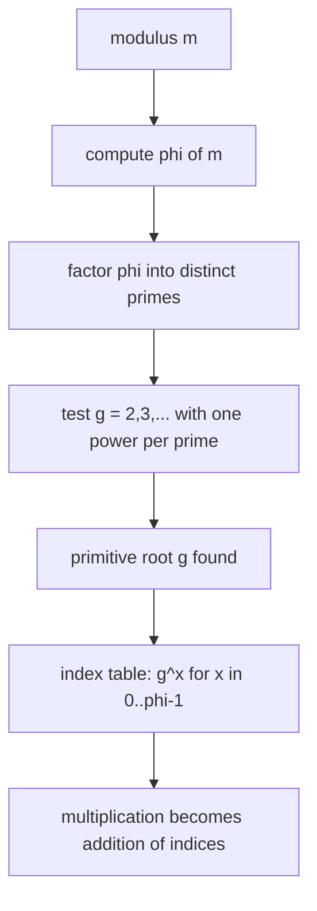

# Primitive Roots & Discrete Root — Junior Level

> **One-line summary:** The **order** of `a` mod `m` is the smallest `e > 0` with `a^e ≡ 1`. A **primitive root** `g` mod `m` is an element whose powers `g^0, g^1, g^2, …` cycle through *every* unit (number coprime to `m`) before repeating — a single "generator" of the whole multiplicative group. With a primitive root you turn hard multiplicative questions (like solving `x^k ≡ a`) into easy additive ones.

---

## Table of Contents

1. [Introduction](#introduction)
2. [Prerequisites](#prerequisites)
3. [Glossary](#glossary)
4. [Core Concepts](#core-concepts)
5. [Big-O Summary](#big-o-summary)
6. [Real-World Analogies](#real-world-analogies)
7. [Pros & Cons](#pros--cons)
8. [Step-by-Step Walkthrough](#step-by-step-walkthrough)
9. [Code Examples](#code-examples)
10. [Coding Patterns](#coding-patterns)
11. [Error Handling](#error-handling)
12. [Performance Tips](#performance-tips)
13. [Best Practices](#best-practices)
14. [Edge Cases & Pitfalls](#edge-cases--pitfalls)
15. [Common Mistakes](#common-mistakes)
16. [Cheat Sheet](#cheat-sheet)
17. [Visual Animation](#visual-animation)
18. [Summary](#summary)
19. [Further Reading](#further-reading)

---

## Introduction

Fix a small modulus, say `m = 7`. The numbers `1, 2, 3, 4, 5, 6` are all coprime to `7`; they form the **units** mod `7`. Now pick `g = 3` and compute its powers:

```
3^1 = 3
3^2 = 9  ≡ 2
3^3 = 6
3^4 = 18 ≡ 4
3^5 = 12 ≡ 5
3^6 = 15 ≡ 1   ← back to 1
```

The list `3, 2, 6, 4, 5, 1` is exactly the set `{1, 2, 3, 4, 5, 6}` rearranged. The powers of `3` visited **every** unit before looping back to `1`. We say `3` is a **primitive root** modulo `7`: a single number whose powers generate the whole group of units.

Compare with `g = 2`:

```
2^1 = 2,  2^2 = 4,  2^3 = 1   ← back to 1 already
```

`2` cycles through only `{2, 4, 1}` — a smaller loop of length `3`. So `2` is **not** a primitive root mod `7`; its **order** (the length of its cycle) is `3`, not `6`.

That is the whole topic in two examples. There are exactly two quantities to keep straight:

- The **order** of an element `a`: the smallest exponent `e > 0` with `a^e ≡ 1 (mod m)`. It is the length of `a`'s cycle.
- A **primitive root** `g`: an element whose order equals the *largest possible* value, namely `φ(m)` (Euler's totient — the number of units). Its cycle is the full group.

Why care? Because once you have a primitive root `g`, *every* unit can be written as `g^x` for a unique exponent `x` (called the **index** or **discrete logarithm**). Multiplication of units becomes addition of exponents, and the painful **discrete root problem** — solving `x^k ≡ a (mod m)` — collapses into a *linear* congruence in the exponent. This is the bridge between this topic, discrete logarithms (sibling `11-discrete-log-bsgs`), and the Number Theoretic Transform (sibling `13-ntt`), which needs a primitive root of a special prime to do fast polynomial multiplication.

Primitive roots do not exist for every modulus — only for `m ∈ {1, 2, 4, p^k, 2p^k}` where `p` is an odd prime. For everything else the group of units is not a single cycle. At junior level we focus on the common, well-behaved case: **`m` is an odd prime `p`**, where a primitive root always exists.

---

## Prerequisites

Before reading this file you should be comfortable with:

- **Modular arithmetic** — `(a · b) mod m`, `(a + b) mod m`, and what `a ≡ b (mod m)` means. See sibling `02-modular-arithmetic`.
- **Coprimality and `gcd`** — `a` is a *unit* mod `m` iff `gcd(a, m) = 1`. See sibling `01-gcd-lcm`.
- **Euler's totient `φ(m)`** — the count of integers in `1..m` coprime to `m`. For a prime `p`, `φ(p) = p − 1`. See sibling `04-fermat-euler`.
- **Fermat's little theorem** — for prime `p` and `a` not divisible by `p`, `a^{p-1} ≡ 1 (mod p)`. See sibling `04-fermat-euler`.
- **Binary exponentiation** — computing `a^e mod m` in `O(log e)`. See sibling `26-binary-exponentiation`.
- **Prime factorization** — finding the distinct primes dividing a number. See sibling `03-prime-sieves`.

Optional but helpful:

- A glance at **discrete logarithm** (sibling `11-discrete-log-bsgs`), since a primitive root is what makes a discrete log well-defined.

---

## Glossary

| Term | Meaning |
|------|---------|
| **Unit mod `m`** | An integer `a` with `gcd(a, m) = 1`. The units form a group under multiplication. |
| **`Z/mZ*` (group of units)** | The set of all units mod `m`, with multiplication. Has `φ(m)` elements. |
| **Order of `a`**, `ord_m(a)` | The smallest `e > 0` with `a^e ≡ 1 (mod m)`. The length of `a`'s power-cycle. |
| **Euler's totient `φ(m)`** | The number of units mod `m`. `φ(p) = p − 1` for prime `p`. |
| **Primitive root `g`** | A unit whose order equals `φ(m)`; its powers generate *all* units. |
| **Generator** | Another word for primitive root — it "generates" the whole group. |
| **Cyclic group** | A group all of whose elements are powers of one element. `Z/mZ*` is cyclic iff a primitive root exists. |
| **Index / discrete log** | If `g` is a primitive root, the unique `x` with `g^x ≡ a` is the index (discrete log) of `a` base `g`. |
| **Discrete root** | A solution `x` to `x^k ≡ a (mod m)` — the modular analogue of a `k`-th root. |
| **`k`-th residue** | A value `a` that *has* a `k`-th root mod `m` (i.e. `x^k ≡ a` is solvable). |

---

## Core Concepts

### 1. The Order of an Element

For a unit `a` mod `m`, look at the sequence `a^1, a^2, a^3, …`. Since there are only finitely many residues, the sequence must eventually repeat, and because `a` is a unit it cycles back exactly to `1`. The **order** `ord_m(a)` is the first exponent where that happens:

```
ord_m(a) = smallest e > 0 such that a^e ≡ 1 (mod m)
```

Example (`m = 7`): `ord_7(2) = 3` because `2^3 = 8 ≡ 1`, and no smaller positive exponent works. `ord_7(3) = 6` because we needed all six steps.

**Key fact:** the order always *divides* `φ(m)`. So mod `7`, every order is a divisor of `φ(7) = 6`, i.e. one of `{1, 2, 3, 6}`. This is a direct consequence of Lagrange's theorem and is proved in [`professional.md`](./professional.md). It is also why finding the order is fast: you only need to test the divisors of `φ(m)`, not all exponents up to `φ(m)`.

### 2. What a Primitive Root Is

A **primitive root** mod `m` is a unit `g` whose order is the *maximum possible*, namely `φ(m)`:

```
g is a primitive root  ⇔  ord_m(g) = φ(m)
```

When this holds, the powers `g^0, g^1, …, g^{φ(m)-1}` are all distinct and run through every single unit. The group of units is a single big cycle, and `g` is the starting point that walks the whole cycle.

For a prime `p`, `φ(p) = p − 1`, so a primitive root mod `p` has order `p − 1`, and its powers list all of `1, 2, …, p − 1`.

### 3. When Do Primitive Roots Exist?

Not every modulus has one. The exact list (proved in [`professional.md`](./professional.md)) is:

```
A primitive root mod m exists  ⇔  m ∈ { 1, 2, 4, p^k, 2·p^k }   (p an odd prime, k ≥ 1)
```

So `7`, `9 = 3²`, `25 = 5²`, `14 = 2·7`, `4` all have primitive roots; but `8`, `12`, `15`, `16`, `24` do **not**. The classic non-example is `m = 8`: the units are `{1, 3, 5, 7}` and every one of them squares to `1`, so no element has order `4 = φ(8)` — the group is not a single cycle. At junior level, just remember: **odd primes always work**, and that is the case we use most.

### 4. The Test for a Primitive Root

How do you check whether a candidate `g` is a primitive root mod a prime `p` (so `φ = p − 1`)? You do **not** compute the order directly. Instead use this shortcut:

```
g is a primitive root mod p
  ⇔  g^((p-1)/q) ≢ 1 (mod p)  for every prime q dividing (p − 1)
```

The idea: if `g` were *not* a generator, its order would be a proper divisor of `p − 1`, which means it would divide `(p−1)/q` for some prime `q | (p−1)`, forcing `g^((p-1)/q) ≡ 1`. So if none of those special powers equals `1`, the order cannot be a proper divisor and must be the full `p − 1`. You only test one power per prime factor of `p − 1` — very fast. The correctness proof is in [`professional.md`](./professional.md).

### 5. How Many Primitive Roots Are There?

If a primitive root exists at all, the number of them is:

```
number of primitive roots mod m = φ(φ(m))
```

For `m = 7`: `φ(7) = 6`, and `φ(6) = 2`, so there are exactly **2** primitive roots mod `7` (they are `3` and `5`). This also tells you primitive roots are *common* — you usually find one by testing small candidates `2, 3, 4, …` and one of the first few works.

### 6. The Payoff: Index / Discrete Log

Once `g` is a primitive root mod `p`, every unit `a` equals `g^x` for a unique `x` in `0..p−2`. That `x` is the **index** (or discrete log) of `a`. Indices turn multiplication into addition:

```
if a = g^x and b = g^y, then a·b = g^{x+y}, and a^k = g^{kx}
```

This is the engine behind solving the **discrete root** problem `x^k ≡ a`: write `x = g^Y` and `a = g^A`, and the equation becomes the *linear* congruence `k·Y ≡ A (mod p−1)`. Middle level shows the full recipe; finding the index `A` itself uses baby-step giant-step from sibling `11-discrete-log-bsgs`.

---

## Big-O Summary

| Operation | Time | Notes |
|-----------|------|-------|
| Compute `a^e mod m` (one power) | **O(log e)** | Binary exponentiation. |
| Order of `a` (knowing `φ` and its factorization) | **O(d · log φ)** | `d` = number of divisors of `φ`; test divisors. |
| Order of `a` (factor-`φ` reduction method) | **O(log² φ)**-ish | Start from `φ`, divide out prime factors. |
| Test if `g` is a primitive root | **O(ω(φ) · log φ)** | `ω(φ)` = number of *distinct* prime factors of `φ`. |
| Find *a* primitive root | **O(ans · ω(φ) · log φ)** | Try `g = 2, 3, …`; the answer is usually tiny. |
| Factor `φ(m)` (prerequisite) | depends | Trial division `O(√φ)`, or Pollard-Rho (sibling `09`). |
| Number of primitive roots | **O(√φ)** | Just `φ(φ(m))`. |

The dominant cost is almost always **factoring `φ(m)`**. Once you have the distinct primes of `φ`, the primitive-root test is a handful of modular exponentiations — essentially instant.

---

## Real-World Analogies

| Concept | Analogy |
|---------|---------|
| Order of `a` | The number of steps a clock hand of "size `a`" takes to return to 12 o'clock. |
| Primitive root | A clock hand that visits *every* hour mark before returning to 12 — it never skips an hour. |
| Non-primitive element | A hand that only ever lands on a few marks (e.g. only even hours) and cycles among them. |
| `Z/mZ*` is cyclic | The dial is one continuous loop you can walk entirely from a single starting stride. |
| Index / discrete log | The "odometer reading" telling you how many strides of `g` it took to reach `a`. |
| Discrete root `x^k ≡ a` | "Which stride count, multiplied by `k`, lands me on `a`'s reading?" — a division in the odometer world. |

Where the analogy breaks: a real clock's hand always moves by a fixed angle, so it is "additive"; the multiplicative group is additive only *after* you switch to indices via a primitive root. That switch is exactly the magic the primitive root provides.

---

## Pros & Cons

| Pros | Cons |
|------|------|
| Turns multiplication of units into addition of exponents (huge simplification). | Only exists for `m ∈ {1, 2, 4, p^k, 2p^k}` — not all moduli. |
| Makes the discrete root `x^k ≡ a` solvable via a single linear congruence. | Needs the factorization of `φ(m)`, which can be expensive. |
| Primitive roots are plentiful (`φ(φ(m))` of them) and usually small. | The index (discrete log) itself is hard to compute (no fast general algorithm). |
| Foundation for NTT, Diffie-Hellman, and random test-data generation. | The smallest primitive root has no simple closed form (you must search). |
| The generator test is fast: one power per prime factor of `φ`. | Easy to confuse "order" with "value" and `φ(m)` with `m`. |

**When to use:** solving `x^k ≡ a`, building an NTT-friendly prime, implementing Diffie-Hellman, generating a full-period pseudo-random sequence of units, or any time you want to linearize a multiplicative problem.

**When NOT to use:** when `m` is not of the special form (no primitive root exists — use the Chinese Remainder Theorem to split into prime-power factors instead, sibling `05-crt`), or when you need a discrete log but the prime is cryptographically large (intractable).

---

## Step-by-Step Walkthrough

Let us find a primitive root mod `p = 13` from scratch.

**Step 1 — Compute `φ`.** Since `13` is prime, `φ(13) = 12`.

**Step 2 — Factor `φ`.** `12 = 2² · 3`, so the *distinct* prime factors are `q ∈ {2, 3}`.

**Step 3 — The test powers.** For a candidate `g`, we must check:

```
g^(12/2) = g^6  ≢ 1 (mod 13)
g^(12/3) = g^4  ≢ 1 (mod 13)
```

If *both* are `≢ 1`, then `g` is a primitive root.

**Step 4 — Try `g = 2`.**

```
2^6 = 64 ≡ 64 − 4·13 = 64 − 52 = 12 ≡ -1  ≢ 1   ✓
2^4 = 16 ≡ 3                          ≢ 1   ✓
```

Both checks pass, so **`2` is a primitive root mod `13`**.

**Step 5 — Verify by listing the cycle.**

```
2^0 = 1
2^1 = 2
2^2 = 4
2^3 = 8
2^4 = 16 ≡ 3
2^5 = 6
2^6 = 12
2^7 = 24 ≡ 11
2^8 = 22 ≡ 9
2^9 = 18 ≡ 5
2^10 = 10
2^11 = 20 ≡ 7
2^12 = 14 ≡ 1   ← full cycle, back to 1
```

The exponents `0..11` produced `1, 2, 4, 8, 3, 6, 12, 11, 9, 5, 10, 7` — every unit from `1` to `12`, each exactly once. Confirmed.

**Step 6 — Count them.** The number of primitive roots is `φ(φ(13)) = φ(12) = φ(4)·φ(3) = 2·2 = 4`. So there are exactly four primitive roots mod `13` (they turn out to be `2, 6, 7, 11`). Each equals `2^c` for an exponent `c` coprime to `12`.

That is the entire small-prime procedure: totient → factor it → test small candidates with one power per prime factor.

---

## Code Examples

### Example: Multiplicative Order and Finding a Primitive Root

This computes `ord_p(a)` and finds the smallest primitive root mod a prime `p`.

#### Go

```go
package main

import "fmt"

func power(a, e, mod int64) int64 {
	a %= mod
	var r int64 = 1
	for e > 0 {
		if e&1 == 1 {
			r = r * a % mod
		}
		a = a * a % mod
		e >>= 1
	}
	return r
}

// distinct prime factors of n
func primeFactors(n int64) []int64 {
	var fs []int64
	for d := int64(2); d*d <= n; d++ {
		if n%d == 0 {
			fs = append(fs, d)
			for n%d == 0 {
				n /= d
			}
		}
	}
	if n > 1 {
		fs = append(fs, n)
	}
	return fs
}

// order of a mod prime p, given phi = p-1
func order(a, p int64) int64 {
	phi := p - 1
	ord := phi
	for _, q := range primeFactors(phi) {
		for ord%q == 0 && power(a, ord/q, p) == 1 {
			ord /= q
		}
	}
	return ord
}

// smallest primitive root mod prime p
func primitiveRoot(p int64) int64 {
	if p == 2 {
		return 1
	}
	phi := p - 1
	factors := primeFactors(phi)
	for g := int64(2); g < p; g++ {
		ok := true
		for _, q := range factors {
			if power(g, phi/q, p) == 1 {
				ok = false
				break
			}
		}
		if ok {
			return g
		}
	}
	return -1
}

func main() {
	fmt.Println("ord_7(2) =", order(2, 7))      // 3
	fmt.Println("ord_7(3) =", order(3, 7))      // 6
	fmt.Println("primitive root mod 13 =", primitiveRoot(13)) // 2
	fmt.Println("primitive root mod 7  =", primitiveRoot(7))  // 3
}
```

#### Java

```java
public class PrimitiveRoot {
    static long power(long a, long e, long mod) {
        a %= mod;
        long r = 1;
        while (e > 0) {
            if ((e & 1) == 1) r = r * a % mod;
            a = a * a % mod;
            e >>= 1;
        }
        return r;
    }

    static java.util.List<Long> primeFactors(long n) {
        java.util.List<Long> fs = new java.util.ArrayList<>();
        for (long d = 2; d * d <= n; d++) {
            if (n % d == 0) {
                fs.add(d);
                while (n % d == 0) n /= d;
            }
        }
        if (n > 1) fs.add(n);
        return fs;
    }

    static long order(long a, long p) {
        long phi = p - 1, ord = phi;
        for (long q : primeFactors(phi)) {
            while (ord % q == 0 && power(a, ord / q, p) == 1) ord /= q;
        }
        return ord;
    }

    static long primitiveRoot(long p) {
        if (p == 2) return 1;
        long phi = p - 1;
        var factors = primeFactors(phi);
        for (long g = 2; g < p; g++) {
            boolean ok = true;
            for (long q : factors) {
                if (power(g, phi / q, p) == 1) { ok = false; break; }
            }
            if (ok) return g;
        }
        return -1;
    }

    public static void main(String[] args) {
        System.out.println("ord_7(2) = " + order(2, 7));        // 3
        System.out.println("ord_7(3) = " + order(3, 7));        // 6
        System.out.println("primitive root mod 13 = " + primitiveRoot(13)); // 2
        System.out.println("primitive root mod 7  = " + primitiveRoot(7));  // 3
    }
}
```

#### Python

```python
def power(a, e, mod):
    return pow(a, e, mod)  # Python's built-in modular exponentiation


def prime_factors(n):
    fs = []
    d = 2
    while d * d <= n:
        if n % d == 0:
            fs.append(d)
            while n % d == 0:
                n //= d
        d += 1
    if n > 1:
        fs.append(n)
    return fs


def order(a, p):
    phi = p - 1
    ord_ = phi
    for q in prime_factors(phi):
        while ord_ % q == 0 and power(a, ord_ // q, p) == 1:
            ord_ //= q
    return ord_


def primitive_root(p):
    if p == 2:
        return 1
    phi = p - 1
    factors = prime_factors(phi)
    for g in range(2, p):
        if all(power(g, phi // q, p) != 1 for q in factors):
            return g
    return -1


if __name__ == "__main__":
    print("ord_7(2) =", order(2, 7))         # 3
    print("ord_7(3) =", order(3, 7))         # 6
    print("primitive root mod 13 =", primitive_root(13))  # 2
    print("primitive root mod 7  =", primitive_root(7))   # 3
```

**What it does:** factors `p − 1`, computes orders by dividing out prime factors, and finds the smallest generator by the one-power-per-prime test.
**Run:** `go run main.go` | `javac PrimitiveRoot.java && java PrimitiveRoot` | `python prim.py`

---

## Coding Patterns

### Pattern 1: Brute-Force Order (the oracle you test against)

**Intent:** Before trusting the divisor-based order, compute it the obvious slow way and check agreement on small inputs.

```python
def order_bruteforce(a, m):
    if __import__("math").gcd(a, m) != 1:
        return None  # not a unit, order undefined
    cur, e = a % m, 1
    while cur != 1:
        cur = cur * a % m
        e += 1
    return e
```

This is `O(order)` multiplications — fine for small `m`, perfect as a correctness oracle for the fast version.

### Pattern 2: Verify a Generator by Listing the Cycle

**Intent:** Confirm `g` is a primitive root by collecting all its powers and checking you got `φ(m)` distinct units.

```python
def is_generator_by_cycle(g, p):
    seen = set()
    cur = 1
    for _ in range(p - 1):
        cur = cur * g % p
        seen.add(cur)
    return len(seen) == p - 1
```

### Pattern 3: Find a Primitive Root, Then Index Everything

**Intent:** Build the index table (discrete log of every unit) once, so later multiplications become additions.



---

## Error Handling

| Error | Cause | Fix |
|-------|-------|-----|
| Order returns wrong value | Forgot to use *distinct* prime factors of `φ`. | Deduplicate prime factors before the divisor loop. |
| "Primitive root not found" for valid `p` | Off-by-one: looped `g` only to `p − 1` exclusive when answer was larger (rare). | Loop `g` from `2` to `p − 1`; for valid moduli a small one always exists. |
| Overflow in `a*a % mod` | `a*a` exceeds the integer type before reduction. | Use 64-bit (`int64`/`long`); for `p > 2^31` use 128-bit or Montgomery (sibling `14`). |
| Order undefined | `a` is not a unit (`gcd(a, m) ≠ 1`). | Check `gcd(a, m) == 1` first; non-units have no order. |
| Wrong totient | Used `m` instead of `φ(m)`, or `p` instead of `p − 1`. | For prime `p`, `φ = p − 1`; for composite, compute `φ` properly. |
| Endless search | Modulus has no primitive root (e.g. `m = 8`). | Confirm `m ∈ {1, 2, 4, p^k, 2p^k}` before searching. |

---

## Performance Tips

- **Factor `φ` once.** The prime factors of `φ` are reused for every candidate `g`; compute them a single time, not inside the `g` loop.
- **Test candidates in increasing order.** The smallest primitive root is almost always tiny (often `2`, `3`, or `5`), so the search terminates fast.
- **Reduce the order from `φ`, do not search up from `1`.** Start `ord = φ` and divide out prime factors while the power is `1`; this is far fewer exponentiations than testing each divisor.
- **Use fast modular exponentiation** (`O(log e)`); never multiply `a` by itself in a loop `e` times.
- **For repeated work mod the same `m`,** precompute an index table once so each later multiply is an `O(1)` addition.

---

## Best Practices

- Always confirm `gcd(a, m) = 1` before talking about the order of `a` — non-units have no order.
- Keep `φ(m)` and its factorization as explicit, named values; most order/generator bugs come from confusing `m`, `φ(m)`, and the prime factors of `φ(m)`.
- Test the fast order routine against the brute-force oracle (Pattern 1) on every small modulus before trusting it.
- Remember the existence rule `m ∈ {1, 2, 4, p^k, 2p^k}`; do not search for a primitive root mod a modulus that has none.
- For solving `x^k ≡ a`, first find one primitive root, then work entirely in the exponent (index) world — never multiply units directly when an addition will do.

---

## Edge Cases & Pitfalls

- **`m = 1`** — degenerate: the only "unit" is `0 ≡ 0`, and conventionally everything is trivial; handle separately.
- **`m = 2`** — the only unit is `1`, `φ(2) = 1`, and `1` is the (trivial) primitive root.
- **`m = 4`** — units `{1, 3}`, `φ(4) = 2`, primitive root `3` (`3^1 = 3`, `3^2 = 9 ≡ 1`).
- **`m = 8` (and `16, 32, …`)** — **no** primitive root; `Z/8Z*` is `{1,3,5,7}` and every element squares to `1`.
- **`a ≡ 0`** — not a unit; order undefined.
- **`a ≡ 1`** — order is always `1` (`1^1 = 1`); never a primitive root for `m > 2`.
- **Large prime `p`** — finding a primitive root is fast *if* you can factor `p − 1`; the bottleneck is the factorization, not the test.
- **Confusing primitive root with the discrete log** — finding a generator is easy; computing a *specific* discrete log is hard (sibling `11`).

---

## Common Mistakes

1. **Using `m` where `φ(m)` is meant** — orders divide `φ(m)`, not `m`; the test uses `(p−1)/q`, not `p/q`.
2. **Testing all divisors of `φ` instead of one power per prime factor** — correct but slower; the prime-factor shortcut is the standard.
3. **Forgetting to deduplicate prime factors** — testing `q = 2` twice for `φ = 12 = 2²·3` wastes work (harmless) but signals a misunderstanding.
4. **Assuming every modulus has a primitive root** — `8, 12, 15, 16` do not.
5. **Multiplying `a*a` without reducing** — overflow corrupts the answer silently for large `p`.
6. **Treating a non-unit's "order" as meaningful** — only units (`gcd(a,m)=1`) have an order.
7. **Confusing "smallest primitive root" with "the primitive root"** — there are `φ(φ(m))` of them; the search just returns the smallest.

---

## Cheat Sheet

| Question | Tool | Formula |
|----------|------|---------|
| Order of `a` mod `p` | divide φ by prime factors | smallest `e` with `a^e ≡ 1`, `e | φ` |
| Is `g` a primitive root mod `p`? | one power per prime `q | (p−1)` | `g^((p−1)/q) ≢ 1` for all such `q` |
| Find a primitive root | try `g = 2, 3, …` with the test | first `g` passing all checks |
| How many primitive roots? | totient of totient | `φ(φ(m))` |
| Does `m` have a primitive root? | existence rule | `m ∈ {1, 2, 4, p^k, 2p^k}` |
| Solve `x^k ≡ a (mod p)` | index via primitive root | `k·Y ≡ A (mod p−1)`, `x = g^Y` |

Core algorithm:

```
primitiveRoot(p):
    phi = p - 1
    qs  = distinct prime factors of phi
    for g = 2, 3, ...:
        if for every q in qs:  g^(phi/q) != 1 (mod p):
            return g
# cost dominated by factoring phi; the test itself is O(#qs · log phi)
```

---

## Visual Animation

> See [`animation.html`](./animation.html) for an interactive visualization.
>
> The animation demonstrates:
> - The powers `g^1, g^2, g^3, …` of a candidate `g` plotted around a ring of residues mod `p`.
> - Whether the powers light up **every** residue (primitive root, full cycle) or only a **smaller sub-cycle** (not a primitive root).
> - The order of `g` read off as the number of steps until the cycle returns to `1`.
> - Editable `g` and `p`, plus Play / Pause / Step controls to watch each power land.

---

## Summary

The **order** of `a` mod `m` is the length of its power-cycle — the smallest `e > 0` with `a^e ≡ 1` — and it always divides `φ(m)`. A **primitive root** is an element whose order is the maximum `φ(m)`, so its powers generate *every* unit: the group is one big cycle. Primitive roots exist exactly when `m ∈ {1, 2, 4, p^k, 2p^k}`; for an odd prime `p` you find one by testing small `g` with the rule "`g^((p−1)/q) ≢ 1` for every prime `q | (p−1)`", and there are `φ(φ(m))` of them in total. Their value is that they linearize multiplication: with a primitive root, `x^k ≡ a` becomes a single linear congruence in the exponent, which is why primitive roots underpin discrete logs (sibling `11`), NTT (sibling `13`), and Diffie-Hellman. Master order, the generator test, and the index trick, and the multiplicative world becomes additive.

---

## Further Reading

- *An Introduction to the Theory of Numbers* (Hardy & Wright) — orders, primitive roots, and the structure of `Z/mZ*`.
- Sibling topic `04-fermat-euler` — Euler's totient and Fermat's little theorem (the order divides `φ`).
- Sibling topic `11-discrete-log-bsgs` — computing the index once a primitive root is fixed.
- Sibling topic `13-ntt` — why NTT needs a primitive root of a special prime.
- Sibling topic `05-crt` — handling moduli that have no primitive root by splitting into prime powers.
- cp-algorithms.com — "Primitive Root" and "Discrete Root".
