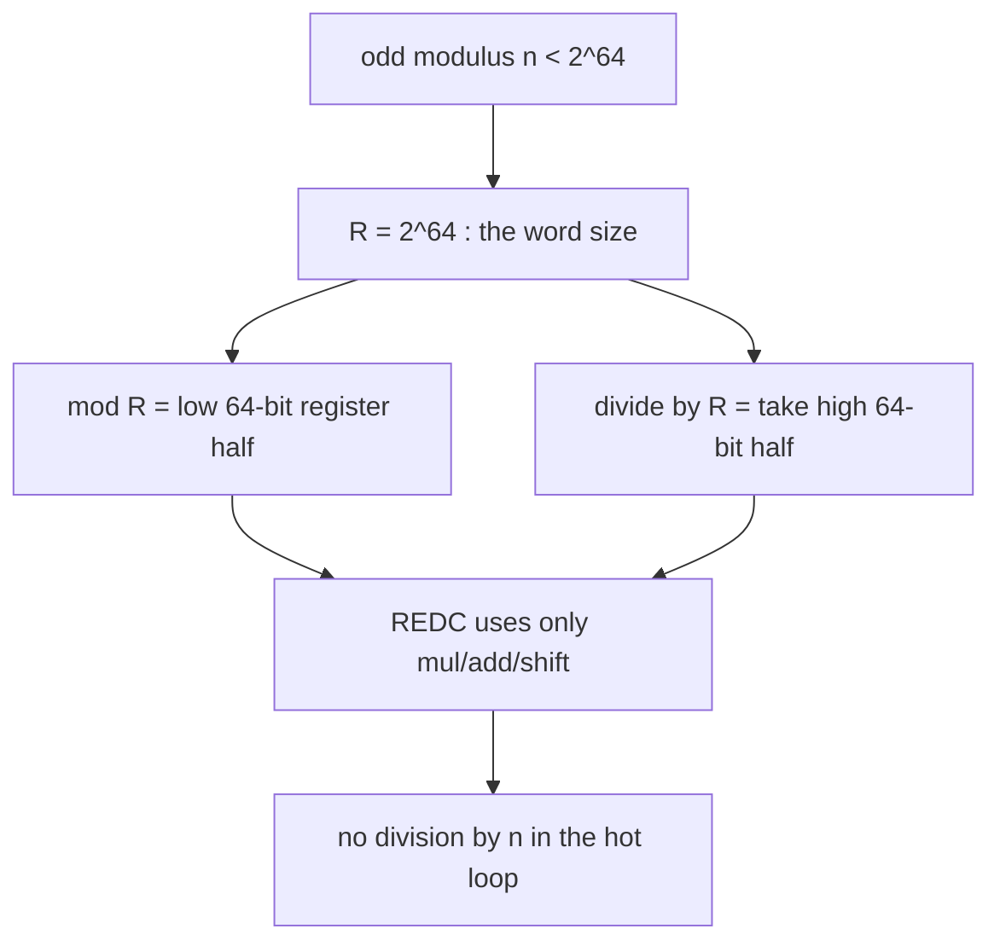

# Montgomery Multiplication (and Barrett Reduction) — Middle Level

> **Focus:** The REDC algorithm step by step, two ways to compute `n'` (Newton iteration and extended Euclid), Montgomery modular exponentiation, Barrett reduction as the no-special-form alternative, and a clear comparison of plain `%` vs Montgomery vs Barrett.

---

## Table of Contents

1. [Introduction](#introduction)
2. [Deeper Concepts](#deeper-concepts)
3. [Computing n' Two Ways](#computing-n-two-ways)
4. [Barrett Reduction: The Alternative](#barrett-reduction-the-alternative)
5. [Comparison with Alternatives](#comparison-with-alternatives)
6. [Advanced Patterns](#advanced-patterns)
7. [Code Examples](#code-examples)
8. [Error Handling](#error-handling)
9. [Performance Analysis](#performance-analysis)
10. [Best Practices](#best-practices)
11. [Visual Animation](#visual-animation)
12. [Summary](#summary)

---

## Introduction

At junior level the message was: store `x` as `x̄ = x·R mod n`, multiply, then run REDC to strip a factor of `R` without dividing by `n`. At middle level you implement it correctly and decide *when* to reach for it:

- What exactly does REDC do, line by line, and why is `T + m·n` always divisible by `R`?
- How do you compute the magic constant `n' = (-n^{-1}) mod R` — by Newton iteration (bit-doubling) or by the extended Euclidean algorithm?
- How does a full Montgomery modular exponentiation look, with conversions only at the boundaries?
- When is **Barrett reduction** — which needs no special number form — the better choice, and how does its precomputed `m = floor(2^k / n)` work?
- How do plain `%`, Montgomery, and Barrett actually compare on instruction count and constraints?

These are the questions that turn "I understand the idea" into "I can ship a correct, fast `mulmod` for the right situation."

---

## Deeper Concepts

### The REDC algorithm, line by line

REDC takes `T` with `0 ≤ T < n·R` and returns `T·R^{-1} mod n`. Here is each step and its justification.

```
REDC(T):
    1. m = ((T mod R) · n') mod R     # only the low k bits of T matter
    2. t = (T + m·n) / R              # this division is EXACT
    3. if t >= n: t = t - n           # bring into [0, n)
    4. return t
```

**Why step 2's division is exact.** We chose `n' = (-n^{-1}) mod R`, i.e. `n·n' ≡ -1 (mod R)`. Look at `(T + m·n) mod R`:

```
(T + m·n) mod R
  = (T + ((T mod R)·n' mod R)·n) mod R
  = (T + T·n'·n) mod R          (m ≡ T·n' (mod R))
  = (T + T·(-1)) mod R          (n·n' ≡ -1 (mod R))
  = (T - T) mod R = 0.
```

So `T + m·n` is a multiple of `R`, and dividing by `R` (a right shift by `k`) leaves no remainder. The quotient `t = (T + m·n)/R` is an integer.

**Why `t ≡ T·R^{-1} (mod n)`.** Modulo `n`, the added term `m·n ≡ 0`, so `t·R = T + m·n ≡ T (mod n)`, hence `t ≡ T·R^{-1} (mod n)`. The number REDC returns is congruent to `T·R^{-1}` modulo `n`.

**Why one subtraction suffices.** Since `T < n·R` and `m < R`, we have `T + m·n < n·R + R·n = 2nR`, so `t = (T+m·n)/R < 2n`. Thus `t` is in `[0, 2n)` and a single `t -= n` lands it in `[0, n)`. The full bound proof is in [`professional.md`](./professional.md).

### Montgomery multiplication

Given `ā = aR mod n` and `b̄ = bR mod n`:

```
montMul(ā, b̄) = REDC(ā · b̄)
              = (aR·bR)·R^{-1} mod n
              = ab·R mod n = (ab)‾.
```

The plain product `ā·b̄ < n·n < n·R` (since `R > n`), so it is a valid REDC input. The output is the Montgomery form of `ab` — ready to feed into the next multiply without ever leaving the form.

### Conversion in and out

- **In:** `x̄ = x·R mod n`. Computed without division as `montMul(x, R² mod n) = REDC(x·(R² mod n)) = x·R mod n`, where `R² mod n` is precomputed.
- **Out:** `x = montMul(x̄, 1) = REDC(x̄·1) = x̄·R^{-1} mod n = x`. Equivalently `REDC(x̄)`.

### The odd-modulus restriction

`R = 2^k`, so `gcd(R, n) = 1` ⇔ `n` is odd. If `n` is even, `n^{-1} mod R` does not exist, `n'` is undefined, and REDC's cancellation fails. Montgomery is fundamentally a **odd-modulus** technique. Barrett has no such restriction.

---

## Computing n' Two Ways

We need `n' = (-n^{-1}) mod R` where `R = 2^k`. Two standard methods.

### Method A — Newton's iteration (Hensel lifting, bit-doubling)

The inverse of an odd `n` modulo `2^k` can be found by an iteration that **doubles the number of correct low bits** each step. Start with a seed correct mod `2^3` (any odd `n` satisfies `n ≡ n^{-1} (mod 8)`), then apply:

```
inv ← inv · (2 - n · inv)   (mod 2^k)
```

Each application doubles the precision: 3 → 6 → 12 → 24 → 48 → 96 bits. For `R = 2^64`, five iterations from the seed suffice. Then negate: `n' = -inv mod R`.

Why it works: if `inv ≡ n^{-1} (mod 2^m)`, then `inv·(2 - n·inv) ≡ n^{-1} (mod 2^{2m})`. This is Newton's method for the root of `f(x) = 1/x - n` adapted to the 2-adic integers. It uses only multiplies and subtractions — no gcd — which is why production Montgomery code prefers it.

### Method B — Extended Euclidean algorithm

The extended Euclidean algorithm (sibling `06-extended-euclidean-modular-inverse`) computes `x, y` with `n·x + R·y = gcd(n, R) = 1`. Then `x ≡ n^{-1} (mod R)`, and `n' = (-x) mod R`. This is `O(log R)` and works for any `R`, but Newton is simpler when `R` is a power of two.

Both give the same `n'`. Always verify `n·n' ≡ -1 (mod R)` after computing it. For `n = 13`, `R = 16`: Newton from seed `13` gives `13^{-1} ≡ 5 (mod 16)`, so `n' = -5 mod 16 = 11`; extended Euclid solves `13·5 - 16·4 = 1`, the same inverse. Check: `13·11 = 143 ≡ 15 ≡ -1 (mod 16)` ✓.

```python
# Method A: Newton iteration for n^{-1} mod 2^k
def inv_pow2(n, k):
    assert n % 2 == 1
    inv = n % (1 << k)             # correct mod 8 (since n ≡ n^{-1} mod 8)
    while (1 << 3):                # double precision until >= k bits
        new = (inv * (2 - n * inv)) % (1 << k)
        if new == inv:
            break
        inv = new
    return inv

# Method B: extended Euclid
def ext_gcd(a, b):
    if b == 0:
        return a, 1, 0
    g, x, y = ext_gcd(b, a % b)
    return g, y, x - (a // b) * y

def inv_euclid(n, R):
    g, x, _ = ext_gcd(n % R, R)
    assert g == 1
    return x % R
```

---

## Barrett Reduction: The Alternative

Montgomery needs an odd modulus and a special number form. **Barrett reduction** removes both constraints: it reduces an ordinary integer `x < n²` modulo any `n` using a precomputed constant, with no special representation.

### The idea

To compute `x mod n` we want `q = floor(x / n)`, then `x - q·n`. Division is slow, so Barrett *estimates* `q` using a precomputed reciprocal. Pick `k` with `2^k > n` (often `k = 2·bitlen(n)`), and precompute once:

```
mu = floor(2^{2k} / n)        # the precomputed "reciprocal" of n
```

Then for `x < n²` (which `2^k > n` covers when `x` is a product of two reduced residues):

```
BARRETT(x):
    q = (x * mu) >> (2k)          # estimate of floor(x/n), using shifts only
    r = x - q*n
    while r >= n: r -= n          # at most 1 or 2 corrections
    return r
```

The shift `>> 2k` plays the role of dividing by `2^{2k}`. Because `mu` slightly under-approximates `2^{2k}/n`, the estimate `q` is either exactly `floor(x/n)` or one (rarely two) too small, so a tiny correction loop fixes it. No division by `n` ever runs in the hot path.

### Error bound (intuition)

`mu = floor(2^{2k}/n)` differs from the true `2^{2k}/n` by less than 1. Propagating that through `q = floor(x·mu / 2^{2k})` shows the estimated quotient is at most 2 below the true quotient for `x < n²`, so **at most two** conditional subtractions are needed. The precise bound is derived in [`professional.md`](./professional.md).

### Montgomery vs Barrett at a glance

| | Montgomery | Barrett |
|---|-----------|---------|
| Special number form? | Yes (`x̄ = xR mod n`) | No — works on ordinary integers |
| Modulus restriction | **Odd only** | Any `n` |
| Conversion cost | Convert in/out (amortized) | None |
| Per-reduce cost | 1 multiply (m·n) + shift + 1 subtract | 2 multiplies (x·mu, q·n) + shifts + ≤2 subtracts |
| Best for | Long exponentiation chains, fixed odd `n` | Reductions without conversion, even `n`, mixed workloads |

A common rule: **Montgomery** when you do a long chain of multiplies under a fixed odd modulus (modpow, Miller-Rabin); **Barrett** when you need to reduce occasional products under an arbitrary modulus without paying conversion.

---

## Comparison with Alternatives

### Plain `%` vs Montgomery vs Barrett

| Method | Division by `n`? | Setup | Per-`mulmod` | Constraint |
|--------|------------------|-------|--------------|------------|
| Plain `(a*b) % n` | **Yes** (one HW division) | none | 1 mul + 1 div | any `n` |
| Montgomery | No | `n'`, `R² mod n` | 1 mul + 1 REDC | `n` odd |
| Barrett | No | `mu = floor(2^{2k}/n)` | 2 mul + shifts + ≤2 sub | any `n` |

Concrete cycle-count intuition (modern x86-64, 64-bit operands):

| Operation | Approx. cycles |
|-----------|----------------|
| 64×64→128 multiply | 3 |
| 64-bit add / shift / mask | 1 |
| 64-bit **division** (`%`) | 20–90 |
| One REDC | ~6–10 |
| One Barrett reduce | ~8–12 |

So a single `mulmod` via plain `%` costs one slow division; Montgomery and Barrett replace it with a handful of cheap multiplies/shifts. Over millions of iterations the savings are large — but only if you keep the modulus fixed and reuse the setup.

### When each wins

| Situation | Best choice | Why |
|-----------|-------------|-----|
| `a^b mod n`, large `b`, odd `n` | Montgomery | One conversion, hundreds of cheap multiplies. |
| Miller-Rabin / Pollard-rho, odd `n` | Montgomery | Inner loop is nothing but `mulmod`; odd `n` guaranteed (testing primality of odd candidates). |
| NTT under odd prime | Montgomery (or Barrett) | Billions of butterfly multiplies; either fast reducer beats `%`. |
| Reducing arbitrary products, mixed/even moduli | Barrett | No odd-modulus restriction, no conversion. |
| One or two modular multiplies | Plain `%` | Setup/conversion not worth it. |
| Constant-time crypto | Montgomery (branchless subtract) | No data-dependent division latency. |

---

## Advanced Patterns

### Pattern: Montgomery-based Miller-Rabin inner loop

Miller-Rabin (sibling `08-miller-rabin-primality`) repeatedly computes `a^d mod n` and squares. Since candidates are odd, Montgomery fits perfectly: build the context once for `n`, run the whole witness loop in Montgomery form.

```python
def is_probable_prime(n, witnesses):
    if n < 2:
        return False
    if n % 2 == 0:
        return n == 2
    ctx = Mont(n)                 # odd n -> Montgomery applies
    d = n - 1
    s = 0
    while d % 2 == 0:
        d //= 2
        s += 1
    one = ctx.to_mont(1)
    minus_one = ctx.to_mont(n - 1)
    for a in witnesses:
        if a % n == 0:
            continue
        x = ctx.pow(a, d)          # returns normal form; re-enter below
        xm = ctx.to_mont(x)
        if xm == one or xm == minus_one:
            continue
        composite = True
        for _ in range(s - 1):
            xm = ctx.mul(xm, xm)
            if xm == minus_one:
                composite = False
                break
        if composite:
            return False
    return True
```

### Pattern: Barrett reduction without a special form

When you have a stream of products to reduce under one modulus but don't want conversions:

```python
class Barrett:
    def __init__(self, n):
        self.n = n
        self.k = 2 * n.bit_length() + 1
        self.mu = (1 << self.k) // n   # floor(2^k / n)

    def reduce(self, x):               # x < n^2
        q = (x * self.mu) >> self.k
        r = x - q * self.n
        while r >= self.n:
            r -= self.n
        return r

    def mul(self, a, b):
        return self.reduce(a * b)
```

### Pattern: choosing R = machine word



Using `R = 2^64` means "mod R" and "÷ R" are *free*: they are simply which 64-bit half of a 128-bit product you read. This is why production code fixes `R` to the word size rather than the smallest power of two above `n`.

---

## Code Examples

### Full Montgomery context with modpow, in three languages

#### Go

```go
package main

import (
	"fmt"
	"math/bits"
)

type Mont struct {
	n, nInv, r2 uint64 // n odd; nInv = -n^{-1} mod 2^64; r2 = 2^128 mod n
}

func newMont(n uint64) Mont {
	inv := n
	for i := 0; i < 5; i++ {
		inv *= 2 - n*inv // Newton: doubles correct bits each step
	}
	// r2 = 2^128 mod n via two doublings of 2^64 mod n.
	r := (-n) % n // 2^64 mod n
	r2 := r
	for i := 0; i < 64; i++ {
		r2 = (r2 << 1) % n
		if r2 < 0 { // unsigned: never negative, kept for clarity
		}
	}
	return Mont{n: n, nInv: -inv, r2: r2}
}

func (m Mont) redc(hi, lo uint64) uint64 {
	mm := lo * m.nInv
	mnHi, mnLo := bits.Mul64(mm, m.n)
	_, c := bits.Add64(lo, mnLo, 0)
	res, c2 := bits.Add64(hi, mnHi, c)
	if c2 != 0 || res >= m.n {
		res -= m.n
	}
	return res
}

func (m Mont) mul(a, b uint64) uint64 { hi, lo := bits.Mul64(a, b); return m.redc(hi, lo) }
func (m Mont) in(x uint64) uint64     { return m.mul(x, m.r2) }
func (m Mont) out(x uint64) uint64    { return m.redc(0, x) }

func (m Mont) pow(base, exp uint64) uint64 {
	res := m.in(1)
	b := m.in(base)
	for exp > 0 {
		if exp&1 == 1 {
			res = m.mul(res, b)
		}
		b = m.mul(b, b)
		exp >>= 1
	}
	return m.out(res)
}

func main() {
	m := newMont(1_000_000_007)
	fmt.Println(m.pow(2, 1_000_000)) // 2^1000000 mod (1e9+7)
}
```

#### Java

```java
public class Mont {
    final long n, nInv, r2;

    Mont(long n) {
        this.n = n;
        long inv = n;
        for (int i = 0; i < 5; i++) inv *= 2 - n * inv;
        this.nInv = -inv;
        long r = Long.remainderUnsigned(-n, n);  // 2^64 mod n
        for (int i = 0; i < 64; i++) {
            r <<= 1;
            r = Long.remainderUnsigned(r, n);
        }
        this.r2 = r;                              // 2^128 mod n
    }

    long redc(long hi, long lo) {
        long mm = lo * nInv;
        long mnHi = Math.multiplyHigh(mm, n);
        long mnLo = mm * n;
        long sumLo = lo + mnLo;
        long carry = (Long.compareUnsigned(sumLo, lo) < 0) ? 1 : 0;
        long res = hi + mnHi + carry;
        if (Long.compareUnsigned(res, n) >= 0) res -= n;
        return res;
    }

    long mul(long a, long b) { return redc(Math.multiplyHigh(a, b), a * b); }
    long in(long x)  { return mul(x, r2); }
    long out(long x) { return redc(0, x); }

    long pow(long base, long exp) {
        long res = in(1), b = in(base);
        while (exp > 0) {
            if ((exp & 1) == 1) res = mul(res, b);
            b = mul(b, b);
            exp >>= 1;
        }
        return out(res);
    }

    public static void main(String[] args) {
        Mont m = new Mont(1_000_000_007L);
        System.out.println(m.pow(2, 1_000_000));
    }
}
```

#### Python

```python
class Mont:
    def __init__(self, n, k=64):
        assert n % 2 == 1
        self.n, self.k = n, k
        self.R = 1 << k
        self.mask = self.R - 1
        self.n_prime = (-pow(n, -1, self.R)) % self.R
        self.r2 = (self.R * self.R) % n

    def redc(self, t):
        m = ((t & self.mask) * self.n_prime) & self.mask
        u = (t + m * self.n) >> self.k
        return u - self.n if u >= self.n else u

    def mul(self, a, b): return self.redc(a * b)
    def into(self, x):   return self.mul(x, self.r2)
    def outof(self, x):  return self.redc(x)

    def pow(self, base, exp):
        res = self.into(1)
        b = self.into(base)
        while exp > 0:
            if exp & 1:
                res = self.mul(res, b)
            b = self.mul(b, b)
            exp >>= 1
        return self.outof(res)


if __name__ == "__main__":
    m = Mont(1_000_000_007)
    print(m.pow(2, 1_000_000) == pow(2, 1_000_000, 1_000_000_007))  # True
```

---

## Error Handling

| Scenario | What goes wrong | Correct approach |
|----------|-----------------|------------------|
| Even modulus passed to Montgomery | `n^{-1} mod R` undefined; REDC garbage | Assert odd; switch to Barrett for even `n`. |
| Skipped conditional subtraction | Result in `[n, 2n)` poisons later multiplies | Always subtract once when `t >= n`. |
| Wrong sign on `n'` | Used `n^{-1}` not `-n^{-1}` | Verify `n·n' ≡ -1 (mod R)`. |
| Barrett `mu` too small `k` | Quotient estimate off by >2 | Use `k = 2·bitlen(n) (+1)`; ensure `x < n²`. |
| Overflow in product | 64×64 needs 128 bits | Use `bits.Mul64` / `multiplyHigh` / `__int128`. |
| Forgot `to_mont(1)` for identity | Accumulator starts wrong | Initialize with `into(1) = R mod n`. |
| Reducing `x ≥ n²` with Barrett | Correction loop runs too long / wrong | Keep inputs reduced; Barrett assumes `x < n²`. |

---

## Performance Analysis

| Workload (modulus fixed, odd) | Plain `%` | Montgomery | Notes |
|-------------------------------|-----------|------------|-------|
| 1 modular multiply | 1 division | 2 conversions + 1 REDC | Plain wins; nothing to amortize. |
| `a^b mod n`, `b ≈ 2^30` | ~60 divisions | 2 conversions + ~60 REDCs | Montgomery wins clearly. |
| Miller-Rabin, 1 candidate | hundreds of divisions | 1 setup + hundreds of REDCs | Montgomery wins. |
| NTT, n log n butterflies | n log n divisions | n log n REDCs | Montgomery/Barrett win big. |

The crossover is small: as soon as you do more than a handful of multiplies under one modulus, the fast reducer wins. The setup (`n'`, `R² mod n`) is `O(log n)` once; conversions are one REDC each.

```python
import time

def bench(n, exp, iters):
    ctx = Mont(n)
    t0 = time.perf_counter()
    for _ in range(iters):
        ctx.pow(3, exp)
    tm = time.perf_counter() - t0
    t0 = time.perf_counter()
    for _ in range(iters):
        pow(3, exp, n)            # CPython's pow is C-optimized; for shape only
    tp = time.perf_counter() - t0
    return tm, tp
# In compiled languages, Montgomery's per-multiply edge over hardware `%` is the real win.
```

(In CPython the built-in `pow` is already C-level, so this benchmark mainly illustrates *shape*; in Go/Java/C the Montgomery edge is concrete.)

---

## Best Practices

- **Build the context once** per modulus; reuse `n'` and `R² mod n` across all operations.
- **Pick `R = 2^word`** so "mod R" / "÷ R" are free register-half reads.
- **Stay in Montgomery form** for the whole chain; convert only at the two boundaries.
- **Verify `n·n' ≡ -1 (mod R)`** and `out(in(x)) == x` in a unit test.
- **Use Barrett** when the modulus may be even or you want to avoid conversions.
- **Branchless subtract** for constant-time crypto; a data-dependent `if` can leak via timing.
- **Always test against plain `%`** on random inputs before trusting the fast path.
- **Initialize modpow accumulators with `to_mont(1)`**, which equals `R mod n`, not literal `1` — a frequent first bug.
- **Document which variables are in Montgomery form** so a normal integer is never passed where a Montgomery value is expected.

---

## Visual Animation

> See [`animation.html`](./animation.html) for an interactive view.
>
> The middle-level animation highlights:
> - The three REDC steps and the moment the low `k` bits cancel (so `÷R` is exact).
> - The conditional subtraction that pulls the result from `[0, 2n)` into `[0, n)`.
> - Editable `n` and `R` so you can watch `n'` and the Montgomery forms recompute.
> - The even-modulus guard: enter an even `n` and the animation shows that `n'` is undefined (no inverse mod `R`), demonstrating the odd-modulus restriction live.

---

## Summary

REDC reduces `T < n·R` to `T·R^{-1} mod n` in three steps: compute `m = (T mod R)·n' mod R`, form `t = (T + m·n)/R` (an *exact* division because `n·n' ≡ -1 mod R` makes the low bits cancel), and conditionally subtract `n`. Montgomery multiplication is "multiply, then REDC", keeping numbers in the form `x̄ = xR mod n`. The constant `n' = (-n^{-1}) mod R` is computed once, ideally by Newton's bit-doubling iteration (or extended Euclid). Conversions happen only at the boundaries, so the technique pays off across long multiplication chains — modpow, Miller-Rabin, Pollard-rho, NTT — under a fixed **odd** modulus. **Barrett reduction** is the alternative when you cannot meet the odd-modulus restriction or want to avoid conversions: precompute `mu = floor(2^{2k}/n)`, estimate the quotient with a multiply and shift, and correct with at most two subtractions. Choose Montgomery for long chains under a fixed odd `n`; Barrett for arbitrary-modulus reductions without a special form; plain `%` for one-off multiplies.
