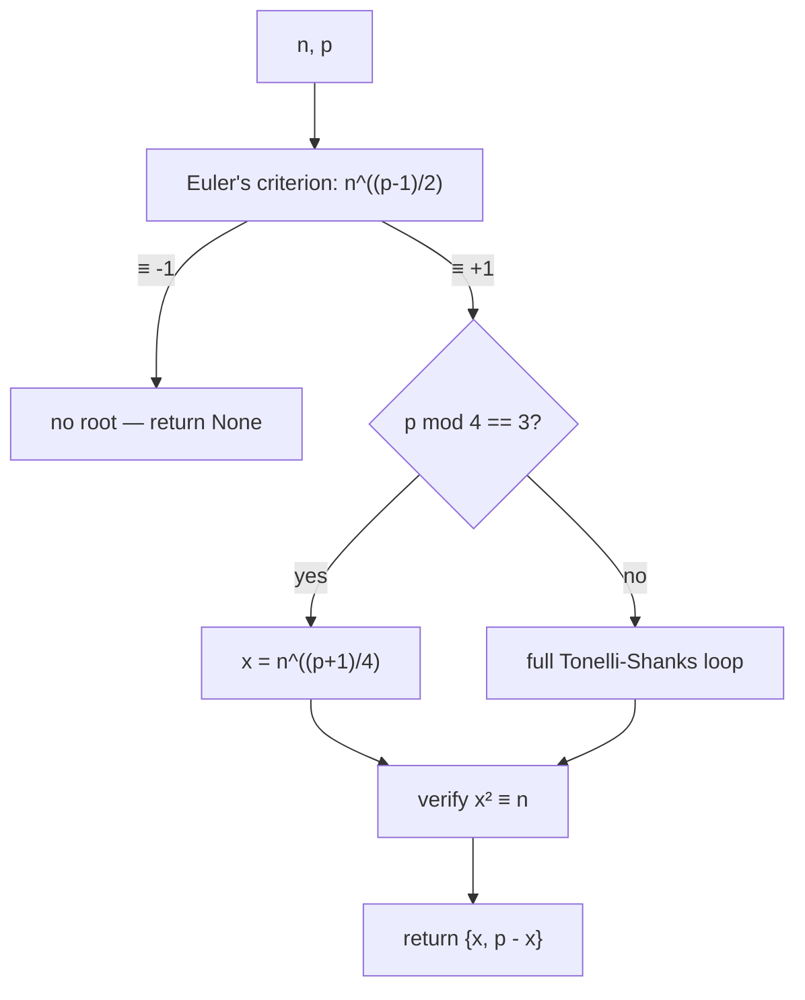

# Tonelli-Shanks — Junior Level

> **One-line summary:** Tonelli-Shanks solves `x² ≡ n (mod p)` for an odd prime `p` — it finds the **modular square root** of `n`. First you check *whether* a root exists (Euler's criterion). If `p ≡ 3 (mod 4)`, a one-line formula `x = n^((p+1)/4)` gives the answer. Otherwise the full Tonelli-Shanks algorithm walks toward the root step by step.

---

## Table of Contents

1. [Introduction](#introduction)
2. [Prerequisites](#prerequisites)
3. [Glossary](#glossary)
4. [Core Concepts](#core-concepts)
5. [Big-O Summary](#big-o-summary)
6. [Real-World Analogies](#real-world-analogies)
7. [Pros & Cons](#pros--cons)
8. [Step-by-Step Walkthrough](#step-by-step-walkthrough)
9. [Code Examples](#code-examples)
10. [Coding Patterns](#coding-patterns)
11. [Error Handling](#error-handling)
12. [Performance Tips](#performance-tips)
13. [Best Practices](#best-practices)
14. [Edge Cases & Pitfalls](#edge-cases--pitfalls)
15. [Common Mistakes](#common-mistakes)
16. [Cheat Sheet](#cheat-sheet)
17. [Visual Animation](#visual-animation)
18. [Summary](#summary)
19. [Further Reading](#further-reading)

---

## Introduction

You already know how to take a square root of an ordinary number: `√9 = 3`, because `3² = 9`. The **modular** version asks the same question, but inside clock arithmetic. Fix a prime modulus, say `p = 7`. The question "what is the square root of `2` mod `7`?" means:

```
find x such that  x² ≡ 2 (mod 7)
```

Let us just try every value `0, 1, 2, 3, 4, 5, 6` and square it mod `7`:

```
0² = 0
1² = 1
2² = 4
3² = 9 ≡ 2     ← x = 3 works!
4² = 16 ≡ 2    ← x = 4 also works!
5² = 25 ≡ 4
6² = 36 ≡ 1
```

So `2` has **two** square roots mod `7`, namely `3` and `4`. Notice `4 = 7 − 3`: the two roots are always `x` and `p − x` (negatives of each other), exactly like `+3` and `−3` are both square roots of `9` in ordinary numbers.

Now look at the list of squares we produced: `{0, 1, 4, 2, 2, 4, 1}`. The nonzero values that *appear* are `{1, 2, 4}`. These are the numbers that **have** a square root mod `7` — we call them **quadratic residues** (QR). The numbers `{3, 5, 6}` never appear as a square; they are **quadratic non-residues** (QNR) — `x² ≡ 3 (mod 7)` has *no* solution at all.

That gives us the two halves of this whole topic:

1. **Does `n` even have a square root mod `p`?** (Is `n` a quadratic residue?) — answered by **Euler's criterion**, one quick computation.
2. **If yes, what is the root?** — answered by a formula in the easy case `p ≡ 3 (mod 4)`, and by the **Tonelli-Shanks algorithm** in general.

Trying all `x` (like we did above) works for `p = 7` but is hopeless for a real prime with hundreds of digits — that is `O(p)` work. Tonelli-Shanks finds the same root in roughly `O(log² p)` steps, which is the entire point of the algorithm.

---

## Prerequisites

Before reading this file you should be comfortable with:

- **Modular arithmetic** — `(a · b) mod p`, `(a + b) mod p`, and what `a ≡ b (mod p)` means. See sibling `02-modular-arithmetic`.
- **Binary exponentiation** — computing `a^e mod p` fast, in `O(log e)`. See sibling `26-binary-exponentiation`. This is the workhorse of every step here.
- **Fermat's little theorem** — for a prime `p` and `a` not divisible by `p`, `a^{p-1} ≡ 1 (mod p)`. See sibling `05-fermat-euler`. Euler's criterion is built directly on top of it.
- **Primality** — `p` must be a prime (and an *odd* prime). Checking primality is sibling `09-miller-rabin-primality`.
- **gcd / coprimality** — knowing when `n` is divisible by `p` (the special `n ≡ 0` case). See sibling `01-gcd-lcm`.

Optional but helpful:

- A glance at **primitive roots** (sibling `13-primitive-root-discrete-root`), since a quadratic non-residue is closely related to a generator. Tonelli-Shanks needs one non-residue `z` to get started.

---

## Glossary

| Term | Meaning |
|------|---------|
| **Modular square root of `n`** | A value `x` with `x² ≡ n (mod p)`. |
| **Quadratic residue (QR)** | A value `n` (with `gcd(n, p) = 1`) that *has* a square root mod `p`. |
| **Quadratic non-residue (QNR)** | A value `n` that has *no* square root mod `p`. |
| **Euler's criterion** | The test `n^((p-1)/2) ≡ 1` (QR) or `≡ −1` (QNR), for odd prime `p`. |
| **Legendre symbol `(n/p)`** | A compact name for the result of Euler's criterion: `+1` if QR, `−1` if QNR, `0` if `p | n`. |
| **`p ≡ 3 (mod 4)`** | A prime whose remainder on division by `4` is `3` (e.g. `7, 11, 19, 23`). The easy case. |
| **`p ≡ 1 (mod 4)`** | A prime with remainder `1` (e.g. `5, 13, 17, 29`). Needs full Tonelli-Shanks. |
| **`p − 1 = Q · 2^S`** | Splitting `p − 1` into an odd part `Q` and a power of two `2^S`. The core decomposition. |
| **Tonelli-Shanks** | The general algorithm that finds the square root of a QR mod any odd prime. |
| **Cipolla's algorithm** | An alternative square-root algorithm that works in a quadratic field extension. |

---

## Core Concepts

### 1. There Are Always Two Roots (or None)

If `x` is a square root of `n`, so is `p − x` (because `(p − x)² = p² − 2px + x² ≡ x² ≡ n`). And those are the *only* two (for `p` odd and `n ≢ 0`). So a quadratic residue has **exactly two** square roots; a non-residue has **zero**. This is the modular mirror of `±√n` for ordinary numbers. Knowing this, the algorithm only needs to find *one* root; the other is just `p − x`.

### 2. Quadratic Residues Are Exactly Half

For an odd prime `p`, exactly half of the nonzero residues `{1, …, p−1}` are quadratic residues and half are non-residues — `(p−1)/2` of each. Mod `7` we found `{1, 2, 4}` are QR (three of them) and `{3, 5, 6}` are QNR (three of them). This 50/50 split is why picking a random number and finding it is a non-residue is easy (a coin flip), which matters for the full algorithm.

### 3. Euler's Criterion — The Solvability Test

You do **not** square every `x` to decide whether `n` is a QR. Instead raise `n` to the power `(p−1)/2`:

```
n^((p-1)/2) ≡  +1 (mod p)   →  n is a quadratic residue (root exists)
n^((p-1)/2) ≡  -1 (mod p)   →  n is a non-residue (no root)
```

Why only two outcomes? Let `y = n^((p-1)/2)`. By Fermat, `y² = n^(p-1) ≡ 1`, so `y² ≡ 1`, meaning `y ≡ ±1`. The criterion says *which* of the two it is, and that tells you solvability. The result `+1` / `−1` is exactly the **Legendre symbol** `(n/p)`. Cost: one modular exponentiation, `O(log p)`. (Why `+1` means QR is proved in [`professional.md`](./professional.md).)

Example (`p = 7`): `2^((7-1)/2) = 2^3 = 8 ≡ 1`, so `2` is a QR (we saw its roots `3, 4`). And `3^3 = 27 ≡ 6 ≡ −1`, so `3` is a non-residue — no square root, matching our table.

### 4. The Easy Case: `p ≡ 3 (mod 4)`

When the prime satisfies `p ≡ 3 (mod 4)`, there is a beautiful one-line formula. The root of a QR `n` is:

```
x = n^((p+1)/4) (mod p)
```

Why it works: `(p+1)/4` is an integer exactly because `p ≡ 3 (mod 4)` makes `p + 1` divisible by `4`. Then

```
x² = n^((p+1)/2) = n^((p-1)/2) · n ≡ (+1) · n = n
```

using Euler's criterion (`n^((p-1)/2) ≡ 1` since `n` is a QR). So `x² ≡ n` — done in a single exponentiation. **Most of the time in practice you are in this case, and you never need the full algorithm.** Example (`p = 7`, `n = 2`): `x = 2^((7+1)/4) = 2^2 = 4`, and indeed `4² = 16 ≡ 2`. The other root is `7 − 4 = 3`.

### 5. The Hard Case: `p ≡ 1 (mod 4)` Needs Tonelli-Shanks

When `p ≡ 1 (mod 4)`, the exponent `(p+1)/4` is no longer an integer, so the shortcut fails and we need the real algorithm. The key idea is to **split `p − 1`** into an odd part and a power of two:

```
p − 1 = Q · 2^S     with Q odd, S ≥ 1
```

For `p ≡ 3 (mod 4)` we have `S = 1` (only one factor of `2`), which is why that case is trivial. For `p ≡ 1 (mod 4)`, `S ≥ 2`, and the algorithm does extra "fixup" work to handle the larger power of two. The detailed loop is the heart of [`middle.md`](./middle.md); at junior level the takeaway is: **bigger `S` means more work, and that work is what Tonelli-Shanks organizes.**

### 6. The Two Special Inputs

Two inputs are handled before any of the above:

- **`n ≡ 0 (mod p)`** — then `x = 0` is the only root (`0² = 0`). Return `0` immediately.
- **`p = 2`** — the only even prime; every number is its own square root mod `2` (`x = n mod 2`). Handle separately.

The rest of the topic assumes `p` is an *odd* prime and `n ≢ 0`.

---

## Big-O Summary

| Operation | Time | Notes |
|-----------|------|-------|
| Euler's criterion / Legendre symbol | **O(log p)** | One modular exponentiation. |
| `p ≡ 3 (mod 4)` shortcut | **O(log p)** | A single exponentiation `n^((p+1)/4)`. |
| Find a quadratic non-residue `z` | **O(log p)** expected | Try `z = 2, 3, …`; half of all residues work. |
| Full Tonelli-Shanks main loop | **O(S² · log p)** worst | `S` from `p − 1 = Q·2^S`; usually `S` is small. |
| Brute force (try every `x`) | **O(p · log p)** | The naive method we want to avoid. |
| Verify a root (`x² ≡ n`?) | **O(log p)** | One multiplication / exponentiation. |

The whole algorithm is dominated by modular exponentiations. Since `S ≤ log₂(p)`, the worst case `O(S² log p)` is at most about `O(log³ p)`, and in practice far less because `S` is typically tiny. Compare with the `O(p)` brute force, which is unusable for large primes.

---

## Real-World Analogies

| Concept | Analogy |
|---------|---------|
| Quadratic residue | A house number that *can* be reached by squaring someone's locker number; a non-residue is a house no locker ever maps to. |
| Two roots `x` and `p − x` | A mirror: every square root has a reflection on the other side of the modulus. |
| Euler's criterion | A metal detector that beeps `+1` ("treasure here, a root exists") or `−1` ("nothing buried") without digging. |
| `p − 1 = Q · 2^S` | Peeling an onion: strip off all the factors of `2` (`2^S`) until only the odd core `Q` remains. |
| The Tonelli-Shanks loop | A thermostat homing in on the right temperature: each round halves the "error" until it hits the exact root. |
| `p ≡ 3 (mod 4)` shortcut | A vending machine with a single button that dispenses the answer — no fiddling required. |

Where the analogies break: the metal detector "beep" is itself a real exponentiation (not free), and the thermostat does not just nudge — it cancels an exact power-of-two error each round, which is more surgical than smooth convergence. The math behind that surgery is in [`professional.md`](./professional.md).

---

## Pros & Cons

| Pros | Cons |
|------|------|
| Finds modular square roots in `O(log² p)` — vastly faster than the `O(p)` brute force. | Only works for an odd **prime** modulus; composite `m` needs factorization + CRT (sibling `06-crt`). |
| The `p ≡ 3 (mod 4)` case is a single one-line exponentiation. | The general case needs a quadratic non-residue `z`, found by trial. |
| Euler's criterion tells you *up front* whether any root exists. | Easy to forget the criterion and run the loop on a non-residue (garbage output). |
| Deterministic main loop (only the non-residue search is randomized-ish). | The full loop's correctness is subtle — easy to implement with off-by-one bugs. |
| Underpins elliptic-curve point decompression and many crypto primitives. | For prime *powers* you must add Hensel lifting; for composites, CRT. |

**When to use:** decompressing an elliptic-curve point (recovering `y` from `x` and the curve equation), checking whether a value is a QR, computing any `√n mod p`, or as the `k = 2` specialization of the general discrete-root problem (sibling `13`).

**When NOT to use:** when the modulus is composite (split it with CRT first), when you only need *whether* a root exists (just use Euler's criterion — no need for the full algorithm), or for a general `k`-th root where the primitive-root method (sibling `13`) is the right tool.

---

## Step-by-Step Walkthrough

Let us solve `x² ≡ 5 (mod 13)` by hand. Here `p = 13`, and `13 ≡ 1 (mod 4)`, so we are in the hard case and must run full Tonelli-Shanks.

**Step 1 — Check solvability (Euler's criterion).**

```
5^((13-1)/2) = 5^6 (mod 13)
5^2 = 25 ≡ 12 ≡ -1
5^4 ≡ (-1)^2 = 1
5^6 = 5^4 · 5^2 ≡ 1 · (-1) = -1 ... wait, recompute:
5^6 = (5^2)^3 ≡ (-1)^3 = -1?  Let's verify directly: 5^3 = 125 ≡ 8, 5^6 = 8^2 = 64 ≡ 12 ≡ -1.
```

Hmm, that gives `−1`, which would mean `5` is a **non-residue**. Let us double-check by trying a known residue instead, since `5` is in fact *not* a QR mod `13`. The squares mod `13` are `{1, 4, 9, 3, 12, 10}` (from `1²..6²`), and `5` is not among them. **So `x² ≡ 5 (mod 13)` has no solution** — Euler's criterion correctly returned `−1`. This is exactly why you always run the criterion first: it stops you from wasting the whole algorithm on an unsolvable input.

**Step 1' — Pick a solvable example instead: `x² ≡ 10 (mod 13)`.** Check: `10^6 (mod 13)`. `10 ≡ −3`, `10² ≡ 9`, `10^3 ≡ 90 ≡ 12 ≡ −1`, `10^6 ≡ 1`. Criterion returns `+1`, so `10` **is** a QR (indeed `6² = 36 ≡ 10`). Now run the algorithm.

**Step 2 — Decompose `p − 1`.** `p − 1 = 12 = 3 · 2²`, so `Q = 3`, `S = 2`.

**Step 3 — Find a non-residue `z`.** Try `z = 2`: `2^6 (mod 13)` = `64 ≡ 12 ≡ −1`, so `2` is a non-residue. Good, `z = 2`.

**Step 4 — Initialize the four working values.**

```
M = S = 2
c = z^Q = 2^3 = 8           (mod 13)
t = n^Q = 10^3 ≡ 12 ≡ -1    (mod 13)
R = n^((Q+1)/2) = 10^2 ≡ 9  (mod 13)   ← current guess for the root
```

`R` is our running guess; `t` measures how "wrong" it is. When `t` becomes `1`, `R` is exactly the root.

**Step 5 — The tweak loop.** `t = −1 ≢ 1`, so we fix it up. Find the least `i` with `t^(2^i) ≡ 1`:

```
t^(2^0) = t = -1 ≢ 1
t^(2^1) = (-1)^2 = 1   ← i = 1
```

Compute the correction factor `b = c^(2^(M-i-1)) = 8^(2^(2-1-1)) = 8^(2^0) = 8`. Update:

```
R ← R · b      = 9 · 8 = 72 ≡ 7   (mod 13)
t ← t · b²     = (-1) · 64 ≡ (-1)·12 ≡ -12 ≡ 1   (mod 13)
c ← b²         = 64 ≡ 12
M ← i = 1
```

**Step 6 — Loop check.** Now `t = 1`, so we stop. The root is `R = 7`.

**Step 7 — Verify.** `7² = 49 ≡ 49 − 3·13 = 49 − 39 = 10 ✓`. The other root is `13 − 7 = 6`, and `6² = 36 ≡ 10 ✓`. Both confirmed.

That is the entire procedure: check the criterion, decompose `p − 1`, find a non-residue, then repeatedly nudge `R` by a power-of-two correction until the "error" `t` collapses to `1`.

---

## Code Examples

### Example: Euler's Criterion + the `p ≡ 3 (mod 4)` Shortcut + Brute Force

This shows the solvability test, the easy-case formula, and a brute-force oracle to test against. (The full general algorithm is built in [`middle.md`](./middle.md).)

#### Go

```go
package main

import "fmt"

func power(a, e, mod int64) int64 {
	a %= mod
	if a < 0 {
		a += mod
	}
	var r int64 = 1
	for e > 0 {
		if e&1 == 1 {
			r = r * a % mod
		}
		a = a * a % mod
		e >>= 1
	}
	return r
}

// Legendre symbol: +1 (QR), -1 (QNR), 0 (p | n). p is an odd prime.
func legendre(n, p int64) int64 {
	r := power(n, (p-1)/2, p)
	if r == p-1 {
		return -1
	}
	return r // 0 or 1
}

// Square root via the p ≡ 3 (mod 4) shortcut. Returns (root, ok).
func sqrtMod3mod4(n, p int64) (int64, bool) {
	n %= p
	if n == 0 {
		return 0, true
	}
	if legendre(n, p) != 1 {
		return 0, false // no root
	}
	x := power(n, (p+1)/4, p)
	return x, true
}

// Brute-force oracle for small p.
func sqrtBrute(n, p int64) (int64, bool) {
	n %= p
	for x := int64(0); x < p; x++ {
		if x*x%p == n {
			return x, true
		}
	}
	return 0, false
}

func main() {
	fmt.Println(legendre(2, 7))  // 1  (2 is a QR mod 7)
	fmt.Println(legendre(3, 7))  // -1 (3 is a non-residue)
	x, ok := sqrtMod3mod4(2, 7)  // 7 ≡ 3 (mod 4)
	fmt.Println(x, ok)           // 4 true  (or its mirror 3)
	fmt.Println(sqrtBrute(2, 7)) // 3 true
}
```

#### Java

```java
public class TonelliJunior {
    static long power(long a, long e, long mod) {
        a %= mod;
        if (a < 0) a += mod;
        long r = 1;
        while (e > 0) {
            if ((e & 1) == 1) r = r * a % mod;
            a = a * a % mod;
            e >>= 1;
        }
        return r;
    }

    // Legendre symbol: +1 (QR), -1 (QNR), 0 (p | n).
    static long legendre(long n, long p) {
        long r = power(n, (p - 1) / 2, p);
        return (r == p - 1) ? -1 : r;
    }

    // p ≡ 3 (mod 4) shortcut. Returns root or -1 if no root.
    static long sqrtMod3mod4(long n, long p) {
        n %= p;
        if (n == 0) return 0;
        if (legendre(n, p) != 1) return -1;
        return power(n, (p + 1) / 4, p);
    }

    static long sqrtBrute(long n, long p) {
        n %= p;
        for (long x = 0; x < p; x++) if (x * x % p == n) return x;
        return -1;
    }

    public static void main(String[] args) {
        System.out.println(legendre(2, 7));      // 1
        System.out.println(legendre(3, 7));      // -1
        System.out.println(sqrtMod3mod4(2, 7));  // 4 (or 3)
        System.out.println(sqrtBrute(2, 7));     // 3
    }
}
```

#### Python

```python
def legendre(n, p):
    """+1 if n is a QR, -1 if non-residue, 0 if p | n. p odd prime."""
    r = pow(n % p, (p - 1) // 2, p)
    return -1 if r == p - 1 else r


def sqrt_mod_3mod4(n, p):
    """Square root via the p ≡ 3 (mod 4) shortcut. None if no root."""
    n %= p
    if n == 0:
        return 0
    if legendre(n, p) != 1:
        return None
    return pow(n, (p + 1) // 4, p)


def sqrt_brute(n, p):
    n %= p
    for x in range(p):
        if x * x % p == n:
            return x
    return None


if __name__ == "__main__":
    print(legendre(2, 7))         # 1
    print(legendre(3, 7))         # -1
    print(sqrt_mod_3mod4(2, 7))   # 4 (or 3 — both are roots)
    print(sqrt_brute(2, 7))       # 3
```

**What it does:** runs Euler's criterion, applies the easy-case formula when `p ≡ 3 (mod 4)`, and checks against a brute-force oracle.
**Run:** `go run main.go` | `javac TonelliJunior.java && java TonelliJunior` | `python ts.py`

---

## Coding Patterns

### Pattern 1: Always Check the Criterion First

**Intent:** Never run any square-root code without first confirming the root exists — otherwise you get a confident but wrong answer.

```python
def safe_sqrt(n, p, root_fn):
    n %= p
    if n == 0:
        return 0
    if pow(n, (p - 1) // 2, p) != 1:   # Euler's criterion
        return None                    # no square root exists
    return root_fn(n, p)               # only now compute it
```

### Pattern 2: Get Both Roots from One

**Intent:** The algorithm returns a single root; the caller usually wants the pair `{x, p − x}`.

```python
def both_roots(x, p):
    if x is None:
        return []
    return sorted({x % p, (p - x) % p})
```

### Pattern 3: Verify Before Trusting

**Intent:** Squaring the result back is the cheapest, most reliable correctness check.



---

## Error Handling

| Error | Cause | Fix |
|-------|-------|-----|
| Wrong root for a non-residue | Skipped Euler's criterion and ran the formula anyway. | Always test `n^((p-1)/2) ≡ 1` first; return "no root" otherwise. |
| Shortcut gives garbage | Used `n^((p+1)/4)` when `p ≡ 1 (mod 4)` (exponent not an integer). | Only use the shortcut when `p % 4 == 3`; else use the full loop. |
| Overflow in `a*a % mod` | `a*a` exceeds the integer type before reduction. | Use 64-bit (`int64`/`long`); for `p > 2^31` use 128-bit or Montgomery (sibling `14`... here use `mulmod`). |
| Negative residue | `n` was negative and not reduced. | Reduce with `((n % p) + p) % p` first. |
| Infinite / wrong loop | Treated `−1` from the criterion as a real exponent or root. | Map criterion result `p − 1` back to `−1` for the QR/QNR decision. |
| `p` not prime | Algorithm silently returns nonsense for composite `p`. | Confirm `p` is prime (sibling `09`); for composites use CRT (sibling `06`). |

---

## Performance Tips

- **Use fast modular exponentiation** (`O(log e)`) everywhere — never multiply `a` by itself `e` times in a loop.
- **Take the `p ≡ 3 (mod 4)` shortcut whenever it applies** — it is a single exponentiation versus the multi-step loop.
- **Run Euler's criterion before anything else.** If `n` is a non-residue, you stop after one exponentiation instead of running a doomed search.
- **Reuse `n^Q` and friends.** In the full algorithm, the initial values `c = z^Q`, `t = n^Q`, `R = n^((Q+1)/2)` share sub-computations; compute `n^Q` once.
- **Never brute-force for large `p`.** Trying every `x` is `O(p)` — fine for `p = 7`, fatal for a 256-bit prime.

---

## Best Practices

- Always confirm `gcd(n, p) = 1` (or handle `n ≡ 0` explicitly) before talking about a square root — `0` is its own root, and the criterion assumes a unit.
- Keep `p − 1 = Q · 2^S` as named, explicit values; most full-algorithm bugs come from mis-splitting this.
- Test the easy-case formula and (later) the full loop against the brute-force oracle on every small prime before trusting them.
- Return *both* roots `{x, p − x}` (or document that you return only one) — callers in cryptography often need both.
- Re-square the result (`x² ≡ n`?) as a final assertion; it is cheap and catches almost every bug.
- Remember the modulus must be an *odd prime*; handle `p = 2` and composite `p` separately.

---

## Edge Cases & Pitfalls

- **`n ≡ 0 (mod p)`** — the only root is `0`; do not run the criterion (it would give `0`, not `±1`).
- **`p = 2`** — even prime; `x = n mod 2` is its own root. The `Q·2^S` machinery assumes odd `p`.
- **`n` a non-residue** — there is *no* root; the criterion returns `−1` and you must report failure, not a number.
- **`n ≡ 1`** — the roots are `1` and `p − 1`; a trivial but valid QR.
- **`p ≡ 3 (mod 4)`** — always use the shortcut; the full loop also works but is unnecessary.
- **Large `S` (when `p − 1` has many factors of 2)** — the loop does more rounds; correctness is unaffected but cost grows with `S`.
- **Composite modulus** — Tonelli-Shanks alone is wrong; you need to factor, solve per prime power (Hensel lifting), and recombine with CRT.
- **Forgetting the mirror root** — returning only `x` when the caller needed `p − x` too.

---

## Common Mistakes

1. **Running the algorithm without Euler's criterion** — you get a confident wrong answer for non-residues.
2. **Using the `p ≡ 3 (mod 4)` formula for `p ≡ 1 (mod 4)`** — `(p+1)/4` is not an integer; the result is meaningless.
3. **Reading the criterion's `p − 1` as a real value** instead of `−1` — botches the QR/QNR decision.
4. **Multiplying `a*a` without reducing mod `p`** — silent overflow for large primes.
5. **Forgetting the second root `p − x`** — half the answer is missing.
6. **Brute-forcing for big primes** — `O(p)` is unusable beyond toy sizes.
7. **Applying Tonelli-Shanks to a composite modulus** — it is only valid for odd primes.

---

## Cheat Sheet

| Question | Tool | Formula |
|----------|------|---------|
| Does `n` have a √ mod `p`? | Euler's criterion | `n^((p-1)/2) ≡ 1` → yes; `≡ −1` → no |
| √ when `p ≡ 3 (mod 4)` | one-line formula | `x = n^((p+1)/4) (mod p)` |
| √ in general | Tonelli-Shanks | decompose `p−1 = Q·2^S`, run the loop ([`middle.md`](./middle.md)) |
| The other root | mirror | `p − x` |
| `n ≡ 0`? | special case | root is `0` |
| How many roots? | parity | `2` if QR, `0` if QNR (`1` if `n ≡ 0`) |
| Verify a root | re-square | check `x·x ≡ n (mod p)` |

Core easy-case routine:

```
sqrtMod(n, p):
    n %= p
    if n == 0: return 0
    if n^((p-1)/2) != 1 (mod p): return NO ROOT      # Euler's criterion
    if p % 4 == 3: return n^((p+1)/4) (mod p)         # easy shortcut
    return tonelliShanks(n, p)                         # general case (see middle.md)
```

---

## Visual Animation

> See [`animation.html`](./animation.html) for an interactive visualization.
>
> The animation demonstrates:
> - The **Euler-criterion check**: raising `n` to `(p−1)/2` and watching it land on `+1` (residue) or `−1` (non-residue).
> - The **`p − 1 = Q · 2^S` decomposition**: peeling factors of `2` off `p − 1` until only the odd part `Q` remains.
> - The **order-reduction tweak loop**: the running guess `R`, the "error" `t`, and the correction `c` updating each round until `t` collapses to `1` and `R` is the root.
> - Editable `n` and `p`, plus Play / Step / Reset controls and an operation log.

---

## Summary

Tonelli-Shanks computes a **modular square root** — a solution to `x² ≡ n (mod p)` for an odd prime `p`. The first question is always *solvability*: **Euler's criterion** (`n^((p-1)/2) ≡ 1` for a residue, `≡ −1` for a non-residue, captured by the Legendre symbol) answers it in one exponentiation. When the prime satisfies `p ≡ 3 (mod 4)`, a single formula `x = n^((p+1)/4)` gives the root immediately — the common, easy case. Otherwise the full algorithm splits `p − 1 = Q · 2^S`, grabs a quadratic non-residue `z`, and iteratively nudges a guess `R` by power-of-two corrections until the error `t` reaches `1`. Every QR has exactly two roots, `x` and `p − x`, and you should always re-square to verify. This is the `k = 2` cousin of the general discrete-root problem (sibling `13`); for composite moduli you add CRT and Hensel lifting. Master the criterion and the easy shortcut here, and the full loop in [`middle.md`](./middle.md) will feel like organized bookkeeping.

---

## Further Reading

- *A Course in Computational Algebraic Number Theory* (Henri Cohen) — Tonelli-Shanks and modular square roots.
- Sibling topic `05-fermat-euler` — Fermat's little theorem and Euler's criterion's foundation.
- Sibling topic `09-miller-rabin-primality` — confirming `p` is prime before you start.
- Sibling topic `13-primitive-root-discrete-root` — the general `x^k ≡ a` problem; Tonelli-Shanks is the `k = 2` special case.
- Sibling topic `06-crt` — handling composite moduli by splitting into prime powers.
- cp-algorithms.com — "Discrete Root" and "Square root modulo prime".

---

Next step: [`middle.md`](./middle.md) — the full Tonelli-Shanks loop, the Legendre symbol in depth, why each step works, and Tonelli-Shanks vs Cipolla.
