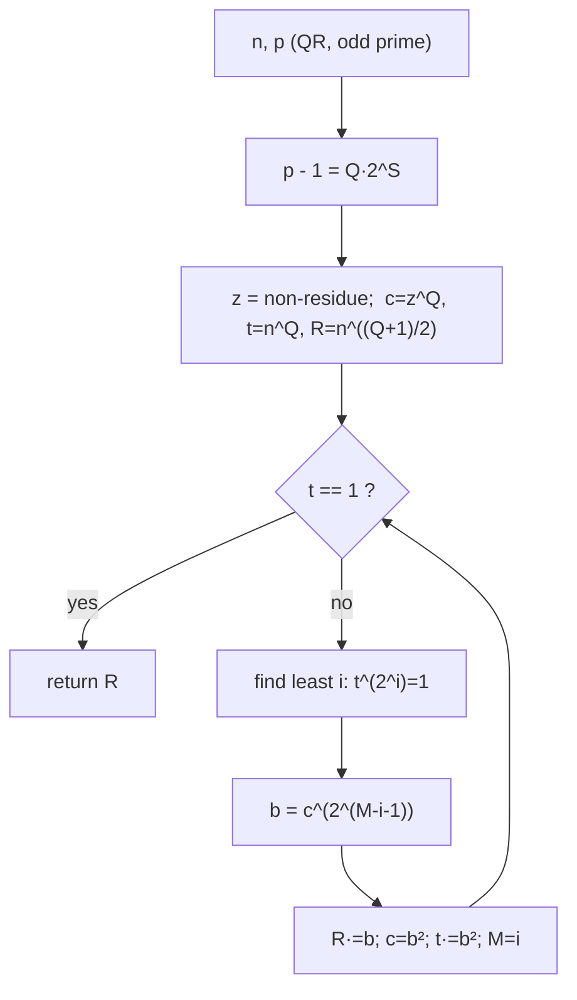

# Tonelli-Shanks — Middle Level

> **Focus:** The full Tonelli-Shanks loop — why the four working values `M, c, t, R` are exactly what you need, how the order-reduction "tweak" cancels one factor of two per round, the Legendre symbol and Euler's criterion in depth, and when to reach for Tonelli-Shanks versus Cipolla.

---

## Table of Contents

1. [Introduction](#introduction)
2. [Deeper Concepts](#deeper-concepts)
3. [Comparison with Alternatives](#comparison-with-alternatives)
4. [The Full Tonelli-Shanks Loop](#the-full-tonelli-shanks-loop)
5. [Why Each Step Works](#why-each-step-works)
6. [Advanced Patterns](#advanced-patterns)
7. [Code Examples](#code-examples)
8. [Error Handling](#error-handling)
9. [Performance Analysis](#performance-analysis)
10. [Best Practices](#best-practices)
11. [Visual Animation](#visual-animation)
12. [Summary](#summary)

---

## Introduction

At junior level the message was: check solvability with **Euler's criterion**, take the one-line `n^((p+1)/4)` shortcut when `p ≡ 3 (mod 4)`, and otherwise "run the algorithm." At middle level we open that black box. The full Tonelli-Shanks algorithm answers a precise structural problem:

- We want `R` with `R² ≡ n`. We can cheaply produce a value `t = n^Q` (where `p − 1 = Q · 2^S`) whose order is a power of two — it lives in the **2-Sylow subgroup** of the units. The whole game is to drive `t` down to `1`, correcting `R` in lockstep.
- The questions that turn "I can recite the steps" into "I understand why it terminates":
  - Why split `p − 1` as `Q · 2^S`? What role does the odd part `Q` play versus the power-of-two part `2^S`?
  - Why does the algorithm need a **quadratic non-residue** `z`, and what does `c = z^Q` give us?
  - What do the four variables `M, c, t, R` *mean*, and why does each round strictly decrease the order of `t`?
  - When is Tonelli-Shanks the right tool, and when is **Cipolla's algorithm** cleaner (e.g. when `S` is huge)?

The payoff: you can implement the loop correctly from memory, reason about its `O(log² p)` cost, and pick the right square-root algorithm for a given prime.

---

## Deeper Concepts

### The 2-Sylow subgroup is where the work happens

Write `p − 1 = Q · 2^S` with `Q` odd. The multiplicative group mod `p` is cyclic of order `p − 1`. Its elements whose order is a power of two form a cyclic subgroup of size `2^S` — the **2-Sylow subgroup** `G₂`. Two facts drive everything:

- For a quadratic residue `n`, the value `t = n^Q` lies in `G₂` (its order divides `2^S`), and crucially `t` is a **square** inside `G₂`, so its order divides `2^(S-1)`.
- For a quadratic non-residue `z`, the value `c = z^Q` is a **generator** of `G₂` (order exactly `2^S`).

So we have a generator `c` of a size-`2^S` cyclic 2-group, and an element `t` we want to kill. Tonelli-Shanks is just "express `t` in terms of the generator and cancel it, lifting the correction back to `R`." (Formal proofs in [`professional.md`](./professional.md).)

### Why `p ≡ 3 (mod 4)` is trivial

If `p ≡ 3 (mod 4)` then `p − 1 ≡ 2 (mod 4)`, so `S = 1` and `Q = (p−1)/2`. The 2-Sylow subgroup is `{1, −1}`, size `2`. The element `t = n^Q = n^((p-1)/2) ≡ 1` immediately (Euler's criterion, since `n` is a QR). With `t = 1` from the start, the loop never runs — and `R = n^((Q+1)/2) = n^((p+1)/4)` is exactly the junior-level shortcut. The shortcut is *Tonelli-Shanks with `S = 1`*.

### Euler's criterion and the Legendre symbol, restated

The Legendre symbol `(n/p)` is defined as `+1` if `n` is a QR mod `p`, `−1` if a non-residue, `0` if `p | n`. **Euler's criterion** computes it:

```
(n/p) ≡ n^((p-1)/2) (mod p)        for odd prime p
```

Key properties used throughout:

- **Multiplicative:** `(ab/p) = (a/p)(b/p)`. So QR·QR = QR, QR·QNR = QNR, QNR·QNR = QR.
- Exactly `(p−1)/2` residues are QR and `(p−1)/2` are QNR — they split the units evenly. This is why a random `z` is a non-residue with probability `1/2`, so trial-finding `z` is fast.
- The criterion is one modular exponentiation, `O(log p)`. (The faster *quadratic-reciprocity* evaluation is `O(log² p)` worst but avoids exponentiation; see [`senior.md`](./senior.md).)

### Finding a non-residue: a coin flip

Tonelli-Shanks needs *any* quadratic non-residue `z`. Since half of all residues are non-residues, you try `z = 2, 3, 5, …` and test `(z/p) = −1`; you expect to succeed within two tries on average. There is no known *deterministic* fast way to find one (it relates to the Generalized Riemann Hypothesis), but in practice the smallest non-residue is tiny, so the search is negligible.

---

## Comparison with Alternatives

### Square-root algorithms head to head

| Algorithm | Time | Needs non-residue? | Best when | Notes |
|-----------|------|--------------------|-----------|-------|
| Brute force | `O(p)` | no | `p` tiny | Try every `x`; unusable for big `p`. |
| `p ≡ 3 (mod 4)` formula | `O(log p)` | no | `p ≡ 3 (mod 4)` | One exponentiation; the common easy case. |
| `p ≡ 5 (mod 8)` formula | `O(log p)` | no (uses `i = 2^Q`) | `p ≡ 5 (mod 8)` | A two-case Atkin variant. |
| **Tonelli-Shanks** | `O(log² p)` avg, `O(S² log p)` | yes (one) | any odd prime, small/moderate `S` | The general workhorse. |
| **Cipolla** | `O(log p)` (a few field mults) | no (finds non-square `a²−n`) | large `S`, or as a clean alternative | Works in `F_{p²}`; cost independent of `S`. |

### Tonelli-Shanks vs Cipolla — the key trade-off

Both solve the *same* problem on the *same* inputs. The difference is how the cost depends on `S` (the power of two in `p − 1`):

| Aspect | Tonelli-Shanks | Cipolla |
|--------|----------------|---------|
| Cost dependence on `S` | `O(S² log p)` — grows with `S` | none — independent of `S` |
| Arithmetic | plain modular `int` | arithmetic in `F_{p²}` (pairs of ints) |
| Setup | find a non-residue `z` | find `a` with `a² − n` a non-residue |
| Typical choice | default; `S` is usually small | preferred when `S` is large (e.g. NTT primes with `S = 23`) |
| Conceptual model | order reduction in the 2-group | one exponentiation in a quadratic extension |

**Choose Tonelli-Shanks when:** `S` is small (most random primes have small `S`), or you want plain integer arithmetic with no field extension.
**Choose Cipolla when:** `S` is large — e.g. `p = 998244353` has `S = 23`, where Tonelli-Shanks does up to `~23²` inner steps while Cipolla is `S`-independent.

---

## The Full Tonelli-Shanks Loop

Here is the canonical algorithm, in pseudocode, with the role of each variable annotated.

```text
tonelliShanks(n, p):                  # p odd prime, n a QR (check criterion first!)
  n %= p
  if n == 0: return 0
  if legendre(n, p) != 1: return NO ROOT

  # --- easy case ---
  if p % 4 == 3: return n^((p+1)/4) mod p

  # --- decompose p - 1 = Q * 2^S, Q odd ---
  Q = p - 1; S = 0
  while Q % 2 == 0: Q /= 2; S += 1

  # --- find a quadratic non-residue z ---
  z = 2
  while legendre(z, p) != -1: z += 1

  # --- initialize the four working values ---
  M = S
  c = z^Q mod p          # generator of the 2-Sylow subgroup, order 2^S
  t = n^Q mod p          # element to drive to 1; order divides 2^(S-1)
  R = n^((Q+1)/2) mod p  # running guess; invariant R^2 == t * n

  # --- order-reduction tweak loop ---
  while t != 1:
    # find least i in [1, M) with t^(2^i) == 1
    i = 0; tmp = t
    while tmp != 1: tmp = tmp*tmp mod p; i += 1

    # correction factor b = c^(2^(M-i-1))
    b = c
    repeat (M - i - 1) times: b = b*b mod p

    R = R * b mod p
    c = b * b mod p        # = b^2
    t = t * c mod p        # = t * b^2
    M = i

  return R                 # other root is p - R
```

The two invariants that make it work (proved in [`professional.md`](./professional.md)):

1. **`R² ≡ t · n (mod p)`** holds at the top of every loop iteration. When `t = 1`, this says `R² ≡ n` — exactly the answer.
2. **The order of `t` strictly decreases** each round (it is `2^i` with `i < M`, and `M` is reset to `i`). Since the order starts at most `2^(S-1)` and is a positive power of two, it reaches `1` after at most `S − 1` rounds — the loop terminates.

---

## Why Each Step Works

### Why `t = n^Q` and `R = n^((Q+1)/2)`

Look at `R² = n^(Q+1) = n^Q · n = t · n`. That is invariant (1) at the start. So the whole job is to make `t = 1` while keeping the invariant: every update multiplies `R` by `b` and `t` by `b²`, preserving `R² = t · n` (since `(Rb)² = R²b² = (tn)b² = (tb²) n`). The exponent `(Q+1)/2` is an integer precisely because `Q` is odd.

### Why we need a non-residue `z`

`c = z^Q` must be a *generator* of the 2-Sylow subgroup `G₂`. A square would only generate half of `G₂` (order `2^(S-1)`), which is not enough to cancel an arbitrary order-`2^i` element. `z` being a non-residue is exactly the condition that `z^Q` has full order `2^S`. So the non-residue is the source of "fresh" power-of-two structure that `t` (a square) lacks.

### Why the correction `b = c^(2^(M-i-1))` is right

`t` has order `2^i` (the inner loop found the least `i` with `t^(2^i) = 1`). We want to multiply `t` by something of order `2^i` that cancels its top bit. `c` has order `2^M`; raising it to `2^(M-i-1)` gives an element of order `2^(i+1)`, whose square `b²` has order `2^i`. Multiplying `t · b²` lowers `t`'s order to at most `2^(i-1)` — one factor of two gone. Meanwhile `R · b` keeps the invariant, and `c ← b²`, `M ← i` set up the next round with a smaller subgroup. Each round peels off one factor of two; that is the "order reduction."

### A worked trace (`p = 17`, `n = 2`)

`17 ≡ 1 (mod 4)`, so we use the full loop. Criterion: `2^8 = 256 ≡ 1 (mod 17)` → QR (`6² = 36 ≡ 2`).

```
p - 1 = 16 = 1 · 2^4  →  Q = 1, S = 4
z = 3:  3^8 mod 17 = 16 ≡ -1  → non-residue, use z = 3
M = 4
c = 3^1 = 3
t = 2^1 = 2
R = 2^((1+1)/2) = 2^1 = 2

Round 1: t = 2 ≠ 1.
  order of t: 2^1=4, 2^2=16, 2^3=256≡1 → i = 3   (t^(2^3)=1, t^(2^2)=16≠1)
  Actually: t=2; 2^2=4; 4^2=16; 16^2=256≡1 → after 3 squarings ⇒ i=3.
  Hmm i must be < M=4. i=3 ✓.
  b = c^(2^(M-i-1)) = 3^(2^(4-3-1)) = 3^(2^0) = 3
  R = 2·3 = 6
  c = 3² = 9
  t = 2·9 = 18 ≡ 1
  M = 3
Round 2: t = 1 → stop.
return R = 6
```

Verify: `6² = 36 ≡ 2 (mod 17)` ✓; other root `17 − 6 = 11`, `11² = 121 ≡ 2` ✓.

---

## Advanced Patterns

### Pattern: Dispatch on `p mod 4` (and optionally `p mod 8`)

The fastest production square root tries cheap closed forms before the general loop.

```text
sqrtMod(n, p):
  assert legendre(n, p) == 1
  if p % 4 == 3:  return n^((p+1)/4)                      # Atkin/Lagrange
  if p % 8 == 5:  ...two-branch formula using 2^((p-1)/4)... # optional fast path
  return tonelliShanks(n, p)                              # general
```

### Pattern: Cipolla as the large-`S` fallback

When `S` is large, swap in Cipolla. Pick `a` with `a² − n` a non-residue, then compute `(a + √(a²−n))^((p+1)/2)` in `F_{p²}`; its "real" part is the root, and the imaginary part is `0`.

```text
cipolla(n, p):
  find a with legendre(a*a - n, p) == -1
  w = a*a - n                      # a "non-square"; √w lives in F_{p²}
  result = (a, 1)^((p+1)/2)        # exponentiate the pair (a + 1·√w)
                                   # in F_{p²} with i² = w
  return result.real               # imaginary part is provably 0
```

### Pattern: Both roots and a verification wrapper

```python
def all_sqrts(n, p, root_fn):
    n %= p
    if n == 0:
        return [0]
    if pow(n, (p - 1) // 2, p) != 1:
        return []                       # non-residue
    x = root_fn(n, p)
    assert x * x % p == n, "sqrt impl bug"
    return sorted({x % p, (p - x) % p})
```



---

## Code Examples

### Full Tonelli-Shanks (general odd prime)

This is the complete algorithm with the easy-case shortcut folded in, plus a brute-force oracle for testing.

#### Go

```go
package main

import "fmt"

func power(a, e, mod int64) int64 {
	a %= mod
	if a < 0 {
		a += mod
	}
	var r int64 = 1
	for e > 0 {
		if e&1 == 1 {
			r = r * a % mod
		}
		a = a * a % mod
		e >>= 1
	}
	return r
}

func legendre(n, p int64) int64 {
	r := power(n, (p-1)/2, p)
	if r == p-1 {
		return -1
	}
	return r
}

// tonelliShanks returns a root x with x*x ≡ n (mod p), and ok=false if none.
func tonelliShanks(n, p int64) (int64, bool) {
	n %= p
	if n < 0 {
		n += p
	}
	if n == 0 {
		return 0, true
	}
	if legendre(n, p) != 1 {
		return 0, false
	}
	if p%4 == 3 {
		return power(n, (p+1)/4, p), true
	}
	// decompose p-1 = Q * 2^S
	Q, S := p-1, int64(0)
	for Q%2 == 0 {
		Q /= 2
		S++
	}
	// find a non-residue z
	z := int64(2)
	for legendre(z, p) != -1 {
		z++
	}
	M := S
	c := power(z, Q, p)
	t := power(n, Q, p)
	R := power(n, (Q+1)/2, p)
	for t != 1 {
		// least i with t^(2^i) == 1
		i, tmp := int64(0), t
		for tmp != 1 {
			tmp = tmp * tmp % p
			i++
		}
		// b = c^(2^(M-i-1))
		b := c
		for j := int64(0); j < M-i-1; j++ {
			b = b * b % p
		}
		R = R * b % p
		c = b * b % p
		t = t * c % p
		M = i
	}
	return R, true
}

func main() {
	for _, tc := range [][2]int64{{2, 7}, {10, 13}, {2, 17}, {5, 13}} {
		x, ok := tonelliShanks(tc[0], tc[1])
		fmt.Printf("sqrt(%d) mod %d = %d (exists=%v)\n", tc[0], tc[1], x, ok)
	}
	// sqrt(2) mod 7 = 4|3 ; sqrt(10) mod 13 = 6|7 ; sqrt(2) mod 17 = 6|11 ; sqrt(5) mod 13 = none
}
```

#### Java

```java
public class TonelliShanks {
    static long power(long a, long e, long mod) {
        a %= mod;
        if (a < 0) a += mod;
        long r = 1;
        while (e > 0) {
            if ((e & 1) == 1) r = r * a % mod;
            a = a * a % mod;
            e >>= 1;
        }
        return r;
    }

    static long legendre(long n, long p) {
        long r = power(n, (p - 1) / 2, p);
        return (r == p - 1) ? -1 : r;
    }

    // returns a root, or -1 if no root exists
    static long tonelliShanks(long n, long p) {
        n %= p;
        if (n < 0) n += p;
        if (n == 0) return 0;
        if (legendre(n, p) != 1) return -1;
        if (p % 4 == 3) return power(n, (p + 1) / 4, p);

        long Q = p - 1, S = 0;
        while (Q % 2 == 0) { Q /= 2; S++; }

        long z = 2;
        while (legendre(z, p) != -1) z++;

        long M = S;
        long c = power(z, Q, p);
        long t = power(n, Q, p);
        long R = power(n, (Q + 1) / 2, p);

        while (t != 1) {
            long i = 0, tmp = t;
            while (tmp != 1) { tmp = tmp * tmp % p; i++; }
            long b = c;
            for (long j = 0; j < M - i - 1; j++) b = b * b % p;
            R = R * b % p;
            c = b * b % p;
            t = t * c % p;
            M = i;
        }
        return R;
    }

    public static void main(String[] args) {
        long[][] tcs = {{2, 7}, {10, 13}, {2, 17}, {5, 13}};
        for (long[] tc : tcs) {
            long x = tonelliShanks(tc[0], tc[1]);
            System.out.printf("sqrt(%d) mod %d = %d%n", tc[0], tc[1], x);
        }
    }
}
```

#### Python

```python
def legendre(n, p):
    r = pow(n % p, (p - 1) // 2, p)
    return -1 if r == p - 1 else r


def tonelli_shanks(n, p):
    """Return a root x with x*x ≡ n (mod p), or None if none exists."""
    n %= p
    if n == 0:
        return 0
    if legendre(n, p) != 1:
        return None
    if p % 4 == 3:
        return pow(n, (p + 1) // 4, p)

    # decompose p - 1 = Q * 2^S
    Q, S = p - 1, 0
    while Q % 2 == 0:
        Q //= 2
        S += 1

    # find a non-residue z
    z = 2
    while legendre(z, p) != -1:
        z += 1

    M = S
    c = pow(z, Q, p)
    t = pow(n, Q, p)
    R = pow(n, (Q + 1) // 2, p)

    while t != 1:
        # least i with t^(2^i) == 1
        i, tmp = 0, t
        while tmp != 1:
            tmp = tmp * tmp % p
            i += 1
        b = pow(c, 1 << (M - i - 1), p)   # c^(2^(M-i-1))
        R = R * b % p
        c = b * b % p
        t = t * c % p
        M = i
    return R


if __name__ == "__main__":
    for n, p in [(2, 7), (10, 13), (2, 17), (5, 13)]:
        x = tonelli_shanks(n, p)
        print(f"sqrt({n}) mod {p} = {x}"
              + ("" if x is None else f"  (other root {p - x})"))
    # sqrt(5) mod 13 = None  (5 is a non-residue)
```

---

## Error Handling

| Scenario | What goes wrong | Correct approach |
|----------|-----------------|------------------|
| Ran loop on a non-residue | The inner "find `i`" loop runs forever (`t^(2^i)` never hits `1` cheaply) or returns junk. | Gate with Euler's criterion before the loop. |
| `i ≥ M` in a round | Algorithm assumes `t` is a square (`order ≤ 2^(M-1)`); a non-residue violates this. | Again, the criterion guarantees `t`'s order `≤ 2^(M-1)`. |
| `c` is a square, not a generator | Used a residue instead of a non-residue for `z`. | Verify `legendre(z, p) == -1` before `c = z^Q`. |
| Overflow in `a*a % p` | `p > 2^31`, product overflows 64-bit. | Use 128-bit mulmod or Montgomery (sibling for big-int). |
| Wrong exponent `(Q+1)/2` | `Q` was even (mis-decomposition). | Ensure the `while Q%2==0` loop ran; `Q` must end odd. |
| Returned only one root | Caller needed both. | Return `{R, p − R}`. |
| Composite `p` | Output is meaningless. | Confirm primality; for composites use Hensel + CRT (see [`senior.md`](./senior.md)). |

---

## Performance Analysis

| Step | Cost | Dominant for |
|------|------|--------------|
| Euler's criterion | `O(log p)` | always run once |
| Decompose `p − 1` | `O(S) = O(log p)` | negligible |
| Find non-residue `z` | `O(log p)` expected (≈ 2 tries) | negligible |
| Initialize `c, t, R` | `O(log p)` each | three exponentiations |
| Tweak loop | `O(S² log p)` worst, `O(S) ` rounds × inner `O(S)` squarings × `O(log)` corrections | large-`S` primes |

The worst case is `Σ` over rounds of (order-finding inner loop + correction), which is `O(S²)` modular multiplications, i.e. `O(S² log p)` bit operations; since `S ≤ log₂ p`, this is `O(log³ p)` in the worst extreme but typically far smaller (small `S`). For large-`S` primes, **Cipolla's `S`-independent `O(log p)`** wins. Benchmark both on your prime distribution.

```python
import timeit

def bench(p, n, fn):
    return timeit.timeit(lambda: fn(n, p), number=10000) / 10000 * 1e6  # µs

# Compare a small-S prime (S small) vs a large-S prime (S=23):
# tonelli on 998244353 (S=23) does ~23^2 inner mults; Cipolla is flat.
```

---

## Best Practices

- **Always run Euler's criterion first.** It both validates solvability and guarantees the loop's order invariant; skipping it can hang the inner loop.
- **Fold in the `p ≡ 3 (mod 4)` shortcut** — most primes hit it and you skip the entire loop.
- **Verify `z` is a non-residue** (`legendre == -1`) before using it; a residue silently breaks `c`'s order.
- **Switch to Cipolla for large `S`** (e.g. NTT-friendly primes `c·2^e + 1` with big `e`); its cost does not grow with `S`.
- **Use `1 << (M-i-1)` only when it fits**; for very large `S` compute `b` by repeated squaring (as in Go/Java above) to avoid huge shifts — though `M-i-1 < S ≤ log₂ p` always fits in a small int.
- **Test against brute force** (`x = 0..p−1`) on small primes, and **re-square** every returned root.
- **Return both roots** or document the convention; crypto callers usually need the pair.

---

## Visual Animation

> See [`animation.html`](./animation.html) for an interactive view.
>
> The middle-level animation highlights:
> - The **Euler-criterion check** landing on `+1` or `−1`.
> - The **`p − 1 = Q · 2^S` decomposition**, peeling factors of two off.
> - The **tweak loop**: the four working values `M, c, t, R` updating each round, the inner order-finding (`t^(2^i) = 1`), the correction `b`, and `t` collapsing toward `1` while `R` converges to the root.
> - Editable `n` and `p` so you can watch the loop on your own inputs.

---

## Summary

The full Tonelli-Shanks algorithm finds a square root of a quadratic residue `n` mod any odd prime `p` by working inside the **2-Sylow subgroup** of size `2^S`, where `p − 1 = Q · 2^S`. A non-residue `z` supplies a generator `c = z^Q` of that subgroup; the element `t = n^Q` is the "error" we drive to `1`, while `R = n^((Q+1)/2)` is the running guess maintaining the invariant `R² ≡ t · n`. Each round of the tweak loop finds the order `2^i` of `t`, applies a power-of-two correction `b = c^(2^(M-i-1))`, and lowers `t`'s order by one factor of two — so it terminates in at most `S − 1` rounds at `O(S² log p)` cost. Euler's criterion (the Legendre symbol `n^((p-1)/2)`) gates the whole thing: it confirms solvability and guarantees the order invariant. The `p ≡ 3 (mod 4)` shortcut is simply the `S = 1` case. When `S` is large, **Cipolla's algorithm** — one exponentiation in `F_{p²}`, cost independent of `S` — is the better choice. Master the four-variable loop and the order-reduction argument, and you own the general modular square root.

---

Next step: [`senior.md`](./senior.md) — crypto/ECC usage, finding non-residues at scale, prime-power and composite extensions (Hensel lifting + CRT), and choosing Tonelli-Shanks vs Cipolla in production.
