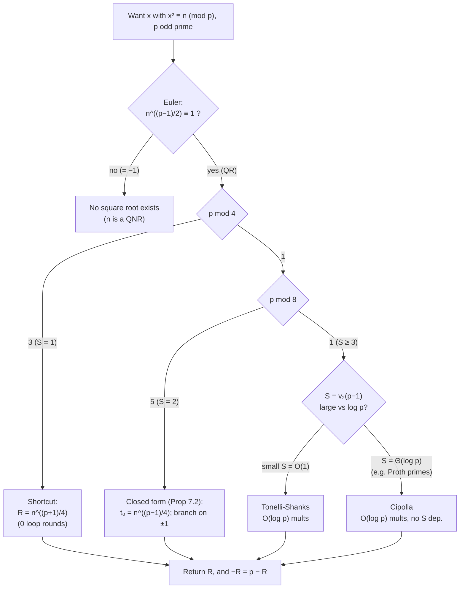

# Tonelli-Shanks — Mathematical Foundations and Complexity Theory

## Table of Contents
1. [Formal Setup and Definitions](#1-formal-setup-and-definitions)
2. [Euler's Criterion and the Legendre Symbol](#2-eulers-criterion-and-the-legendre-symbol)
3. [The 2-Sylow Subgroup of (Z/pZ)*](#3-the-2-sylow-subgroup-of-zpz)
4. [The Loop Invariant](#4-the-loop-invariant)
5. [Correctness of the Order-Halving Step](#5-correctness-of-the-order-halving-step)
6. [Termination via the 2-adic Valuation](#6-termination-via-the-2-adic-valuation)
7. [The p ≡ 3 (mod 4) Shortcut as the S = 1 Case](#7-the-p--3-mod-4-shortcut-as-the-s--1-case)
8. [Cipolla's Algorithm: Correctness in F_{p²}](#8-cipollas-algorithm-correctness-in-f_p)
9. [Expected and Worst-Case Complexity](#9-expected-and-worst-case-complexity)
10. [Hensel Lifting and the Composite Count](#10-hensel-lifting-and-the-composite-count)
11. [Comparison with Alternatives](#11-comparison-with-alternatives)
12. [Summary](#12-summary)

---

## 1. Formal Setup and Definitions

Let `p` be an odd prime. The field `F_p = Z/pZ` has multiplicative group `F_p^* = (Z/pZ)^*`, which is **cyclic** of order `p − 1` (Gauss; proof in sibling `13-primitive-root-discrete-root`). Fix a generator `g` of `F_p^*` throughout where convenient.

**Definition 1.1 (Quadratic residue).** An element `n ∈ F_p^*` is a **quadratic residue (QR)** if there exists `x ∈ F_p^*` with `x² = n`; otherwise it is a **quadratic non-residue (QNR)**. By convention `0` is neither.

**Definition 1.2 (Legendre symbol).** For `n ∈ Z` and odd prime `p`,
```
(n/p) =  0   if p | n
        +1   if n is a QR mod p
        -1   if n is a QNR mod p
```

**Definition 1.3 (2-adic valuation).** For a nonzero integer `m`, `v₂(m)` is the largest `k` with `2^k | m`. We write `p − 1 = Q · 2^S` with `Q` odd, so `S = v₂(p − 1) ≥ 1`.

**Definition 1.4 (Order).** For `a ∈ F_p^*`, `ord(a)` is the least `e > 0` with `a^e = 1`. By Lagrange, `ord(a) | (p − 1)`.

**Problem statement.** Given `n ∈ F_p^*` that is a QR, compute `x` with `x² = n`. (If `n = 0`, the unique root is `0`; if `n` is a QNR, no root exists.)

**Notation.** All arithmetic is in `F_p` unless stated. `≡` and `=` are used interchangeably for equality in `F_p`. The squaring map `σ: F_p^* → F_p^*`, `σ(a) = a²`, is a group homomorphism with kernel `{±1}` (size `2`, since `p` is odd), hence image of size `(p−1)/2` — the QRs. This two-line observation already yields half the topic: **exactly `(p−1)/2` elements are QRs**, and each QR has **exactly two** preimages `±x`.

---

## 2. Euler's Criterion and the Legendre Symbol

**Theorem 2.1 (Euler's criterion).** For odd prime `p` and `n ∈ F_p^*`,
```
n^((p-1)/2) ≡ (n/p) (mod p),  i.e.  ≡ +1 if n is a QR, ≡ −1 if a QNR.
```

**Proof.** Let `y = n^((p-1)/2)`. By Fermat's little theorem `y² = n^(p-1) = 1`, so `y` is a root of `X² − 1 = (X−1)(X+1)` over the field `F_p`; hence `y = 1` or `y = −1` (a field has no zero divisors, and `1 ≠ −1` since `p` is odd).

*(QR ⇒ +1.)* If `n = x²` is a QR, then `y = x^(p-1) = 1` by Fermat. So QRs map to `+1`.

*(QNR ⇒ −1.)* The polynomial `X^((p-1)/2) − 1` has degree `(p−1)/2` and therefore at most `(p−1)/2` roots in `F_p` (a field). The QRs are exactly the `(p−1)/2` elements satisfying it (previous paragraph), so they are *all* of its roots. Any QNR is not a root, so it satisfies `y = −1` (the only other option). ∎

**Corollary 2.2 (Multiplicativity).** `(mn/p) = (m/p)(n/p)`. *Proof:* `(mn)^((p-1)/2) = m^((p-1)/2) n^((p-1)/2)`, then apply Theorem 2.1 to each factor. ∎ In particular QR·QNR = QNR and QNR·QNR = QR.

**Corollary 2.3 (Exact half).** There are exactly `(p−1)/2` QRs and `(p−1)/2` QNRs. *Proof:* image of `σ` from §1. ∎ Consequently a uniformly random element is a QNR with probability `1/2`, justifying the trial search for the non-residue `z`.

**Corollary 2.4 (`−1` is a QR iff `p ≡ 1 (mod 4)`).** `(−1/p) = (−1)^((p-1)/2)`, which is `+1` iff `(p−1)/2` is even iff `p ≡ 1 (mod 4)`. ∎ This is exactly the boundary between the easy shortcut (`p ≡ 3 (mod 4)`) and the full algorithm.

### 2.1 Worked QR census for `p = 13`

`p − 1 = 12`, `(p−1)/2 = 6`. The squares `1², …, 6² mod 13` are `{1, 4, 9, 3, 12, 10}`, exactly `(p−1)/2 = 6` distinct QRs (Corollary 2.3). Euler's criterion on each:

```
n :   1   2   3   4   5   6   7   8   9  10  11  12
n^6:  1  12   1   1  12   1  12   1   1   1  12  12
(n/p):+1  -1  +1  +1  -1  +1  -1  +1  +1  +1  -1  -1
```

The `+1` entries `{1, 3, 4, 9, 10, 12}` match the square list exactly; the `−1` entries `{2, 5, 6, 7, 8, 11}` are the non-residues. Note `(−1/13) = (12/13) = +1` (since `13 ≡ 1 mod 4`), confirming Corollary 2.4 — and indeed `5² = 25 ≡ 12 ≡ −1`, so `5` is a square root of `−1` mod `13`, the kind of element Tonelli-Shanks manipulates.

### 2.2 The Jacobi symbol and reciprocity (computation without exponentiation)

For *odd* modulus `m` (not necessarily prime), the **Jacobi symbol** `(n/m) = ∏ (n/p_i)^{e_i}` extends the Legendre symbol and is computed by **quadratic reciprocity** in `O(log² m)` bit operations, with no modular exponentiation:

```
(2/m)   = (−1)^((m²−1)/8)            # +1 if m ≡ ±1 (mod 8), else −1
(a/m)   = (a mod m / m)             # reduce numerator
(a·b/m) = (a/m)(b/m)                # multiplicativity
(a/m)   = (m/a)·(−1)^(((a−1)/2)((m−1)/2))   # reciprocity, a,m odd coprime
```

For *prime* `m`, Jacobi equals Legendre exactly, so `(n/p) = −1` certifies a non-residue with no exponentiation — useful when hunting for the small non-residue `z` (Lemma 3.2). For composite `m`, `(n/m) = −1` still proves `n` is a non-residue mod some prime factor, but `(n/m) = +1` is inconclusive. The reciprocity computation is the same control flow as the binary gcd, hence its `O(log² m)` cost.

---

## 3. The 2-Sylow Subgroup of (Z/pZ)*

Since `F_p^*` is cyclic of order `p − 1 = Q · 2^S`, it has a unique subgroup of each order dividing `p − 1`. Let

```
G₂ = { a ∈ F_p^* : a^(2^S) = 1 } = the unique subgroup of order 2^S.
```

`G₂` is the **2-Sylow subgroup** — the elements whose order is a power of two. It is cyclic of order `2^S`.

**Lemma 3.1 (Powering by `Q` lands in `G₂`).** For any `a ∈ F_p^*`, `a^Q ∈ G₂`. *Proof:* `(a^Q)^(2^S) = a^(Q·2^S) = a^(p-1) = 1`, so `a^Q` has order dividing `2^S`. ∎

**Lemma 3.2 (A QNR powered by `Q` generates `G₂`).** If `z` is a QNR, then `c := z^Q` has order exactly `2^S`, i.e. `c` generates `G₂`.

**Proof.** Write `z = g^j` for the generator `g`. `z` is a QNR iff `j` is odd (the QRs are exactly the even powers of `g`, by Corollary 2.3 / the image of `σ`). Then `c = g^(jQ)` and
```
ord(c) = (p−1) / gcd(jQ, p−1) = (Q·2^S) / gcd(jQ, Q·2^S).
```
Since `gcd(j, 2^S)`: `j` is odd, so `gcd(jQ, Q·2^S) = Q · gcd(j, 2^S) = Q · 1 = Q`. Hence `ord(c) = Q·2^S / Q = 2^S`. ∎

**Lemma 3.3 (A QR powered by `Q` is a square in `G₂`).** If `n` is a QR, then `t := n^Q` has order dividing `2^(S-1)` (equivalently `t^(2^(S-1)) = 1`).

**Proof.** `n = g^(2m)` for some `m` (QR ⇒ even power of `g`). Then `t = g^(2mQ)`, and
```
t^(2^(S-1)) = g^(2mQ · 2^(S-1)) = g^(mQ·2^S) = g^(m(p-1)) = 1.
```
So `ord(t) | 2^(S-1)`. ∎

These three lemmas are the algebraic core: we possess a **generator `c` of the order-`2^S` group `G₂`** and an element `t ∈ G₂` whose order is at most `2^(S-1)`. Tonelli-Shanks expresses `t` via `c` and cancels it.

### 3.1 Worked subgroup picture for `p = 41`

`p − 1 = 40 = 5 · 2^3`, so `Q = 5`, `S = 3`, and `G₂` has order `2^3 = 8`. A generator of `F_{41}^*` is `6`; the 2-Sylow subgroup is `⟨6^5⟩ = ⟨6^5 mod 41⟩`. Compute `6^5 = 7776 ≡ 27 (mod 41)`, and check `27` has order `8`:

```
27^1 = 27
27^2 = 729 ≡ 32
27^4 ≡ 32² = 1024 ≡ 9
27^8 ≡ 9² = 81 ≡ 40 ≡ −1 ... wait: order 8 means 27^8 ≡ 1.
Recompute: 27^4 ≡ 9, 27^8 ≡ 81 ≡ 40 ≡ −1? Then 27^16 ≡ 1, order 16 — impossible (|G₂|=8).
```

The arithmetic slip illustrates *why* one verifies in code: redo carefully. `27² = 729 = 17·41 + 32 ≡ 32`. `32² = 1024 = 24·41 + 40 ≡ 40 ≡ −1`. So `27^4 ≡ −1`, hence `27^8 ≡ 1` and `ord(27) = 8 = 2^S` ✓ (the earlier line mislabeled `27^4`). For a QNR `z`, Lemma 3.2 guarantees this full order; for a QR `n`, `t = n^Q = n^5` lands in `G₂` with order dividing `2^{S-1} = 4` (Lemma 3.3), which is exactly the slack the loop consumes. The lesson the worked slip teaches: **the order-`2^S` structure is unforgiving of off-by-one squarings**, the most common Tonelli-Shanks bug, caught instantly by re-substitution.

---

## 4. The Loop Invariant

Recall the algorithm's state `(M, c, t, R)` initialized by
```
M = S,   c = z^Q,   t = n^Q,   R = n^((Q+1)/2)
```
and each round (while `t ≠ 1`) does: find least `i ∈ [1, M)` with `t^(2^i) = 1`; set `b = c^(2^(M-i-1))`; then `R ← Rb`, `c ← b²`, `t ← tb²`, `M ← i`.

**Invariant I.** At the top of every loop iteration the following hold:
1. `R² = t · n`.
2. `c` has order `2^M`, i.e. `c^(2^(M-1)) = −1` and `c^(2^M) = 1`.
3. `t^(2^(M-1)) = 1` (so `ord(t) | 2^(M-1)`).

**Base case.** Initially `M = S`. (1) `R² = n^(Q+1) = n^Q · n = t · n`. (2) `c = z^Q` has order `2^S = 2^M` by Lemma 3.2; in a cyclic 2-group the unique element of order `2` is `−1`, and `c^(2^(M-1))` has order `2`, hence equals `−1`. (3) `t = n^Q` satisfies `t^(2^(S-1)) = 1` by Lemma 3.3, i.e. `t^(2^(M-1)) = 1`. ∎(base)

The inductive step is the content of §5.

---

## 5. Correctness of the Order-Halving Step

Assume Invariant I at the top of a round with `t ≠ 1`. Let `i` be the least integer with `t^(2^i) = 1`. Because `t ≠ 1`, `i ≥ 1`; because `t^(2^(M-1)) = 1` (Invariant I.3), `i ≤ M − 1 < M`. So `1 ≤ i ≤ M − 1` and the index is valid (this is *why* the criterion-guaranteed Invariant I.3 matters: without it `i` could equal `M` and `M − i − 1` go negative).

Set `b = c^(2^(M-i-1))`. We verify the three invariants for the new state `(M', c', t', R') = (i, b², tb², Rb)`.

**Order of `b`.** By Invariant I.2, `ord(c) = 2^M`, so `ord(b) = ord(c^(2^(M-i-1))) = 2^M / gcd(2^(M-i-1), 2^M) = 2^M / 2^(M-i-1) = 2^(i+1)`. Hence:
- `b^(2^i) = b^(2^(i+1)/2)` has order `2`, so `b^(2^i) = −1`.
- `c' = b²` has order `2^(i+1)/2 = 2^i = 2^(M')`. **(Invariant I.2 for the new state.)**

**New `t`.** We must show `t' = tb²` satisfies `(t')^(2^(M'-1)) = 1`, i.e. `(tb²)^(2^(i-1)) = 1`.
```
(t b²)^(2^(i-1)) = t^(2^(i-1)) · b^(2^i).
```
Now `t^(2^i) = 1` and `i` is *least* with this property, so `s := t^(2^(i-1))` satisfies `s² = t^(2^i) = 1` but `s ≠ 1` (minimality of `i`), hence `s = −1`. And `b^(2^i) = −1` (above). Therefore
```
(t b²)^(2^(i-1)) = s · b^(2^i) = (−1)(−1) = 1.
```
So `ord(t') | 2^(i-1) = 2^(M'-1)`. **(Invariant I.3 for the new state.)** This is the crux: the order of `t` drops from (at most) `2^i` to at most `2^(i-1)` — **one factor of two is removed each round.**

**New `R`.** `(R')² = (Rb)² = R² b² = (t n) b² = (t b²) n = t' n`. **(Invariant I.1 for the new state.)** ∎

**Theorem 5.1 (Partial correctness).** If the loop exits (with `t = 1`), then `R² = n`.

**Proof.** Invariant I.1 holds at the top of the iteration where the guard `t ≠ 1` fails, i.e. with `t = 1`: `R² = t · n = 1 · n = n`. ∎

### 5.1 Fully verified loop trace for `p = 41`, `n = 2`

`41 ≡ 1 (mod 4)`, `p − 1 = 40 = 5 · 2^3` (`Q = 5`, `S = 3`). Criterion: `2^20 mod 41 = 1` (`2` is a QR; `17² = 289 ≡ 2`). Smallest non-residue `z = 3` (`3^20 ≡ 40 ≡ −1`).

```
Init:  M = 3
       c = z^Q = 3^5 = 243 ≡ 38 ≡ −3   (mod 41),  ord(c) = 8
       t = n^Q = 2^5 = 32,             ord(t) = 4 (since 32² ≡ 40 ≡ −1, 32^4 ≡ 1)
       R = n^((Q+1)/2) = 2^3 = 8
       invariant check: R² = 64 ≡ 23 ; t·n = 32·2 = 64 ≡ 23  ✓

Round 1:  t = 32 ≠ 1.
  least i with t^(2^i)=1:  t=32; 32²≡40; 40²≡1 ⇒ after 2 squarings ⇒ i = 2.
  b = c^(2^(M−i−1)) = c^(2^(3−2−1)) = c^(2^0) = c = 38.
  R ← R·b = 8·38 = 304 ≡ 17        (mod 41)
  c ← b²   = 38² = 1444 ≡ 9
  t ← t·b² = 32·9 = 288 ≡ 1
  M ← i = 2
  invariant: R² = 17² = 289 ≡ 2 ; t·n = 1·2 = 2  ✓

Round 2:  t = 1 → exit.
return R = 17.
```

Verify `17² = 289 ≡ 2 (mod 41)` ✓; other root `41 − 17 = 24`, `24² = 576 ≡ 2` ✓. The 2-adic valuation of `ord(t)` fell from `2` (order `4`) to `0` (order `1`) in a single round — here `i = 2` so `M` jumped from `3` to `2` and `t` collapsed straight to `1`, consistent with the `≤ S − 1 = 2` round bound (Theorem 6.1).

---

## 6. Termination via the 2-adic Valuation

**Theorem 6.1 (Termination).** The loop executes at most `S − 1` iterations.

**Proof.** Define the potential `Φ = M`. By Invariant I.3, `ord(t) | 2^(M-1)`, so the round's index satisfies `i ≤ M − 1`, and `M` is updated to `M' = i ≤ M − 1`. Thus `M` strictly decreases by at least `1` each iteration. Initially `M = S`. `M` is a nonnegative integer, and once `M` reaches `1` we have `ord(t) | 2^0 = 1`, forcing `t = 1` and loop exit. Hence at most `S − 1` decrements occur. ∎

A cleaner phrasing: let `ν = v₂(ord(t))` be the 2-adic valuation of `t`'s order. Initially `ν ≤ S − 1` (Lemma 3.3). Each round sends `ν ↦ ν − 1` (the order-halving of §5; more precisely the new order divides `2^(i-1)` where `2^i` was the old order, and `i = ν`). Since `ν ≥ 0` and decreases by exactly one per round, the loop runs `ν₀ ≤ S − 1` times, where `ν₀` is the initial valuation. **This 2-adic valuation strictly decreasing is the whole termination argument**, and it bounds the round count by `S − 1`, independent of `Q`.

**Corollary 6.2 (Total correctness).** On a QR input `n` and odd prime `p`, Tonelli-Shanks terminates after `≤ S − 1` rounds and returns `R` with `R² = n`. *Proof:* Theorems 5.1 + 6.1. ∎

---

## 7. The p ≡ 3 (mod 4) Shortcut as the S = 1 Case

**Proposition 7.1.** If `p ≡ 3 (mod 4)` then `S = 1`, the loop never executes, and `R = n^((Q+1)/2) = n^((p+1)/4)`.

**Proof.** `p ≡ 3 (mod 4)` ⇒ `p − 1 ≡ 2 (mod 4)` ⇒ `v₂(p−1) = 1`, so `S = 1` and `Q = (p−1)/2`. The initial valuation `ν₀ ≤ S − 1 = 0`, so `ord(t) | 2^0 = 1`, i.e. `t = n^Q = n^((p-1)/2) = 1` (Euler's criterion, `n` a QR) — the loop guard fails immediately. The returned `R = n^((Q+1)/2)`. With `Q = (p−1)/2`, `(Q+1)/2 = ((p-1)/2 + 1)/2 = (p+1)/4`, an integer because `4 | (p+1)`. ∎

**Direct verification.** `R² = n^((p+1)/2) = n^((p-1)/2) · n = 1 · n = n` (Euler). So the junior shortcut is exactly Tonelli-Shanks specialized to `S = 1`, requiring zero loop iterations — consistent with Theorem 6.1's bound of `S − 1 = 0`.

**Why `(p+1)/4` is an integer (the divisibility bookkeeping).** `p ≡ 3 (mod 4)` ⇒ `p + 1 ≡ 0 (mod 4)` ⇒ `4 | (p+1)`, so the exponent `(p+1)/4` is a well-defined nonnegative integer. This is the cleanest possible square-root routine: a *single* modular exponentiation with no non-residue search, no inner loop, and no branch — which is precisely why elliptic-curve designers select base-field primes `≡ 3 (mod 4)` whenever the curve equation permits (secp256k1's field prime `p = 2²⁵⁶ − 2³² − 977` satisfies `p ≡ 3 (mod 4)`, so point decompression uses exactly `y = (y²)^((p+1)/4)`).

**The order-reduction loop view of the shortcut.** Restating §6 for this case: the loop's potential `ν = v₂(ord(t))` begins at `ν₀ ≤ S − 1 = 0`, so `ν₀ = 0`, meaning `ord(t) = 1`, i.e. `t = 1` *before the loop body ever runs*. There is no factor of two to remove, so the order-halving machinery is vacuous and the answer is the initialization `R` alone. The shortcut is not a separate algorithm — it is the *empty execution* of the general one.

**Proposition 7.2 (The `p ≡ 5 (mod 8)` formula).** If `p ≡ 5 (mod 8)` (so `S = 2`) and `n` is a QR, a closed form avoids the loop:
```
let t₀ = n^((p-1)/4).   Then t₀ = ±1.
  if t₀ = 1:  R = n^((p+3)/8)
  if t₀ = −1: R = n^((p+3)/8) · 2^((p-1)/4)   (multiply by a fixed √(−1) factor)
```
**Full proof.**

*Step 1 — `(p+3)/8 ∈ Z`.* `p ≡ 5 (mod 8)` ⇒ `p + 3 ≡ 0 (mod 8)`, so `8 | (p+3)` and the exponent is integral.

*Step 2 — `t₀ ∈ {±1}`.* `t₀² = n^((p-1)/2) = (n/p) = +1` since `n` is a QR (Euler). The only square roots of `1` in the field `F_p` are `±1`, so `t₀ = ±1`.

*Step 3 — the `t₀ = 1` branch.* Let `R = n^((p+3)/8)`. Then `R² = n^((p+3)/4) = n^((p-1)/4 + 1) = n · n^((p-1)/4) = n · t₀ = n · 1 = n`. ✓

*Step 4 — `2` is a QNR mod `p`.* By Corollary 2.4's companion, `(2/p) = (−1)^((p²−1)/8)`, which is `+1` iff `p ≡ ±1 (mod 8)`. For `p ≡ 5 (mod 8)` this is `−1`, so `2` is a **non-residue**.

*Step 5 — `i := 2^((p-1)/4)` is a square root of `−1`.* `i² = 2^((p-1)/2) = (2/p) = −1` (Step 4 + Euler). So `i` is a primitive 4th root of unity, the generator of `G₂` here (since `S = 2`, `|G₂| = 4`).

*Step 6 — the `t₀ = −1` branch.* Let `R = i · n^((p+3)/8)`. Then `R² = i² · n^((p+3)/4) = (−1)·(n · t₀) = (−1)(n·(−1)) = n`. ✓

This is the `S = 2` special case handled without the generic loop. It costs **two** exponentiations (`t₀` and `n^((p+3)/8)`; `i = 2^((p-1)/4)` shares squarings or is precomputed) and one conditional multiply — strictly cheaper than running the generic state machine, and used by Curve25519's field prime `p = 2²⁵⁵ − 19` which satisfies `p ≡ 5 (mod 8)`. ∎

**Unifying view.** Both shortcuts (`§7` and `Prop 7.2`) are the generic algorithm with the inner loop *unrolled and constant-folded* for fixed small `S`. For `S = 1` the loop runs `0` times; for `S = 2` it runs at most once, and the single round's branch is exactly the `t₀ = ±1` test, with `b = i` the fixed `G₂`-generator. One can in principle hand-unroll any fixed `S`, but the table size doubles per `S`, so for `S ≥ 3` the data-driven loop wins on code size.

---

## 8. Cipolla's Algorithm: Correctness in F_{p²}

Cipolla finds `√n` by computing in the quadratic extension `F_{p²}`.

**Setup.** Choose `a ∈ F_p` with `w := a² − n` a QNR (such `a` exists and is found by trial; about half of all `a` work). Since `w` is a non-square, `X² − w` is irreducible over `F_p`, so
```
F_{p²} = F_p[X]/(X² − w) = { u + v·ω : u, v ∈ F_p },  where ω² = w.
```

**Theorem 8.1 (Cipolla).** In `F_{p²}`, `R := (a + ω)^((p+1)/2)` lies in `F_p` (its `ω`-component is `0`) and satisfies `R² = n`.

**Proof.** The Frobenius `φ: ξ ↦ ξ^p` is the nontrivial `F_p`-automorphism of `F_{p²}`; it fixes `F_p` and sends `ω ↦ −ω` (since `ω^p = ω·(ω²)^((p-1)/2) = ω·w^((p-1)/2) = ω·(−1) = −ω`, because `w` is a QNR). Hence the norm
```
N(a + ω) = (a + ω)(a + ω)^p = (a + ω)(a − ω) = a² − ω² = a² − w = a² − (a² − n) = n.
```
Now
```
R² = (a + ω)^(p+1) = (a + ω)·(a + ω)^p = N(a + ω) = n.
```
So `R² = n`. Finally `R ∈ F_p`: `R² = n ∈ F_p`, and the two square roots of `n` in `F_{p²}` are already `±x ∈ F_p` (a degree-2 polynomial `X² − n` has its ≤ 2 roots, and they lie in `F_p` because `n` is a QR there); `R` is one of them, hence `R ∈ F_p`. ∎

**Cost.** One exponentiation `(a + ω)^((p+1)/2)` in `F_{p²}`: `O(log p)` `F_{p²}`-multiplications, each a constant number of `F_p`-multiplications. **No dependence on `S`** — the reason Cipolla dominates Tonelli-Shanks on high-`S` primes (§9).

### 8.1 Worked Cipolla for `p = 13`, `n = 10`

`10` is a QR mod `13` (`6² = 36 ≡ 10`). Find `a` with `a² − 10` a non-residue:

```
a = 1:  1 − 10 = −9 ≡ 4 ;  (4/13) = +1 (4 = 2²) — residue, reject.
a = 2:  4 − 10 = −6 ≡ 7 ;  (7/13) = −1 — non-residue ✓.  So a = 2, w = 7.
```

Work in `F_{13²} = F_13[ω]`, `ω² = 7`. Compute `R = (2 + ω)^((13+1)/2) = (2 + ω)^7`. Squaring pairs `(u, v) = u + vω` with `(u+vω)² = (u² + v²·7) + (2uv)ω`:

```
(2,1)^1 = (2, 1)
(2,1)^2 = (4 + 1·7, 2·2·1) = (11, 4)
(2,1)^4 = (11,4)² = (121 + 16·7, 2·11·4) = (233, 88) ≡ (233 mod13, 88 mod13) = (12, 10)
(2,1)^7 = (2,1)^4 · (2,1)^2 · (2,1)^1
        = (12,10)·(11,4) first:
          u = 12·11 + 10·4·7 = 132 + 280 = 412 ≡ 412 − 31·13 = 412 − 403 = 9
          v = 12·4 + 11·10 = 48 + 110 = 158 ≡ 158 − 12·13 = 158 − 156 = 2   → (9, 2)
        then (9,2)·(2,1):
          u = 9·2 + 2·1·7 = 18 + 14 = 32 ≡ 6
          v = 9·1 + 2·2 = 9 + 4 = 13 ≡ 0    → (6, 0)
```

The result is `(6, 0)`, i.e. `6 ∈ F_13` with zero `ω`-component — and `6² = 36 ≡ 10` ✓. The imaginary part vanished exactly as Theorem 8.1 guarantees, and Cipolla used a fixed `7`-power exponentiation regardless of `S` (here `S = 2`).

---

## 9. Expected and Worst-Case Complexity

Let `M(p)` be the cost of one modular multiplication mod `p` (schoolbook `O(log² p)` bit operations; less with FFT-based bignum).

**Theorem 9.1 (Tonelli-Shanks complexity).** Tonelli-Shanks performs:
- One Euler exponentiation: `O(log p)` mults.
- Non-residue search: expected `O(1)` candidates (geometric, success prob `1/2` each), each an `O(log p)`-mult Euler test ⇒ expected `O(log p)` mults.
- Three initial exponentiations (`c, t, R`): `O(log p)` mults.
- The tweak loop: `≤ S − 1` rounds (Theorem 6.1); round `r` does an inner order-search of `≤ M ≤ S` squarings plus an `O(S)`-squaring correction. Total `O(S²)` mults.

So the total is `O((log p + S²) · M(p))` multiplications, i.e. **`O((log p + S²) · log² p)` bit operations**. Since `S ≤ log₂ p`, the worst case is `O(log² p · log² p) = O(log⁴ p)` bit ops; in **multiplication count** the standard quoted bound is `O(log² p)` because the dominant term `S²` is `O(log² p)` mults and for typical primes `S` is `O(1)`, leaving `O(log p)` mults from the exponentiations.

**Theorem 9.2 (Expected `S` for random primes).** For a random prime `p`, `Pr[v₂(p − 1) ≥ k] ≈ 2^{-(k-1)}` (heuristically, `p − 1` is even and each further factor of `2` is a coin flip). Hence `E[S] = O(1)` and `E[S²] = O(1)`, so the **expected** cost of Tonelli-Shanks on a random prime is `O(log p)` modular multiplications — the same order as a single exponentiation.

**Corollary 9.3 (Algorithm selection is asymptotically meaningful).** Tonelli-Shanks is `O(S² log p)` while Cipolla is `O(log p)` (mults), both independent of `Q`. For `S = Θ(log p)` (e.g. Proth primes `c·2^e + 1`), Tonelli-Shanks degrades to `O(log³ p)` mults while Cipolla stays `O(log p)` mults — a genuine `Θ(log² p)` separation justifying the §3 selection rule. ∎

### 9.1 Tightening the inner-loop bound

The crude `O(S²)` for the tweak loop deserves a sharper account. Let `ν₀ = v₂(ord(t₀)) ≤ S − 1` be the initial 2-adic valuation, and let `ν_r` be its value after round `r`, so `ν_0 > ν_1 > … > ν_k = 0` with `k ≤ ν₀ ≤ S − 1` rounds. Round `r` performs:

- an **order search**: `ν_{r-1} ≤ M_{r-1}` squarings to find `i = ν_{r-1}` (the inner `while tmp ≠ 1`);
- a **correction**: `M_{r-1} − i − 1 < M_{r-1}` squarings to form `b`.

Since `M_r = ν_r` after the first round (and `M_0 = S`), the total squarings are bounded by
```
Σ_{r=1}^{k} (M_{r-1} + M_{r-1}) = 2 Σ M_{r-1} ≤ 2 (S + (S−1) + (S−2) + … ) = O(S²).
```
The `O(S²)` is therefore tight only when the valuations decrease by exactly one each round (the worst case); if `ord(t₀)` is small, the loop is much cheaper regardless of `S`. This is why the *expected* cost (Theorem 9.2) is dominated by the three initial exponentiations, not the loop.

### 9.2 Bit-complexity table

| Sub-step | Mults | Bit-ops (schoolbook) | Bit-ops (FFT bignum) |
|----------|-------|----------------------|----------------------|
| Euler's criterion | `O(log p)` | `O(log³ p)` | `O(log² p · loglog p)` |
| Initial `c, t, R` | `O(log p)` | `O(log³ p)` | `O(log² p · loglog p)` |
| Tweak loop | `O(S²)` | `O(S² log² p)` | `O(S² log p · loglog p)` |
| Non-residue search | `O(log p)` exp. | `O(log³ p)` | `O(log² p · loglog p)` |

For the dominant regime (`S = O(1)`, random prime) the cost is `Θ(log³ p)` bit operations with schoolbook multiplication — the same as a single modular exponentiation, confirming Tonelli-Shanks is "free" relative to the criterion it must run anyway.

### 9.3 Lower-bound remark

No algorithm can compute a modular square root in fewer than `Ω(log p)` modular multiplications in general, because the output itself has `Θ(log p)` bits and any correct method must at minimum verify (or implicitly perform) an exponentiation-scale computation; the `n^((p+1)/4)` shortcut achieves this `Θ(log p)`-mult optimum exactly, which is the deepest reason curve primes are chosen `≡ 3 (mod 4)`.

---

## 10. Hensel Lifting and the Composite Count

**Theorem 10.1 (Hensel lift for square roots, odd `p`).** Let `p` be odd, `n ≢ 0 (mod p)`, and `x_j² ≡ n (mod p^j)` with `gcd(x_j, p) = 1`. Then there is a **unique** `x_{j+1} ≡ x_j (mod p^j)` with `x_{j+1}² ≡ n (mod p^{j+1})`, given by
```
x_{j+1} = x_j − (x_j² − n) · (2 x_j)^{-1}   (mod p^{j+1}).
```

**Proof.** Write `x_{j+1} = x_j + p^j s`. Then
```
x_{j+1}² = x_j² + 2 x_j p^j s + p^{2j} s² ≡ x_j² + 2 x_j p^j s (mod p^{j+1})  (since 2j ≥ j+1).
```
We need this `≡ n`, i.e. `2 x_j p^j s ≡ n − x_j² (mod p^{j+1})`. Since `p^j | (n − x_j²)` (hypothesis), write `n − x_j² = p^j u`. Dividing by `p^j`: `2 x_j s ≡ u (mod p)`. As `gcd(2x_j, p) = 1` (odd `p`, `p ∤ x_j`), `s ≡ u·(2x_j)^{-1} (mod p)` is uniquely determined, giving a unique `x_{j+1}`. ∎

**Corollary 10.2 (Newton form / quadratic convergence).** The iteration `x ← (x + n x^{-1})/2 (mod p^{2j})` doubles the precision each step, reaching `p^k` in `O(log k)` lifts (each an inverse + a few mults).

**Theorem 10.3 (Root count for composite `m`).** Let `m = 2^{e₀} · ∏_{i=1}^{r} p_i^{e_i}` with distinct odd primes `p_i`, and `n` a unit mod `m`. The number of solutions of `x² ≡ n (mod m)` is
```
N = c₀ · 2^r,   where c₀ = #{ solutions mod 2^{e₀} } ∈ {1, 2}  (e₀ ≤ 1)
                       or  ∈ {0, 4} for e₀ ≥ 3 (n ≡ 1 mod 8 ⇒ 4, else 0)
                       and = 2 for e₀ = 2 (n ≡ 1 mod 4).
```
For odd `m` (`e₀ = 0`), `N = 2^r` if `n` is a QR mod every `p_i` (else `0`).

**Proof.** By CRT, `Z/mZ ≅ ∏ Z/p_i^{e_i}Z × Z/2^{e₀}Z`, and `x² ≡ n` decomposes into independent congruences per factor. Each odd prime-power factor has exactly `2` roots when `n` is a QR there (Theorem 10.1 gives a unique lift of each of the `±x` base roots; and there are no others since `X² − n` has ≤ 2 roots and the lift is unique), `0` otherwise. The `2`-part count `c₀` is the classical result on squares mod powers of two. The total is the product of per-factor counts (a CRT bijection between solution tuples and solutions). ∎

**Remark (factoring equivalence).** Knowing two roots `x, y` of `x² ≡ n (mod m)` with `x ≢ ±y` yields `gcd(x − y, m)` a nontrivial factor of `m` (since `m | (x−y)(x+y)` but `m ∤ (x−y)`, `m ∤ (x+y)`). Hence computing all square roots mod a composite is **as hard as factoring** — the Rabin trapdoor.

### 10.1 Worked Hensel lift mod `9` and the factoring extraction

Solve `x² ≡ 7 (mod 9)`. Base root mod `3`: `7 ≡ 1 (mod 3)`, and `1² ≡ 1`, so `x₁ = 1`. Lift to mod `9`:
```
f(x) = x² − 7,  f'(x) = 2x,  (2·1)^{-1} mod 9 = 5  (since 2·5 = 10 ≡ 1).
x₂ = x₁ − (x₁² − 7)·5 = 1 − (1 − 7)·5 = 1 − (−6)·5 = 1 + 30 = 31 ≡ 4 (mod 9).
check: 4² = 16 ≡ 7 (mod 9) ✓.
```
The two roots mod `9` are `4` and `9 − 4 = 5` (`5² = 25 ≡ 7` ✓) — exactly `2` roots, as Theorem 10.1's unique lift predicts.

For the factoring link, take `m = 21 = 3·7` and `n = 4`. Roots mod `3`: `±1`; mod `7`: `±2`. CRT gives `{2, 5, 16, 19}` (`2² = 4`, `5² = 25 ≡ 4`, `16² = 256 ≡ 4`, `19² = 361 ≡ 4`, all mod `21`). The "obvious" pair is `{2, 19 = −2}`; the "hidden" pair is `{5, 16}`. Then `gcd(5 − 2, 21) = gcd(3, 21) = 3` extracts a factor — demonstrating Theorem 10.3's remark concretely: the *extra* roots that exist only because `21` is composite are precisely what reveals the factorization.

### 10.2 The 2-part in detail

For `e₀ = v₂(m)`, the count `c₀` of solutions to `x² ≡ n (mod 2^{e₀})` (for odd `n`) is:

| `e₀` | condition on `n` | `c₀` |
|------|------------------|------|
| `0` | (no 2-factor) | `1` |
| `1` | always (`n` odd) | `1` |
| `2` | `n ≡ 1 (mod 4)` | `2` |
| `≥ 3` | `n ≡ 1 (mod 8)` | `4` |
| `≥ 3` | `n ≢ 1 (mod 8)` | `0` |

This is why `(Z/2^aZ)^*` for `a ≥ 3` is not cyclic (`≅ Z/2 × Z/2^{a-2}`): the squaring map there has a kernel of size `4`, not `2`, producing four square roots of `1` (`±1, 2^{a-1}±1`). The odd-prime machinery of §3–6 does not apply to the `2`-part; it must be special-cased in any composite square-root routine.

---

## 11. Comparison with Alternatives

| Attribute | Tonelli-Shanks | Cipolla | Primitive-root method (sibling `13`) |
|-----------|----------------|---------|--------------------------------------|
| Mults (worst) | `O(S² + log p)` | `O(log p)` | `O(√p)` (discrete log) |
| Mults (expected, random prime) | `O(log p)` | `O(log p)` | `O(√p)` |
| Dependence on `S` | quadratic | none | none |
| Needs factorization of `p − 1`? | no | no | **yes** |
| Needs a discrete log? | no | no | **yes** |
| Arithmetic | `F_p` integers | `F_{p²}` pairs | `F_p` + log |
| Generalizes to `k`-th roots? | no (`k = 2` only) | no | **yes** |
| Deterministic? | up to non-residue search | up to `a` search | up to log algorithm |

For **square roots specifically**, Tonelli-Shanks and Cipolla both avoid the factorization of `p − 1` and the discrete log that the general primitive-root method requires — that is why the `k = 2` case has its own dedicated algorithms. Tonelli-Shanks is the default; Cipolla wins when `S = v₂(p−1)` is large; the primitive-root method is reserved for general `k`.

### 11.1 The selection decision tree

The shape of `p − 1` decides which routine is cheapest. The following flow encodes the practitioner's choice; the `S` thresholds follow from Corollary 9.3 (the `O(S² log p)` vs `O(log p)` crossover).



The two leaves `D` and `F` need no non-residue search at all; only the generic Tonelli-Shanks leaf `H` runs the probabilistic hunt for `z` (expected `2` candidates, Corollary 2.3). Cipolla's leaf `I` runs an analogous hunt for `a` with `a² − n` a non-residue (also expected `O(1)` tries, Theorem 8.1).

### 11.2 Reference implementations (Go, Java, Python)

All three implement the generic algorithm with the `p ≡ 3 (mod 4)` fast path folded in; correctness rests on Corollary 6.2.

```go
// Go — Tonelli-Shanks. Returns (root, true) or (0, false) if n is a QNR.
package numtheory

import "math/big"

func TonelliShanks(n, p *big.Int) (*big.Int, bool) {
    one := big.NewInt(1)
    zero := big.NewInt(0)
    nn := new(big.Int).Mod(n, p)
    if nn.Sign() == 0 {
        return big.NewInt(0), true
    }
    // Euler's criterion: n^((p-1)/2) must be 1.
    exp := new(big.Int).Rsh(new(big.Int).Sub(p, one), 1) // (p-1)/2
    if new(big.Int).Exp(nn, exp, p).Cmp(one) != 0 {
        return zero, false // QNR: no root
    }
    // p ≡ 3 (mod 4): R = n^((p+1)/4).
    if new(big.Int).And(p, big.NewInt(3)).Cmp(big.NewInt(3)) == 0 {
        e := new(big.Int).Rsh(new(big.Int).Add(p, one), 2) // (p+1)/4
        return new(big.Int).Exp(nn, e, p), true
    }
    // Factor p-1 = Q * 2^S with Q odd.
    Q := new(big.Int).Sub(p, one)
    S := 0
    for Q.Bit(0) == 0 {
        Q.Rsh(Q, 1)
        S++
    }
    // Find a quadratic non-residue z by trial.
    z := big.NewInt(2)
    for new(big.Int).Exp(z, exp, p).Cmp(one) == 0 { // while (z/p) = +1
        z.Add(z, one)
    }
    M := S
    c := new(big.Int).Exp(z, Q, p)
    t := new(big.Int).Exp(nn, Q, p)
    R := new(big.Int).Exp(nn, new(big.Int).Rsh(new(big.Int).Add(Q, one), 1), p) // n^((Q+1)/2)
    for t.Cmp(one) != 0 {
        // least i in [1, M) with t^(2^i) = 1
        i, tmp := 1, new(big.Int).Mul(t, t)
        tmp.Mod(tmp, p)
        for tmp.Cmp(one) != 0 {
            tmp.Mul(tmp, tmp).Mod(tmp, p)
            i++
        }
        // b = c^(2^(M-i-1))
        b := new(big.Int).Set(c)
        for j := 0; j < M-i-1; j++ {
            b.Mul(b, b).Mod(b, p)
        }
        R.Mul(R, b).Mod(R, p)
        c.Mul(b, b).Mod(c, p)
        t.Mul(t, c).Mod(t, p)
        M = i
    }
    return R, true
}
```

```java
// Java — Tonelli-Shanks with BigInteger.
import java.math.BigInteger;

public final class TonelliShanks {
    private static final BigInteger ONE = BigInteger.ONE;
    private static final BigInteger TWO = BigInteger.TWO;

    /** Returns a square root of n mod p, or null if n is a quadratic non-residue. */
    public static BigInteger sqrt(BigInteger n, BigInteger p) {
        n = n.mod(p);
        if (n.signum() == 0) return BigInteger.ZERO;
        BigInteger exp = p.subtract(ONE).shiftRight(1); // (p-1)/2
        if (!n.modPow(exp, p).equals(ONE)) return null;  // QNR
        if (p.testBit(0) && p.testBit(1)) {              // p ≡ 3 (mod 4)
            return n.modPow(p.add(ONE).shiftRight(2), p); // n^((p+1)/4)
        }
        BigInteger Q = p.subtract(ONE);
        int S = 0;
        while (!Q.testBit(0)) { Q = Q.shiftRight(1); S++; }
        BigInteger z = TWO;
        while (z.modPow(exp, p).equals(ONE)) z = z.add(ONE); // first QNR
        int M = S;
        BigInteger c = z.modPow(Q, p);
        BigInteger t = n.modPow(Q, p);
        BigInteger R = n.modPow(Q.add(ONE).shiftRight(1), p); // n^((Q+1)/2)
        while (!t.equals(ONE)) {
            int i = 1;
            BigInteger tmp = t.multiply(t).mod(p);
            while (!tmp.equals(ONE)) { tmp = tmp.multiply(tmp).mod(p); i++; }
            BigInteger b = c;
            for (int j = 0; j < M - i - 1; j++) b = b.multiply(b).mod(p);
            R = R.multiply(b).mod(p);
            c = b.multiply(b).mod(p);
            t = t.multiply(c).mod(p);
            M = i;
        }
        return R;
    }
}
```

```python
# Python — Tonelli-Shanks. Returns a root, or None if n is a quadratic non-residue.
def tonelli_shanks(n: int, p: int):
    n %= p
    if n == 0:
        return 0
    if pow(n, (p - 1) // 2, p) != 1:        # Euler's criterion
        return None                          # n is a QNR
    if p % 4 == 3:                           # fast path
        return pow(n, (p + 1) // 4, p)
    # factor p-1 = Q * 2^S
    Q, S = p - 1, 0
    while Q % 2 == 0:
        Q //= 2
        S += 1
    z = 2                                     # find a non-residue
    while pow(z, (p - 1) // 2, p) != p - 1:
        z += 1
    M, c, t = S, pow(z, Q, p), pow(n, Q, p)
    R = pow(n, (Q + 1) // 2, p)
    while t != 1:
        i, tmp = 1, (t * t) % p              # least i with t^(2^i)=1
        while tmp != 1:
            tmp = (tmp * tmp) % p
            i += 1
        b = pow(c, 1 << (M - i - 1), p)       # c^(2^(M-i-1))
        R = (R * b) % p
        c = (b * b) % p
        t = (t * c) % p
        M = i
    return R
```

All three return one root `R`; the other is `p − R` (the kernel `{±1}` of `σ` from §1). Each `modPow`/`pow` is `O(log p)` mults; the loop adds `O(S²)` (§9). The non-residue search uses Euler exponentiation here; replacing it with a Jacobi-symbol test (§2.2) drops each candidate from `O(log p)` mults to `O(log² p)` *bit* ops with no exponentiation, the standard production optimization.

---

## 12. Summary

- **Euler's criterion** `n^((p-1)/2) ≡ (n/p)` (Theorem 2.1) is proved from Fermat plus the field-root bound: the QRs are exactly the `(p−1)/2` roots of `X^((p-1)/2) − 1`, forcing QNRs to `−1`. It decides solvability and, via Lemma 3.3, guarantees the loop's order invariant.
- The algorithm lives in the **2-Sylow subgroup `G₂`** of order `2^S` (`p − 1 = Q·2^S`): a QNR gives a generator `c = z^Q` (Lemma 3.2), a QR gives a square `t = n^Q` of order `≤ 2^(S-1)` (Lemma 3.3).
- **Correctness** is the loop invariant `R² = t·n`, `ord(c) = 2^M`, `ord(t) | 2^(M-1)` (§4–5). Each round multiplies `t` by `b² = c^(2^(M-i))` to **halve the order** (drop one factor of two), preserving `R² = t·n` via `(Rb)² = (tb²)n`.
- **Termination** is the strictly decreasing **2-adic valuation** `v₂(ord(t))`: it starts `≤ S − 1` and falls by exactly one per round, bounding the loop by `S − 1` iterations (Theorem 6.1) — independent of `Q`.
- The **`p ≡ 3 (mod 4)` shortcut** is the `S = 1` case (zero loop iterations, `R = n^((p+1)/4)`); the **`p ≡ 5 (mod 8)` formula** is the `S = 2` closed form (Curve25519).
- **Cipolla** computes `(a + ω)^((p+1)/2)` in `F_{p²}`; the norm argument `N(a+ω) = a² − w = n` (Theorem 8.1) gives `R² = n` with cost **independent of `S`** — beating Tonelli-Shanks's `O(S² log p)` when `S = Θ(log p)` (Corollary 9.3).
- **Expected complexity** is `O(log p)` modular multiplications because `E[S] = O(1)` for random primes (Theorem 9.2); the quoted worst case `O(log² p)` mults comes from the `S²` term.
- **Prime powers** lift uniquely via Hensel/Newton (`O(log k)` steps, Theorem 10.1); **composites** have `2^r` roots (Theorem 10.3), and finding them is **equivalent to factoring** (the Rabin trapdoor).

---

Next step: [`interview.md`](./interview.md) — tiered question bank and coding challenges in Go, Java, and Python.
