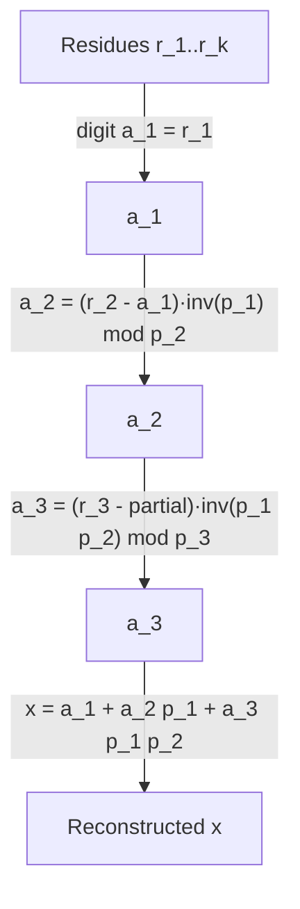

# Garner's Algorithm (Mixed-Radix CRT Reconstruction) — Junior Level

> **One-line summary:** Garner's algorithm rebuilds a single big number `x` from its remainders `x mod p_1, x mod p_2, …, x mod p_k` (the primes pairwise coprime). It writes the answer in **mixed-radix** form `x = a_1 + a_2·p_1 + a_3·p_1·p_2 + …` and solves for the digits `a_1, a_2, …` one at a time using small modular inverses, so every intermediate computation stays a single-residue size — no giant products.

---

## Table of Contents

1. [Introduction](#introduction)
2. [Prerequisites](#prerequisites)
3. [Glossary](#glossary)
4. [Core Concepts](#core-concepts)
5. [Big-O Summary](#big-o-summary)
6. [Real-World Analogies](#real-world-analogies)
7. [Pros & Cons](#pros--cons)
8. [Step-by-Step Walkthrough](#step-by-step-walkthrough)
9. [Code Examples](#code-examples)
10. [Coding Patterns](#coding-patterns)
11. [Error Handling](#error-handling)
12. [Performance Tips](#performance-tips)
13. [Best Practices](#best-practices)
14. [Edge Cases & Pitfalls](#edge-cases--pitfalls)
15. [Common Mistakes](#common-mistakes)
16. [Cheat Sheet](#cheat-sheet)
17. [Visual Animation](#visual-animation)
18. [Summary](#summary)
19. [Further Reading](#further-reading)

---

## Introduction

Imagine you measured the *same* unknown number `x` three different ways and only wrote down the **remainders**:

- `x` divided by 3 leaves remainder 2,
- `x` divided by 5 leaves remainder 3,
- `x` divided by 7 leaves remainder 2.

Can you recover the original `x`? The **Chinese Remainder Theorem** (sibling topic `05-crt`) promises that as long as the divisors `3, 5, 7` are **pairwise coprime** (share no common factor), there is exactly one answer `x` in the range `0 ≤ x < 3·5·7 = 105`. CRT is the *existence* theorem: it says "yes, a unique `x` exists." **Garner's algorithm is the constructive recipe** that actually computes that `x`.

There are two famous ways to reconstruct `x` from its residues. The "classic CRT formula" (covered in `05-crt`) adds up `k` big terms, each of which involves the giant product `P = p_1·p_2·…·p_k` divided by one prime. Those terms are *huge*. Garner's algorithm takes a smarter route: it expresses `x` in a **mixed-radix** (variable-base) numeral system

```
x = a_1 + a_2·p_1 + a_3·(p_1·p_2) + … + a_k·(p_1·p_2·…·p_{k-1})
```

and finds the "digits" `a_1, a_2, …, a_k` **one at a time**. The beautiful part: solving for each digit `a_i` is a tiny computation done **modulo a single prime `p_i`** — never modulo the giant product. That is why Garner avoids huge intermediate numbers and is the method of choice when `x` is a true big integer.

This idea shows up everywhere big numbers must be handled without overflow:

- **Multi-prime NTT** (sibling `13-ntt`): you compute a convolution modulo several primes, then Garner-combine the results into the real (large) coefficient.
- **Residue Number Systems (RNS)** for big-integer arithmetic: store a number as a tuple of residues, add/multiply componentwise (fast, parallel), and Garner-reconstruct only at the end.
- **Avoiding overflow**: split a too-big computation across several machine-word-sized primes.

For this junior file we focus on the *reconstruct-from-residues* problem itself, the mixed-radix idea, and a small worked example you can verify by hand.

---

## Prerequisites

Before reading this file you should be comfortable with:

- **Modular arithmetic** — `a mod m`, and that `x mod p_i` is the remainder of `x` divided by `p_i`. See sibling `02-modular-arithmetic`.
- **The Chinese Remainder Theorem (existence)** — that a system of congruences with pairwise-coprime moduli has a unique solution mod the product. See sibling `05-crt`.
- **Modular inverse** — the number `y` with `a·y ≡ 1 (mod m)`. Computed via the extended Euclidean algorithm (`06-extended-euclidean-modular-inverse`) or Fermat (`04-fermat-euler`).
- **Coprime / pairwise coprime** — two numbers are coprime if `gcd = 1`; "pairwise coprime" means every pair is coprime. All distinct primes are pairwise coprime.
- **Big-O notation** — `O(k²)`, where `k` is the number of primes.

Optional but helpful:

- A glance at **positional numeral systems** (base-10, base-2), since mixed-radix is a generalization where each position has its *own* base.
- Familiarity with **64-bit overflow**, which is the practical problem Garner sidesteps.

---

## Glossary

| Term | Meaning |
|------|---------|
| **Residue** | A remainder: `r_i = x mod p_i`. The "fingerprint" of `x` under prime `p_i`. |
| **Modulus / prime `p_i`** | One of the pairwise-coprime divisors. Often actual primes; only coprimality is required. |
| **Pairwise coprime** | Every pair `(p_i, p_j)` with `i ≠ j` has `gcd(p_i, p_j) = 1`. Required for CRT/Garner to work. |
| **CRT (Chinese Remainder Theorem)** | The theorem that a unique `x` in `[0, P)` matches all the residues, where `P = ∏ p_i`. |
| **Mixed-radix representation** | A numeral system where each digit position has its own base. Here the "weights" are the prefix products `1, p_1, p_1 p_2, …`. |
| **Mixed-radix digit `a_i`** | The `i`-th coefficient in `x = a_1 + a_2 p_1 + a_3 p_1 p_2 + …`. Always satisfies `0 ≤ a_i < p_i`. |
| **Prefix product** | `P_i = p_1·p_2·…·p_i` (with `P_0 = 1`). The weight of digit `a_{i+1}` is `P_i`. |
| **Modular inverse `inv(a, p)`** | The `y` with `a·y ≡ 1 (mod p)`; lets us "divide" mod `p`. |
| **RNS (Residue Number System)** | Storing a number as its residue tuple `(x mod p_1, …, x mod p_k)` and computing componentwise. |
| **Garner's algorithm** | The `O(k²)` procedure that solves for the mixed-radix digits `a_i` sequentially using inverses of prefix products mod `p_i`. |

---

## Core Concepts

### 1. The Reconstruct-from-Residues Problem

You are given `k` pairwise-coprime primes `p_1, …, p_k` and the residues `r_1, …, r_k`. You must find the unique `x` with

```
x ≡ r_1 (mod p_1),
x ≡ r_2 (mod p_2),
…
x ≡ r_k (mod p_k),     and    0 ≤ x < P = p_1·p_2·…·p_k.
```

CRT (`05-crt`) guarantees this `x` exists and is unique. Garner *constructs* it.

### 2. The Mixed-Radix Idea

A normal base-10 number `573` means `3 + 7·10 + 5·100`. The bases are all powers of 10. A **mixed-radix** number uses a *different* base at each step. Garner writes `x` as

```
x = a_1
  + a_2·p_1
  + a_3·(p_1·p_2)
  + a_4·(p_1·p_2·p_3)
  + …
  + a_k·(p_1·p_2·…·p_{k-1})
```

The weights `1, p_1, p_1 p_2, …` are the **prefix products**. Each digit obeys `0 ≤ a_i < p_i`. This representation is **unique** (just like a base-10 number is unique) — that is what makes the digit-by-digit solve work.

### 3. Solving for the First Digit `a_1`

Reduce the whole equation mod `p_1`. Every term after the first contains the factor `p_1`, so they vanish mod `p_1`:

```
x ≡ a_1 (mod p_1).
```

But we know `x ≡ r_1 (mod p_1)`. Therefore `a_1 = r_1`. The first digit is just the first residue — free.

### 4. Solving for the Second Digit `a_2`

Now reduce mod `p_2`. Every term with weight `p_1 p_2 …` (i.e. `a_3` onward) vanishes, leaving

```
x ≡ a_1 + a_2·p_1 (mod p_2).
```

We know `x ≡ r_2 (mod p_2)`, so `a_1 + a_2·p_1 ≡ r_2 (mod p_2)`. Solve for `a_2`:

```
a_2 ≡ (r_2 − a_1)·(p_1)^{-1}  (mod p_2).
```

Here `(p_1)^{-1}` is the modular inverse of `p_1` modulo `p_2` — a tiny number you compute once. **Notice every operation here is mod `p_2`**, a single-prime size, even though `x` itself may be enormous.

### 5. The General Digit `a_i`

In general, reducing mod `p_i` keeps only the first `i` terms, and we solve

```
a_i ≡ ( r_i − (a_1 + a_2 p_1 + … + a_{i-1}·P_{i-2}) ) · (P_{i-1})^{-1}  (mod p_i)
```

where `P_{i-1} = p_1·…·p_{i-1}` is the prefix product. The inner sum is the partial reconstruction using digits already found, evaluated **mod `p_i`**. Each step needs one modular inverse and a handful of mod-`p_i` operations.

### 6. Assembling the Final `x`

Once all digits `a_1, …, a_k` are known, plug them into the mixed-radix formula and add up using big integers (or reduce mod some other modulus `M` if that is all you need). Because the digits are small and the prefix products are built incrementally, this final assembly is straightforward.

---

## Big-O Summary

| Operation | Time | Space | Notes |
|-----------|------|-------|-------|
| Solve one mixed-radix digit `a_i` | **O(i)** | O(1) | Evaluate partial sum mod `p_i`, one inverse. |
| Full Garner reconstruction (`k` digits) | **O(k²)** | O(k) | Dominant cost; classic Garner. |
| One modular inverse mod `p_i` | O(log p_i) | O(1) | Extended Euclid; can be precomputed. |
| Final assembly into a big integer | O(k · (size of x)) | O(size of x) | Big-int adds/multiplies. |
| Reconstruct only `x mod M` (no big int) | **O(k²)** | O(k) | All arithmetic mod small numbers. |

The headline number is **`O(k²)`** in the number of primes `k`. Crucially, all the modular arithmetic is on *single-prime-sized* numbers — the algorithm never forms the giant product as a single big multiply during the digit solve.

---

## Real-World Analogies

| Concept | Analogy |
|---------|---------|
| Residues `r_i` | Several partial "fingerprints" of a person; no single one identifies them, but together they pin down exactly one person. |
| Pairwise coprime primes | Independent measuring rulers (centimeters, inches, a custom unit) that don't redundantly overlap, so each adds genuinely new information. |
| Mixed-radix digits | Like reading a clock as "2 days, 3 hours, 15 minutes" — each unit has its own base (7 days/week, 24 hours/day, 60 min/hour). |
| Solving digit `a_i` mod `p_i` | Figuring out the "minutes" part using only minute-level info, before worrying about hours. |
| Avoiding the giant product | Counting change as "$3, two dimes, a nickel" instead of converting everything to pennies first. |
| RNS arithmetic | Doing your bookkeeping in several small ledgers in parallel, only adding them up at the very end. |

Where the analogy breaks: real clocks have *fixed* bases known in advance; Garner's bases are your chosen primes, and the "carry" logic is replaced by modular inverses.

---

## Pros & Cons

| Pros | Cons |
|------|------|
| Never forms huge intermediate products — each digit solved mod a single prime. | `O(k²)` in the number of primes (classic CRT formula is also `O(k²)` but with bigger constants per term). |
| Naturally incremental — add a new prime/residue and extend with one more digit. | Requires pairwise-coprime moduli (a hard requirement; non-coprime needs a different combine). |
| Mixed-radix digits are small and exact — great for big-integer / RNS use. | Solving digits is inherently sequential (digit `a_i` needs `a_1…a_{i-1}`). |
| Can stop early and reconstruct only `x mod M` for any target modulus `M`. | Modular inverses of prefix products must exist (they do, given coprimality). |
| Standard tool for combining multi-prime NTT results (`13-ntt`). | A forgotten inverse or wrong modulus silently corrupts the result. |

**When to use:** reconstructing a big integer from residues, combining multi-prime NTT/modular convolution results, RNS-based bignum arithmetic, or any time you need the exact value (or its value mod another modulus) that is known only by its remainders.

**When NOT to use:** when you only ever needed the residues (don't reconstruct unnecessarily), when the moduli are not coprime (use a generalized combine), or when a single 64-bit modulus already suffices (no need for multiple primes at all).

---

## Step-by-Step Walkthrough

Solve the opening example: find `x` with

```
x ≡ 2 (mod 3),   x ≡ 3 (mod 5),   x ≡ 2 (mod 7).
```

Primes `p = [3, 5, 7]`, residues `r = [2, 3, 2]`. Product `P = 105`, so the answer is unique in `[0, 105)`.

**Digit `a_1` (mod 3).** From `x ≡ a_1 (mod 3)` and `x ≡ 2 (mod 3)`:

```
a_1 = r_1 = 2.
```

So far the partial reconstruction is `x ≈ a_1 = 2`.

**Digit `a_2` (mod 5).** Weight of `a_2` is `p_1 = 3`. We need `a_1 + a_2·3 ≡ r_2 (mod 5)`:

```
2 + 3·a_2 ≡ 3 (mod 5)
3·a_2 ≡ 1 (mod 5)
a_2 ≡ 1 · (3)^{-1} (mod 5).
```

The inverse of 3 mod 5 is 2 (since `3·2 = 6 ≡ 1`). So `a_2 ≡ 1·2 = 2 (mod 5)`, giving `a_2 = 2`.

Partial reconstruction: `x ≈ a_1 + a_2·p_1 = 2 + 2·3 = 8`. Check: `8 mod 3 = 2` ✓, `8 mod 5 = 3` ✓.

**Digit `a_3` (mod 7).** Weight of `a_3` is `p_1·p_2 = 15`. We need the running value `8` plus `a_3·15` to be `≡ r_3 = 2 (mod 7)`:

```
8 + 15·a_3 ≡ 2 (mod 7)
1 + a_3 ≡ 2 (mod 7)        (since 8 ≡ 1 and 15 ≡ 1 mod 7)
a_3 ≡ 1 · (15)^{-1} (mod 7).
```

`15 ≡ 1 (mod 7)`, so `(15)^{-1} ≡ 1 (mod 7)`, and `a_3 ≡ (2 − 1)·1 = 1 (mod 7)`, giving `a_3 = 1`.

**Assemble `x`.** Mixed-radix:

```
x = a_1 + a_2·p_1 + a_3·(p_1·p_2)
  = 2  + 2·3      + 1·15
  = 2 + 6 + 15
  = 23.
```

**Verify.** `23 mod 3 = 2` ✓, `23 mod 5 = 3` ✓, `23 mod 7 = 2` ✓, and `0 ≤ 23 < 105`. The reconstruction is correct, and we never multiplied anything bigger than the prefix product `15`.

---

## Code Examples

### Example: Garner Reconstruction into a Big Integer

Solve a system of congruences with pairwise-coprime moduli and return the unique `x`.

#### Go

```go
package main

import (
	"fmt"
	"math/big"
)

// modInverse returns a^{-1} mod m using big.Int (extended Euclid under the hood).
func modInverse(a, m int64) int64 {
	A := big.NewInt(a)
	M := big.NewInt(m)
	A.Mod(A, M)
	inv := new(big.Int).ModInverse(A, M)
	if inv == nil {
		panic("no inverse: moduli not coprime?")
	}
	return inv.Int64()
}

// garner reconstructs x from residues r modulo pairwise-coprime primes p.
func garner(r, p []int64) *big.Int {
	k := len(p)
	a := make([]int64, k) // mixed-radix digits

	for i := 0; i < k; i++ {
		// compute partial value mod p[i] using digits found so far
		var partial int64 = 0
		var prefix int64 = 1 // prefix product mod p[i]
		for j := 0; j < i; j++ {
			partial = (partial + a[j]*prefix) % p[i]
			prefix = (prefix * p[j]) % p[i]
		}
		// a[i] = (r[i] - partial) * prefix^{-1} mod p[i]
		diff := ((r[i]-partial)%p[i] + p[i]) % p[i]
		a[i] = (diff * modInverse(prefix, p[i])) % p[i]
	}

	// assemble x = a_1 + a_2 p_1 + a_3 p_1 p_2 + ...
	x := big.NewInt(0)
	weight := big.NewInt(1)
	for i := 0; i < k; i++ {
		term := new(big.Int).Mul(big.NewInt(a[i]), weight)
		x.Add(x, term)
		weight.Mul(weight, big.NewInt(p[i]))
	}
	return x
}

func main() {
	r := []int64{2, 3, 2}
	p := []int64{3, 5, 7}
	fmt.Println(garner(r, p)) // 23
}
```

#### Java

```java
import java.math.BigInteger;

public class Garner {

    static long modInverse(long a, long m) {
        BigInteger inv = BigInteger.valueOf(((a % m) + m) % m)
                .modInverse(BigInteger.valueOf(m));
        return inv.longValue();
    }

    static BigInteger garner(long[] r, long[] p) {
        int k = p.length;
        long[] a = new long[k];

        for (int i = 0; i < k; i++) {
            long partial = 0, prefix = 1;
            for (int j = 0; j < i; j++) {
                partial = (partial + a[j] * prefix) % p[i];
                prefix = (prefix * p[j]) % p[i];
            }
            long diff = ((r[i] - partial) % p[i] + p[i]) % p[i];
            a[i] = (diff * modInverse(prefix, p[i])) % p[i];
        }

        BigInteger x = BigInteger.ZERO, weight = BigInteger.ONE;
        for (int i = 0; i < k; i++) {
            x = x.add(BigInteger.valueOf(a[i]).multiply(weight));
            weight = weight.multiply(BigInteger.valueOf(p[i]));
        }
        return x;
    }

    public static void main(String[] args) {
        long[] r = {2, 3, 2};
        long[] p = {3, 5, 7};
        System.out.println(garner(r, p)); // 23
    }
}
```

#### Python

```python
def mod_inverse(a, m):
    return pow(a % m, -1, m)  # Python 3.8+: modular inverse


def garner(r, p):
    k = len(p)
    a = [0] * k  # mixed-radix digits

    for i in range(k):
        partial, prefix = 0, 1
        for j in range(i):
            partial = (partial + a[j] * prefix) % p[i]
            prefix = (prefix * p[j]) % p[i]
        diff = (r[i] - partial) % p[i]
        a[i] = (diff * mod_inverse(prefix, p[i])) % p[i]

    # assemble x = a_1 + a_2 p_1 + a_3 p_1 p_2 + ...
    x, weight = 0, 1
    for i in range(k):
        x += a[i] * weight
        weight *= p[i]
    return x


if __name__ == "__main__":
    print(garner([2, 3, 2], [3, 5, 7]))  # 23
```

**What it does:** computes the mixed-radix digits `a = [2, 2, 1]` for the worked example, then assembles `x = 23`.
**Run:** `go run main.go` | `javac Garner.java && java Garner` | `python garner.py`

---

## Coding Patterns

### Pattern 1: Brute-Force Reconstruction (the oracle you test against)

**Intent:** Before trusting Garner, find `x` by scanning every candidate in `[0, P)` and checking all congruences. Slow, but obviously correct on tiny inputs.

```python
def brute_crt(r, p):
    from math import prod
    P = prod(p)
    for x in range(P):
        if all(x % p[i] == r[i] for i in range(len(p))):
            return x
    return None  # should never happen with pairwise-coprime p
```

This is `O(P)` — only usable when the product `P` is small. Garner must give the same answer.

### Pattern 2: Incremental Two-at-a-Time Combine

**Intent:** Garner can also be phrased as repeatedly merging two congruences into one (the way `05-crt` often presents CRT). Both reach the same `x`; Garner's mixed-radix form keeps the numbers smallest.

### Pattern 3: Reconstruct Only `x mod M`

**Intent:** If you only need `x mod M` (e.g. the final answer of a problem is itself taken mod `10^9+7`), assemble the mixed-radix sum *modulo `M`* and skip big integers entirely.



---

## Error Handling

| Error | Cause | Fix |
|-------|-------|-----|
| Wrong `x` | Moduli not pairwise coprime. | Verify `gcd(p_i, p_j) = 1` for all pairs first. |
| `nil` / exception from inverse | Inverse of a prefix product doesn't exist (non-coprime). | Same as above; coprimality guarantees the inverse exists. |
| Negative digit `a_i` | `(r_i − partial)` went negative before mod. | Normalize: `((diff % p) + p) % p`. |
| Overflow in `a[j]*prefix` | Products of residues exceed 64-bit before `% p`. | Use 128-bit/`big.Int` for the product, or keep `p_i` small. |
| `x` out of range | Residues larger than their modulus. | Reduce inputs: `r_i = r_i mod p_i` before starting. |
| Off-by-one weights | Prefix product weight mismatched with digit index. | Weight of `a_i` is `p_1·…·p_{i-1}` (with `a_1` weight 1). |

---

## Performance Tips

- **Precompute inverses.** If the same primes are reused across many reconstructions (common in NTT), precompute `inv(p_1·…·p_{i-1}, p_i)` once and reuse.
- **Reduce inputs first.** Take `r_i mod p_i` at the start so all values are minimal.
- **Reduce mod `p_i` inside the inner loop**, not at the end, to keep the partial sum from overflowing.
- **Use the right integer width.** With primes up to ~`30` bits, products of two residues fit in 64 bits *before* reduction; with larger primes use 128-bit or big-int multiply.
- **Stop early if you only need `x mod M`** — never build the big integer if a single residue is all you want.

---

## Best Practices

- Always reduce each residue: `r_i ← r_i mod p_i` before running Garner.
- Assert the moduli are pairwise coprime once, at the top; this is the silent-failure trap.
- Keep `modInverse` a small, separately tested helper — most bugs hide there.
- State whether you want the full big integer `x` or just `x mod M`, and write the assembly accordingly.
- Test Garner against the brute-force oracle (Pattern 1) on random small inputs before trusting it.
- Document that digit `a_i` lives in `[0, p_i)` and weight is the prefix product `p_1·…·p_{i-1}`.

---

## Edge Cases & Pitfalls

- **Single prime (`k = 1`)** — the answer is just `x = r_1`; the loop produces one digit and stops.
- **Residue equal to 0** — perfectly fine; `a_i` may be 0.
- **`r_i ≥ p_i`** — reduce first; an un-reduced residue corrupts the very first digit.
- **Non-coprime moduli** — Garner as written *fails* (no inverse). Detect with `gcd` and use a generalized combine if needed (covered in `05-crt`).
- **The product `P` overflows 64 bits** — exactly the case Garner is built for; use big integers only at final assembly, not during the digit solve.
- **Confusing the classic CRT formula with Garner** — both reconstruct `x`; Garner uses mixed-radix and stays small.

---

## Common Mistakes

1. **Forgetting to reduce residues** — using `r_i ≥ p_i` poisons digit `a_1`.
2. **Wrong prefix-product weight** — the weight of digit `a_i` is `p_1·…·p_{i-1}`, not `p_1·…·p_i`.
3. **Negative remainder** — in Go/Java `%` can be negative; normalize before multiplying by the inverse.
4. **Assuming any moduli work** — they must be pairwise coprime, or the inverse step breaks.
5. **Building the giant product to "divide" it** — that defeats the purpose; Garner never divides by `P`.
6. **Overflow in the inner product** — `a[j]*prefix` can exceed 64 bits for big primes; widen or reduce.
7. **Confusing existence (CRT) with construction (Garner)** — `05-crt` proves `x` exists; Garner computes it.

---

## Cheat Sheet

| Question | Tool | Formula |
|----------|------|---------|
| First digit | direct | `a_1 = r_1` |
| `i`-th digit | inverse of prefix product | `a_i = (r_i − partial)·(P_{i-1})^{-1} mod p_i` |
| Weight of digit `a_i` | prefix product | `P_{i-1} = p_1·…·p_{i-1}` (with `P_0 = 1`) |
| Final value | mixed-radix sum | `x = Σ a_i·P_{i-1}` |
| Range of `x` | CRT | `0 ≤ x < P = ∏ p_i` |
| Range of each digit | by construction | `0 ≤ a_i < p_i` |

Core algorithm:

```
garner(r[], p[]):
    for i = 0 .. k-1:
        partial = 0; prefix = 1            # both mod p[i]
        for j = 0 .. i-1:
            partial = (partial + a[j]*prefix) mod p[i]
            prefix  = (prefix * p[j]) mod p[i]
        a[i] = (r[i] - partial) * inv(prefix, p[i]) mod p[i]
    x = 0; weight = 1
    for i = 0 .. k-1:
        x += a[i] * weight                 # big integer (or mod M)
        weight *= p[i]
    return x
# cost: O(k^2)
```

---

## Visual Animation

> See [`animation.html`](./animation.html) for an interactive visualization.
>
> The animation demonstrates:
> - The list of residues `r_i` and primes `p_i` you can edit
> - Solving each mixed-radix digit `a_i` in turn (subtract the partial, multiply by the prefix-product inverse mod `p_i`)
> - The running reconstructed value accumulating as `a_1 + a_2 p_1 + a_3 p_1 p_2 + …`
> - Play / Step / Reset controls to watch the digits appear one at a time

---

## Summary

Garner's algorithm is the *constructive* side of the Chinese Remainder Theorem: given residues `r_i` modulo pairwise-coprime primes `p_i`, it rebuilds the unique `x` by writing it in **mixed-radix** form `x = a_1 + a_2 p_1 + a_3 p_1 p_2 + …` and solving for the digits `a_1, a_2, …` one at a time. Each digit `a_i` is found with a single modular inverse, working **only modulo `p_i`**, so no giant intermediate products ever appear — the reason Garner is the go-to method for big-integer reconstruction, multi-prime NTT combining (`13-ntt`), and RNS arithmetic. The whole reconstruction costs `O(k²)`. Where `05-crt` *proves* the answer exists, Garner *computes* it, digit by digit, staying small the whole way.

---

## Further Reading

- Sibling topic `05-crt` — the Chinese Remainder Theorem (existence) and the classic combining formula.
- Sibling topic `06-extended-euclidean-modular-inverse` — computing the inverses Garner needs.
- Sibling topic `13-ntt` — multi-prime NTT whose results are Garner-combined.
- Sibling topic `27-bigint-arithmetic` — big-integer assembly of the final `x`.
- cp-algorithms.com — "Garner's Algorithm" and "Chinese Remainder Theorem".
- Knuth, *The Art of Computer Programming, Vol. 2* — mixed-radix and modular (residue) arithmetic.
