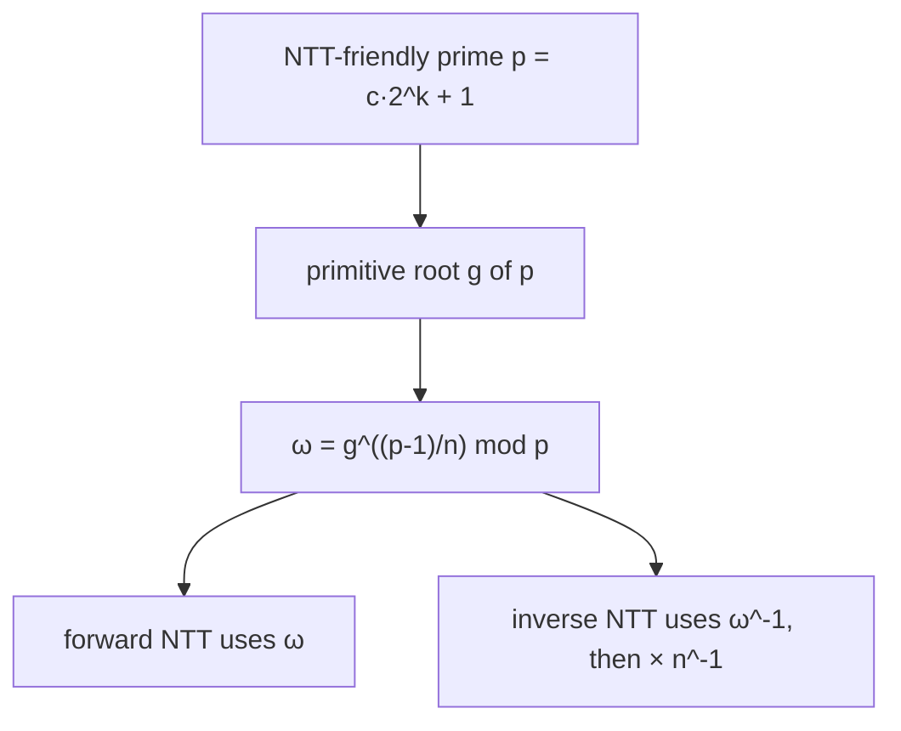

# Number-Theoretic Transform (NTT) — Junior Level

> **One-line summary:** The NTT is the **FFT done in a finite field `Z/pZ`** instead of with complex numbers. By replacing the complex root of unity `e^{2πi/n}` with a *primitive `n`-th root of unity* `g` inside `Z/pZ` (which only exists when `p` is an "NTT-friendly" prime like `998244353 = 119·2^23 + 1`), you get **exact integer convolution mod `p`** with no floating-point rounding error at all.

---

## Table of Contents

1. [Introduction](#introduction)
2. [Prerequisites](#prerequisites)
3. [Glossary](#glossary)
4. [Core Concepts](#core-concepts)
5. [Big-O Summary](#big-o-summary)
6. [Real-World Analogies](#real-world-analogies)
7. [Pros & Cons](#pros--cons)
8. [Step-by-Step Walkthrough](#step-by-step-walkthrough)
9. [Code Examples](#code-examples)
10. [Coding Patterns](#coding-patterns)
11. [Error Handling](#error-handling)
12. [Performance Tips](#performance-tips)
13. [Best Practices](#best-practices)
14. [Edge Cases & Pitfalls](#edge-cases--pitfalls)
15. [Common Mistakes](#common-mistakes)
16. [Cheat Sheet](#cheat-sheet)
17. [Visual Animation](#visual-animation)
18. [Summary](#summary)
19. [Further Reading](#further-reading)

---

## Introduction

Suppose you have to multiply two polynomials, or equivalently compute the **convolution** of two integer arrays, and the answer must be exact modulo a prime such as `998244353`. The schoolbook method costs `O(n²)`: every coefficient of one polynomial multiplies every coefficient of the other. For `n = 200000` that is `4·10^10` operations — far too slow.

The Fast Fourier Transform (FFT) speeds polynomial multiplication up to `O(n log n)` by evaluating both polynomials at the `n`-th complex roots of unity, multiplying the evaluations pointwise, and interpolating back. But classic FFT uses **complex numbers** (`double` floating point), so the final coefficients come out as values like `41999.9999998` that you must round. For large coefficients or large `n`, that rounding can flip the answer by 1 and silently corrupt an exact modular result.

The **Number-Theoretic Transform (NTT)** fixes this. It runs the *exact same butterfly algorithm* as FFT, but it works entirely inside the finite field `Z/pZ` — the integers `0, 1, …, p-1` with addition and multiplication taken mod `p`. The trick is that, for the right prime `p`, the field `Z/pZ` contains a number `g` that behaves *exactly* like the complex root of unity `e^{2πi/n}`: raising it to the `n`-th power gives `1`, and its powers `g^0, g^1, …, g^{n-1}` are all distinct. Such a `g` is called a **primitive `n`-th root of unity mod `p`**.

> **Big idea:** NTT = FFT where complex roots of unity are replaced by a primitive `n`-th root of unity in `Z/pZ`. The arithmetic is exact integers mod `p`, so there is **zero rounding error**.

This is the **number-theory** view of the transform. A complex-FFT topic already exists at `15-divide-and-conquer/05-fft`, which derives the Cooley-Tukey butterfly in detail and mentions NTT briefly. **We will not re-derive the butterfly here** — we point you there for the shared recursive/iterative structure. This topic focuses on the number-theory questions that are unique to NTT: *why* you need a special prime, *how* you find the root, and *how* to get exact convolution for an arbitrary modulus by combining several NTT primes with the Chinese Remainder Theorem (CRT, sibling `05-crt` and `15-garner-algorithm`).

For finding the primitive root that NTT depends on, see sibling `12-primitive-root-discrete-root`.

---

## Prerequisites

Before reading this file you should be comfortable with:

- **Modular arithmetic** — `(a + b) mod p`, `(a · b) mod p`, and modular inverse `a^{-1} mod p`. See sibling `02-modular-arithmetic`.
- **Fast (binary) exponentiation** — computing `g^e mod p` in `O(log e)`. See sibling `26-binary-exponentiation`.
- **Modular inverse via Fermat** — `a^{-1} ≡ a^{p-2} (mod p)` for prime `p`. See sibling `04-fermat-euler`.
- **Polynomials and convolution** — `c[k] = Σ_{i+j=k} a[i]·b[j]`; multiplying two polynomials *is* convolving their coefficient arrays.
- **The FFT idea (evaluate → pointwise multiply → interpolate)** — see `15-divide-and-conquer/05-fft`. You do not need to memorize it, but you should know the three-step shape.
- **Big-O notation** — `O(n log n)` vs `O(n²)`.

Optional but helpful:

- A glance at **primitive roots** (sibling `12`) — the existence of `g` is exactly a primitive-root statement.
- Familiarity with **CRT** (sibling `05`) for the multi-prime extension.

---

## Glossary

| Term | Meaning |
|------|---------|
| **Convolution** | `c[k] = Σ_{i+j=k} a[i]·b[j]`. Multiplying polynomials = convolving coefficient arrays. |
| **DFT / FFT** | Discrete Fourier Transform; FFT is the `O(n log n)` algorithm to compute it, using complex roots of unity. |
| **NTT** | Number-Theoretic Transform: the DFT computed in `Z/pZ` using a primitive root instead of complex numbers. |
| **`Z/pZ`** | The finite field of integers `{0, …, p-1}` under addition and multiplication mod a prime `p`. |
| **NTT-friendly prime** | A prime of the form `p = c·2^k + 1`, so that `Z/pZ` contains a primitive `2^k`-th root of unity. E.g. `998244353 = 119·2^23 + 1`. |
| **Primitive root `g` of `p`** | A generator: its powers `g^0, …, g^{p-2}` produce every nonzero residue mod `p`. |
| **Primitive `n`-th root of unity `ω`** | A residue with `ω^n ≡ 1` and `ω^m ≢ 1` for `0 < m < n`. Built as `ω = g^{(p-1)/n} mod p`. |
| **Forward NTT** | Evaluate a coefficient vector at the powers of `ω`: maps coefficients → point values. |
| **Inverse NTT** | The reverse map: point values → coefficients. Uses `ω^{-1}` and multiplies by `n^{-1} mod p`. |
| **Butterfly** | The size-2 combine step `(u + ω·v, u − ω·v)` shared by FFT and NTT (see `05-fft`). |
| **Pointwise product** | Multiply two evaluation vectors entry-by-entry; this is where convolution becomes cheap. |

---

## Core Concepts

### 1. Polynomial multiplication is convolution is the bottleneck

Multiplying `A(x) = Σ a_i x^i` by `B(x) = Σ b_j x^j` gives `C(x)` whose coefficient of `x^k` is `c[k] = Σ_{i+j=k} a[i]·b[j]`. That double sum is the convolution of arrays `a` and `b`. Done directly it is `O(n²)`. NTT computes the same `c[]` in `O(n log n)`.

### 2. The three-step transform recipe (shared with FFT)

Both FFT and NTT use the **evaluate / multiply / interpolate** strategy:

```
1. Forward transform a → â and b → b̂        (evaluate at the n roots of unity)
2. Pointwise multiply:  ĉ[i] = â[i] · b̂[i]   (cheap: O(n))
3. Inverse transform ĉ → c                    (interpolate back to coefficients)
```

The magic is that a *product of polynomials in coefficient space* becomes a *pointwise product in evaluation space*. The transform and its inverse cost `O(n log n)` each; the pointwise step is `O(n)`.

### 3. Why complex roots, and what NTT swaps in

FFT evaluates at the complex `n`-th roots of unity `ω = e^{2πi/n}`. These satisfy two properties the algorithm relies on:

- **`ω^n = 1`** (it is an `n`-th root of unity), and
- **`ω^{n/2} = -1`** (the "halving" property that makes the divide-and-conquer butterfly work).

NTT needs a number with the *same two properties* but living in `Z/pZ` instead of `C`. That number is a **primitive `n`-th root of unity mod `p`**, written `ω`. Once you have it, every line of the FFT becomes a modular operation, and the output is exact integers — no `double`, no rounding.

### 4. NTT-friendly primes: `p = c·2^k + 1`

A primitive `n`-th root of unity mod `p` exists **only if `n` divides `p − 1`** (proved in [`professional.md`](./professional.md); it follows from the cyclic structure of `Z/pZ*`). For NTT we want `n` to be a power of two (so the butterfly can halve repeatedly), so we need `2^k | p − 1` for `k` as large as we will ever need. Primes of the form

```
p = c · 2^k + 1
```

have exactly this: `p − 1 = c · 2^k`, so every power of two up to `2^k` divides `p − 1`. These are the **NTT-friendly primes**. The most famous is:

```
998244353 = 119 · 2^23 + 1     (so 2^23 | p − 1; supports n up to 2^23 ≈ 8.4 million)
```

Its primitive root is `g = 3`. From `g` you build the `n`-th root: `ω = g^{(p-1)/n} mod p`.

### 5. Building `ω` from the primitive root `g`

If `g` is a primitive root of `p` (a generator of `Z/pZ*`) and `n | p − 1`, then

```
ω = g^{(p-1)/n} mod p
```

is a primitive `n`-th root of unity. Quick check: `ω^n = g^{(p-1)} ≡ 1` by Fermat's little theorem, and `ω` has order exactly `n`. For the inverse transform you also need `ω^{-1} = g^{(p-1) − (p-1)/n} mod p`, or just `pow(ω, p-2, p)` by Fermat.

### 6. Inverse NTT: same butterfly, then divide by `n`

The inverse transform is **the forward transform run with `ω^{-1}` instead of `ω`, followed by multiplying every entry by `n^{-1} mod p`**. That single scaling by `n^{-1}` is the modular analogue of FFT's "divide by `n`". Because `n` is a power of two and `p` is odd, `n^{-1} mod p` always exists.

---

## Big-O Summary

| Operation | Time | Space | Notes |
|-----------|------|-------|-------|
| Schoolbook convolution | **O(n²)** | O(n) | The baseline NTT beats. |
| Forward NTT (size `n`) | **O(n log n)** | O(n) | Same butterfly as FFT. |
| Inverse NTT (size `n`) | **O(n log n)** | O(n) | Forward with `ω^{-1}`, then scale by `n^{-1}`. |
| Pointwise multiply | O(n) | O(n) | Entry-by-entry product mod `p`. |
| Full polynomial multiply mod `p` | **O(n log n)** | O(n) | Two forward + pointwise + one inverse. |
| Multiply for *arbitrary* modulus `M` | O(n log n) | O(n) | 3 NTT primes + CRT (see `middle.md`). |
| Building `ω` from `g` | O(log p) | O(1) | One modular exponentiation. |

The headline number is **`O(n log n)`** for exact modular convolution, with the input size `n` rounded *up to the next power of two* that is at least `len(a) + len(b) − 1`.

---

## Real-World Analogies

| Concept | Analogy |
|---------|---------|
| Complex roots of unity (FFT) | Measuring a sound with continuous, analog tuning forks — accurate but with measurement noise (rounding). |
| Primitive root in `Z/pZ` (NTT) | A set of *digital* tuning forks that snap exactly to integer pitches — no measurement noise at all. |
| NTT-friendly prime | A specially manufactured ruler whose markings line up perfectly with the lengths you need (`2^k` divisions). |
| Evaluate → multiply → interpolate | Converting two recipes to "ingredient totals", adding them cheaply, then converting back to a recipe. |
| Pointwise product | In evaluation space the polynomials don't tangle: each sample point multiplies only its own counterpart. |
| Multi-prime + CRT | Three witnesses each see the answer "mod their own prime"; CRT cross-examines them to reconstruct the true number. |

Where the analogy breaks: tuning forks measure frequency; the NTT does not actually measure anything physical — it is a pure algebraic change of basis that happens to make multiplication cheap.

---

## Pros & Cons

| Pros | Cons |
|------|------|
| **Exact**: integer arithmetic mod `p`, zero floating-point rounding error. | Requires an **NTT-friendly prime**; you cannot pick an arbitrary modulus directly. |
| Same `O(n log n)` speed as FFT, same butterfly structure. | The transform length `n` must be a power of two dividing `p − 1`. |
| No precision worries even for large coefficients (the killer FFT failure mode). | Modular multiplication is a bit slower per operation than `double` multiply. |
| Works for *any* modulus via multiple primes + CRT. | Arbitrary-modulus convolution needs 3 transforms + CRT — more code, more constants. |
| Deterministic, reproducible across machines (no FP nondeterminism). | You must know `(p, g)` pairs or compute the primitive root (sibling `12`). |

**When to use:** exact convolution / polynomial multiply modulo a prime (especially `998244353` or `10^9 + 7` via multi-prime), big-integer multiplication, counting problems that reduce to convolution, string matching via convolution.

**When NOT to use:** you only need an approximate real-valued convolution (FFT with `double` may be simpler), `n` is tiny (schoolbook `O(n²)` wins), or your modulus is fixed and not NTT-friendly *and* you cannot afford the multi-prime overhead (then bluestein/FFT-with-splitting may be considered — see `senior.md`).

---

## Step-by-Step Walkthrough

Let us multiply two tiny polynomials modulo a small NTT-friendly prime so every number stays readable.

Pick the prime `p = 17`. Note `17 − 1 = 16 = 2^4`, so `17` is NTT-friendly and supports transform sizes up to `n = 16`. A primitive root of `17` is `g = 3`.

We multiply `A(x) = 1 + 2x` and `B(x) = 3 + 4x`. The exact product is

```
A(x)·B(x) = 3 + 4x + 6x + 8x² = 3 + 10x + 8x²
```

so the answer we expect is `c = [3, 10, 8]` (and `8 mod 17 = 8`, all small).

**Step 1 — choose the transform size `n`.** The result has `2 + 2 − 1 = 3` coefficients, and `n` must be a power of two `≥ 3`, so `n = 4`. Pad both inputs to length 4:

```
a = [1, 2, 0, 0]
b = [3, 4, 0, 0]
```

**Step 2 — build the root.** A primitive `n = 4`-th root of unity is

```
ω = g^{(p-1)/n} = 3^{16/4} = 3^4 = 81 = 81 − 4·17 = 81 − 68 = 13 (mod 17)
```

Check: `ω^4 = 13^4 mod 17`. `13^2 = 169 = 169 − 9·17 = 169 − 153 = 16 ≡ −1`, and `(−1)^2 = 1`. Good — `ω = 13` has order 4, and `ω^{n/2} = ω^2 = 16 ≡ −1`, the halving property NTT needs.

**Step 3 — forward NTT of `a` and `b`.** The forward transform evaluates the polynomial at `ω^0, ω^1, ω^2, ω^3 = 1, 13, 16, 4`. For `a = [1,2,0,0]`, `â[t] = a[0] + a[1]·ω^t = 1 + 2·ω^t`:

```
â[0] = 1 + 2·1  = 3
â[1] = 1 + 2·13 = 27 ≡ 10
â[2] = 1 + 2·16 = 33 ≡ 16
â[3] = 1 + 2·4  = 9
```

For `b = [3,4,0,0]`, `b̂[t] = 3 + 4·ω^t`:

```
b̂[0] = 3 + 4·1  = 7
b̂[1] = 3 + 4·13 = 55 ≡ 4
b̂[2] = 3 + 4·16 = 67 ≡ 67 − 51 = 16
b̂[3] = 3 + 4·4  = 19 ≡ 2
```

**Step 4 — pointwise multiply (mod 17).**

```
ĉ[0] = 3·7  = 21 ≡ 4
ĉ[1] = 10·4 = 40 ≡ 6
ĉ[2] = 16·16= 256 ≡ 256 − 15·17 = 256 − 255 = 1
ĉ[3] = 9·2  = 18 ≡ 1
```

**Step 5 — inverse NTT of `ĉ`.** Use `ω^{-1}`. Since `ω = 13` and `ω^4 = 1`, `ω^{-1} = ω^3 = 4`. The inverse transform evaluates `ĉ` at powers of `ω^{-1}` and then divides by `n = 4`, i.e. multiplies by `4^{-1} mod 17`. Because `4·13 = 52 = 51 + 1 ≡ 1`, we have `4^{-1} = 13`.

Evaluating `Ĉ(y) = Σ ĉ[t]·y^t` at `y = (ω^{-1})^s = 4^s` for `s = 0,1,2,3`, then scaling by `13`, recovers exactly:

```
c = [3, 10, 8, 0]
```

Dropping the trailing zero gives `c = [3, 10, 8]` — matching the hand product `3 + 10x + 8x²`. The whole pipeline used only integers mod 17; nothing rounded.

That is the entire mechanism: pad to a power of two, forward-transform both, multiply pointwise, inverse-transform, scale by `n^{-1}`.

---

## Code Examples

### Example: Polynomial multiplication mod `998244353` (recursive NTT for clarity)

This junior version uses a simple recursive transform so the structure is obvious. The iterative, in-place version (faster, the one you ship) is in [`middle.md`](./middle.md). The butterfly itself is explained in `15-divide-and-conquer/05-fft`.

#### Go

```go
package main

import "fmt"

const MOD = 998244353 // = 119 * 2^23 + 1
const G = 3           // primitive root of MOD

func power(a, e int64) int64 {
	a %= MOD
	r := int64(1)
	for e > 0 {
		if e&1 == 1 {
			r = r * a % MOD
		}
		a = a * a % MOD
		e >>= 1
	}
	return r
}

func inv(a int64) int64 { return power(a, MOD-2) } // Fermat inverse

// ntt transforms p in place; invert=true does the inverse transform.
func ntt(p []int64, invert bool) {
	n := len(p)
	if n == 1 {
		return
	}
	even := make([]int64, n/2)
	odd := make([]int64, n/2)
	for i := 0; i < n/2; i++ {
		even[i] = p[2*i]
		odd[i] = p[2*i+1]
	}
	ntt(even, invert)
	ntt(odd, invert)
	// primitive n-th root (or its inverse)
	w := power(G, (MOD-1)/int64(n))
	if invert {
		w = inv(w)
	}
	cur := int64(1)
	for i := 0; i < n/2; i++ {
		t := cur * odd[i] % MOD
		p[i] = (even[i] + t) % MOD
		p[i+n/2] = (even[i] - t + MOD) % MOD
		cur = cur * w % MOD
	}
}

func multiply(a, b []int64) []int64 {
	need := len(a) + len(b) - 1
	n := 1
	for n < need {
		n <<= 1
	}
	fa := make([]int64, n)
	fb := make([]int64, n)
	copy(fa, a)
	copy(fb, b)
	ntt(fa, false)
	ntt(fb, false)
	for i := 0; i < n; i++ {
		fa[i] = fa[i] * fb[i] % MOD
	}
	ntt(fa, true)
	ninv := inv(int64(n))
	for i := 0; i < n; i++ {
		fa[i] = fa[i] * ninv % MOD
	}
	return fa[:need]
}

func main() {
	a := []int64{1, 2} // 1 + 2x
	b := []int64{3, 4} // 3 + 4x
	c := multiply(a, b)
	fmt.Println(c) // [3 10 8] = 3 + 10x + 8x^2
}
```

#### Java

```java
import java.util.*;

public class NttJunior {
    static final long MOD = 998244353L; // 119 * 2^23 + 1
    static final long G = 3;            // primitive root

    static long power(long a, long e) {
        a %= MOD;
        long r = 1;
        while (e > 0) {
            if ((e & 1) == 1) r = r * a % MOD;
            a = a * a % MOD;
            e >>= 1;
        }
        return r;
    }

    static long inv(long a) { return power(a, MOD - 2); }

    static void ntt(long[] p, boolean invert) {
        int n = p.length;
        if (n == 1) return;
        long[] even = new long[n / 2], odd = new long[n / 2];
        for (int i = 0; i < n / 2; i++) {
            even[i] = p[2 * i];
            odd[i] = p[2 * i + 1];
        }
        ntt(even, invert);
        ntt(odd, invert);
        long w = power(G, (MOD - 1) / n);
        if (invert) w = inv(w);
        long cur = 1;
        for (int i = 0; i < n / 2; i++) {
            long t = cur * odd[i] % MOD;
            p[i] = (even[i] + t) % MOD;
            p[i + n / 2] = (even[i] - t + MOD) % MOD;
            cur = cur * w % MOD;
        }
    }

    static long[] multiply(long[] a, long[] b) {
        int need = a.length + b.length - 1;
        int n = 1;
        while (n < need) n <<= 1;
        long[] fa = Arrays.copyOf(a, n), fb = Arrays.copyOf(b, n);
        ntt(fa, false);
        ntt(fb, false);
        for (int i = 0; i < n; i++) fa[i] = fa[i] * fb[i] % MOD;
        ntt(fa, true);
        long ninv = inv(n);
        for (int i = 0; i < n; i++) fa[i] = fa[i] * ninv % MOD;
        return Arrays.copyOf(fa, need);
    }

    public static void main(String[] args) {
        long[] a = {1, 2}, b = {3, 4};
        System.out.println(Arrays.toString(multiply(a, b))); // [3, 10, 8]
    }
}
```

#### Python

```python
MOD = 998244353  # 119 * 2**23 + 1
G = 3            # primitive root


def power(a, e):
    a %= MOD
    r = 1
    while e > 0:
        if e & 1:
            r = r * a % MOD
        a = a * a % MOD
        e >>= 1
    return r


def inv(a):
    return power(a, MOD - 2)  # Fermat inverse


def ntt(p, invert):
    n = len(p)
    if n == 1:
        return p
    even = ntt(p[0::2], invert)
    odd = ntt(p[1::2], invert)
    w = power(G, (MOD - 1) // n)
    if invert:
        w = inv(w)
    out = [0] * n
    cur = 1
    for i in range(n // 2):
        t = cur * odd[i] % MOD
        out[i] = (even[i] + t) % MOD
        out[i + n // 2] = (even[i] - t) % MOD
        cur = cur * w % MOD
    return out


def multiply(a, b):
    need = len(a) + len(b) - 1
    n = 1
    while n < need:
        n <<= 1
    fa = a + [0] * (n - len(a))
    fb = b + [0] * (n - len(b))
    fa = ntt(fa, False)
    fb = ntt(fb, False)
    fc = [x * y % MOD for x, y in zip(fa, fb)]
    fc = ntt(fc, True)
    ninv = inv(n)
    return [x * ninv % MOD for x in fc[:need]]


if __name__ == "__main__":
    print(multiply([1, 2], [3, 4]))  # [3, 10, 8]
```

**What it does:** multiplies `1 + 2x` by `3 + 4x` and prints `[3, 10, 8]`, the exact coefficients of `3 + 10x + 8x²`, all mod `998244353`.
**Run:** `go run main.go` | `javac NttJunior.java && java NttJunior` | `python ntt.py`

---

## Coding Patterns

### Pattern 1: Schoolbook oracle (test NTT against this)

**Intent:** Before trusting NTT, convolve the slow obvious way on small inputs and compare.

```python
def conv_bruteforce(a, b, mod):
    c = [0] * (len(a) + len(b) - 1)
    for i, ai in enumerate(a):
        for j, bj in enumerate(b):
            c[i + j] = (c[i + j] + ai * bj) % mod
    return c
```

This is `O(n²)`, too slow for big `n`, but a perfect correctness oracle. NTT must match it on every random small case.

### Pattern 2: Pad-to-power-of-two helper

**Intent:** The transform size must be a power of two `≥ len(a)+len(b)-1`. Always compute it the same way.

```python
def next_pow2_at_least(m):
    n = 1
    while n < m:
        n <<= 1
    return n
```

### Pattern 3: Build the root from `(p, g)`

**Intent:** Get a primitive `n`-th root and its inverse from the prime and its primitive root.



---

## Error Handling

| Error | Cause | Fix |
|-------|-------|-----|
| Garbage / wrong coefficients | Used a non-NTT-friendly prime (no `2^k`-th root). | Use `p = c·2^k + 1` with `2^k ≥ n`; e.g. `998244353`. |
| Transform of wrong length | `n` not a power of two, or smaller than `len(a)+len(b)-1`. | Pad up to the next power of two ≥ the result length. |
| Off-by-`n` (all entries `n×` too big) | Forgot to multiply by `n^{-1}` after the inverse transform. | Scale every entry by `inv(n)` exactly once. |
| Negative values | `even[i] − t` went negative before `% p`. | Add `MOD` then `% MOD`. |
| Wrong root used in inverse | Reused `ω` instead of `ω^{-1}`. | Inverse transform uses `ω^{-1}` (or `pow(ω, p-2)`). |
| Overflow in `a*b` | Product of two near-`p` values overflows 32-bit. | Use 64-bit (`int64`/`long`) before `% MOD`. |

---

## Performance Tips

- **Round `n` up to a power of two**, not just any value — the butterfly needs powers of two.
- **Precompute roots** `ω^0, ω^1, …` once per size rather than re-exponentiating inside the loop.
- **Use the iterative in-place NTT** (with bit-reversal) for real workloads; the recursive version here is for understanding only. See `middle.md`.
- **Reuse buffers**: forward-transform `b` once if you multiply many polynomials by the same `b`.
- **Skip a transform**: to square a polynomial, transform once and pointwise-square, saving one forward NTT.

---

## Best Practices

- Always state `(MOD, G)` once as named constants; never sprinkle magic primes.
- Test NTT against the schoolbook oracle (Pattern 1) on random small arrays before trusting it.
- Confirm `2^k ≥ n` for your chosen prime *and* your largest input — `998244353` caps at `n = 2^23`.
- Keep `multiply`, `ntt`, and `power`/`inv` as small, separately testable functions.
- Document whether coefficients are already reduced mod `p` on input; normalize them if not.

---

## Edge Cases & Pitfalls

- **Empty input** — multiplying by an empty array should return empty; guard `len == 0`.
- **`n = 1`** — the transform of a single element is itself; the recursion base case.
- **Result length** — it is exactly `len(a) + len(b) − 1`; trim the padded zeros at the end.
- **Coefficients larger than `p`** — reduce inputs mod `p` first, or they corrupt the transform.
- **Prime too small for `n`** — if `2^k < n`, the `n`-th root does not exist; you get nonsense. Use a bigger prime.
- **Arbitrary modulus** — if the required modulus is *not* NTT-friendly (e.g. `10^9 + 7`), you cannot NTT directly; use the multi-prime + CRT method (`middle.md`).
- **Floating point** — never mix `double` into NTT; the whole point is exact integers.

---

## Common Mistakes

1. **Picking a random prime** instead of an NTT-friendly one — there is no `2^k`-th root, so the transform is meaningless.
2. **Forgetting the `n^{-1}` scaling** after the inverse transform — every coefficient comes out `n` times too large.
3. **Not padding to a power of two** — the butterfly assumes power-of-two length.
4. **Padding too short** — `n < len(a)+len(b)-1` causes wraparound (cyclic convolution), giving wrong coefficients.
5. **Using `ω` (not `ω^{-1}`) in the inverse** — produces a scrambled result.
6. **32-bit overflow** — `a*b` for residues near `998244353` overflows `int`; use 64-bit before `% MOD`.
7. **Confusing the prime's primitive root `g` with the `n`-th root `ω`** — `ω = g^{(p-1)/n}`, not `g` itself.

---

## Cheat Sheet

| Question | Tool | Formula |
|----------|------|---------|
| Multiply polynomials mod prime `p` | NTT | forward, pointwise, inverse |
| Build `n`-th root of unity | from primitive root `g` | `ω = g^{(p-1)/n} mod p` |
| Inverse root | Fermat or `g` | `ω^{-1} = pow(ω, p-2)` |
| Scale after inverse | `n^{-1}` | multiply all entries by `pow(n, p-2)` |
| Transform size | next power of two | `n ≥ len(a)+len(b)-1`, `n = 2^t` |
| Common NTT prime / root | constants | `p = 998244353`, `g = 3` |
| Arbitrary modulus | multi-prime + CRT | see `middle.md`, `15-garner-algorithm` |

Core algorithm:

```
multiply(a, b, p, g):
    n = next_pow2(len(a) + len(b) - 1)
    pad a, b to length n
    NTT(a); NTT(b)                 # forward, root ω = g^((p-1)/n)
    c[i] = a[i] * b[i] mod p       # pointwise
    INTT(c)                        # inverse, root ω^-1
    c[i] = c[i] * inv(n) mod p     # scale
    return c[0 : len(a)+len(b)-1]
# cost: O(n log n), exact integers mod p
```

---

## Visual Animation

> See [`animation.html`](./animation.html) for an interactive visualization.
>
> The animation demonstrates:
> - Bit-reversal permutation of the input over a small NTT-friendly prime
> - Each butterfly stage combining pairs with powers of the root `ω`
> - The pointwise product of the two transformed vectors
> - The inverse transform plus the `n^{-1}` scaling that recovers exact coefficients
> - Play / Pause / Step controls and editable input arrays

---

## Summary

The Number-Theoretic Transform is the FFT performed in a finite field `Z/pZ` rather than with complex numbers. By replacing the complex root of unity with a **primitive `n`-th root of unity** built from a prime's primitive root (`ω = g^{(p-1)/n} mod p`), NTT computes exact convolution modulo `p` in `O(n log n)` with no floating-point rounding. The root only exists when `n | p − 1`, which is why you need an **NTT-friendly prime** `p = c·2^k + 1` such as `998244353 = 119·2^23 + 1` with primitive root `g = 3`. The recipe is exactly FFT's: pad to a power of two, forward-transform both inputs, multiply pointwise, inverse-transform, and scale by `n^{-1}`. For an arbitrary (non-friendly) modulus, run NTT under several friendly primes and recombine with CRT — the subject of `middle.md`.

---

## Further Reading

- Sibling `15-divide-and-conquer/05-fft` — the Cooley-Tukey butterfly (shared structure; we did not re-derive it here).
- Sibling `12-primitive-root-discrete-root` — finding the primitive root `g` that NTT depends on.
- Sibling `02-modular-arithmetic`, `04-fermat-euler`, `26-binary-exponentiation` — the modular toolkit.
- Sibling `05-crt` and `15-garner-algorithm` — combining multiple NTT primes for an arbitrary modulus.
- cp-algorithms.com — "Number Theoretic Transform" and "Fast Fourier Transform".
- *Modern Computer Algebra* (von zur Gathen & Gerhard) — fast multiplication and finite-field transforms.
