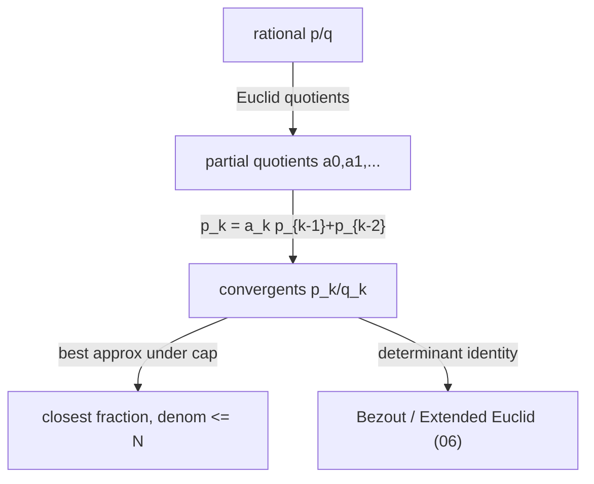

# Continued Fractions — Junior Level

> **One-line summary:** A **continued fraction** writes a number as `a0 + 1/(a1 + 1/(a2 + ...))`, abbreviated `[a0; a1, a2, ...]`. For a rational number the `a_i` (the *partial quotients*) are exactly the quotients produced by the Euclidean algorithm, and the truncations `[a0]`, `[a0; a1]`, `[a0; a1, a2]`, ... — called **convergents** `p_k/q_k` — are the best possible rational approximations of the number for their size of denominator.

---

## Table of Contents

1. [Introduction](#introduction)
2. [Prerequisites](#prerequisites)
3. [Glossary](#glossary)
4. [Core Concepts](#core-concepts)
5. [Big-O Summary](#big-o-summary)
6. [Real-World Analogies](#real-world-analogies)
7. [Pros & Cons](#pros--cons)
8. [Step-by-Step Walkthrough](#step-by-step-walkthrough)
9. [Code Examples](#code-examples)
10. [Coding Patterns](#coding-patterns)
11. [Error Handling](#error-handling)
12. [Performance Tips](#performance-tips)
13. [Best Practices](#best-practices)
14. [Edge Cases & Pitfalls](#edge-cases--pitfalls)
15. [Common Mistakes](#common-mistakes)
16. [Cheat Sheet](#cheat-sheet)
17. [Visual Animation](#visual-animation)
18. [Summary](#summary)
19. [Further Reading](#further-reading)

---

## Introduction

Suppose you want to describe the fraction `43/19` to a friend who can only do whole-number division. You divide: `43 = 2·19 + 5`, so `43/19 = 2 + 5/19`. The leftover `5/19` is less than 1, so flip it: `5/19 = 1/(19/5)`. Now divide again: `19 = 3·5 + 4`, so `19/5 = 3 + 4/5`. Keep flipping and dividing. What you are doing is the **Euclidean algorithm**, and the sequence of whole-number quotients you write down — here `2, 3, 1, 4` — is the **continued fraction expansion** of `43/19`:

```
43/19 = 2 + 1/(3 + 1/(1 + 1/4)) = [2; 3, 1, 4]
```

That is the whole idea in one sentence: **the continued fraction of a fraction is just the list of quotients the Euclidean algorithm spits out.** Nothing more exotic than repeated division-with-remainder.

Why should you care? Because the *partial* expansions — `[2]`, `[2;3]`, `[2;3,1]`, `[2;3,1,4]` — give you a sequence of simpler fractions that home in on the true value astonishingly fast and *optimally*. These partial expansions are called **convergents**, written `p_k/q_k`. For `43/19` they are `2/1`, `7/3`, `9/4`, `43/19`. Each one is the **best rational approximation** of `43/19` among all fractions with a denominator no larger than its own. That "best approximation" property is why continued fractions show up everywhere: gear ratios, musical tuning, calendar design (leap years!), and famous algorithms in number theory.

This file teaches the junior-level core:

- How to compute the continued fraction `[a0; a1, a2, ...]` of a rational via Euclid.
- How to turn the partial quotients back into the convergents `p_k/q_k` with a tidy recurrence.
- The intuition behind "best rational approximation," with a fully worked example.

The deeper machinery — quadratic irrationals like `sqrt(D)` having *periodic* continued fractions, Pell's equation `x^2 - D·y^2 = 1`, rational reconstruction, and the proofs — is built up in `middle.md`, `senior.md`, and `professional.md`. Two siblings are especially close: `01-gcd-lcm` (the Euclidean algorithm that produces the partial quotients) and `07-extended-euclidean-modular-inverse` (the convergents are literally the Bezout coefficients of the extended Euclid run).

---

## Prerequisites

Before reading this file you should be comfortable with:

- **Integer division and remainder** — `q = a / b` (floor) and `r = a % b`, the building blocks of every step.
- **The Euclidean algorithm** — repeatedly replacing `(a, b)` by `(b, a mod b)` to find `gcd(a, b)`. See sibling `01-gcd-lcm`.
- **Fractions** — adding, flipping (reciprocal), and reducing `p/q` to lowest terms.
- **Basic recurrences** — sequences defined by `x_k = (something) · x_{k-1} + x_{k-2}`.
- **Big-O notation** — `O(log n)` for how many division steps Euclid takes.

Optional but helpful:

- A glance at **irrational numbers** like `sqrt(2)`, since their continued fractions never terminate (covered later).
- Familiarity with **2x2 matrices**, because the convergent recurrence has a clean matrix form (introduced in `middle.md`).

---

## Glossary

| Term | Meaning |
|------|---------|
| **Continued fraction (CF)** | An expression `a0 + 1/(a1 + 1/(a2 + ...))`, written compactly as `[a0; a1, a2, ...]`. |
| **Partial quotient `a_k`** | The whole-number terms of the CF. For a rational they are the Euclidean-algorithm quotients. `a0` may be any integer; `a1, a2, ...` are positive. |
| **Simple / regular CF** | A CF where every numerator is `1` (the only kind we use here). |
| **Convergent `p_k/q_k`** | The fraction obtained by truncating the CF after `a_k`: `p_k/q_k = [a0; a1, ..., a_k]`. |
| **Numerator sequence `p_k`** | Built by `p_k = a_k·p_{k-1} + p_{k-2}`. |
| **Denominator sequence `q_k`** | Built by `q_k = a_k·q_{k-1} + q_{k-2}`. |
| **Finite CF** | A CF that stops; exactly the rational numbers have finite CFs. |
| **Infinite / periodic CF** | A CF that never stops; irrational numbers. `sqrt(D)` is periodic (covered in `middle.md`). |
| **Best rational approximation** | A fraction `p/q` closer to `x` than any other fraction with denominator `<= q`. Convergents are such. |
| **Euclidean algorithm** | Repeated division `(a, b) -> (b, a mod b)`; its quotients are the partial quotients. |

---

## Core Concepts

### 1. A continued fraction is repeated "whole part, then flip"

Take any positive number `x`. Pull out its whole (integer) part `a0 = floor(x)`. What is left, `x - a0`, is between `0` and `1`. If it is `0`, stop. Otherwise flip it (take the reciprocal) to get a number bigger than `1`, and repeat:

```
a0 = floor(x);   x1 = 1 / (x - a0)
a1 = floor(x1);  x2 = 1 / (x1 - a1)
a2 = floor(x2);  ...
```

The list `[a0; a1, a2, ...]` is the continued fraction. For a rational `x = p/q` this *always terminates*, because the "flip and floor" loop is exactly the Euclidean algorithm on `(p, q)` and Euclid always ends.

### 2. For a rational, the partial quotients are Euclid's quotients

Run Euclid on `(p, q)` and write down each quotient:

```
p = a0·q + r0      (a0 = p / q, r0 = p mod q)
q = a1·r0 + r1     (a1 = q / r0)
r0 = a2·r1 + r2
...
```

The quotients `a0, a1, a2, ...` are *exactly* the partial quotients of `p/q`. The algorithm stops when a remainder hits `0`; the last quotient is the final `a_k`. This is the cleanest way to compute a CF: no floating point, just integer division.

### 3. Convergents via the `p_k`, `q_k` recurrence

Once you have the partial quotients, you build the convergents `p_k/q_k` with the single most important formula in this topic:

```
p_k = a_k · p_{k-1} + p_{k-2}
q_k = a_k · q_{k-1} + q_{k-2}
```

with the standard seed values

```
p_{-1} = 1,  p_{-2} = 0
q_{-1} = 0,  q_{-2} = 1
```

So `p_0/q_0 = a0/1`, then each later convergent reuses the previous two. This recurrence is the engine behind everything — convergents, Pell's equation, rational reconstruction — so memorize its shape: *"new = current_quotient times previous, plus the one before."*

### 4. Convergents are the best approximations

Here is the payoff. Each convergent `p_k/q_k` is the **best rational approximation** to `x` you can make with denominator at most `q_k`: no other fraction with a smaller-or-equal denominator gets closer. The convergents also alternate: even-indexed ones are below `x`, odd-indexed ones are above, and they squeeze toward `x` from both sides. The error shrinks fast:

```
|x - p_k/q_k| < 1 / (q_k · q_{k+1}) <= 1 / q_k^2
```

That `1/q_k^2` is remarkable: doubling the denominator roughly *quarters* the error. (The clean proof is in `professional.md`.)

### 5. The determinant identity

A neighboring pair of convergents satisfies a tiny, beautiful identity:

```
p_k · q_{k-1} - p_{k-1} · q_k = (-1)^{k-1}
```

This says consecutive convergents are always in lowest terms (their numerator and denominator share no common factor) and ties the convergents directly to Bezout coefficients. This identity is *the same equation* the Extended Euclidean Algorithm produces (sibling `07`), which is why the two topics are really one idea wearing two hats.

### 6. Irrational numbers give infinite CFs

If `x` is irrational the loop never terminates — the CF is infinite. Some irrationals are especially tidy: `sqrt(D)` for a non-square `D` has a **periodic** continued fraction, e.g. `sqrt(2) = [1; 2, 2, 2, ...]` and `sqrt(7) = [2; 1, 1, 1, 4, 1, 1, 1, 4, ...]`. That periodicity is the key to solving Pell's equation, which `middle.md` develops.

---

## Big-O Summary

| Operation | Time | Space | Notes |
|-----------|------|-------|-------|
| CF expansion of `p/q` | **O(log(min(p,q)))** | O(length) | Same bound as Euclid; number of quotients is `O(log q)`. |
| One convergent step | O(1) | O(1) | Just the two-line recurrence. |
| All convergents of `p/q` | O(log q) | O(length) | One pass alongside the expansion. |
| Best approximation within denominator bound | O(log q) | O(1) | Walk the convergents until the denominator limit. |
| CF of `sqrt(D)` (one period) | O(period) | O(period) | Period length can be `O(sqrt(D) · log D)` in the worst case. |
| Evaluate a finite CF back to `p/q` | O(length) | O(1) | Fold from the last term inward, or use the recurrence. |

The headline number is **`O(log q)`** for everything about a rational `p/q` — the continued fraction is as cheap as a single GCD computation, because it *is* a single GCD computation.

---

## Real-World Analogies

| Concept | Analogy |
|---------|---------|
| Partial quotient `a_k` | How many whole tiles of the current size fit before you switch to a smaller tile. Tiling a rectangle with squares produces exactly the CF quotients. |
| Convergent `p_k/q_k` | A "good enough" gear ratio: you cannot machine gears with arbitrary tooth counts, so you pick the simplest pair that closely matches the desired ratio. |
| Best approximation | The closest train you can catch with the coins (denominators) you actually have — no smaller-denominator fraction does better. |
| Periodic CF of `sqrt(D)` | A repeating decimal, but for the "flip and floor" process instead of base-10 division. |
| Leap-year design | The solar year is `~365.2422` days; the convergent `365 + 8/33` and the famous `365 + 97/400` (Gregorian) come from its continued fraction. |
| Musical tuning | `log2(3/2) ~= 0.585`; its convergent `7/12` is why a piano octave has 12 keys. |

Where the analogy breaks: gear ratios and tunings only need *one* good convergent, whereas number theory uses the whole sequence and its algebraic identities.

---

## Pros & Cons

| Pros | Cons |
|------|------|
| Computes the *provably best* rational approximation for each denominator size. | Only the regular (numerator-1) CF has these clean guarantees. |
| Exact integer arithmetic — no floating-point rounding for rationals. | For irrationals you must work symbolically or with high-precision input. |
| Same cost as a GCD: `O(log q)`. | The number of terms can be large for adversarial inputs near the golden ratio. |
| Unifies GCD, Bezout coefficients, Diophantine equations, and Pell's equation. | The recurrence seeds and index bookkeeping are easy to get wrong. |
| The convergent recurrence is two lines and `O(1)` per step. | Periodic CFs of `sqrt(D)` need careful integer handling to avoid overflow. |

**When to use:** best rational approximation under a denominator cap, solving `ax + by = c`, computing modular inverses, solving Pell's equation, rational reconstruction (recovering a fraction from a value mod `m`), and any exact-rational task where floating point would lose precision.

**When NOT to use:** when an `O(1)` direct formula exists, when the input is already a low-denominator fraction, or when you only need an approximate decimal (just divide).

---

## Step-by-Step Walkthrough

Let us compute the continued fraction and convergents of `x = 43/19` by hand.

**Phase 1 — the expansion (Euclid):**

```
43 = 2·19 + 5    -> a0 = 2
19 = 3·5  + 4    -> a1 = 3
 5 = 1·4  + 1    -> a2 = 1
 4 = 4·1  + 0    -> a3 = 4   (remainder 0, stop)
```

So `43/19 = [2; 3, 1, 4]`. Notice the quotients `2, 3, 1, 4` are precisely Euclid's quotients.

**Phase 2 — the convergents (recurrence):** seed `p_{-2}=0, p_{-1}=1, q_{-2}=1, q_{-1}=0`.

```
k=0: a0=2 -> p0 = 2·1 + 0 = 2,   q0 = 2·0 + 1 = 1   ->  2/1
k=1: a1=3 -> p1 = 3·2 + 1 = 7,   q1 = 3·1 + 0 = 3   ->  7/3
k=2: a2=1 -> p2 = 1·7 + 2 = 9,   q2 = 1·3 + 1 = 4   ->  9/4
k=3: a3=4 -> p3 = 4·9 + 7 = 43,  q3 = 4·4 + 3 = 19  -> 43/19
```

The last convergent is the number itself, `43/19`.

**Phase 3 — check the approximation quality.** As decimals, `x = 43/19 = 2.2632...`:

```
2/1   = 2.0000   (below x, error 0.263)
7/3   = 2.3333   (above x, error 0.070)
9/4   = 2.2500   (below x, error 0.013)
43/19 = exact
```

The convergents alternate below/above and close in fast. And `9/4` is the **best** approximation to `43/19` with denominator at most `4`: try every fraction with denominator `1, 2, 3, 4` and none beats `9/4`.

**Phase 4 — verify the determinant identity** at `k=2`:

```
p2·q1 - p1·q2 = 9·3 - 7·4 = 27 - 28 = -1 = (-1)^{2-1}.  OK
```

That `-1` confirms `9/4` is already in lowest terms and ties directly to the Extended Euclidean coefficients for `gcd(43, 19) = 1`.

---

## Code Examples

### Example: Continued Fraction Expansion + Convergents of a Rational

This computes the partial quotients of `p/q` via Euclid, then the convergents via the recurrence.

#### Go

```go
package main

import "fmt"

// continuedFraction returns the partial quotients [a0, a1, ...] of p/q.
func continuedFraction(p, q int64) []int64 {
	var a []int64
	for q != 0 {
		a = append(a, p/q) // floor division for non-negative p, q
		p, q = q, p%q       // the Euclidean step
	}
	return a
}

// convergents returns the (p_k, q_k) pairs for the given partial quotients.
func convergents(a []int64) [][2]int64 {
	var res [][2]int64
	var pPrev, pPrev2 int64 = 1, 0 // p_{-1}=1, p_{-2}=0
	var qPrev, qPrev2 int64 = 0, 1 // q_{-1}=0, q_{-2}=1
	for _, ak := range a {
		pk := ak*pPrev + pPrev2
		qk := ak*qPrev + qPrev2
		res = append(res, [2]int64{pk, qk})
		pPrev2, pPrev = pPrev, pk
		qPrev2, qPrev = qPrev, qk
	}
	return res
}

func main() {
	a := continuedFraction(43, 19)
	fmt.Println("CF:", a) // [2 3 1 4]
	for _, c := range convergents(a) {
		fmt.Printf("%d/%d\n", c[0], c[1]) // 2/1, 7/3, 9/4, 43/19
	}
}
```

#### Java

```java
import java.util.*;

public class ContinuedFraction {
    static List<Long> continuedFraction(long p, long q) {
        List<Long> a = new ArrayList<>();
        while (q != 0) {
            a.add(p / q);       // floor division for non-negative inputs
            long r = p % q;
            p = q;
            q = r;              // Euclidean step
        }
        return a;
    }

    static List<long[]> convergents(List<Long> a) {
        List<long[]> res = new ArrayList<>();
        long pPrev = 1, pPrev2 = 0; // p_{-1}=1, p_{-2}=0
        long qPrev = 0, qPrev2 = 1; // q_{-1}=0, q_{-2}=1
        for (long ak : a) {
            long pk = ak * pPrev + pPrev2;
            long qk = ak * qPrev + qPrev2;
            res.add(new long[]{pk, qk});
            pPrev2 = pPrev; pPrev = pk;
            qPrev2 = qPrev; qPrev = qk;
        }
        return res;
    }

    public static void main(String[] args) {
        List<Long> a = continuedFraction(43, 19);
        System.out.println("CF: " + a); // [2, 3, 1, 4]
        for (long[] c : convergents(a)) {
            System.out.println(c[0] + "/" + c[1]); // 2/1, 7/3, 9/4, 43/19
        }
    }
}
```

#### Python

```python
def continued_fraction(p, q):
    """Partial quotients [a0, a1, ...] of p/q via the Euclidean algorithm."""
    a = []
    while q != 0:
        a.append(p // q)   # floor division
        p, q = q, p % q    # Euclidean step
    return a


def convergents(a):
    """Return (p_k, q_k) for each partial quotient."""
    p_prev, p_prev2 = 1, 0   # p_{-1}=1, p_{-2}=0
    q_prev, q_prev2 = 0, 1   # q_{-1}=0, q_{-2}=1
    out = []
    for ak in a:
        pk = ak * p_prev + p_prev2
        qk = ak * q_prev + q_prev2
        out.append((pk, qk))
        p_prev2, p_prev = p_prev, pk
        q_prev2, q_prev = q_prev, qk
    return out


if __name__ == "__main__":
    a = continued_fraction(43, 19)
    print("CF:", a)                 # [2, 3, 1, 4]
    for pk, qk in convergents(a):
        print(f"{pk}/{qk}")         # 2/1, 7/3, 9/4, 43/19
```

**What it does:** expands `43/19` to `[2; 3, 1, 4]`, then builds the four convergents.
**Run:** `go run main.go` | `javac ContinuedFraction.java && java ContinuedFraction` | `python cf.py`

---

## Coding Patterns

### Pattern 1: Fold a Finite CF Back to a Fraction

**Intent:** Given partial quotients `[a0, a1, ..., an]`, reconstruct `p/q` by folding from the innermost term outward.

```python
def cf_to_fraction(a):
    num, den = a[-1], 1          # innermost term a_n / 1
    for ak in reversed(a[:-1]):
        num, den = ak * num + den, num   # x = ak + 1/(num/den)
    return num, den              # p/q
```

This is the inverse of the expansion: `cf_to_fraction([2,3,1,4])` returns `(43, 19)`. It is `O(length)` and uses only integer arithmetic.

### Pattern 2: Convergents Alternate Around the Target

**Intent:** Even convergents `p_0/q_0, p_2/q_2, ...` lie below `x`; odd ones lie above. Use this to bracket `x` or to pick the closest under a constraint.

```python
# x is bracketed by consecutive convergents:
# p_0/q_0 <= p_2/q_2 <= ... <= x <= ... <= p_3/q_3 <= p_1/q_1
```

### Pattern 3: Stop Early Under a Denominator Cap

**Intent:** For "best fraction with denominator <= N," walk the convergents and stop before `q_k` exceeds `N`. The last convergent within the cap (possibly refined by a "semiconvergent") is the answer. This is the core of best-approximation tasks (see `middle.md` for the semiconvergent refinement).



---

## Error Handling

| Error | Cause | Fix |
|-------|-------|-----|
| Wrong CF for negative `x` | `floor` of a negative differs from truncation toward zero. | Use true floor for `a0`; keep `a1..` positive by handling the sign of `x` up front. |
| Infinite loop | `q` never reaches `0` because of a sign or non-integer input. | Ensure integer inputs and that you use `p % q` (which strictly shrinks). |
| Off-by-one in seeds | Used `p_{-1}=0` instead of `1`. | Seed exactly `p_{-1}=1, p_{-2}=0, q_{-1}=0, q_{-2}=1`. |
| Overflow in `p_k`, `q_k` | Numerators and denominators grow large for long CFs. | Use 64-bit (or big integers) for `p_k`, `q_k`. |
| Division by zero | First convergent step divides before seeding. | Build convergents from the recurrence, never by re-dividing. |
| Trailing-1 ambiguity | `[...; a_n]` with `a_n = 1` equals `[...; a_{n-1}+1]`. | Normalize: if the last quotient is `1` (and there is more than one), merge it. |

---

## Performance Tips

- **One pass for both.** Compute the partial quotients and convergents together; you do not need to store the whole quotient list first.
- **Skip floating point.** For rationals, stay in integers — it is faster *and* exact.
- **Watch the growth.** `q_k` grows at least like Fibonacci numbers, so a CF of length `m` can have a denominator around `phi^m`. Use big integers when `m` is large.
- **Reuse the last two.** The recurrence only needs `p_{k-1}, p_{k-2}` (and the `q` analogues); keep four variables, not full arrays, when you only need the final convergent.
- **Normalize the input.** Reduce `p/q` by `gcd` first if you want the shortest expansion (though Euclid handles unreduced input fine).

---

## Best Practices

- Always seed the recurrence with `p_{-1}=1, p_{-2}=0, q_{-1}=0, q_{-2}=1`; write them as named constants so you never fumble them.
- Verify your convergents with the determinant identity `p_k q_{k-1} - p_{k-1} q_k = (-1)^{k-1}` during testing — it catches index bugs instantly.
- Treat the CF expansion as "Euclid that records quotients"; reusing your tested GCD code reduces bugs.
- Decide up front whether you want the trailing-`1` form or the merged form, and normalize consistently.
- For irrational inputs (like `sqrt(D)`), never use `double`; use the exact integer recurrence shown in `middle.md`.

---

## Edge Cases & Pitfalls

- **`x` is an integer** — CF is `[x]`, a single term; the only convergent is `x/1`.
- **`x < 1`** — then `a0 = 0`, e.g. `5/19 = [0; 3, 1, 4]`. The leading `0` is legitimate.
- **Negative `x`** — `a0` is the floor (can be negative); subsequent quotients stay positive. Be deliberate about the convention.
- **Denominator `q = 0`** — undefined input; reject it.
- **Trailing `1`** — `[a0; ..., a_{n-1}, 1] = [a0; ..., a_{n-1}+1]`. Two CFs, same value. Pick one convention.
- **Already reduced** — Euclid works on unreduced `p/q` too; the CF is the same.
- **Long CFs** — inputs near consecutive Fibonacci numbers (e.g. `89/55`) give the longest CFs (all `1`s), the worst case for Euclid.

---

## Common Mistakes

1. **Seeding `p_{-1}=0`** instead of `1` — shifts every convergent and breaks the determinant identity.
2. **Using truncation instead of floor** for negative `a0` — produces a wrong leading term.
3. **Re-dividing to get each convergent** instead of using the `O(1)` recurrence — slow and error-prone.
4. **Forgetting the trailing-1 normalization** — two valid CFs confuse equality tests.
5. **Assuming convergents are always strictly closer than every fraction** — they are best among denominators `<= q_k`; *semiconvergents* can sit between them (see `middle.md`).
6. **Overflowing 32-bit integers** — `p_k, q_k` grow exponentially; use 64-bit or big integers.
7. **Treating an irrational's `double` value as exact** — rounding corrupts the tail of the CF.

---

## Cheat Sheet

| Question | Tool | Formula |
|----------|------|---------|
| CF of `p/q` | Euclid quotients | repeat `a=p/q; (p,q)=(q,p%q)` |
| Convergent numerators | recurrence | `p_k = a_k p_{k-1} + p_{k-2}` |
| Convergent denominators | recurrence | `q_k = a_k q_{k-1} + q_{k-2}` |
| Seeds | constants | `p_{-1}=1,p_{-2}=0,q_{-1}=0,q_{-2}=1` |
| First convergent | base | `p_0/q_0 = a0/1` |
| Approximation error | bound | `|x - p_k/q_k| < 1/(q_k q_{k+1}) <= 1/q_k^2` |
| Neighbor identity | determinant | `p_k q_{k-1} - p_{k-1} q_k = (-1)^{k-1}` |
| CF -> fraction | fold inward | `num,den = a_k·num+den, num` |

Core algorithm:

```
expand(p, q):
    while q != 0:
        emit(p / q)         # a partial quotient
        (p, q) = (q, p % q) # Euclidean step

convergents(a):
    p_prev,p_prev2 = 1,0; q_prev,q_prev2 = 0,1
    for a_k in a:
        p_k = a_k*p_prev + p_prev2; q_k = a_k*q_prev + q_prev2
        (p_prev2,p_prev) = (p_prev,p_k); (q_prev2,q_prev) = (q_prev,q_k)
# cost: O(log q), exact integer arithmetic
```

---

## Visual Animation

> See [`animation.html`](./animation.html) for an interactive visualization.
>
> The animation demonstrates:
> - The Euclidean division steps peeling off partial quotients `a0, a1, a2, ...`
> - The convergent recurrence `p_k = a_k p_{k-1} + p_{k-2}` building `p_k/q_k` one term at a time
> - The convergents plotted on a number line, alternating above/below and closing in on the target
> - Step / Run / Reset controls and an editable input fraction

---

## Summary

A continued fraction `[a0; a1, a2, ...]` is just the list of quotients the Euclidean algorithm produces on a fraction `p/q` — repeated "take the whole part, flip the rest." Truncating the CF gives the **convergents** `p_k/q_k`, built by the two-line recurrence `p_k = a_k p_{k-1} + p_{k-2}`, `q_k = a_k q_{k-1} + q_{k-2}` with seeds `p_{-1}=1, p_{-2}=0, q_{-1}=0, q_{-2}=1`. Each convergent is the **best rational approximation** of `x` for its denominator size, with error below `1/q_k^2`, and neighboring convergents satisfy `p_k q_{k-1} - p_{k-1} q_k = (-1)^{k-1}` — the very identity behind the Extended Euclidean Algorithm. Master the expansion and the recurrence here, and the rest of the topic (periodic CFs of `sqrt(D)`, Pell's equation, rational reconstruction) becomes a series of small steps from the same two ideas.

---

## Further Reading

- *Concrete Mathematics* (Graham, Knuth, Patashnik) — continued fractions and the Stern-Brocot tree.
- *An Introduction to the Theory of Numbers* (Hardy & Wright) — the classical chapters on CF and approximation.
- Sibling topic `01-gcd-lcm` — the Euclidean algorithm that generates the partial quotients.
- Sibling topic `07-extended-euclidean-modular-inverse` — convergents are Bezout coefficients in disguise.
- Sibling topic `08-linear-diophantine` — solving `ax + by = c`, closely tied to the CF determinant identity.
- cp-algorithms.com — "Continued fractions" and "Pell's equation".
