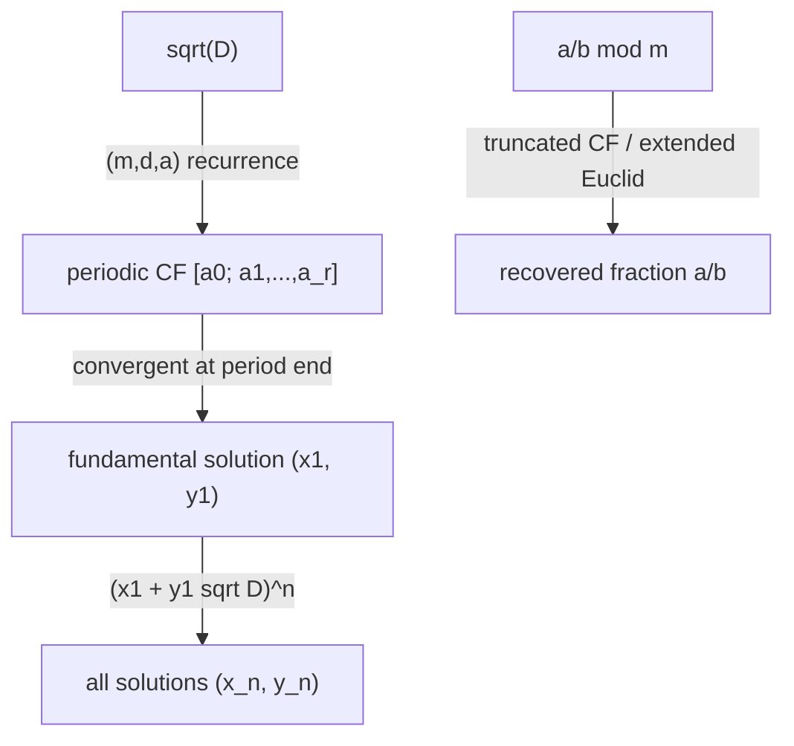

# Continued Fractions — Middle Level

> **Focus:** The convergent recurrence as a `2x2` matrix product, the *periodic* continued fraction of `sqrt(D)` computed with exact integers, solving **Pell's equation** `x^2 - D·y^2 = 1` by reading off the right convergent, the link to the **Stern-Brocot tree**, and **rational reconstruction** — recovering a fraction from its residue mod `m`.

---

## Table of Contents

1. [Introduction](#introduction)
2. [Deeper Concepts](#deeper-concepts)
3. [Comparison with Alternatives](#comparison-with-alternatives)
4. [Advanced Patterns](#advanced-patterns)
5. [Periodic CF of sqrt(D) and Pell's Equation](#periodic-cf-of-sqrtd-and-pells-equation)
6. [Stern-Brocot and Rational Reconstruction](#stern-brocot-and-rational-reconstruction)
7. [Code Examples](#code-examples)
8. [Error Handling](#error-handling)
9. [Performance Analysis](#performance-analysis)
10. [Best Practices](#best-practices)
11. [Visual Animation](#visual-animation)
12. [Summary](#summary)

---

## Introduction

At junior level the message was: the CF of `p/q` is Euclid's quotient list, and the convergents `p_k/q_k` (from the two-line recurrence) are the best rational approximations. At middle level you turn that recurrence into a tool that solves real problems:

- How does the convergent recurrence become a single `2x2` matrix product, and why does that explain the determinant identity for free?
- Irrational `sqrt(D)` has an *infinite* CF — how do you compute its repeating block using only integers (no floating point)?
- Pell's equation `x^2 - D·y^2 = 1` asks for integer solutions; the smallest one is *literally a convergent of `sqrt(D)`*. Which convergent, and why?
- The **Stern-Brocot tree** enumerates every positive rational exactly once, and a path down it spells out a continued fraction. How are the two the same object?
- **Rational reconstruction**: you have a value `r = a/b mod m` and want to recover the small fraction `a/b`. The CF of `r` (run partway) hands it to you.

These five threads all run on the same `p_k`, `q_k` recurrence you already know. The new skill is recognizing which problem maps onto which truncation of the CF, and which stopping rule to apply.

A useful mental model: think of the continued-fraction machine as one engine with a *dial* for the stopping condition. Turn the dial to "remainder = 0" and you get a GCD or a full expansion; to "denominator > N" and you get best approximation; to "a_k = 2·a0" and you get the `sqrt(D)` period (and thence Pell); to "remainder < bound" and you get rational reconstruction. The body of the loop — `emit a quotient, update the convergent, advance the remainder` — never changes. Internalizing this single-engine view is what lets you move fluidly between these problems instead of memorizing four separate algorithms. It also explains why the same big-integer and overflow concerns (covered in `senior.md`) apply uniformly: there is really only one algorithm to harden.

---

## Deeper Concepts

### The convergent recurrence is a matrix product

Stack each step of the recurrence as a `2x2` matrix. Define

```
M_k = [ a_k  1 ]
      [  1   0 ]
```

Then the running product of these matrices *is* the convergent table:

```
M_0 · M_1 · ... · M_k = [ p_k    p_{k-1} ]
                        [ q_k    q_{k-1} ]
```

Read off the top-left entry and you get `p_k`; the whole matrix carries the previous convergent too. This is more than elegance:

- **The determinant identity falls out instantly.** `det(M_k) = a_k·0 - 1·1 = -1`, so `det(product) = (-1)^{k+1}`. But `det` of the convergent matrix is `p_k q_{k-1} - p_{k-1} q_k`. Hence `p_k q_{k-1} - p_{k-1} q_k = (-1)^{k+1} = (-1)^{k-1}` — the junior identity, proved in one line.
- **Associativity gives you fast evaluation.** Because matrix multiplication is associative, you can multiply the `M_k` in any grouping, which is the door to `O(log)` techniques and to composing CFs.

### Worked matrix derivation of the determinant identity

Take `[2; 3]` (the convergent `7/3`). The product `M(2) M(3) = [[2,1],[1,0]] [[3,1],[1,0]] = [[7,2],[3,1]]`. The columns read off `p_1 = 7, q_1 = 3` (first column) and `p_0 = 2, q_0 = 1` (second column). The determinant is `7*1 - 2*3 = 1 = (-1)^{1+1}`, exactly `p_1 q_0 - p_0 q_1`. Because each `M(a)` has determinant `-1`, a product of `k+1` of them has determinant `(-1)^{k+1}` — and that product's determinant is `p_k q_{k-1} - p_{k-1} q_k`. So the determinant identity is not a separate fact to memorize; it is the multiplicativity of determinants applied to the matrix factorization. This is the single cleanest way to remember why the sign alternates.

### Convergents, semiconvergents, and "best approximation of the second kind"

The convergents are the *record-holders* for approximation, but between `p_{k-1}/q_{k-1}` and `p_{k+1}/q_{k+1}` lie the **semiconvergents**

```
(p_{k-1} + t·p_k) / (q_{k-1} + t·q_k),    t = 1, 2, ..., a_{k+1}
```

These are the best approximations with denominator strictly between `q_{k-1}` and `q_{k+1}`. When a problem asks for "the best fraction with denominator <= N" and `N` falls between two convergent denominators, the answer is a semiconvergent, not a convergent. Two flavors of "best":

- **Best of the first kind:** smallest `|x - p/q|` among denominators `<= q`. Includes semiconvergents.
- **Best of the second kind:** smallest `|q·x - p|`. Exactly the convergents.

Knowing which kind a problem wants prevents a classic wrong answer.

### Exact CF of a quadratic irrational

`sqrt(D)` cannot be stored as a float without error, but its CF has an exact integer recurrence. Represent the current value as `(m + sqrt(D)) / d`. Starting from `m0 = 0, d0 = 1, a0 = floor(sqrt(D))`, iterate:

```
a_k   = floor( (a0 + m_k) / d_k )
m_{k+1} = d_k · a_k - m_k
d_{k+1} = (D - m_{k+1}^2) / d_k
```

Everything stays integer. The block repeats, and the period ends exactly when `a_k = 2·a0` (equivalently when `(m, d)` returns to `(a0, 1)`). This is the engine for Pell.

The `(m, d)` state is bounded — `0 < d_k <= a0 + sqrt(D)` and `0 <= m_k < sqrt(D)` throughout — which is *why* the CF must eventually cycle: there are only finitely many valid `(m, d)` pairs, so by pigeonhole a state repeats. This bounded-state argument is the computational shadow of Lagrange's theorem (`professional.md` Section 6), and it also tells you the period length is at most `O(sqrt(D))` states (more precisely `O(sqrt(D) log D)`). The integer recurrence never touches a float, so it is exact for arbitrarily large `D` — the float `sqrt(D)` is used only once, to seed `a0`, and even that can be replaced by an integer `isqrt` to avoid precision issues entirely.

---

## Comparison with Alternatives

### Best rational approximation: CF vs brute force vs Stern-Brocot search

| Approach | Cost | When |
|----------|------|------|
| Brute force over denominators `1..N` | `O(N)` (or `O(N log N)`) | tiny `N`, quick scripts |
| Continued-fraction convergents + semiconvergents | `O(log N)` | the standard answer |
| Stern-Brocot binary search | `O(log N)` per step, `O(depth)` total | when you want the mediant path / a tree structure |

The CF method dominates for non-trivial `N`: it visits only `O(log N)` candidates and is provably optimal.

### Pell's equation: CF vs exhaustive search

| Approach | Cost | Note |
|----------|------|------|
| Try `y = 1, 2, 3, ...` and test if `D·y^2 + 1` is a perfect square | exponential in the size of the solution | the fundamental solution can be astronomically large (e.g. `D=61`: `y` has 9 digits) |
| CF of `sqrt(D)`, read the convergent at the end of the period | `O(period)` | the only practical method |

The fundamental solution to `x^2 - 61·y^2 = 1` is `x = 1766319049, y = 226153980`. Brute force is hopeless; the CF finds it from a period of length 11.

### Recovering a fraction mod m: rational reconstruction vs nothing

There is no naive alternative — without the CF you cannot recover `a/b` from `a·b^{-1} mod m`. Rational reconstruction is *the* technique, used in exact linear algebra (solving `Ax=b` over the rationals via a modular image) and in CRT-based algorithms.

### A unifying view of the comparisons

Notice the pattern across the three tables: in each case the *continued fraction is not merely the fastest method — it is essentially the only method that scales*. Best approximation has an `O(N)` brute force, but it is hopeless past tiny `N`; Pell's fundamental solution can be `38` digits for a `3`-digit `D`, so trial search is impossible; and reconstruction has no alternative at all. This is the deeper reason continued fractions are worth mastering: they are not an optimization of an existing approach, they are the enabling technique for an entire class of exact-arithmetic problems that are otherwise intractable. The `O(log)` cost is a bonus on top of feasibility.

---

## Advanced Patterns

### Pattern: Matrix-form convergent accumulation

Accumulate the convergent matrix instead of juggling four scalars. It generalizes cleanly and makes the determinant check trivial.

```python
def convergent_matrix(a):
    # returns [[p_k, p_{k-1}], [q_k, q_{k-1}]]
    P = [[1, 0], [0, 1]]  # identity
    for ak in a:
        M = [[ak, 1], [1, 0]]
        P = [[P[0][0]*ak + P[0][1], P[0][0]],
             [P[1][0]*ak + P[1][1], P[1][0]]]
    return P
```

### Pattern: Best approximation with a denominator cap (convergents + semiconvergents)

Walk convergents until `q_k > N`, then test the semiconvergent `(p_{k-1} + t·p_k)/(q_{k-1} + t·q_k)` with the largest `t` keeping the denominator `<= N`, and compare it against the previous convergent. The closer of the two is the answer.

### Pattern: Pell via CF period

Compute the CF of `sqrt(D)` until the period closes. The fundamental solution is the convergent `(p, q)` taken at index `period - 1` (if the period length is even) or at `2·period - 1` (if odd). Verify with `p^2 - D·q^2 == 1`.



This diagram captures the whole middle-level toolkit: the left branch (`sqrt(D)` -> period -> fundamental solution -> all solutions) is the Pell pipeline, and the bottom branch (`a/b mod m` -> truncated CF -> recovered fraction) is rational reconstruction. Both start from the same expansion step shown in the junior file; they differ only in the input (a `sqrt(D)` vs a residue) and the stopping rule (period-end vs size-bound). Keeping this picture in mind prevents the common confusion of applying the period logic to a reconstruction problem or vice versa.

---

## Periodic CF of sqrt(D) and Pell's Equation

### Why `sqrt(D)` is periodic

A theorem of Lagrange (proved in `professional.md`) says a CF is eventually periodic **if and only if** the number is a quadratic irrational — a root of `Ax^2 + Bx + C = 0` with integer coefficients. `sqrt(D)` qualifies. Moreover `sqrt(D) = [a0; \overline{a1, a2, ..., a_{r-1}, 2·a0}]` — the bar marks the repeating block, and the last term of the block is always `2·a0`. The block (except that final term) is a *palindrome*.

Example: `sqrt(7) = [2; \overline{1, 1, 1, 4}]`, period `4`, and indeed the block ends in `4 = 2·2`.

### From the period to the fundamental Pell solution

Pell's equation `x^2 - D·y^2 = 1` (for non-square `D`) has infinitely many solutions, generated by the smallest positive one, the **fundamental solution** `(x1, y1)`. The key fact: the convergents `p_k/q_k` of `sqrt(D)` satisfy

```
p_k^2 - D·q_k^2 = (-1)^{k+1} · d_{k+1}
```

and right at the end of the period this quantity is `±1`. Concretely, with period length `r`:

- If `r` is **even**, the convergent at index `r-1` gives `p_{r-1}^2 - D·q_{r-1}^2 = 1` — that is `(x1, y1)`.
- If `r` is **odd**, index `r-1` gives `-1` (a solution to the *negative* Pell equation `x^2 - D·y^2 = -1`); square that solution (take index `2r-1`) to get `+1`.

So the fundamental solution is always a convergent of `sqrt(D)`.

### Generating all solutions

Once you have `(x1, y1)`, every solution comes from powers in the ring `Z[sqrt(D)]`:

```
x_n + y_n·sqrt(D) = (x1 + y1·sqrt(D))^n
```

which unrolls to the recurrence

```
x_{n+1} = x1·x_n + D·y1·y_n
y_{n+1} = x1·y_n + y1·x_n
```

This is the same "multiply in the matrix" idea: `(x_n, y_n)` evolves by a fixed `2x2` matrix `[[x1, D·y1],[y1, x1]]`, so the `n`-th solution is computable in `O(log n)` by matrix exponentiation (sibling `11-matrix-exponentiation`).

### Worked Pell example: D = 7

`sqrt(7) = [2; \overline{1, 1, 1, 4}]`, period length `4` (even). Build convergents from quotients `2, 1, 1, 1, 4`:

```
a:   2     1     1     1     4
p:   2     3     5     8    37
q:   1     1     2     3    14
```

Test `p^2 - 7 q^2` at each index:

```
2^2  - 7*1^2  = -3
3^2  - 7*1^2  =  2
5^2  - 7*2^2  = -3
8^2  - 7*3^2  = 64 - 63 = 1   <- fundamental solution (8, 3)
```

The period is even, so index `3` (one short of the period-end term) gives `+1`: `(x1, y1) = (8, 3)`. Generate the next: `x_2 = 8*8 + 7*3*3 = 64 + 63 = 127`, `y_2 = 8*3 + 3*8 = 48`, and `127^2 - 7*48^2 = 16129 - 16128 = 1`. So the solutions are `(8,3), (127,48), (2024,765), ...`, each obtained by one application of `[[8, 21],[3, 8]]`. This is the entire Pell workflow: expand `sqrt(D)`, find the period, read the `+1` convergent, then power.

---

## Stern-Brocot and Rational Reconstruction

### The Stern-Brocot tree

The Stern-Brocot tree is an infinite binary tree containing **every positive rational exactly once, in lowest terms**. It is built from the **mediant** operation: between two neighbors `a/b` and `c/d` insert `(a+c)/(b+d)`. Starting from the boundaries `0/1` and `1/0`, repeated mediants generate all rationals.

The connection to continued fractions is exact: **the path from the root to a rational `p/q` (a string of L and R turns) is the run-length encoding of the continued fraction of `p/q`.** For example, `[2; 3, 1, 4]` corresponds to "R R, L L L, R, L L L L"-style runs whose lengths are the partial quotients. Walking the tree and counting consecutive same-direction turns *is* computing the CF, and binary-searching the tree finds the simplest fraction in an interval — another route to best approximation.

### Rational reconstruction

Problem: you computed some rational answer `a/b` modulo a prime `m` (common in exact linear algebra, CRT pipelines, and competitive programming), obtaining a single residue `r = a·b^{-1} mod m`. You want the actual small fraction `a/b` back. If you have the *promise* that `|a| <= A` and `0 < b <= B` with `2·A·B < m`, the reconstruction is **unique** and the CF gives it.

The method: run the Extended Euclidean Algorithm (equivalently, the CF) on `(m, r)`, recording the convergent-like sequence, and stop at the first remainder `a'` with `a' <= A`; the matching coefficient `b'` satisfies `a'/b' ≡ r (mod m)`, and that is the answer (after a sign and `gcd` check). This is the **Wang rational reconstruction** algorithm, and it is nothing but a truncated Euclidean run — the same machine as the CF expansion, halted by a size bound instead of by hitting remainder `0`.

```python
def rational_reconstruct(r, m, bound):
    """Recover a/b with |a|,|b| < bound and a/b ≡ r (mod m). Returns (a, b) or None."""
    # Extended-Euclid style; track remainder and its coefficient.
    r0, r1 = m, r % m
    s0, s1 = 0, 1
    while r1 >= bound:
        q = r0 // r1
        r0, r1 = r1, r0 - q * r1
        s0, s1 = s1, s0 - q * s1
    a, b = r1, s1
    if b < 0:
        a, b = -a, -b
    if b == 0 or b >= bound:
        return None
    return a, b
```

When `m` is split across several primes (CRT), you reconstruct the residue modulo the product and then apply this — the standard exact-arithmetic pipeline.

### Worked Stern-Brocot descent

Find the simplest fraction strictly between `1/3` and `1/2`. Start with boundaries `lo = 1/3`, `hi = 1/2`, take the mediant `(1+1)/(3+2) = 2/5 = 0.4`. Since `1/3 = 0.333 < 0.4 < 0.5 = 1/2`, the mediant `2/5` lies inside the interval, so it is the answer — the unique fraction with the smallest denominator in `(1/3, 1/2)`. No fraction with denominator `1, 2, 3, 4` lies strictly between them; `2/5` is first. The L/R path to reach `2/5` from the root encodes its CF `[0; 2, 2]` (`2/5 = 1/(2 + 1/2)`). This mediant search is the same engine as the CF: each "run" of same-direction turns is a partial quotient, and stopping when the mediant enters the interval is exactly truncating the CF at the right place.

### Why reconstruction is "Euclid with a different stop"

The reconstruction code above is character-for-character a Euclidean loop on `(m, r)` — the *only* difference from a GCD computation is the halt condition `while r1 >= bound` instead of `while r1 != 0`, and that it returns the cofactor `s1` alongside the remainder. This is worth internalizing: GCD stops at `0`, CF expansion records every quotient until `0`, best-approximation stops when the denominator exceeds a cap, and reconstruction stops when the remainder drops below a size bound. One loop body, four stopping rules — see `senior.md` Section 6.3 for the full table.

---

## Code Examples

### Exact CF of sqrt(D) and the fundamental Pell solution

#### Go

```go
package main

import (
	"fmt"
	"math"
)

// cfSqrt returns the period of the continued fraction of sqrt(D).
func cfSqrt(D int64) (a0 int64, period []int64) {
	a0 = int64(math.Sqrt(float64(D)))
	if a0*a0 == D {
		return a0, nil // perfect square: no period
	}
	m, d, a := int64(0), int64(1), a0
	for a != 2*a0 {
		m = d*a - m
		d = (D - m*m) / d
		a = (a0 + m) / d
		period = append(period, a)
	}
	return a0, period
}

// pell returns the fundamental solution (x, y) of x^2 - D y^2 = 1.
func pell(D int64) (int64, int64) {
	a0, period := cfSqrt(D)
	// build convergents using the full quotient list a0, then the period
	pPrev2, pPrev := int64(1), a0
	qPrev2, qPrev := int64(0), int64(1)
	if pPrev*pPrev-D*qPrev*qPrev == 1 {
		return pPrev, qPrev
	}
	terms := period
	r := len(period)
	if r%2 == 1 { // odd period: go around twice
		terms = append(append([]int64{}, period...), period...)
	}
	for _, ak := range terms {
		p := ak*pPrev + pPrev2
		q := ak*qPrev + qPrev2
		pPrev2, pPrev = pPrev, p
		qPrev2, qPrev = qPrev, q
		if pPrev*pPrev-D*qPrev*qPrev == 1 {
			return pPrev, qPrev
		}
	}
	return pPrev, qPrev
}

func main() {
	a0, period := cfSqrt(7)
	fmt.Println("sqrt(7): a0 =", a0, "period =", period) // 2, [1 1 1 4]
	x, y := pell(7)
	fmt.Printf("Pell D=7: x=%d y=%d  check=%d\n", x, y, x*x-7*y*y) // 8 3 1
}
```

#### Java

```java
import java.util.*;

public class PellSolver {
    static long[] cfSqrt(long D) {
        long a0 = (long) Math.sqrt((double) D);
        while ((a0 + 1) * (a0 + 1) <= D) a0++;
        while (a0 * a0 > D) a0--;
        List<Long> period = new ArrayList<>();
        if (a0 * a0 == D) return new long[]{a0};
        long m = 0, d = 1, a = a0;
        while (a != 2 * a0) {
            m = d * a - m;
            d = (D - m * m) / d;
            a = (a0 + m) / d;
            period.add(a);
        }
        long[] out = new long[period.size() + 1];
        out[0] = a0;
        for (int i = 0; i < period.size(); i++) out[i + 1] = period.get(i);
        return out;
    }

    static long[] pell(long D) {
        long[] cf = cfSqrt(D);
        long a0 = cf[0];
        int r = cf.length - 1; // period length
        long pPrev2 = 1, pPrev = a0, qPrev2 = 0, qPrev = 1;
        if (pPrev * pPrev - D * qPrev * qPrev == 1) return new long[]{pPrev, qPrev};
        int rounds = (r % 2 == 1) ? 2 : 1;
        for (int round = 0; round < rounds; round++) {
            for (int i = 1; i <= r; i++) {
                long ak = cf[i];
                long p = ak * pPrev + pPrev2;
                long q = ak * qPrev + qPrev2;
                pPrev2 = pPrev; pPrev = p;
                qPrev2 = qPrev; qPrev = q;
                if (pPrev * pPrev - D * qPrev * qPrev == 1) return new long[]{pPrev, qPrev};
            }
        }
        return new long[]{pPrev, qPrev};
    }

    public static void main(String[] args) {
        long[] sol = pell(7);
        System.out.printf("Pell D=7: x=%d y=%d check=%d%n",
                sol[0], sol[1], sol[0] * sol[0] - 7 * sol[1] * sol[1]); // 8 3 1
    }
}
```

#### Python

```python
import math


def cf_sqrt(D):
    """Return (a0, period_list) for the CF of sqrt(D)."""
    a0 = int(math.isqrt(D))
    if a0 * a0 == D:
        return a0, []          # perfect square: terminates
    m, d, a = 0, 1, a0
    period = []
    while a != 2 * a0:
        m = d * a - m
        d = (D - m * m) // d
        a = (a0 + m) // d
        period.append(a)
    return a0, period


def pell(D):
    """Fundamental solution (x, y) of x^2 - D y^2 = 1."""
    a0, period = cf_sqrt(D)
    quotients = [a0] + period * (2 if len(period) % 2 == 1 else 1)
    p_prev2, p_prev = 1, 0
    q_prev2, q_prev = 0, 1
    for ak in quotients:
        p = ak * p_prev + p_prev2
        q = ak * q_prev + q_prev2
        p_prev2, p_prev = p_prev, p
        q_prev2, q_prev = q_prev, q
        if p * p - D * q * q == 1:
            return p, q
    return p_prev, q_prev


if __name__ == "__main__":
    print(cf_sqrt(7))          # (2, [1, 1, 1, 4])
    x, y = pell(7)
    print(x, y, x * x - 7 * y * y)   # 8 3 1
    x, y = pell(61)
    print(x, y, x * x - 61 * y * y)  # 1766319049 226153980 1
```

---

## Error Handling

| Scenario | What goes wrong | Correct approach |
|----------|-----------------|------------------|
| `D` is a perfect square | `sqrt(D)` is rational; the CF terminates and Pell has only the trivial solution `(1, 0)`. | Detect `isqrt(D)^2 == D` and return early. |
| Float `sqrt` rounding for `a0` | `floor(sqrt(D))` off by one for large `D`. | Use integer `isqrt`, or correct with `while`. |
| Odd period mishandled | Reading the convergent at `r-1` gives `-1`, not `+1`. | Detect parity; loop a second period (index `2r-1`) for odd `r`. |
| Overflow in `p_k^2 - D q_k^2` | Fundamental solutions are huge (e.g. `D=61`). | Use 64-bit carefully or big integers; the products can exceed 63 bits. |
| Wrong semiconvergent bound | Choosing `t > a_{k+1}` produces a non-best fraction. | Clamp `t` to `[1, a_{k+1}]` and to the denominator cap. |
| Rational reconstruction non-unique | Bound too loose: `2·A·B >= m`. | Ensure `2·A·B < m`; otherwise the answer is ambiguous. |
| Division-by-zero in `sqrt(D)` loop | `d` becomes `0` on a perfect-square `D` not caught up front. | Detect perfect squares before the loop; `d` stays positive for non-squares. |
| Sign flip in reconstruction | Cofactor sign not normalized, returns `p/q` vs `-p/q`. | Normalize so `b > 0`; re-verify `b·u ≡ a (mod m)`. |

The recurring pattern in all these failures: the algorithm is a tiny loop, so bugs live not in the logic but in the *boundary handling* — the seeds, the stop condition, the integer width, and the sign/parity conventions. A test suite that exercises a perfect square, an odd-period `D`, a `D` with a huge solution, and a negative-`a` reconstruction will surface essentially all of them.

---

## Performance Analysis

| Task | Cost | Note |
|------|------|------|
| CF of `p/q` (rational) | `O(log q)` | same as Euclid |
| CF period of `sqrt(D)` | `O(period)` | period length `O(sqrt(D) log D)` worst case |
| Fundamental Pell solution | `O(period)` arithmetic on big numbers | the *numbers* can be `O(sqrt(D))` digits long |
| `n`-th Pell solution | `O(log n)` matrix power | values grow exponentially in `n` |
| Rational reconstruction | `O(log m)` | a single truncated Euclid run |

The subtle cost is *number size*, not step count. The fundamental Pell solution for `D ~ 10^6` can have thousands of digits, so big-integer arithmetic dominates. The CF *period* stays short relative to the solution size — that compression is exactly why CF is the only viable method.

To make the size/step distinction concrete: for `D = 4729494` (the famous "cattle problem" modulus), the CF period is only a few thousand terms, but the fundamental solution `x` has over **200,000 digits**. The loop runs a few thousand times; each of the last iterations multiplies six-figure-digit integers. So the step count is modest and the *time* is entirely in big-integer multiplication. This is the canonical lesson: never reason about Pell cost from the step count alone — always account for the operand size, which can dwarf everything else.

```python
import time


def benchmark_pell(Ds):
    for D in Ds:
        start = time.perf_counter()
        x, y = pell(D)
        dt = (time.perf_counter() - start) * 1000
        digits = len(str(x))
        print(f"D={D:>5}  x has {digits:>4} digits  ({dt:.2f} ms)")

# D=61 -> 10 digits; D=109, 421, 661 grow rapidly; period is short, numbers are huge.
```

---

## Best Practices

- **Stay in integers** for `sqrt(D)`: use the `(m, d, a)` recurrence, never `double`.
- **Detect the period by `a_k == 2·a0`**, the cleanest stopping test; equivalently `(m, d) == (a0, 1)`.
- **Handle period parity** explicitly when solving Pell (odd period needs a second loop).
- **Use the matrix form** for the convergent recurrence when you want the determinant check or fast composition.
- **Pin the reconstruction bound** `2·A·B < m` so the recovered fraction is provably unique.
- **Reach for big integers** the moment `D` exceeds a few thousand or `n` (solution index) is large; Pell values explode.
- **Verify** every Pell result with `x^2 - D·y^2 == 1` before trusting it.
- **Normalize the trailing 1** when comparing CFs for equality: `[...; a_n, 1] = [...; a_n + 1]`, so canonicalize before any list comparison.
- **Choose the right halt condition** for the goal: `== 0` for GCD/expansion, `q_k > N` for capped approximation, `remainder < bound` for reconstruction, `a_k == 2·a0` for the `sqrt(D)` period. The loop body is identical; only the stop changes.
- **Re-verify reconstruction** with `b·u ≡ a (mod m)` and `gcd(b, m) == 1` before returning; signal failure with None rather than a plausible-but-wrong fraction.

### Tying it together

Every section above is the same recurrence with a different lens: the matrix form explains the algebra, the `(m, d, a)` variant handles irrationals, the period drives Pell, and the truncation handles reconstruction. Hold that unity in mind and the topic stops being a grab-bag of tricks.

### A quick mental checklist

When a problem smells like continued fractions, ask in order: (1) Is the input rational or a `sqrt(D)`? Rational → finite CF, terminates like Euclid; `sqrt(D)` → periodic CF, Pell theory applies. (2) Do I want all convergents, the best under a cap, or a Pell solution? (3) If Pell, what is the period parity? (4) If reconstruction, is `2·A·B < m` satisfied? Answering these four pins the exact variant and its stopping rule before you write a line of code.

Run through this checklist on a worked instance and the implementation falls out: "best fraction for `pi` with denominator `<= 100`" → rational input, best-under-cap variant, walk convergents to `355/113` (`q = 113 > 100`?) and test the prior convergent `22/7` plus semiconvergents → answer `22/7`. The checklist turned a vague request into a precise, two-candidate computation. The same discipline scales to the hardest variants: a Pell query is "irrational input → periodic CF → read the `+1` convergent at the period end → branch on parity," and a reconstruction query is "residue input → truncated Euclid → stop at the size bound → verify the congruence." Naming the variant first is the single habit that most reduces implementation errors at this level.

---

## Visual Animation

> See [`animation.html`](./animation.html) for an interactive view.
>
> The middle-level animation highlights:
> - The Euclidean steps producing the partial quotients, then the `p_k = a_k p_{k-1} + p_{k-2}` build-up.
> - Convergents landing on a number line, alternating above and below the target and tightening.
> - For `sqrt(D)` inputs, the repeating block of the periodic CF and the convergent that solves Pell.
>
> Watching the convergents land alternately above and below the target on the number line makes the `(-1)^{k-1}` straddling concrete, and seeing the Euclid steps feed directly into the `p_k = a_k p_{k-1} + p_{k-2}` recurrence reinforces that the expansion and the convergents are one computation.

---

## Summary

The convergent recurrence is a product of `2x2` matrices `[[a_k,1],[1,0]]`, which makes the determinant identity `p_k q_{k-1} - p_{k-1} q_k = (-1)^{k-1}` a one-line consequence and opens fast composition. For irrational `sqrt(D)` the CF is **periodic** (Lagrange), computed exactly with the integer `(m, d, a)` recurrence; the block ends at `2·a0`. **Pell's equation** `x^2 - D·y^2 = 1` is solved by reading the convergent at the end of the period — the fundamental solution is always a convergent of `sqrt(D)` — and all further solutions are powers of `(x1 + y1 sqrt(D))`, computable by matrix exponentiation. The **Stern-Brocot tree** is the CF wearing a tree disguise: a root-to-rational path is the run-length encoding of the partial quotients. And **rational reconstruction** recovers `a/b` from its residue mod `m` by running Euclid until the remainder drops below a size bound — once again the same recurrence, halted differently. One recurrence, five problems.

The single most valuable habit at this level is to *name the variant first*: when you recognize a problem as continued-fraction-shaped, immediately classify it as (best-approximation / Pell / reconstruction / Stern-Brocot search) and recall its stopping rule and its verification invariant. The implementation then writes itself, because the loop body is identical across all four; only the seed, the stop, and the returned value differ. The next levels (`senior.md`, `professional.md`) add the engineering (big integers, overflow, period parity) and the proofs (the recurrence, the error bound, Lagrange periodicity, Pell solvability), but the conceptual map is complete here: one recurrence, four stopping rules, five problems.
