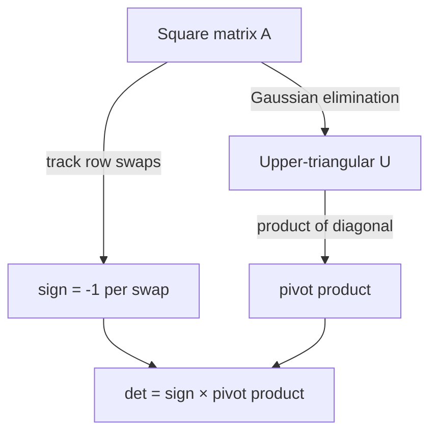

# Matrix Determinant — Junior Level

> **One-line summary:** The determinant `det(A)` is a single number that measures how a square matrix scales area/volume and whether it is invertible (`det(A) = 0` means singular). The slow textbook formulas (cofactor expansion) cost `O(n!)`, but Gaussian elimination computes it in `O(n^3)` as the product of the pivots, flipping the sign once per row swap.

---

## Table of Contents

1. [Introduction](#introduction)
2. [Prerequisites](#prerequisites)
3. [Glossary](#glossary)
4. [Core Concepts](#core-concepts)
5. [Big-O Summary](#big-o-summary)
6. [Real-World Analogies](#real-world-analogies)
7. [Pros & Cons](#pros--cons)
8. [Step-by-Step Walkthrough](#step-by-step-walkthrough)
9. [Code Examples](#code-examples)
10. [Coding Patterns](#coding-patterns)
11. [Error Handling](#error-handling)
12. [Performance Tips](#performance-tips)
13. [Best Practices](#best-practices)
14. [Edge Cases & Pitfalls](#edge-cases--pitfalls)
15. [Common Mistakes](#common-mistakes)
16. [Cheat Sheet](#cheat-sheet)
17. [Visual Animation](#visual-animation)
18. [Summary](#summary)
19. [Further Reading](#further-reading)

---

## Introduction

The **determinant** is a single number you can compute from any *square* matrix `A`. It answers two questions at once:

- **Is the matrix invertible?** `det(A) = 0` exactly when `A` is **singular** (it squashes space flat, has no inverse, and its rows/columns are linearly dependent). `det(A) ≠ 0` means `A` is invertible.
- **How much does `A` scale area or volume?** A `2×2` matrix maps the unit square to a parallelogram whose area is `|det(A)|`. A `3×3` matrix maps the unit cube to a parallelepiped whose volume is `|det(A)|`. The *sign* tells you whether orientation was flipped (a mirror reflection).

You probably first met the determinant as a hand formula. For a `2×2`:

```
det [ a  b ] = a·d − b·c
    [ c  d ]
```

For a `3×3` there is the "expansion" formula with six terms. These hand rules generalize to the **Leibniz formula** (a sum over all `n!` permutations) and the **cofactor / Laplace expansion** (recursively expand along a row). Both are correct — and both are catastrophically slow: cofactor expansion does roughly `n!` multiplications. For `n = 20` that is `20! ≈ 2.4 × 10^18` operations, hopeless.

The good news, and the heart of this whole topic, is that there is a fast way:

> **Reduce `A` to an upper-triangular matrix using Gaussian elimination. The determinant is then the product of the diagonal entries (the pivots), with one sign flip for every row swap you made.**

Gaussian elimination is `O(n^3)` — the same cost as multiplying two matrices — so it handles `n = 1000` easily where `O(n!)` dies at `n = 13`. This file builds that idea from the `2×2` hand formula up to the `O(n^3)` algorithm, with a fully worked example. The elimination machinery itself lives in sibling topic `17-gaussian-elimination`; here we use it as a tool to extract one number.

A final framing note you will see throughout: *the answer changes depending on the number system you work in.* Over the **real numbers** you use floating point (fast but with rounding error). Over a **finite field `Z/pZ`** (mod a prime) you get exact integers and use modular inverses for the pivots. Over the **integers** exactly, plain elimination introduces fractions; the **Bareiss algorithm** avoids them entirely. Junior level focuses on the real/float and basic mod-`p` cases; the middle file develops Bareiss.

---

## Prerequisites

Before reading this file you should be comfortable with:

- **Matrices and square matrices** — a determinant is only defined for an `n × n` (square) matrix.
- **Matrix multiplication** — the row-by-column dot-product rule (used to interpret `det(AB) = det(A)·det(B)`).
- **Gaussian elimination basics** — using row operations to make zeros below the diagonal. See sibling `17-gaussian-elimination`.
- **The 2×2 and 3×3 hand formulas** — `ad − bc` and the six-term `3×3` rule.
- **Big-O notation** — `O(n^3)` vs `O(n!)`; why factorial growth is unusable.
- **Modular arithmetic basics** — `(a + b) mod p`, `(a · b) mod p`, and the idea of a modular inverse (covered in sibling `06-extended-euclidean-modular-inverse`).

Optional but helpful:

- A glance at **linear independence** — `det = 0` is the same statement as "the rows are linearly dependent".
- Familiarity with **floating-point rounding**, since the real-number version is not exact.

---

## Glossary

| Term | Meaning |
|------|---------|
| **Determinant `det(A)`** | A single scalar computed from a square matrix; measures signed area/volume scaling and invertibility. |
| **Square matrix** | An `n × n` matrix (same number of rows and columns). Only square matrices have determinants. |
| **Singular matrix** | A matrix with `det(A) = 0`; not invertible; rows/columns are linearly dependent. |
| **Non-singular / invertible** | `det(A) ≠ 0`; has an inverse `A^{-1}`. |
| **Pivot** | The diagonal entry used to eliminate the entries below it during Gaussian elimination. |
| **Upper-triangular matrix** | All entries below the diagonal are `0`. Its determinant is the product of the diagonal. |
| **Row swap** | Exchanging two rows; each swap multiplies the determinant by `−1`. |
| **Cofactor / Laplace expansion** | A recursive formula for the determinant by expanding along a row or column; `O(n!)`. |
| **Leibniz formula** | `det(A) = Σ over permutations σ of sign(σ)·∏ A[i][σ(i)]`; the `n!`-term definition. |
| **Minor `M_{ij}`** | The determinant of the submatrix obtained by deleting row `i` and column `j`. |
| **Cofactor `C_{ij}`** | `(−1)^{i+j} · M_{ij}`, the signed minor used in Laplace expansion. |
| **Finite field `Z/pZ`** | Integers mod a prime `p`; arithmetic is exact and division uses modular inverses. |

---

## Core Concepts

### 1. The `2×2` and `3×3` Hand Formulas

For a `2×2` matrix, the determinant is the difference of the two diagonal products:

```
det [ a  b ] = a·d − b·c
    [ c  d ]
```

Geometrically this is the signed area of the parallelogram spanned by the rows `(a, b)` and `(c, d)`. For a `3×3` matrix there is the **rule of Sarrus** / cofactor expansion:

```
det [ a b c ]
    [ d e f ] = a(ei − fh) − b(di − fg) + c(dh − eg)
    [ g h i ]
```

Notice the alternating signs `+ − +`. That alternation is the seed of the general theory.

### 2. The Leibniz (Permutation) Definition

The fully general definition sums over **all permutations** `σ` of the columns:

```
det(A) = Σ_σ  sign(σ) · A[1][σ(1)] · A[2][σ(2)] · … · A[n][σ(n)]
```

There are `n!` permutations, each contributing a product of `n` entries with a `±1` sign. This is mathematically clean but computationally hopeless: `n!` terms. It is the *definition*, not the *algorithm*.

### 3. Cofactor / Laplace Expansion (and Why It Is Slow)

The cofactor expansion expands along a chosen row (say row `1`):

```
det(A) = Σ_j  (−1)^{1+j} · A[1][j] · M_{1j}
```

where `M_{1j}` is the determinant of the `(n−1)×(n−1)` matrix with row `1` and column `j` removed. This is recursive: each `n×n` determinant calls `n` determinants of size `n−1`, giving `T(n) = n·T(n−1) ≈ n!`. It is fine for `2×2` and `3×3` by hand, but for `n ≥ 12` or so it is far too slow on a computer.

### 4. The Key Idea: Triangular Matrices Are Easy

For an **upper-triangular** matrix `U` (all zeros below the diagonal), the determinant is just the product of the diagonal:

```
det(U) = U[0][0] · U[1][1] · … · U[n-1][n-1]
```

(Only the identity permutation contributes a nonzero term in the Leibniz sum.) So if we can *transform* `A` into a triangular matrix while *tracking how the determinant changes*, we win.

### 5. How Row Operations Change the Determinant

Gaussian elimination uses three kinds of row operations. Each affects the determinant in a known way:

| Row operation | Effect on `det` |
|---------------|-----------------|
| **Swap two rows** | Multiplies `det` by `−1`. |
| **Add a multiple of one row to another** | Leaves `det` **unchanged**. |
| **Multiply a row by a scalar `c`** | Multiplies `det` by `c`. |

The middle operation — "add a multiple of row `r` to row `s`" — is the workhorse of elimination and it *does not change the determinant at all*. That is why we can freely eliminate below the diagonal. The only bookkeeping we need is the **sign from row swaps** (and, if we scale rows to make pivots `1`, the scaling factors).

### 6. The `O(n^3)` Algorithm (Product of Pivots)

Putting it together:

```
sign = +1
for each column c:
    find a row at or below c with a nonzero entry in column c   (pivot)
    if none exists: det = 0  (the matrix is singular), stop
    if that row is not row c: swap them, sign = -sign
    use the pivot to zero out all entries below it (add multiples — no det change)
det = sign · (product of the diagonal entries)
```

Elimination is `O(n^3)`, the product is `O(n)`, so the whole thing is `O(n^3)`. This is the method you should reach for. The proof that the product of pivots really equals `det(A)` is in [`professional.md`](./professional.md); the picture is: row-adds never change `det`, swaps flip the sign, and the end result is triangular so its `det` is the diagonal product.

---

## Big-O Summary

| Method | Time | Space | Notes |
|--------|------|-------|-------|
| Cofactor / Laplace expansion | **O(n!)** | O(n²) | Textbook recursion; only usable for tiny `n`. |
| Leibniz permutation sum | O(n!·n) | O(n) | The definition; never the algorithm. |
| Gaussian elimination (float) | **O(n³)** | O(n²) | Product of pivots; the standard real-number method. |
| Gaussian elimination mod `p` | **O(n³)** | O(n²) | Exact over a finite field; pivots use modular inverse. |
| Bareiss (fraction-free integers) | **O(n³)** | O(n²) | Exact integer determinant, no fractions (see `middle.md`). |

The headline contrast is **`O(n^3)` vs `O(n!)`**. At `n = 13`, `13! ≈ 6.2 × 10^9` already; at `n = 20` it is `2.4 × 10^18`. Meanwhile `20^3 = 8000`. Elimination is the only practical choice beyond `n ≈ 10`.

---

## Real-World Analogies

| Concept | Analogy |
|---------|---------|
| Determinant as area | The `2×2` matrix is two arrows from the origin; `|det|` is the area of the parallelogram they span. |
| `det = 0` (singular) | The two arrows point the same direction (collinear) — the parallelogram is flat, area `0`, the matrix "loses a dimension". |
| Sign of `det` | Whether the transformation kept the page right-way-up or flipped it like a mirror image. |
| Row swap flips sign | Swapping the two arrows reverses the orientation (clockwise vs counter-clockwise sweep), flipping the sign. |
| Triangular = easy | Once the matrix is "stair-stepped" (upper-triangular), the volume is just the product of the diagonal edge lengths. |
| Cofactor expansion slowness | Like computing a total by listing every possible ordering of items — `n!` of them — instead of summing efficiently. |

Where the analogy breaks: area/volume is intuitive in 2D/3D, but the determinant is defined for any `n`; for `n > 3` think "signed `n`-dimensional volume scaling factor", which is harder to picture but the algebra is identical.

---

## Pros & Cons

| Pros | Cons |
|------|------|
| Gaussian-elimination determinant is `O(n^3)` — fast even for large `n`. | Over floats, rounding error can make a true `0` look tiny-nonzero (and vice versa). |
| One number captures invertibility, volume scaling, and orientation. | Only defined for square matrices. |
| The same elimination skeleton works over reals, mod `p`, and (via Bareiss) exact integers. | Plain elimination over integers introduces fractions / overflow — need Bareiss for exact ints. |
| `det(AB) = det(A)·det(B)` makes determinants compose cleanly. | The determinant alone does not tell you *how badly* near-singular a matrix is (use the condition number for that). |
| Connects to deep results (Cramer's rule, matrix-tree theorem for counting spanning trees). | Cofactor expansion, the formula most people learn first, is `O(n!)` and unusable in code. |

**When to use the determinant:** testing invertibility/singularity, computing area/volume, Cramer's rule for tiny systems, counting spanning trees (matrix-tree theorem), checking linear independence.

**When NOT to use it:** solving large linear systems (solve directly via elimination, don't compute the determinant), measuring how *close* to singular a matrix is (use the condition number / SVD instead — the determinant is a poor conditioning indicator).

---

## Step-by-Step Walkthrough

Take this `3×3` matrix and compute its determinant by elimination:

```
A =
[ 2  1  1 ]
[ 4  3  3 ]
[ 8  7  9 ]
```

**Start:** `sign = +1`.

**Column 0.** Pivot is `A[0][0] = 2` (nonzero, no swap needed). Eliminate below:

- Row 1 ← Row 1 − (4/2)·Row 0 = Row 1 − 2·Row 0 → `[0, 1, 1]`
- Row 2 ← Row 2 − (8/2)·Row 0 = Row 2 − 4·Row 0 → `[0, 3, 5]`

```
[ 2  1  1 ]
[ 0  1  1 ]
[ 0  3  5 ]
```

(These are "add a multiple of a row" operations — the determinant is **unchanged**.)

**Column 1.** Pivot is `A[1][1] = 1` (nonzero, no swap). Eliminate below:

- Row 2 ← Row 2 − (3/1)·Row 1 = Row 2 − 3·Row 1 → `[0, 0, 2]`

```
[ 2  1  1 ]
[ 0  1  1 ]
[ 0  0  2 ]
```

**Column 2.** Pivot is `A[2][2] = 2`. Nothing below it. Done.

**Read off the determinant:** the matrix is now upper-triangular, and we made **no row swaps**, so:

```
det(A) = sign · (2 · 1 · 2) = (+1) · 4 = 4
```

**Cross-check with cofactor expansion** along row 0:

```
det(A) = 2·(3·9 − 3·7) − 1·(4·9 − 3·8) + 1·(4·7 − 3·8)
       = 2·(27 − 21) − 1·(36 − 24) + 1·(28 − 24)
       = 2·6 − 1·12 + 1·4
       = 12 − 12 + 4 = 4   ✓
```

Both methods agree: `det(A) = 4`. Elimination did it with a handful of operations; cofactor expansion needed three `2×2` determinants. For larger matrices, that gap becomes the difference between `O(n^3)` and `O(n!)`.

---

## Code Examples

### Example: Determinant via Gaussian Elimination (float)

This reduces `A` to upper-triangular with **partial pivoting** (swap in the largest-magnitude pivot for numerical stability) and returns the product of the pivots times the swap sign.

#### Go

```go
package main

import (
	"fmt"
	"math"
)

// determinant of an n×n float matrix via Gaussian elimination.
func determinant(a [][]float64) float64 {
	n := len(a)
	// work on a copy so we don't destroy the caller's matrix
	m := make([][]float64, n)
	for i := range m {
		m[i] = append([]float64(nil), a[i]...)
	}
	det := 1.0
	for c := 0; c < n; c++ {
		// partial pivoting: pick the largest |entry| in column c at/below c
		piv := c
		for r := c + 1; r < n; r++ {
			if math.Abs(m[r][c]) > math.Abs(m[piv][c]) {
				piv = r
			}
		}
		if math.Abs(m[piv][c]) < 1e-12 {
			return 0 // singular: a zero pivot column
		}
		if piv != c {
			m[c], m[piv] = m[piv], m[c]
			det = -det // each swap flips the sign
		}
		det *= m[c][c]
		// eliminate below the pivot (row-add: does not change det)
		for r := c + 1; r < n; r++ {
			factor := m[r][c] / m[c][c]
			for k := c; k < n; k++ {
				m[r][k] -= factor * m[c][k]
			}
		}
	}
	return det
}

func main() {
	A := [][]float64{
		{2, 1, 1},
		{4, 3, 3},
		{8, 7, 9},
	}
	fmt.Printf("det = %.4f\n", determinant(A)) // 4.0000
}
```

#### Java

```java
public class Determinant {
    static double determinant(double[][] a) {
        int n = a.length;
        double[][] m = new double[n][n];
        for (int i = 0; i < n; i++) m[i] = a[i].clone();
        double det = 1.0;
        for (int c = 0; c < n; c++) {
            int piv = c;
            for (int r = c + 1; r < n; r++)
                if (Math.abs(m[r][c]) > Math.abs(m[piv][c])) piv = r;
            if (Math.abs(m[piv][c]) < 1e-12) return 0; // singular
            if (piv != c) {
                double[] tmp = m[c]; m[c] = m[piv]; m[piv] = tmp;
                det = -det; // sign flip per swap
            }
            det *= m[c][c];
            for (int r = c + 1; r < n; r++) {
                double factor = m[r][c] / m[c][c];
                for (int k = c; k < n; k++)
                    m[r][k] -= factor * m[c][k];
            }
        }
        return det;
    }

    public static void main(String[] args) {
        double[][] A = {
            {2, 1, 1},
            {4, 3, 3},
            {8, 7, 9},
        };
        System.out.printf("det = %.4f%n", determinant(A)); // 4.0000
    }
}
```

#### Python

```python
def determinant(a):
    n = len(a)
    m = [row[:] for row in a]  # copy
    det = 1.0
    for c in range(n):
        # partial pivoting
        piv = max(range(c, n), key=lambda r: abs(m[r][c]))
        if abs(m[piv][c]) < 1e-12:
            return 0.0  # singular
        if piv != c:
            m[c], m[piv] = m[piv], m[c]
            det = -det  # sign flip per swap
        det *= m[c][c]
        for r in range(c + 1, n):
            factor = m[r][c] / m[c][c]
            for k in range(c, n):
                m[r][k] -= factor * m[c][k]
    return det


if __name__ == "__main__":
    A = [
        [2, 1, 1],
        [4, 3, 3],
        [8, 7, 9],
    ]
    print(f"det = {determinant(A):.4f}")  # 4.0000
```

**What it does:** copies `A`, eliminates to upper-triangular with partial pivoting, multiplies the pivots, and applies one sign flip per swap.
**Run:** `go run main.go` | `javac Determinant.java && java Determinant` | `python det.py`

---

## Coding Patterns

### Pattern 1: Cofactor-Expansion Oracle (test against this on small matrices)

**Intent:** Before trusting the `O(n^3)` elimination, compute the determinant the slow obvious way and check agreement on small inputs.

```python
def det_cofactor(a):
    n = len(a)
    if n == 1:
        return a[0][0]
    total = 0
    for j in range(n):
        minor = [row[:j] + row[j + 1:] for row in a[1:]]
        total += ((-1) ** j) * a[0][j] * det_cofactor(minor)
    return total
```

This is `O(n!)` and only safe for `n ≤ 8`, but it is a perfect correctness oracle: the elimination result must match it (over exact arithmetic).

### Pattern 2: Singular Detection

**Intent:** A zero pivot column means the matrix is singular and `det = 0`. Detect it during elimination and return early.

```python
# inside the loop, if every candidate pivot in this column is ~0:
#     return 0   # rows are linearly dependent
```

### Pattern 3: Triangular Shortcut

**Intent:** If the matrix is already triangular (or diagonal), skip elimination and just multiply the diagonal.



---

## Error Handling

| Error | Cause | Fix |
|-------|-------|-----|
| Wrong sign on the answer | Forgot to flip `sign` on a row swap. | Multiply `det` by `−1` every time you swap rows. |
| `det = 0` reported for an invertible matrix | Float pivot was tiny but not truly zero; threshold too loose. | Use partial pivoting; tune the near-zero threshold; or use exact arithmetic. |
| Nonzero `det` for a singular matrix | Rounding made a true-zero pivot look nonzero. | Exact methods (mod `p` or Bareiss) avoid this entirely. |
| `IndexError` / wrong shape | Matrix is not square. | Assert `len(a) == len(a[0])` before computing. |
| Caller's matrix gets corrupted | Eliminating in place on the input. | Work on a copy. |
| Integer overflow (exact integer det) | Plain elimination grows fractions/numbers. | Use the Bareiss algorithm (see `middle.md`) or mod `p`. |

---

## Performance Tips

- **Eliminate in place on a copy** — allocate one `n × n` working matrix, not a new one per step.
- **Stop early on a zero pivot column** — once `det = 0`, no need to finish; the answer is `0`.
- **Use partial pivoting for floats** — picking the largest-magnitude pivot reduces rounding error and avoids dividing by a tiny number.
- **For exact answers, prefer mod `p` or Bareiss** — they sidestep floating-point error and fraction blow-up; mod `p` keeps numbers bounded by `p`.
- **Inner loop starts at column `c`** — entries left of the pivot are already zero, so you can begin elimination at column `c`, not `0`.

---

## Best Practices

- Always test `determinant` against the cofactor-expansion oracle (Pattern 1) on random small matrices first.
- Decide the number system *up front*: floats for geometry/approximation, mod `p` for exact-and-bounded, Bareiss for exact integers.
- Track the swap sign in one clearly named variable; it is the single easiest thing to get wrong.
- Work on a copy of the input — elimination is destructive.
- For mod-`p` work, divide by computing the modular inverse of the pivot (sibling `06-extended-euclidean-modular-inverse`), never integer division.
- Document which definition of "near zero" you use for floats; a magic `1e-12` should be a named, justified constant.

---

## Edge Cases & Pitfalls

- **`n = 1`** — `det([[a]]) = a`. Don't forget the trivial base case.
- **`n = 0`** — by convention the determinant of the empty matrix is `1` (the empty product); some libraries return `1`.
- **Zero row or zero column** — `det = 0` (the matrix is singular).
- **Two identical rows (or columns)** — `det = 0` (swapping them gives `det = −det`, forcing `det = 0`).
- **Row swap sign** — the single most common bug is forgetting to flip the sign on a swap.
- **Floating-point "almost zero"** — a true determinant of `0` may compute as `1e-15`; a clean answer needs exact arithmetic.
- **Non-square matrix** — has no determinant; reject it.
- **Overflow in exact integer mode** — naive elimination over integers requires fractions and the intermediate numbers can explode; this is exactly what Bareiss fixes.

---

## Common Mistakes

1. **Using cofactor expansion in code** — it is `O(n!)` and dies past `n ≈ 12`. Use elimination.
2. **Forgetting the row-swap sign flip** — gives an answer off by a factor of `−1`.
3. **Computing the determinant to test invertibility of a *large float* matrix** — rounding makes the `=0` test unreliable; for stability use the condition number, or use exact arithmetic.
4. **Dividing instead of multiplying by a modular inverse mod `p`** — integer division is wrong in a finite field.
5. **Treating a tiny float as nonzero** — leads to a wrong "invertible" conclusion for a singular matrix.
6. **Mutating the input matrix** — corrupts the caller's data; always copy.
7. **Assuming `det(A + B) = det(A) + det(B)`** — false! The determinant is multilinear in rows but **not** additive across whole matrices. (`det(AB) = det(A)·det(B)` *is* true.)

---

## Cheat Sheet

| Question | Tool | Formula / Cost |
|----------|------|----------------|
| `2×2` determinant | hand formula | `a·d − b·c` |
| `3×3` determinant | Sarrus / cofactor | six-term expansion |
| General `n×n`, float | Gaussian elimination | product of pivots × swap sign, `O(n^3)` |
| General `n×n`, exact mod `p` | elimination over `Z/pZ` | pivots via modular inverse, `O(n^3)` |
| General `n×n`, exact integer | Bareiss | fraction-free elimination, `O(n^3)` (see middle) |
| Is `A` invertible? | check `det` | invertible ⇔ `det(A) ≠ 0` |
| Determinant of triangular `U` | diagonal product | `∏ U[i][i]` |

Core algorithm:

```
det(A):
    sign = +1; det = 1
    for c in 0..n-1:
        pick a nonzero pivot at/below (c,c); if none -> return 0
        if pivot row != c: swap rows, sign = -sign
        det *= A[c][c]
        eliminate below using row-adds (no det change)
    return sign * det          # cost: O(n^3)
```

---

## Visual Animation

> See [`animation.html`](./animation.html) for an interactive visualization.
>
> The animation demonstrates:
> - Reducing an editable matrix to upper-triangular form column by column
> - Highlighting the current pivot and the row being eliminated
> - Flipping the running sign whenever a row swap happens
> - Tracking the running product of pivots and the final `det = sign × product`
> - Step / Run / Reset controls to watch each elimination step

---

## Summary

The determinant is one number that tells you whether a square matrix is invertible (`det = 0` ⇔ singular) and how much it scales signed area/volume. The hand formulas (`2×2`, `3×3`) generalize to the Leibniz permutation sum and cofactor expansion, but those are `O(n!)` and unusable in code. The practical method is **Gaussian elimination**: reduce `A` to upper-triangular, and the determinant is the **product of the pivots**, with **one sign flip per row swap** (row-additions never change the determinant). That runs in `O(n^3)`. Which arithmetic you use matters: floats are fast but inexact, `Z/pZ` is exact and bounded (use modular inverses), and Bareiss gives exact integer answers without fractions. Master the elimination method and the swap-sign bookkeeping and you can compute any determinant efficiently.

---

## Further Reading

- *Introduction to Linear Algebra* (Strang) — determinants, their properties, and the elimination view.
- Sibling topic `17-gaussian-elimination` — the elimination machinery used here.
- Sibling topic `19-matrix-rank` — rank, the close relative of "is `det = 0`".
- Sibling topic `06-extended-euclidean-modular-inverse` — modular inverses for the mod-`p` variant.
- *Numerical Recipes* — LU decomposition and the determinant from the diagonal of `U`.
- cp-algorithms.com — "Calculating the determinant using Gauss" and "Determinant of a matrix by Bareiss algorithm".
