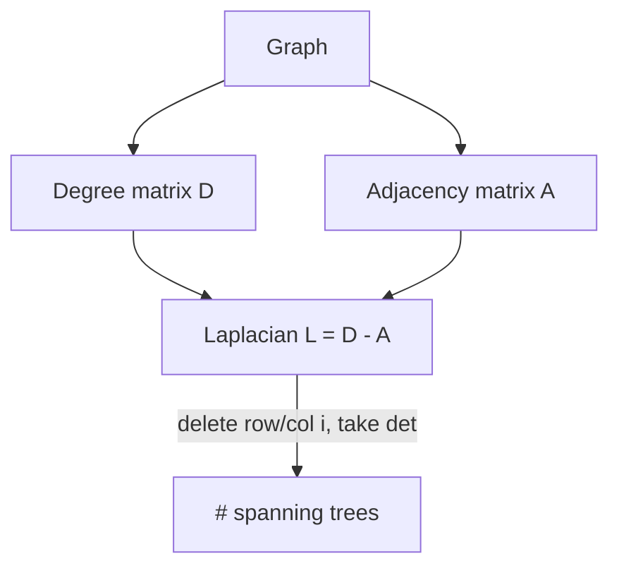

# Matrix Determinant — Middle Level

> **Focus:** the three production-grade determinant algorithms — float elimination (product of pivots, swap signs), exact determinant over a finite field `Z/pZ` (modular-inverse pivots), and the **Bareiss** fraction-free algorithm for exact integer determinants — plus the algebraic properties (`det(AB)=det(A)det(B)`, `det=0` ⇔ singular, multilinearity) that make them work and the matrix-tree connection.

---

## Table of Contents

1. [Introduction](#introduction)
2. [Deeper Concepts](#deeper-concepts)
3. [Comparison with Alternatives](#comparison-with-alternatives)
4. [Advanced Patterns](#advanced-patterns)
5. [Determinant Properties](#determinant-properties)
6. [The Matrix-Tree Connection](#the-matrix-tree-connection)
7. [Code Examples](#code-examples)
8. [Error Handling](#error-handling)
9. [Performance Analysis](#performance-analysis)
10. [Best Practices](#best-practices)
11. [Visual Animation](#visual-animation)
12. [Summary](#summary)

---

## Introduction

At junior level the message was a single algorithm: reduce to triangular, multiply the pivots, flip the sign on swaps. At middle level you make the engineering decision that actually matters in practice:

- **Which number system?** Floats are fast but inexact; `Z/pZ` is exact and keeps numbers small; exact integers risk fraction blow-up and overflow.
- **How do you eliminate without fractions over the integers?** Plain elimination computes `m[r][k] -= (m[r][c]/m[c][c]) * m[c][k]`, and that division produces fractions. The **Bareiss algorithm** rewrites the update so every intermediate value stays an *exact integer* — and, remarkably, equals the determinant of a sub-block.
- **What if the pivot is zero?** Over a field you swap (and flip the sign); if no nonzero pivot exists in the column, the matrix is singular and `det = 0`.
- **Why is `det(AB) = det(A)·det(B)`, and why does it matter for the algorithm?** This single multiplicative law underlies why elimination (a sequence of multiplications by elementary matrices) computes the determinant correctly.

These are the questions that separate "I can write the float version" from "I know which determinant algorithm is correct for the data and constraints in front of me."

---

## Deeper Concepts

### The elimination determinant, restated

Gaussian elimination factors `A` (after row swaps recorded by a permutation `P`) as `P·A = L·U`, where `L` is lower-triangular with `1`s on the diagonal and `U` is upper-triangular. Then:

```
det(A) = det(P)^{-1} · det(L) · det(U) = (-1)^{#swaps} · 1 · ∏ U[i][i]
```

because `det(L) = 1` (unit diagonal), `det(U)` is its diagonal product, and `det(P) = (-1)^{#swaps}`. This is the formal statement of "product of pivots, sign from swaps". The pivots **are** the diagonal entries of `U`. (See sibling `17-gaussian-elimination` for the LU factorization itself.)

### Over the reals (float): fast but inexact

The float method from `junior.md` is `O(n^3)` and uses **partial pivoting** (swap in the largest-magnitude pivot) for numerical stability. Two caveats:

- The result has rounding error, so a true `det = 0` can come out as `1e-14`, and a huge-magnitude determinant can lose precision.
- The *magnitude* of the determinant is a poor singularity test; a well-conditioned matrix can have a tiny determinant just from scaling. For "is this invertible *and* well-conditioned" use the condition number, not `|det|`.

Use floats when the inputs are real-valued (geometry, physics) and approximate answers are acceptable.

### Over a finite field `Z/pZ`: exact and bounded

If the entries are integers and you only need the determinant **modulo a prime `p`** (or the true value is known to fit and you reconstruct via CRT across several primes), run the *same* elimination but in `Z/pZ`:

- Every entry stays in `[0, p)`, so there is **no overflow and no rounding** — the answer is exact mod `p`.
- "Dividing by the pivot" means multiplying by its **modular inverse** `pivot^{-1} mod p` (sibling `06-extended-euclidean-modular-inverse`). Because `p` is prime, every nonzero pivot is invertible.
- Pivoting only needs *any* nonzero entry in the column (magnitude is meaningless mod `p`); if none exists, `det ≡ 0 (mod p)`.

This is the workhorse for competitive programming and exact integer determinants of large matrices: run mod several primes and CRT-combine.

### Over the integers exactly: the Bareiss algorithm

Suppose you need the **exact integer** determinant (not mod anything). Plain elimination divides by pivots and produces fractions; clearing denominators makes the numbers explode (Hadamard's bound: the determinant can have `Θ(n log n + n log(max|entry|))` digits, but intermediate fractions can be far worse). The **Bareiss algorithm** performs *fraction-free* elimination:

```
m[r][c]_new = ( m[r][c] * pivot − m[r][pivCol] * m[pivRow][c] ) / prevPivot
```

The magic is that this division is **always exact** (the numerator is divisible by `prevPivot`), and every intermediate `m[r][c]` after step `k` equals the determinant of a `(k+1)×(k+1)` minor of the original matrix — hence an integer, bounded by Hadamard's inequality. No fractions ever appear, the numbers stay as small as the theory allows, and the final bottom-right entry is `det(A)` exactly. The correctness (Sylvester's identity) is proved in [`professional.md`](./professional.md). Cost is still `O(n^3)` arithmetic operations (each on big integers if the values are large).

### Choosing among the three

| Need | Method |
|------|--------|
| Real inputs, approximate answer ok | float elimination + partial pivoting |
| Exact answer mod a prime `p` | elimination over `Z/pZ` (modular-inverse pivots) |
| Exact integer answer, moderate `n` | Bareiss (fraction-free) |
| Exact integer answer, large values | mod several primes + CRT, or Bareiss with big integers |

---

## Comparison with Alternatives

### Cofactor expansion vs elimination

| Approach | Time | Exact? | Good when |
|----------|------|--------|-----------|
| Cofactor / Laplace expansion | `O(n!)` | yes (exact arithmetic) | `n ≤ 8`, or as a test oracle |
| Float Gaussian elimination | `O(n^3)` | no (rounding) | real inputs, approximate |
| `Z/pZ` elimination | `O(n^3)` | yes (mod `p`) | exact-and-bounded; CRT for true value |
| Bareiss | `O(n^3)` ops | yes (integers) | exact integer, no modulus |

Concrete operation counts (`n = 20`):

| Method | Rough op count |
|--------|----------------|
| Cofactor expansion | `20! ≈ 2.4 × 10^18` (infeasible) |
| Gaussian elimination | `~20^3 / 3 ≈ 2700` (instant) |

The gap is the entire reason elimination is the only practical method beyond tiny `n`.

### Float vs mod-`p` vs Bareiss for exact integer determinants

| Method | Overflow risk | Rounding | Recover exact value |
|--------|---------------|----------|---------------------|
| Float | none, but precision loss | yes | no (only approximate) |
| `Z/pZ` (single prime) | none (bounded by `p`) | none | only mod `p` |
| `Z/pZ` + CRT (several primes) | none per prime | none | yes (if value < `∏ pᵢ`) |
| Bareiss | grows with `n` (use big ints) | none | yes (directly) |

For exact integer determinants, the two production choices are **CRT over several primes** (each run is cheap, embarrassingly parallel) and **Bareiss with big integers** (one run, no reconstruction). CRT wins when you can bound the answer's size (Hadamard) and want fixed-width arithmetic; Bareiss wins when you want a single direct computation.

---

## Advanced Patterns

### Pattern: Determinant over `Z/pZ` (modular inverse pivots)

Run elimination in the finite field. Pivoting needs only a nonzero entry; division is multiplication by the modular inverse.

#### Go

```go
package main

import "fmt"

const MOD = 1_000_000_007

// modular exponentiation for the inverse (Fermat: a^{p-2} mod p).
func power(a, e, mod int64) int64 {
	res := int64(1)
	a %= mod
	for e > 0 {
		if e&1 == 1 {
			res = res * a % mod
		}
		a = a * a % mod
		e >>= 1
	}
	return res
}

func inv(a, mod int64) int64 { return power(a, mod-2, mod) }

func detModP(a [][]int64, mod int64) int64 {
	n := len(a)
	m := make([][]int64, n)
	for i := range m {
		m[i] = make([]int64, n)
		for j := range m[i] {
			m[i][j] = ((a[i][j] % mod) + mod) % mod
		}
	}
	det := int64(1)
	for c := 0; c < n; c++ {
		piv := -1
		for r := c; r < n; r++ {
			if m[r][c] != 0 {
				piv = r
				break
			}
		}
		if piv == -1 {
			return 0 // singular mod p
		}
		if piv != c {
			m[c], m[piv] = m[piv], m[c]
			det = (mod - det) % mod // flip sign mod p
		}
		det = det * m[c][c] % mod
		invPiv := inv(m[c][c], mod)
		for r := c + 1; r < n; r++ {
			factor := m[r][c] * invPiv % mod
			for k := c; k < n; k++ {
				m[r][k] = (m[r][k] - factor*m[c][k]%mod + mod) % mod
			}
		}
	}
	return det
}

func main() {
	A := [][]int64{{2, 1, 1}, {4, 3, 3}, {8, 7, 9}}
	fmt.Println(detModP(A, MOD)) // 4
}
```

#### Java

```java
public class DetModP {
    static long power(long a, long e, long mod) {
        long res = 1; a %= mod;
        while (e > 0) {
            if ((e & 1) == 1) res = res * a % mod;
            a = a * a % mod;
            e >>= 1;
        }
        return res;
    }

    static long inv(long a, long mod) { return power(a, mod - 2, mod); }

    static long detModP(long[][] a, long mod) {
        int n = a.length;
        long[][] m = new long[n][n];
        for (int i = 0; i < n; i++)
            for (int j = 0; j < n; j++)
                m[i][j] = ((a[i][j] % mod) + mod) % mod;
        long det = 1;
        for (int c = 0; c < n; c++) {
            int piv = -1;
            for (int r = c; r < n; r++) if (m[r][c] != 0) { piv = r; break; }
            if (piv == -1) return 0;
            if (piv != c) {
                long[] tmp = m[c]; m[c] = m[piv]; m[piv] = tmp;
                det = (mod - det) % mod;
            }
            det = det * m[c][c] % mod;
            long invPiv = inv(m[c][c], mod);
            for (int r = c + 1; r < n; r++) {
                long factor = m[r][c] * invPiv % mod;
                for (int k = c; k < n; k++)
                    m[r][k] = (m[r][k] - factor * m[c][k] % mod + mod) % mod;
            }
        }
        return det;
    }

    public static void main(String[] args) {
        long[][] A = {{2, 1, 1}, {4, 3, 3}, {8, 7, 9}};
        System.out.println(detModP(A, 1_000_000_007L)); // 4
    }
}
```

#### Python

```python
MOD = 1_000_000_007


def det_mod_p(a, mod=MOD):
    n = len(a)
    m = [[x % mod for x in row] for row in a]
    det = 1
    for c in range(n):
        piv = next((r for r in range(c, n) if m[r][c] != 0), -1)
        if piv == -1:
            return 0  # singular mod p
        if piv != c:
            m[c], m[piv] = m[piv], m[c]
            det = (-det) % mod
        det = det * m[c][c] % mod
        inv_piv = pow(m[c][c], mod - 2, mod)  # Fermat inverse
        for r in range(c + 1, n):
            factor = m[r][c] * inv_piv % mod
            if factor:
                row_c, row_r = m[c], m[r]
                for k in range(c, n):
                    row_r[k] = (row_r[k] - factor * row_c[k]) % mod
    return det


if __name__ == "__main__":
    A = [[2, 1, 1], [4, 3, 3], [8, 7, 9]]
    print(det_mod_p(A))  # 4
```

### Pattern: Bareiss fraction-free integer determinant

Every update divides exactly by the previous pivot; all intermediates stay integers.

#### Go

```go
package main

import "fmt"

func detBareiss(a [][]int64) int64 {
	n := len(a)
	m := make([][]int64, n)
	for i := range m {
		m[i] = append([]int64(nil), a[i]...)
	}
	sign := int64(1)
	prev := int64(1)
	for c := 0; c < n; c++ {
		if m[c][c] == 0 { // need a nonzero pivot
			sw := -1
			for r := c + 1; r < n; r++ {
				if m[r][c] != 0 {
					sw = r
					break
				}
			}
			if sw == -1 {
				return 0 // singular
			}
			m[c], m[sw] = m[sw], m[c]
			sign = -sign
		}
		for r := c + 1; r < n; r++ {
			for k := c + 1; k < n; k++ {
				// exact integer division by prev
				m[r][k] = (m[r][k]*m[c][c] - m[r][c]*m[c][k]) / prev
			}
			m[r][c] = 0
		}
		prev = m[c][c]
	}
	return sign * m[n-1][n-1]
}

func main() {
	A := [][]int64{{2, 1, 1}, {4, 3, 3}, {8, 7, 9}}
	fmt.Println(detBareiss(A)) // 4
}
```

#### Java

```java
public class DetBareiss {
    static long detBareiss(long[][] a) {
        int n = a.length;
        long[][] m = new long[n][n];
        for (int i = 0; i < n; i++) m[i] = a[i].clone();
        long sign = 1, prev = 1;
        for (int c = 0; c < n; c++) {
            if (m[c][c] == 0) {
                int sw = -1;
                for (int r = c + 1; r < n; r++) if (m[r][c] != 0) { sw = r; break; }
                if (sw == -1) return 0;
                long[] tmp = m[c]; m[c] = m[sw]; m[sw] = tmp;
                sign = -sign;
            }
            for (int r = c + 1; r < n; r++) {
                for (int k = c + 1; k < n; k++)
                    m[r][k] = (m[r][k] * m[c][c] - m[r][c] * m[c][k]) / prev;
                m[r][c] = 0;
            }
            prev = m[c][c];
        }
        return sign * m[n - 1][n - 1];
    }

    public static void main(String[] args) {
        long[][] A = {{2, 1, 1}, {4, 3, 3}, {8, 7, 9}};
        System.out.println(detBareiss(A)); // 4
    }
}
```

#### Python

```python
def det_bareiss(a):
    n = len(a)
    m = [row[:] for row in a]
    sign = 1
    prev = 1
    for c in range(n):
        if m[c][c] == 0:
            sw = next((r for r in range(c + 1, n) if m[r][c] != 0), -1)
            if sw == -1:
                return 0  # singular
            m[c], m[sw] = m[sw], m[c]
            sign = -sign
        for r in range(c + 1, n):
            for k in range(c + 1, n):
                # exact integer division by the previous pivot
                m[r][k] = (m[r][k] * m[c][c] - m[r][c] * m[c][k]) // prev
            m[r][c] = 0
        prev = m[c][c]
    return sign * m[n - 1][n - 1]


if __name__ == "__main__":
    A = [[2, 1, 1], [4, 3, 3], [8, 7, 9]]
    print(det_bareiss(A))  # 4
```

Python's `//` and Go/Java's integer `/` are exact here because the numerator is provably divisible by `prev`; in Python use big integers (automatic) for large values.

---

## Determinant Properties

These properties are not trivia — each one is a correctness tool you use to test or shortcut a computation.

| Property | Statement | Use |
|----------|-----------|-----|
| **Triangular** | `det` of a triangular matrix = product of diagonal | the whole elimination method |
| **Row swap** | swapping two rows negates `det` | sign bookkeeping |
| **Row add** | adding a multiple of one row to another leaves `det` unchanged | why elimination is valid |
| **Row scale** | scaling a row by `c` scales `det` by `c` | normalizing pivots |
| **Multilinear** | `det` is linear in each row separately | proofs; splitting a matrix |
| **Multiplicative** | `det(AB) = det(A)·det(B)` | compose transforms; `det(A^{-1}) = 1/det(A)` |
| **Transpose** | `det(Aᵀ) = det(A)` | column ops are as valid as row ops |
| **Singular** | `det(A) = 0` ⇔ `A` singular ⇔ rows dependent | invertibility test |
| **Scalar** | `det(cA) = c^n · det(A)` for `n×n` | scaling whole matrix |

**Crucial non-property:** `det(A + B) ≠ det(A) + det(B)` in general. The determinant is multilinear in *rows*, not additive across whole matrices. This is a frequent source of bugs in hand derivations.

The multiplicative law `det(AB) = det(A)·det(B)` deserves emphasis: it implies `det(A^{-1}) = 1/det(A)`, `det(A^k) = det(A)^k`, and that elimination (multiplying by elementary matrices) computes `det` correctly — because each elementary operation has a known determinant and they multiply together.

---

## The Matrix-Tree Connection

A striking application: **Kirchhoff's matrix-tree theorem** counts the number of spanning trees of a graph as a determinant.

Build the **Laplacian** `L = D − A`, where `D` is the diagonal degree matrix and `A` is the adjacency matrix. The theorem states:

> The number of spanning trees of a connected graph equals **any cofactor** of `L` — equivalently, delete any one row and the corresponding column from `L` and take the determinant of the remaining `(n−1)×(n−1)` matrix.



So counting spanning trees — a combinatorics problem — reduces to a single `O(n^3)` determinant. For exact counts you use the integer/Bareiss or mod-`p` determinant. This is the bridge from "determinant as a number" to "determinant as a counting tool", developed formally in `professional.md` and exercised in `interview.md` and `tasks.md`. (For weighted graphs, `A` carries edge weights and the determinant counts weighted spanning trees.)

---

## Code Examples

### Reusable: determinant by elimination over a chosen arithmetic

The same skeleton serves float and mod-`p`; only the "divide by pivot" step and the zero test change. Here is the float version factored cleanly.

#### Python

```python
def det_float(a, eps=1e-12):
    n = len(a)
    m = [row[:] for row in a]
    det = 1.0
    for c in range(n):
        piv = max(range(c, n), key=lambda r: abs(m[r][c]))
        if abs(m[piv][c]) < eps:
            return 0.0
        if piv != c:
            m[c], m[piv] = m[piv], m[c]
            det = -det
        det *= m[c][c]
        for r in range(c + 1, n):
            f = m[r][c] / m[c][c]
            for k in range(c, n):
                m[r][k] -= f * m[c][k]
    return det
```

To switch to mod `p`: replace `abs(...) < eps` with `== 0`, the float divide with multiply-by-inverse, and reduce mod `p` after every operation (see the pattern above). To switch to exact integers: use Bareiss.

---

## Error Handling

| Scenario | What goes wrong | Correct approach |
|----------|-----------------|------------------|
| Fraction blow-up in integer elimination | Plain division creates huge fractions. | Use Bareiss (fraction-free) or mod `p`. |
| Overflow mod `p` | `factor * m[c][k]` overflows before reduction. | Use 64-bit, reduce after each multiply. |
| Negative result mod `p` | Subtraction can go negative. | Normalize with `(x % p + p) % p`. |
| Float "0" vs true singular | Rounding leaves a tiny pivot. | Exact methods (mod `p`/Bareiss) eliminate ambiguity. |
| Zero pivot but matrix not singular | Did not pivot (swap) before declaring singular. | Search the whole column for a nonzero entry first. |
| Bareiss divides by zero `prev` | First pivot is `0` and not swapped. | Swap a nonzero pivot to the top before the update. |
| Wrong sign | Forgot the swap-sign flip (or flipped it mod `p` incorrectly). | `det = (mod - det) % mod` for mod `p`; `sign = -sign` otherwise. |

---

## Performance Analysis

| `n` | Elimination `O(n^3)` ops | Cofactor `O(n!)` ops | Verdict |
|-----|--------------------------|----------------------|---------|
| 5 | ~125 | 120 | comparable |
| 10 | ~1000 | 3.6 M | elimination wins |
| 20 | ~8000 | 2.4 × 10^18 | cofactor infeasible |
| 100 | ~10^6 | astronomically large | only elimination |
| 1000 | ~10^9 | — | elimination, seconds |

The dominant cost is the triple-nested elimination loop, `~n^3/3` field operations. For **mod `p`**, each operation is `O(1)` (fixed-width), so the whole thing is `O(n^3)`. For **Bareiss with big integers**, each operation is a big-integer multiply/divide whose cost grows with the number of digits (up to Hadamard's bound), so the true cost is `O(n^3 · M(d))` where `d` is the digit length and `M` is the multiplication cost — but no fractions ever appear, which is the whole point.

```python
import time

def benchmark(n):
    import random
    A = [[random.randint(0, 5) for _ in range(n)] for _ in range(n)]
    start = time.perf_counter()
    det_mod_p(A)        # bounded, fast
    return time.perf_counter() - start

# Typical: n=200 det mod p runs well under a second in CPython.
```

The single biggest win for exact work is choosing mod `p` (bounded arithmetic) over big-integer Bareiss when you can afford CRT reconstruction; the single biggest correctness win for floats is partial pivoting.

---

## Best Practices

- **Pick arithmetic by requirement:** float (approximate), `Z/pZ` (exact-bounded), Bareiss (exact-integer). Never use floats when an exact answer is required.
- **Always pivot:** partial pivoting for floats (stability), any-nonzero pivot for `Z/pZ`/Bareiss (correctness). No pivot in the column ⇒ singular ⇒ `det = 0`.
- **Track the swap sign in one place** and flip it consistently (`-sign`, or `(mod - det) % mod` in modular code).
- **Divide by modular inverse, never integer-divide, in `Z/pZ`.**
- **Use big integers for Bareiss** when values can grow (Hadamard bound), or switch to CRT over primes.
- **Test against the cofactor oracle** on random small matrices, and cross-check `det(A)·det(B) == det(AB)` and `det(Aᵀ) == det(A)`.
- **Reuse one working matrix**; elimination is destructive, so copy the input once.

---

## Visual Animation

> See [`animation.html`](./animation.html) for an interactive view.
>
> The middle-level animation highlights:
> - Column-by-column elimination to upper-triangular form on an editable matrix.
> - The current pivot, the multiplier used, and the row being updated.
> - The running sign flipping on each row swap, and the running product of pivots.
> - The final read-off `det = sign × product-of-pivots`.

---

## Summary

There are three production determinant algorithms, all `O(n^3)`, differing only in arithmetic. **Float elimination** with partial pivoting is fast but inexact — fine for geometry, unreliable as a strict singularity test. **`Z/pZ` elimination** is exact mod a prime: pivots use modular inverses, numbers stay bounded, and CRT across several primes recovers a large exact value. **Bareiss** is fraction-free elimination whose every intermediate is an exact integer (a minor's determinant), giving the exact integer answer without fractions or overflow blow-up. The properties — triangular = diagonal product, swaps negate, row-adds preserve, `det(AB)=det(A)det(B)`, `det=0` ⇔ singular — are both the justification for the algorithm and the tests you use to trust it. And via **Kirchhoff's matrix-tree theorem**, a determinant of the graph Laplacian counts spanning trees, turning a combinatorics problem into one `O(n^3)` determinant. Choose the arithmetic to match the requirement, always pivot, and track the swap sign.
