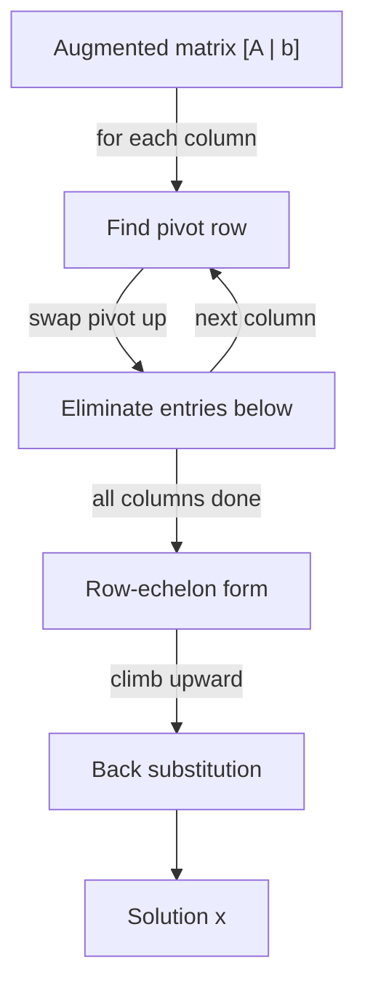

# Gaussian Elimination (Solving Linear Systems) — Junior Level

> **One-line summary:** Gaussian elimination solves a system of linear equations `A·x = b` by using **row operations** to transform the augmented matrix `[A | b]` into a triangular (row-echelon) shape, after which the unknowns drop out one by one via **back substitution**. The same procedure also computes determinants, ranks, and matrix inverses.

---

## Table of Contents

1. [Introduction](#introduction)
2. [Prerequisites](#prerequisites)
3. [Glossary](#glossary)
4. [Core Concepts](#core-concepts)
5. [Big-O Summary](#big-o-summary)
6. [Real-World Analogies](#real-world-analogies)
7. [Pros & Cons](#pros--cons)
8. [Step-by-Step Walkthrough](#step-by-step-walkthrough)
9. [Code Examples](#code-examples)
10. [Coding Patterns](#coding-patterns)
11. [Error Handling](#error-handling)
12. [Performance Tips](#performance-tips)
13. [Best Practices](#best-practices)
14. [Edge Cases & Pitfalls](#edge-cases--pitfalls)
15. [Common Mistakes](#common-mistakes)
16. [Cheat Sheet](#cheat-sheet)
17. [Visual Animation](#visual-animation)
18. [Summary](#summary)
19. [Further Reading](#further-reading)

---

## Introduction

Suppose you are given three equations in three unknowns:

```
2x + 1y - 1z =  8
-3x - 1y + 2z = -11
-2x + 1y + 2z = -3
```

You learned in school to solve such a system by "eliminating" one variable at a time: multiply an equation by a constant, subtract it from another, and watch a variable disappear. **Gaussian elimination** is exactly that schoolbook recipe, written down precisely enough that a computer can follow it for any number of equations.

The trick is to stop writing the variable names. Pack the coefficients into a grid (a **matrix**) and glue the right-hand side on as one extra column — the **augmented matrix**:

```
[  2   1  -1 |   8 ]
[ -3  -1   2 | -11 ]
[ -2   1   2 |  -3 ]
```

Now the whole method is a sequence of mechanical **row operations** that never change the solution: swap two rows, scale a row, or add a multiple of one row to another. The goal is to reach an upper-triangular shape (**row-echelon form**), where the last equation has a single unknown, the second-to-last has two, and so on:

```
[  2   1  -1 |  8 ]
[  0  ...     ... ]   <- zeros appear below the diagonal
[  0   0  ... ... ]
```

Once triangular, you read off the bottom variable directly, plug it into the row above, and climb back up. This climb is called **back substitution**. The forward "make it triangular" pass plus the backward "read off the answers" pass is the entire algorithm.

This one procedure is astonishingly central. It is how you:

- **solve** `A·x = b` for the unknown vector `x`,
- compute a **determinant** (sibling `18-matrix-determinant`) as the product of the diagonal pivots,
- compute the **rank** of a matrix (sibling `19-matrix-rank`) by counting non-zero pivot rows,
- detect **no solution** or **infinitely many solutions**,
- and, with a small twist, solve systems **modulo a prime** (using the modular inverse from siblings `02-modular-arithmetic` and `06-extended-euclidean-modular-inverse`) or over **GF(2)** (the XOR world) blazingly fast with bitsets.

At junior level we focus on the procedure itself: row reduction, the role of the **pivot**, back substitution, and a worked `3×3` example by hand. The numerical subtleties (why we reorder rows for stability) and the modular variants are previewed here and developed in the higher levels.

---

## Prerequisites

Before reading this file you should be comfortable with:

- **Systems of linear equations** — what `A·x = b` means: `A` is the coefficient matrix, `x` the unknowns, `b` the right-hand side.
- **Matrix and vector basics** — rows, columns, an `n × n` matrix, an `n`-vector.
- **2D arrays / nested loops** — every step here is a loop over rows and columns of a grid.
- **Basic arithmetic with fractions / floating point** — division by a pivot produces fractions; on a computer that usually means `double`.
- **Big-O notation** — we will say the cost is `O(n³)`.

Optional but helpful:

- A glance at **modular inverse** (`a⁻¹ mod p`) from sibling `06-extended-euclidean-modular-inverse`, since the mod-`p` variant divides by pivots using it.
- The idea of **XOR** as "addition without carries", which is the GF(2) variant.

---

## Glossary

| Term | Meaning |
|------|---------|
| **Linear system** | A set of equations `A·x = b`, all unknowns appearing to the first power only. |
| **Augmented matrix `[A | b]`** | The coefficient matrix `A` with the right-hand side `b` glued on as a final column. |
| **Row operation** | One of: (1) swap two rows, (2) multiply a row by a non-zero constant, (3) add a multiple of one row to another. None change the solution set. |
| **Pivot** | The leading non-zero entry of a row used to eliminate the entries below (and, in RREF, above) it in its column. |
| **Forward elimination** | The pass that introduces zeros below the diagonal, producing row-echelon form. |
| **Row-echelon form (REF)** | Upper-triangular shape: each pivot is to the right of the pivot in the row above; all entries below a pivot are zero. |
| **Reduced row-echelon form (RREF)** | REF where each pivot is `1` and is the *only* non-zero entry in its column. |
| **Back substitution** | The backward pass that solves for unknowns from the last pivot row upward. |
| **Partial pivoting** | Before eliminating a column, swap in the row whose entry in that column has the largest magnitude — for numerical stability. |
| **Free variable** | An unknown with no pivot in its column; it can take any value, giving infinitely many solutions. |
| **Rank** | The number of pivots (non-zero rows in echelon form) = number of independent equations. |
| **GF(2)** | The two-element field `{0,1}` where addition is XOR and multiplication is AND. |

---

## Core Concepts

### 1. The Augmented Matrix

Writing variable names over and over is wasteful. Drop them. The system `A·x = b` becomes the grid `[A | b]`: `n` rows (one per equation), `n` coefficient columns, and one final column for `b`. Every operation we perform acts on whole rows of this grid.

```
2x + y - z = 8        [  2   1  -1 |  8 ]
... etc.        →     [ -3  -1   2 | -11]
                      [ -2   1   2 | -3 ]
```

### 2. Row Operations Preserve the Solution

Three operations are allowed, and crucially **none of them change the set of solutions**:

1. **Swap** two rows (reorder the equations).
2. **Scale** a row by a non-zero constant (multiply an equation through).
3. **Add** a multiple of one row to another (`Rᵢ ← Rᵢ + c·Rⱼ`).

Operation 3 is the workhorse. If row `j` says `2x + y = 8`, adding `1.5×` it to another row cancels that row's `x` term. This is "elimination". The proof that the solution set is unchanged is in [`professional.md`](./professional.md); for now, trust that legal row operations never lie.

### 3. Forward Elimination → Row-Echelon Form

We process columns left to right. For column `c`:

- Pick a **pivot** — a row whose entry in column `c` is non-zero (and, with partial pivoting, the *largest* in magnitude). Move it into the pivot position.
- For every row **below** the pivot, subtract a multiple of the pivot row so that its column-`c` entry becomes `0`.

After sweeping all columns, the matrix is **upper triangular** (row-echelon form): everything below the diagonal is zero.

```
[ 2   1  -1 |  8 ]
[ 0   ?   ? |  ? ]
[ 0   0   ? |  ? ]   <- the last row now involves only z
```

### 4. Back Substitution

The last pivot row is one equation in one unknown — solve it. Substitute that value into the row above (now one unknown), solve, and climb upward until all unknowns are known. This is `O(n²)` work, cheap compared to the `O(n³)` elimination.

### 5. The Pivot Must Be Non-Zero (Pivoting Intuition)

You cannot eliminate using a pivot of `0` (you would divide by zero). If the natural pivot is `0`, **swap** in a lower row that has a non-zero entry in that column. Even when the pivot is *technically* non-zero but *tiny*, dividing by it on a computer amplifies rounding error. **Partial pivoting** — always swapping in the row with the largest-magnitude entry — fixes both the zero case and the stability case at once. (Details in [`middle.md`](./middle.md) and [`senior.md`](./senior.md).)

### 6. Reduced Row-Echelon Form (RREF)

If you continue past REF — scale each pivot to `1` and also zero out the entries *above* each pivot — you reach **reduced row-echelon form**. In RREF the solution is read off directly with no back substitution; the augmented column simply *is* `x`. RREF is also how Gauss-Jordan elimination computes a matrix inverse.

### 7. Three Outcomes: Unique, None, or Infinitely Many

After elimination, look at the pivots:

- **Every column has a pivot** → unique solution.
- A row reads `0 0 … 0 | nonzero` (i.e. `0 = 5`) → **no solution** (inconsistent).
- A pivot is missing in some column but the system is consistent → **free variables** → infinitely many solutions.

This pivot-counting is exactly the **rank** test (sibling `19-matrix-rank`), formalized as the Rouché–Capelli theorem in [`professional.md`](./professional.md).

---

## Big-O Summary

| Operation | Time | Space | Notes |
|-----------|------|-------|-------|
| Forward elimination | **O(n³)** | O(n²) | Triple nested loop over rows/columns. |
| Back substitution | O(n²) | O(1) extra | Cheap second pass. |
| Full solve `A·x = b` | **O(n³)** | O(n²) | Dominated by elimination. |
| Determinant via elimination | O(n³) | O(n²) | Product of pivots (sibling `18`). |
| Rank via elimination | O(n³) | O(n²) | Count non-zero pivot rows (sibling `19`). |
| Matrix inverse (Gauss-Jordan) | O(n³) | O(n²) | Augment with identity, reduce to RREF. |
| GF(2) system with bitsets | **O(n³ / w)** | O(n² / w) | `w` = machine word (64); huge constant-factor win. |

The headline is **`O(n³)`** for a dense `n × n` system. Each of the `n` pivot columns eliminates `O(n)` rows, each touching `O(n)` columns — hence `n · n · n`.

---

## Real-World Analogies

| Concept | Analogy |
|---------|---------|
| Augmented matrix | A spreadsheet: each row an equation, last column the target totals. |
| Row operation (add multiple) | "Cancel out" a recurring charge by subtracting a scaled copy of another line item. |
| Pivot | The "lead" equation you use this round to knock out one variable everywhere else. |
| Forward elimination | Tidying a tangle of equations into a neat staircase, hardest variable last. |
| Back substitution | Solving from the most-constrained equation upward once the grid is staged. |
| Partial pivoting | Choosing the *strongest* equation (biggest coefficient) to divide by, so small rounding errors do not blow up. |
| Free variable | A dial left unset: the recipe works for any value you turn it to. |
| No solution | Two lines that are parallel — the equations contradict each other. |

Where the analogy breaks: a spreadsheet does not care about numerical stability, but a computer doing real arithmetic does — which is why pivoting matters once we leave exact integers.

---

## Pros & Cons

| Pros | Cons |
|------|------|
| Direct, exact procedure — solves any solvable system in a fixed `O(n³)`. | Cubic cost: slow for very large dense systems (thousands of unknowns). |
| One algorithm yields solve, determinant, rank, and inverse. | Naive (no pivoting) float version is numerically unstable. |
| Works over the reals, over `Z/pZ` (exact!), and over GF(2) (super fast with bitsets). | Float arithmetic accumulates rounding error; results are approximate. |
| Detects no-solution / infinite-solution cases cleanly via rank. | Dense storage `O(n²)`; wasteful for sparse systems (where iterative methods win). |
| Conceptually simple — just three row operations. | Pivoting and free-variable bookkeeping are easy to get subtly wrong. |

**When to use:** small-to-medium dense systems; exact rational/modular solving; GF(2) XOR systems (linear algebra over bits); whenever you also want rank or determinant.

**When NOT to use:** huge **sparse** systems (use iterative solvers like conjugate gradient), or when you only need an approximate solution to a well-conditioned least-squares problem (specialized factorizations may be better).

---

## Step-by-Step Walkthrough

Solve the system from the introduction:

```
[  2   1  -1 |  8 ]   (R0)
[ -3  -1   2 | -11]   (R1)
[ -2   1   2 | -3 ]   (R2)
```

**Column 0 — pivot is `R0`'s leading `2`.** Eliminate the `x` entries below it.

- `R1 ← R1 + (3/2)·R0`: `(-3 + 3) = 0`, `(-1 + 1.5) = 0.5`, `(2 - 1.5) = 0.5`, `(-11 + 12) = 1`.
- `R2 ← R2 + (1)·R0`: `(-2 + 2) = 0`, `(1 + 1) = 2`, `(2 - 1) = 1`, `(-3 + 8) = 5`.

```
[ 2   1   -1  |  8 ]
[ 0  0.5  0.5 |  1 ]
[ 0   2    1  |  5 ]
```

**Column 1 — pivot would be `R1`'s `0.5`, but `R2` has the larger `2`.** With **partial pivoting**, swap `R1` and `R2`:

```
[ 2   1    -1  |  8 ]
[ 0   2     1  |  5 ]   (was R2)
[ 0  0.5   0.5 |  1 ]   (was R1)
```

Eliminate below the pivot `2` in column 1:

- `R2 ← R2 - (0.5/2)·R1 = R2 - 0.25·R1`: `(0.5 - 0.5) = 0`, `(0.5 - 0.25) = 0.25`, `(1 - 1.25) = -0.25`.

```
[ 2   1    -1   |  8    ]
[ 0   2     1   |  5    ]
[ 0   0    0.25 | -0.25 ]
```

Now in **row-echelon form** (upper triangular).

**Back substitution.**

- Row 2: `0.25·z = -0.25` → `z = -1`.
- Row 1: `2y + z = 5` → `2y + (-1) = 5` → `y = 3`.
- Row 0: `2x + y - z = 8` → `2x + 3 - (-1) = 8` → `2x = 4` → `x = 2`.

**Solution: `x = 2, y = 3, z = -1`.** Plug back in to verify: `2(2) + 3 - (-1) = 4 + 3 + 1 = 8` ✓.

The forward pass made the staircase; back substitution climbed it.

---

## Code Examples

### Example: Solve a Real System with Partial Pivoting

Reads an `n × n` matrix and right-hand side, runs forward elimination with partial pivoting, then back-substitutes. Returns the solution vector.

#### Go

```go
package main

import (
	"fmt"
	"math"
)

// solve solves A·x = b for an n×n system using Gaussian elimination
// with partial pivoting. Returns (x, true) on success, (nil, false) if singular.
func solve(A [][]float64, b []float64) ([]float64, bool) {
	n := len(A)
	// Build the augmented matrix [A | b].
	m := make([][]float64, n)
	for i := 0; i < n; i++ {
		m[i] = make([]float64, n+1)
		copy(m[i], A[i])
		m[i][n] = b[i]
	}

	// Forward elimination with partial pivoting.
	for col := 0; col < n; col++ {
		// Find the row with the largest |value| in this column.
		pivot := col
		for r := col + 1; r < n; r++ {
			if math.Abs(m[r][col]) > math.Abs(m[pivot][col]) {
				pivot = r
			}
		}
		if math.Abs(m[pivot][col]) < 1e-12 {
			return nil, false // singular / no unique solution
		}
		m[col], m[pivot] = m[pivot], m[col] // swap pivot row up

		// Eliminate entries below the pivot.
		for r := col + 1; r < n; r++ {
			factor := m[r][col] / m[col][col]
			for c := col; c <= n; c++ {
				m[r][c] -= factor * m[col][c]
			}
		}
	}

	// Back substitution.
	x := make([]float64, n)
	for i := n - 1; i >= 0; i-- {
		sum := m[i][n]
		for c := i + 1; c < n; c++ {
			sum -= m[i][c] * x[c]
		}
		x[i] = sum / m[i][i]
	}
	return x, true
}

func main() {
	A := [][]float64{{2, 1, -1}, {-3, -1, 2}, {-2, 1, 2}}
	b := []float64{8, -11, -3}
	x, ok := solve(A, b)
	fmt.Println(ok, x) // true [2 3 -1]
}
```

#### Java

```java
public class GaussSolve {
    // Solves A·x = b with partial pivoting. Returns null if singular.
    static double[] solve(double[][] A, double[] b) {
        int n = A.length;
        double[][] m = new double[n][n + 1];
        for (int i = 0; i < n; i++) {
            System.arraycopy(A[i], 0, m[i], 0, n);
            m[i][n] = b[i];
        }

        for (int col = 0; col < n; col++) {
            int pivot = col;
            for (int r = col + 1; r < n; r++)
                if (Math.abs(m[r][col]) > Math.abs(m[pivot][col])) pivot = r;
            if (Math.abs(m[pivot][col]) < 1e-12) return null; // singular
            double[] tmp = m[col]; m[col] = m[pivot]; m[pivot] = tmp;

            for (int r = col + 1; r < n; r++) {
                double factor = m[r][col] / m[col][col];
                for (int c = col; c <= n; c++)
                    m[r][c] -= factor * m[col][c];
            }
        }

        double[] x = new double[n];
        for (int i = n - 1; i >= 0; i--) {
            double sum = m[i][n];
            for (int c = i + 1; c < n; c++) sum -= m[i][c] * x[c];
            x[i] = sum / m[i][i];
        }
        return x;
    }

    public static void main(String[] args) {
        double[][] A = {{2, 1, -1}, {-3, -1, 2}, {-2, 1, 2}};
        double[] b = {8, -11, -3};
        double[] x = solve(A, b);
        System.out.println(java.util.Arrays.toString(x)); // [2.0, 3.0, -1.0]
    }
}
```

#### Python

```python
def solve(A, b):
    """Solve A·x = b with partial pivoting. Returns None if singular."""
    n = len(A)
    # Augmented matrix [A | b].
    m = [list(map(float, A[i])) + [float(b[i])] for i in range(n)]

    for col in range(n):
        # Partial pivot: largest magnitude in this column.
        pivot = max(range(col, n), key=lambda r: abs(m[r][col]))
        if abs(m[pivot][col]) < 1e-12:
            return None  # singular / no unique solution
        m[col], m[pivot] = m[pivot], m[col]

        # Eliminate below.
        for r in range(col + 1, n):
            factor = m[r][col] / m[col][col]
            for c in range(col, n + 1):
                m[r][c] -= factor * m[col][c]

    # Back substitution.
    x = [0.0] * n
    for i in range(n - 1, -1, -1):
        s = m[i][n] - sum(m[i][c] * x[c] for c in range(i + 1, n))
        x[i] = s / m[i][i]
    return x


if __name__ == "__main__":
    A = [[2, 1, -1], [-3, -1, 2], [-2, 1, 2]]
    b = [8, -11, -3]
    print(solve(A, b))  # [2.0, 3.0, -1.0]
```

**What it does:** builds `[A | b]`, eliminates column by column (always pivoting on the largest entry), then back-substitutes. Output matches the hand calculation: `x = 2, y = 3, z = -1`.
**Run:** `go run main.go` | `javac GaussSolve.java && java GaussSolve` | `python solve.py`

---

## Coding Patterns

### Pattern 1: Augment, Eliminate, Back-Substitute

**Intent:** Every Gaussian-elimination solve follows the same three-beat skeleton. Memorize it.

```python
# 1. Augment: m = [A | b]
# 2. Forward eliminate column by column, pivoting to a non-zero (ideally largest) entry
# 3. Back substitute from the last pivot row upward
```

### Pattern 2: Verify by Plugging Back In (the oracle)

**Intent:** Before trusting a solver, recompute `A·x` and check it equals `b` (within a tolerance for floats).

```python
def residual(A, x, b):
    n = len(A)
    return max(abs(sum(A[i][j] * x[j] for j in range(n)) - b[i]) for i in range(n))
# residual should be ~0 (e.g. < 1e-9) for a correct float solution.
```

### Pattern 3: Pivot-Search Helper

**Intent:** Isolate the "find the best pivot row" logic so the main loop stays readable.



---

## Error Handling

| Error | Cause | Fix |
|-------|-------|-----|
| Division by zero | Pivot is `0` (no pivoting). | Swap in a row with a non-zero entry in that column; if none, the system is singular. |
| `NaN` / `Inf` in result | Divided by a near-zero pivot. | Use partial pivoting; treat `|pivot| < eps` as singular. |
| Wildly inaccurate answer | Naive elimination amplified rounding. | Partial (or full) pivoting; check the residual `A·x - b`. |
| Wrong "no solution" verdict | Compared a float to exact `0`. | Use a tolerance `eps`, not `== 0`, for float ranks. |
| Index out of bounds | Forgot the augmented `+1` column. | Loop columns `col … n` inclusive (the `b` column is index `n`). |
| Modular result negative | `%` returned negative in Go/Java. | Normalize: `((x % p) + p) % p` in the mod-`p` variant. |

---

## Performance Tips

- **Eliminate only from `col` rightward** — entries to the left of the pivot are already zero; do not waste work re-touching them.
- **Skip zero multipliers** — if `m[r][col]` is already `0`, the factor is `0`; skip that row's update.
- **Store rows contiguously** (flat array or row-major) so the inner column loop streams through memory cache-friendly.
- **For GF(2), pack rows into 64-bit words** and XOR whole words at once — a 64× constant-factor speedup (see [`middle.md`](./middle.md)).
- **Reuse the augmented matrix in place** — do not allocate a fresh matrix per column; mutate the one buffer.

---

## Best Practices

- Always **augment** `A` with `b` (and, for an inverse, with `I`) so a single elimination handles everything together.
- **Pivot** for stability over the reals; over `Z/pZ` pivot only to find a *non-zero* entry (any non-zero works since you divide by its modular inverse).
- After solving, **verify the residual** `A·x ≈ b` on small inputs before trusting the solver.
- State your tolerance `eps` once as a named constant; never compare floats to literal `0`.
- Be explicit about whether you are computing **REF** (enough to solve via back substitution) or **RREF** (needed for inverse / reading solutions directly).
- Document the **field**: reals (float), `Z/pZ` (exact, modular inverse pivots), or GF(2) (XOR/AND).

---

## Edge Cases & Pitfalls

- **Zero pivot** — must swap; if the whole column below is zero, that column has no pivot (free variable or rank deficiency).
- **Singular matrix** — `det = 0`; no unique solution. Either no solution or infinitely many; decide via rank.
- **Tiny pivot (float)** — technically non-zero but dividing by it explodes error; partial pivoting avoids it.
- **Inconsistent system** — a row `0 0 … 0 | c` with `c ≠ 0` means `0 = c`, impossible: **no solution**.
- **Free variables** — fewer pivots than unknowns (and consistent) → infinitely many solutions; the free variables parameterize them.
- **Non-square systems** — `m` equations, `n` unknowns: the same elimination works; rank decides solvability.
- **Integer overflow (mod variant)** — multiply in 64-bit and reduce mod `p`; never let products overflow before the `% p`.

---

## Common Mistakes

1. **No pivoting on floats** — dividing by a tiny or zero pivot produces garbage or `NaN`. Always pivot.
2. **Comparing floats to `0`** — use `|x| < eps`; exact equality almost never holds after arithmetic.
3. **Forgetting the augmented column** — the `b` (and any extra) columns must be updated in every row operation, not just the `A` part.
4. **Stopping at REF when RREF is needed** — back substitution needs REF; computing an inverse or reading solutions directly needs RREF.
5. **Misjudging solution count** — failing to distinguish "no solution" (inconsistent row) from "infinitely many" (free variable). Count pivots / rank.
6. **Dividing instead of multiplying by the inverse, mod `p`** — over `Z/pZ` you multiply by the **modular inverse** of the pivot (siblings `02`, `06`), not by `1/pivot`.
7. **Mutating while reading** — updating a row's pivot entry to `0` before using it as the elimination multiplier; compute the factor *first*.

---

## Cheat Sheet

| Question | Tool | Notes |
|----------|------|-------|
| Solve `A·x = b` (reals) | Gaussian elimination + back substitution | `O(n³)`, use partial pivoting |
| Solve `A·x = b` (mod `p`) | Same, divide by pivot's modular inverse | exact, no rounding (sibling `06`) |
| Solve XOR system (GF(2)) | Bitset elimination, XOR rows | `O(n³ / 64)` |
| Determinant | Product of pivots (× sign of swaps) | sibling `18-matrix-determinant` |
| Rank | Count non-zero pivot rows | sibling `19-matrix-rank` |
| Inverse | Gauss-Jordan: `[A | I] → [I | A⁻¹]` | full RREF |
| No solution? | Row `0 … 0 | c`, `c ≠ 0` | inconsistent |
| Infinitely many? | A column without a pivot (consistent) | free variable |

Core algorithm:

```
solve(A, b):
    m = [A | b]                       # augmented matrix
    for col in 0 .. n-1:              # forward elimination
        p = row with max |m[r][col]| for r >= col   # partial pivot
        if |m[p][col]| ~ 0: return SINGULAR
        swap rows col and p
        for r in col+1 .. n-1:        # eliminate below
            f = m[r][col] / m[col][col]
            m[r] -= f * m[col]
    for i in n-1 .. 0:                # back substitution
        x[i] = (m[i][n] - sum(m[i][c]*x[c] for c>i)) / m[i][i]
    return x
# cost: O(n^3) elimination + O(n^2) back substitution
```

---

## Visual Animation

> See [`animation.html`](./animation.html) for an interactive visualization.
>
> The animation demonstrates:
> - Picking a **pivot** in the current column (highlighted) of an editable augmented matrix
> - **Eliminating** the entries below the pivot, row by row, watching zeros appear
> - **Advancing** to the next column and repeating until row-echelon form
> - **Back-substituting** from the bottom row upward to read off each unknown
> - Step / Run / Reset controls and an editable matrix so you can try your own system

---

## Summary

Gaussian elimination turns "solve these equations" into a mechanical, two-phase grid procedure. **Forward elimination** uses row operations (swap, scale, add-a-multiple) to drive the augmented matrix `[A | b]` into upper-triangular **row-echelon form**, choosing a non-zero **pivot** in each column (the largest-magnitude one, for numerical stability — **partial pivoting**). **Back substitution** then climbs from the last pivot row upward, solving one unknown at a time. The same `O(n³)` machinery computes determinants (product of pivots, sibling `18`), ranks (count of pivots, sibling `19`), and inverses (Gauss-Jordan to RREF), and detects no-solution and infinite-solution cases by examining the pivots. The method works over the reals (mind the rounding — pivot!), exactly over `Z/pZ` (divide by the modular inverse — siblings `02`, `06`), and extremely fast over GF(2) with bitsets. Master the augment-eliminate-back-substitute skeleton and you hold one of the most reused tools in all of computing.

---

## Further Reading

- *Introduction to Algorithms* (CLRS) — LUP decomposition and solving linear systems.
- *Numerical Linear Algebra* (Trefethen & Bau) — pivoting, stability, and conditioning.
- Sibling `02-modular-arithmetic` and `06-extended-euclidean-modular-inverse` — modular inverse for mod-`p` pivots.
- Sibling `18-matrix-determinant` — determinant as the product of pivots.
- Sibling `19-matrix-rank` — rank as the number of pivots.
- cp-algorithms.com — "Gauss & system of linear equations" and "Gauss & determinant".
- *Linear Algebra and Its Applications* (Strang) — the geometry of elimination, pivots, and RREF.
