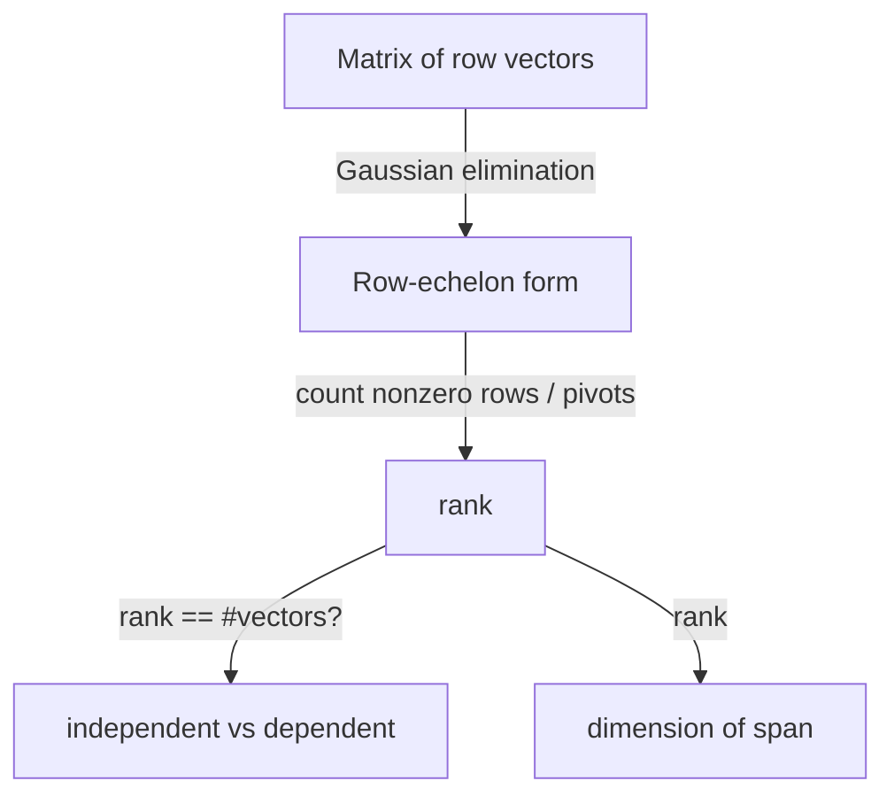

# Matrix Rank — Junior Level

> **One-line summary:** The **rank** of a matrix is the number of linearly independent rows (equivalently, columns). You compute it by **Gaussian elimination (row reduction)** and **counting the nonzero pivots** that survive — every row that reduces to all zeros was a dependent (redundant) row and does *not* add to the rank.

---

## Table of Contents

1. [Introduction](#introduction)
2. [Prerequisites](#prerequisites)
3. [Glossary](#glossary)
4. [Core Concepts](#core-concepts)
5. [Big-O Summary](#big-o-summary)
6. [Real-World Analogies](#real-world-analogies)
7. [Pros & Cons](#pros--cons)
8. [Step-by-Step Walkthrough](#step-by-step-walkthrough)
9. [Code Examples](#code-examples)
10. [Coding Patterns](#coding-patterns)
11. [Error Handling](#error-handling)
12. [Performance Tips](#performance-tips)
13. [Best Practices](#best-practices)
14. [Edge Cases & Pitfalls](#edge-cases--pitfalls)
15. [Common Mistakes](#common-mistakes)
16. [Cheat Sheet](#cheat-sheet)
17. [Visual Animation](#visual-animation)
18. [Summary](#summary)
19. [Further Reading](#further-reading)

---

## Introduction

Suppose someone hands you a grid of numbers — a **matrix** — and asks: *"How much real information is in here? How many of these rows are genuinely different, and how many are just combinations (echoes) of the others?"* That number is the **rank**.

Here is the idea in one sentence:

> **The rank of a matrix is the number of linearly independent rows — and that is exactly the number of nonzero pivots left after you row-reduce it.**

Two rows are *dependent* when one is a scalar multiple of the other, or more generally when one row can be built by adding and scaling the others. Dependent rows carry no new information; during row reduction they collapse into a row of all zeros. The rows that survive — each contributing a **pivot** (the first nonzero entry in its reduced row) — are the independent ones. Count the pivots and you have the rank.

A tiny example. Look at this matrix:

```
[ 1  2  3 ]
[ 2  4  6 ]
[ 0  1  1 ]
```

Row 2 is just `2 ×` Row 1, so it is redundant. After eliminating it, only two independent rows remain (Row 1 and Row 3). The rank is **2**, not 3.

This single number answers a surprising number of questions:

- **Are these vectors independent?** They are independent exactly when the rank equals the number of vectors.
- **What is the dimension of the space they span?** It is the rank.
- **Does a system of linear equations have a solution, and how many?** The rank decides (we will meet this rule, called Rouché-Capelli, at middle level and it ties back to sibling `17-gaussian-elimination`).
- **How many independent "directions" does a dataset really have?** The rank, again.

The wonderful part is that the same algorithm you already know for *solving* linear systems — **Gaussian elimination**, the sibling topic `17` — also computes the rank for free. You do not learn a new algorithm; you just *count the pivots* that the elimination produces. This file teaches exactly that: what rank means, why pivots count it, and how to write the row-reduction-and-count loop.

There is one wrinkle we will return to many times: *what counts as "zero"?* Over the integers or over arithmetic modulo a prime, zero is exactly zero and counting pivots is clean. Over the **real numbers** with floating-point arithmetic, a number that *should* be zero may come out as `0.0000000003` due to rounding, so we compare against a small **tolerance** instead. Junior level focuses on the clean exact case; the tolerance subtlety is fully developed at middle and senior level.

---

## Prerequisites

Before reading this file you should be comfortable with:

- **Matrices** — a rectangular grid of numbers with `m` rows and `n` columns.
- **Vectors** — a single row or single column of numbers.
- **Gaussian elimination / row reduction** — using row operations to create zeros below pivots. This is sibling topic `17-gaussian-elimination`; rank is computed *by* that very process.
- **Scalar multiplication and addition of rows** — `Row_i = Row_i − c · Row_j`, the basic elimination step.
- **Big-O notation** — `O(n²)`, `O(n³)`, `O(n² m)`.
- **Nested loops over a 2D array** — every operation here is a loop over the grid.

Optional but helpful:

- A glance at **modular arithmetic** (sibling `02-modular-arithmetic`), since rank "over Z/pZ" reduces entries mod a prime.
- Familiarity with **XOR** (sibling `18-bit-manipulation`), since rank over GF(2) is the size of an XOR/linear basis.

---

## Glossary

| Term | Meaning |
|------|---------|
| **Rank** | The number of linearly independent rows of a matrix (= number of independent columns = number of nonzero pivots after row reduction). |
| **Linearly independent** | A set of rows where none can be written as a combination (sum of scalar multiples) of the others. |
| **Linearly dependent** | The opposite: at least one row *is* such a combination, so it is redundant. |
| **Pivot** | The first nonzero entry of a row in row-echelon form; each pivot marks one independent row. |
| **Row reduction / Gaussian elimination** | The process of using row operations to put a matrix into echelon form (zeros below each pivot). |
| **Row-echelon form (REF)** | A "staircase" form where each pivot is to the right of the pivot above it, and zero rows sit at the bottom. |
| **Zero row** | A row that becomes all zeros during reduction — it was a dependent row and does **not** count toward rank. |
| **Span** | The set of all combinations of the rows; its dimension equals the rank. |
| **Full rank** | Rank equals the smaller of `m` (rows) and `n` (columns) — no redundancy. |
| **Rank-deficient** | Rank is *less* than `min(m, n)` — there is at least one dependent row/column. |
| **Tolerance (eps)** | A small threshold (e.g. `1e-9`) used over the reals to decide whether a number is "really" zero despite rounding. |
| **GF(2) / Z/2Z** | Arithmetic where the only values are 0 and 1, addition is XOR, multiplication is AND. |

---

## Core Concepts

### 1. What "Linearly Independent" Means

A set of rows is **independent** when the only way to combine them (with scalars) and get the all-zeros row is to multiply every row by 0. If you *can* get zero some other way — say `2·Row1 − Row2 = 0` — then the rows are **dependent**, and one of them is redundant.

The rank measures *how many independent rows there are*. If you have 3 rows but one is a copy (or scaled copy, or sum) of the others, only 2 are independent, so the rank is 2.

### 2. Pivots Count Independence

When you run Gaussian elimination, you walk column by column looking for a row with a nonzero entry in the current column — that entry becomes a **pivot**. You then use it to wipe out the entries below (and the algorithm uses each pivot row once). Every pivot you find corresponds to exactly one independent row. A dependent row, after subtracting off the pivot rows, has nothing left — it becomes a **zero row**.

> **The rank = the number of pivots = the number of nonzero rows in echelon form.**

This is why you do not need a separate "rank algorithm": elimination already finds the pivots; you just count them.

### 3. Row Rank Equals Column Rank

A beautiful fact (proved in [`professional.md`](./professional.md)): the number of independent **rows** always equals the number of independent **columns**. So "rank" is unambiguous — it does not matter whether you reduce rows or columns, you get the same number. For an `m × n` matrix the rank is at most `min(m, n)`.

### 4. The Elimination Loop (the whole algorithm)

```
rank = 0
for each column c (left to right):
    find a row r at or below the current pivot row with matrix[r][c] != 0
    if no such row exists:
        continue          # this column has no pivot; skip it
    swap that row up to the pivot position
    use it to eliminate entry c in all other rows below (and optionally above)
    rank = rank + 1       # we found one more independent row
    move the pivot row down by one
return rank
```

Each successful pivot bumps the rank. Columns with no available pivot are simply skipped. When you run out of rows or columns, the rank is the count.

### 5. What Counts as Zero (exact vs floating)

- **Over Z/pZ (mod a prime):** reduce every value mod `p`. "Zero" means exactly `0`. Pivot-finding and counting are exact and clean. (Division uses the modular inverse — see sibling `06-extended-euclidean-modular-inverse`.)
- **Over GF(2):** values are only 0 or 1; "zero" is exactly 0. Addition is XOR. This is the fastest case and connects to the XOR basis of sibling `18`.
- **Over the reals (floating point):** a value that should be 0 may be `1e-16` after rounding. So you compare `|value| < eps` (a small tolerance like `1e-9`) to decide it is zero. Picking `eps` is a real engineering concern (see middle/senior).

### 6. Full Rank vs Rank-Deficient

- **Full rank:** rank `= min(m, n)`. No redundancy; for a square matrix this also means it is invertible (determinant nonzero).
- **Rank-deficient:** rank `< min(m, n)`. There is at least one dependent row/column. A square rank-deficient matrix is *singular* (determinant zero, not invertible).

---

## Big-O Summary

| Operation | Time | Space | Notes |
|-----------|------|-------|-------|
| Rank by Gaussian elimination (`m × n`) | **O(n² m)** (≈ `O(n³)` square) | O(1) extra | The standard method; same cost as solving a system. |
| One elimination step (eliminate a column) | O(n m) | — | Subtract a pivot row from the rows below. |
| Rank over Z/pZ | O(n² m) | O(1) | Same shape; each op is a modular add/mul/inverse. |
| Rank over GF(2) with plain arrays | O(n² m) | O(nm) | Each op is XOR/AND on single bits. |
| Rank over GF(2) with **bitsets** | O(n² m / w) | O(nm / w) | `w` = machine word (64); ~64× faster on big systems. |
| Read whether a vector is independent | O(rank) | — | After the basis is built (XOR-basis style). |

The headline number is **`O(n² m)`** — for a square `n × n` matrix that is `O(n³)`, the same cost as Gaussian elimination for solving a system. The GF(2) bitset trick divides the constant by the word size (typically 64).

---

## Real-World Analogies

| Concept | Analogy |
|---------|---------|
| Rank | The number of *genuinely different* recipes in a cookbook after you remove every recipe that is just "the previous one, doubled" or "a mix of two earlier ones." |
| Independent rows | A panel of experts who each bring a new perspective — none merely repeats what another said. |
| Dependent row → zero row | A committee member who only ever echoes others; when you summarize, their contribution vanishes. |
| Pivot | A "leader" entry that claims a column; each leader represents one independent voice. |
| Full rank | A team with no redundancy — everyone is essential. |
| Rank-deficient | A team where some members are interchangeable; you could fire one and lose nothing. |
| Tolerance over reals | Treating "0.0000001 dollars" as "free" because the tiny amount is just rounding noise from the cash register. |

Where the analogy breaks: rank is an exact algebraic quantity over fields like Z/pZ and GF(2); the "fuzzy" tolerance only appears because *floating-point* arithmetic is approximate, not because rank itself is fuzzy.

---

## Pros & Cons

| Pros | Cons |
|------|------|
| One number summarizes independence, span dimension, and solvability. | Over floating point, the answer depends on the tolerance `eps` you pick. |
| Computed for free by the elimination you already know (sibling `17`). | Cubic cost `O(n³)` is heavy for very large dense matrices. |
| Exact and clean over Z/pZ and GF(2) (no rounding worries). | Near-dependent (ill-conditioned) real matrices give an ambiguous rank. |
| GF(2) version is extremely fast with bitsets (64× speedup). | Counting pivots correctly requires careful zero-row handling. |
| Directly drives the solvability rule for linear systems (Rouché-Capelli). | Naive pivot choice over reals can be numerically unstable (use partial pivoting). |

**When to use:** testing independence of vectors, finding the dimension of a span, deciding if a linear system is solvable and how many solutions it has, sizing an XOR/linear basis, error-correcting code analysis.

**When NOT to use:** when you only need to *solve* a specific system (just run elimination); when the matrix is enormous and sparse (use specialized sparse-rank methods); when "rank" over noisy real data is better captured by the **numerical rank** via SVD (a more advanced tool).

---

## Step-by-Step Walkthrough

Take this `3 × 3` matrix over the reals (or integers):

```
A =
[ 1  2  3 ]
[ 2  4  7 ]
[ 1  2  4 ]
```

We row-reduce and count pivots.

**Column 0.** Look for a nonzero entry in column 0 at or below row 0. Row 0 has `1` — that is our first pivot. Eliminate column 0 from the rows below:

```
Row1 = Row1 − 2·Row0 = (2,4,7) − (2,4,6) = (0, 0, 1)
Row2 = Row2 − 1·Row0 = (1,2,4) − (1,2,3) = (0, 0, 1)
```

After this step:

```
[ 1  2  3 ]   <- pivot in column 0   (rank so far = 1)
[ 0  0  1 ]
[ 0  0  1 ]
```

**Column 1.** Look for a nonzero entry in column 1 at or below row 1. Rows 1 and 2 both have `0` in column 1. **No pivot in this column — skip it.** Rank unchanged.

**Column 2.** Look for a nonzero entry in column 2 at or below row 1. Row 1 has `1` — second pivot. Eliminate it from the rows below:

```
Row2 = Row2 − 1·Row1 = (0,0,1) − (0,0,1) = (0, 0, 0)
```

After this step:

```
[ 1  2  3 ]   <- pivot column 0   (rank = 1)
[ 0  0  1 ]   <- pivot column 2   (rank = 2)
[ 0  0  0 ]   <- ZERO ROW: this row was dependent, does NOT count
```

**Count the pivots: 2.** So `rank(A) = 2`.

**Why this makes sense.** Notice `Row2 − Row0 = (0,0,1)` and `Row1 − 2·Row0 = (0,0,1)` are the *same* vector — Row 1 and Row 2 were not independent of each other once Row 0 was removed. One of them had to collapse to zero. The matrix has only 2 independent rows.

**Sanity check via columns.** Column 1 is exactly `2 ×` Column 0, so it is dependent — there are only 2 independent columns too. Row rank (2) equals column rank (2), as promised.

---

## Code Examples

### Example: Rank by Gaussian Elimination Over the Reals (with tolerance)

This reduces the matrix and counts pivots, treating `|x| < eps` as zero.

#### Go

```go
package main

import (
	"fmt"
	"math"
)

const EPS = 1e-9

// rank returns the rank of an m x n real matrix via Gaussian elimination.
func rank(mat [][]float64) int {
	m := len(mat)
	if m == 0 {
		return 0
	}
	n := len(mat[0])
	rowPivot := 0 // index of the next pivot row
	for col := 0; col < n && rowPivot < m; col++ {
		// find the row (>= rowPivot) with the largest |entry| in this column (partial pivoting)
		sel := rowPivot
		for r := rowPivot + 1; r < m; r++ {
			if math.Abs(mat[r][col]) > math.Abs(mat[sel][col]) {
				sel = r
			}
		}
		if math.Abs(mat[sel][col]) < EPS {
			continue // no pivot in this column; skip it
		}
		mat[rowPivot], mat[sel] = mat[sel], mat[rowPivot] // swap pivot row up
		// eliminate this column from every other row
		for r := 0; r < m; r++ {
			if r == rowPivot {
				continue
			}
			factor := mat[r][col] / mat[rowPivot][col]
			for c := col; c < n; c++ {
				mat[r][c] -= factor * mat[rowPivot][c]
			}
		}
		rowPivot++ // we found one more independent row
	}
	return rowPivot
}

func main() {
	A := [][]float64{
		{1, 2, 3},
		{2, 4, 7},
		{1, 2, 4},
	}
	fmt.Println("rank =", rank(A)) // 2
}
```

#### Java

```java
public class MatrixRank {
    static final double EPS = 1e-9;

    static int rank(double[][] mat) {
        int m = mat.length;
        if (m == 0) return 0;
        int n = mat[0].length;
        int rowPivot = 0;
        for (int col = 0; col < n && rowPivot < m; col++) {
            int sel = rowPivot;
            for (int r = rowPivot + 1; r < m; r++)
                if (Math.abs(mat[r][col]) > Math.abs(mat[sel][col])) sel = r;
            if (Math.abs(mat[sel][col]) < EPS) continue; // no pivot here
            double[] tmp = mat[rowPivot]; mat[rowPivot] = mat[sel]; mat[sel] = tmp;
            for (int r = 0; r < m; r++) {
                if (r == rowPivot) continue;
                double factor = mat[r][col] / mat[rowPivot][col];
                for (int c = col; c < n; c++)
                    mat[r][c] -= factor * mat[rowPivot][c];
            }
            rowPivot++;
        }
        return rowPivot;
    }

    public static void main(String[] args) {
        double[][] A = {
            {1, 2, 3},
            {2, 4, 7},
            {1, 2, 4},
        };
        System.out.println("rank = " + rank(A)); // 2
    }
}
```

#### Python

```python
EPS = 1e-9


def rank(mat):
    mat = [row[:] for row in mat]   # copy so we don't mutate the caller's data
    m = len(mat)
    if m == 0:
        return 0
    n = len(mat[0])
    row_pivot = 0
    for col in range(n):
        if row_pivot >= m:
            break
        # partial pivoting: pick the row with the largest |entry| in this column
        sel = max(range(row_pivot, m), key=lambda r: abs(mat[r][col]))
        if abs(mat[sel][col]) < EPS:
            continue                # no pivot in this column
        mat[row_pivot], mat[sel] = mat[sel], mat[row_pivot]
        piv = mat[row_pivot][col]
        for r in range(m):
            if r == row_pivot:
                continue
            factor = mat[r][col] / piv
            for c in range(col, n):
                mat[r][c] -= factor * mat[row_pivot][c]
        row_pivot += 1
    return row_pivot


if __name__ == "__main__":
    A = [
        [1, 2, 3],
        [2, 4, 7],
        [1, 2, 4],
    ]
    print("rank =", rank(A))  # 2
```

**What it does:** reduces the `3 × 3` matrix and counts pivots. The third row collapses to zero, so the rank is 2.
**Run:** `go run main.go` | `javac MatrixRank.java && java MatrixRank` | `python rank.py`

---

## Coding Patterns

### Pattern 1: Brute-Force Independence Check (the oracle you test against)

**Intent:** Before trusting the elimination, on tiny matrices you can verify a row is dependent by checking whether it lies in the span of the others. For small integer cases you can even reason by hand. The elimination must agree.

```python
def is_zero_row(row, eps=1e-9):
    return all(abs(x) < eps for x in row)


def count_nonzero_rows_after_reduction(reduced, eps=1e-9):
    # rank = number of rows that are NOT all-zero after row reduction
    return sum(0 if is_zero_row(r, eps) else 1 for r in reduced)
```

The rank returned by elimination must equal the count of nonzero rows in the reduced form. This is a cheap correctness check.

### Pattern 2: Independence Test via Rank

**Intent:** "Are these `k` vectors independent?" Stack them as rows and compute the rank. They are independent **iff** rank `== k`.

### Pattern 3: Dimension of a Span

**Intent:** "What is the dimension of the space spanned by these vectors?" It is exactly their rank — no extra work.



---

## Error Handling

| Error | Cause | Fix |
|-------|-------|-----|
| Rank too high over reals | `eps` too small; rounding noise treated as a real pivot. | Use a sensible tolerance (e.g. `1e-9`), ideally scaled by matrix magnitude. |
| Rank too low over reals | `eps` too large; a genuine tiny pivot treated as zero. | Lower `eps`, or use partial pivoting to keep pivots large. |
| Wrong rank over Z/pZ | Forgot to reduce mod `p`, or divided without the modular inverse. | Reduce after every op; divide via modular inverse (sibling `06`). |
| `IndexError` / out-of-bounds | Ragged matrix (rows of different lengths). | Validate all rows have the same length `n` first. |
| Off-by-one in pivot row | Forgot to advance `rowPivot` only on a successful pivot. | Increment `rowPivot` *only* when a pivot is found, never on a skipped column. |
| Division by zero | Used an entry as a pivot without checking it is nonzero. | Always test `|pivot| >= eps` (reals) or `pivot != 0` (exact) first. |

---

## Performance Tips

- **Use partial pivoting over reals** (pick the row with the largest absolute pivot). It both improves numerical stability and avoids dividing by a tiny number.
- **Stop early** when `rowPivot` reaches `m` (you cannot have more pivots than rows) or when you run out of columns.
- **Eliminate only from `col` onward** — entries to the left of the pivot are already zero, so skip them.
- **Over GF(2), use bitsets** — pack each row into 64-bit words and XOR whole words at once for a ~64× speedup on large systems (detailed at middle level).
- **Reduce mod `p` lazily** over Z/pZ — one reduction per subtraction is enough; precompute the modular inverse of the pivot once per row.

---

## Best Practices

- Always state your tolerance `eps` once as a named constant; never sprinkle magic `1e-9` literals.
- For exact problems, work over Z/pZ or GF(2) and avoid floating point entirely — the rank is then exact.
- Copy the matrix before reducing if the caller still needs the original; elimination destroys the input.
- Write `eliminateColumn` and `findPivot` as small testable helpers; most bugs hide in the elimination step.
- Document which field you are over (reals/Z/pZ/GF(2)) — the "what is zero" rule differs and silently changes the answer.

---

## Edge Cases & Pitfalls

- **Zero matrix** — rank is `0`; every column is skipped, no pivots found. Make sure your loop returns `0`, not a crash.
- **Single row / single column** — rank is `1` if it has any nonzero entry, else `0`.
- **More columns than rows (`n > m`)** — rank is at most `m`; the pivot loop stops when `rowPivot == m`.
- **More rows than columns (`m > n`)** — rank is at most `n`; extra rows must collapse to zero.
- **Tolerance over reals** — the rank is only as trustworthy as `eps`. Near-dependent rows make the answer genuinely ambiguous.
- **Integer matrices through float elimination** — fractions appear and reintroduce rounding; prefer exact (Z/pZ) arithmetic for exact answers.
- **Mutating the caller's matrix** — elimination overwrites the input; copy first if that matters.

---

## Common Mistakes

1. **Counting columns instead of pivots** — rank is the number of *pivots* (independent rows), not the number of columns processed.
2. **Advancing the pivot row on a skipped column** — only advance `rowPivot` when a pivot is actually found.
3. **Forgetting the tolerance over reals** — comparing `== 0.0` on floats almost never works; use `|x| < eps`.
4. **Dividing without the modular inverse over Z/pZ** — real division is invalid mod `p`; multiply by the inverse instead.
5. **Treating a dependent row as independent** — a row that reduces to all zeros must *not* increment the rank.
6. **Assuming row rank ≠ column rank** — they are always equal; do not "average" them or pick the larger.
7. **Using a tiny pivot over reals** — without partial pivoting, dividing by a near-zero pivot amplifies rounding error and corrupts the count.

---

## Cheat Sheet

| Question | Tool | Answer |
|----------|------|--------|
| How many independent rows? | row reduce, count pivots | rank |
| How many independent columns? | same — row rank = column rank | rank |
| Are `k` vectors independent? | rank of stacked vectors | independent iff rank == k |
| Dimension of their span? | rank | rank |
| Is a square matrix invertible? | rank vs `n` | invertible iff rank == n |
| What is zero (Z/pZ)? | exact | value `== 0` after mod |
| What is zero (GF(2))? | exact | value `== 0` (XOR/AND) |
| What is zero (reals)? | tolerance | `|value| < eps` |

Core algorithm:

```
rank = 0; rowPivot = 0
for col in 0..n-1:
    find row r >= rowPivot with nonzero (or |.| >= eps) entry in col
    if none: continue
    swap r to rowPivot; eliminate col from other rows
    rowPivot += 1
return rowPivot     # = rank ; cost O(n^2 m)
```

---

## Visual Animation

> See [`animation.html`](./animation.html) for an interactive visualization.
>
> The animation demonstrates:
> - Row-reducing a matrix column by column, marking each **pivot** as it is found
> - Eliminating entries below (and above) each pivot
> - Watching **dependent rows collapse to all-zero rows** that are skipped
> - A running **pivot counter** that ends equal to the rank
> - Step / Run / Reset controls and an **editable matrix** to try your own inputs

---

## Summary

The **rank** of a matrix is the number of linearly independent rows — equivalently the number of independent columns, equivalently the number of nonzero **pivots** left after Gaussian elimination. You do not need a new algorithm: the row reduction you already know (sibling `17`) finds the pivots, and you simply **count** them. Dependent rows collapse into all-zero rows and contribute nothing. The cost is `O(n² m)` — the same as solving a system. The one thing to watch is *what counts as zero*: exact over Z/pZ and GF(2), but compared against a small tolerance `eps` over floating-point reals (use partial pivoting to keep the answer stable). Master "row-reduce and count the pivots" and you can test independence, measure span dimension, and decide solvability — all from one number.

---

## Further Reading

- *Introduction to Linear Algebra* (Strang) — rank, the four fundamental subspaces, and row reduction.
- Sibling topic `17-gaussian-elimination` — the elimination engine that computes rank.
- Sibling topic `06-extended-euclidean-modular-inverse` — modular inverse used for division over Z/pZ.
- Sibling topic `18-bit-manipulation` (XOR basis) — rank over GF(2) is the size of a linear/XOR basis.
- Sibling topic `02-modular-arithmetic` — the arithmetic for rank over Z/pZ.
- cp-algorithms.com — "Rank of a matrix" and "Gauss & system of linear equations".
