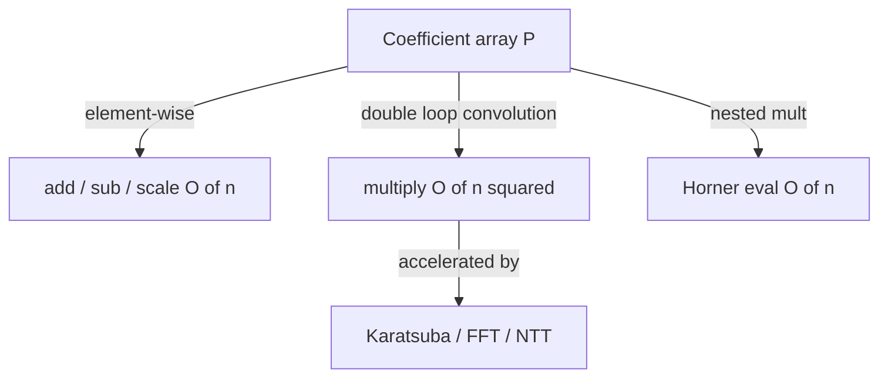

# Polynomial Operations (over a Field, especially mod p) — Junior Level

> **One-line summary:** A polynomial is just a list of coefficients `[a0, a1, a2, …]` meaning `a0 + a1·x + a2·x² + …`. Over a field (the rationals, the reals, or — most importantly for us — the integers modulo a prime `p`) you can add, subtract, scale, multiply, and evaluate polynomials with simple loops. Schoolbook multiplication is `O(n²)`; evaluation by Horner's rule is `O(n)`.

---

## Table of Contents

1. [Introduction](#introduction)
2. [Prerequisites](#prerequisites)
3. [Glossary](#glossary)
4. [Core Concepts](#core-concepts)
5. [Big-O Summary](#big-o-summary)
6. [Real-World Analogies](#real-world-analogies)
7. [Pros & Cons](#pros--cons)
8. [Step-by-Step Walkthrough](#step-by-step-walkthrough)
9. [Code Examples](#code-examples)
10. [Coding Patterns](#coding-patterns)
11. [Error Handling](#error-handling)
12. [Performance Tips](#performance-tips)
13. [Best Practices](#best-practices)
14. [Edge Cases & Pitfalls](#edge-cases--pitfalls)
15. [Common Mistakes](#common-mistakes)
16. [Cheat Sheet](#cheat-sheet)
17. [Visual Animation](#visual-animation)
18. [Summary](#summary)
19. [Further Reading](#further-reading)

---

## Introduction

A **polynomial** in one variable `x` is an expression like

```
P(x) = 3 + 5x + 2x²
```

The numbers `3, 5, 2` are the **coefficients**. The highest power with a nonzero coefficient is the **degree** (here `2`). On a computer we do not store the `x`'s at all — they are implied by *position*. We store only the coefficient list:

```
P = [3, 5, 2]      // index i holds the coefficient of x^i
```

That single representational choice unlocks everything. Adding two polynomials becomes "add the two coefficient lists element by element." Multiplying becomes a double loop that spreads each term of one polynomial across all terms of the other. Evaluating `P(7)` becomes a short loop. Because the operations are just arithmetic on the coefficients, they work over *any* set of numbers where `+`, `−`, and `×` behave normally — and for competitive programming and cryptography the most important such set is the integers **modulo a prime `p`** (written `Z/pZ` or `F_p`). Working mod `p` keeps every coefficient a bounded integer (in `[0, p)`), so nothing ever overflows and there is no floating-point rounding to worry about.

This file teaches the five **core arithmetic operations** every polynomial library starts with:

- **Representation** — coefficient arrays and what each slot means.
- **Add / subtract / scale** — element-wise, `O(n)`.
- **Multiplication (schoolbook)** — the `O(n²)` convolution that every later fast method (Karatsuba, FFT, NTT) merely accelerates.
- **Evaluation by Horner's rule** — computing `P(x0)` in `O(n)` with `n` multiply-adds.

Once you are comfortable here, sibling and follow-on topics take over: faster multiplication via **Karatsuba** (`15-divide-and-conquer/04-karatsuba`) and **FFT** (`15-divide-and-conquer/05-fft`), and the exact `O(n log n)` modular convolution via the **Number-Theoretic Transform** (`15-ntt`, right next door in this same `19-number-theory` section). Division, interpolation, and polynomial GCD are covered in [`middle.md`](./middle.md). But none of those make sense until you can confidently hold a polynomial as a coefficient array and multiply two of them by hand. That is the whole job of this page.

One mantra to carry from the first minute: **multiplying polynomials *is* convolving their coefficient arrays.** The coefficient of `x^k` in the product is the sum of every `a_i · b_j` with `i + j = k`. Burn that into memory; everything else is bookkeeping.

---

## Prerequisites

Before reading this file you should be comfortable with:

- **Arrays / lists and indexing** — every polynomial here is a coefficient array, indexed by power.
- **Nested loops** — multiplication is a double loop; evaluation is a single loop.
- **Modular arithmetic** — `(a + b) mod p`, `(a · b) mod p`, and why we reduce to avoid overflow. (Covered in sibling `02-modular-arithmetic`.)
- **Big-O notation** — `O(n)`, `O(n²)`, `O(n log n)`.
- **What a prime is** — we work modulo a prime `p` so that division/inverses exist (used in `middle.md`).

Optional but helpful:

- A glance at **modular inverse** (sibling `07-extended-euclidean-modular-inverse`) — needed for dividing coefficients in later files.
- Familiarity with **dot products** — the convolution sum looks like a sliding dot product.

---

## Glossary

| Term | Meaning |
|------|---------|
| **Polynomial** | `P(x) = Σ a_i x^i`. Stored as the coefficient array `[a0, a1, …, a_d]`. |
| **Coefficient** | The number multiplying a power of `x`. `a_i` is the coefficient of `x^i`. |
| **Degree** | The largest `i` with `a_i ≠ 0`. The zero polynomial's degree is conventionally `−∞` (or undefined). |
| **Leading coefficient** | The coefficient of the highest power, `a_deg`. |
| **Monic** | A polynomial whose leading coefficient is `1`. |
| **Constant term** | `a_0`, the coefficient of `x^0`; equals `P(0)`. |
| **Field** | A number system with `+`, `−`, `×`, and division by nonzero (e.g. rationals, reals, `F_p` for prime `p`). |
| **`F_p` / `Z/pZ`** | Integers `{0, 1, …, p−1}` with arithmetic done mod a prime `p`. A field because every nonzero element has an inverse. |
| **Convolution** | The operation `c_k = Σ_{i+j=k} a_i b_j` — exactly polynomial multiplication. |
| **Horner's rule** | Evaluating `P(x0)` as `(((a_d·x0 + a_{d-1})·x0 + …)·x0 + a_0)` in `O(n)`. |
| **Modulus `p`** | The prime we reduce coefficients by; commonly `998244353` (NTT-friendly) or `10^9 + 7`. |

---

## Core Concepts

### 1. The Coefficient-Array Representation

A polynomial of degree `d` is stored as an array of length `d + 1`. The element at index `i` is the coefficient of `x^i`:

```
P(x) = 3 + 5x + 2x²     ⇒    P = [3, 5, 2]
Q(x) = 1 − x³           ⇒    Q = [1, 0, 0, -1]   (mod p, -1 becomes p-1)
```

Index `0` is always the constant term. The array's last meaningful index is the degree. We often *normalize* by stripping trailing zeros so the last element is the true leading coefficient.

### 2. Addition, Subtraction, Scaling

These are element-wise. To add `P` and `Q`, pad the shorter one with zeros and add slot by slot:

```
add(P, Q)[i] = (P[i] + Q[i]) mod p
sub(P, Q)[i] = (P[i] − Q[i]) mod p
scale(P, c)[i] = (c · P[i]) mod p
```

All three are `O(n)` where `n` is the larger length. (Subtraction mod `p` can produce a negative intermediate; add `p` then reduce again to keep results in `[0, p)`.)

### 3. Multiplication = Convolution (Schoolbook `O(n²)`)

To multiply `P` (degree `n−1`) by `Q` (degree `m−1`), every term `a_i x^i` of `P` multiplies every term `b_j x^j` of `Q`, producing `a_i b_j x^{i+j}`. Collecting like powers:

```
(P·Q)[k] = Σ over all i+j=k of  P[i] · Q[j]
```

The product has degree `(n−1) + (m−1)`, so its array has length `n + m − 1`. The double loop is `O(n·m)`, i.e. `O(n²)` when the sizes are comparable. This sum is precisely a **convolution** of the two arrays — the reason every fast multiplication method (Karatsuba, FFT, NTT) is described as "fast convolution."

### 4. Evaluation by Horner's Rule (`O(n)`)

Naively, `P(x0) = a_0 + a_1 x0 + a_2 x0² + …` recomputes powers of `x0` and costs `O(n²)` if done carelessly, or `O(n)` with an accumulated power but `2n` multiplies. **Horner's rule** rewrites the polynomial as nested multiplication:

```
P(x0) = ((…((a_d)·x0 + a_{d-1})·x0 + a_{d-2})·x0 + … )·x0 + a_0
```

Start with the leading coefficient and repeatedly "multiply by `x0`, add the next coefficient" walking down to `a_0`. That is `n` multiplications and `n` additions — optimal, and numerically/modularly clean.

### 5. Everything Works mod `p`

Reduce after every `+`, `−`, and `×`. Because reduction mod `p` is a *homomorphism* (it commutes with `+` and `×`), you get the same answer whether you reduce as you go or only at the end — but reducing as you go is what keeps coefficients bounded and overflow-free. Over a prime `p` the residues form a **field**, which is exactly why later operations like division and interpolation (which need to divide by coefficients) are possible: every nonzero residue has a modular inverse.

### 6. Degree Bookkeeping

The degree of a sum is at most the max of the two degrees (it can drop if leading terms cancel). The degree of a product is the sum of the two degrees (over a field, since the product of the two nonzero leading coefficients is nonzero — no zero divisors). Tracking degree correctly, and stripping trailing zeros, prevents off-by-one bugs in later operations.

---

## Big-O Summary

| Operation | Time | Space | Notes |
|-----------|------|-------|-------|
| Add / subtract / scale | **O(n)** | O(n) | Element-wise. |
| Evaluate at one point (Horner) | **O(n)** | O(1) | `n` multiply-adds. |
| Multiply (schoolbook) | **O(n·m)** = O(n²) | O(n+m) | Convolution double loop. |
| Multiply (Karatsuba) | O(n^1.585) | O(n) | See `15-divide-and-conquer/04-karatsuba`. |
| Multiply (FFT / NTT) | **O(n log n)** | O(n) | See `15-divide-and-conquer/05-fft`, sibling `15-ntt`. |
| Evaluate at many points (multipoint) | O(n log² n) | O(n log n) | See `middle.md` / `professional.md`. |

The headline numbers for this page are **`O(n)`** for the linear operations and Horner evaluation, and **`O(n²)`** for schoolbook multiplication. Everything fancier is a faster way to do the same convolution.

---

## Real-World Analogies

| Concept | Analogy |
|---------|---------|
| Coefficient array | A shopping receipt: position = product, value = quantity. The `x` is implicit "category", the number is "how many". |
| Polynomial addition | Merging two receipts by adding quantities of the same item. |
| Multiplication (convolution) | The classic "multiply two multi-digit numbers" you learned in school — each digit of one times each digit of the other, summed into place columns. Polynomials *are* numbers without carries. |
| Horner's rule | Evaluating a number written in base `x0`: read digits from most to least significant, multiply running total by the base, add the next digit. |
| Working mod `p` | Doing arithmetic on a clock with `p` hours: numbers wrap around, never grow unbounded. |

Where the analogy breaks: multi-digit multiplication has **carries** between columns; polynomial multiplication does not (the coefficient of each `x^k` is independent). That is exactly why polynomial multiplication is "cleaner" than integer multiplication and why FFT-based methods apply so directly.

---

## Pros & Cons

| Pros | Cons |
|------|------|
| Dead-simple representation: just an array. | Schoolbook multiply is `O(n²)` — slow for large degree. |
| All core ops are short loops, easy to test. | Trailing-zero / degree bookkeeping is a frequent bug source. |
| Over `F_p` the arithmetic is exact — no floating-point error. | Division/interpolation need modular inverses (a prime modulus). |
| Foundation for FFT/NTT convolution, generating functions, CRT, error-correcting codes. | Numeric (floating) evaluation can lose precision; `F_p` avoids it but needs a modulus. |
| Horner evaluation is optimal (`n` mults). | A wrong modulus or non-prime `p` silently breaks inverses. |

**When to use this page's methods:** small-to-medium degree (say up to a few thousand) where `O(n²)` multiply is fine; any time you need add/sub/scale/eval; as the correctness oracle to test fast methods against.

**When to reach further:** large degree (multiply many thousands of coefficients) → use Karatsuba or, better, NTT (`15-ntt`); many evaluation points → multipoint evaluation (`middle.md`).

---

## Step-by-Step Walkthrough

Work over `F_p` with a small prime `p = 97` so numbers stay readable. Take

```
P(x) = 3 + 5x + 2x²     ⇒  P = [3, 5, 2]
Q(x) = 4 + 1x           ⇒  Q = [4, 1]
```

**Add** (pad `Q` to `[4, 1, 0]`):

```
P + Q = [3+4, 5+1, 2+0] = [7, 6, 2]   →  7 + 6x + 2x²
```

**Multiply** `P · Q`. Product degree is `2 + 1 = 3`, so the result array has length `4`. Convolution `c_k = Σ_{i+j=k} P[i]·Q[j]`:

```
c_0 = P[0]·Q[0]                     = 3·4               = 12
c_1 = P[0]·Q[1] + P[1]·Q[0]         = 3·1 + 5·4         = 3 + 20  = 23
c_2 = P[1]·Q[1] + P[2]·Q[0]         = 5·1 + 2·4         = 5 + 8   = 13
c_3 = P[2]·Q[1]                     = 2·1               = 2
```

So `P·Q = [12, 23, 13, 2]`, i.e. `12 + 23x + 13x² + 2x³` (all already `< 97`, so no reduction needed).

**Sanity check by expansion:** `(3 + 5x + 2x²)(4 + x) = 12 + 3x + 20x + 5x² + 8x² + 2x³ = 12 + 23x + 13x² + 2x³`. ✓ Matches the convolution.

**Evaluate** `P(2)` by Horner. Coefficients high→low are `2, 5, 3`:

```
acc = 2                       (leading coeff)
acc = acc·2 + 5 = 4 + 5 = 9
acc = acc·2 + 3 = 18 + 3 = 21
P(2) = 21
```

**Direct check:** `3 + 5·2 + 2·4 = 3 + 10 + 8 = 21`. ✓ Same answer, fewer operations. Each Horner step "multiplies the running total by `x0` and folds in the next-lower coefficient" — that is the entire trick.

---

## Code Examples

### Example: Add, Multiply (schoolbook), and Evaluate (Horner) mod p

#### Go

```go
package main

import "fmt"

const MOD = 998244353

// add returns (P + Q) mod p, padding the shorter to the longer length.
func add(p, q []int64) []int64 {
	n := len(p)
	if len(q) > n {
		n = len(q)
	}
	r := make([]int64, n)
	for i := 0; i < n; i++ {
		var a, b int64
		if i < len(p) {
			a = p[i]
		}
		if i < len(q) {
			b = q[i]
		}
		r[i] = (a + b) % MOD
	}
	return r
}

// mul returns the schoolbook convolution (P * Q) mod p, O(n*m).
func mul(p, q []int64) []int64 {
	if len(p) == 0 || len(q) == 0 {
		return []int64{}
	}
	r := make([]int64, len(p)+len(q)-1)
	for i := 0; i < len(p); i++ {
		if p[i] == 0 {
			continue // skip zero term
		}
		for j := 0; j < len(q); j++ {
			r[i+j] = (r[i+j] + p[i]*q[j]) % MOD
		}
	}
	return r
}

// eval returns P(x0) mod p by Horner's rule, O(n).
func eval(p []int64, x0 int64) int64 {
	var acc int64 = 0
	for i := len(p) - 1; i >= 0; i-- {
		acc = (acc*x0 + p[i]) % MOD
	}
	return acc
}

func main() {
	P := []int64{3, 5, 2} // 3 + 5x + 2x^2
	Q := []int64{4, 1}    // 4 + x
	fmt.Println("P+Q =", add(P, Q))   // [7 6 2]
	fmt.Println("P*Q =", mul(P, Q))   // [12 23 13 2]
	fmt.Println("P(2) =", eval(P, 2)) // 21
}
```

#### Java

```java
import java.util.*;

public class PolyBasics {
    static final long MOD = 998244353L;

    static long[] add(long[] p, long[] q) {
        int n = Math.max(p.length, q.length);
        long[] r = new long[n];
        for (int i = 0; i < n; i++) {
            long a = (i < p.length) ? p[i] : 0;
            long b = (i < q.length) ? q[i] : 0;
            r[i] = (a + b) % MOD;
        }
        return r;
    }

    static long[] mul(long[] p, long[] q) {
        if (p.length == 0 || q.length == 0) return new long[0];
        long[] r = new long[p.length + q.length - 1];
        for (int i = 0; i < p.length; i++) {
            if (p[i] == 0) continue;
            for (int j = 0; j < q.length; j++) {
                r[i + j] = (r[i + j] + p[i] * q[j]) % MOD;
            }
        }
        return r;
    }

    static long eval(long[] p, long x0) {
        long acc = 0;
        for (int i = p.length - 1; i >= 0; i--) {
            acc = (acc * x0 + p[i]) % MOD;
        }
        return acc;
    }

    public static void main(String[] args) {
        long[] P = {3, 5, 2};
        long[] Q = {4, 1};
        System.out.println("P+Q = " + Arrays.toString(add(P, Q))); // [7, 6, 2]
        System.out.println("P*Q = " + Arrays.toString(mul(P, Q))); // [12, 23, 13, 2]
        System.out.println("P(2) = " + eval(P, 2));                // 21
    }
}
```

#### Python

```python
MOD = 998244353


def add(p, q):
    n = max(len(p), len(q))
    r = [0] * n
    for i in range(n):
        a = p[i] if i < len(p) else 0
        b = q[i] if i < len(q) else 0
        r[i] = (a + b) % MOD
    return r


def mul(p, q):
    if not p or not q:
        return []
    r = [0] * (len(p) + len(q) - 1)
    for i, pi in enumerate(p):
        if pi == 0:
            continue                  # skip zero term
        for j, qj in enumerate(q):
            r[i + j] = (r[i + j] + pi * qj) % MOD
    return r


def eval_horner(p, x0):
    acc = 0
    for coef in reversed(p):
        acc = (acc * x0 + coef) % MOD
    return acc


if __name__ == "__main__":
    P = [3, 5, 2]   # 3 + 5x + 2x^2
    Q = [4, 1]      # 4 + x
    print("P+Q =", add(P, Q))           # [7, 6, 2]
    print("P*Q =", mul(P, Q))           # [12, 23, 13, 2]
    print("P(2) =", eval_horner(P, 2))  # 21
```

**What it does:** builds the two polynomials from the walkthrough, adds and multiplies them, and evaluates `P(2)` — all mod `p`, matching the hand computation.
**Run:** `go run main.go` | `javac PolyBasics.java && java PolyBasics` | `python poly.py`

---

## Coding Patterns

### Pattern 1: Normalize (Strip Trailing Zeros)

**Intent:** Keep the degree honest so later operations index correctly.

```python
def normalize(p):
    while len(p) > 1 and p[-1] == 0:
        p.pop()
    return p
```

Always normalize after subtraction (leading terms may cancel) and before reading the degree.

### Pattern 2: Subtraction That Stays Non-Negative mod p

**Intent:** `(a − b) mod p` can go negative in many languages; force it into `[0, p)`.

```python
def sub(p, q, mod=MOD):
    n = max(len(p), len(q))
    return [((p[i] if i < len(p) else 0) - (q[i] if i < len(q) else 0)) % mod
            for i in range(n)]   # Python's % already returns non-negative
```

In Go/Java add `mod` before the final `% mod`.

### Pattern 3: Evaluate at Many Points (Naive)

**Intent:** Apply Horner once per query point.

```python
def eval_many(p, xs):
    return [eval_horner(p, x) for x in xs]   # O(len(p) * len(xs))
```

This naive loop is fine for a handful of points; for *many* points, multipoint evaluation (`middle.md`) is `O(n log² n)`.



---

## Error Handling

| Error | Cause | Fix |
|-------|-------|-----|
| Overflow / garbage coefficients | Forgot `% p`; 64-bit overflow in the product. | Reduce after every `+` and `*` in `mul`. |
| Negative coefficients | `(a − b) % p` returned negative in Go/Java. | Use `((a - b) % p + p) % p`. |
| Wrong product length | Allocated `n+m` instead of `n+m−1`. | Product of degrees `n−1` and `m−1` has length `n+m−1`. |
| Index out of bounds in add | Did not pad the shorter array. | Treat missing indices as `0`. |
| Empty-polynomial crash | Multiplying with a zero-length array. | Return `[]` (or `[0]`) for an empty/zero operand. |
| Degree off by one | Did not strip trailing zeros after subtraction. | Normalize before reading the degree. |

---

## Performance Tips

- **Skip zero terms** in the inner multiply (`if p[i] == 0: continue`) — sparse polynomials get a real speedup.
- **Reduce mod once per accumulation**, not more; extra `% p` calls just waste cycles.
- **Preallocate the result array** of length `n+m−1` rather than appending.
- **Use Horner**, never recompute `x0^i` from scratch per term.
- **For large degree, stop using schoolbook** — switch to NTT (`15-ntt`) for `O(n log n)`.
- **Cache-friendly loop order**: outer over `P`, inner over `Q`, writing to contiguous `r[i+j]`.

---

## Best Practices

- Store one polynomial = one coefficient array, index `i` = coefficient of `x^i`; never mix conventions.
- State the modulus once as a named constant (`MOD`); never inline magic numbers.
- Pick `998244353` when you might later need NTT — it is the standard NTT-friendly prime (`15-ntt` explains why).
- Write tiny, separately testable `add`, `mul`, `eval` functions; most bugs hide in `mul`.
- Verify `mul` against direct expansion on small inputs before trusting it on large ones.
- Normalize (strip trailing zeros) consistently so the degree is always correct.

---

## Edge Cases & Pitfalls

- **Zero polynomial** — represent as `[0]` or `[]`; decide one convention and stick to it. Its degree is undefined / `−∞`.
- **Constant polynomial** — length-1 array; `P(x0)` is just the constant, and `mul` still works.
- **Empty operands** — `mul([], Q)` should return `[]`, not crash on `len(p)+len(q)-1 = -1`.
- **Coefficients ≥ p on input** — reduce inputs mod `p` first, or the first multiply overflows assumptions.
- **Subtraction underflow** — `(a − b) mod p` must be normalized non-negative.
- **Degree from trailing zeros** — `[3, 0, 0]` is degree 0, not degree 2; strip before reading degree.
- **Numeric vs modular** — if you evaluate over the reals/`double`, expect rounding; over `F_p` the result is exact.

---

## Common Mistakes

1. **Forgetting the modulus** — coefficients overflow and silently wrap to garbage.
2. **Wrong product length** — using `n+m` instead of `n+m−1` leaves a stray trailing zero (or off-by-one indexing).
3. **Negative residues** — `(a − b) % p` left negative in Go/Java; always normalize.
4. **Recomputing powers in eval** — costs `O(n²)` instead of Horner's `O(n)`.
5. **Not stripping trailing zeros** — the degree is read wrong, breaking division/interpolation later.
6. **Mixing index conventions** — storing highest-degree first in one place and lowest-first elsewhere.
7. **Using a non-prime modulus** when later code needs inverses — division by a coefficient then fails.

---

## Cheat Sheet

| Operation | Formula | Cost |
|-----------|---------|------|
| Representation | `P[i]` = coefficient of `x^i` | — |
| Add | `(P+Q)[i] = (P[i]+Q[i]) mod p` | O(n) |
| Subtract | `(P−Q)[i] = (P[i]−Q[i]) mod p` | O(n) |
| Scale | `(c·P)[i] = (c·P[i]) mod p` | O(n) |
| Multiply | `(P·Q)[k] = Σ_{i+j=k} P[i]·Q[j]` | O(n·m) |
| Evaluate | Horner: `acc = acc·x0 + P[i]`, `i` high→low | O(n) |
| Product degree | `deg(P) + deg(Q)` | — |
| Product length | `len(P) + len(Q) − 1` | — |

Core multiply skeleton:

```
mul(P, Q):
    r = array of zeros, length len(P)+len(Q)-1
    for i in 0..len(P)-1:
        if P[i] == 0: continue
        for j in 0..len(Q)-1:
            r[i+j] = (r[i+j] + P[i]*Q[j]) mod p
    return r
# cost: O(n*m); this convolution is what FFT/NTT accelerate
```

Core Horner skeleton:

```
eval(P, x0):
    acc = 0
    for i from high degree down to 0:
        acc = (acc*x0 + P[i]) mod p
    return acc
# cost: O(n)
```

---

## Visual Animation

> See [`animation.html`](./animation.html) for an interactive visualization.
>
> The animation demonstrates:
> - Schoolbook polynomial multiplication as coefficient **convolution** — each `P[i]·Q[j]` product dropping into product slot `i+j`.
> - The product array filling up cell by cell, with contributing source cells highlighted.
> - Horner's rule evaluating `P(x0)`, showing the running accumulator update at each step.
> - Editable polynomials plus Step / Run / Reset controls to watch each product term accumulate.

---

## Summary

A polynomial is a coefficient array: index `i` holds the coefficient of `x^i`. Over a field — especially the integers mod a prime `p` — addition, subtraction, and scaling are `O(n)` element-wise operations, schoolbook multiplication is the `O(n²)` convolution `(P·Q)[k] = Σ_{i+j=k} P[i]·Q[j]`, and Horner's rule evaluates `P(x0)` in an optimal `O(n)` multiply-adds. Reduce mod `p` after every arithmetic step to stay overflow-free and exact. The one idea to keep forever: **multiplying polynomials is convolving their coefficient arrays**, and every fast method (Karatsuba in `15-divide-and-conquer/04-karatsuba`, FFT in `15-divide-and-conquer/05-fft`, NTT in sibling `15-ntt`) is just a faster way to compute that same convolution. Division, interpolation, and polynomial GCD build on this base in [`middle.md`](./middle.md).

---

## Further Reading

- Sibling `02-modular-arithmetic` — the mod-`p` arithmetic underlying every operation here.
- Sibling `07-extended-euclidean-modular-inverse` — modular inverses, needed to divide coefficients (used in `middle.md`).
- Sibling `15-ntt` — `O(n log n)` polynomial multiplication mod an NTT-friendly prime.
- Sibling `29-binary-exponentiation` — fast powers, reused for polynomial powers and Newton iteration later.
- `15-divide-and-conquer/04-karatsuba` and `15-divide-and-conquer/05-fft` — sub-`O(n²)` multiplication.
- *Introduction to Algorithms* (CLRS), Ch. 30 — polynomials and the FFT.
- cp-algorithms.com — "Operations on polynomials and series".
