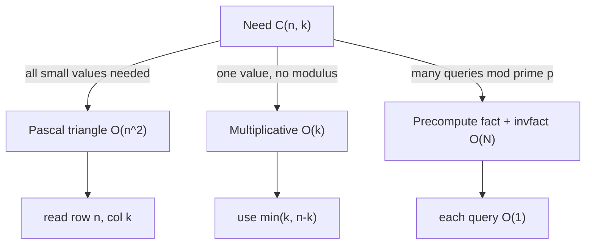

# Binomial Coefficients C(n, k) — Junior Level

> **One-line summary:** The binomial coefficient `C(n, k)` (read "n choose k") counts how many ways you can pick `k` items from `n` distinct items when order does not matter. You can compute it three ways: build **Pascal's triangle** row by row in `O(n²)`, use the **multiplicative formula** `C(n,k) = n·(n−1)···(n−k+1) / k!` directly, or — for huge `n` under a prime modulus — precompute **factorials and modular inverses** and answer each query in `O(1)`.

---

## Table of Contents

1. [Introduction](#introduction)
2. [Prerequisites](#prerequisites)
3. [Glossary](#glossary)
4. [Core Concepts](#core-concepts)
5. [Big-O Summary](#big-o-summary)
6. [Real-World Analogies](#real-world-analogies)
7. [Pros & Cons](#pros--cons)
8. [Step-by-Step Walkthrough](#step-by-step-walkthrough)
9. [Code Examples](#code-examples)
10. [Coding Patterns](#coding-patterns)
11. [Error Handling](#error-handling)
12. [Performance Tips](#performance-tips)
13. [Best Practices](#best-practices)
14. [Edge Cases & Pitfalls](#edge-cases--pitfalls)
15. [Common Mistakes](#common-mistakes)
16. [Cheat Sheet](#cheat-sheet)
17. [Visual Animation](#visual-animation)
18. [Summary](#summary)
19. [Further Reading](#further-reading)

---

## Introduction

Suppose you have 5 different fruits and you want to put 2 of them in a lunch bag. How many distinct pairs can you make? You do not care about the *order* you drop them in the bag — `{apple, banana}` is the same pair as `{banana, apple}`. The answer is the **binomial coefficient** `C(5, 2) = 10`.

The notation `C(n, k)` — also written `nCk`, `ⁿCₖ`, or with the stacked bracket `(n over k)` — answers exactly one question:

> **How many ways can I choose `k` things out of `n` things, when order does not matter?**

It shows up everywhere: counting poker hands, expanding `(x + y)ⁿ`, counting lattice paths on a grid, computing probabilities, and as a building block in dynamic programming and combinatorics problems. The number can get astronomically large very fast — `C(100, 50)` has 30 digits — so a huge part of this topic is computing it *without overflowing* and, when the problem says "give the answer modulo a prime," computing it **mod p** efficiently.

There are three computational routes, and this file teaches all three:

1. **Pascal's triangle** — a beautiful triangle where each number is the sum of the two above it. Build it row by row with addition only (no multiplication, no division). Time `O(n²)`, great for *all* small values at once.
2. **Multiplicative formula** — multiply `k` terms in the numerator and divide by `k!`. Computes a *single* `C(n,k)` in `O(k)` without building a whole triangle.
3. **Factorials + modular inverse** — for problems under a prime modulus `p` (like the famous `10⁹+7`), precompute all factorials and their inverses once, then answer each query `C(n,k) mod p` in `O(1)`.

You only need basic loops and arithmetic to follow along. By the end you will know which method to reach for and why.

---

## Prerequisites

Before reading this file you should be comfortable with:

- **Basic loops and arrays** — building a 2D table and indexing into it.
- **Integer arithmetic and overflow** — knowing that `int` types have a maximum value (`2³¹−1` for 32-bit, `2⁶³−1` for 64-bit) and that exceeding it wraps around to garbage.
- **Factorials** — `n! = 1·2·3···n`, with `0! = 1` by convention.
- **Big-O notation** — `O(n²)`, `O(k)`, `O(1)`.

Optional but helpful:

- **Modular arithmetic** — `(a · b) mod m` and the idea of a remainder. See sibling `02-modular-arithmetic`. Needed only for the "mod p" route.
- **Modular inverse** — the number `a⁻¹` with `a · a⁻¹ ≡ 1 (mod p)`. See siblings `05-fermat-euler` and `07-extended-euclidean-modular-inverse`. We will explain just enough here.

---

## Glossary

| Term | Meaning |
|------|---------|
| **Binomial coefficient `C(n, k)`** | The number of ways to choose `k` items from `n` distinct items, order ignored. Also `nCk`, `ⁿCₖ`. |
| **Factorial `n!`** | `1·2·3···n`, the number of orderings of `n` items. `0! = 1`. |
| **Combination** | A selection where order does *not* matter — counted by `C(n, k)`. |
| **Permutation** | A selection where order *does* matter — counted by `P(n, k) = n!/(n−k)!`. |
| **Pascal's triangle** | A triangular array where each entry is the sum of the two entries above it; row `n` holds `C(n, 0), …, C(n, n)`. |
| **Pascal's identity** | `C(n, k) = C(n−1, k−1) + C(n−1, k)` — the rule that builds the triangle. |
| **Multiplicative formula** | `C(n, k) = ∏_{i=1}^{k} (n−k+i)/i` — computes one value with `k` multiplies and divides. |
| **Modulus `p`** | The number we take remainders by; in this topic almost always a **prime** like `10⁹+7`. |
| **Modular inverse `a⁻¹`** | The value `x` with `a·x ≡ 1 (mod p)`; lets you "divide" under a modulus. |
| **Overflow** | When an integer result exceeds the type's maximum and silently wraps to a wrong value. |

---

## Core Concepts

### 1. What `C(n, k)` Counts

`C(n, k)` is the number of `k`-element subsets of an `n`-element set. Two quick sanity values:

- `C(n, 0) = 1` — there is exactly one way to choose nothing (the empty set).
- `C(n, n) = 1` — there is exactly one way to choose everything.
- `C(n, 1) = n` — there are `n` ways to choose a single item.

If `k < 0` or `k > n`, then `C(n, k) = 0` — you cannot choose more items than exist, or a negative number of items.

### 2. The Factorial Formula

The closed-form definition is:

```
C(n, k) = n! / (k! · (n − k)!)
```

Why? There are `n!` orderings of all `n` items. Choosing `k` of them and lining them up gives `n!/(n−k)!` ordered selections (permutations). But we do not care about order *within* the chosen `k`, and there are `k!` orderings of those, so we divide by `k!`. The result is the count of *unordered* selections. The factorial formula is exact but `n!` explodes — `21!` already overflows 64-bit — so we rarely compute it this way directly for big `n`.

### 3. The Multiplicative Formula (overflow-friendly)

Cancel `(n−k)!` from the top and bottom of the factorial formula:

```
C(n, k) = [n · (n−1) · (n−2) ··· (n−k+1)] / k!
        = ∏_{i=1}^{k} (n − k + i) / i
```

This multiplies only `k` terms instead of building `n!`. The key trick: at each step `i`, the running product is *always* a whole number (it equals `C(n, i)`), so you can multiply by `(n−k+i)` then divide by `i` and stay exact in integers. This computes one `C(n, k)` in `O(k)` and overflows much later than the factorial form.

### 4. Pascal's Identity and Pascal's Triangle

The single most important identity is **Pascal's identity**:

```
C(n, k) = C(n−1, k−1) + C(n−1, k)
```

In words: to choose `k` from `n`, either you *include* the last item (then choose `k−1` from the remaining `n−1`) or you *exclude* it (then choose `k` from the remaining `n−1`). Those two cases never overlap and cover everything, so you add them.

Stacking the rows gives **Pascal's triangle**:

```
Row 0:                1
Row 1:              1   1
Row 2:            1   2   1
Row 3:          1   3   3   1
Row 4:        1   4   6   4   1
Row 5:      1   5  10  10   5   1
```

Each interior number is the sum of the two directly above it. Row `n` is exactly `C(n, 0), C(n, 1), …, C(n, n)`. This needs **only addition** — no multiplication, no division, no overflow from dividing — which makes it the safest method when you need all values up to a moderate `n`.

### 5. Symmetry

```
C(n, k) = C(n, n − k)
```

Choosing which `k` to *take* is the same as choosing which `n−k` to *leave behind*. Practical use: always compute with the *smaller* of `k` and `n−k`. `C(100, 98)` is easier as `C(100, 2)` — only 2 multiplies instead of 98.

### 6. Computing C(n, k) mod p (the big idea)

When `n` is huge (say up to `10⁶` or `10⁷`) and the problem wants the answer modulo a **prime** `p` (commonly `10⁹+7`), you cannot store `n!` (way too big) and you cannot just "divide" because division is not directly defined under a modulus. The standard recipe:

1. Precompute `fact[i] = i! mod p` for `i = 0 … N`.
2. Precompute `invfact[i] = (i!)⁻¹ mod p` (the modular inverse of each factorial).
3. Answer each query with `C(n, k) ≡ fact[n] · invfact[k] · invfact[n−k] (mod p)` in **O(1)**.

The modular inverse replaces "÷". For a prime `p`, by **Fermat's little theorem**, `a⁻¹ ≡ a^(p−2) (mod p)` (see sibling `05-fermat-euler`). After an `O(N)` precompute, every query is constant time. The middle file goes deep on this; here we just show it works.

---

## Big-O Summary

| Operation | Time | Space | Notes |
|-----------|------|-------|-------|
| Pascal's triangle, all rows `0..n` | **O(n²)** | O(n²) or O(n) | Addition only; O(n) space if you keep one row. |
| Single `C(n, k)`, multiplicative formula | **O(k)** | O(1) | Use `min(k, n−k)` to halve the work. |
| Single `C(n, k)` exact (BigInt) | O(k) | O(digits) | No overflow with big integers; slower per op. |
| Precompute factorials + inverse factorials mod p | **O(N)** | O(N) | One-time cost up to `N = max n`. |
| Each query `C(n, k) mod p` after precompute | **O(1)** | O(1) | Three array lookups and two multiplies. |
| Single `C(n, k) mod p` without precompute | O(k + log p) | O(1) | `k` multiplies + one inverse via Fermat. |

The headline: **`O(n²)` to build the whole triangle, `O(k)` for one value, and `O(1)` per query after an `O(N)` modular precompute.**

---

## Real-World Analogies

| Concept | Analogy |
|---------|---------|
| `C(n, k)` | Picking a committee of `k` people from a group of `n` — the committee `{Ann, Bob}` is the same regardless of who you named first. |
| Pascal's identity | A new committee member either *joins* the committee or *stays out*; total committees = (those with them) + (those without them). |
| Symmetry `C(n,k)=C(n,n−k)` | Choosing who goes on the trip is the same decision as choosing who stays home. |
| Pascal's triangle | A pinball / Galton board: a ball dropping through `n` rows of pegs lands in bin `k` in exactly `C(n, k)` distinct ways. |
| Factorials exploding | A snowball rolling downhill — `n!` grows so fast it buries 64-bit integers by `n = 21`. |
| Modular inverse | A circular "undo" key — under mod `p`, multiplying by `a⁻¹` cancels a multiply by `a`, the way `÷a` cancels `×a` in ordinary math. |

Where the analogies break: the Galton-board picture assumes each peg is a fair 50/50 split, which is about *probability* `C(n,k)/2ⁿ`; the raw `C(n,k)` is just the *count* of paths, independent of any probability.

---

## Pros & Cons

| Method | Pros | Cons |
|--------|------|------|
| **Pascal's triangle (DP)** | Only addition; no division/overflow-from-division; gives all values at once. | `O(n²)` time and up to `O(n²)` space; wasteful for one value; raw numbers still overflow for large `n`. |
| **Multiplicative formula** | `O(k)` for a single value; tiny memory; exact in integers if you order ops right. | Overflows for large `n,k` without BigInt; not ideal when you need many queries. |
| **Factorials + inverse (mod p)** | `O(1)` per query after `O(N)` setup; handles huge `n`; standard for contests. | Requires a **prime** modulus; needs modular-inverse machinery; setup cost if you only need one value. |

**When to use which:**
- Need *all* small values, or no modulus? → **Pascal's triangle**.
- Need *one* value, no modulus, moderate size? → **multiplicative formula** (with BigInt if large).
- Need *many* queries modulo a prime, large `n`? → **factorials + inverse factorials**.

**When NOT to use:** do not build the full `O(n²)` triangle just to read one entry; do not use the factorial-mod method when the modulus is *not* prime (then you need Lucas-style or prime-power techniques — siblings `24-lucas-theorem`, `33-factorial-mod-p`).

---

## Step-by-Step Walkthrough

**Goal:** compute `C(5, 2)` three different ways by hand and confirm they all give `10`.

**Method A — Pascal's triangle.** Build down to row 5:

```
Row 0:  1
Row 1:  1 1
Row 2:  1 2 1            (2 = 1+1)
Row 3:  1 3 3 1          (3 = 1+2, 3 = 2+1)
Row 4:  1 4 6 4 1        (4=1+3, 6=3+3, 4=3+1)
Row 5:  1 5 10 10 5 1    (5=1+4, 10=4+6, 10=6+4, 5=4+1)
```

Read off row 5, position 2 (0-indexed): `C(5, 2) = 10`. ✓

**Method B — Multiplicative formula.** Use the smaller of `k=2` and `n−k=3`, so `k = 2`:

```
C(5, 2) = ∏_{i=1}^{2} (5 − 2 + i)/i
        = (5−2+1)/1 · (5−2+2)/2
        = 4/1 · 5/2
        = 4 · 5 / 2 = 20 / 2 = 10
```

Notice the running value stayed a whole number: after `i=1` it was `4 = C(5,1)·…`, and we only divided when the product was already divisible. `C(5, 2) = 10`. ✓

**Method C — Factorial formula.**

```
C(5, 2) = 5! / (2! · 3!) = 120 / (2 · 6) = 120 / 12 = 10
```

✓ All three agree: `C(5, 2) = 10`. The three methods are different *routes* to the same number; you pick based on size, modulus, and how many values you need.

---

## Code Examples

### Example 1: Pascal's Triangle (O(n²), addition only)

#### Go

```go
package main

import "fmt"

// pascal builds rows 0..n. tri[n][k] = C(n, k).
func pascal(n int) [][]int64 {
	tri := make([][]int64, n+1)
	for i := 0; i <= n; i++ {
		tri[i] = make([]int64, i+1)
		tri[i][0] = 1   // C(i, 0) = 1
		tri[i][i] = 1   // C(i, i) = 1
		for k := 1; k < i; k++ {
			tri[i][k] = tri[i-1][k-1] + tri[i-1][k] // Pascal's identity
		}
	}
	return tri
}

func main() {
	tri := pascal(5)
	fmt.Println(tri[5])      // [1 5 10 10 5 1]
	fmt.Println(tri[5][2])   // 10  = C(5, 2)
}
```

#### Java

```java
public class Pascal {
    // tri[n][k] = C(n, k), rows 0..n
    static long[][] pascal(int n) {
        long[][] tri = new long[n + 1][];
        for (int i = 0; i <= n; i++) {
            tri[i] = new long[i + 1];
            tri[i][0] = 1;          // C(i, 0)
            tri[i][i] = 1;          // C(i, i)
            for (int k = 1; k < i; k++) {
                tri[i][k] = tri[i - 1][k - 1] + tri[i - 1][k]; // Pascal's identity
            }
        }
        return tri;
    }

    public static void main(String[] args) {
        long[][] tri = pascal(5);
        System.out.println(java.util.Arrays.toString(tri[5])); // [1, 5, 10, 10, 5, 1]
        System.out.println(tri[5][2]);                          // 10
    }
}
```

#### Python

```python
def pascal(n):
    """tri[i][k] = C(i, k) for rows 0..n, using only addition."""
    tri = [[1] * (i + 1) for i in range(n + 1)]
    for i in range(2, n + 1):
        for k in range(1, i):
            tri[i][k] = tri[i - 1][k - 1] + tri[i - 1][k]  # Pascal's identity
    return tri


if __name__ == "__main__":
    tri = pascal(5)
    print(tri[5])      # [1, 5, 10, 10, 5, 1]
    print(tri[5][2])   # 10
```

**What it does:** builds Pascal's triangle and reads `C(5, 2) = 10`.
**Run:** `go run main.go` | `javac Pascal.java && java Pascal` | `python pascal.py`

### Example 2: Single C(n, k) via the Multiplicative Formula (O(k))

#### Go

```go
package main

import "fmt"

// choose computes C(n, k) exactly (no modulus), in O(min(k, n-k)).
func choose(n, k int64) int64 {
	if k < 0 || k > n {
		return 0
	}
	if k > n-k {
		k = n - k // symmetry: fewer multiplications
	}
	var result int64 = 1
	for i := int64(1); i <= k; i++ {
		result = result * (n - k + i) / i // exact: divisible at each step
	}
	return result
}

func main() {
	fmt.Println(choose(5, 2))   // 10
	fmt.Println(choose(10, 3))  // 120
	fmt.Println(choose(20, 10)) // 184756
}
```

#### Java

```java
public class Choose {
    // C(n, k) exact, O(min(k, n-k))
    static long choose(long n, long k) {
        if (k < 0 || k > n) return 0;
        if (k > n - k) k = n - k;          // symmetry
        long result = 1;
        for (long i = 1; i <= k; i++) {
            result = result * (n - k + i) / i; // stays integral each step
        }
        return result;
    }

    public static void main(String[] args) {
        System.out.println(choose(5, 2));   // 10
        System.out.println(choose(10, 3));  // 120
        System.out.println(choose(20, 10)); // 184756
    }
}
```

#### Python

```python
def choose(n, k):
    """C(n, k) exact (Python ints never overflow), O(min(k, n-k))."""
    if k < 0 or k > n:
        return 0
    k = min(k, n - k)            # symmetry
    result = 1
    for i in range(1, k + 1):
        result = result * (n - k + i) // i  # integer-exact each step
    return result


if __name__ == "__main__":
    print(choose(5, 2))    # 10
    print(choose(10, 3))   # 120
    print(choose(20, 10))  # 184756
    # Python's stdlib also has math.comb(n, k)
    import math
    print(math.comb(20, 10))  # 184756
```

**What it does:** computes a single `C(n, k)` with `min(k, n−k)` multiply/divide steps.
**Run:** `go run main.go` | `javac Choose.java && java Choose` | `python choose.py`

### Example 3: C(n, k) mod p with Precomputed Factorials (O(1) per query)

#### Go

```go
package main

import "fmt"

const MOD = 1_000_000_007

var fact, invFact []int64

func powMod(a, e, m int64) int64 {
	a %= m
	r := int64(1)
	for e > 0 {
		if e&1 == 1 {
			r = r * a % m
		}
		a = a * a % m
		e >>= 1
	}
	return r
}

// precompute fact[i]=i! and invFact[i]=(i!)^-1 mod p, for i in 0..n.
func precompute(n int) {
	fact = make([]int64, n+1)
	invFact = make([]int64, n+1)
	fact[0] = 1
	for i := 1; i <= n; i++ {
		fact[i] = fact[i-1] * int64(i) % MOD
	}
	invFact[n] = powMod(fact[n], MOD-2, MOD) // Fermat inverse of n!
	for i := n; i > 0; i-- {                  // invFact[i-1] = invFact[i] * i
		invFact[i-1] = invFact[i] * int64(i) % MOD
	}
}

func comb(n, k int) int64 {
	if k < 0 || k > n {
		return 0
	}
	return fact[n] * invFact[k] % MOD * invFact[n-k] % MOD
}

func main() {
	precompute(1000)
	fmt.Println(comb(5, 2))      // 10
	fmt.Println(comb(1000, 500)) // some big number mod p
}
```

#### Java

```java
public class CombMod {
    static final long MOD = 1_000_000_007L;
    static long[] fact, invFact;

    static long powMod(long a, long e, long m) {
        a %= m; long r = 1;
        while (e > 0) {
            if ((e & 1) == 1) r = r * a % m;
            a = a * a % m;
            e >>= 1;
        }
        return r;
    }

    static void precompute(int n) {
        fact = new long[n + 1];
        invFact = new long[n + 1];
        fact[0] = 1;
        for (int i = 1; i <= n; i++) fact[i] = fact[i - 1] * i % MOD;
        invFact[n] = powMod(fact[n], MOD - 2, MOD);  // Fermat inverse of n!
        for (int i = n; i > 0; i--) invFact[i - 1] = invFact[i] * i % MOD;
    }

    static long comb(int n, int k) {
        if (k < 0 || k > n) return 0;
        return fact[n] * invFact[k] % MOD * invFact[n - k] % MOD;
    }

    public static void main(String[] args) {
        precompute(1000);
        System.out.println(comb(5, 2));       // 10
        System.out.println(comb(1000, 500));  // big number mod p
    }
}
```

#### Python

```python
MOD = 1_000_000_007

def precompute(n):
    fact = [1] * (n + 1)
    for i in range(1, n + 1):
        fact[i] = fact[i - 1] * i % MOD
    inv_fact = [1] * (n + 1)
    inv_fact[n] = pow(fact[n], MOD - 2, MOD)   # Fermat inverse of n!
    for i in range(n, 0, -1):
        inv_fact[i - 1] = inv_fact[i] * i % MOD
    return fact, inv_fact


def comb(n, k, fact, inv_fact):
    if k < 0 or k > n:
        return 0
    return fact[n] * inv_fact[k] % MOD * inv_fact[n - k] % MOD


if __name__ == "__main__":
    fact, inv_fact = precompute(1000)
    print(comb(5, 2, fact, inv_fact))       # 10
    print(comb(1000, 500, fact, inv_fact))  # big number mod p
```

**What it does:** precomputes factorials and inverse factorials once, then each `C(n,k) mod p` is three lookups and two multiplies — `O(1)`.
**Run:** `go run main.go` | `javac CombMod.java && java CombMod` | `python comb.py`

---

## Coding Patterns

### Pattern 1: One-Row Pascal (O(n) space)

**Intent:** If you only need *one* row `n`, keep a single array and update it right-to-left in place.

```python
def pascal_row(n):
    row = [1] * (n + 1)
    for i in range(1, n + 1):
        for k in range(i - 1, 0, -1):   # right-to-left avoids clobbering
            row[k] += row[k - 1]
    return row

# pascal_row(5) -> [1, 5, 10, 10, 5, 1]
```

Right-to-left is essential: `row[k] += row[k-1]` must read the *old* `row[k-1]` before it is overwritten this pass.

### Pattern 2: Inverse-Factorial Linear Precompute

**Intent:** Compute all inverse factorials with **one** modular inverse (not `n` of them).

```python
# 1) one Fermat inverse of n!
inv_fact[n] = pow(fact[n], MOD - 2, MOD)
# 2) walk down: (i-1)!^{-1} = i!^{-1} * i
for i in range(n, 0, -1):
    inv_fact[i - 1] = inv_fact[i] * i % MOD
```

The identity `(i−1)!⁻¹ = i!⁻¹ · i` turns `n` inverses into one inverse plus `O(n)` multiplies — a key efficiency trick.

### Pattern 3: Pick the Smaller Side

**Intent:** Always compute with `min(k, n−k)` to halve work and delay overflow.

```python
k = min(k, n - k)   # because C(n, k) == C(n, n - k)
```



---

## Error Handling

| Error | Cause | Fix |
|-------|-------|-----|
| Garbage / negative result | 64-bit overflow building `n!` or the triangle | Use the mod-p method, BigInt, or the multiplicative form with `min(k,n−k)`. |
| Wrong answer for `k > n` | Forgot the `0` boundary | Return `0` when `k < 0` or `k > n`. |
| Integer division gives wrong value | Divided before the product was divisible | In the multiplicative form, multiply by `(n−k+i)` *then* divide by `i` (the order guarantees divisibility). |
| `comb` returns wrong mod value | Modulus is not prime, so Fermat inverse is invalid | Use a prime modulus; for non-prime, see `24-lucas-theorem` / `33-factorial-mod-p`. |
| Index out of range in precompute | Query `n` exceeds precomputed size `N` | Size the arrays to the maximum `n` you will ever query. |
| `invFact` all wrong | Built `invFact` top-down without the seed `invFact[n]` | Seed `invFact[n] = (n!)⁻¹` first, then walk down. |

---

## Performance Tips

- **Build the triangle only when you need many values.** For a single `C(n,k)`, the `O(k)` multiplicative form is far cheaper than an `O(n²)` triangle.
- **Use `min(k, n−k)`** in the multiplicative form — `C(n, n−2)` should cost 2 multiplies, not `n−2`.
- **Precompute once, query forever.** If you will answer many `C(n,k) mod p`, the `O(N)` factorial precompute pays for itself after a handful of queries.
- **One inverse, not N.** Use the inverse-factorial recurrence `invFact[i−1] = invFact[i]·i` so you call the slow modular-inverse routine exactly once.
- **Keep one row for Pascal** (`O(n)` space) if you only need row `n`, not the whole triangle.

---

## Best Practices

- State whether your modulus is **prime** — the entire `O(1)`-query method depends on it.
- Always guard the boundaries `k < 0` and `k > n` returning `0`.
- In the multiplicative form, multiply *before* dividing each step so integer division is exact.
- Reduce mod `p` after *every* multiply in the mod-p method so nothing overflows.
- Test small values (`C(5,2)=10`, `C(10,3)=120`) against a brute-force or a known table before trusting the code on large inputs.

---

## Edge Cases & Pitfalls

- **`C(n, 0) = C(n, n) = 1`** — the triangle's edges; always seed them to `1`.
- **`k < 0` or `k > n` ⟹ `0`** — handle before indexing arrays.
- **`n = 0`** — `C(0, 0) = 1`; the only valid `k` is `0`.
- **Overflow** — `C(67, 33)` already exceeds 64-bit signed range; switch to mod-p or BigInt.
- **Division order** — `result/i*(n-k+i)` can lose precision; use `result*(n-k+i)/i`.
- **Non-prime modulus** — `fact[n]·invFact[k]·invFact[n−k]` only works mod a **prime**; otherwise the inverse may not exist (sibling `24-lucas-theorem`, `33-factorial-mod-p`).
- **`n` larger than precompute size** — out-of-bounds; size arrays to your true maximum `n`.

---

## Common Mistakes

1. **Building the whole `O(n²)` triangle to read one entry** — use the `O(k)` multiplicative formula instead.
2. **Dividing before multiplying** in the multiplicative form — breaks integer exactness; multiply then divide.
3. **Forgetting `min(k, n−k)`** — doing `n−2` multiplies when 2 would do.
4. **Using the Fermat inverse with a composite modulus** — `a^(p−2)` is only an inverse when `p` is prime.
5. **Computing `n` separate modular inverses** instead of one — use the `invFact[i−1] = invFact[i]·i` recurrence.
6. **Not reducing mod `p` each multiply** — `fact[i-1] * i` overflows before you reduce.
7. **Ignoring the `k > n ⟹ 0` boundary** — leads to garbage array reads or wrong sums.

---

## Cheat Sheet

| Question | Tool | Formula |
|----------|------|---------|
| Count `k`-subsets of `n` | definition | `C(n, k)` |
| Closed form | factorial | `n! / (k!·(n−k)!)` |
| One value, no modulus | multiplicative | `∏_{i=1}^{k} (n−k+i)/i`, use `min(k,n−k)` |
| All small values | Pascal DP | `C(n,k)=C(n−1,k−1)+C(n−1,k)` |
| Symmetry | identity | `C(n,k)=C(n,n−k)` |
| `C(n,k) mod p`, `p` prime | factorials + inverse | `fact[n]·invFact[k]·invFact[n−k] mod p` |
| Inverse of `a` mod prime `p` | Fermat | `a^(p−2) mod p` |
| Boundary | rule | `k<0` or `k>n` ⟹ `0`; `C(n,0)=C(n,n)=1` |

Core routines:

```
pascal(n):                         # O(n^2), addition only
    tri[i][0] = tri[i][i] = 1
    tri[i][k] = tri[i-1][k-1] + tri[i-1][k]

choose(n, k):                      # O(min(k, n-k)), exact
    k = min(k, n-k); r = 1
    for i in 1..k: r = r * (n-k+i) / i

comb_mod(n, k):                    # O(1) after O(N) precompute
    return fact[n] * invFact[k] * invFact[n-k] % p
```

---

## Visual Animation

> See [`animation.html`](./animation.html) for an interactive visualization.
>
> The animation demonstrates:
> - Pascal's triangle filling in row by row, each cell lighting up as the **sum of the two cells above** it (Pascal's identity).
> - A **factorial / inverse-factorial table** being built left to right.
> - Answering a `C(n, k) mod p` query live as `fact[n]·invFact[k]·invFact[n−k]`, highlighting the three cells used.
> - Editable `n`, `k`, and a Big-O panel — Play / Step / Reset controls and an operation log.

---

## Summary

The binomial coefficient `C(n, k)` counts unordered `k`-selections from `n` items. Three computational routes cover every situation: **Pascal's triangle** builds all values with addition only in `O(n²)` (safe, no division), driven by **Pascal's identity** `C(n,k)=C(n−1,k−1)+C(n−1,k)`; the **multiplicative formula** computes one value in `O(min(k, n−k))` exactly; and for huge `n` under a **prime** modulus, precomputing factorials and inverse factorials answers each `C(n,k) mod p ≡ fact[n]·invFact[k]·invFact[n−k]` in `O(1)`. Remember the boundaries (`k<0` or `k>n` ⟹ `0`), use **symmetry** `C(n,k)=C(n,n−k)`, watch for **overflow**, and compute all inverse factorials with a single Fermat inverse via the `invFact[i−1]=invFact[i]·i` recurrence. When the modulus is *not* prime or `n` is astronomically large, you graduate to **Lucas' theorem** (`24-lucas-theorem`) and **factorial-mod-prime-power** (`33-factorial-mod-p`).

---

## Further Reading

- *Concrete Mathematics* (Graham, Knuth, Patashnik) — Chapter 5, "Binomial Coefficients."
- *Introduction to Algorithms* (CLRS) — Appendix C on counting and combinatorics.
- Sibling topic `05-fermat-euler` — the modular inverse via `a^(p−2)`.
- Sibling topic `07-extended-euclidean-modular-inverse` — inverses for composite moduli.
- Sibling topic `24-lucas-theorem` — `C(n,k) mod p` when `n` is astronomically large.
- Sibling topic `33-factorial-mod-p` — factorials mod a prime power (non-prime modulus).
- Sibling topics `25-catalan-numbers`, `28-stars-and-bars` — combinatorial counts built on `C(n,k)`.
- cp-algorithms.com — "Binomial Coefficients" and "Modular Inverse."

Next step: continue to [`middle.md`](./middle.md) for the modular `C(n,k)` machinery, the identities (hockey-stick, Vandermonde), and when each method wins.
