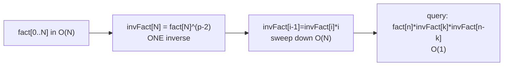

# Binomial Coefficients C(n, k) — Middle Level

> **Focus:** *Why* the modular method works and *when* to choose each approach. We go deep on computing `C(n, k) mod p` via precomputed factorials and modular inverses, the linear inverse-factorial trick, and the core identities — **Pascal's identity, symmetry, the hockey-stick identity, and Vandermonde's identity** — that turn brute-force counting into closed forms. We also map out when `O(n²)` DP beats the factorial method and vice versa.

---

## Table of Contents

1. [Introduction](#introduction)
2. [Deeper Concepts](#deeper-concepts)
3. [Comparison with Alternatives](#comparison-with-alternatives)
4. [Advanced Patterns](#advanced-patterns)
5. [The Identities Toolbox](#the-identities-toolbox)
6. [Modular C(n,k): The Complete Recipe](#modular-cnk-the-complete-recipe)
7. [Code Examples](#code-examples)
8. [Error Handling](#error-handling)
9. [Performance Analysis](#performance-analysis)
10. [Best Practices](#best-practices)
11. [Visual Animation](#visual-animation)
12. [Summary](#summary)

---

## Introduction

At junior level you learned three routes to `C(n, k)`: Pascal's triangle, the multiplicative formula, and factorials-plus-inverse mod a prime. At middle level you turn those routes into engineering decisions and prove to yourself *why* they are correct:

- **Why** does `fact[n] · invFact[k] · invFact[n−k] (mod p)` give the right answer, and why must `p` be prime?
- **How** do you precompute all inverse factorials with a *single* modular inverse instead of `n` of them?
- **When** does the `O(n²)` Pascal DP beat the `O(N)`-precompute factorial method, and when is it the reverse?
- **Which** identity — Pascal, symmetry, hockey-stick, Vandermonde — collapses a counting problem into a formula?
- **What** breaks when the modulus is not prime or `n` is enormous, and which sibling topic (`24-lucas-theorem`, `33-factorial-mod-p`) takes over?

These are the questions that separate "I can call `comb()`" from "I can choose the right method, size the precompute, and prove the answer."

---

## Deeper Concepts

### Why the modular factorial method needs a prime

The closed form is `C(n, k) = n! / (k! (n−k)!)`. Under a modulus there is no "÷"; you multiply by a **modular inverse**. The inverse of `a` mod `m` is the `x` with `a·x ≡ 1 (mod m)`, and it exists **iff `gcd(a, m) = 1`**. When `m = p` is prime, every `a` in `1 … p−1` is coprime to `p`, so every inverse exists and **Fermat's little theorem** gives it cheaply: `a⁻¹ ≡ a^(p−2) (mod p)` (sibling `05-fermat-euler`).

If `p` is *composite*, some factor of `k!` or `(n−k)!` may share a factor with `p`, the inverse may not exist, and the formula collapses. That is exactly why a non-prime modulus pushes you to **Lucas' theorem** (prime modulus, huge `n`) or **factorial-mod-prime-power + CRT** (`33-factorial-mod-p`, `06-crt`). The prime requirement is not a convenience — it is what makes the inverse well-defined for the whole range `1 … p−1`.

### Why the inverse-factorial recurrence works

Computing `n` separate inverses (`invFact[i] = pow(fact[i], p−2, p)`) costs `O(n log p)`. There is a much better way using **one** inverse:

```
invFact[n] = (n!)⁻¹ mod p          # one Fermat inverse
invFact[i−1] = invFact[i] · i mod p
```

Why is the recurrence valid? Because `(i−1)! = i! / i`, so `(i−1)!⁻¹ = (i!⁻¹) · i` under the modulus. Concretely: `invFact[i] = (i!)⁻¹`, and multiplying by `i` cancels the `i` factor in `i!`, leaving `((i−1)!)⁻¹`. This turns `O(n log p)` into `O(n + log p)` — one inverse plus `n` cheap multiplies. It is the single most important efficiency idea in modular combinatorics.

### Pascal's identity — the DP recurrence

```
C(n, k) = C(n−1, k−1) + C(n−1, k),    with C(n,0)=C(n,n)=1.
```

This is a textbook DP recurrence: each value depends on two values in the previous row, computed with **addition only**. The cost to fill rows `0 … n` is `1 + 2 + … + (n+1) = O(n²)`, and it works **without any division or modular inverse** — even modulo a composite number, because addition is always well-defined. That property (no division) is what makes the DP the right tool when `p` is *not* prime but `n` is small enough for an `O(n²)` table.

### Multiplicative formula — integer exactness

```
C(n, k) = ∏_{i=1}^{k} (n − k + i) / i
```

The non-obvious fact: the partial product after step `i` equals `C(n−k+i, i)`, which is always an integer, so the running division by `i` is always exact. This is why you must do `result * (n−k+i) / i` in that order — multiply first, then divide — never `result / i * (n−k+i)`.

---

## Comparison with Alternatives

### Method selection

| Method | Time | Space | Modulus | Best when |
|--------|------|-------|---------|-----------|
| **Pascal DP (full table)** | O(n²) | O(n²) | any (prime or not) | Need *all* `C(i,j)` for `i,j ≤ n`; `n ≲ 5000`. |
| **Pascal DP (one row)** | O(n²) total | O(n) | any | Need one full row `n`. |
| **Multiplicative formula** | O(min(k,n−k)) | O(1) | none (exact/BigInt) | A few values, no modulus. |
| **Factorials + inverse (mod p)** | O(N) setup, O(1)/query | O(N) | **prime** | Many queries mod a prime, large `n`. |
| **Single C mod p (no table)** | O(k + log p) | O(1) | prime | One query, no room for a table. |
| **Lucas' theorem** | O(p + log_p n) | O(p) | prime, **huge n** | `n` exceeds precompute range (sibling `24`). |
| **Factorial mod p^e + CRT** | varies | varies | prime power / composite | Non-prime modulus (sibling `33`, `06`). |

### Pascal DP vs factorial method — the decision

| Criterion | Pascal DP | Factorial + inverse |
|-----------|-----------|---------------------|
| Modulus must be prime? | No (addition only) | **Yes** |
| Cost to set up | O(n²) | O(n) |
| Cost per query | O(1) (lookup) | O(1) (lookup) |
| Memory | O(n²) full / O(n) one-row | O(n) |
| Max practical `n` | ~5,000 (table) | ~10⁷–10⁸ |
| Needs modular inverse? | No | Yes |

**Choose Pascal DP when:** `n` is small (`≲ 5000`), you need many `(n,k)` pairs, *or* the modulus is composite (no inverse needed).
**Choose factorials + inverse when:** `n` is large (`≥ 10⁴`), the modulus is a **prime**, and you have many queries — the `O(N)` setup crushes `O(n²)`.

---

## Advanced Patterns

### Pattern: Linear inverse-factorial precompute

#### Go

```go
package main

import "fmt"

const MOD = 1_000_000_007

var fact, invFact []int64

func powMod(a, e, m int64) int64 {
	a %= m
	r := int64(1)
	for e > 0 {
		if e&1 == 1 {
			r = r * a % m
		}
		a = a * a % m
		e >>= 1
	}
	return r
}

func build(n int) {
	fact = make([]int64, n+1)
	invFact = make([]int64, n+1)
	fact[0] = 1
	for i := 1; i <= n; i++ {
		fact[i] = fact[i-1] * int64(i) % MOD
	}
	invFact[n] = powMod(fact[n], MOD-2, MOD) // ONE inverse
	for i := n; i > 0; i-- {
		invFact[i-1] = invFact[i] * int64(i) % MOD
	}
}

func C(n, k int) int64 {
	if k < 0 || k > n {
		return 0
	}
	return fact[n] * invFact[k] % MOD * invFact[n-k] % MOD
}

func main() {
	build(1_000_000)
	fmt.Println(C(5, 2))              // 10
	fmt.Println(C(1_000_000, 3))      // big mod p
}
```

#### Java

```java
public class CombMod {
    static final long MOD = 1_000_000_007L;
    static long[] fact, invFact;

    static long powMod(long a, long e, long m) {
        a %= m; long r = 1;
        while (e > 0) {
            if ((e & 1) == 1) r = r * a % m;
            a = a * a % m;
            e >>= 1;
        }
        return r;
    }

    static void build(int n) {
        fact = new long[n + 1];
        invFact = new long[n + 1];
        fact[0] = 1;
        for (int i = 1; i <= n; i++) fact[i] = fact[i - 1] * i % MOD;
        invFact[n] = powMod(fact[n], MOD - 2, MOD);   // ONE inverse
        for (int i = n; i > 0; i--) invFact[i - 1] = invFact[i] * i % MOD;
    }

    static long C(int n, int k) {
        if (k < 0 || k > n) return 0;
        return fact[n] * invFact[k] % MOD * invFact[n - k] % MOD;
    }

    public static void main(String[] args) {
        build(1_000_000);
        System.out.println(C(5, 2));            // 10
        System.out.println(C(1_000_000, 3));    // big mod p
    }
}
```

#### Python

```python
MOD = 1_000_000_007

def build(n):
    fact = [1] * (n + 1)
    for i in range(1, n + 1):
        fact[i] = fact[i - 1] * i % MOD
    inv_fact = [1] * (n + 1)
    inv_fact[n] = pow(fact[n], MOD - 2, MOD)   # ONE inverse
    for i in range(n, 0, -1):
        inv_fact[i - 1] = inv_fact[i] * i % MOD
    return fact, inv_fact


def C(n, k, fact, inv_fact):
    if k < 0 or k > n:
        return 0
    return fact[n] * inv_fact[k] % MOD * inv_fact[n - k] % MOD


if __name__ == "__main__":
    fact, inv_fact = build(1_000_000)
    print(C(5, 2, fact, inv_fact))         # 10
    print(C(1_000_000, 3, fact, inv_fact)) # big mod p
```

### Pattern: One-row Pascal in O(n) space (composite modulus safe)

```python
def pascal_row_mod(n, mod):
    """Row n of Pascal's triangle mod any modulus (no inverse needed)."""
    row = [1] * (n + 1)
    for i in range(1, n + 1):
        for k in range(i - 1, 0, -1):
            row[k] = (row[k] + row[k - 1]) % mod   # addition only
    return row
```

Because this uses **only addition**, it works for *any* modulus — prime or composite — making it the fallback when the factorial method's inverse does not exist.

### Pattern: Single C(n, k) mod p without a table

```python
def comb_single(n, k, mod):
    """One C(n,k) mod prime p in O(k + log p), no precompute."""
    if k < 0 or k > n:
        return 0
    k = min(k, n - k)
    num = 1
    for i in range(k):
        num = num * (n - i) % mod        # n·(n-1)···(n-k+1)
    den = 1
    for i in range(1, k + 1):
        den = den * i % mod              # k!
    return num * pow(den, mod - 2, mod) % mod   # one Fermat inverse
```

---

## The Identities Toolbox

These four identities turn many counting problems into closed forms. Each is proved formally in [`professional.md`](./professional.md); here we state, illustrate, and *use* them.

### 1. Pascal's identity (recurrence + sum rule)

```
C(n, k) = C(n−1, k−1) + C(n−1, k)
```

Combinatorial proof: fix one element. Subsets of size `k` either contain it (`C(n−1,k−1)` ways) or do not (`C(n−1,k)` ways). This is the engine of the triangle.

### 2. Symmetry

```
C(n, k) = C(n, n − k)
```

Choosing `k` to keep ⟺ choosing `n−k` to discard. Use it to compute with the smaller index.

### 3. Hockey-stick identity (column sums)

```
∑_{i=r}^{n} C(i, r) = C(n + 1, r + 1)
```

Sum a "diagonal" of the triangle starting at `C(r, r)` going down, and you land on the entry one step down-and-right — drawing a hockey-stick shape. Example with `r = 2`:

```
C(2,2) + C(3,2) + C(4,2) + C(5,2) = 1 + 3 + 6 + 10 = 20 = C(6, 3).
```

Use: collapses a running sum of binomials into a single binomial — common in counting "at least"/cumulative problems.

### 4. Vandermonde's identity (convolution)

```
C(m + n, r) = ∑_{k=0}^{r} C(m, k) · C(n, r − k)
```

Combinatorial proof: to pick `r` from a group of `m` reds plus `n` blues, choose `k` reds and `r−k` blues, summed over all splits `k`. Example `m = n = 2, r = 2`:

```
C(4, 2) = C(2,0)C(2,2) + C(2,1)C(2,1) + C(2,2)C(2,0)
        = 1·1 + 2·2 + 1·1 = 6.   ✓
```

Use: convolutions of binomials, polynomial coefficient products, and as a stepping stone to generating functions (sibling `22-polynomial-operations`).

### Other handy facts

| Identity | Statement | Use |
|----------|-----------|-----|
| Row sum | `∑_{k=0}^{n} C(n,k) = 2ⁿ` | Total number of subsets of an `n`-set. |
| Alternating sum | `∑_{k=0}^{n} (−1)^k C(n,k) = 0` (`n ≥ 1`) | Inclusion-exclusion (sibling `26`). |
| Absorption | `k·C(n,k) = n·C(n−1,k−1)` | Re-index sums; derive expected values. |
| Binomial theorem | `(x+y)ⁿ = ∑_k C(n,k) xᵏ y^{n−k}` | Coefficient extraction; why "binomial." |

---

## Modular C(n,k): The Complete Recipe

Putting it together, here is the canonical contest/production setup:

```text
GIVEN: prime modulus p (e.g. 10^9 + 7), max n = N, many queries.

ONE-TIME PRECOMPUTE  (O(N)):
  fact[0] = 1
  for i in 1..N:  fact[i] = fact[i-1] * i mod p
  invFact[N] = fact[N]^(p-2) mod p            # single Fermat inverse
  for i in N..1:  invFact[i-1] = invFact[i] * i mod p

PER QUERY  (O(1)):
  if k < 0 or k > n: return 0
  return fact[n] * invFact[k] % p * invFact[n-k] % p
```

Why each line:
- `fact[i]` accumulates `i!` mod `p` with one multiply per step.
- The single `pow(fact[N], p−2, p)` is the only `O(log p)` inverse you ever compute.
- The downward sweep fills every `invFact[i]` using `(i−1)!⁻¹ = i!⁻¹ · i`.
- The query divides `n!` by `k!` and `(n−k)!` via their precomputed inverses.

This is `O(N)` setup, `O(1)` per query, and correct for **any** `0 ≤ k, n ≤ N` because the boundary guard handles out-of-range `k`.



---

## Code Examples

### Hockey-stick and Vandermonde verified against brute force

#### Python

```python
import math

def hockey_stick(n, r):
    """Verify sum_{i=r}^{n} C(i, r) == C(n+1, r+1)."""
    lhs = sum(math.comb(i, r) for i in range(r, n + 1))
    rhs = math.comb(n + 1, r + 1)
    return lhs, rhs


def vandermonde(m, n, r):
    """Verify C(m+n, r) == sum_k C(m, k) C(n, r-k)."""
    lhs = math.comb(m + n, r)
    rhs = sum(math.comb(m, k) * math.comb(n, r - k) for k in range(r + 1))
    return lhs, rhs


if __name__ == "__main__":
    print(hockey_stick(5, 2))   # (20, 20)
    print(vandermonde(2, 2, 2)) # (6, 6)
    print(vandermonde(5, 4, 3)) # (84, 84)
```

#### Go

```go
package main

import "fmt"

func choose(n, k int64) int64 {
	if k < 0 || k > n {
		return 0
	}
	if k > n-k {
		k = n - k
	}
	r := int64(1)
	for i := int64(1); i <= k; i++ {
		r = r * (n - k + i) / i
	}
	return r
}

func main() {
	// hockey-stick: sum_{i=2}^{5} C(i,2) == C(6,3)
	var s int64
	for i := int64(2); i <= 5; i++ {
		s += choose(i, 2)
	}
	fmt.Println(s, choose(6, 3)) // 20 20

	// vandermonde: C(4,2) == sum_k C(2,k)C(2,2-k)
	var v int64
	for k := int64(0); k <= 2; k++ {
		v += choose(2, k) * choose(2, 2-k)
	}
	fmt.Println(v, choose(4, 2)) // 6 6
}
```

#### Java

```java
public class Identities {
    static long choose(long n, long k) {
        if (k < 0 || k > n) return 0;
        if (k > n - k) k = n - k;
        long r = 1;
        for (long i = 1; i <= k; i++) r = r * (n - k + i) / i;
        return r;
    }

    public static void main(String[] args) {
        long s = 0;
        for (long i = 2; i <= 5; i++) s += choose(i, 2);
        System.out.println(s + " " + choose(6, 3));   // 20 20

        long v = 0;
        for (long k = 0; k <= 2; k++) v += choose(2, k) * choose(2, 2 - k);
        System.out.println(v + " " + choose(4, 2));   // 6 6
    }
}
```

---

## Error Handling

| Scenario | What goes wrong | Correct approach |
|----------|-----------------|------------------|
| Inverse with composite modulus | `fact[k]⁻¹` may not exist | Use Pascal DP, or Lucas (`24`) / prime-power (`33`). |
| Query `n > N` (precompute size) | Index out of bounds | Size `N` to the true max `n`; or compute single-value. |
| `n` enormous (`> 10⁹`) | Can't precompute `n!` at all | Use **Lucas' theorem** (`24-lucas-theorem`). |
| Overflow before `% p` | `fact[i-1] * i` exceeds 64-bit | Reduce mod `p` immediately after each multiply. |
| Wrong `invFact` chain | Built down without seeding `invFact[N]` | Seed `invFact[N]` with one inverse, then sweep. |
| Negative intermediate (Go/Java) | `n − k + i` or a subtraction goes negative | Guard `k > n`; normalize residues to `[0, p)`. |
| Hockey-stick off by one | Summed `C(i,r)` over wrong range | Range is `i = r … n`, result is `C(n+1, r+1)`. |

---

## Performance Analysis

| Task | Scale | Cost |
|------|-------|------|
| Precompute `fact`, `invFact` up to `N` | `N ≤ 10⁷` | `O(N)` — well under a second |
| One query `C(n,k) mod p` after precompute | any `n ≤ N` | `O(1)` |
| Full Pascal table | `n ≤ 5000` | `O(n²)` ≈ 1.25·10⁷ cells |
| One-row Pascal | `n ≤ 10⁶` | `O(n²)` total — slow for big `n` |
| Single `C(n,k) mod p`, no table | any | `O(k + log p)` |
| Lucas' theorem, huge `n` | `n` astronomically large | `O(p + log_p n)` (sibling `24`) |

The decisive numbers: the **`O(N)` precompute plus `O(1)` queries** dominate everything once you have more than a handful of queries. The `O(n²)` Pascal table is only competitive when `n` is small *and* you need many `(n, k)` pairs or the modulus is composite.

```python
import time

def bench_precompute(N):
    start = time.perf_counter()
    build(N)
    return time.perf_counter() - start

# Typical: N = 10^7 precomputes in well under a second in CPython.
```

---

## Worked Examples

### Example A — Why `n < p` matters (small prime)

Take `p = 7`. The factorial method is valid only while `n < 7`. Build the tables:

```
fact   = [1, 1, 2, 6, 24%7=3, 120%7=1, 720%7=6]      (indices 0..6)
       = [1, 1, 2, 6, 3, 1, 6]
```

Now `C(6, 3) = 20`, and `20 mod 7 = 6`. Check the formula:

```
fact[6]·invFact[3]·invFact[3] mod 7
```

`invFact[3] = (6)⁻¹ mod 7`. Since `6·6 = 36 ≡ 1 (mod 7)`, `invFact[3] = 6`. So

```
6 · 6 · 6 = 216 ≡ 216 − 30·7 = 216 − 210 = 6 (mod 7).   ✓
```

It matches `20 mod 7 = 6`. But the moment `n = 7`, `fact[7] = 5040 ≡ 0 (mod 7)` (because `7 | 7!`), and the inverse of `0` does not exist — the method breaks, and you must switch to **Lucas' theorem** (sibling `24`). For `p = 10⁹+7` you essentially never hit `n ≥ p` in practice, which is why the straight method is the contest default.

### Example B — A query trace mod 10⁹+7

Compute `C(10, 4) mod (10⁹+7)`. The exact value is `210`. With tables built to `N ≥ 10`:

```
C(10,4) = fact[10] · invFact[4] · invFact[6] mod p.
```

Each factor is a residue in `[0, p)`. Because `210 < p`, the result is exactly `210` — small binomials mod a big prime are just the binomials themselves. The modular machinery only "kicks in" (wraps around) once `C(n,k) ≥ p`.

### Example C — Hockey-stick collapses a loop

Suppose a problem asks for `∑_{i=2}^{n} C(i, 2)` for many `n`. Instead of an `O(n)` loop per query, hockey-stick gives a **closed form**: the sum is `C(n+1, 3)`, an `O(1)` query after precompute. This is the practical payoff of knowing the identities — they turn `O(n)` sums into `O(1)` lookups.

---

## Best Practices

- **Precompute once** if you will answer many queries; never recompute factorials per query.
- **Compute all inverse factorials from one Fermat inverse** via `invFact[i−1] = invFact[i]·i`.
- **Use Pascal DP for composite moduli** — it needs no inverse and is correct mod anything.
- **Pick the method by `n` and modulus:** small `n` or composite mod → DP; large `n`, prime mod → factorials.
- **Reduce mod `p` after every multiply** to avoid overflow in Go/Java.
- **Verify identities against `math.comb` / a brute force** on small inputs before relying on a derived formula.
- **Escalate to Lucas (`24`) or prime-power (`33`)** the moment `n` exceeds your precompute range or the modulus is not prime.

---

## Visual Animation

> See [`animation.html`](./animation.html) for an interactive view.
>
> The middle-level animation highlights:
> - Pascal's triangle filling via `C(n,k)=C(n−1,k−1)+C(n−1,k)`, with the two parent cells highlighted.
> - The `fact` / `invFact` table being built — including the single Fermat-inverse seed and the downward sweep.
> - A live `C(n,k) mod p` query lighting up the three cells `fact[n]`, `invFact[k]`, `invFact[n−k]`.
> - Editable `n`, `k`, `p` so you can watch the same value appear in both the triangle and the factorial formula.

---

## Summary

The modular method `C(n,k) ≡ fact[n] · invFact[k] · invFact[n−k] (mod p)` works because, under a **prime** `p`, every factorial has a modular inverse (Fermat: `a⁻¹ ≡ a^(p−2)`), and the **inverse-factorial recurrence** `invFact[i−1] = invFact[i]·i` computes all of them from a *single* inverse — giving `O(N)` setup and `O(1)` queries. When the modulus is composite or you need values mod anything, the division-free **Pascal DP** (`O(n²)`, addition only) is the safe alternative. The four core identities — **Pascal** (the recurrence), **symmetry** (`C(n,k)=C(n,n−k)`), **hockey-stick** (`∑C(i,r)=C(n+1,r+1)`), and **Vandermonde** (`C(m+n,r)=∑C(m,k)C(n,r−k)`) — turn brute-force counting into closed forms and underlie Catalan numbers, stars-and-bars, and inclusion-exclusion (siblings `25`, `28`, `26`). When `n` outgrows your precompute or `p` is not prime, hand off to **Lucas' theorem** (`24`) and **factorial-mod-prime-power** (`33`).

Next step: continue to [`senior.md`](./senior.md) for high-throughput query systems, precompute sizing, overflow engineering, and when Lucas / CRT become mandatory.
