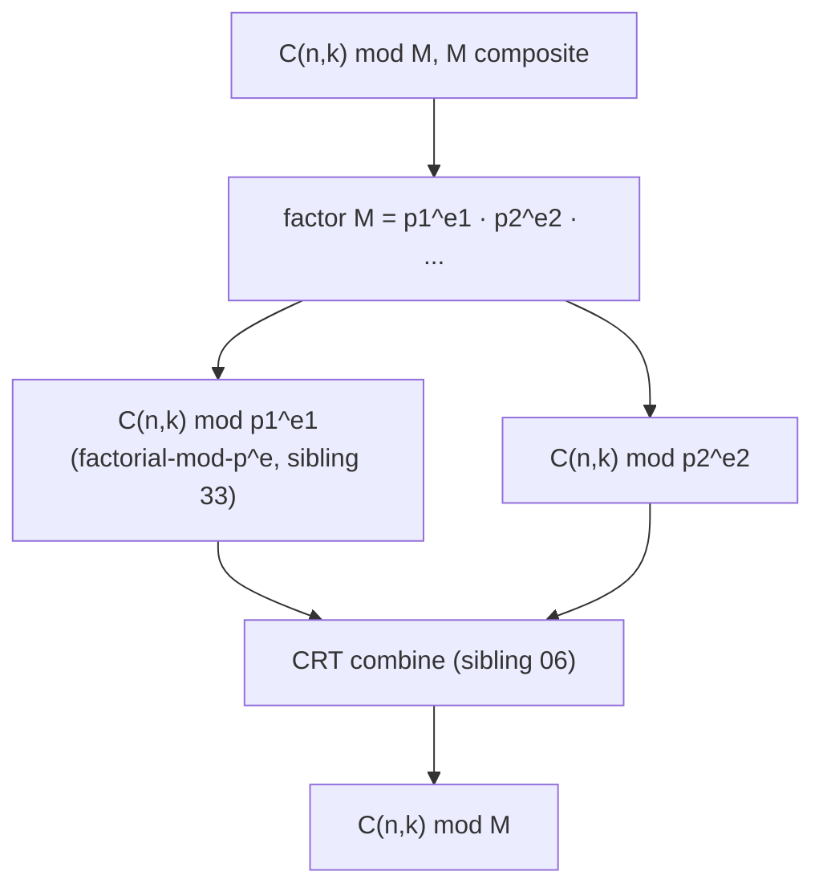
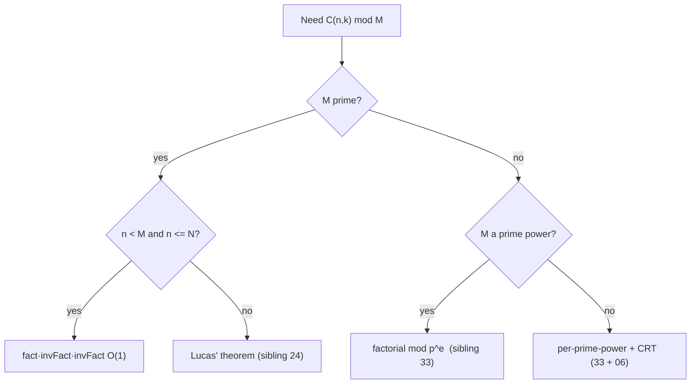
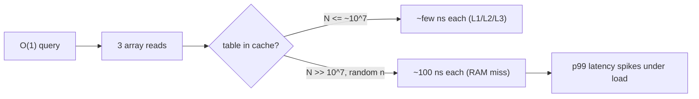

# Binomial Coefficients C(n, k) — Senior Level

> Computing `C(n, k)` is trivial until it sits on a hot path: a combinatorics service answering millions of queries, a probability engine summing thousands of binomials per request, or a contest solution that must answer `10⁶` queries mod `10⁹+7` inside a 1-second limit. At that point the questions stop being "what is the formula" and become "how big must the precompute be, where does the multiply overflow, when is the modulus prime, and when does `n` force me into Lucas or CRT." This document treats those decisions in production terms.

## Table of Contents

1. [Introduction](#1-introduction)
2. [High-Throughput Query Systems](#2-high-throughput-query-systems)
3. [Sizing the Precompute](#3-sizing-the-precompute)
4. [Overflow and Numeric Engineering](#4-overflow-and-numeric-engineering)
5. [When the Standard Method Fails](#5-when-the-standard-method-fails)
6. [Lucas, CRT, and Prime Powers](#6-lucas-crt-and-prime-powers)
6b. [Inverse Strategy at Scale](#6b-inverse-strategy-at-scale)
7. [Comparison with Alternatives](#7-comparison-with-alternatives)
8. [Code Examples](#8-code-examples)
9. [Capacity Planning and Cost Model](#9-capacity-planning-and-cost-model)
10. [Observability and Testing](#10-observability-and-testing)
10b. [Case Study — A Probability/Allocation Service](#10b-case-study--a-probabilityallocation-service)
11. [Failure Modes](#11-failure-modes)
11b. [Batch vs Online and Cache Behavior](#11b-batch-vs-online-and-cache-behavior)
11c. [Method-Selection Cheat Sheet](#11c-method-selection-cheat-sheet)
12. [Summary](#12-summary)

---

## 1. Introduction

The senior question is never "how do I compute one `C(n,k)`" — it is "what is the *system* around binomial coefficients, and what breaks at scale or under adversarial input?" Three production guises share one engine (precomputed factorials + modular inverse):

1. **Combinatorics-as-a-service** — an endpoint answering `C(n,k) mod p` (probabilities, lattice-path counts, allocation counts). Throughput and tail latency matter; the precompute is a warm-up cost.
2. **Inner-loop combinatorics** — DP transitions, inclusion-exclusion sums (sibling `26`), and generating-function coefficients (sibling `22`) that call `C(n,k)` thousands of times per request.
3. **Large-`n` / exotic-modulus regimes** — `n` beyond any precomputable range (→ **Lucas**, `24`), or a composite modulus (→ **factorial mod p^e + CRT**, `33` + `06`).

All three reduce to the same discipline: *fix the modulus class, size the precompute to the true maximum `n`, keep every multiply overflow-safe, and degrade gracefully when `n` or the modulus leaves the comfortable regime.*

---

## 2. High-Throughput Query Systems

### 2.1 The precompute-once architecture

For a service answering many `C(n,k) mod p` queries, the winning pattern is unambiguous: **precompute `fact` and `invFact` once at startup (or first use), then serve each query in `O(1)`.** The `O(N)` table build is a one-time amortized cost; per-query work is three array reads and two modular multiplies.

```mermaid
graph TD
    Client -->|"C(n,k) mod p"| API
    API --> Cache{tables built?}
    Cache -->|no, warm-up| Build["build fact/invFact O(N)"]
    Build --> Table[("fact[], invFact[]")]
    Cache -->|yes| Table
    Table -->|"fact[n]*invFact[k]*invFact[n-k]"| Resp[O(1) response]
```

Key engineering choices:
- **Immutable after build.** Once `fact`/`invFact` are populated they are read-only, so they are trivially safe to share across threads/goroutines with **no locking** (see §8).
- **Warm-up vs lazy build.** Build at process start for predictable latency; or lazily on first query if memory is tight and traffic is sparse. Either way, build *once*.
- **Right-sized `N`.** Over-provisioning wastes memory; under-provisioning forces a costly rebuild or a slow per-query fallback (§3).

### 2.2 Throughput math

With `fact`/`invFact` resident in cache, a single query is ~5 arithmetic ops. On a modern core that is tens of millions of queries per second per core, fully parallelizable because the tables are read-only. The bottleneck is rarely the math — it is memory bandwidth if `N` is huge (a `10⁸`-entry `int64` table is 800 MB, blowing the cache and possibly RAM). That memory wall is the real senior constraint, not CPU.

### 2.3 Batching and reuse

When a single request needs many binomials (e.g. a Vandermonde convolution or an inclusion-exclusion sum), compute them all from the shared tables in one pass — never rebuild per call. If the request needs `C(n, 0..n)` (a whole row), reading `n+1` table entries is `O(n)` and beats any re-derivation.

---

## 3. Sizing the Precompute

The single most consequential decision is the precompute size `N`. It must satisfy `N ≥ max(n)` over *all* queries the process will ever serve.

| Source of `max n` | How to bound it |
|-------------------|-----------------|
| Problem constraints (contest) | Read the stated bound on `n`; set `N` to it (plus slack for `n+1` in identities like hockey-stick). |
| API with declared limits | Enforce `n ≤ N` at the edge; reject or fall back beyond it. |
| Open-ended `n` | You **cannot** precompute; use single-value `O(k + log p)`, or Lucas if `n` is huge (§6). |

### 3.1 Memory budget

A factorial/inverse-factorial pair of `int64` costs `16·N` bytes. Practical ceilings:

| N | `fact`+`invFact` memory | Verdict |
|---|--------------------------|---------|
| 10⁶ | ~16 MB | comfortable |
| 10⁷ | ~160 MB | fine on a server |
| 10⁸ | ~1.6 GB | risky; consider blocking/segmenting |
| 10⁹+ | impossible to store | must use Lucas / single-value |

### 3.2 The `n + 1` slack

Identities like hockey-stick (`C(n+1, r+1)`) and many DP transitions touch `n+1`. **Size `N` to at least `max_n + 1`** (a common off-by-one production bug is sizing to exactly `max_n` and then indexing `fact[n+1]`).

### 3.3 When you cannot precompute

If `n` can be up to `10¹⁸` but `k` is small, use the **single-value** form: multiply `k` numerator terms, multiply `k!`, one Fermat inverse — `O(k + log p)`, `O(1)` memory. This is the right tool when `k` is bounded even though `n` is not. If both `n` and `k` are large *and* `n` exceeds any table, only **Lucas** (§6) remains.

---

## 4. Overflow and Numeric Engineering

### 4.1 The 64-bit multiply trap

Under `p = 10⁹+7`, two residues are each `< 10⁹`, so their product is `< 10¹⁸` — which **fits** in signed 64-bit (`max ≈ 9.2·10¹⁸`). Good. But chaining `fact[n] * invFact[k] * invFact[n-k]` without reducing in between produces `< 10²⁷`, which overflows. **You must reduce after every multiply:**

```text
fact[n] * invFact[k] % p * invFact[n-k] % p      # two reductions, never overflows
```

### 4.2 Larger moduli need 128-bit

If `p` approaches or exceeds `~3·10⁹`, then `p·p` exceeds 64-bit, and even a single multiply overflows. Then:
- **Go:** use `math/big` for the multiply, or `bits.Mul64`/`bits.Rem64` for a 128-bit intermediate, or Montgomery multiplication (sibling `16-montgomery-multiplication`).
- **Java:** use `Math.multiplyHigh` + careful reduction, or `BigInteger`, or `Math.floorMod` with 128-bit emulation.
- **Python:** integers are arbitrary precision — no overflow, but multiplies on huge ints are slower; reduce mod `p` to keep them small.

### 4.3 Exact (non-modular) big values

When the problem wants the *exact* `C(n,k)` (not mod anything) and it exceeds 64-bit (`C(67,33)` already does), use BigInt (`math/big`, `BigInteger`, Python int). The multiplicative form with `min(k,n−k)` keeps the intermediate values as small as possible, which matters because BigInt multiply cost grows with operand size.

### 4.4 Numerical stability — never use floating point

A tempting "shortcut" is `C(n,k) ≈ exp(lgamma(n+1) − lgamma(k+1) − lgamma(n−k+1))`. This is **only** acceptable when an approximate value is genuinely fine (e.g. a heuristic). For exact counts or modular answers it is wrong: `double` has 52 bits of mantissa, so any `C(n,k) > 2⁵³ ≈ 9·10¹⁵` loses its low-order digits, and the result is *not* recoverable. Senior rule: **integer/modular arithmetic for exact answers, floating point only for explicitly approximate use cases.** The professional file quantifies the error.

---

## 5. When the Standard Method Fails

The `fact[n]·invFact[k]·invFact[n−k] mod p` recipe has three hard preconditions. Violating any one silently produces wrong answers:

| Precondition | If violated | Remedy |
|--------------|-------------|--------|
| `p` is **prime** | Some factorial has no inverse | Lucas needs prime; for composite use prime-power factor + CRT (`33`, `06`). |
| `n ≤ N` (precompute range) | Out-of-bounds or impossible table | Lucas (`24`) for huge `n`; single-value for small `k`. |
| `k!`, `(n−k)!` not divisible by `p` | Inverse of `0 mod p` undefined | Happens when `n ≥ p`: factorials hit a multiple of `p`. Use Lucas. |

The third row is the subtle one. As soon as `n ≥ p`, `n!` contains the factor `p`, so `fact[n] ≡ 0 (mod p)` and `invFact` of anything `≥ p` is the inverse of `0` — undefined. **The straight factorial method is only valid for `n < p`.** For competitive `p = 10⁹+7` you rarely hit `n ≥ p`, but for small primes (e.g. `p = 13` in a Lucas sub-problem) you hit it immediately — which is *exactly* why Lucas exists.

---

## 6. Lucas, CRT, and Prime Powers

These are sibling topics; the senior skill is knowing **when** to reach for each and how they compose.

### 6.1 Lucas' theorem — huge `n`, small prime `p`

When `n` (and `k`) can be `≥ p`, **Lucas' theorem** computes `C(n,k) mod p` from the **base-`p` digits** of `n` and `k`:

```
Write n = (n_t … n_1 n_0)_p,  k = (k_t … k_1 k_0)_p in base p.
C(n, k) ≡ ∏_i C(n_i, k_i)  (mod p).
```

Each digit `C(n_i, k_i)` has both arguments `< p`, so you precompute factorials up to `p−1` once and answer each digit in `O(1)`. Total `O(p + log_p n)`. This is the canonical tool when `n` is astronomically large but `p` is small. Full treatment in sibling **`24-lucas-theorem`**.

### 6.2 Composite modulus — CRT over prime powers

When the modulus `M` is composite, factor it `M = ∏ p_i^{e_i}`, compute `C(n,k) mod p_i^{e_i}` for each prime power (via **Andrew Granville / factorial-mod-prime-power** techniques, sibling `33-factorial-mod-p`), then recombine the residues with the **Chinese Remainder Theorem** (sibling `06-crt`):



### 6.3 Decision flow



---

## 6b. Inverse Strategy at Scale

The factorial method's `O(1)` query hinges on having `invFact[]` precomputed. But *how* you obtain those inverses has its own engineering trade-offs, especially when the modulus is composite or you cannot precompute a full range.

### 6b.1 Three ways to get modular inverses

| Strategy | Cost | Precondition | When to use |
|----------|------|--------------|-------------|
| Fermat per value (`a^{p−2}`) | `O(n log p)` for `n` values | prime `p` | Never for a whole range — wasteful. |
| Inverse-factorial recurrence | `O(n + log p)` | prime `p` | **Default** for `invFact[]`. |
| Extended Euclid per value | `O(log m)` each | `gcd(a,m)=1` (any `m`) | One inverse mod a composite `m`. |
| Batch (prefix-product) inverse | `O(n + log p)` | prime `p` | Inverting `n` *arbitrary* residues, not factorials. |

### 6b.2 Batch inversion (Montgomery's trick)

To invert `n` arbitrary values `a₁,…,aₙ` mod a prime with a *single* expensive inverse:

```text
prefix[0] = 1
prefix[i] = prefix[i-1] · a_i           # running products
inv_all   = (prefix[n])^{p-2}            # ONE inverse
for i = n down to 1:
    inv[a_i] = inv_all · prefix[i-1]
    inv_all  = inv_all · a_i
```

This is the same idea as the inverse-factorial recurrence generalized to arbitrary inputs: `O(n + log p)` instead of `O(n log p)`. It matters when you must invert many *non-factorial* quantities (e.g. denominators in a Lagrange interpolation, sibling `22`).

### 6b.3 When extended Euclid wins

For a **single** inverse mod a **composite** `m` (where Fermat does not apply), the extended Euclidean algorithm computes `a⁻¹` in `O(log m)` with no factorization — strictly better than `a^{φ(m)−1}` which needs `φ(m)` (sibling `07-extended-euclidean-modular-inverse`). This is the right tool when a single composite-modulus inverse appears outside the binomial hot path.

---

## 7. Comparison with Alternatives

| Approach | Setup | Per query | Modulus | Max `n` | Production use |
|----------|-------|-----------|---------|---------|----------------|
| Pascal DP (table) | O(n²) | O(1) | any | ~5,000 | Small `n`, composite mod, many pairs |
| Factorials + inverse | O(N) | O(1) | **prime**, `n < p` | ~10⁷ | The default for prime mod |
| Single-value mult. | none | O(k+log p) | prime | up to 10¹⁸ if `k` small | Bounded `k`, no table room |
| Lucas | O(p) | O(log_p n) | prime, small | astronomically large | Huge `n`, small prime |
| Prime-power + CRT | O(per-factor) | varies | composite | large | Non-prime modulus |
| BigInt exact | none | O(k·digits) | none | any | Exact values, no modulus |

**Choose the factorial method** when the modulus is a prime larger than every `n` you serve and `N` fits in memory — it is the cheapest per-query option. **Escalate** to Lucas when `n ≥ p`, and to prime-power+CRT when the modulus is composite.

---

## 8. Code Examples

### 8.1 Thread-safe, build-once combinatorics service (Go)

```go
package combo

import (
	"sync"
)

const MOD = 1_000_000_007

type Combinatorics struct {
	fact, invFact []int64
}

var (
	instance *Combinatorics
	once      sync.Once
)

func powMod(a, e, m int64) int64 {
	a %= m
	r := int64(1)
	for e > 0 {
		if e&1 == 1 {
			r = r * a % m
		}
		a = a * a % m
		e >>= 1
	}
	return r
}

// Get builds the tables exactly once (thread-safe) and returns the shared,
// read-only instance. Safe for concurrent queries with no locking afterward.
func Get(n int) *Combinatorics {
	once.Do(func() {
		fact := make([]int64, n+1)
		invFact := make([]int64, n+1)
		fact[0] = 1
		for i := 1; i <= n; i++ {
			fact[i] = fact[i-1] * int64(i) % MOD
		}
		invFact[n] = powMod(fact[n], MOD-2, MOD) // single inverse
		for i := n; i > 0; i-- {
			invFact[i-1] = invFact[i] * int64(i) % MOD
		}
		instance = &Combinatorics{fact: fact, invFact: invFact}
	})
	return instance
}

// C is O(1) and lock-free: the tables are immutable after build.
func (c *Combinatorics) C(n, k int) int64 {
	if k < 0 || k > n || n >= len(c.fact) {
		return 0
	}
	return c.fact[n] * c.invFact[k] % MOD * c.invFact[n-k] % MOD
}
```

### 8.2 Single-value C(n, k) mod p for huge n, small k (Java)

```java
public class HugeNComb {
    static final long MOD = 1_000_000_007L;

    static long powMod(long a, long e, long m) {
        a %= m; long r = 1;
        while (e > 0) {
            if ((e & 1) == 1) r = r * a % m;
            a = a * a % m;
            e >>= 1;
        }
        return r;
    }

    // C(n, k) mod p for very large n (n < p) but small k. O(k + log p), O(1) space.
    static long comb(long n, long k) {
        if (k < 0 || k > n) return 0;
        if (k > n - k) k = n - k;
        long num = 1, den = 1;
        for (long i = 0; i < k; i++) {
            num = num * ((n - i) % MOD) % MOD;  // n·(n-1)···(n-k+1)
            den = den * ((i + 1) % MOD) % MOD;  // k!
        }
        return num * powMod(den, MOD - 2, MOD) % MOD;  // single inverse
    }

    public static void main(String[] args) {
        System.out.println(comb(1_000_000_000L, 3)); // huge n, k=3
    }
}
```

### 8.3 Detecting when you must switch to Lucas (Python)

```python
MOD_SMALL = 13  # a small prime where n >= p happens immediately

def needs_lucas(n, p):
    """The straight factorial method is invalid once n >= p."""
    return n >= p


def lucas_comb(n, k, p):
    """C(n, k) mod p via Lucas (small prime p). Full version: sibling 24."""
    import math
    result = 1
    while n > 0 or k > 0:
        ni, ki = n % p, k % p
        if ki > ni:
            return 0
        result = result * math.comb(ni, ki) % p   # ni, ki < p, safe
        n //= p
        k //= p
    return result


if __name__ == "__main__":
    n, k = 1000, 500
    if needs_lucas(n, MOD_SMALL):
        print(lucas_comb(n, k, MOD_SMALL))  # correct mod 13
    # The straight fact/invFact method would be WRONG here because n >= 13.
```

---

### 8.4 Batched row computation (Go)

When a request needs an entire row `C(n, 0..n) mod p` (common in generating-function and probability work), read directly from the shared table in one `O(n)` pass instead of `n` separate calls:

```go
// Row returns C(n, 0..n) mod p in O(n), reusing the shared tables.
func (c *Combinatorics) Row(n int) []int64 {
	if n < 0 || n >= len(c.fact) {
		return nil
	}
	out := make([]int64, n+1)
	fn := c.fact[n]
	for k := 0; k <= n; k++ {
		out[k] = fn * c.invFact[k] % MOD * c.invFact[n-k] % MOD
	}
	return out
}
```

Because `fact[n]` is hoisted out of the loop, each entry costs two multiplies and two reductions — the whole row is `O(n)` with a tiny constant. This is the right primitive for inclusion-exclusion sweeps (sibling `26`) and polynomial-coefficient extraction (sibling `22`).

---

## 9. Capacity Planning and Cost Model

### 9.1 The two costs that matter

A binomial service has exactly two cost centers: the **one-time precompute** (`O(N)` time, `16·N` bytes) and the **per-query work** (`O(1)`). The senior planning question is: *given a memory budget `B` bytes and a maximum query rate `R`, what `N` can I support and will queries stay `O(1)` under cache pressure?*

| Budget `B` | Max `N` (= `B/16`) | Table fits in… |
|------------|--------------------|----------------|
| 16 MB | 10⁶ | L3 cache miss, RAM-resident |
| 256 MB | 1.6·10⁷ | comfortably in RAM |
| 4 GB | 2.5·10⁸ | RAM only; cache-thrashing on random access |

The subtle point: an `O(1)` query is `O(1)` *instructions* but not `O(1)* memory latency*. Random access into a `2.5·10⁸`-entry array misses cache on essentially every lookup (~100 ns each), so a "constant-time" query degrades to memory-bound. Below ~10⁷ entries the table mostly stays cache-friendly. **The practical sweet spot for a hot service is `N ≤ 10⁷`.**

### 9.2 Segmented precompute for very large N

If you truly need `N > 10⁸` *and* queries cluster in ranges, you can compute factorials in **blocks** and keep only the active block resident, recomputing `fact[base]` for a block by continuing the product from the previous block's end. This trades CPU for memory and is rarely worth it — usually a sign you should be using Lucas (which needs only `fact[0..p−1]`) or the single-value method instead.

### 9.3 Warm-up amortization

The `O(N)` build pays off after `N` queries (each query saves the `O(k+log p)` it would cost without a table). For a service handling millions of queries, the warm-up is negligible; for a one-shot computation of a single `C(n,k)`, *skip the table* and use the single-value form. The break-even is roughly: build a table when expected queries `≫ N / k_avg`.

---

## 10. Observability and Testing

| Signal | Why it matters | Action |
|--------|----------------|--------|
| Query `n` exceeding precompute `N` | Silent `0` or out-of-bounds | Log + alert; auto-fallback to single-value or Lucas. |
| Modulus not prime at config time | Inverse method invalid | Validate `p` is prime at startup; fail fast. |
| `n ≥ p` observed | Factorial method invalid | Route to Lucas; emit a metric. |
| Precompute build time / memory | Warm-up latency, OOM risk | Track table size; cap `N` by memory budget. |
| Per-query latency p99 | Tail under load | Should be flat `O(1)`; spikes mean cache misses on a huge table. |

**Testing discipline:**
- **Oracle test:** compare against `math.comb` (Python) for all `n, k ≤ 50`.
- **Identity tests:** assert Pascal, symmetry, hockey-stick, Vandermonde on random small inputs.
- **Modular round-trip:** check `C(n,k) · k! · (n−k)! ≡ n! (mod p)` for random `n, k`.
- **Boundary fuzz:** `k < 0`, `k > n`, `k = 0`, `k = n`, `n = 0`.
- **Lucas cross-check:** for a small prime, verify the factorial method (where valid, `n < p`) and Lucas agree.

---

## 10b. Case Study — A Probability/Allocation Service

Consider a real backend that computes binomial probabilities `P(X = k) = C(n, k) p^k (1−p)^{n−k}` for A/B-test significance, plus exact allocation counts for a fair-division feature. It receives ~50k req/s, each request needing 10–200 binomial evaluations.

### 10b.1 Architecture decisions

| Decision | Choice | Rationale |
|----------|--------|-----------|
| Modulus | none for probabilities; `10⁹+7` for exact counts | Probabilities are floats; counts must be exact mod p. |
| Precompute size `N` | `2 · max_n + 1` | Some features need `C(2n, n)`; size for the largest argument. |
| Build timing | eager at startup | 50k req/s can't tolerate a cold first request. |
| Concurrency | immutable shared tables, no locks | Reads dominate; tables never change post-build. |
| Probability path | log-space `lgamma` + `exp` | Probabilities are *inherently approximate*; log-space avoids overflow of `C(n,k)`. |
| Exact-count path | modular `fact`/`invFact` | Exactness required; floats forbidden here. |

The crucial senior insight: **the same service uses two different `C(n,k)` strategies for two different requirements.** Probabilities legitimately use floating-point log-gamma because the output is an approximate probability anyway; exact allocation counts must use modular integer arithmetic because a wrong digit is a correctness bug. Mixing these up — using floats where exactness is required — is the classic incident.

### 10b.2 Why probabilities go log-space

Computing `C(n,k) p^k (1−p)^{n−k}` directly overflows (`C(n,k)` huge) *and* underflows (`p^k` tiny). The numerically stable form is:

```
log P = lgamma(n+1) − lgamma(k+1) − lgamma(n−k+1) + k·log p + (n−k)·log(1−p)
P     = exp(log P)
```

Everything stays in a sane range; `exp` is applied once at the end. This is acceptable *because the probability itself is an approximation* — the ~10⁻¹⁵ relative error of `lgamma`/`exp` is far below any statistical noise. It would be unacceptable for an exact count.

### 10b.3 What broke in production (a war story)

A new feature reused the probability service's `lgamma`-based helper to compute an *exact* allocation count, rounded with `Math.round(exp(...))`. For `n ≤ 50` it passed tests. In production, `C(60, 30) ≈ 1.18·10¹⁷ > 2⁵³` returned a value off by hundreds — the low digits were float noise. The fix: route exact counts through the modular integer path and reserve `lgamma` strictly for probabilities. **Lesson:** the exact/approximate boundary must be enforced by the type system or code review, not by hoping `n` stays small.

---

## 11. Failure Modes

- **Under-sized precompute.** Query `n > N` returns garbage or `0`. *Fix:* size `N ≥ max_n + 1`; guard and fall back.
- **Composite modulus assumed prime.** Inverses don't exist; wrong answers, possibly without crashing. *Fix:* validate primality at config; use CRT path for composites.
- **`n ≥ p` with the straight method.** `fact[n] ≡ 0`, answer collapses to `0`. *Fix:* detect and route to Lucas.
- **Overflow from un-reduced multiply chain.** `fact·invFact·invFact` without intermediate `% p`. *Fix:* reduce after every multiply; 128-bit for large `p`.
- **Floating-point "optimization."** `exp(lgamma(...))` loses precision past `2⁵³`. *Fix:* never use floats for exact/modular results.
- **Rebuilding tables per query.** Throws away the `O(N)` amortization. *Fix:* build once, share immutably.
- **Off-by-one in `invFact` sweep.** Missing the `invFact[N]` seed or wrong loop bound. *Fix:* seed then sweep `N → 1`.

---

## 11b. Batch vs Online and Cache Behavior

The factorial method serves two access patterns, and the right engineering for each differs.

### 11b.1 Online (point) queries vs batch (offline) workloads

| Pattern | Shape | Right primitive | Cache reality |
|---------|-------|-----------------|---------------|
| **Online point** | one `C(n,k)` per request, `n` scattered | shared `fact`/`invFact`, single `C()` call | random access — each lookup is a likely L3/RAM miss on a big table |
| **Online row** | `C(n, 0..n)` per request | `Row()` (§8.4), `fact[n]` hoisted | sequential over `invFact[]` — prefetcher-friendly, near streaming bandwidth |
| **Batch offline** | precompute every `C(n,k)` a job will need | sort/group queries by `n`, sweep once | turns random access into sequential; dominated by table build, not queries |
| **Streaming sum** | `Σ C(n,k)·w_k` (inclusion-exclusion, sibling `26`) | accumulate in one left-to-right pass | one pass over contiguous memory; no materialized output array |

The senior move for a *batch* job is to **reorder the work to match memory layout**. If a job must evaluate `10⁷` binomials with arguments all over `[0, N]`, sorting the queries by `n` (then by `k`) converts a cache-thrashing random walk into a near-sequential sweep of `fact[]`/`invFact[]`, often a 5–20× wall-clock win even though the asymptotic cost is identical `O(1)` per query. Asymptotics say nothing here; the memory hierarchy decides.

### 11b.2 Why a "constant-time" query is not constant wall-clock



Three reads of `fact[n]`, `invFact[k]`, `invFact[n-k]` are three *independent* addresses. For random `n`, that is up to three cache misses per query. Below ~`10⁷` entries the working set fits comfortably and queries are genuinely fast; above ~`10⁸` you are memory-bound and the "O(1)" claim is an instruction count, not a latency. This is precisely why §9.1 caps the hot-service sweet spot at `N ≤ 10⁷` — not for memory capacity, but for **cache residency**.

### 11b.3 Throughput-vs-correctness escalation, in one table

| Regime detected at runtime | Stay on factorial path? | Escalate to |
|----------------------------|-------------------------|-------------|
| `n ≤ N` and `n < p`, prime `p` | yes — `O(1)`, fastest | — |
| `n > N` but `k` small | no | single-value `O(k+log p)` (§3.3) |
| `n ≥ p` (small prime), any `k` | no — answer collapses to `0` | **Lucas**, sibling `24` |
| composite modulus `M` | no — inverses don't exist | per-prime-power + **CRT**, siblings `33` + `06` |
| exact (non-modular) value | no — modular result is wrong type | BigInt multiplicative form (§4.3) |

A robust service implements this as an explicit guard chain at the query boundary, emits a metric per escalation (§10), and never silently returns a wrong value when it leaves the comfortable regime.

---

## 11c. Method-Selection Cheat Sheet

This consolidates every method in this document into one decision artifact — the senior's mental checklist when a `C(n,k)` requirement lands.

| # | Trigger in the requirement | Method | Setup / Per query | Where |
|---|----------------------------|--------|-------------------|-------|
| 1 | Prime `p`, all `n < p`, `N` fits memory, many queries | precomputed `fact`/`invFact` | `O(N)` / `O(1)` | §2, §8.1 |
| 2 | Prime `p`, huge `n < p`, but `k` bounded | single-value multiplicative | none / `O(k+log p)` | §3.3, §8.2 |
| 3 | `n ≥ p`, `p` a small prime | Lucas' theorem | `O(p)` / `O(log_p n)` | §6.1, sibling `24` |
| 4 | Composite modulus `M = ∏ pᵢ^{eᵢ}` | factorial mod `p^e` + CRT | per-factor / varies | §6.2, siblings `33`+`06` |
| 5 | Need exact value, no modulus | BigInt, `min(k, n−k)` form | none / `O(k·digits)` | §4.3 |
| 6 | Small `n` (≲ 5000), any modulus, many pairs | Pascal triangle DP | `O(n²)` / `O(1)` | §7 |
| 7 | Approximate probability acceptable | log-gamma in float | none / `O(1)` | §10b.2 |
| 8 | Invert many *non-factorial* residues | batch (Montgomery) inverse | `O(n+log p)` | §6b.2 |

How to read it: walk rows top-to-bottom and take the **first** row whose trigger matches your constraints — they are ordered roughly from cheapest-and-most-common to most-specialized. Row 7 is the trap row: it is correct *only* when an approximate answer is genuinely acceptable (probabilities, heuristics); reaching for it when an exact count is required is the §10b.3 incident. Rows 3 and 4 are the escalation rows that delegate to sibling topics; everything else lives in this file.

---

## 12. Summary

At senior level, `C(n,k)` is a *system*: a build-once, read-only `fact`/`invFact` table serving `O(1)` queries with no locking, sized to `N ≥ max_n + 1` within a memory budget (`16·N` bytes). The math is rarely the bottleneck — memory bandwidth and precompute sizing are. Every multiply must be reduced mod `p` to stay overflow-safe, with 128-bit or BigInt for large `p`, and floating point is banned for exact answers (it dies past `2⁵³`). The standard factorial method has three hard preconditions — **prime modulus**, **`n ≤ N`**, and crucially **`n < p`** — and violating any one silently produces wrong results. When `n ≥ p` (or is astronomically large), escalate to **Lucas' theorem** (`24-lucas-theorem`); when the modulus is composite, decompose into prime powers via **factorial-mod-p^e** (`33-factorial-mod-p`) and recombine with **CRT** (`06-crt`). Knowing *which* regime you are in — and detecting at runtime when you leave it — is the senior competency.

Next step: continue to [`professional.md`](./professional.md) for correctness/identity proofs (Pascal, Vandermonde, hockey-stick), complexity derivations, and numerical-stability analysis.
